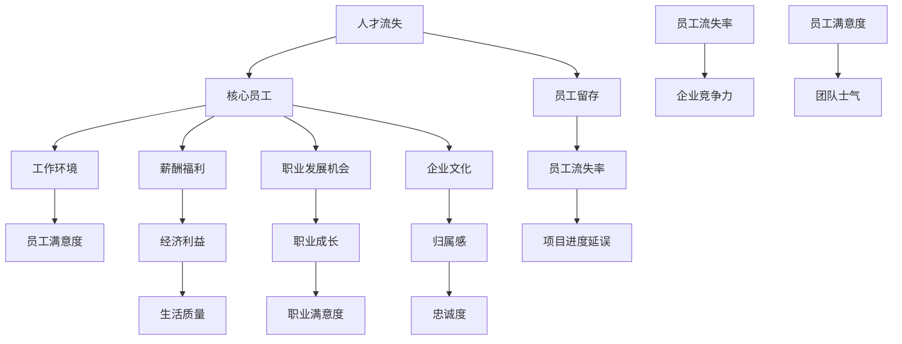

                 

### 文章标题

# 人才留存策略：如何留住核心员工

## 关键词

- 人才留存
- 核心员工
- 员工关系
- 薪酬福利
- 职业发展
- 企业文化
- 项目实战案例

### 摘要

本文旨在探讨如何有效地实施人才留存策略，以留住企业中的核心员工。文章首先介绍了人才流失的背景及其对企业造成的负面影响，随后深入分析了核心员工的重要性。接着，文章从多个角度探讨了影响员工留存的关键因素，包括工作环境、薪酬福利、职业发展机会和企业文化等。最后，通过具体的案例分析和最佳实践分享，提供了一系列实用的方法和技巧，帮助企业打造一个留住核心员工的良好氛围。

## 文章正文

### 引言

在当今竞争激烈的商业环境中，企业的成功与否在很大程度上取决于其能否留住核心员工。随着人才市场的日益成熟，优秀员工的选择范围更加广泛，而企业间的竞争也愈加激烈。人才的流失不仅意味着失去了一位重要的员工，更可能带来一系列负面影响，如项目进度延误、团队士气和效率下降，以及额外的招聘和培训成本等。因此，如何实施有效的留存策略，成为企业领导者和管理者亟待解决的问题。

本文将围绕以下几个方面展开讨论：

1. **人才留存策略的重要性**：介绍人才流失的背景及其对企业造成的负面影响。
2. **核心员工的重要性**：分析核心员工对企业的影响，并探讨如何识别和留住他们。
3. **员工留存的影响因素**：详细讨论影响员工留存的各种因素，包括工作环境、薪酬福利、职业发展机会和企业文化等。
4. **建立有效的员工关系**：探讨如何建立和维护良好的员工关系，增强员工的归属感和忠诚度。
5. **提供有吸引力的薪酬福利**：分析薪酬福利在设计原则、市场薪酬调查及实施策略方面的作用。
6. **个性化职业发展计划**：探讨如何为员工提供个性化的职业发展路径和培训机会。
7. **员工参与与沟通**：分析员工参与的重要性，以及如何通过有效的沟通提升员工满意度。
8. **企业文化建设**：探讨企业文化建设在人才留存中的作用，以及如何塑造和传播企业价值观。
9. **项目实战案例**：通过实际案例分享，展示人才留存策略在不同企业中的成功实践。
10. **最佳实践与小结**：总结最佳实践，提供注意事项和拓展阅读建议。

### 核心概念与联系

在探讨人才留存策略时，我们需要理解以下几个核心概念及其相互关系：

1. **人才流失**：指员工因各种原因离开企业，导致企业人才流失。
2. **核心员工**：指对企业具有关键影响力和贡献的员工。
3. **员工留存**：指企业采取措施减少人才流失，提高员工的留存率。
4. **工作环境**：影响员工工作满意度和留存率的重要因素。
5. **薪酬福利**：影响员工经济利益和生活质量的关键因素。
6. **职业发展机会**：影响员工职业成长和满意度的重要因素。
7. **企业文化**：影响员工归属感和忠诚度的重要因素。

下面是这些概念之间的关系架构 Mermaid 流程图：

### 背景介绍

#### 人才流失的背景

随着全球经济的快速发展，市场竞争日益激烈，企业对人才的需求也在不断增长。然而，人才流失现象也日益严重。据某调查数据显示，全球范围内的人才流失率在过去的五年中持续上升，特别是在科技、金融、医疗等高竞争行业，人才流失问题尤为突出。以下是一些导致人才流失的主要原因：

1. **薪酬福利问题**：许多员工认为他们的薪酬福利与其工作量、工作成绩以及市场水平不符，这可能导致员工的不满和离职意愿。
2. **职业发展机会**：员工在当前企业中看不到明确的职业发展路径，缺乏晋升机会和培训机会，这会导致员工感到迷茫和失望。
3. **工作环境问题**：工作环境不理想，如工作压力过大、人际关系紧张等，会影响员工的工作满意度和留存意愿。
4. **企业文化问题**：企业文化与员工的价值观不符，或者企业缺乏包容性和开放性，会影响员工的归属感和忠诚度。
5. **外部吸引**：其他企业提供了更具吸引力的职位或更高的薪酬待遇，导致员工流失。

#### 企业面临的挑战

1. **人才竞争**：随着人才市场的成熟，优秀员工拥有更多选择的机会，企业需要采取有效策略吸引和留住核心员工。
2. **成本增加**：人才流失不仅意味着失去了一位员工，还涉及额外的招聘、培训和项目交接成本，这会增加企业的运营成本。
3. **项目进度延误**：核心员工的流失可能导致项目进度延误，影响企业的整体运营效率和竞争力。
4. **团队士气下降**：人才的流失可能导致团队士气下降，影响团队的凝聚力和工作效率。

### 核心员工的重要性

核心员工是指那些对企业具有关键影响力和贡献的员工，他们往往是企业的关键业务骨干、技术专家或高级管理人员。以下从多个角度探讨核心员工对企业的重要性：

#### 对业务发展的贡献

1. **技术引领**：核心员工往往拥有较高的技术水平和专业能力，能够推动企业的技术创新和发展。
2. **项目推进**：核心员工在项目中起到关键作用，他们的经验和技术能力有助于确保项目按时、高质量完成。
3. **业务拓展**：核心员工通过其专业技能和市场关系，能够为企业带来新的业务机会和增长点。

#### 对团队的影响

1. **团队领导**：核心员工在团队中往往具有领导力和影响力，能够带动团队氛围和工作效率。
2. **知识传承**：核心员工的经验和技能对团队成员具有示范和指导作用，有助于提高团队的整体能力。
3. **团队凝聚力**：核心员工的稳定存在有助于增强团队的凝聚力和归属感。

#### 对企业文化的塑造

1. **价值观传承**：核心员工往往代表企业的价值观和使命，他们的行为和态度对其他员工具有示范作用。
2. **文化氛围**：核心员工的留存有助于维护企业文化的稳定性和连续性，促进企业文化的传承和发扬。

#### 如何识别核心员工

1. **绩效评估**：通过绩效评估体系，识别那些绩效优秀、贡献突出的员工。
2. **业务关键性**：识别那些在关键业务环节或关键项目中的关键角色。
3. **员工反馈**：通过员工反馈和调查，了解员工心目中的核心员工。
4. **领导评价**：上级领导对员工的评价和反馈，可以作为识别核心员工的参考。

### 员工留存的影响因素

员工留存受多种因素的影响，以下从几个关键方面进行探讨：

#### 工作环境因素

1. **工作氛围**：一个积极、开放和和谐的工作氛围有助于提高员工的工作满意度和忠诚度。
2. **工作压力**：合理的工作压力和压力管理能够激发员工的潜力，但过大的工作压力可能导致员工流失。
3. **工作生活平衡**：企业应关注员工的工作生活平衡，提供灵活的工作安排和福利，以提升员工的满意度和留存意愿。

#### 薪酬福利因素

1. **市场竞争力**：薪酬福利应具有市场竞争力，确保员工在经济上获得合理的回报。
2. **福利待遇**：除了薪酬，企业应提供一系列福利待遇，如医疗保险、年终奖、员工旅游等，以提高员工的满意度和忠诚度。
3. **薪酬结构**：合理的薪酬结构，包括基本工资、绩效奖金和长期激励等，能够激发员工的工作积极性和创造力。

#### 职业发展因素

1. **晋升机会**：企业应提供明确的晋升路径和机会，让员工看到职业发展的前景。
2. **培训和发展**：提供各种培训和发展机会，帮助员工提升技能和知识水平，增强职业竞争力。
3. **职业规划**：与员工共同制定职业规划，确保员工的职业发展与企业的战略方向一致。

#### 企业文化因素

1. **企业价值观**：明确的企业价值观能够吸引和留住与价值观相符的员工。
2. **企业文化活动**：通过举办各类企业文化活动，增强员工的归属感和团队凝聚力。
3. **企业透明度**：企业应保持较高的透明度，让员工感受到企业的公正和诚信，增强信任。

### 建立有效的员工关系

#### 建立信任的重要性

信任是员工关系的基础，也是提高员工满意度和忠诚度的关键。以下是一些方法来建立和维护信任：

1. **透明的沟通**：保持信息的透明和畅通，让员工了解企业的战略方向、业务进展和绩效情况。
2. **尊重员工**：尊重员工的意见和贡献，给予他们足够的决策权和责任感。
3. **公平对待**：在绩效评估、薪酬福利等方面保持公平，避免偏袒和歧视现象。

#### 如何建立有效的沟通机制

1. **定期会议**：定期召开团队会议，让员工有机会表达自己的想法和建议。
2. **开放反馈**：建立开放的反馈机制，鼓励员工提出意见和建议，并对员工的反馈给予及时回应。
3. **个性化沟通**：根据不同员工的特点和需求，采取个性化的沟通方式，提高沟通效果。

#### 跨部门合作与团队建设

1. **跨部门协作**：促进跨部门之间的沟通与合作，打破部门壁垒，提高整体工作效率。
2. **团队建设活动**：通过团队建设活动，增强团队成员之间的了解和信任，提高团队凝聚力。
3. **共同目标**：明确团队的共同目标，让团队成员在共同的目标下协作，增强团队协作精神。

### 提供有吸引力的薪酬福利

#### 薪酬福利设计原则

1. **市场竞争力**：薪酬福利应具备市场竞争力，确保员工的经济利益得到合理保障。
2. **公平性**：薪酬福利应在内部保持公平，避免出现偏袒或歧视现象。
3. **激励性**：薪酬福利应具备激励性，能够激发员工的工作积极性和创造力。
4. **灵活性**：薪酬福利应具有灵活性，以适应不同员工的需求和企业的战略调整。

#### 市场薪酬调查

1. **调查目的**：通过市场薪酬调查，了解行业和市场的薪酬水平，确保企业的薪酬福利具备竞争力。
2. **调查方法**：可以采用问卷调查、访谈、数据分析等方法，获取准确的薪酬数据。
3. **调查内容**：包括基本工资、绩效奖金、长期激励、福利待遇等。

#### 福利项目的设计与实施

1. **医疗保险**：提供全面的医疗保险，减轻员工的医疗费用负担。
2. **年终奖**：根据员工的绩效表现和企业的盈利情况，发放年终奖。
3. **员工旅游**：定期组织员工旅游，增强员工的凝聚力和归属感。
4. **职业培训**：提供各种职业培训课程，帮助员工提升技能和知识水平。
5. **弹性工作制**：根据员工的需求，提供灵活的工作安排，如远程办公、弹性工作时间等。

### 个性化职业发展计划

#### 职业发展路径规划

1. **制定规划**：与员工共同制定职业发展路径规划，明确员工未来的职业发展方向和目标。
2. **岗位轮换**：提供岗位轮换机会，让员工在不同岗位上积累经验，拓宽职业发展空间。
3. **晋升机会**：明确晋升标准和流程，确保员工在表现优秀时能够获得晋升机会。

#### 培训与发展计划

1. **培训需求分析**：通过调查和分析，了解员工的培训需求，制定有针对性的培训计划。
2. **培训内容设计**：根据不同岗位和职业发展阶段，设计多样化的培训内容，包括专业技能培训、管理能力培训等。
3. **培训方式**：采用线上线下结合的方式，提供灵活的培训方式，满足员工的多样化需求。

#### 职业规划与反馈机制

1. **职业规划反馈**：定期对员工的职业规划进行评估和反馈，确保规划的有效性和可行性。
2. **职业发展评估**：通过定期的绩效评估和职业发展评估，了解员工的工作表现和职业发展情况，提供改进建议。
3. **职业发展指导**：提供专业的职业发展指导，帮助员工解决职业发展中的问题和困惑。

### 员工参与与沟通

#### 员工参与的重要性

1. **员工满意度**：员工参与度高，能够提高员工的工作满意度和忠诚度。
2. **团队凝聚力**：员工参与可以增强团队的凝聚力，促进团队成员之间的合作和沟通。
3. **创新思维**：员工参与有助于激发创新思维，提高企业的创新能力和竞争力。

#### 沟通渠道的选择

1. **内部邮件**：适用于正式的、需要广泛传达的信息，如政策通知、工作安排等。
2. **团队会议**：适用于讨论项目进展、解决问题和团队协作，提高沟通效果。
3. **即时通讯工具**：适用于日常的、即时的沟通需求，如工作协调、信息共享等。
4. **意见箱**：提供匿名反馈渠道，让员工能够自由表达意见和建议。

#### 沟通技巧提升

1. **倾听**：认真倾听员工的意见和反馈，尊重员工的观点。
2. **反馈**：给予及时的反馈，让员工了解他们的意见和建议被重视。
3. **非语言沟通**：注意身体语言、表情和语调，提高沟通的效果和亲和力。
4. **情绪管理**：在沟通中保持冷静，避免情绪化的表达，营造积极的沟通氛围。

### 企业文化建设

#### 企业文化的定义与作用

1. **定义**：企业文化是指企业在长期经营过程中形成的一套共同的价值观、信念和行为准则。
2. **作用**：企业文化对员工的行为和态度产生深远影响，有助于提高员工的归属感和忠诚度，增强企业的凝聚力和竞争力。

#### 企业价值观的塑造

1. **价值观的确定**：企业应明确核心价值观，并通过企业使命、愿景和口号等传达给员工。
2. **价值观的传播**：通过企业文化活动、培训和教育等方式，传播和强化核心价值观。
3. **价值观的实践**：企业领导者应率先垂范，践行核心价值观，树立榜样。

#### 企业文化活动的策划与实施

1. **团队建设活动**：通过团队拓展、团建活动等，增强团队成员之间的了解和信任，提高团队凝聚力。
2. **企业文化日**：定期举办企业文化日，让员工了解企业的发展历程、企业文化，增强归属感。
3. **企业精神传承**：通过企业历史、故事和传承活动，传递企业的精神和文化。

### 项目实战案例

#### 案例一：某企业的人才留存策略实践

1. **背景**：某科技公司在人才流失率较高的情况下，决定实施一系列人才留存策略。
2. **策略**：
   - **薪酬福利**：根据市场薪酬调查，调整员工的薪酬水平，并提供有竞争力的福利待遇。
   - **职业发展**：为员工提供明确的职业发展路径，定期进行培训和技能提升。
   - **企业文化**：举办企业文化活动，增强员工的归属感和团队凝聚力。
   - **沟通机制**：建立开放的沟通渠道，鼓励员工表达意见和建议。
3. **效果**：实施人才留存策略后，该公司的员工流失率显著下降，员工的工作满意度和忠诚度得到提高。

#### 案例二：如何通过薪酬福利留住核心员工

1. **背景**：某金融公司在市场竞争中面临核心员工流失的风险。
2. **策略**：
   - **绩效奖金**：设立绩效奖金，根据员工的工作表现进行奖励。
   - **股权激励**：提供股权激励计划，让核心员工分享企业的成长成果。
   - **福利项目**：提供全面的医疗保险、员工旅游和职业培训等福利项目。
3. **效果**：通过薪酬福利的调整，该公司的核心员工流失风险得到有效控制，员工的工作积极性和忠诚度显著提高。

#### 案例三：企业文化建设与员工留存的关系

1. **背景**：某制造企业在发展过程中注重企业文化建设，以留住核心员工。
2. **策略**：
   - **价值观传递**：通过企业文化的宣传和培训，让员工深刻理解企业的价值观。
   - **企业文化活动**：举办各类企业文化活动，增强员工的归属感和团队凝聚力。
   - **员工参与**：鼓励员工参与企业决策和活动，提高他们的参与度和满意度。
3. **效果**：通过企业文化建设，该公司的员工流失率明显下降，员工的工作满意度和忠诚度得到提高，企业的凝聚力进一步增强。

### 最佳实践与小结

#### 最佳实践

1. **建立信任**：通过透明的沟通和公平的待遇建立信任，提高员工的满意度和忠诚度。
2. **提供有吸引力的薪酬福利**：根据市场水平和员工需求，设计有竞争力的薪酬福利，确保经济利益的合理回报。
3. **个性化职业发展计划**：根据员工的兴趣和能力，制定个性化的职业发展路径和培训计划。
4. **有效的员工参与与沟通**：建立开放的沟通渠道，鼓励员工参与企业决策，提高参与度和满意度。
5. **企业文化建设**：塑造和传播企业价值观，通过文化活动增强员工的归属感和凝聚力。

#### 小结

人才留存是企业可持续发展的重要保障。通过建立信任、提供有吸引力的薪酬福利、个性化职业发展计划、有效的员工参与与沟通以及企业文化建设等措施，企业可以有效地留住核心员工，提高员工的工作满意度和忠诚度，从而增强企业的凝聚力和竞争力。

### 注意事项

1. **制定策略时，充分考虑企业实际情况和员工需求，避免一刀切**。
2. **持续关注员工反馈，及时调整留存策略，确保其有效性**。
3. **平衡短期和长期利益，避免过度依赖某一种留存手段**。

### 拓展阅读

1. **《员工留存策略：实战指南》**：详细介绍如何制定和实施有效的员工留存策略。
2. **《薪酬福利设计与管理》**：深入探讨薪酬福利的设计原则和管理方法。
3. **《企业文化塑造与传播》**：探讨企业文化的重要性及其塑造和传播的方法。

### 结语

留住核心员工是企业的重要任务，通过有效的留存策略，企业可以提升员工的工作满意度和忠诚度，增强企业的凝聚力和竞争力。希望本文提供的理论和实践方法能够对您的企业人才留存工作有所启示和帮助。

### 作者信息

作者：AI天才研究院/AI Genius Institute & 禅与计算机程序设计艺术/Zen And The Art of Computer Programming

