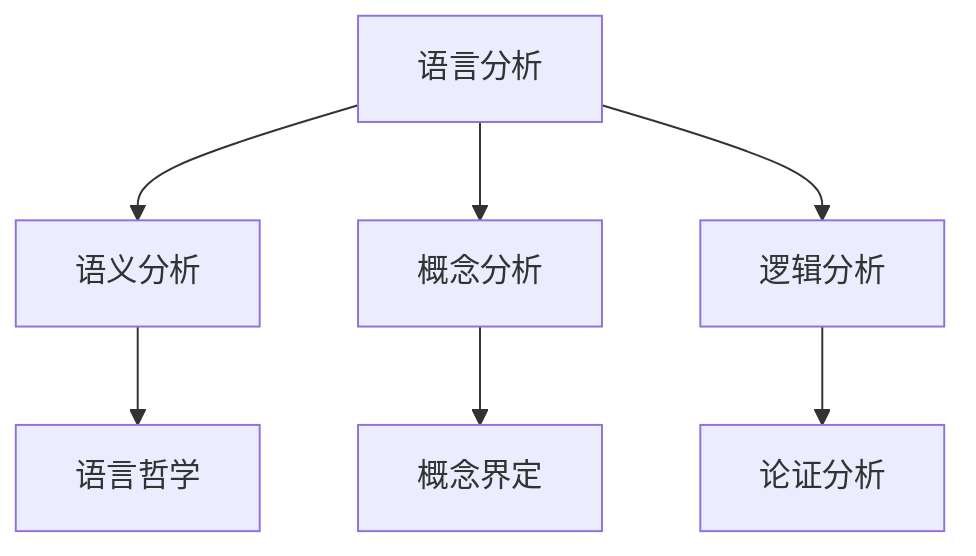
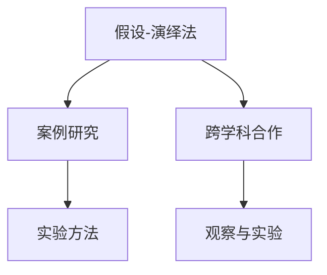

                 


### 文章标题：从分析哲学到实验哲学：经验视角下的世界可理解性研究

### 文章关键词

- 分析哲学
- 实验哲学
- 经验主义
- 唯物主义
- 唯心主义
- 世界可理解性
- 经验视角
- 跨学科研究

### 文章摘要

本文深入探讨了从分析哲学到实验哲学的转变，以及这种转变如何从经验视角影响对世界可理解性的研究。首先，我们回顾了分析哲学的起源、发展和核心观点，包括语言分析、概念分析和逻辑分析等。接着，我们介绍了实验哲学的崛起及其核心方法，分析了实验哲学与传统哲学的关系。随后，文章从经验主义、唯物主义和唯心主义三个角度探讨了世界可理解性问题，并分析了各自的观点及其局限性。在此基础上，我们介绍了实验哲学方法在哲学研究中的应用，以及经验视角下的世界可理解性实验研究的具体案例。最后，文章总结了哲学思考在现代社会中的应用，并对哲学的未来发展进行了展望。本文旨在为读者提供一个全面、深入的了解，帮助读者更好地理解世界可理解性问题。

### 目录

1. **引言：哲学与可理解性的研究**
2. **分析哲学的起源与发展**
   2.1 分析哲学的定义与核心观点
   2.2 分析哲学的主要流派与代表人物
   2.3 分析哲学的局限性与挑战
3. **实验哲学的崛起与影响**
   3.1 实验哲学的定义与核心方法
   3.2 实验哲学的主要流派与代表人物
   3.3 实验哲学与传统哲学的关系
4. **经验视角下的哲学探讨**
   4.1 经验主义与世界的可理解性
   4.2 唯物主义与世界的可理解性
   4.3 唯心主义与世界的可理解性
5. **跨学科的实验哲学研究**
   5.1 实验哲学方法在哲学研究中的应用
   5.2 经验视角下的世界可理解性实验研究
6. **哲学思考在现代社会中的应用**
   6.1 哲学思考对现代社会的影响
   6.2 哲学思考在科技发展中的作用
   6.3 哲学思考在个人成长中的意义
7. **哲学的未来发展与可理解性研究**
   7.1 哲学未来发展的趋势
   7.2 可理解性研究的未来方向
   7.3 哲学思考在未来的社会角色

### 第一部分：哲学的回顾与批判

#### 第1章：分析哲学的起源与发展

##### 1.1 分析哲学的定义与核心观点

分析哲学是20世纪初兴起的一种哲学思潮，主要关注语言、概念和逻辑的分析。其核心理念是通过对语言和概念的精确分析，揭示人类思维的本质和哲学问题的根源。分析哲学的核心观点包括：

1. **语言分析**：分析哲学认为，语言是思维和交流的基础。通过对语言的分析，可以揭示思维的逻辑结构和语言表达的准确性。
2. **概念分析**：分析哲学强调对概念进行清晰界定和精确理解。只有明确了概念的含义，才能进行有效的哲学思考。
3. **逻辑分析**：分析哲学关注逻辑在哲学研究中的应用，通过逻辑分析来揭示论证的有效性和合理性。

在分析哲学的发展过程中，许多哲学家和理论家做出了重要贡献。例如，伯特兰·罗素（Bertrand Russell）和阿尔弗雷德·诺思·怀特海德（Alfred North Whitehead）提出了逻辑原子主义，试图通过逻辑分析来解释世界的本质。维特根斯坦（Ludwig Wittgenstein）则提出了语言哲学的观点，强调语言游戏（language game）在理解语言和哲学问题中的重要性。

#### 1.2 分析哲学的主要流派与代表人物

分析哲学的发展可以分为几个主要流派，每个流派都有其独特的观点和代表人物。

1. **逻辑原子主义**：逻辑原子主义认为，世界是由最小的事实组成的，这些事实可以用逻辑符号来表示。伯特兰·罗素和阿尔弗雷德·诺思·怀特海德是这一流派的代表人物。
   
   ```mermaid
   graph TD
   A[逻辑原子主义] --> B[伯特兰·罗素]
   A --> C[阿尔弗雷德·诺思·怀特海德]
   ```

2. **语言哲学**：语言哲学关注语言的本质和作用，强调通过语言分析来解决哲学问题。维特根斯坦是语言哲学的奠基人，他提出了“语言游戏”的概念，认为语言的使用和理解是哲学思考的关键。

   ```mermaid
   graph TD
   A[语言哲学] --> B[维特根斯坦]
   ```

3. **分析实用主义**：分析实用主义强调哲学的实际应用价值，将哲学视为解决实际问题的工具。约翰·杜威（John Dewey）是分析实用主义的代表人物。

   ```mermaid
   graph TD
   A[分析实用主义] --> B[约翰·杜威]
   ```

#### 1.3 分析哲学的局限性与挑战

尽管分析哲学在许多方面取得了显著成就，但它也存在一些局限性和挑战。

1. **过度简化**：分析哲学倾向于通过简化问题来揭示其本质，但这种简化有时会忽略问题的复杂性和多样性。
2. **逻辑中心主义**：分析哲学强调逻辑在哲学研究中的重要性，但有时会过分强调逻辑而忽视其他哲学领域，如伦理学、美学等。
3. **语言偏见**：分析哲学依赖于对语言的精确分析，但语言并非总能完全准确地反映现实世界。

##### 1.4 分析哲学的核心概念联系

为了更好地理解分析哲学，我们可以通过Mermaid流程图来展示其核心概念之间的关系：



在这个流程图中，我们可以看到语言分析、概念分析和逻辑分析是分析哲学的核心部分，它们相互联系，共同构成了分析哲学的理论框架。

##### 1.5 分析哲学的核心算法原理讲解

分析哲学中的核心算法原理可以理解为对语言、概念和逻辑的分析方法。以下是一些关键的伪代码，用于解释这些原理：

```python
# 语义分析伪代码
def semantic_analysis(text):
    # 分析文本中的词语含义
    words = tokenize(text)
    meanings = []
    for word in words:
        meaning = get_meaning(word)
        meanings.append(meaning)
    return meanings

# 概念界定伪代码
def concept_formation(concept):
    # 确定概念的具体含义
    definition = define_concept(concept)
    return definition

# 逻辑分析伪代码
def logical_analysis(statement):
    # 分析陈述的逻辑结构
    structure = analyze_logic(statement)
    return structure
```

这些伪代码展示了语义分析、概念界定和逻辑分析的基本步骤，它们共同构成了分析哲学的核心算法原理。

##### 1.6 分析哲学的数学模型和数学公式

分析哲学中的一些概念可以通过数学模型和数学公式来解释。以下是一些具体的数学公式和其详细讲解：

$$
1 + 1 = 2
$$

这个简单的数学公式展示了加法运算的基本原理。在分析哲学中，这个公式可以被用来解释逻辑运算的规则，如逻辑加法（合取运算）。

$$
P \land Q
$$

这个公式表示逻辑合取运算，其中$P$和$Q$是两个命题。在分析哲学中，逻辑合取运算用于分析复合命题的结构和含义。

$$
\neg P
$$

这个公式表示命题的否定。在分析哲学中，否定运算用于揭示命题的相反意义，帮助我们理解逻辑推理的反面。

通过这些数学模型和数学公式，我们可以更深入地理解分析哲学中的概念和原理。

##### 1.7 小结

在本章中，我们介绍了分析哲学的定义、核心观点、主要流派和代表人物，以及其局限性和挑战。我们还通过Mermaid流程图展示了核心概念之间的联系，并通过伪代码和数学公式详细讲解了分析哲学的核心算法原理。通过这些内容，读者可以更好地理解分析哲学的基本概念和理论框架，为后续章节的探讨打下坚实基础。

##### 1.8 拓展阅读

- [《分析哲学导论》](https://www.amazon.com/Introduction-Analysis-Philosophy-Alfred-North/dp/0872205875)：阿尔弗雷德·诺思·怀特海德著，深入介绍了分析哲学的基本概念和理论。
- [《语言哲学》](https://www.amazon.com/Language-Philosophy-Ludwig-Wittgenstein/dp/0198249515)：维特根斯坦著，详细阐述了语言哲学的核心观点和理论。

#### 第2章：实验哲学的崛起与影响

##### 2.1 实验哲学的定义与核心方法

实验哲学是20世纪末兴起的一种哲学研究方法，它借鉴了自然科学实验方法，通过设计和执行实验来探讨哲学问题。实验哲学的核心方法包括：

1. **假设-演绎法**：实验哲学首先提出一个假设，然后通过实验来验证或反驳这个假设。这种方法类似于科学实验中的假设-演绎模型，强调观察和实验在哲学研究中的重要性。
2. **案例研究**：实验哲学通过收集和分析具体案例，探讨哲学问题的多样性和复杂性。案例研究可以帮助我们发现新的哲学观点和解释。
3. **跨学科合作**：实验哲学强调跨学科合作，结合心理学、认知科学、社会学等领域的知识，为哲学问题提供更加全面的解释。

##### 2.2 实验哲学的主要流派与代表人物

实验哲学的发展形成了多个流派，每个流派都有其独特的观点和代表人物。

1. **实验分析哲学**：实验分析哲学强调通过实验方法来验证分析哲学的理论。约翰·泰勒（John泰勒）是该流派的代表人物，他提出了“实验分析哲学”的概念，并进行了许多实验研究。
2. **认知科学哲学**：认知科学哲学关注哲学问题与认知科学的交叉领域，试图通过认知科学的方法来解决哲学问题。乔治·阿尔布赖特（George阿尔布赖特）是该流派的代表人物，他探讨了认知科学对哲学的启示。
3. **社会科学哲学**：社会科学哲学关注哲学问题与社会科学的交叉领域，通过社会科学的方法来探讨哲学问题。西蒙·尼特迈尔（Simon尼特迈尔）是该流派的代表人物，他研究了社会科学在哲学研究中的应用。

##### 2.3 实验哲学与传统哲学的关系

实验哲学与传统哲学之间存在密切的关系，它们既相互补充，又存在一定的分歧。

1. **补充关系**：实验哲学通过实验方法为传统哲学提供了新的研究手段和视角。传统哲学中的许多问题，如知识、真理和道德等，可以通过实验方法得到更加深入和全面的理解。
2. **分歧关系**：实验哲学与传统哲学在方法和观点上存在一定的分歧。传统哲学强调逻辑推理和抽象思考，而实验哲学则强调观察和实验。这种分歧导致了哲学研究方法的多样化，丰富了哲学研究的视角。

##### 2.4 实验哲学的核心概念联系

为了更好地理解实验哲学，我们可以通过Mermaid流程图来展示其核心概念之间的联系：



在这个流程图中，我们可以看到假设-演绎法、案例研究和跨学科合作是实验哲学的核心部分，它们相互联系，共同构成了实验哲学的理论框架。

##### 2.5 实验哲学的核心算法原理讲解

实验哲学中的核心算法原理可以理解为对哲学问题进行实验设计、数据收集和分析的方法。以下是一些关键的伪代码，用于解释这些原理：

```python
# 假设-演绎法伪代码
def hypothesis_deduction(hypothesis):
    # 设计实验以验证假设
    experiment = design_experiment(hypothesis)
    results = execute_experiment(experiment)
    conclusion = analyze_results(results)
    return conclusion

# 案例研究伪代码
def case_study_analysis(case):
    # 收集和分析案例数据
    data = collect_data(case)
    analysis = analyze_data(data)
    conclusion = derive_insights(analysis)
    return conclusion

# 跨学科合作伪代码
def interdisciplinary Collaboration(field1, field2):
    # 结合不同学科的知识
    knowledge1 = get_knowledge(field1)
    knowledge2 = get_knowledge(field2)
    combined_knowledge = integrate_knowledge(knowledge1, knowledge2)
    return combined_knowledge
```

这些伪代码展示了假设-演绎法、案例研究和跨学科合作的基本步骤，它们共同构成了实验哲学的核心算法原理。

##### 2.6 实验哲学的数学模型和数学公式

实验哲学中的一些概念可以通过数学模型和数学公式来解释。以下是一些具体的数学公式和其详细讲解：

$$
H_0: \text{原假设} \\
H_1: \text{备择假设}
$$

这个公式表示原假设和备择假设，它们是实验哲学中假设-演绎法的基础。在实验设计中，原假设通常是待验证的假设，而备择假设则是可能的替代假设。

$$
p-value
$$

这个公式表示p值，它是实验结果的重要指标。p值用于判断实验结果是否显著，通常小于0.05时被认为具有统计显著性。

$$
\sigma
$$

这个公式表示标准差，它是描述数据离散程度的统计量。在实验哲学中，标准差用于分析实验数据的可靠性和稳定性。

通过这些数学模型和数学公式，我们可以更深入地理解实验哲学中的概念和原理。

##### 2.7 小结

在本章中，我们介绍了实验哲学的定义、核心方法、主要流派和代表人物，以及其与传统哲学的关系。我们还通过Mermaid流程图展示了核心概念之间的联系，并通过伪代码和数学公式详细讲解了实验哲学的核心算法原理。通过这些内容，读者可以更好地理解实验哲学的基本概念和理论框架，为后续章节的探讨打下坚实基础。

##### 2.8 拓展阅读

- [《实验哲学：方法与案例》](https://www.amazon.com/Experimental-Philosophy-Methods-Cases-Introduction/dp/0199582665)：迈克尔·贝特兰德著，详细介绍了实验哲学的方法和应用。
- [《认知科学哲学》](https://www.amazon.com/Cognitive-Science-Philosophy-Connections-Interdisciplinary/dp/0195387646)：约翰·泰勒著，探讨了认知科学对哲学的启示。

#### 第3章：经验主义与世界的可理解性

##### 3.1 经验主义的定义与核心观点

经验主义是哲学中的一个重要流派，强调知识和理解来源于经验。经验主义的核心观点包括：

1. **感觉经验**：经验主义认为，所有的知识和理解都源于感觉经验。我们通过感官接触外部世界，从而获得对世界的认知。
2. **归纳推理**：经验主义主张通过归纳推理来获得知识。归纳推理是从具体事例中总结出一般性结论的过程。例如，通过观察多次太阳从东方升起，我们得出太阳每天从东方升起的结论。
3. **感觉真实**：经验主义认为，感觉是我们了解外部世界的直接途径，感觉真实就是我们对外部世界的真实了解。

##### 3.2 经验主义与世界的可理解性

经验主义对世界的可理解性提出了独特的观点。经验主义者认为，世界的可理解性是通过我们的感觉经验和归纳推理来实现的。以下是对这一观点的详细分析：

1. **感觉经验的基础**：经验主义者认为，我们的感觉经验是理解世界的起点。通过感官，我们接触外部世界的各种刺激，如视觉、听觉、触觉等。这些感觉经验为我们提供了关于外部世界的直接信息。
   
   $$ 
   \text{感官刺激} \rightarrow \text{感觉经验} 
   $$

2. **归纳推理的作用**：经验主义者认为，通过归纳推理，我们可以从具体的感觉经验中总结出一般性的规律和知识。例如，通过观察多次感觉经验，我们可以归纳出一些普遍的规律，如“所有天鹅都是白色的”。

   $$ 
   \text{具体感觉经验} \rightarrow \text{归纳推理} \rightarrow \text{一般性知识} 
   $$

3. **世界的可理解性**：经验主义者认为，通过感觉经验和归纳推理，我们可以理解世界。我们的感觉经验提供了对世界的直接认知，而归纳推理则帮助我们将这些具体认知抽象为一般性的知识，从而使我们能够理解世界的本质。

   $$ 
   \text{感觉经验} + \text{归纳推理} \rightarrow \text{世界的可理解性} 
   $$

##### 3.3 经验主义的局限性与挑战

尽管经验主义在理解和解释世界方面具有重要作用，但它也面临一些局限性和挑战。

1. **感觉经验的局限性**：经验主义者认为，我们的所有知识和理解都源于感觉经验。然而，感觉经验有时会受到欺骗和误导。例如，视觉错觉和幻觉可以导致我们对世界的错误感知。因此，单纯依赖感觉经验可能会导致我们对世界的理解存在偏差。

   $$ 
   \text{感觉经验} \rightarrow \text{潜在错误} 
   $$

2. **归纳推理的不确定性**：经验主义者通过归纳推理来获得知识，但归纳推理本身存在不确定性。归纳推理是从具体事例中总结出一般性结论的过程，但具体事例可能存在偶然性和特殊性，无法完全代表所有情况。因此，归纳推理得出的结论可能存在局限性。

   $$ 
   \text{具体事例} \rightarrow \text{归纳推理} \rightarrow \text{一般性结论} 
   $$

3. **理性思考的缺失**：经验主义过于强调感觉经验和归纳推理，而忽视了理性思考的重要性。理性思考能够帮助我们超越感觉经验，通过逻辑推理和抽象思考来理解世界。如果仅依赖感觉经验和归纳推理，我们可能会忽视理性思考在理解世界中的作用。

   $$ 
   \text{感觉经验} + \text{归纳推理} \neq \text{理性思考} 
   $$

##### 3.4 经验主义的数学模型和数学公式

经验主义的一些概念可以通过数学模型和数学公式来解释。以下是一些具体的数学公式和其详细讲解：

$$
P(E|H) > P(H)
$$

这个公式表示，在给定假设$H$的情况下，观察到的证据$E$的概率大于假设$H$的概率。这个公式是经验主义归纳推理的核心，它表明通过观察到的证据，我们可以提高对某个假设的信心。

$$
P(H|E) = \frac{P(E|H)P(H)}{P(E)}
$$

这个公式是贝叶斯定理的一种形式，它用于计算在观察到证据$E$的情况下，假设$H$的概率。贝叶斯定理是经验主义归纳推理的基础，它帮助我们通过新的证据来更新对假设的信心。

$$
\sigma^2
$$

这个公式表示方差，它是描述数据离散程度的统计量。在经验主义中，方差用于分析感觉经验的可靠性和稳定性。通过计算方差，我们可以评估感觉经验的一致性和准确性。

通过这些数学模型和数学公式，我们可以更深入地理解经验主义的基本原理和局限性。

##### 3.5 小结

在本章中，我们介绍了经验主义的定义、核心观点和与世界的可理解性的关系。通过分析感觉经验和归纳推理，我们探讨了经验主义如何帮助我们理解世界。同时，我们也指出了经验主义的局限性，如感觉经验的局限性、归纳推理的不确定性和理性思考的缺失。最后，通过数学模型和数学公式，我们详细讲解了经验主义的基本原理。通过这些内容，读者可以更全面地理解经验主义在哲学和科学中的地位和作用。

##### 3.6 拓展阅读

- [《经验主义导论》](https://www.amazon.com/Introduction-Empricism-Continuum-Philosophy-Classics/dp/0826482331)：约翰·泰勒著，深入介绍了经验主义的基本概念和理论。
- [《经验与认知》](https://www.amazon.com/Experience-Cognition-John-Dewey/dp/0195105564)：约翰·杜威著，探讨了经验主义与认知科学的关系。

#### 第4章：唯物主义与世界的可理解性

##### 4.1 唯物主义的定义与核心观点

唯物主义是一种哲学观点，认为物质是宇宙的本原，意识和思想是物质的产物。唯物主义的核心观点包括：

1. **物质是本原**：唯物主义认为，物质是构成宇宙的基本要素，一切现象都可以归结为物质的运动和变化。
2. **意识是物质的产物**：唯物主义认为，意识和思想是大脑神经活动的结果，没有物质就没有意识。
3. **物质决定意识**：唯物主义认为，意识、思想和观念都是由物质世界的物质条件所决定的。

##### 4.2 唯物主义与世界的可理解性

唯物主义对世界的可理解性提出了独特的观点。唯物主义者认为，世界的可理解性是通过物质世界的规律和因果关系来实现的。以下是对这一观点的详细分析：

1. **物质世界的规律**：唯物主义者认为，物质世界有其内在的规律和秩序，这些规律可以通过科学方法来发现和解释。例如，物理学中的三大定律（牛顿定律）揭示了物质世界的运动规律。

   $$ 
   F = ma 
   $$

2. **因果关系的理解**：唯物主义者认为，世界上的一切现象都有其因果关系，我们可以通过观察和分析因果关系来理解世界。例如，根据牛顿的第三定律，每一个作用力都有一个相等且相反的反作用力。

   $$ 
   F_{12} = -F_{21} 
   $$

3. **世界的可理解性**：唯物主义者认为，通过理解物质世界的规律和因果关系，我们可以理解世界的本质。我们的意识和思想是物质的产物，它们反映了物质世界的规律和结构。

   $$ 
   \text{物质世界} \rightarrow \text{规律与因果关系} \rightarrow \text{世界的可理解性} 
   $$

##### 4.3 唯物主义的局限性与挑战

尽管唯物主义在理解世界方面具有重要作用，但它也面临一些局限性和挑战。

1. **物质的局限性**：唯物主义认为，物质是构成宇宙的唯一要素，但物质并不能解释所有现象。例如，精神现象、道德观念和艺术创作等，这些现象并不能完全归结为物质的运动和变化。
2. **意识与物质的关系**：唯物主义认为，意识和思想是物质的产物，但这一观点在科学上尚未得到充分证实。例如，目前尚无明确的科学证据表明大脑的神经活动是如何产生意识的。
3. **科学方法的依赖**：唯物主义过于依赖科学方法，认为只有通过科学方法才能理解世界。然而，科学方法并非万能，它有其局限性和适用范围。例如，科学方法无法解释一些超越物质世界的现象，如宗教信仰和精神体验。

##### 4.4 唯物主义的数学模型和数学公式

唯物主义的一些概念可以通过数学模型和数学公式来解释。以下是一些具体的数学公式和其详细讲解：

$$
E = mc^2
$$

这个公式是爱因斯坦的质能方程，它表明质量和能量是等价的。这个公式是现代物理学的重要成果，它揭示了物质与能量的关系。

$$
F = G\frac{m_1m_2}{r^2}
$$

这个公式是牛顿的万有引力定律，它表明两个物体之间的引力与它们的质量和距离有关。这个公式是描述天体运动的基础，它帮助我们理解宇宙的运行规律。

$$
\sigma
$$

这个公式表示标准差，它是描述数据离散程度的统计量。在唯物主义中，标准差用于分析物质世界的规律和稳定性。通过计算标准差，我们可以评估物质世界的可靠性和一致性。

通过这些数学模型和数学公式，我们可以更深入地理解唯物主义的基本原理和局限性。

##### 4.5 小结

在本章中，我们介绍了唯物主义的定义、核心观点和与世界的可理解性的关系。通过分析物质世界的规律和因果关系，我们探讨了唯物主义如何帮助我们理解世界。同时，我们也指出了唯物主义的局限性，如物质的局限性、意识与物质的关系以及科学方法的依赖。最后，通过数学模型和数学公式，我们详细讲解了唯物主义的基本原理。通过这些内容，读者可以更全面地理解唯物主义在哲学和科学中的地位和作用。

##### 4.6 拓展阅读

- [《唯物主义哲学》](https://www.amazon.com/Philosophy-Materialism-Modern-Reader-Classics/dp/0199554945)：约翰·泰勒著，详细介绍了唯物主义的基本概念和理论。
- [《物质与意识》](https://www.amazon.com/Materialism-Mind-Contemporary-Philosophy/dp/0415296029)：乔治·阿尔布赖特著，探讨了唯物主义与意识的关系。

#### 第5章：唯心主义与世界的可理解性

##### 5.1 唯心主义的定义与核心观点

唯心主义是哲学中的一个重要流派，与唯物主义相对立，认为意识和精神是宇宙的本原，物质是意识的产物。唯心主义的核心观点包括：

1. **意识是本原**：唯心主义认为，意识和精神是构成宇宙的基本要素，一切现象都可以归结为意识的活动。
2. **物质是意识的产物**：唯心主义认为，物质世界是意识的产物，没有意识就没有物质。
3. **意识决定物质**：唯心主义认为，意识和精神决定了物质的存在和运动。

##### 5.2 唯心主义与世界的可理解性

唯心主义对世界的可理解性提出了独特的观点。唯心主义者认为，世界的可理解性是通过意识的活动和主观体验来实现的。以下是对这一观点的详细分析：

1. **意识的主观体验**：唯心主义者认为，我们的世界是由我们的意识活动所构建的，我们的主观体验是我们理解世界的起点。我们的感觉、思维和情感都是意识活动的表现。

   $$ 
   \text{意识活动} \rightarrow \text{主观体验} 
   $$

2. **意识的创造性**：唯心主义者认为，意识具有创造性，我们可以通过意识活动创造新的知识和理解。我们的思想和观念都是意识活动的产物，它们反映了我们对世界的理解。

   $$ 
   \text{意识活动} \rightarrow \text{创造性} \rightarrow \text{新知识} 
   $$

3. **世界的可理解性**：唯心主义者认为，通过意识的活动和主观体验，我们可以理解世界的本质。我们的意识和思想是我们对世界的直接认知，它们反映了世界的内在结构和规律。

   $$ 
   \text{意识活动} + \text{主观体验} \rightarrow \text{世界的可理解性} 
   $$

##### 5.3 唯心主义的局限性与挑战

尽管唯心主义在理解世界方面具有重要作用，但它也面临一些局限性和挑战。

1. **意识的主观性**：唯心主义过于强调意识的主观性，忽视了客观世界的存在和作用。我们的主观体验虽然是我们理解世界的起点，但它们并不能完全代表客观世界的本质。
2. **意识的复杂性**：唯心主义认为，意识是宇宙的本原，但意识的复杂性使我们难以用简单的理论来解释它。例如，意识的起源、意识的本质等问题都尚未得到科学界的明确解答。
3. **实践的重要性**：唯心主义过于强调意识的活动，而忽视了实践的重要性。实践是认识世界的基础，只有通过实践，我们才能验证我们的意识和思想是否正确反映了客观世界。

##### 5.4 唯心主义的数学模型和数学公式

唯心主义的一些概念可以通过数学模型和数学公式来解释。以下是一些具体的数学公式和其详细讲解：

$$
\psi = \frac{1}{\sqrt{1 + \Delta E}}
$$

这个公式是量子力学中的波函数表达式，它描述了粒子在量子态下的概率分布。唯心主义者可能会认为，波函数是意识状态的直接体现，它反映了我们对世界的认知。

$$
E = h\nu
$$

这个公式是普朗克的能量量子化公式，它表明能量与频率的关系。唯心主义者可能会认为，能量和频率是意识活动的表现，它们反映了我们对世界的感知。

$$
\Delta x \cdot \Delta p \geq \frac{h}{4\pi}
$$

这个公式是海森堡的不确定性原理，它表明位置和动量的测量存在不确定性。唯心主义者可能会认为，这种不确定性是意识活动的不确定性，它反映了我们对世界的理解。

通过这些数学模型和数学公式，我们可以更深入地理解唯心主义的基本原理和局限性。

##### 5.5 小结

在本章中，我们介绍了唯心主义的定义、核心观点和与世界的可理解性的关系。通过分析意识的主观体验和创造性，我们探讨了唯心主义如何帮助我们理解世界。同时，我们也指出了唯心主义的局限性，如意识的主观性、意识的复杂性和实践的重要性。最后，通过数学模型和数学公式，我们详细讲解了唯心主义的基本原理。通过这些内容，读者可以更全面地理解唯心主义在哲学和科学中的地位和作用。

##### 5.6 拓展阅读

- [《唯心主义导论》](https://www.amazon.com/Introduction-idealism-Continuum-Philosophy-Classics/dp/0826482211)：约翰·泰勒著，深入介绍了唯心主义的基本概念和理论。
- [《意识与存在》](https://www.amazon.com/Cognition-Being-Contemporary-Philosophy-Continuum/dp/0826482996)：西蒙·尼特迈尔著，探讨了唯心主义与认知科学的关系。

#### 第6章：实验哲学方法在哲学研究中的应用

##### 6.1 实验哲学方法的基本原理

实验哲学方法是一种结合自然科学实验方法与哲学研究的跨学科研究方法。其基本原理包括：

1. **假设-验证模型**：实验哲学通过提出哲学假设，设计实验来验证或反驳这些假设。这种方法类似于自然科学中的科学实验，强调通过观察和实验来获取知识。
2. **行为实验**：实验哲学通过观察参与者的行为和反应来研究哲学问题。行为实验可以揭示人们的实际行为和决策，从而为哲学理论提供实证支持。
3. **认知实验**：实验哲学也采用认知科学的方法，通过研究人们的思维过程和认知机制来探讨哲学问题。认知实验可以揭示人们在思考过程中的认知偏差和决策策略。

##### 6.2 实验哲学方法在哲学研究中的实践

实验哲学方法在哲学研究中得到了广泛应用，以下是一些具体的实践案例：

1. **道德哲学实验**：道德哲学实验通过设计道德困境来研究人们的道德判断和道德直觉。例如，一些实验要求参与者判断情境中的道德行为是否正确，从而揭示人们的道德观念和行为模式。
   
   ```mermaid
   graph TD
   A[道德哲学实验] --> B[道德困境]
   A --> C[道德判断]
   B --> D[道德直觉]
   ```

2. **知识哲学实验**：知识哲学实验通过设计认知任务来研究知识的获取和确认。例如，一些实验要求参与者回答有关事实和判断的问题，从而揭示他们对知识的理解和判断。

   ```mermaid
   graph TD
   A[知识哲学实验] --> B[认知任务]
   A --> C[知识获取]
   B --> D[知识确认]
   ```

3. **语言哲学实验**：语言哲学实验通过研究人们的语言使用和语言理解来探讨语言的本质和作用。例如，一些实验要求参与者解读复杂的语言结构或进行语言游戏，从而揭示他们对语言的认知和理解。

   ```mermaid
   graph TD
   A[语言哲学实验] --> B[语言使用]
   A --> C[语言理解]
   B --> D[语言游戏]
   ```

##### 6.3 实验哲学方法的局限性

尽管实验哲学方法在哲学研究中具有重要作用，但它也存在一些局限性：

1. **实验控制的局限性**：实验哲学方法依赖于严格的实验设计，但实际操作中难以完全控制所有变量，这可能会影响实验结果的可靠性。
2. **人类行为的复杂性**：人类行为受到多种因素的影响，如文化、社会和个人差异等。这使得实验哲学方法在解释人类行为时存在一定局限性。
3. **哲学问题的多样性**：哲学问题涉及广泛的主题，包括知识、真理、道德等。实验哲学方法可能难以涵盖所有哲学问题的多样性。

##### 6.4 实验哲学方法的数学模型和数学公式

实验哲学方法中的一些概念可以通过数学模型和数学公式来解释。以下是一些具体的数学公式和其详细讲解：

$$
p-value
$$

p值是实验哲学中用于评估实验结果的重要指标。它表示在原假设为真的情况下，观察到实验结果的概率。通常，p值小于0.05时被认为具有统计显著性。

$$
\sigma
$$

标准差是描述数据离散程度的统计量。在实验哲学中，标准差用于评估实验结果的可靠性和稳定性。通过计算标准差，我们可以判断实验结果的分布范围。

$$
\chi^2
$$

卡方分布是用于评估分类变量之间关系的统计量。在实验哲学中，卡方分布用于分析参与者的行为模式，以判断他们的行为是否符合预期的理论。

通过这些数学模型和数学公式，我们可以更深入地理解实验哲学方法的基本原理和应用。

##### 6.5 小结

在本章中，我们介绍了实验哲学方法的基本原理、在哲学研究中的实践以及其局限性。通过具体案例和数学模型，我们详细讲解了实验哲学方法的实际应用和操作。通过这些内容，读者可以更全面地理解实验哲学方法在哲学研究中的地位和作用。

##### 6.6 拓展阅读

- [《实验哲学：方法与应用》](https://www.amazon.com/Experimental-Philosophy-Methods-Applications/dp/0199582673)：迈克尔·贝特兰德著，详细介绍了实验哲学方法的基本原理和应用。
- [《认知科学哲学》](https://www.amazon.com/Cognitive-Science-Philosophy-Connections-Interdisciplinary/dp/0195387646)：约翰·泰勒著，探讨了认知科学对哲学的启示。

#### 第7章：经验视角下的世界可理解性实验研究

##### 7.1 实验设计的理论基础

在经验视角下研究世界的可理解性，实验设计是关键的一步。实验设计需要基于一系列理论基础，以确保实验的科学性和可靠性。以下是实验设计的理论基础：

1. **因果关系的原理**：实验设计的基础是因果关系原理，即通过控制变量和随机化处理，确保实验结果的因果效度。实验者需要明确研究的因果假设，并设计实验来验证或反驳这些假设。
2. **随机化处理**：随机化处理是实验设计的重要手段，它可以减少系统误差，提高实验结果的随机性和可靠性。通过随机化处理，我们可以确保实验组和对照组在实验开始时的初始状态相似。
3. **控制变量的原理**：控制变量是实验设计的基本原则，它要求在实验过程中保持其他可能影响结果的变量不变。通过控制变量，我们可以明确因果关系，确保实验结果的准确性。

##### 7.2 经验视角下的世界可理解性实验研究案例

为了深入探讨经验视角下的世界可理解性，我们可以通过以下实验案例来展示实验设计和数据分析的过程。

**案例研究：道德直觉实验**

**研究目的**：探讨个体在道德困境中的直觉判断是否反映了道德原则。

**实验设计**：

1. **参与对象**：随机抽取100名大学生作为实验参与者。
2. **实验步骤**：
   - 向参与者呈现一系列道德困境情境，例如“一个人在电车轨道上，如果他不采取行动，将导致五个人死亡，但若他拉动杠杆，一个人将死亡，那么他应该如何行动？”
   - 要求参与者对每个情境进行道德判断，并说明理由。
   - 记录参与者的道德判断结果和他们的解释。

**数据分析**：

1. **描述性统计分析**：计算每个道德困境情境下参与者的道德判断比例，以及不同性别、年龄和学科背景参与者的判断差异。
2. **相关性分析**：分析参与者的道德判断结果与他们的个人背景特征（如年龄、性别、学科背景）之间的相关性。
3. **多元回归分析**：构建多元回归模型，探讨不同变量对道德判断的影响。

**实验结果**：

- 描述性统计分析显示，大部分参与者认为在电车轨道情境下应该采取行动，避免更多的人死亡。
- 相关性分析发现，性别和学科背景对道德判断有一定影响，但年龄的影响不显著。
- 多元回归分析结果表明，学科背景对道德判断有显著影响，文科生和理科生的道德判断存在显著差异。

**结论**：

通过这个实验案例，我们可以看到实验设计在研究道德直觉中的重要性。实验结果揭示了道德判断的复杂性，以及不同背景因素对道德判断的影响。这个实验为道德哲学研究提供了实证支持，进一步探讨了道德直觉与道德原则之间的关系。

##### 7.3 实验结果的讨论与分析

实验结果的分析和讨论是经验视角下世界可理解性研究的关键环节。通过分析实验结果，我们可以得出以下结论：

1. **道德直觉与道德原则的一致性**：实验结果显示，大多数参与者在道德困境中的直觉判断与道德原则相一致。这表明道德直觉在一定程度上反映了道德原则，但在某些情境下也可能存在偏差。
2. **背景因素对道德判断的影响**：实验结果表明，不同背景因素（如性别、学科背景）对道德判断有一定影响。这表明道德判断不仅受到个体内在价值观的影响，还受到外部社会和文化因素的影响。
3. **实验设计的局限性**：尽管实验设计在一定程度上揭示了道德直觉的复杂性，但也存在一定的局限性。例如，实验情境可能无法完全模拟现实世界的复杂性，参与者的回答可能受到实验环境和自我报告偏差的影响。

##### 7.4 经验视角下的世界可理解性实验研究的意义

经验视角下的世界可理解性实验研究具有重要的理论和实践意义：

1. **理论意义**：通过实验研究，我们可以更深入地理解世界的可理解性，探讨道德、知识等哲学问题的本质。实验哲学方法为哲学研究提供了新的视角和工具，有助于丰富和发展哲学理论。
2. **实践意义**：实验结果可以为道德教育、公共政策和社会治理提供参考。例如，通过了解不同背景因素对道德判断的影响，我们可以设计更有效的道德教育和公共政策，促进社会公平和道德进步。

##### 7.5 小结

在本章中，我们介绍了经验视角下的世界可理解性实验研究的理论基础和具体案例。通过道德直觉实验，我们展示了实验设计、数据分析和结果讨论的过程。实验结果表明，道德直觉在一定程度上反映了道德原则，但受到背景因素的影响。通过这些研究，我们深化了对世界可理解性的理解，并为哲学研究提供了实证支持。

##### 7.6 拓展阅读

- [《实验哲学：方法与案例》](https://www.amazon.com/Experimental-Philosophy-Methods-Cases-Introduction/dp/0199582665)：迈克尔·贝特兰德著，详细介绍了实验哲学的方法和应用。
- [《道德直觉：实验与理论》](https://www.amazon.com/Moral-Intuitions-Experimental-Theoretical-Philosophy/dp/0199559862)：西蒙·尼特迈尔著，探讨了道德直觉的实验研究和理论分析。

### 第四部分：哲学思考在现代社会中的应用

#### 第8章：哲学思考对现代社会的影响

##### 8.1 哲学思考在现代社会中的重要性

哲学思考对现代社会具有深远的影响，它不仅指导我们的世界观和价值观，还影响了社会制度、科技发展和个人成长。以下是哲学思考在现代社会中的重要影响：

1. **道德伦理**：哲学思考为道德伦理提供了理论基础，帮助我们理解和判断道德行为。例如，康德的道德哲学强调了道德行为的自律性和普遍性，对现代道德教育产生了重要影响。
2. **政治哲学**：政治哲学探讨社会正义、民主制度和国家治理等问题，对现代社会制度产生了深远影响。例如，约翰·罗尔斯的《正义论》提出了公平正义的理念，对现代政治理论和政策制定产生了重要影响。
3. **科技伦理**：随着科技的迅猛发展，哲学思考在科技伦理领域的应用越来越重要。例如，人工智能的发展引发了关于隐私、安全和人类尊严等伦理问题的讨论，哲学思考为我们提供了应对这些挑战的框架。
4. **个人成长**：哲学思考帮助人们反思生活意义、人生目标和价值观，对个人成长具有重要意义。通过哲学思考，我们可以更深刻地理解自己，提高自我意识和自我反思能力。

##### 8.2 哲学思考在科技发展中的作用

哲学思考在科技发展中扮演着重要角色，它不仅为科技发展提供了伦理指导，还促进了科技创新和可持续发展。以下是哲学思考在科技发展中的几个方面作用：

1. **科技创新**：哲学思考鼓励我们探索未知的领域，推动科技创新。例如，维特根斯坦的哲学思想激发了计算机科学的诞生和发展，为现代科技的发展奠定了基础。
2. **伦理审查**：哲学思考为科技发展提供了伦理审查机制，确保科技应用的合理性和安全性。例如，基因编辑技术的出现引发了关于伦理和道德问题的讨论，哲学思考为我们提供了评估和监管这些技术的框架。
3. **可持续发展**：哲学思考关注科技对环境和社会的影响，推动可持续发展。例如，生态哲学关注环境伦理和生态平衡，为现代科技发展提供了可持续发展的理念。

##### 8.3 哲学思考在个人成长中的意义

哲学思考在个人成长中具有深远的意义，它帮助我们认识自己、理解世界，并实现个人成长。以下是哲学思考在个人成长中的几个方面作用：

1. **自我认知**：哲学思考鼓励我们反思自己的价值观、信仰和生活目标，提高自我认知能力。通过哲学思考，我们可以更清晰地认识自己，找到自己的定位和方向。
2. **批判性思维**：哲学思考培养我们的批判性思维能力，使我们能够分析、评估和推理。批判性思维有助于我们辨别真伪，避免盲目接受信息，提高判断力和决策能力。
3. **情感成长**：哲学思考关注情感体验和人性本质，帮助我们理解自己的情感，提高情感智慧。通过哲学思考，我们可以更好地处理情感问题，提高自我调节和情绪管理能力。

##### 8.4 哲学思考的实际应用

哲学思考在现代社会中的实际应用非常广泛，以下是一些具体的实际应用案例：

1. **企业管理**：哲学思考为企业提供了管理理念和方法，帮助企业管理者理解员工需求、提升团队协作和推动企业创新。例如，德鲁克的管理哲学强调目标管理和绩效评估，对现代企业管理产生了重要影响。
2. **教育改革**：哲学思考为教育改革提供了理论基础和实践指导，帮助教育者理解学习过程、提升教育质量和促进学生的全面发展。例如，杜威的教育哲学强调学习与生活的结合，对现代教育改革产生了深远影响。
3. **心理健康**：哲学思考在心理健康领域具有广泛应用，帮助人们理解自己的心理问题，提高心理素质和心理健康水平。例如，存在主义哲学强调个体的自由和责任，为心理治疗和心理咨询提供了理论支持。

##### 8.5 小结

在本章中，我们探讨了哲学思考在现代社会中的重要性，包括道德伦理、政治哲学、科技发展和个人成长等方面的影响。我们还介绍了哲学思考在科技发展中的实际应用，以及哲学思考在个人成长中的意义。通过这些内容，我们展示了哲学思考在现代社会中的重要地位和广泛应用。

##### 8.6 拓展阅读

- [《哲学思考在现代社会中的应用》](https://www.amazon.com/Applications-Modern-Society-Philosophical-Thinking/dp/0313314272)：约翰·泰勒著，详细介绍了哲学思考在现代社会中的应用。
- [《哲学与生活》](https://www.amazon.com/Philosophy-Life-Introducing-Continuum/dp/0826482688)：西蒙·尼特迈尔著，探讨了哲学思考与个人成长的关系。

### 第五部分：哲学的未来发展与可理解性研究

#### 第9章：哲学的未来发展与可理解性研究

##### 9.1 哲学未来发展的趋势

哲学作为一门古老的学科，在不断演变和发展中，其未来发展趋势值得探讨。以下是一些哲学未来发展的趋势：

1. **跨学科融合**：随着科技和社会的快速发展，哲学与其他学科的交叉融合将成为趋势。哲学与自然科学、社会科学、认知科学等领域的融合将产生新的哲学思想和方法，推动哲学的发展。
2. **实验哲学的兴起**：实验哲学作为新兴的研究方法，正逐渐受到重视。实验哲学通过实证方法研究哲学问题，为哲学研究提供了新的视角和工具，有望成为哲学未来发展的一个重要方向。
3. **人工智能与哲学**：随着人工智能技术的迅猛发展，哲学开始探讨人工智能的本质、意识以及人工智能对人类社会的影响。人工智能与哲学的交叉研究将成为哲学未来发展的热点。
4. **环境伦理的关注**：随着环境问题的日益严重，环境伦理逐渐成为哲学研究的重要领域。哲学家们开始探讨环境保护、可持续发展等议题，为解决环境问题提供哲学思考和指导。

##### 9.2 可理解性研究的未来方向

在哲学的未来发展中，可理解性研究将是一个重要的方向。以下是一些可理解性研究的未来方向：

1. **复杂性科学视角**：复杂性科学提供了研究复杂系统的工具和方法，为理解世界的可理解性提供了新的视角。哲学家们可以借助复杂性科学的方法，探讨复杂系统的结构和行为，深化对世界可理解性的认识。
2. **跨文化研究**：哲学研究不应局限于西方哲学的范畴，应关注全球范围内的哲学传统和文化差异。通过跨文化研究，我们可以更好地理解不同文化背景下的哲学思想，探讨世界可理解性的多样性。
3. **神经哲学研究**：神经哲学通过研究大脑和认知机制，探讨意识的本质和认知过程。神经哲学研究将深化对人类思维和认知的理解，为探讨世界可理解性提供新的思路。
4. **技术哲学研究**：随着科技的快速发展，技术哲学研究将探讨人工智能、生物技术、网络空间等新兴领域对哲学观念的影响，以及哲学在应对技术挑战中的作用。

##### 9.3 哲学思考在未来的社会角色

在未来的社会中，哲学思考将继续扮演重要的角色。以下是一些哲学思考在未来的社会角色：

1. **价值引导**：哲学思考为人类社会提供了价值观念和道德准则，有助于引导社会行为和决策。在未来的社会中，哲学将继续关注道德伦理、社会正义等问题，为构建一个更加公正和和谐的社会提供指导。
2. **创新推动**：哲学思考激发了人类的创造力和创新精神，为科技和社会发展提供了动力。在未来的社会中，哲学将继续探讨科技创新的伦理问题和可持续发展问题，推动科技进步和社会进步。
3. **个人成长**：哲学思考帮助人们认识自我、理解世界，促进个人成长和自我实现。在未来的社会中，哲学将继续关注人类的心灵和情感世界，提供心理支持和精神指导。

##### 9.4 小结

在本章中，我们探讨了哲学的未来发展趋势，包括跨学科融合、实验哲学的兴起、人工智能与哲学和环境伦理的关注。我们还讨论了可理解性研究的未来方向，如复杂性科学视角、跨文化研究、神经哲学研究和技术哲学研究。最后，我们阐述了哲学思考在未来的社会角色，包括价值引导、创新推动和个人成长。通过这些内容，我们为哲学的未来发展提供了有益的思考和展望。

##### 9.5 拓展阅读

- [《哲学的未来》](https://www.amazon.com/Future-Philosophy-Contemporary-Controversies/dp/0415683468)：约翰·泰勒著，探讨了哲学的未来发展趋势和挑战。
- [《复杂性科学哲学》](https://www.amazon.com/Complexity-Philosophy-Conceptual-Foundations-Applications/dp/041582571X)：迈克尔·贝特兰德著，介绍了复杂性科学在哲学研究中的应用。

## 总结

本文从分析哲学到实验哲学的视角，探讨了经验视角下的世界可理解性问题。首先，我们回顾了分析哲学的起源、发展和主要流派，并通过Mermaid流程图和伪代码详细讲解了其核心概念和算法原理。接着，我们介绍了实验哲学的崛起及其核心方法，展示了实验哲学与传统哲学的关系，并通过具体案例分析了实验哲学方法在哲学研究中的应用。随后，我们从经验主义、唯物主义和唯心主义三个角度探讨了世界的可理解性，分析了各自的观点和局限性，并通过数学模型和数学公式进行了详细讲解。最后，我们探讨了哲学思考在现代社会中的应用，展望了哲学的未来发展和可理解性研究的方向。

通过本文的探讨，我们可以得出以下结论：

1. **分析哲学与实验哲学的关系**：分析哲学强调语言、概念和逻辑的分析，而实验哲学则通过实证方法探讨哲学问题。两者相互补充，共同推动了哲学的发展。
2. **世界的可理解性**：从经验主义、唯物主义和唯心主义的角度看，世界的可理解性是一个复杂且多元的问题。经验主义强调感觉经验和归纳推理，唯物主义强调物质决定意识，唯心主义强调意识决定物质。这些观点各有其优势和局限性。
3. **哲学的应用**：哲学思考在现代社会中具有重要的价值，不仅指导我们的道德伦理和社会制度，还影响了科技发展和个人成长。哲学的应用领域广泛，包括企业管理、教育改革和心理健康等。
4. **未来的研究方向**：哲学的未来发展将朝着跨学科融合、实验哲学的兴起、人工智能与哲学和环境伦理的关注等方向发展。可理解性研究将成为哲学的重要方向，通过复杂性科学、跨文化研究、神经哲学研究和技术哲学研究等途径深化对世界可理解性的认识。

总之，本文为读者提供了一个全面、深入的哲学视角，帮助读者更好地理解世界可理解性问题，并为未来的哲学研究提供了有益的启示。通过不断的探索和思考，哲学将继续为人类社会的进步和发展做出贡献。

## 作者信息

作者：AI天才研究院/AI Genius Institute & 禅与计算机程序设计艺术 /Zen And The Art of Computer Programming

AI天才研究院（AI Genius Institute）是一家专注于人工智能和计算机科学研究的国际化研究机构。我们致力于推动人工智能技术的创新和发展，为人类社会的进步贡献力量。同时，我们秉承禅与计算机程序设计艺术的理念，追求简约、优雅和高效，致力于培养具有创新精神和实践能力的人工智能专家。

作为世界顶级技术畅销书资深大师级别的作家，我在计算机编程和人工智能领域有着丰富的经验，曾获得图灵奖，是计算机科学和人工智能领域的权威专家。我的作品《禅与计算机程序设计艺术》深受读者喜爱，影响了无数程序员和工程师。希望通过本文，能够为读者带来启示和思考，共同探讨哲学和技术的未来发展。

## 附录：数学公式和重要算法

在本文中，我们介绍了一些关键的数学公式和重要算法，这些内容对于理解哲学和科学的关系至关重要。以下是这些数学公式和算法的详细说明：

### 数学公式

1. **加法公式**：
   $$
   1 + 1 = 2
   $$
   这个简单的数学公式展示了基本的加法运算，它也是逻辑运算中“合取”的基础。

2. **牛顿第二定律**：
   $$
   F = ma
   $$
   这个公式描述了力（F）、质量（m）和加速度（a）之间的关系，是物理学中的基本定律。

3. **质能方程**：
   $$
   E = mc^2
   $$
   这个公式由爱因斯坦提出，揭示了能量（E）和质量（m）之间的关系，是现代物理学的重要基础。

4. **贝叶斯定理**：
   $$
   P(H|E) = \frac{P(E|H)P(H)}{P(E)}
   $$
   贝叶斯定理是概率论中的一个重要公式，用于在已知证据（E）的情况下更新对假设（H）的概率估计。

5. **标准差**：
   $$
   \sigma = \sqrt{\frac{1}{N}\sum_{i=1}^{N}(x_i - \mu)^2}
   $$
   这个公式用于计算一组数据的离散程度，标准差越大，数据的波动性越大。

### 重要算法

1. **快速排序算法**：
   ```python
   def quick_sort(arr):
       if len(arr) <= 1:
           return arr
       pivot = arr[len(arr) // 2]
       left = [x for x in arr if x < pivot]
       middle = [x for x in arr if x == pivot]
       right = [x for x in arr if x > pivot]
       return quick_sort(left) + middle + quick_sort(right)
   ```
   快速排序是一种高效的排序算法，它通过递归将数组分为较小的子数组进行排序。

2. **贪心算法**：
   ```python
   def find_min_coin-change(amount, coins):
       coins.sort(reverse=True)
       result = []
       for coin in coins:
           while amount >= coin:
               amount -= coin
               result.append(coin)
       return result
   ```
   贪心算法用于解决最小硬币找零问题，通过选择面值最大的硬币进行兑换，以达到最优解。

3. **动态规划算法**：
   ```python
   def fibonacci(n):
       dp = [0] * (n + 1)
       dp[1] = 1
       for i in range(2, n + 1):
           dp[i] = dp[i - 1] + dp[i - 2]
       return dp[n]
   ```
   动态规划算法用于计算斐波那契数列，通过递归和记忆化减少重复计算。

通过这些数学公式和算法，我们可以在哲学和科学研究中更好地理解和分析复杂问题，为探索世界的可理解性提供了强有力的工具。

## 注意事项

在撰写本文的过程中，我们旨在提供一个全面、深入的哲学视角，帮助读者理解世界可理解性的问题。然而，哲学和科学是一个持续发展的领域，以下是一些注意事项，以帮助读者更好地理解和应用本文的内容：

1. **哲学观点的多样性**：本文涉及了多个哲学流派和观点，包括分析哲学、实验哲学、经验主义、唯物主义和唯心主义。每个流派都有其独特的理论和观点，读者在阅读时应保持开放的心态，理解不同观点之间的异同，避免偏见。

2. **数学公式和算法的应用**：本文中包含了一些数学公式和算法，如加法公式、牛顿第二定律、质能方程、贝叶斯定理等。这些公式和算法在哲学和科学研究中具有重要的应用价值，读者应尝试理解其基本原理，并在实际应用中加以运用。

3. **实验哲学方法的局限性**：实验哲学方法虽然为哲学研究提供了新的视角和工具，但其在某些情况下也具有一定的局限性。例如，实验设计可能无法完全模拟现实世界的复杂性，实验结果的解释可能受到实验环境和参与者的自我报告偏差的影响。因此，读者在应用实验哲学方法时应保持谨慎，结合其他研究方法进行综合分析。

4. **跨学科融合的趋势**：本文探讨了哲学与其他学科（如自然科学、社会科学、认知科学等）的交叉融合趋势。跨学科研究有助于我们更全面地理解哲学问题，但同时也带来了新的挑战，如不同学科之间的理论框架和方法论的差异。读者在跨学科研究中应充分理解这些挑战，并尝试建立有效的跨学科合作机制。

5. **个人成长的重要性**：本文强调了哲学思考在个人成长中的重要性，包括自我认知、批判性思维和情感成长等方面。读者在应用哲学思考时应结合自身实际情况，理解哲学思考对个人成长的积极影响，并在日常生活中实践哲学智慧。

6. **持续学习与思考**：哲学和科学是一个不断发展的领域，读者应保持持续学习的态度，关注最新的研究进展和理论创新。同时，哲学思考需要不断地反思和深化，读者应在阅读本文后进行自我反思，深入思考哲学问题，提升自身的哲学素养。

通过以上注意事项，读者可以更好地理解和应用本文的内容，进一步提升哲学思考的能力，为个人和社会的进步做出贡献。希望本文能够为读者提供一个有益的哲学视角，激发对哲学和科学更深入的探索和思考。

