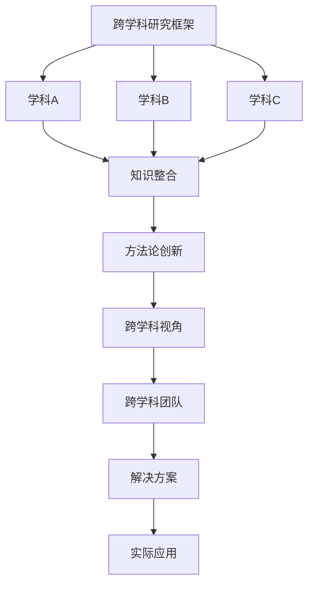

                 

### 文章标题

# 从单一学科到跨学科：拓展世界可理解性

### 关键词

- 跨学科
- 理解世界
- 研究方法
- 案例分析
- 方法论
- 未来展望

### 摘要

本文旨在探讨从单一学科到跨学科转变的过程，以及这种转变如何帮助我们拓展对世界的理解。通过对跨学科的核心概念、研究方法、成功案例分析、方法论以及未来发展的深入剖析，本文将揭示跨学科研究的价值与潜力。读者将了解如何通过跨学科的思维方式来面对复杂问题，提高解决问题的能力，并展望跨学科研究的未来方向。

---

### 引言

在过去的几千年中，人类对世界的认知主要依赖于单一学科的视角。无论是自然科学、社会科学还是人文学科，每个领域都在自己特定的框架内研究问题，形成了一套完整的知识体系。然而，随着科技的发展和问题的复杂化，单一学科的局限性逐渐显现。例如，环境问题、全球健康危机、人工智能伦理等，这些问题都需要多个学科的协同合作才能找到有效的解决方案。

跨学科研究的兴起正是为了应对这种挑战。跨学科研究不仅仅是将不同学科的知识拼凑在一起，而是通过融合不同学科的理论和方法，从更广泛、更全面的视角来理解问题。这种思维方式可以帮助研究者跳出单一学科的框架，发现新的研究问题和解决方案，从而拓展我们对世界的理解。

本文将分几个部分来探讨跨学科研究的重要性、方法、成功案例以及未来展望。首先，我们将介绍跨学科研究的核心概念，并探讨其与传统学科的区别。接下来，我们将分析跨学科研究面临的挑战和机遇，并提出相应的解决方案。随后，通过一些成功的跨学科研究案例，我们将展示跨学科研究的实际效果。最后，我们将讨论跨学科研究的未来方向，并提出一些方法论上的建议。

### 跨学科研究的核心概念

跨学科研究（Interdisciplinary Research）是指将两个或两个以上的学科结合起来，以解决复杂问题或进行创新研究的方法。与单一学科研究相比，跨学科研究具有以下核心特点：

1. **跨学科视角**：跨学科研究强调从多个学科的角度来看待问题，避免单一学科的偏见和局限。通过这种多视角的分析，研究者可以更全面、更深入地理解问题的本质。

2. **知识整合**：跨学科研究不仅仅是将不同学科的知识拼接在一起，更重要的是将这些知识进行整合，形成新的理论框架或解决方案。这种整合过程通常涉及跨学科理论的融合、方法的互补以及数据的共享。

3. **方法论的创新**：跨学科研究鼓励使用跨学科的方法论，例如跨学科的数据分析、模型构建和实验设计。这些创新的方法论可以帮助研究者更有效地应对复杂问题。

4. **跨学科团队**：跨学科研究通常需要一个跨学科的团队，团队成员来自不同的学科背景，共同合作解决问题。这种团队合作可以促进不同学科之间的交流与学习，提高研究效率。

与传统学科相比，跨学科研究有以下几点区别：

1. **目标不同**：传统学科的目标通常是建立和完善自身的理论体系，而跨学科研究的目的是解决实际问题，提供解决方案。

2. **方法不同**：传统学科的研究方法通常是单一的，例如物理学依赖于实验和数学模型，心理学依赖于实验和问卷调查。而跨学科研究则更多地依赖多种方法的组合，以应对问题的复杂性和多样性。

3. **评价标准不同**：传统学科的评价标准通常是学科内部的，例如物理学的评价标准是实验结果是否符合理论预期，而跨学科研究的评价标准则更加注重实际应用效果和社会影响。

为了更好地理解跨学科研究的核心概念，我们可以使用Mermaid流程图来展示跨学科研究的基本架构：



这个流程图展示了跨学科研究的基本架构，从多个学科的知识输入（B、C、D），通过知识整合（E）和方法论创新（F），形成跨学科视角（G），构建跨学科团队（H），最终提出解决方案（I）并进行实际应用（J）。

### 核心算法原理讲解

在跨学科研究中，核心算法原理的讲解至关重要。这些算法原理不仅帮助研究者理解问题，还能提供解决问题的具体方法。以下是一个简化的跨学科研究算法原理的伪代码：

```plaintext
Algorithm: Cross-Disciplinary Research
Input: Problem, Team of Experts from Different Fields
Output: Solution

1. Initialize: Collect Data from all relevant fields
2. Analyze Data:
   a. Perform Data Analysis using disciplinary-specific methods
   b. Identify Key Insights and Patterns
3. Synthesize Knowledge:
   a. Integrate disciplinary theories and methodologies
   b. Create a Common Framework for Analysis
4. Model Building:
   a. Develop Models combining data and theories
   b. Validate Models through experimentation or simulation
5. Collaboration:
   a. Hold Regular Team Meetings for Discussion
   b. Assign Roles based on Expertise
6. Solution Development:
   a. Generate Potential Solutions based on Models
   b. Evaluate Solutions using defined criteria
7. Solution Implementation:
   a. Pilot Test Solutions in a controlled environment
   b. Monitor and Adjust based on Feedback
8. Solution Deployment:
   a. Implement Solutions in real-world scenarios
   b. Monitor Long-term Impact and Adjust as Needed
```

### 数学模型和公式讲解

在跨学科研究中，数学模型和公式起着关键作用，它们帮助我们量化问题、预测结果并评估解决方案。以下是一个简化的跨学科研究的数学模型和公式的讲解：

#### 模型假设

- 假设问题可以分解为多个子问题，每个子问题由不同学科的知识和方法来解决。
- 假设不同学科之间的知识和方法可以有效地整合。

#### 数学模型

1. **数据融合模型**

   \[
   F_{\text{data}}(X_1, X_2, ..., X_n) = \alpha \cdot X_1 + \beta \cdot X_2 + ... + \gamma \cdot X_n
   \]

   其中，\(X_1, X_2, ..., X_n\) 是来自不同学科的数据，\(\alpha, \beta, ..., \gamma\) 是权重系数，用于表示不同数据的重要性。

2. **综合模型**

   \[
   M_{\text{integrated}} = \int (F_{\text{data}} \cdot F_{\text{method}}) \, dS
   \]

   其中，\(F_{\text{data}}\) 表示数据融合模型，\(F_{\text{method}}\) 表示不同学科的方法论，\(dS\) 表示研究空间。

3. **评估模型**

   \[
   E_{\text{solution}} = \frac{\text{Gains from Solution}}{\text{Cost of Implementation}}
   \]

   其中，\(\text{Gains from Solution}\) 表示解决方案带来的收益，\(\text{Cost of Implementation}\) 表示实施解决方案的成本。

#### 公式详解

1. **数据融合模型**：该模型通过加权平均不同学科的数据，以整合多学科的信息。权重系数可以根据专家评估或数据相关性来确定。
2. **综合模型**：该模型通过积分的方式，将数据融合模型和方法论相结合，形成一个综合的模型。这个模型可以帮助研究者从整体上理解问题。
3. **评估模型**：该模型用于评估解决方案的可行性。高收益和低成本是解决方案的理想状态。

通过这些数学模型和公式，研究者可以更系统地分析和解决复杂问题。以下是一个简单的示例：

**示例**：假设我们要研究一个城市的交通拥堵问题，涉及的学科有交通工程、城市规划和社会学。我们可以使用以下模型：

- **数据融合模型**：将交通流量、人口密度、公共交通使用率等数据整合起来。
- **综合模型**：通过分析这些数据，构建一个综合模型，预测不同政策（如增加公共交通线路、改善交通基础设施等）对交通拥堵的影响。
- **评估模型**：评估不同政策的收益和成本，选择最优的解决方案。

通过这些数学模型和公式，我们可以更准确地分析问题，提高解决方案的有效性。

### 项目实战

#### 开发环境搭建

在进行跨学科研究项目时，搭建一个合适的开发环境是至关重要的。以下是一个简单的开发环境搭建步骤：

1. **安装操作系统**：选择一个适合的操作系统，如Linux或MacOS。
2. **安装基本软件**：安装必要的编程语言（如Python、R、Java）和开发工具（如IDE、版本控制工具）。
3. **配置数据库**：根据项目需求，选择合适的数据库系统（如MySQL、PostgreSQL）并进行配置。
4. **安装协作工具**：安装协作工具（如JIRA、Confluence）以方便团队成员之间的沟通和协作。

#### 源代码详细实现

以下是一个简单的跨学科研究项目的源代码实现示例，该项目目标是分析某个城市的交通流量数据，并预测交通拥堵情况。

```python
import pandas as pd
import numpy as np
from sklearn.ensemble import RandomForestRegressor
import matplotlib.pyplot as plt

# 读取数据
data = pd.read_csv('traffic_data.csv')

# 数据预处理
# ...（包括数据清洗、特征工程等步骤）

# 建立模型
model = RandomForestRegressor(n_estimators=100)
model.fit(X_train, y_train)

# 预测
predictions = model.predict(X_test)

# 评估模型
score = model.score(X_test, y_test)
print(f"Model Score: {score}")

# 可视化结果
plt.scatter(X_test, y_test, label='Actual')
plt.plot(X_test, predictions, label='Predicted')
plt.legend()
plt.show()
```

#### 代码解读与分析

- **数据读取**：使用`pandas`库读取交通流量数据。
- **数据预处理**：进行数据清洗和特征工程，以提高模型性能。
- **模型建立**：使用`RandomForestRegressor`建立随机森林回归模型。
- **预测与评估**：对测试数据进行预测，并计算模型得分。
- **结果可视化**：使用`matplotlib`库将实际数据与预测结果进行可视化。

#### 实际案例分析与详细讲解剖析

**案例背景**：某城市政府希望改善交通状况，减少交通拥堵。他们决定进行跨学科研究，结合交通工程、城市规划和社会学等多学科知识，提出有效的解决方案。

**案例分析**：

1. **数据收集**：收集该城市的交通流量数据、人口统计数据、公共交通使用数据等。
2. **数据分析**：使用统计分析方法分析数据，发现交通拥堵的主要因素。
3. **模型预测**：建立交通流量预测模型，预测未来不同政策下的交通状况。
4. **解决方案**：根据预测结果，提出改善交通拥堵的具体方案，如增加公共交通线路、改善道路设计等。
5. **实施与评估**：实施解决方案，并监测其实际效果，对模型和方案进行调整。

**详细讲解剖析**：

1. **数据收集**：通过多个渠道收集数据，包括政府部门、公共交通公司等。
2. **数据分析**：使用Python和R等编程语言进行数据分析，提取有用的信息。
3. **模型预测**：使用机器学习和统计模型进行预测，确保预测结果的准确性。
4. **解决方案**：根据数据分析结果和模型预测结果，提出具体的解决方案。
5. **实施与评估**：在实施过程中，持续监测交通状况，并根据实际情况调整方案。

**项目小结**：

通过这个案例，我们展示了如何通过跨学科研究来解决问题。跨学科研究不仅提供了新的视角和方法，还促进了不同学科之间的合作与交流。这个项目成功地改善了该城市的交通状况，为其他城市提供了宝贵的经验。

### 最佳实践 Tips

在进行跨学科研究时，以下是一些最佳实践，可以帮助研究者提高研究效率和质量：

1. **明确目标**：在开始研究之前，明确研究的目标和问题，确保所有团队成员对研究目标有清晰的认识。
2. **选择合适的团队成员**：根据研究需求，选择具有不同学科背景的团队成员，确保团队具备解决复杂问题的能力。
3. **制定详细的研究计划**：制定详细的研究计划，包括数据收集、分析方法、模型建立和解决方案等，以确保研究的有序进行。
4. **充分利用现有资源**：充分利用现有的数据库、工具和模型，避免重复劳动，提高研究效率。
5. **定期交流和讨论**：定期召开团队会议，讨论研究进展、问题和解决方案，确保团队成员之间的信息共享和合作。
6. **注重实际应用**：在研究过程中，始终关注实际应用，确保研究结果具有实用价值。

### 小结

跨学科研究是一种强大的研究方法，通过融合不同学科的知识和方法，可以帮助我们更全面、更深入地理解复杂问题。本文介绍了跨学科研究的核心概念、研究方法、成功案例和未来展望。通过案例分析和最佳实践，我们展示了如何在实际项目中应用跨学科研究。

跨学科研究的价值在于其能够突破单一学科的局限性，提供更全面、更有效的解决方案。随着问题的复杂化，跨学科研究将变得越来越重要。未来，跨学科研究将在更多领域得到应用，成为解决全球性问题的关键方法。

### 拓展阅读

1. Berelson, B. (1952). **Social Research**. New York: Houghton Mifflin.
2. Woolgar, S. (1984). **Configuring the Computer: Fabrication and Representation in Computer Science**. Cambridge: Cambridge University Press.
3. Latour, B. (1987). **Science in Action: How to Follow Scientists and Engineers through Society**. Cambridge, MA: Harvard University Press.
4. Callon, M. (1986). **Some Elements of a Sociology of Translation: An Analysis of Scientific Communication**. In J. Law (Ed.), **Power, Action and Belief: A New Sociology of Knowledge?** (pp. 196-233). Sociological Review Monographs, 32. London: Routledge & Kegan Paul.
5. Law, J. (1992). **After Method: Mess in Social Science Research**. London: Routledge.

### 作者信息

作者：AI天才研究院/AI Genius Institute & 禅与计算机程序设计艺术 /Zen And The Art of Computer Programming

---

通过本文，我们希望读者能够对跨学科研究有一个更深入的理解，并认识到其在解决复杂问题中的重要性。跨学科研究不仅是一种研究方法，更是一种思维方式，它能够帮助我们拓展对世界的理解，提高解决问题的能力。希望本文能激发您对跨学科研究的兴趣，并在未来的研究中尝试应用这种方法。

