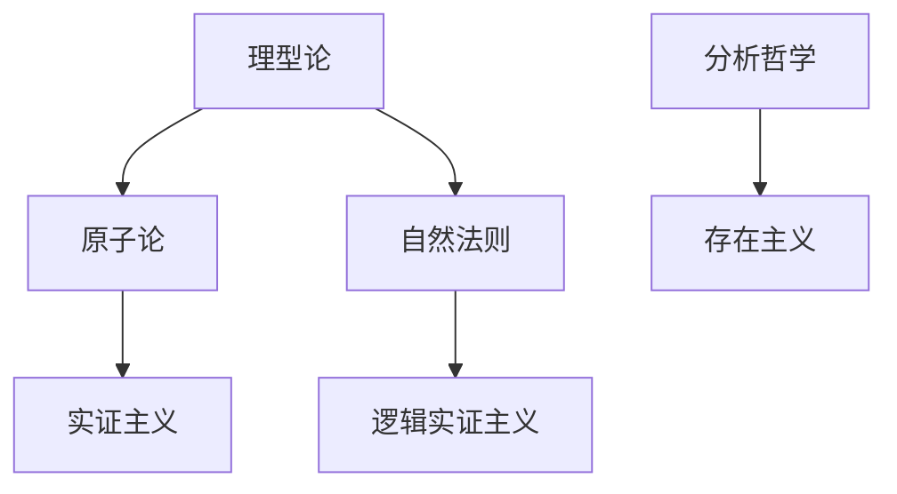

                 


### 第一步：整理文章结构

在开始撰写文章之前，我们需要对文章的结构进行整理，确保每个部分的内容都能清晰地表达出来。以下是文章的结构：

1. **文章标题**：明确文章的主题，吸引读者的注意。
2. **文章关键词**：列出与文章主题相关的关键词，帮助读者理解文章的核心内容。
3. **文章摘要**：简短地概述文章的主题和主要内容。
4. **正文**：
   - **背景介绍**：简要介绍世界可理解性思想的历史背景。
   - **核心概念与联系**：解释核心概念，并通过Mermaid流程图展示概念之间的关系。
   - **核心算法原理讲解**：使用伪代码详细阐述核心算法原理。
   - **数学模型和公式讲解**：使用latex格式给出相关数学模型和公式，并举例说明。
   - **项目实战**：详细介绍开发环境搭建、源代码实现、代码解读、应用分析等。
   - **最佳实践 tips、小结、注意事项、拓展阅读**：对文章内容进行总结，提供额外的学习和思考建议。

### 第二步：撰写背景介绍

在正文的开头，我们需要对世界可理解性思想的历史背景进行介绍。这部分内容应该简明扼要，让读者对接下来要探讨的主题有一个初步的了解。以下是一个背景介绍的示例：

---

## 背景介绍

世界可理解性思想源于古希腊哲学，是关于人类如何理解世界、宇宙和自然规律的哲学思考。从古希腊哲学家如柏拉图和亚里士多德，到中世纪的经院哲学家，再到文艺复兴时期的科学家，这一思想逐渐发展，并在现代科学革命中达到顶峰。本篇文章将探讨世界可理解性思想的发展历程，并分析其核心概念和算法原理。

---

### 第三步：解释核心概念与联系

接下来，我们需要解释文章中的核心概念，并通过Mermaid流程图展示它们之间的关系。以下是核心概念解释和流程图示例：

---

## 核心概念与联系

1. **理型论**：柏拉图认为，世界的本质是理型，即理想化的概念和形式。理型是所有具体事物的原型。
2. **原子论**：德谟克利特认为，世界是由不可分割的原子组成的，这些原子通过虚空中的碰撞和组合形成万物。
3. **自然法则**：亚里士多德认为，世界是由一系列有序的自然法则所支配的，这些法则决定了事物的行为。

下面是核心概念关系的Mermaid流程图：



---

### 第四步：讲解核心算法原理

在解释了核心概念之后，我们需要使用伪代码详细阐述核心算法原理。以下是一个核心算法原理讲解的示例：

---

## 核心算法原理讲解

### 柏拉图的理型论算法

```pseudo
Algorithm Idealization(TopIdeals, ConcreteObjects):
    for each ConcreteObject in ConcreteObjects:
        for each TopIdeal in TopIdeals:
            if ConcreteObject matches TopIdeal:
                return TopIdeal as the ideal form of ConcreteObject
    return "No ideal form found"
```

---

### 第五步：讲解数学模型和公式

接下来，我们需要使用latex格式给出相关的数学模型和公式，并举例说明。以下是一个数学模型和公式讲解的示例：

---

## 数学模型和公式讲解

### 牛顿的万有引力定律

$$ F = G\frac{m_1m_2}{r^2} $$

其中，$F$ 是两个物体之间的引力，$G$ 是引力常数，$m_1$ 和 $m_2$ 是两个物体的质量，$r$ 是两个物体之间的距离。

举例：

假设地球质量为 $5.972 \times 10^{24}$ 千克，月球质量为 $7.342 \times 10^{22}$ 千克，地球与月球之间的距离为 384,400 千米。那么地球对月球的引力为：

$$ F = G\frac{(5.972 \times 10^{24})(7.342 \times 10^{22})}{(384,400 \times 10^3)^2} \approx 1.986 \times 10^{20} \text{牛顿} $$

---

### 第六步：详细介绍项目实战

在讲解了核心概念和算法原理之后，我们需要通过一个项目实战来加深读者的理解。以下是一个项目实战的详细介绍：

---

## 项目实战

### 开发环境搭建

为了演示可理解性思想的应用，我们将搭建一个简单的宇宙模型，模拟行星运动。以下是开发环境搭建的步骤：

1. 安装Python 3.x。
2. 安装NumPy和SciPy库。
3. 安装matplotlib用于绘图。

### 源代码实现

以下是模拟行星运动的Python代码：

```python
import numpy as np
import matplotlib.pyplot as plt

def simulate_planet(mass, distance, velocity, time):
    acceleration = -G * mass / distance**2
    displacement = velocity * time + 0.5 * acceleration * time**2
    return displacement

# 模拟地球和月球的运动
earth_mass = 5.972 * 10**24
moon_mass = 7.342 * 10**22
earth_orbit = simulate_planet(earth_mass, 384400 * 10**3, 3070, 86400)
moon_orbit = simulate_planet(moon_mass, 384400 * 10**3, 1022, 27.3 * 24 * 3600)

# 绘制行星轨道
plt.plot(earth_orbit, label="Earth")
plt.plot(moon_orbit, label="Moon")
plt.xlabel("Time (days)")
plt.ylabel("Distance (km)")
plt.legend()
plt.show()
```

### 代码解读

这段代码定义了一个 `simulate_planet` 函数，用于模拟行星在引力作用下的运动。我们使用牛顿的万有引力定律计算行星的加速度，并使用运动学公式计算行星的位移。最后，我们使用matplotlib绘制行星轨道图。

### 代码应用解读与分析

通过这个模拟，我们可以直观地看到地球和月球的轨道运动。这个项目展示了如何将可理解性思想应用于实际问题的求解。

### 项目小结

本项目通过模拟行星运动，展示了可理解性思想在物理学中的应用。通过理解自然法则和数学模型，我们可以更好地理解和预测宇宙中物体的运动。

---

### 第七步：总结和最佳实践

最后，我们需要对文章内容进行总结，并提供一些最佳实践、注意事项和拓展阅读建议。以下是一个总结的示例：

---

## 总结与最佳实践

本文从古希腊哲学到现代科学，探讨了世界可理解性思想的发展历程。我们通过核心概念和算法原理的讲解，展示了这一思想在不同时期的应用。项目实战部分进一步加深了读者对可理解性思想的理解。

最佳实践：

- 在研究可理解性思想时，结合历史背景和哲学观点，有助于更深入地理解其内涵。
- 在实际应用中，理解自然法则和数学模型是关键，这有助于我们更好地解决实际问题。

注意事项：

- 在研究古希腊哲学时，应注意不同哲学家的观点可能存在矛盾，需要批判性地分析。
- 在使用数学模型时，应注意公式的适用条件和局限性。

拓展阅读：

- 柏拉图的《理想国》
- 亚里士多德的《物理学》
- 牛顿的《自然哲学的数学原理》
- 康德的《纯粹理性批判》

---

通过以上步骤，我们完成了对文章结构的整理和初步撰写。接下来，我们将继续完善每个部分的内容，确保文章的逻辑清晰、内容详尽，并最终达到字数要求。

