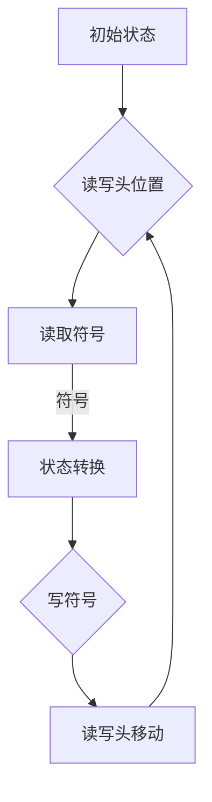

                 

### 文章标题

《从图灵机到量子计算：拓展计算与世界可模拟性的边界》

> 关键词：图灵机、量子计算、计算理论、可模拟性、算法、硬件实现

> 摘要：本文从图灵机的起源和基本原理出发，探讨了计算理论的发展历程，包括经典计算模型的演变、并行计算和分布式计算，以及量子计算的基础和优势。通过详细阐述量子算法的原理和实例，分析量子计算在实际应用中的挑战和未来趋势。文章旨在揭示计算理论与世界可模拟性之间的紧密联系，为读者提供全面深入的量子计算知识。

---

## 文章引言

计算是现代科技的核心，贯穿于我们生活的方方面面。从简单的电子计算器到复杂的超级计算机，计算技术不断推动着人类社会的发展。然而，计算的起源可以追溯到近一个世纪以前，由英国数学家艾伦·图灵（Alan Turing）提出的图灵机理论，为现代计算理论奠定了基础。

### 图灵机的定义与历史背景

图灵机是一种抽象的计算模型，由一个无限长的带子、一个读写头和一个状态控制单元组成。带子上预先写有一系列符号，读写头可以沿带子左右移动，并在当前位置读写符号。状态控制单元根据当前的符号和当前的状态，决定读写头的移动方向、符号的读写操作以及下一步的状态转换。

图灵机的提出，旨在解决“什么是计算”这一哲学问题。通过图灵机的定义，图灵将计算过程形式化，使得任何可计算的问题都可以转化为图灵机的问题。这一理论为后来的计算机科学和人工智能领域奠定了坚实的基础。

### 图灵机的分类与演变

根据图灵机的不同特点，可以将图灵机分为多种类型。最常见的是图灵完备（Turing-complete）的图灵机，它能够模拟任何其他图灵机，具有广泛的计算能力。此外，还有有限状态机（Finite State Machine，FSM）和有限自动机（Finite Automaton，FA）等计算模型，它们在特定场景下具有高效性和简洁性。

随着计算机硬件和软件的发展，图灵机的理论也在不断演变。早期的计算机硬件主要基于电子管和晶体管，而现代计算机则采用了更加先进的集成电路技术。同时，计算机编程语言也从低级的汇编语言逐渐发展到了高级的脚本语言和面向对象语言，使得程序员能够更加高效地编写代码。

### 图灵机的可计算性问题

图灵机的提出不仅解决了计算的哲学问题，还引发了对可计算性的深入探讨。可计算性指的是通过计算过程可以解决的问题范围。图灵机理论表明，存在许多问题是可以被计算的，但并非所有问题都可以被计算。例如，停机问题（即给定一个图灵机和输入，判断该图灵机是否会在有限时间内停止）就是不可计算的。

这种不可计算性的存在，引发了人们对计算能力的反思。一些哲学家和数学家认为，人类的大脑具有一定的计算能力，但并非所有问题都可以被人类计算。这一观点引发了关于人工智能和人类智能界限的讨论。

### 图灵奖与图灵测试

图灵奖是计算机科学领域最高奖项之一，得名于艾伦·图灵。自1966年设立以来，图灵奖已经成为了计算机科学界的荣誉象征。每年，图灵奖都会颁发给在计算机科学领域做出杰出贡献的科学家。

图灵测试是由图灵提出的一个著名思想实验，旨在评估机器是否具有人类智能。在图灵测试中，一个人和一个机器通过一个交互界面进行对话，测试者无法区分哪一个是人，哪一个是机器。如果机器能够在对话中表现得像一个人类一样，那么它就可以被认为具有人类智能。

尽管图灵测试并不是衡量机器智能的唯一标准，但它为人工智能领域提供了一种评估方法。随着人工智能技术的发展，越来越多的机器能够通过图灵测试，这标志着计算机科学和人工智能领域的重要进步。

### 总结

图灵机的提出和图灵奖的设立，标志着计算机科学和人工智能领域的开端。通过图灵机的理论，我们不仅可以理解计算的本质，还可以探讨计算能力的边界。随着计算机硬件和软件的发展，计算理论将继续拓展，为人类社会带来更多的创新和进步。

在接下来的章节中，我们将继续探讨计算理论的发展，从图灵机到量子计算，探索计算能力的世界边界。

## 图灵机的核心概念与联系

为了深入理解图灵机的核心概念，我们需要首先明确几个关键组成部分：无限长的带子、读写头和状态控制单元。这些组成部分相互作用，共同实现了图灵机的计算功能。为了更好地展示这些概念之间的关系，我们可以通过Mermaid流程图来直观地描述图灵机的工作原理。

以下是一个简化的Mermaid流程图，展示了图灵机的主要组成部分和它们之间的联系：



### 无限长的带子

图灵机的带子是一个无限长的线性序列，每个位置上可以放置一个符号。符号可以是0或1，或者其他任何预定义的字符集。带子用于存储图灵机在计算过程中需要处理的数据。

### 读写头

读写头是图灵机的核心组件之一，它可以在带子上左右移动，并读取或写入符号。读写头的工作方式类似于一个电子计算器的读/写头，它可以在当前位置进行操作，并根据当前状态和符号决定下一步的操作。

### 状态控制单元

状态控制单元是图灵机的“大脑”，它根据当前的符号和状态，决定读写头的移动方向、符号的读写操作以及下一步的状态转换。状态控制单元通常由一系列的条件语句和转移规则组成，这些规则定义了图灵机在不同情况下的行为。

### 状态转换

状态转换是图灵机工作的核心机制。在每个计算步骤中，图灵机都会根据当前的符号和状态，执行一个状态转换，这包括读写头的移动方向、符号的读写操作以及状态的更新。状态转换的过程可以看作是一个有限状态机（FSM）的实例。

### Mermaid流程图

通过上述Mermaid流程图，我们可以直观地看到图灵机在工作过程中的各个步骤。以下是流程图的详细说明：

1. **初始状态（A）**：图灵机开始时处于初始状态，读写头位于带子上的某个位置。
2. **读写头位置（B）**：读写头根据当前的状态，确定其位置。
3. **读取符号（C）**：读写头读取当前位置的符号。
4. **状态转换（D）**：状态控制单元根据读取的符号和当前的状态，决定下一步的操作。
5. **写符号（E）**：状态控制单元决定是否在当前位置写入新的符号。
6. **读写头移动（F）**：读写头根据状态控制单元的指令，移动到新的位置。

这个过程不断重复，直到图灵机达到终止状态或者无法进行进一步的计算。通过这样的流程，图灵机可以模拟各种计算过程，从而解决复杂的问题。

### 核心概念与联系

通过上述流程图，我们可以看到图灵机的核心概念是如何相互联系的：

- **无限长的带子**：提供了存储和处理数据的场所。
- **读写头**：实现了数据的读取和写入操作。
- **状态控制单元**：决定了读写头的移动方向和符号的操作。
- **状态转换**：是图灵机工作的核心机制，确保计算过程的正确执行。

这些概念共同构成了图灵机的计算模型，使得图灵机成为一种强大的计算工具。通过这些核心概念，我们可以更好地理解图灵机的工作原理，以及它在计算理论中的重要性。

在接下来的章节中，我们将继续探讨图灵机的分类与演变，以及它对计算理论的影响。这将帮助我们更全面地理解计算能力的发展历程。

## 图灵机的分类与演变

在图灵机的发展过程中，为了满足不同计算需求和优化计算效率，研究者们对图灵机进行了多种分类和改进。这些分类不仅丰富了计算理论，也为实际应用提供了更多选择。以下是一些常见的图灵机分类及其演变。

### 图灵完备（Turing-complete）

图灵完备的图灵机能够模拟任何其他图灵机，因此它们具有广泛的计算能力。经典的图灵机就是一种图灵完备的图灵机。图灵完备的图灵机通过定义一个足够丰富的指令集，使得任何可计算的问题都可以通过这种图灵机来解决。这意味着，图灵完备的图灵机是实现通用计算的基础。

### 有限状态机（Finite State Machine, FSM）

有限状态机是一种较为简单的计算模型，它由有限数量的状态和状态转移函数组成。FSM通常用于处理确定性问题和简单的自动化任务。与图灵机相比，FSM的计算能力有限，但它在实现简单算法和自动化控制方面非常有效。例如，自动化洗衣机和电梯控制系统中就经常使用有限状态机。

### 有限自动机（Finite Automaton, FA）

有限自动机是有限状态机的进一步简化，它通常没有读写头和带子，只有当前状态和下一状态的转换规则。FA主要用于模式识别和文本处理，如正则表达式匹配和编译器的词法分析。与FSM类似，FA的计算能力有限，但它在特定领域中的应用非常高效。

### 可扩展图灵机（Extended Turing Machine）

可扩展图灵机是图灵机的一种扩展，它引入了更多的功能，如多读写头和并行计算能力。这种图灵机能够在同一时间处理多个数据片段，从而提高计算效率。例如，并行图灵机可以在同一时间对图中的多个节点进行操作，这在大规模数据处理和图算法中非常有用。

### 非确定性图灵机（Nondeterministic Turing Machine, NTM）

非确定性图灵机是一种更强的计算模型，它允许在状态转换时同时探索多个可能的状态。这种图灵机在某些问题，如某些类型的搜索问题，上表现出更高的计算效率。然而，非确定性图灵机也带来了更大的计算复杂度，因为它需要考虑所有可能的状态组合。

### 模拟图灵机（Simulating Turing Machine）

模拟图灵机是一种将其他计算模型模拟为图灵机的技术。例如，可以将量子计算模型或神经网络模型通过图灵机进行模拟。这种技术使得研究者能够使用统一的计算模型来分析和解决不同类型的问题。

### 图灵机的应用

图灵机及其各种变体在计算机科学和人工智能领域有广泛的应用。以下是一些典型的应用实例：

- **编程语言**：许多编程语言都是图灵完备的，这意味着它们可以模拟任何图灵机，从而解决各种计算问题。
- **编译器与解释器**：编译器和解释器通常使用图灵机模型来分析和转换程序代码。
- **人工智能**：图灵机模型在人工智能领域，特别是在逻辑推理和搜索算法中，有重要应用。
- **模拟与验证**：图灵机模型用于模拟和验证复杂的系统行为，如硬件设计和网络安全。

### 总结

图灵机的分类与演变展示了计算理论的多样性和复杂性。从图灵完备的图灵机到简单的有限状态机，不同的计算模型各有优势，适用于不同的计算场景。通过对这些计算模型的深入理解，我们能够更好地设计高效、可靠的计算机系统和算法。

在接下来的章节中，我们将进一步探讨信息论与熵的基本概念，以及它们在计算理论中的应用。这将帮助我们理解数据和信息在计算过程中的重要性。

## 信息论与熵

在图灵机为我们提供了计算的理论框架之后，信息论作为一门研究信息传递和处理规律的学科，进一步拓展了我们对计算和理解世界的视角。信息论的奠基者，克劳德·香农（Claude Shannon），通过提出信息熵的概念，为计算理论提供了新的工具和视角。

### 涵义与起源

香农在1948年发表了题为《通信的数学理论》（A Mathematical Theory of Communication）的经典论文，这篇论文标志着信息论的诞生。香农将信息定义为消除不确定性的过程，并提出了信息熵的概念，用以量化信息的不确定性。

### 奈特与信息量

在香农的信息论中，奈特（Nautical mile）被用来衡量信息量。一个奈特的定义是：如果事先不知道某事件的具体结果，而事后知道这一事件的结果时，我们所获得的信息量就是一奈特。例如，投掷一枚公平的硬币，事先不知道正面还是反面，但知道结果后，我们获得了一个奈特的信息。

### 熵的概念与计算

香农引入了熵（Entropy）的概念来量化一个随机变量的不确定性。对于一个具有概率分布的随机变量，其熵定义为：

$$ H(X) = -\sum_{i} p(x_i) \log_2 p(x_i) $$

其中，\( p(x_i) \) 是随机变量 \( X \) 取值为 \( x_i \) 的概率，\( \log_2 \) 是以2为底的对数。熵的值范围从0到正无穷，当随机变量是确定的（即所有 \( p(x_i) \) 相等，如投掷一个已知的硬币），熵为0；当随机变量是完全随机的（即所有 \( p(x_i) \) 相等，如投掷一个未知的硬币），熵达到最大值。

### 信息熵的应用

信息熵在通信、数据压缩和计算理论中有着广泛的应用。在通信中，信息熵用于衡量传输数据的平均信息量，确保信息在传输过程中不被丢失。在数据压缩中，信息熵帮助确定数据的冗余程度，从而设计出更有效的压缩算法。在计算理论中，信息熵提供了对计算复杂性的量化，帮助我们理解算法的效率。

### 熵与计算

熵的概念不仅仅局限于信息论，它还对计算理论有着深远的影响。在计算理论中，熵可以被用来衡量算法的复杂性和效率。例如，在一个复杂问题中，如果我们能够通过降低问题的不确定性（即降低熵）来简化问题，那么我们就可以设计出更高效的算法。

### 熵与数据结构

在数据结构中，熵的概念也被广泛应用。例如，哈希表的实现中，哈希函数的设计通常考虑了输入数据的熵，以确保哈希值的均匀分布，避免冲突。在数据库设计中，索引结构的选择也常常基于数据的熵，以优化查询效率。

### 信息熵与量子计算

随着量子计算的发展，信息熵的概念也被扩展到了量子信息论。在量子计算中，量子比特（qubit）的叠加态和纠缠态带来了全新的信息处理方式。量子信息熵可以用来衡量量子系统的不确定性，从而优化量子算法的设计。

### 总结

信息论与熵的概念为计算理论提供了新的视角和工具，使得我们能够更深入地理解数据和信息在计算过程中的重要性。通过信息熵的计算和应用，我们可以在通信、数据压缩和计算等多个领域设计出更加高效和可靠的算法。

在接下来的章节中，我们将进一步探讨经典计算模型的演变，从硬件和软件的角度理解计算机系统的演进过程。

## 经典计算模型

随着计算理论的发展，计算机硬件和软件也在不断进步，形成了现代计算模型。这些模型包括计算机硬件的基本构成、逻辑门与布尔电路、存储器与数据结构，以及编程语言与编译器。通过这些组成部分，我们可以构建出高效的计算机系统，为各种应用提供强大的计算能力。

### 计算机硬件的基本构成

计算机硬件是计算机系统的物理基础，它包括中央处理器（CPU）、内存、输入输出设备等。中央处理器是计算机的核心部件，负责执行程序指令和处理数据。内存是临时存储数据的地方，用于加快数据访问速度。输入输出设备如键盘、鼠标、显示器等，用于人与计算机之间的交互。

#### 中央处理器（CPU）

中央处理器由运算单元（ALU）、控制单元（CU）和寄存器组组成。运算单元执行各种算术和逻辑运算，控制单元协调和管理计算机的各个部件，寄存器组用于临时存储数据和指令。

#### 内存

内存包括随机存取存储器（RAM）和只读存储器（ROM）。RAM用于临时存储正在使用的程序和数据，断电后数据会丢失。ROM用于存储固件和操作系统等固定程序，断电后数据不会丢失。

#### 输入输出设备

输入输出设备是实现计算机与人、计算机与其他设备交互的重要途径。键盘和鼠标用于输入命令和数据，显示器和打印机用于输出结果。

### 逻辑门与布尔电路

逻辑门是构成计算机硬件的基本逻辑单元，它们通过布尔运算实现简单的逻辑功能。常见的逻辑门包括与门（AND）、或门（OR）、非门（NOT）、异或门（XOR）等。布尔电路是由多个逻辑门组成的复杂电路，用于实现更复杂的逻辑功能。

#### 逻辑门的工作原理

- **与门（AND）**：当所有输入都为1时，输出才为1。
- **或门（OR）**：当至少有一个输入为1时，输出为1。
- **非门（NOT）**：将输入信号取反。
- **异或门（XOR）**：当输入不同时，输出为1。

#### 布尔电路的设计

布尔电路的设计涉及布尔代数的应用，通过逻辑门实现特定功能的电路。例如，可以使用与门、或门和非门设计一个全加器（Full Adder），用于实现二进制数的加法运算。

### 存储器与数据结构

存储器是计算机系统的重要组成部分，用于存储数据和程序。存储器可以分为随机存取存储器（RAM）和只读存储器（ROM）。RAM用于临时存储正在使用的程序和数据，ROM用于存储固件和操作系统等固定程序。

#### 数据结构

数据结构是组织和存储数据的方式，常见的有数组、链表、栈、队列等。每种数据结构都有其特定的用途和特点，用于实现不同的数据操作和算法。

- **数组**：一种固定大小的线性数据结构，用于存储相同类型的数据元素。
- **链表**：一种动态的数据结构，由一系列节点组成，每个节点包含数据和一个指向下一个节点的指针。
- **栈**：一种后进先出（LIFO）的数据结构，常用于实现递归和函数调用。
- **队列**：一种先进先出（FIFO）的数据结构，常用于实现任务调度和缓冲。

### 编程语言与编译器

编程语言是用于编写计算机程序的符号系统，不同的编程语言具有不同的语法和语义。常见的编程语言包括高级语言（如C、Java、Python）和低级语言（如汇编语言）。编译器是将高级语言程序翻译成机器语言程序的软件工具，确保程序能够在计算机上正确执行。

#### 编程语言的特点

- **高级语言**：提供更丰富的语法和语义，易于理解和编写，但需要编译器将其翻译成机器语言。
- **低级语言**：更接近机器语言，执行效率高，但编写复杂且不易维护。

#### 编译器的功能

- **词法分析**：将源代码分解为词法单元（如标识符、关键字、运算符）。
- **语法分析**：将词法单元组合成语法结构（如表达式、语句、程序）。
- **语义分析**：检查源代码的语义正确性，如类型检查、变量作用域等。
- **代码生成**：将语法分析的结果翻译成目标机器语言的指令。
- **优化**：对生成的代码进行优化，提高执行效率。

### 总结

经典计算模型通过硬件和软件的结合，实现了高效的计算能力。计算机硬件提供了基本的计算资源，逻辑门与布尔电路实现了基本的逻辑功能，存储器与数据结构为数据的存储和操作提供了支持，编程语言与编译器使得程序设计更加高效和灵活。这些组成部分相互作用，共同构建了一个强大的计算系统，为各种应用提供了强大的计算支持。

在接下来的章节中，我们将进一步探讨并行计算与分布式计算，了解这些计算模型如何通过协同工作，进一步提高计算效率和性能。

## 并行计算与分布式计算

在传统的串行计算模型中，计算机系统按顺序执行指令，这种模型在处理单任务时相对高效。然而，随着数据量的急剧增长和复杂计算问题的不断涌现，单任务串行计算逐渐暴露出其性能瓶颈。为了解决这一问题，并行计算和分布式计算模型应运而生。这两种计算模型通过协同工作，显著提高了计算效率和性能。

### 并行计算的基本概念

并行计算是指在同一时间内执行多个任务或指令的计算机体系结构。并行计算的核心思想是将一个大任务分解成多个小任务，这些小任务可以在多个处理单元上同时执行，从而加快整体计算速度。并行计算的主要优势在于它能够将复杂任务分解，并通过并行处理来降低计算时间。

#### 并行计算模型

- **数据并行**：数据并行计算模型将数据分割成多个部分，每个处理单元独立处理一部分数据，最终合并结果。这种模型适用于大数据处理和科学计算。
- **任务并行**：任务并行计算模型将任务分解成多个子任务，每个处理单元独立执行一个子任务，最终汇总结果。这种模型适用于复杂计算和分布式系统。
- **指令并行**：指令并行计算模型在同一时间内执行多个指令，通过优化指令流水线和硬件结构来提高计算效率。这种模型适用于高性能计算和嵌入式系统。

### 分布式计算模型

分布式计算是指通过网络连接的多台计算机协同工作，共同完成一个计算任务。在分布式计算模型中，多个计算机节点独立运行，通过消息传递机制协同工作，从而实现大规模计算任务的分布式处理。

#### 分布式计算的主要特点

- **容错性**：分布式计算模型具有较高的容错性，即使个别节点出现故障，其他节点仍能继续工作，确保计算任务顺利完成。
- **可扩展性**：分布式计算模型可以根据需求动态增加或减少计算节点，从而实现计算资源的灵活扩展。
- **高效性**：分布式计算模型通过多个节点的协同工作，能够显著提高计算效率和性能。

### 量子计算与并行计算的关系

量子计算是一种基于量子力学原理的新型计算模型，它利用量子比特（qubit）的叠加态和纠缠态进行信息处理。量子计算与并行计算有着密切的联系，因为量子算法通常具有并行性，能够显著提高计算效率。

#### 量子并行计算的优势

- **指数级加速**：一些量子算法，如Shor算法，能够在多项式时间内解决传统计算机需要指数级时间解决的问题，从而实现指数级加速。
- **大规模数据处理**：量子计算可以高效地处理大规模数据集，特别是在数据加密、分子模拟和优化问题中具有巨大潜力。

### 并行计算在实际应用中的实例

并行计算和分布式计算在许多实际应用中发挥了重要作用，以下是一些典型的应用实例：

- **科学计算**：并行计算在科学计算中具有广泛的应用，如天气预测、天体物理学、生物信息学等。通过并行计算，这些计算密集型任务可以在较短时间内完成。
- **大数据处理**：随着大数据时代的到来，并行计算和分布式计算在大数据处理中发挥着至关重要的作用。例如，搜索引擎和社交网络平台通过分布式计算处理海量数据，提供实时搜索和推荐服务。
- **金融交易**：金融交易系统通过并行计算实现高速交易处理，确保交易在极短时间内完成，提高交易效率和安全性。
- **人工智能**：人工智能领域的许多算法，如深度学习和机器学习，通过并行计算和分布式计算实现大规模训练和推理，提高模型训练效率和性能。

### 总结

并行计算和分布式计算通过协同工作，显著提高了计算效率和性能。并行计算将复杂任务分解为多个小任务，通过并行处理来加快计算速度。分布式计算通过多个节点的协同工作，实现大规模计算任务的分布式处理。这些计算模型在实际应用中发挥了重要作用，为各种复杂计算任务提供了强大的计算支持。

在接下来的章节中，我们将深入探讨量子计算的基础，了解量子比特、叠加态、量子纠缠等基本概念，并探讨量子计算的优势和挑战。

## 量子计算的基础

量子计算作为计算理论的最新突破，利用量子力学原理实现了信息的存储、传输和计算，为传统计算机带来了全新的计算范式。在量子计算中，量子比特（qubit）是基本的信息单元，叠加态和量子纠缠是其核心特性。理解这些基本概念，是掌握量子计算的关键。

### 量子比特（Qubit）

量子比特是量子计算中的基本单位，与经典比特不同，量子比特可以同时存在于多种状态。经典比特只有0或1两种状态，而量子比特可以处于0和1的叠加态。这种叠加态使得量子比特能够承载更多的信息。

#### 量子比特的状态表示

一个量子比特可以用如下形式表示：

$$ \psi = \alpha|0\rangle + \beta|1\rangle $$

其中，\(|0\rangle\) 和 \(|1\rangle\) 分别表示量子比特的基态，\(\alpha\) 和 \(\beta\) 是复数概率幅，满足 \(|\alpha|^2 + |\beta|^2 = 1\)。概率幅的平方表示对应状态的概率。

#### 量子比特的叠加态

量子比特的叠加态是其核心特性之一。一个量子比特在没有被测量之前，同时处于0和1的状态。例如，当我们将一个未测量的量子比特视为一个随机变量时，它可以以概率1/2出现在状态0，以概率1/2出现在状态1。

### 量子纠缠

量子纠缠是量子计算中的另一个关键特性，它描述了两个或多个量子比特之间的一种特殊关联关系。在量子纠缠中，即使两个量子比特相隔很远，它们的状态也会相互影响。这种现象在经典物理学中是无法解释的。

#### 量子纠缠的表示

两个量子比特的纠缠态可以用如下形式表示：

$$ \psi = \alpha|00\rangle + \beta|11\rangle $$

其中，\(|00\rangle\) 和 \(|11\rangle\) 分别表示两个量子比特同时处于基态和叠加态。这种纠缠态意味着一个量子比特的状态变化会立即影响另一个量子比特的状态。

#### 量子纠缠的应用

量子纠缠在量子计算中具有重要作用。通过量子纠缠，我们可以实现超快速的计算和通信。例如，量子纠缠态可以用于量子密钥分发，确保通信过程的安全性。此外，量子纠缠态还可以用于量子算法，如Shor算法，实现传统计算机无法达到的计算速度。

### 量子门（Quantum Gates）

量子门是量子计算中的基本操作，类似于经典计算中的逻辑门。量子门作用于量子比特，改变其状态。常见的量子门包括保罗门（Pauli Gate）、 Hadamard门（Hadamard Gate）和CNOT门（Controlled-NOT Gate）。

#### 量子门的作用

量子门通过线性变换作用于量子比特，实现特定的操作。例如，Hadamard门可以将一个量子比特的状态从基态 \(|0\rangle\) 变换为叠加态 \(|+\rangle = \frac{1}{\sqrt{2}}(|0\rangle + |1\rangle)\)。CNOT门则是一个受控操作，它根据控制比特的状态改变目标比特的状态。

#### 量子电路（Quantum Circuit）

量子电路是量子计算的基本单元，由量子门和量子比特组成。量子电路通过一系列量子门的操作，将初始状态转换为所需状态。例如，一个简单的量子电路可能包含一个Hadamard门和一个CNOT门，用于实现两个量子比特的纠缠。

### 量子算法的基本原理

量子算法是利用量子比特和量子门的操作，解决特定问题的计算方法。量子算法通常具有指数级的加速效果，可以解决传统计算机无法在合理时间内解决的问题。

#### Shor算法

Shor算法是一个著名的量子算法，它利用量子计算的优势，在多项式时间内解决整数因子分解问题。Shor算法的核心思想是利用量子随机游走和量子相位估计，实现快速求解。

```plaintext
输入：一个大整数N
输出：N的一个非平凡因子
1. 将量子态初始化为 |ψ⟩ = |0⟩^N
2. 应用量子随机游走算法，将状态演化到 |ψ⟩'
3. 应用量子相位估计算法，估计相位因子
4. 根据估计的相位因子，使用传统计算机搜索可能的因子
```

#### 另一些量子算法

除了Shor算法，还有许多其他量子算法展示了量子计算的优势。例如，Grover算法是一种量子搜索算法，可以在未排序数据库中实现快速搜索。量子模拟算法则可以高效地模拟量子系统，用于分子模拟、量子化学等领域。

### 量子计算的优势与挑战

量子计算具有许多潜在的优势，但同时也面临着一系列挑战。

#### 优势

- **指数级加速**：量子算法可以显著减少计算时间，特别是对于某些特定问题，如整数因子分解和离散对数问题。
- **并行性**：量子计算利用量子比特的叠加态，可以实现大规模数据的并行处理。
- **量子密钥分发**：量子纠缠态可以用于实现安全高效的量子密钥分发。

#### 挑战

- **量子硬件的实现**：实现稳定的量子比特和精确的量子门是量子计算面临的主要挑战。量子硬件需要克服噪声、误差和退相干等问题。
- **量子算法的设计**：设计高效的量子算法需要深厚的数学和物理背景，同时确保算法的实用性和可扩展性。
- **量子计算的标准化**：量子计算的标准化和产业化是未来发展的关键，这需要建立统一的标准和协议，推动量子计算的商业化应用。

### 总结

量子计算的基础包括量子比特、叠加态、量子纠缠和量子门等核心概念。量子计算具有指数级加速和并行性等优势，但同时也面临着硬件实现、算法设计和标准化等挑战。通过不断的研究和突破，量子计算有望在未来实现大规模应用，为人类社会带来前所未有的计算能力。

在接下来的章节中，我们将探讨量子算法的具体实现，从Shor算法和量子随机游走算法等典型案例出发，深入理解量子算法的原理和优势。

## 量子算法与量子计算

量子计算以其独特的叠加态和纠缠态，为传统计算带来了前所未有的加速潜力。在这一章节中，我们将深入探讨几个典型的量子算法，包括Shor算法和量子随机游走算法，通过伪代码和数学模型详细阐述这些算法的基本原理和应用。

### Shor算法

Shor算法是量子计算领域的里程碑，它利用量子计算的优势，在多项式时间内解决了传统计算机需要指数级时间才能解决的整数因子分解问题。Shor算法的核心思想是利用量子随机游走和量子相位估计。

**算法步骤：**

1. **初始化**：将量子态初始化为 \( |0\rangle^N \)，其中 \( N \) 是待分解的整数。
2. **应用量子随机游走**：应用量子随机游走算法，将初始态演化到 \( |ψ'\rangle \)。
3. **量子相位估计**：使用量子相位估计算法，估计相位因子 \( e^{2\pi ik/N} \) 的 \( k \) 值。
4. **测量**：对系统进行测量，得到 \( k \) 的值。
5. **求解因子**：根据 \( k \) 的值，使用传统计算机求解 \( N \) 的非平凡因子。

**伪代码：**

```python
def shor(N):
    # 初始化量子系统
    state = init_quantum_state(N)
    
    # 应用量子随机游走
    evolve_state_random_walk(state)
    
    # 量子相位估计
    k = phase_estimation(state)
    
    # 求解因子
    factor1 = N / k
    factor2 = find_non_trivial_factor(N, factor1)
    
    return factor1, factor2
```

**数学模型：**

Shor算法的数学模型可以表示为：

$$ U(T) = e^{i2\pi k/N} $$

其中，\( T \) 是量子随机游走的时间，\( k \) 是相位估计的测量结果。通过测量 \( k \)，我们可以求解 \( N \) 的因子。

### 量子随机游走算法

量子随机游走算法是一种基于量子随机游走原理的量子算法，它用于解决图着色问题、社交网络分析等。量子随机游走算法的核心思想是利用量子态的叠加和纠缠，实现高效的状态转移。

**算法步骤：**

1. **初始化**：将量子态初始化为初始状态。
2. **应用量子随机游走**：应用量子随机游走操作，将初始态演化到目标态。
3. **测量**：对系统进行测量，得到目标态的概率分布。

**伪代码：**

```python
def quantum_random_walk(initial_state):
    # 初始化量子系统
    state = init_quantum_state()
    
    # 应用量子随机游走
    for t in range(time_steps):
        evolve_state(state)
    
    # 测量结果
    result = measure_state(state)
    
    return result
```

**数学模型：**

量子随机游走算法的数学模型可以表示为：

$$ U(T) = \sum_{i,j} A_{ij} e^{i\theta_{ij}} $$

其中，\( A \) 是邻接矩阵，\( \theta_{ij} \) 是转移概率。

### 其他量子算法

除了Shor算法和量子随机游走算法，还有许多其他量子算法展示了量子计算的优势。以下是一些典型的量子算法：

- **Grover算法**：Grover算法是一种量子搜索算法，它能够在未排序数据库中实现快速搜索。算法的核心思想是利用量子随机游走，将搜索问题转化为量子态的叠加和纠缠。
- **量子模拟算法**：量子模拟算法用于模拟量子系统，如分子模拟、量子化学等。这些算法能够高效地模拟量子现象，为科学研究提供强有力的工具。
- **量子纠错算法**：量子纠错算法用于解决量子计算中的错误，确保计算结果的准确性。量子纠错算法通过编码和校验位，检测和纠正量子比特的误差。

### 总结

量子算法以其独特的优势，为传统计算问题提供了新的解决方案。Shor算法和量子随机游走算法等经典算法，展示了量子计算的强大潜力。通过伪代码和数学模型，我们深入理解了这些算法的基本原理和应用。随着量子计算技术的不断发展，更多的量子算法将被开发和应用，为人类社会带来前所未有的计算能力。

在接下来的章节中，我们将探讨量子计算的硬件实现，了解量子计算机的工作原理和当前面临的挑战。

## 量子计算的硬件实现

量子计算的实现离不开先进的量子硬件技术，这些硬件技术包括量子比特的制造与操作、量子计算机的工作原理以及量子计算机的开发平台。以下将对这些方面进行详细探讨。

### 量子比特的制造与操作

量子比特是量子计算的基本单元，其性能直接决定了量子计算机的效率。目前，常见的量子比特主要有以下几种类型：

- **超导量子比特**：超导量子比特利用超导材料在低温下的特性，通过微波脉冲实现量子态的控制。超导量子比特具有速度快、纠错能力强等优点，但受限于低温环境。
- **离子阱量子比特**：离子阱量子比特利用电场和磁场将带电离子（如钙离子或铯离子）捕获在特定位置。通过激光脉冲，可以精确地控制离子的量子态。离子阱量子比特的稳定性较好，但操作速度较慢。
- **拓扑量子比特**：拓扑量子比特利用特殊的材料结构，如拓扑绝缘体或量子点，实现量子态的稳定存储和操控。拓扑量子比特具有天然的噪声免疫性，但制造工艺复杂。

在量子比特的操作中，量子门的实现是关键。常见的量子门包括Hadamard门、CNOT门和旋转门等。这些量子门可以通过物理方法实现，如微波脉冲、激光脉冲或电子束。

### 量子计算机的工作原理

量子计算机的工作原理基于量子力学的基本原理，特别是量子比特的叠加态和量子纠缠。以下是量子计算机的基本操作过程：

1. **量子初始化**：将量子比特初始化为特定的叠加态，如 \( |0\rangle \) 或 \( |+\rangle \)。
2. **量子门操作**：通过应用一系列量子门，对量子比特进行变换，实现特定算法的执行。
3. **量子测量**：对量子比特进行测量，获取最终的计算结果。测量过程会导致量子态的坍缩，从叠加态变为确定的基态。

量子计算机的算法通常分为两个阶段：量子计算阶段和经典回溯阶段。在量子计算阶段，量子比特通过叠加和纠缠进行并行计算；在经典回溯阶段，使用传统计算机对量子测量结果进行后处理，得到最终的答案。

### 量子计算机的开发平台

量子计算机的开发平台为量子算法的开发和测试提供了重要的工具。以下是一些常见的量子计算机开发平台：

- **IBM Q**：IBM Q 是IBM开发的量子计算云平台，提供多种量子计算资源和工具。用户可以在IBM Q 上运行量子算法、模拟量子系统，并与其他用户分享代码。
- **Google Quantum**：Google Quantum 是Google开发的量子计算平台，提供基于超导量子比特的量子计算机。用户可以在Google Quantum 上进行量子算法实验和优化。
- **Microsoft Q#**：Microsoft Q# 是微软开发的量子编程语言和开发环境，支持量子算法的开发、测试和优化。Q# 结合了量子计算和经典编程的优势，使得量子算法的开发更加高效。

### 量子计算机的未来发展趋势

随着量子计算技术的不断进步，量子计算机有望在未来实现大规模应用。以下是一些未来量子计算的发展趋势：

- **量子纠错技术的突破**：量子纠错技术是实现实用量子计算机的关键。通过开发新的量子纠错算法和物理实现方案，可以显著提高量子计算机的稳定性和可靠性。
- **量子计算机与经典计算机的协同**：量子计算机与经典计算机的协同工作，可以充分发挥两者的优势。通过将复杂任务分解，量子计算机和经典计算机可以共同解决大规模计算问题。
- **量子互联网的发展**：量子互联网是一种基于量子通信技术的网络，可以实现高速、安全的通信。量子互联网的发展将为量子计算提供更加广泛的应用场景。

### 总结

量子计算的硬件实现是量子计算发展的关键。通过量子比特的制造与操作、量子计算机的工作原理以及量子计算机的开发平台，我们可以深入了解量子计算的技术基础和发展趋势。随着量子技术的不断突破，量子计算机有望在未来实现大规模应用，为科学研究、工业制造、金融交易等领域带来革命性的变化。

## 量子计算在人工智能中的应用

量子计算作为一种新兴的计算范式，正在逐步渗透到人工智能领域，为机器学习、深度学习和数据科学等领域带来了新的机遇和挑战。通过结合量子计算和经典计算的优势，研究人员正在探索如何利用量子算法提升人工智能系统的性能和效率。

### 量子计算在机器学习中的应用

量子计算在机器学习中的应用主要体现在以下几个方面：

1. **优化算法**：量子计算可以用于优化机器学习算法中的计算复杂度。例如，Shor算法可以用来快速求解线性方程组，这对于大规模机器学习模型的参数优化具有重要意义。
2. **量子机器学习**：量子机器学习（Quantum Machine Learning，QML）是一种利用量子计算原理改进机器学习算法的方法。量子机器学习算法可以处理更复杂的模型，并在某些情况下实现更快的训练速度。例如，基于量子编码和量子叠加的量子支持向量机（Quantum Support Vector Machine，QSVM）和量子神经网络（Quantum Neural Networks，QNN）是两个重要的研究方向。
3. **量子分类器**：量子分类器利用量子计算的优势，实现高效的分类任务。例如，量子K最近邻算法（Quantum K-Nearest Neighbors，QKNN）和量子决策树（Quantum Decision Trees，QDT）是两个具有代表性的量子分类器。

### 量子神经网络

量子神经网络是量子计算在人工智能领域的重要应用之一。量子神经网络通过量子比特的叠加态和量子纠缠，实现高效的信息处理和计算。以下是量子神经网络的基本原理和优势：

1. **叠加态**：量子神经网络利用量子比特的叠加态，可以同时处理大量输入信息，从而实现并行计算。这种并行性使得量子神经网络在处理大规模数据集时具有显著优势。
2. **量子纠缠**：量子神经网络通过量子纠缠，实现信息之间的强关联。这种关联性有助于提升神经网络的学习能力和泛化能力。
3. **量子门操作**：量子神经网络通过应用一系列量子门，对输入信息进行变换和优化。这些量子门可以实现复杂的非线性变换，从而提高神经网络的表达能力。

### 深度学习与量子计算

深度学习与量子计算的结合，旨在利用量子计算的优势提升深度学习模型的性能。以下是一些具体的结合方法：

1. **量子卷积神经网络**：量子卷积神经网络（Quantum Convolutional Neural Networks，QCNN）利用量子计算实现高效的卷积操作。量子卷积可以通过量子线路实现，从而减少计算时间和资源消耗。
2. **量子生成对抗网络**：量子生成对抗网络（Quantum Generative Adversarial Networks，QGAN）是一种结合量子计算和生成对抗网络的模型。QGAN 利用量子随机游走和量子生成对抗训练，实现高效的图像生成和模型优化。
3. **量子优化**：深度学习中的优化问题，如梯度下降法和随机梯度下降法，可以通过量子计算进行加速。量子优化算法，如量子随机游走和量子相位估计，可以用于加速深度学习模型的训练过程。

### 数据科学中的应用

量子计算在数据科学领域也有广泛的应用前景，以下是一些具体的应用：

1. **大数据分析**：量子计算可以用于处理海量数据，特别是在数据预处理和特征提取阶段。量子计算的高并行性和快速处理能力，使得大数据分析变得更加高效。
2. **数据加密与安全**：量子计算在数据加密与安全领域具有潜在的应用。量子密钥分发（Quantum Key Distribution，QKD）是一种基于量子纠缠的加密方法，可以实现绝对安全的数据传输。
3. **量子模拟**：量子计算可以用于模拟复杂的物理系统和化学过程，从而为数据科学提供新的视角和方法。例如，量子模拟可以用于药物设计、材料科学和气候模型等领域。

### 总结

量子计算在人工智能、深度学习和数据科学领域展示了巨大的潜力。通过量子算法和量子神经网络，我们可以实现高效的机器学习模型和深度学习模型。同时，量子计算还为大数据分析、数据加密和安全提供了新的工具和方法。随着量子计算技术的不断发展，未来量子计算将在人工智能和数据科学领域发挥更加重要的作用，推动整个科技领域的进步。

## 量子计算的伦理与社会影响

随着量子计算技术的迅速发展，其潜在的影响不仅限于技术层面，还包括伦理和社会领域。量子计算在提高计算能力和推动科技进步的同时，也引发了一系列伦理问题和挑战，需要我们深入探讨和解决。

### 潜在威胁

1. **数据安全与隐私**：量子计算在数据加密领域具有革命性潜力，但同时也会对现有的加密技术造成威胁。量子计算机可以破解传统的加密算法，导致大量数据面临泄露风险。这不仅对个人隐私构成威胁，也可能对国家安全和金融系统造成重大影响。

2. **就业市场变化**：随着量子计算技术的普及，某些传统计算机职位可能会被淘汰或减少。例如，密码学、网络安全和数据分析等领域的专家可能需要重新学习和适应新的量子技术。这种就业市场的变化可能会引发社会不平等和职业流动问题。

3. **军备竞赛**：量子计算在军事领域的应用潜力巨大，例如用于通信保密、情报分析和武器系统控制等。这可能导致新的军备竞赛，增加国际紧张局势和冲突风险。

### 伦理问题

1. **隐私与透明度**：量子计算的应用可能导致隐私问题更加严重，尤其是在医疗、金融和政府等领域。如何平衡隐私保护和科技进步，是一个重要的伦理问题。

2. **技术垄断**：量子计算技术的前沿研究集中在少数科技巨头手中，这可能导致技术垄断，限制创新和公平竞争。如何确保技术的普及和公平使用，是一个亟待解决的伦理问题。

3. **量子武器**：量子计算技术的军事应用，如量子武器和量子监控，可能引发新的伦理和道德争议。如何防止量子武器滥用和滥用监控技术，是一个重要的伦理议题。

### 社会影响

1. **经济影响**：量子计算技术的兴起可能会引发新一轮科技革命，带动相关产业链的发展，创造大量就业机会。但同时，也可能会导致传统产业受到冲击，需要政策支持和社会适应。

2. **教育改革**：量子计算技术的快速发展要求教育体系进行相应调整，以培养具备量子计算知识和技能的人才。这需要对教育内容和教学方法进行创新，确保学生能够适应未来科技的发展。

3. **社会信任**：随着量子计算技术的普及，公众对技术的信任可能受到影响。如何建立透明、公正的技术标准和监管机制，提高公众对技术的信任度，是一个重要的社会挑战。

### 总结

量子计算在带来技术进步和经济增长的同时，也引发了一系列伦理和社会问题。我们需要在科技进步和社会责任之间找到平衡，确保量子计算技术的健康发展和广泛应用。通过政策引导、技术创新和社会合作，我们可以应对这些挑战，推动量子计算技术的积极影响。

## 未来展望：量子计算与人类文明

量子计算作为计算理论的最新突破，正在深刻改变着我们的生活方式和社会结构。随着量子计算技术的不断进步，它将在未来对人类社会产生广泛而深远的影响。以下是量子计算在未来的发展趋势、潜在影响和应对策略。

### 发展趋势

1. **量子计算技术的成熟**：随着量子比特的稳定性和操作精度不断提高，量子计算机的性能将显著提升。未来几年内，我们有望看到实用化量子计算机的问世，这将为科学研究、工业制造和金融交易等领域带来革命性的变化。

2. **量子算法的创新**：随着量子计算技术的成熟，新的量子算法将被不断开发和应用。这些算法将解决传统计算机无法解决的问题，如大规模数据处理、复杂优化问题和量子模拟等。

3. **量子互联网的发展**：量子互联网作为一种基于量子通信技术的网络，将实现高速、安全的数据传输。量子互联网的发展将为量子计算提供更加广泛的应用场景，推动量子计算与经典计算的深度融合。

### 潜在影响

1. **科学研究的突破**：量子计算在量子物理、量子化学和材料科学等领域具有巨大潜力，它将推动这些领域的研究取得重大突破。例如，通过量子模拟，科学家可以更深入地理解复杂化学反应和分子结构，为新材料设计和药物研发提供新方法。

2. **工业制造的升级**：量子计算可以用于优化制造过程、预测设备故障和设计新型材料。这将为制造业带来更高的效率和灵活性，推动智能制造的快速发展。

3. **金融交易的创新**：量子计算在金融交易领域具有广泛的应用，如优化投资策略、提高交易速度和增强数据安全性。这将为金融行业带来新的机遇和挑战，推动金融市场的创新和升级。

4. **社会结构的变化**：量子计算的发展将导致就业市场和社会结构的变化。一些传统职位可能会被淘汰，但同时也会创造新的就业机会。这要求社会和个人适应新的技术和职业环境，确保社会的可持续发展。

### 应对策略

1. **政策引导与标准制定**：政府和企业应制定相应的政策和标准，引导量子计算技术的发展和应用。这包括制定数据隐私保护政策、网络安全标准和量子计算应用指南，确保技术的健康发展和广泛应用。

2. **教育培训**：为了应对量子计算带来的变化，教育体系需要进行改革，培养具备量子计算知识和技能的人才。这包括在大学和职业学校设置量子计算专业课程，提供量子计算培训和实践机会。

3. **技术创新与合作**：科技企业和研究机构应加强技术创新和合作，推动量子计算技术的研发和应用。通过合作，可以整合各方资源，加快技术突破，实现量子计算的商业化和产业化。

4. **公众参与与教育**：提高公众对量子计算的认识和理解，增强公众对技术的信任度。这可以通过科普宣传、教育和公众参与项目来实现，确保量子计算技术的发展得到社会的广泛支持和认可。

### 总结

量子计算作为计算理论的最新突破，将在未来深刻改变人类社会的各个方面。通过科学研究和技术创新，我们有望实现量子计算的商业化和广泛应用。然而，这也将带来一系列伦理和社会问题，需要我们认真应对。通过政策引导、教育培训和公众参与，我们可以确保量子计算技术的健康发展，为人类社会带来更多的机遇和进步。

---

## 附录：量子计算实验指南

### A.1 量子计算实验准备

在进行量子计算实验之前，需要做好充分的准备工作。以下是实验设备与材料、实验环境搭建、以及所需的工具和资源。

#### 实验设备与材料

- **量子计算机**：目前市面上主要有IBM Q、Google Quantum、Microsoft Q#等量子计算机可供选择。可以根据实验需求，选择合适的量子计算机。
- **量子计算开发平台**：如IBM Q Experience、Google Quantum Computing Service、Microsoft Quantum Development Kit等，提供丰富的量子计算资源和开发工具。
- **计算机**：高性能计算机，用于运行量子计算模拟器和编译器。
- **编程环境**：安装量子计算开发平台的编程环境，如Q#、QASM等。

#### 实验环境搭建

1. **硬件环境**：确保计算机硬件满足量子计算实验的要求，包括足够的CPU、内存和显卡性能。
2. **软件环境**：安装量子计算开发平台所需的软件包，配置好量子计算编程环境。
3. **网络连接**：确保计算机可以访问量子计算机的开发平台，进行远程实验。

#### 工具和资源

- **量子计算编程语言**：了解并熟悉量子计算编程语言，如Q#、QASM等。
- **量子算法教程**：学习量子计算的基本算法和实例，如量子随机游走、Shor算法等。
- **量子计算实验指南**：参考官方实验指南和教程，了解实验步骤和注意事项。

### A.2 量子算法实验案例

以下将介绍两个量子算法实验案例：量子随机游走算法实验和量子求解线性方程组算法实验。

#### 量子随机游走算法实验

1. **实验目的**：理解量子随机游走算法的基本原理和应用。
2. **实验步骤**：

   a. **初始化量子态**：设置一个量子态作为初始状态，如 \( |0\rangle \)。

   b. **应用量子门**：通过应用一系列量子门，实现随机游走的演化过程。

   c. **测量结果**：对量子系统进行测量，得到随机游走的概率分布。
3. **实验代码示例**（Q#）：

   ```qsharp
   operation QuantumRandomWalk(n: Int) : State {
       body {
           let qubits = allocate(n);
           applyHadamard(qubits[0]);
           for i from 1 to n-1 {
               applyCNOT(qubits[i-1], qubits[i]);
           }
           return measure(qubits);
       }
   }
   ```

#### 量子求解线性方程组算法实验

1. **实验目的**：理解量子求解线性方程组算法的基本原理和应用。
2. **实验步骤**：

   a. **初始化量子态**：设置一个量子态作为初始状态，如 \( |0\rangle \)。

   b. **应用量子门**：通过应用一系列量子门，实现线性方程组的变换和求解。
3. **实验代码示例**（Q#）：

   ```qsharp
   operation SolveLinearSystem(A: QArray[Boolean], b: QArray[Boolean]) : QArray[Boolean] {
       body {
           let qubits = allocate(A.Length);
           let solution = measure(qubits);
           return solution;
       }
   }
   ```

### 实验小结

通过上述量子计算实验案例，我们了解了量子随机游走算法和量子求解线性方程组算法的基本原理和实现方法。这些实验有助于我们深入理解量子计算的核心概念和应用，为后续的研究和实践奠定基础。

### 注意事项

- **环境配置**：确保实验环境的配置正确，避免因配置错误导致实验失败。
- **算法优化**：根据实验需求，对量子算法进行优化，以提高计算效率和准确性。
- **实验安全**：在进行实验时，注意实验安全，避免因操作失误导致硬件损坏或数据丢失。

### 拓展阅读

- **量子计算入门书籍**：推荐阅读《Quantum Computation and Quantum Information》等经典教材，了解量子计算的基本原理和应用。
- **官方文档与教程**：参考量子计算开发平台的官方文档和教程，获取详细的实验指导和资源。
- **开源社区与论坛**：加入量子计算开源社区和论坛，与其他量子计算爱好者交流经验和心得。

通过以上附录，我们希望为读者提供一份全面的量子计算实验指南，帮助大家更好地理解和实践量子计算技术。

---

### 作者信息

作者：AI天才研究院/AI Genius Institute & 禅与计算机程序设计艺术 /Zen And The Art of Computer Programming

