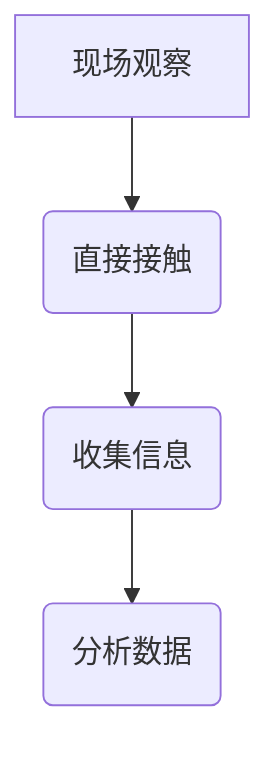
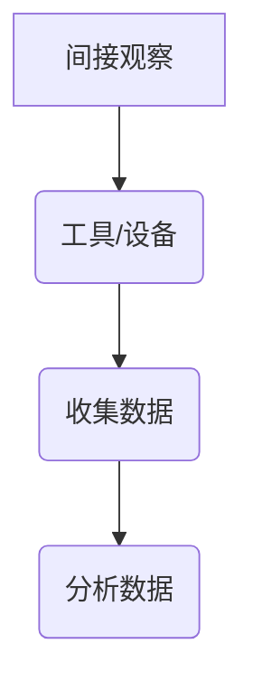
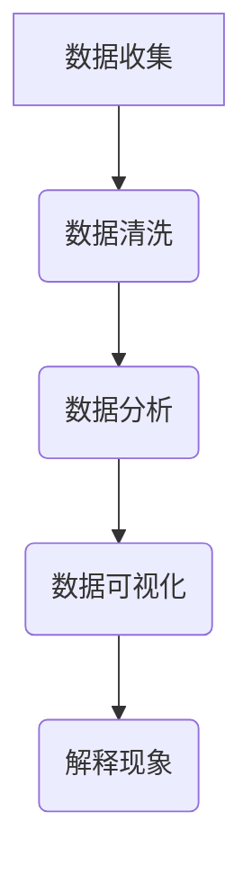
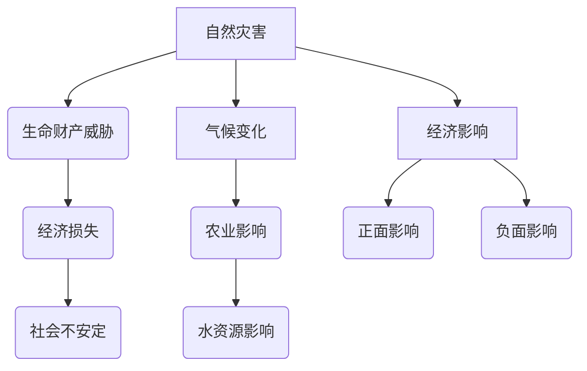

                 

### 1.2 观察自然现象的方法

要理解自然现象，观察是必不可少的第一步。通过观察，我们可以收集到关于自然现象的信息，从而对它们进行描述和分析。以下是一些常用的观察方法：

#### 1.2.1 现场观察

现场观察是指在自然现象发生的地方进行直接的观察。这种方法能够提供最直接的信息，但需要注意的是，某些自然现象可能在短时间内发生，因此需要快速反应和准备。例如，观察地震时，需要携带地震仪等设备进行实时记录。

**核心概念与联系：**

- **现场观察**：直接接触自然现象，收集第一手信息。
- **局限性**：某些现象发生速度较快，难以捕捉全部细节。

**Mermaid 流程图：**

#### 1.2.2 间接观察

间接观察是通过工具或设备来观察自然现象，例如使用卫星图像、雷达、传感器等。这种方法可以在不同的时间和空间尺度上观察自然现象，但可能会受到设备精度和操作技能的限制。

**核心概念与联系：**

- **间接观察**：借助工具或设备进行观察。
- **优势**：可在不同时间和空间尺度上观察。
- **局限性**：依赖设备的精度和操作技能。

**Mermaid 流程图：**

#### 1.2.3 数据收集与处理

无论是现场观察还是间接观察，收集到的数据都需要进行处理，以便于分析和解释。数据处理包括数据清洗、数据分析和可视化等步骤。

**核心概念与联系：**

- **数据收集**：获取观察结果。
- **数据处理**：清洗、分析和可视化数据。
- **分析结果**：用于解释自然现象。

**Mermaid 流程图：**

### 1.3 自然现象对人类的影响

自然现象对人类生活和社会发展有着深远的影响。以下是一些关键影响：

#### 1.3.1 灾害影响

自然灾害如地震、台风、洪水等对人类生命财产造成巨大威胁。例如，2008年四川汶川大地震导致近7万人死亡，数百万人无家可归。

#### 1.3.2 气候影响

气候变化对农业、水资源、生态系统等方面产生显著影响。例如，全球变暖导致冰川融化，海平面上升，对沿海地区造成威胁。

#### 1.3.3 经济影响

自然现象可能对经济产生正面或负面影响。正面影响如农业丰收，负面影响如灾害造成的经济损失。

**核心概念与联系：**

- **自然灾害**：对人类生命财产的威胁。
- **气候变化**：对农业、水资源、生态系统的影响。
- **经济影响**：正面或负面影响。

**Mermaid 流程图：**

通过以上分析，我们可以看到自然现象的多样性和观察方法的重要性，以及它们对人类的影响。接下来，我们将进一步探讨气象现象的数学描述。

