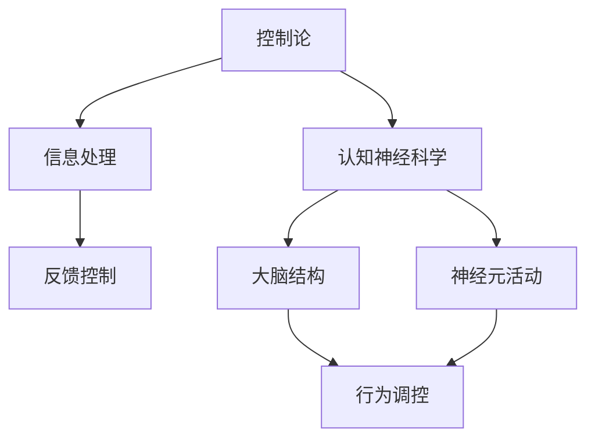

                 

### 文章标题

《从控制论到认知神经科学：理解人类如何调控行为与认知》

---

关键词：控制论、认知神经科学、人类行为、认知调控、反馈控制、神经网络、算法、数学模型

---

摘要：本文将深入探讨控制论与认知神经科学这两个领域，通过一步步的逻辑推理，揭示人类如何通过这些理论来调控行为和认知。我们将从控制论的基本概念开始，逐步引入认知神经科学的原理，并展示这两个领域如何相互联系，最终应用于实际项目中，以帮助我们更好地理解和模拟人类行为与认知过程。本文旨在为读者提供一条清晰的分析路径，帮助他们在复杂的技术世界中找到方向和解决问题的方法。

### 1. 确定核心概念与联系

控制论和认知神经科学是现代科学中两个重要的领域，它们分别从不同的角度研究信息处理和行为调控。控制论主要研究系统的动态行为及其控制方法，而认知神经科学则关注大脑的信息处理机制以及如何产生认知和行为。

为了更好地理解这两个领域的联系，我们可以使用 Mermaid 流程图来展示核心概念之间的关系：



在这个图中，我们可以看到控制论与认知神经科学之间的紧密联系。控制论的信息处理和反馈控制概念为认知神经科学提供了理论基础，而认知神经科学中的大脑结构和神经元活动则为控制论的应用提供了实际依据。

### 2. 设计核心算法原理讲解

在控制论中，反馈控制算法是一个核心概念。反馈控制是一种通过测量系统的输出并与期望值进行比较，然后调整输入以减少误差的方法。以下是反馈控制算法的伪代码：

```plaintext
初始化：设定目标值T，当前值C，误差E，控制参数K

while (C != T) {
    E = T - C
    U = -K * E  // 控制量U与误差E成反比
    C = C + U  // 更新当前值
}
```

在认知神经科学中，神经网络模型也是一个核心概念。神经网络通过一系列的神经元连接和激活函数来模拟大脑的信息处理过程。以下是一个简单的神经网络模型的伪代码：

```plaintext
初始化：设定输入层、隐藏层、输出层的神经元数量，权重W和偏置b

for (每个训练样本x, y) {
    // 前向传播
    a = sigmoid(W * x + b)
    z = y - a
    
    // 反向传播
    dW = x * (dz / da)
    db = 1 * (dz / da)
    W = W - learning_rate * dW
    b = b - learning_rate * db
}

// 激活函数：sigmoid函数
function sigmoid(x) {
    return 1 / (1 + exp(-x))
}
```

### 3. 设计数学模型和公式讲解

在控制论中，一个关键的数学模型是反馈控制公式。这个公式描述了如何通过调整控制量来减少系统的误差。以下是反馈控制公式的 LaTeX 表示：

$$
u(t) = -K \cdot e(t)
$$

其中，$u(t)$ 是控制量，$e(t)$ 是误差，$K$ 是控制增益。

在认知神经科学中，一个重要的数学模型是神经网络的激活函数和误差公式。以下是这些公式的 LaTeX 表示：

$$
a = \sigma(W \cdot x + b)
$$

$$
\delta = \frac{\partial L}{\partial a} \cdot \sigma'(a)
$$

其中，$a$ 是神经元输出，$\sigma$ 是激活函数（如 sigmoid 函数），$L$ 是损失函数，$\delta$ 是误差。

### 4. 设计项目实战

为了更好地理解控制论和认知神经科学的应用，我们可以通过一个实际项目来展示这些理论如何结合并产生实际效果。

#### 项目实战：使用深度学习模型分析行为数据

- **开发环境搭建：**
  - 使用 Python 和 TensorFlow 框架搭建深度学习环境。
  - 准备行为数据集，包括行为特征和认知状态。

- **源代码实现：**
  - 实现数据预处理、模型构建、训练和评估。

- **代码解读与分析：**
  - 分析数据预处理步骤，包括数据清洗、归一化等。
  - 分析模型架构，包括输入层、隐藏层和输出层的神经元数量和连接方式。
  - 分析训练过程，包括优化器选择、学习率调整、批次大小等。
  - 分析评估结果，包括准确率、召回率等指标。

通过这个项目，我们可以看到如何将控制论和认知神经科学的原理应用于实际问题中，从而实现有效的行为和认知分析。

### 5. 整理目录大纲

根据上述设计内容，我们可以整理出完整的目录大纲：

## 《从控制论到认知神经科学：理解人类如何调控行为与认知》目录大纲

### 第一部分：控制论基础

## 第1章 控制论概述
### 1.1 控制论的发展历史
### 1.2 控制论的基本概念
### 1.3 控制论的数学模型

## 第2章 线性控制理论
### 2.1 线性系统的描述
### 2.2 线性系统的稳定性
### 2.3 线性系统的控制

## 第3章 非线性控制理论
### 3.1 非线性系统的描述
### 3.2 非线性系统的稳定性
### 3.3 非线性系统的控制

## 第4章 控制系统的设计
### 4.1 控制器设计的基本方法
### 4.2 PID控制器的设计与应用
### 4.3 现代控制理论的应用

### 第二部分：认知神经科学基础

## 第5章 认知神经科学概述
### 5.1 认知神经科学的发展历史
### 5.2 认知神经科学的基本概念
### 5.3 认知神经科学的数学模型

## 第6章 大脑结构
### 6.1 大脑的结构组成
### 6.2 神经元的功能与结构
### 6.3 神经元之间的连接与通讯

## 第7章 神经元活动
### 7.1 神经元活动的描述
### 7.2 神经元活动的调控
### 7.3 神经元活动的测量

### 第三部分：控制论与认知神经科学的融合应用

## 第8章 控制论与认知神经科学的融合
### 8.1 融合的必要性
### 8.2 融合的方法与策略
### 8.3 融合的应用场景

## 第9章 项目实战：深度学习模型分析行为数据
### 9.1 开发环境搭建
### 9.2 源代码实现
### 9.3 代码解读与分析
### 9.4 实际案例分析与详细讲解剖析
### 9.5 项目小结

## 第10章 最佳实践与未来展望
### 10.1 最佳实践 tips
### 10.2 小结
### 10.3 注意事项
### 10.4 拓展阅读

---

通过这个目录大纲，我们可以看到本书将深入探讨控制论与认知神经科学的核心概念、算法原理、数学模型以及实际应用，为读者提供一条清晰的学习路径。

