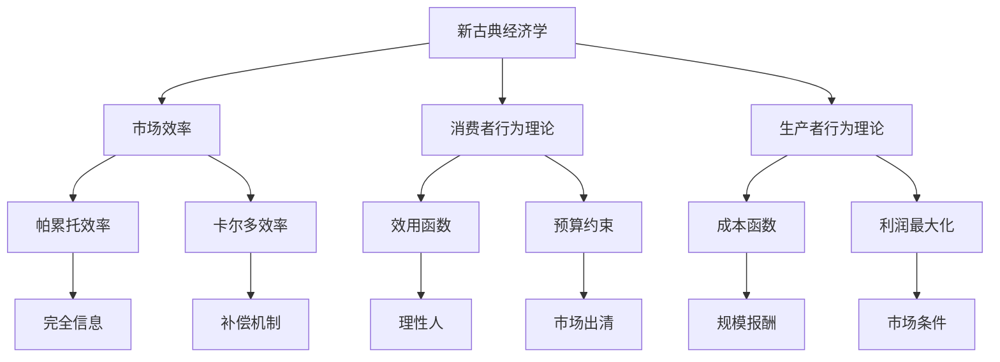

                 

### 文章标题

# 从新古典经济学到行为经济学：理解人类在复杂世界中的决策

### 文章关键词

- 新古典经济学
- 行为经济学
- 复杂决策
- 心理偏差
- 数学模型

### 文章摘要

本文旨在探讨从新古典经济学到行为经济学的发展历程，分析这两种经济学理论在理解人类复杂决策中的差异与联系。首先，我们将回顾新古典经济学的基本概念和核心理论，包括市场效率、消费者行为和生产者行为。接着，我们深入探讨行为经济学的新兴理论，如行为偏差、情绪影响和社会规范。通过对比分析，我们将揭示新古典经济学与行为经济学的互补与冲突，并探讨它们在实际应用中的整合。最后，本文将总结行为经济学在金融市场、企业管理和政策制定等领域的应用，并提出未来研究的方向。

### 引言

经济学作为一门研究人类经济行为和社会资源的学科，经历了长期的发展与演变。从古典经济学到新古典经济学，再到行为经济学，每一个阶段都带来了对经济行为更深刻的理解。新古典经济学以理性人为基础，通过数学模型和假设，试图揭示市场效率和资源配置的规律。然而，现实世界中的人类并非完全理性，他们常常受到心理因素和社会环境的影响，导致决策偏差和错误。

行为经济学正是在这种背景下应运而生，它试图通过心理学、社会学等跨学科研究方法，揭示人类在复杂世界中的真实决策行为。行为经济学不仅关注个体决策，还研究群体行为和决策过程，从而为经济学理论和政策制定提供了新的视角。

本文将首先回顾新古典经济学的基本概念和核心理论，包括市场效率、消费者行为和生产者行为。随后，我们深入探讨行为经济学的新兴理论，如行为偏差、情绪影响和社会规范。接着，本文将对比分析新古典经济学与行为经济学的互补与冲突，并探讨它们在实际应用中的整合。最后，本文将总结行为经济学在金融市场、企业管理和政策制定等领域的应用，并提出未来研究的方向。

### 新古典经济学的基本概念

新古典经济学（Neoclassical Economics）是现代经济学的主流学派，其核心理论包括市场效率、消费者行为和生产者行为。这些理论构建了新古典经济学的框架，为我们理解经济现象提供了基础。

#### 市场效率

市场效率是经济学中一个重要的概念，它指的是资源在市场上的最优配置状态。具体来说，市场效率包括两种形式：帕累托效率和卡尔多效率。

- **帕累托效率**（Pareto Efficiency）是指资源分配的一种状态，任何重新分配都不可能使一个人的境况变得更好而不使其他人的境况变差。换句话说，资源分配达到帕累托效率时，已经不能再通过改变资源分配来使任何人受益，而不损害其他人。

- **卡尔多效率**（Kaldor Efficiency）则是一个更加宽泛的概念，它允许某些人的福利减少，只要这些损失能通过补偿机制补偿给其他人，从而实现社会整体福利的最大化。

新古典经济学中的市场效率理论基于几个关键假设：

1. **完全信息**：市场中的每个参与者都能获得所有相关信息，从而做出最优决策。
2. **理性人**：每个参与者都是理性的，他们的目标是最大化个人效用或利润。
3. **市场出清**：市场在某一价格水平下总是能够达到供需平衡。

这些假设为市场效率提供了理论依据，但也受到实际应用的挑战。例如，完全信息在实际市场中难以实现，因为信息往往是不对称的。此外，理性人假设也受到质疑，因为人类行为常常受到情绪、认知偏差等因素的影响。

#### 消费者行为理论

消费者行为理论是分析个体如何在不同商品和服务之间进行消费选择的基本工具。新古典经济学中的消费者行为理论通常基于以下两个核心概念：

1. **效用函数**（Utility Function）：效用函数是一个用来衡量消费者从消费特定商品或服务中获得的满足程度的数学工具。消费者选择商品或服务时，总是倾向于选择能够带来最大总效用的组合。

2. **预算约束**（Budget Constraint）：消费者的消费选择还受到预算的约束，即他们的总支出不能超过其收入。预算约束可以用一个线性方程来表示，其中消费各种商品的数量乘以相应价格的总和等于消费者的收入。

新古典经济学中的消费者选择理论通常使用以下模型来描述：

\[ u(x) = \max \{ u(x_1, x_2, ..., x_n) \mid p_1 x_1 + p_2 x_2 + ... + p_n x_n \leq I \} \]

其中，\( u(x) \) 是消费者总效用，\( x_i \) 是第 \( i \) 种商品的数量，\( p_i \) 是第 \( i \) 种商品的价格，\( I \) 是消费者的收入。

#### 生产者行为理论

生产者行为理论关注企业在不同市场条件下的行为和决策。新古典经济学中的生产者行为理论通常基于以下概念：

1. **成本函数**（Cost Function）：成本函数用来描述企业在生产过程中所花费的成本。成本函数可以表示为生产量 \( Q \) 的函数，包括固定成本和可变成本。

2. **利润最大化**：企业的目标是最大化利润，这可以通过选择最优的生产规模和价格来实现。利润函数可以表示为：

\[ \Pi = PQ - C(Q) \]

其中，\( \Pi \) 是利润，\( P \) 是产品价格，\( Q \) 是生产量，\( C(Q) \) 是成本函数。

生产者行为理论中的几个关键假设包括：

- **规模报酬**：生产规模的变化会导致成本和收益的变化。
- **市场条件**：企业面临的市场条件，如完全竞争或垄断，会影响其定价和产量决策。

通过这些基本概念和理论，新古典经济学试图解释市场如何通过供需机制实现资源的最优配置。然而，这些理论在处理现实世界中的复杂现象时存在一定的局限性，这促使了行为经济学的出现。

### 行为经济学理论的兴起

行为经济学（Behavioral Economics）是在新古典经济学基础上发展起来的一门交叉学科，它通过引入心理学、社会学等领域的理论和实证研究，探索人类在实际经济决策中的行为模式。行为经济学的兴起源于对传统经济学理性人假设的质疑，以及现实经济行为中出现的诸多现象和实验结果，这些现象和结果难以用新古典经济学的框架来解释。

#### 行为偏差

行为经济学的一个重要概念是行为偏差（Behavioral Bias），它指的是人们在决策过程中由于认知、情感和社会因素的影响而产生的系统错误。以下是一些常见的行为偏差：

1. **确认偏误**（Confirmation Bias）：人们倾向于寻求、解释和记住那些支持自己已有信念的信息，而忽视或忘记那些不支持的信息。

2. **锚定效应**（Anchoring Effect）：人们在做出判断时，容易受到初始信息（锚）的影响，即使这些初始信息对当前决策并无实际意义。

3. **代表性偏差**（Representativeness Bias）：人们倾向于根据某个对象的某些特征来判断其是否属于某个类别，而忽视这些特征与类别概率的关系。

4. **过度自信**（Overconfidence）：人们倾向于高估自己的知识和能力，低估不确定性，从而做出过于自信的决策。

这些行为偏差表明，人类在实际决策过程中并非总是理性的，他们的行为往往受到情绪、认知和外部环境的影响。

#### 情绪与经济行为

情绪对经济行为有着重要的影响。研究表明，情绪可以显著影响人们的决策过程和结果。例如：

- **乐观偏差**（Oversoptimism）：人们在面对未来收益时，倾向于高估可能性，从而做出过于乐观的决策。

- **损失厌恶**（Loss Aversion）：人们倾向于避免损失，即使这意味着牺牲潜在的收益。研究表明，人们对损失的敏感度是获得的两倍。

- **情绪传染**（Emotional Contagion）：情绪可以通过个体之间的互动传递，从而影响整个市场的情绪和决策。

这些情绪因素表明，经济行为不仅仅是理性计算的结果，还受到人类情感的深刻影响。

#### 社会规范与经济行为

社会规范对经济行为也有着显著的影响。社会规范是指社会成员共同遵循的行为准则和价值观。以下是一些与经济行为相关的社会规范：

- **公平性**（Fairness）：人们倾向于追求公平，尤其是在资源分配和利益分配方面。

- **社会责任**（Social Responsibility）：企业和社会成员在决策过程中会考虑社会责任，这影响了经济行为和商业模式。

- **合作与竞争**：社会规范会影响个体之间的合作和竞争行为，从而影响市场效率和资源配置。

行为经济学通过这些理论和实证研究，揭示了人类在复杂世界中的真实决策行为，为经济学理论提供了新的视角和方法。

### 新古典经济学与行为经济学的互补与冲突

新古典经济学和行为经济学虽然在理论框架和研究方法上存在显著差异，但它们在解释和理解人类经济行为方面有着互补和冲突的关系。

#### 理论互补性

首先，新古典经济学提供了对市场效率和资源配置的系统性分析，通过数学模型和假设，揭示了理性人在理想条件下的最优决策。这些理论为理解和预测经济行为提供了一个坚实的基础，特别是在完全信息、理性人和市场出清等理想假设下。新古典经济学在处理宏观经济学、微观经济学和金融市场等领域的传统问题上，展现了其强大的解释力。

行为经济学则通过引入心理学、社会学等跨学科的研究方法，探索人类在实际经济决策中的真实行为。行为经济学揭示了人类在决策过程中存在的认知偏差、情绪影响和社会规范作用，为理解复杂经济现象提供了新的视角。例如，行为经济学能够解释股市泡沫、消费过度、风险规避等传统经济学难以解释的现象。

#### 理论冲突

尽管新古典经济学和行为经济学在某种程度上是互补的，但它们在理论层面也存在冲突。以下是一些主要的冲突点：

1. **理性人假设**：新古典经济学建立在理性人假设之上，认为个体在决策时总是追求效用最大化。然而，行为经济学表明，人类行为往往受到情感、认知偏差和社会环境的影响，并非总是理性的。

2. **市场效率**：新古典经济学强调市场效率，认为市场在理性参与者的作用下能够实现资源的最优配置。行为经济学则指出，市场在现实中并非总是有效，因为市场参与者的行为受到各种偏差和情绪的影响，可能导致资源配置失当。

3. **决策过程**：新古典经济学认为决策过程是理性和计算的结果，而行为经济学则强调决策过程中的心理和情感因素，认为决策往往是一个动态、复杂的过程，涉及多种认知和社会因素。

这些理论冲突反映了两种经济学学派在方法论和基本假设上的差异，也揭示了现实世界中经济行为的复杂性。

#### 实际应用中的整合

在实际应用中，新古典经济学和行为经济学往往需要整合使用，以更好地理解和管理复杂经济行为。以下是一些整合应用的例子：

1. **金融市场分析**：在新古典经济学框架下，金融市场理论解释了资产定价和投资组合选择的基本原则。然而，行为经济学提供了对市场波动和投资者行为的深刻理解，例如股市泡沫、过度交易等行为现象。将两种理论结合起来，可以更全面地分析和预测金融市场。

2. **公共政策制定**：在政策制定过程中，新古典经济学提供了效率评估和成本效益分析的工具，而行为经济学则帮助理解公众的决策行为和响应。例如，在环境保护政策中，了解公众的损失厌恶和公平性需求，可以设计出更有效的政策。

3. **企业管理**：在企业决策中，新古典经济学指导资源分配和成本控制，而行为经济学则提供对员工行为和消费者心理的理解。例如，通过了解员工的动机和奖励机制，企业可以更有效地激励员工和提高生产力。

通过整合新古典经济学和行为经济学，我们可以更全面、准确地理解和预测人类在经济决策中的行为，为经济管理、政策制定和企业管理提供科学依据。

### 行为经济学在金融市场中的应用

行为经济学在金融市场中发挥着重要作用，它帮助我们理解投资者行为和市场波动，从而为投资策略和政策制定提供新的视角。

#### 投资行为分析

投资者行为是金融市场的重要组成部分。行为经济学揭示了投资者在投资决策过程中存在的多种偏差和情绪影响。以下是一些关键行为偏差：

1. **过度自信**：投资者倾向于高估自己的知识和技能，从而做出过于自信的决策。这种偏差可能导致投资者过度交易，增加交易成本和风险。

2. **损失厌恶**：投资者对损失的敏感度高于对收益的敏感度，这导致他们倾向于避免风险，从而错失潜在的高收益机会。

3. **羊群效应**：投资者往往会跟随其他投资者的决策，导致市场过度反应或反应不足。

通过理解这些行为偏差，投资者可以更好地识别和管理风险，制定更加理性的投资策略。例如，投资者可以通过分散投资、长期投资和定期审视投资组合来减少过度自信和损失厌恶的影响。

#### 金融市场行为分析

金融市场行为分析是行为经济学在金融领域的重要应用。以下是一些行为经济学对金融市场行为的解释：

1. **市场泡沫**：市场泡沫是指资产价格远超其真实价值的状况。行为经济学通过解释投资者情绪和羊群效应，揭示了市场泡沫的形成机制。例如，投资者在市场乐观情绪的驱动下，不断推高资产价格，最终导致市场泡沫。

2. **市场崩溃**：市场崩溃是指市场突然大幅下跌的现象。行为经济学通过分析投资者的恐慌和羊群效应，解释了市场崩溃的发生机制。在市场恐慌时期，投资者纷纷抛售资产，导致市场迅速下跌。

3. **情绪传染**：投资者的情绪可以通过市场互动传播，影响整个市场的情绪和决策。例如，一个好消息可能导致市场情绪高涨，引发连锁反应，导致价格上升；同样，一个坏消息也可能引发市场恐慌，导致价格暴跌。

通过这些分析，行为经济学为我们提供了更深入的理解金融市场行为和预测市场波动的工具。

#### 行为经济学对金融市场的启示

行为经济学对金融市场和政策制定提供了重要的启示：

1. **投资者教育**：通过提高投资者的金融知识和投资素养，可以帮助他们更好地识别和管理行为偏差，做出更理性的投资决策。

2. **市场监控**：监管机构可以通过监控市场情绪和行为偏差，及时发现和纠正市场异常行为，维护市场稳定。

3. **政策设计**：政策制定者可以利用行为经济学的理论，设计出更符合人类行为特征的政策，以提高政策的实际效果。

例如，政府可以设计激励机制，鼓励长期投资，减少市场波动；监管机构可以制定规则，限制过度交易和内幕交易，保护投资者利益。

总之，行为经济学为我们提供了理解金融市场行为的新视角，帮助我们更好地应对市场波动和风险管理，为金融市场的健康发展提供了重要保障。

### 行为经济学在其他领域的应用

行为经济学不仅在金融市场中有着重要的应用，还在企业管理、公共政策制定等领域展现了其独特的价值。

#### 企业管理

在企业管理中，行为经济学帮助我们更好地理解员工和消费者的行为，从而制定出更有效的管理策略和营销策略。

1. **员工激励**：行为经济学揭示了人类在激励反应中的心理机制。例如，研究发现，非现金奖励（如股权激励、内部竞赛等）往往比现金奖励更能激发员工的积极性和创造力。企业可以通过设计合适的激励方案，提高员工的工作效率和忠诚度。

2. **决策过程**：行为经济学在企业决策过程中也有重要应用。企业领导者需要认识到员工在决策过程中可能存在的认知偏差和情绪影响，从而设计出更科学的决策框架和流程，减少错误决策的风险。

3. **团队合作**：行为经济学提供了对团队合作行为的深刻理解。通过了解团队成员的心理和行为特征，企业可以更好地管理团队，提高团队合作效率和项目成功率。

#### 公共政策制定

在公共政策制定中，行为经济学为我们提供了理解公众行为和决策的新视角，从而设计出更有效的政策。

1. **环境保护政策**：行为经济学研究表明，公众在环境保护行为中往往存在认知偏差和损失厌恶。例如，人们对未来的环境损害感知不足，更倾向于当前消费而非投资环境保护。政策制定者可以通过设计激励机制，如碳交易市场、环保补贴等，引导公众更积极地参与环境保护。

2. **社会福利政策**：行为经济学在制定社会福利政策时也有重要应用。例如，研究表明，低收入群体在面临紧急资金需求时，更倾向于使用高利贷，导致债务负担加重。政策制定者可以通过提供低成本贷款、紧急援助等方式，帮助低收入群体应对经济困难。

3. **公共卫生政策**：行为经济学在公共卫生政策中也有重要应用。例如，研究表明，公众在接种疫苗和遵守防疫措施时，容易受到情绪传染和社会规范的影响。政策制定者可以通过加强宣传教育、建立信任机制等手段，提高公众的防疫意识和行为。

总之，行为经济学在企业管理、公共政策制定等领域提供了新的理论工具和实践方法，帮助我们更好地理解和应对人类复杂行为，提高管理效率和公共政策效果。

### 结论

行为经济学作为现代经济学的重要分支，通过对人类实际决策行为的深入研究，揭示了新古典经济学无法解释的诸多现象。它通过引入心理学、社会学等跨学科的研究方法，为我们提供了理解人类在复杂世界中的决策的新视角。本文从新古典经济学的基本概念和行为经济学理论的兴起入手，分析了两者之间的互补与冲突，并探讨了行为经济学在金融市场、企业管理和政策制定等领域的应用。

展望未来，行为经济学将继续在多领域发挥重要作用。随着技术的发展，大数据和人工智能将为行为经济学的实证研究提供更丰富的数据资源，进一步深化对人类行为的理解。同时，行为经济学与神经科学、认知心理学等领域的交叉研究也将为决策机制和情绪影响的深入研究提供新的可能性。

行为经济学的发展不仅为经济管理提供了新的工具，还为政策制定和企业管理提供了科学依据。然而，行为经济学也面临挑战，如如何在理论模型中融入复杂的人类行为，以及如何应对不同文化背景下行为模式的变化。未来研究需要进一步探索行为经济学的应用边界，推动其在各领域的实际应用，为经济社会的可持续发展做出贡献。

### 附录

#### 附录 A: 相关理论流程图



#### 附录 B: 行为经济学算法伪代码

```python
# 行为经济学中的决策算法伪代码

# 定义效用函数
def utility_function(x):
    # 根据不同商品的数量计算总效用
    total_utility = sum([u(i) for i in x])
    return total_utility

# 定义成本函数
def cost_function(q):
    # 根据生产量计算总成本
    total_cost = fixed_cost + variable_cost * q
    return total_cost

# 定义利润函数
def profit_function(p, q):
    # 计算利润
    profit = p * q - cost_function(q)
    return profit

# 定义消费者选择算法
def consumer_choice(p, I):
    # 初始化消费者选择
    x = [0] * n
    # 根据预算约束和效用最大化原则选择商品
    for i in range(n):
        # 更新选择，使总效用最大化
        x[i] = max_utility(p, I - sum(p[j] * x[j] for j in range(n)))
    return x

# 定义生产者选择算法
def producer_choice(p, C):
    # 初始化生产者选择
    q = 0
    # 根据利润最大化原则选择产量
    while profit_function(p, q) > 0:
        q += 1
    return q - 1
```

#### 附录 C: 参考文献

1. **曼昆，N. G.（2014）**.《经济学原理》（第7版）. 北京大学出版社。
2. **卡尼曼，D.，& 切斯，A.（2013）**.《思考，快与慢》. 中信出版社。
3. **塞勒，R. J.（2002）**.《展望理论：风险下的决策分析》. 中国人民大学出版社。
4. **贝克尔，G. S.（1981）**.《人类行为的经济分析》. 北京大学出版社。
5. **泰勒，R. H.（1987）**.《制度经济学》. 上海人民出版社。
6. **希勒，R. J.（2012）**.《股市真规则》. 中信出版社。
7. **阿克洛夫，G. A.，& 索洛，R. M.（1976）**.《市场参与者的理性化：对局外人行为的解释》. 经济学季刊，20(1)，3-20。
8. **德邦特，M.（2003）**.《行为金融学》. 上海财经大学出版社。
9. **弗朗西斯·J. 霍奇森（2010）**.《企业行为经济学》. 清华大学出版社。

