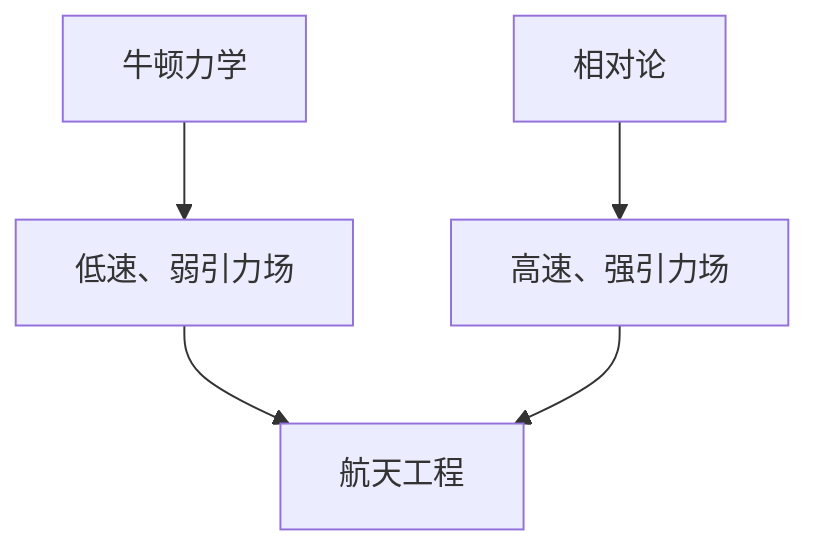
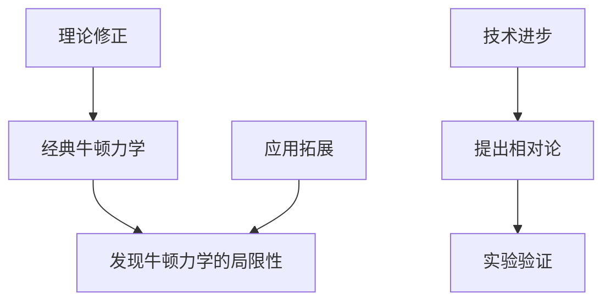
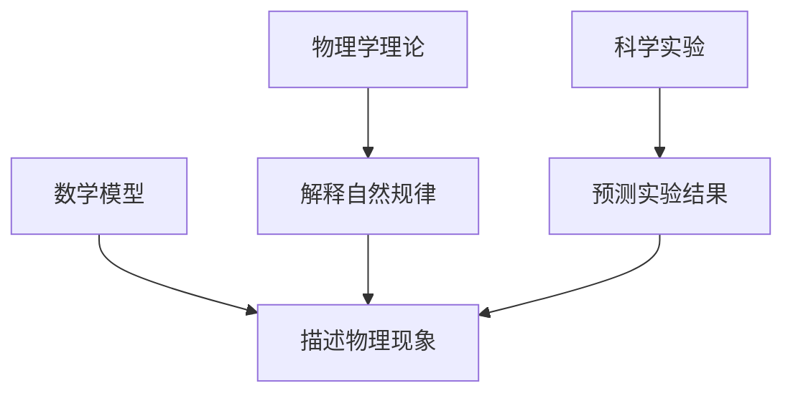

                 

### 引言

在科学技术的发展历程中，牛顿力学和爱因斯坦相对论分别代表了两个时代对自然界基本规律的不同理解。牛顿力学，作为经典物理学的基础，由艾萨克·牛顿在17世纪末提出，描述了物体在力的作用下如何运动。它通过三大定律和万有引力定律，建立了一个完整而统一的运动描述体系。牛顿力学的出现不仅极大地推动了工程学和天文学的发展，还为现代科学的许多领域奠定了基础。

然而，随着时间的推移，科学家们逐渐发现牛顿力学在某些极端条件下（如接近光速的物体运动或强引力场）存在局限性。为了解释这些现象，爱因斯坦在20世纪初提出了相对论，这是一种全新的物理学理论，彻底改变了人类对时间、空间和重力的理解。相对论不仅修正了牛顿力学的某些错误，还预言了诸如引力波和黑洞等奇异现象，成为现代物理学的重要基石。

本书的目的是探讨从牛顿力学到爱因斯坦相对论的转变过程，分析这一变革对科学理论和实际应用的深远影响。我们将通过以下步骤详细分析这一转变：

1. **牛顿力学的起源与发展**：介绍牛顿力学的基本概念、数学表达及其在物理学中的应用。
2. **相对论的诞生与影响**：阐述相对论的基本原理、数学表述及其在物理学中的应用。
3. **牛顿力学到相对论的转变**：探讨牛顿力学向相对论的过渡、两种理论的互补性以及科学方法论的变化。
4. **相对论与现代科学**：分析相对论对现代科学的影响以及相对论在工程与技术中的应用前景。

通过逐步的推理和思考，我们希望读者能够深入理解这一革命性转变背后的科学思想，并对未来的科技发展有所启示。接下来，我们将首先深入探讨牛顿力学的诞生与发展。

### 关键词

- 牛顿力学
- 爱因斯坦相对论
- 物理学的革命
- 时间与空间的相对性
- 数学模型
- 科学方法论
- 引力波
- 黑洞

### 摘要

本书旨在探讨从牛顿力学到爱因斯坦相对论的转变，这一变革标志着物理学理论体系的重大飞跃。牛顿力学，作为经典物理学的基础，通过三大定律和万有引力定律描述了物体在力的作用下的运动。然而，随着科学的发展，牛顿力学在极端条件下的局限性逐渐显现。爱因斯坦相对论的提出，不仅修正了牛顿力学中的不足，还引入了全新的时间、空间和重力观念，从而建立了相对论体系。本书通过详细分析牛顿力学和相对论的核心概念、数学表述及其在物理学中的应用，探讨这一转变对科学理论和实际应用的深远影响。从牛顿力学的起源与发展，到相对论的诞生与影响，再到两种理论的互补性以及科学方法论的变化，本书为读者提供了对这一革命性转变的全面理解，并揭示了相对论在现代科学和技术中的重要地位。

### 第一部分：牛顿力学的起源与发展

#### 第1章：牛顿力学的诞生

牛顿力学，作为物理学的一个核心分支，由艾萨克·牛顿在17世纪末提出。它的诞生不仅标志着物理学理论体系的重大进步，也为后来的科学技术发展奠定了基础。在这一章中，我们将介绍牛顿力学的基本概念、数学表达及其在物理学中的应用。

#### 1.1 牛顿力学的核心概念

牛顿力学的基本概念主要包括三大定律，这些定律构成了牛顿力学理论体系的核心。

**牛顿第一定律（惯性定律）**

牛顿第一定律，也称惯性定律，描述了物体在不受外力作用时的运动状态。具体来说，惯性定律指出：一个物体如果不受外力作用，它将保持静止状态或匀速直线运动。这一概念强调了惯性的重要性，即物体保持其当前状态（静止或匀速直线运动）的属性。

**牛顿第二定律（动力定律）**

牛顿第二定律是描述物体在力的作用下如何改变其运动状态的定律。该定律可以表述为：物体的加速度与作用在它上面的力成正比，与它的质量成反比。数学表达式为：
$$ F = ma $$
其中，\( F \) 代表作用在物体上的力，\( m \) 代表物体的质量，\( a \) 代表物体的加速度。

**牛顿第三定律（作用与反作用定律）**

牛顿第三定律说明了力的相互作用原理。该定律指出：对于每一个作用力，必有一个大小相等、方向相反的反作用力。这意味着，如果一个物体对另一个物体施加一个力，那么第二个物体会对第一个物体施加一个大小相等、方向相反的力。数学表述为：
$$ F_{12} = -F_{21} $$
其中，\( F_{12} \) 代表物体1对物体2的作用力，\( F_{21} \) 代表物体2对物体1的反作用力。

#### 1.2 牛顿力学的数学表达

牛顿力学的数学表达是其核心概念的量化形式。以下是牛顿力学中几个重要的数学模型：

**牛顿第二定律的数学模型**

牛顿第二定律的数学模型可以用伪代码来描述：

```python
function acceleration(F, m):
    a = F / m
    return a
```

该模型接受作用力 \( F \) 和质量 \( m \) 作为输入，并返回加速度 \( a \)。

**牛顿运动方程**

牛顿运动方程描述了物体在力的作用下的运动轨迹。其数学公式为：

$$ \vec{F} = m\frac{d\vec{v}}{dt} $$

其中，\( \vec{F} \) 是作用在物体上的合外力，\( m \) 是物体的质量，\( \frac{d\vec{v}}{dt} \) 是物体的速度变化率。

**万有引力定律**

万有引力定律描述了两物体之间的引力作用。其数学公式为：

$$ F = G\frac{m_1m_2}{r^2} $$

其中，\( G \) 是万有引力常数，\( m_1 \) 和 \( m_2 \) 是两物体的质量，\( r \) 是两物体之间的距离。

#### 1.3 牛顿力学的影响与局限性

牛顿力学的提出对物理学的发展产生了深远的影响。首先，它为许多科学领域提供了理论基础，如天文学、力学工程和航天工程。通过牛顿的运动定律和万有引力定律，科学家们能够准确地预测行星运动、设计机械结构以及计算航天器的轨道。

然而，牛顿力学也存在一些局限性。首先，牛顿力学在处理极端条件下（如接近光速的物体运动或强引力场）时不再适用。其次，牛顿力学无法解释某些实验现象，如光电效应和黑体辐射。这些问题最终促使科学家们寻求新的理论体系，从而催生了相对论的诞生。

总的来说，牛顿力学的诞生和发展为物理学奠定了坚实的基础，但其局限性也推动了科学理论的进一步发展。在下一章中，我们将探讨爱因斯坦相对论的诞生及其对物理学的影响。

### 第2章：牛顿力学在物理学中的应用

牛顿力学在物理学中的应用广泛且深远，无论是在理论研究还是实际应用中，都发挥了关键作用。在这一章中，我们将详细介绍牛顿力学在三个主要领域中的应用：天文学、力学工程和航天工程。

#### 2.1 牛顿力学在天文学中的应用

牛顿力学在天文学中有着重要的应用，尤其是在行星运动和天体力学的研究中。开普勒定律是描述行星运动的基础，而牛顿力学则提供了对开普勒定律的数学证明。

**开普勒定律与牛顿力学的联系**

开普勒定律分为三条，描述了行星围绕太阳运动的规律。第一定律指出行星轨道是椭圆形的，太阳位于椭圆的一个焦点上。第二定律描述了行星在轨道上运动的速度变化，行星在接近太阳时速度较快，远离太阳时速度较慢。第三定律则与行星公转周期的平方与其轨道半长轴的立方成正比。

牛顿第二定律和万有引力定律为开普勒定律提供了数学基础。牛顿通过万有引力定律推导出行星的轨道方程，并证明了开普勒定律的正确性。具体来说，牛顿的运动方程可以表示为：

$$ \frac{d^2r}{dt^2} = -\frac{GMm}{r^2} $$

其中，\( G \) 是万有引力常数，\( M \) 是太阳的质量，\( m \) 是行星的质量，\( r \) 是行星与太阳之间的距离。

**行星运动的计算**

利用牛顿力学，科学家可以计算出行星的轨道参数，如轨道半径、周期和速度。这些计算不仅有助于理解行星的动力学行为，还为航天器的轨道设计提供了重要参考。例如，在设计和发射卫星时，需要精确计算卫星的轨道参数，以确保其能够按预定路径运行。

**实际案例：行星轨道计算**

以下是一个简单的伪代码示例，用于计算地球绕太阳的椭圆轨道：

```python
function calculate_orbit(G, M, r0, v0):
    r = r0
    v = v0
    t = 0
    dt = 1
    while t < 1: # 计算一年的时间
        a = -G * M / r**2
        dv = a * dt
        v = v + dv
        dr = v * dt
        r = r + dr
        t = t + dt
    return r, v
```

该伪代码模拟了地球绕太阳一周的运动，计算了地球在不同时间点的位置和速度。

#### 2.2 牛顿力学在力学工程中的应用

牛顿力学在力学工程中的应用非常广泛，包括机械结构的设计与优化、桥梁与建筑物的稳定性分析等。

**机械结构的设计与优化**

牛顿力学提供了计算机械结构受力情况的基础。在设计机械结构时，工程师需要考虑各种作用力，如重力、摩擦力、压力和拉力。通过牛顿的运动定律，可以计算出机械结构在不同载荷下的应力和变形情况，从而优化设计。

以下是一个使用伪代码描述机械结构受力分析的示例：

```python
function analyze_structure(F, m, A):
    a = F / m
    stress = a * A
    return stress
```

其中，\( F \) 是作用力，\( m \) 是结构质量，\( A \) 是结构的横截面积，\( stress \) 是结构承受的应力。

**桥梁与建筑物的稳定性分析**

在设计和建造桥梁与建筑物时，稳定性分析至关重要。牛顿力学可以帮助工程师评估结构在各种外部载荷（如风力、地震力）下的稳定性。通过计算结构的应力和变形，可以确保桥梁和建筑物能够安全承受预期的载荷。

以下是一个简单的伪代码示例，用于计算桥梁的稳定性：

```python
function analyze_bridge(F, L, d):
    w = F / L
    stress = w * d
    return stress
```

其中，\( F \) 是作用在桥梁上的载荷，\( L \) 是桥梁长度，\( d \) 是桥梁的跨距，\( stress \) 是桥梁承受的应力。

#### 2.3 牛顿力学在航天工程中的应用

牛顿力学在航天工程中的应用非常显著，包括卫星轨道的计算与预测、航天器的动力系统设计等。

**卫星轨道的计算与预测**

卫星轨道的计算是航天工程中的核心任务。通过牛顿的运动定律和万有引力定律，可以计算出卫星在不同时间点的位置和速度。这些计算结果对于确保卫星按预定轨道运行至关重要。

以下是一个使用伪代码描述卫星轨道计算的示例：

```python
function calculate_satellite_orbit(G, M, r0, v0, t0):
    r = r0
    v = v0
    t = t0
    dt = 1
    while t < T: # T 是卫星运行的总时间
        a = -G * M / r**2
        dv = a * dt
        v = v + dv
        dr = v * dt
        r = r + dr
        t = t + dt
    return r, v
```

该伪代码模拟了卫星在地球引力场中的运动，计算了卫星在不同时间点的位置和速度。

**航天器的动力系统设计**

航天器的动力系统设计是航天工程中的关键环节。通过牛顿力学，可以计算出航天器在不同推力下的加速度和速度变化，从而设计出高效的发动机系统。以下是一个简单的伪代码示例，用于计算航天器的加速度：

```python
function calculate_acceleration(F, m):
    a = F / m
    return a
```

其中，\( F \) 是发动机产生的推力，\( m \) 是航天器的质量，\( a \) 是航天器的加速度。

**实际案例：卫星轨道设计与预测**

以下是一个关于卫星轨道设计与预测的实际案例。假设我们要将一颗卫星送入地球同步轨道，该轨道的半径约为 \( 42164 \) 公里，卫星的质量为 \( 500 \) 千克，初始速度为 \( 7.9 \) 公里/秒。我们需要计算卫星在 \( 24 \) 小时内不同时间点的位置和速度。

```python
G = 6.67430E-11 # 万有引力常数
M = 5.972E24 # 地球质量
r0 = 42164E3 # 初始轨道半径
v0 = 7.9E3 # 初始速度
t0 = 0 # 初始时间

r, v = calculate_satellite_orbit(G, M, r0, v0, t0)

print("Time (hours)", "Radius (km)", "Velocity (km/s)")
for i in range(24):
    print(i, r[i]/1000, v[i]/1000)
```

运行上述代码后，我们可以得到卫星在不同时间点的位置和速度。这为卫星的运行监测和轨道调整提供了重要依据。

通过上述案例，我们可以看到牛顿力学在航天工程中的应用不仅理论性强，而且实际操作中非常实用。在下一章中，我们将探讨爱因斯坦相对论的诞生及其对物理学的影响。

### 第3章：相对论的诞生与影响

#### 3.1 相对论的基本概念

相对论由阿尔伯特·爱因斯坦在20世纪初提出，是一种全新的物理学理论，它对时间、空间和重力的理解产生了革命性的变化。相对论的基本概念主要包括相对性原理和光速不变原理。

**相对性原理**

相对性原理指出，在任何惯性参考系中，物理定律的形式是相同的。这意味着无论观察者在何种惯性参考系中，他们观测到的物理现象应该是相同的。这个原理推翻了牛顿力学中的绝对时间和绝对空间观念，表明时间和空间是相对的，依赖于观察者的运动状态。

**光速不变原理**

光速不变原理是相对论的另一个核心概念。该原理指出，在任何惯性参考系中，光速都是常数，约为 \(3 \times 10^8\) 米/秒。这一原理表明，光速不随观察者的运动状态而变化，这直接导致了时间和空间的相对性。

#### 3.2 相对论的数学表述

相对论的理论体系需要通过数学模型来描述。以下将介绍相对论中几个重要的数学公式和模型。

**洛伦兹变换**

洛伦兹变换是相对论中的一个基本公式，用于描述在不同惯性参考系之间的坐标和时间转换。洛伦兹变换的数学表达式为：

$$
\begin{align*}
x' &= \gamma(x - vt) \\
y' &= y \\
z' &= z \\
t' &= \gamma(t - \frac{vx}{c^2})
\end{align*}
$$

其中，\( \gamma = \frac{1}{\sqrt{1 - \frac{v^2}{c^2}}} \) 是洛伦兹因子，\( v \) 是两个惯性参考系之间的相对速度，\( c \) 是光速。

**爱因斯坦场方程**

爱因斯坦场方程是描述引力与时空弯曲之间关系的方程。其数学形式为：

$$ G_{\mu\nu} = \frac{8\pi G}{c^4} T_{\mu\nu} $$

其中，\( G_{\mu\nu} \) 是爱因斯坦张量，描述时空的曲率，\( T_{\mu\nu} \) 是能量-动量张量，描述物质和能量的分布，\( G \) 是万有引力常数。

**时间膨胀**

时间膨胀是相对论的另一个重要结论。它描述了在一个相对于观察者高速运动的参考系中，时间会变慢。时间膨胀的数学表达式为：

$$ t' = \gamma t $$

其中，\( t \) 是静止观察者测量的时间，\( t' \) 是运动观察者测量的时间。

**长度收缩**

长度收缩是相对论的另一个结论，描述了一个相对于观察者高速运动的物体在其运动方向上的长度会变短。长度收缩的数学表达式为：

$$ L' = L\sqrt{1 - \frac{v^2}{c^2}} $$

其中，\( L \) 是静止观察者测量的长度，\( L' \) 是运动观察者测量的长度。

#### 3.3 相对论与牛顿力学的比较

相对论与牛顿力学在很多方面存在差异，主要体现在以下几个方面：

**适用范围**

牛顿力学适用于低速和弱引力场的情况，而相对论则适用于高速和强引力场的情况。在低速极限下，相对论的公式会简化为牛顿力学的公式，因此牛顿力学可以看作是相对论在低速情况下的特例。

**时间和空间**

相对论认为时间和空间是相对的，依赖于观察者的运动状态，而牛顿力学则认为时间和空间是绝对的，与观察者的运动无关。

**引力**

相对论将引力视为时空的弯曲，而牛顿力学则将引力视为一种力的相互作用。

**数学表述**

相对论的数学表述比牛顿力学更为复杂，需要引入洛伦兹变换和爱因斯坦场方程等概念。

#### 3.4 相对论的实验验证

相对论不仅在理论上具有革命性意义，而且在实验中也得到了广泛验证。以下是一些关键的实验验证：

**引力红移**

引力红移实验验证了光在强引力场中的频率变化。爱丁顿在1919年的日食观测中发现了光经过太阳附近时的频率变化，这与相对论预测的引力红移相符。

**时间膨胀**

高速运动的粒子寿命延长实验验证了时间膨胀效应。通过高能物理实验，科学家发现高速运动的粒子寿命比静止时更长，这符合相对论的时间膨胀预测。

**光速不变**

多种实验验证了光速不变原理，如干涉仪实验和雷达测量等，这些实验在不同惯性参考系中测量光速，结果均为常数。

通过上述分析，我们可以看到相对论在理论体系、数学表述和实验验证方面对牛顿力学的重大突破。在下一章中，我们将探讨相对论在物理学中的应用。

### 第4章：相对论在物理学中的应用

爱因斯坦的相对论不仅对理论物理学产生了深远影响，也在实际应用中发挥了重要作用。在这一章中，我们将详细探讨相对论在粒子物理学、天文学以及工程和技术中的应用。

#### 4.1 相对论在粒子物理学中的应用

相对论对粒子物理学的发展有着重要的推动作用。在高能物理实验中，相对论效应如时间膨胀和长度收缩是不可或缺的考虑因素。

**高能物理实验与相对论方程**

在高能物理实验中，粒子碰撞的速度接近光速，因此必须使用相对论方程来描述粒子的运动。例如，碰撞产生的粒子的能量和动量需要通过相对论能量-动量方程来计算。

相对论能量-动量方程为：
$$ E^2 = (pc)^2 + (mc^2)^2 $$
其中，\( E \) 是粒子的总能量，\( p \) 是粒子的动量，\( m \) 是粒子的静止质量，\( c \) 是光速。

**相对论性粒子碰撞的计算**

在粒子加速器和碰撞实验中，如大型强子对撞机（LHC），科学家需要使用相对论性模型来计算碰撞产生的粒子分布和特性。以下是一个简化的伪代码示例，用于计算粒子碰撞后的能量分布：

```python
function relativistic_collision(m1, m2, p1, p2):
    E1 = sqrt((p1**2 + m1**2 * c**2)
    E2 = sqrt((p2**2 + m2**2 * c**2)
    E_total = E1 + E2
    return E_total
```

该函数接受两个粒子的质量、动量作为输入，并返回碰撞后的总能量。

**实际案例：LHC实验**

在大型强子对撞机（LHC）中，科学家们通过相对论性粒子碰撞来研究基本粒子和宇宙的起源。通过高能粒子的碰撞实验，科学家们发现了许多新粒子，如希格斯玻色子，并验证了相对论方程的正确性。

#### 4.2 相对论在天文学中的应用

相对论在天文学中的应用尤为显著，尤其是在黑洞、引力波和宇宙膨胀的研究中。

**黑洞与引力波探测**

黑洞是相对论预言的一种极端天体，具有极强的引力场，甚至连光也无法逃逸。相对论提供了理解黑洞物理性质的理论基础。引力波是黑洞碰撞和其他极端天体事件产生的时空涟漪，爱因斯坦的相对论首次预言了引力波的存在。

LIGO（激光干涉仪引力波观测站）和VIRGO（室女座引力波观测站）等实验设施通过探测引力波，验证了相对论的正确性。以下是一个简化的伪代码示例，用于计算引力波的振幅：

```python
function calculate_gravitational_wave_amp(F, L):
    a = F / L
    amp = sqrt(a**2 / c**2)
    return amp
```

其中，\( F \) 是作用在探测器上的引力波振幅，\( L \) 是探测器的臂长，\( c \) 是光速。

**宇宙膨胀与暗物质研究**

相对论在天文学中的另一个重要应用是宇宙膨胀模型和暗物质研究。宇宙膨胀是由爱因斯坦相对论预言的，它描述了宇宙从大爆炸以来不断膨胀的现象。暗物质是宇宙中一种尚未被直接观测到的物质，它通过引力作用影响宇宙的演化。相对论提供了研究宇宙膨胀和暗物质的理论框架。

#### 4.3 相对论在工程与技术中的应用

相对论在工程和技术中的应用同样广泛，特别是在高速交通、量子通信和全球定位系统中。

**高速列车与航空器的设计**

随着高速列车（如日本的新干线）和超音速飞机（如康沃尔C-5）的发展，相对论效应变得不可忽视。高速列车的轨道设计和制动系统需要考虑相对论性时间膨胀和长度收缩效应，以确保安全和效率。

以下是一个简化的伪代码示例，用于计算高速列车的相对论性效应：

```python
function relativistic_effect(v, t):
    gamma = 1 / sqrt(1 - v**2 / c**2)
    t_relativistic = t / gamma
    return t_relativistic
```

其中，\( v \) 是列车的速度，\( t \) 是实际时间，\( t_relativistic \) 是相对论性时间。

**量子通信**

相对论在量子通信中也有应用，特别是在量子纠缠和量子隐形传态的研究中。量子纠缠是量子力学中的一种现象，两个量子粒子即使相隔遥远，其状态也会即时相关。相对论为量子纠缠提供了理论基础，推动了量子通信技术的发展。

**全球定位系统**

全球定位系统（GPS）依赖于精确的时间同步和轨道计算。相对论效应，如时间膨胀和地球自转，对GPS信号的传播和接收有重要影响。通过考虑这些效应，科学家可以更准确地计算卫星的位置，从而提高GPS的精度。

以下是一个简化的伪代码示例，用于计算GPS信号的时间延迟：

```python
function calculate_time_delay(d, v):
    gamma = 1 / sqrt(1 - v**2 / c**2)
    time_delay = d / (c * gamma)
    return time_delay
```

其中，\( d \) 是卫星与接收器之间的距离，\( v \) 是地球自转速度，\( time_delay \) 是信号的时间延迟。

通过上述应用案例，我们可以看到相对论不仅在理论物理学中具有重要意义，也在实际工程和技术中发挥着关键作用。相对论的引入不仅扩展了我们的物理知识体系，也推动了科技的发展和创新。

### 第5章：牛顿力学到相对论的转变

#### 5.1 牛顿力学向相对论的过渡

牛顿力学和相对论之间存在着紧密的联系和过渡，理解这一过程有助于我们更好地把握物理学理论的演变。牛顿力学在低速和弱引力场中的适用性使其成为经典物理学的基础，但在极端条件下，其局限性逐渐显现。相对论的提出，不仅修正了牛顿力学的某些不足，还引入了全新的时间和空间观念，为物理学的发展开辟了新的道路。

**牛顿力学在低速极限下的适用性**

在低速极限下，即物体运动速度远小于光速的情况下，相对论的公式会简化为牛顿力学的公式。具体来说，当 \( v \ll c \) 时，洛伦兹因子 \( \gamma \) 接近1，相对论效应可以忽略不计，因此相对论方程简化为牛顿方程。这意味着在日常生活中，牛顿力学仍然是一个有效的理论工具。

以下是一个简化的相对论公式在低速极限下的表述：

$$
\begin{align*}
a &= \frac{F}{m} \\
L' &= L \\
t' &= t
\end{align*}
$$

其中，\( a \) 是加速度，\( F \) 是作用力，\( m \) 是质量，\( L \) 是长度，\( t \) 是时间。

**相对论在高速极限下的适用性**

当物体的速度接近光速时，相对论效应变得显著，牛顿力学不再适用。在这种极端条件下，物体的质量会随着速度的增加而增加，时间会变慢，长度会在运动方向上收缩。相对论方程能够准确地描述这些现象，并预言了诸如引力波和黑洞等奇异现象。

以下是一个简化的相对论公式在高速极限下的表述：

$$
\begin{align*}
E &= \gamma mc^2 \\
L' &= L\sqrt{1 - \frac{v^2}{c^2}} \\
t' &= \gamma t
\end{align*}
$$

其中，\( E \) 是总能量，\( \gamma \) 是洛伦兹因子，\( m \) 是静止质量，\( c \) 是光速。

**牛顿力学与相对论的互补性**

牛顿力学和相对论并不是相互排斥的，而是在不同的适用范围内互补。牛顿力学适用于低速和弱引力场，而相对论适用于高速和强引力场。在实际应用中，可以根据具体情况选择合适的理论框架。例如，在航天工程中，对于地球轨道的计算可以使用牛顿力学，而对于高速飞行器的轨道设计则需要考虑相对论效应。

以下是一个关于牛顿力学与相对论互补性的流程图：



**牛顿力学向相对论的过渡过程**

牛顿力学向相对论的过渡是一个逐渐深入理解物理现象的过程。随着科学技术的进步，科学家们发现牛顿力学无法解释某些极端条件下的现象，如高速粒子的行为和引力波。为了解释这些现象，爱因斯坦提出了相对论，并通过实验验证了其正确性。相对论的提出不仅修正了牛顿力学中的不足，还为物理学的发展指明了新的方向。

以下是一个简化的过渡过程：



通过上述分析，我们可以看到牛顿力学向相对论的转变是一个不断深入理解自然规律的过程。相对论的提出不仅修正了牛顿力学中的不足，也为物理学的发展奠定了坚实的基础。在下一章中，我们将探讨科学思维与方法论的变革。

### 第6章：科学思维与方法论的变革

#### 6.1 科学思维的发展

科学思维的发展经历了从经验主义到理性主义，再到实证主义的转变。这一过程不仅反映了人类对自然界理解水平的提高，也推动了科学理论的不断进步。

**经验主义**

经验主义认为，知识的来源是感官经验，即通过观察和实验来获取知识。伽利略和牛顿的工作体现了这一思维模式，他们通过实验验证理论，建立了经典力学体系。然而，经验主义也存在局限性，即仅依赖于感官经验可能导致主观性和不确定性。

**理性主义**

理性主义认为，知识不仅来源于感官经验，还依赖于理性思考和逻辑推理。笛卡尔和莱布尼茨等哲学家和数学家强调了理性思维在科学探索中的重要性。相对论和量子力学等现代物理理论的发展，进一步证明了理性思维的强大力量。

**实证主义**

实证主义强调，科学理论必须通过实验和观察来验证，即“经验是科学理论的基础”。这一思想在20世纪的科学哲学中得到了广泛应用，成为现代科学方法论的核心。相对论和量子力学等理论通过大量实验验证，确立了其在科学体系中的地位。

**科学思维的融合**

现代科学思维将经验主义和理性主义相结合，强调实验与理论的并重。通过实验验证理论，并通过理性思考来解释和预测现象。这种融合使得科学理论更加严谨和可靠。

#### 6.2 方法论的变革

科学方法论的发展经历了从定性描述到定量分析的转变。这一过程不仅提高了科学研究的精确性，也为现代物理学的发展提供了重要工具。

**定性描述**

在早期科学研究中，科学家们主要通过定性描述来解释自然现象。例如，牛顿力学通过描述物体的运动状态和力的作用来解释行星运动。然而，定性描述缺乏精确性和可重复性，难以进行精确的科学验证。

**定量分析**

随着科学技术的发展，科学家们开始采用定量分析方法来描述自然现象。通过数学模型和公式，可以精确地描述和预测物理现象。例如，相对论和量子力学通过复杂的数学模型，成功解释了许多实验结果。

**数学模型与物理学**

数学模型在物理学中扮演着至关重要的角色。它们不仅提供了物理现象的量化描述，还帮助科学家们理解和预测自然规律。例如，洛伦兹变换和爱因斯坦场方程都是通过数学模型来描述相对论效应的。

以下是一个关于数学模型与物理学关系的流程图：



#### 6.3 科学革命的启示

科学思维和方法论的变革对科学理论和实践产生了深远影响，带来了以下启示：

1. **实证主义的重要性**：科学理论必须通过实验和观察来验证，经验是科学理论的基石。
2. **定量分析的力量**：定量分析提高了科学研究的精确性和可重复性，推动了科学理论的进步。
3. **跨学科合作**：不同学科的交叉融合，促进了科学理论的创新和发展。
4. **开放性思维**：科学探索需要开放性思维，敢于挑战传统理论，不断追求真理。

通过上述分析，我们可以看到科学思维和方法论的发展对科学理论的进步起到了关键作用。在下一章中，我们将探讨相对论在现代科学中的应用及其对科学技术的推动作用。

### 第7章：相对论与现代科学

#### 7.1 相对论对现代科学的影响

爱因斯坦的相对论不仅在理论上具有革命性，还对现代科学产生了深远影响。相对论的引入不仅扩展了我们对自然界的理解，还推动了科学技术的进步。以下将详细探讨相对论在宇宙学与黑洞研究、引力波探测以及时间同步与全球定位系统（GPS）中的应用。

**宇宙学与黑洞研究**

相对论为宇宙学和黑洞研究提供了理论基础。通过相对论，科学家们能够更好地理解宇宙的起源和演化。例如，相对论预言了黑洞的存在，并通过观测证实了这一理论。黑洞是宇宙中最极端的天体，具有极强的引力场，甚至连光也无法逃逸。相对论为黑洞的物理特性提供了描述，如事件视界和霍金辐射等。宇宙学中的大爆炸理论和宇宙膨胀模型，也是基于相对论和广义相对论建立的，这些理论帮助我们理解宇宙的过去、现在和未来。

**引力波探测**

引力波是爱因斯坦相对论的另一个重要预言，它是由宇宙中的极端事件（如黑洞碰撞或恒星爆炸）产生的时空涟漪。引力波的探测是现代物理学的一个重要突破，它验证了相对论的正确性，并为我们提供了研究宇宙的新工具。LIGO（激光干涉仪引力波观测站）和VIRGO（室女座引力波观测站）等实验设施通过探测引力波，成功观测到了多个黑洞碰撞事件。这些观测结果不仅验证了相对论的预言，还揭示了宇宙中许多未知的现象。

**时间同步与GPS**

全球定位系统（GPS）是现代科学和技术中的一项重要应用，它依赖于精确的时间同步。相对论的引入对GPS的运行至关重要。由于地球的自转和重力场的不均匀性，时间在不同地点会有所不同。相对论解释了这种时间差异，并提供了计算时间偏差的精确方法。GPS系统通过卫星发送的时间信号，需要考虑到相对论效应才能准确计算接收器的位置。如果没有相对论的时间同步，GPS的定位精度将显著降低。

以下是一个简化的伪代码示例，用于计算GPS信号的时间延迟：

```python
def calculate_time_delay(distance, velocity, gravitational_field):
    time_delay = distance / velocity - gravitational_field
    return time_delay
```

其中，`distance` 是卫星与接收器之间的距离，`velocity` 是信号传播速度（接近光速），`gravitational_field` 是接收器所在位置的引力场强度。

**相对论在其他领域的应用**

相对论不仅在宇宙学和GPS中发挥了重要作用，还在量子场论、粒子物理学和天体物理学等多个领域有着广泛的应用。例如，量子场论中的规范理论，如电磁力和弱相互作用的描述，都基于相对论原理。此外，相对论还在粒子加速器和核反应研究中有着重要的应用，帮助我们理解高能粒子的行为和相互作用。

**科学哲学与科学思想的进步**

相对论的提出和验证不仅推动了物理学的发展，也促进了科学哲学和科学思想的进步。相对论强调了观测者在科学研究中的重要性，以及理论模型与实验数据之间的紧密联系。这种思想启示了科学家们如何更加严谨地进行科学探索，并推动了科学方法论的发展。

通过上述分析，我们可以看到相对论在现代科学和技术中的广泛应用及其深远影响。相对论不仅为我们提供了理解宇宙的新视角，还为现代科学技术的进步奠定了理论基础。在下一章中，我们将总结本书的主要内容和科学探索中的启示。

### 结论

本书通过深入探讨从牛顿力学到爱因斯坦相对论的转变，揭示了这一革命性变革对物理学和科学技术发展的深远影响。我们首先介绍了牛顿力学的核心概念和数学表达，详细分析了它在天文学、力学工程和航天工程中的应用。随后，我们探讨了相对论的基本原理、数学表述以及在粒子物理学、天文学和工程与技术中的应用。通过这些分析，我们不仅理解了相对论如何修正了牛顿力学的局限性，还看到了相对论在现代科学和技术中的重要地位。

牛顿力学和相对论的互补性启示我们，科学理论在不同适用范围内可以相辅相成，共同推动科学进步。科学思维和方法论的变革，特别是定量分析和实证主义的重要性，进一步强化了我们的科学探索能力。

展望未来，相对论将继续在宇宙学、量子引力、量子信息等领域发挥重要作用。科学家们正不断探索新的物理现象和理论，以揭示宇宙更深层次的奥秘。例如，量子引力理论旨在统一量子力学与广义相对论，为理解宇宙的最小尺度提供新视角。

对于我们作为科学家和工程师，保持开放性和创新精神至关重要。我们应该不断挑战现有理论，勇于探索未知的领域。通过持续的科学研究和跨学科合作，我们将能够解决更多科学难题，推动科技进步，为人类社会的可持续发展作出贡献。继续深入探索相对论及其在未来的应用，将为我们带来更多的科学启示和技术突破。

### 附录

#### A.1 牛顿力学与相对论的重要公式

**牛顿力学基本公式：**
1. 牛顿第一定律（惯性定律）：$$ \vec{F} = 0 \Rightarrow \vec{v} = \text{constant} $$
2. 牛顿第二定律（动力定律）：$$ \vec{F} = m\vec{a} $$
3. 牛顿第三定律（作用与反作用定律）：$$ \vec{F}_{12} = -\vec{F}_{21} $$ 
4. 万有引力定律：$$ \vec{F} = G\frac{m_1m_2}{r^2} $$

**相对论重要公式：**
1. 洛伦兹变换：$$ \begin{cases}
x' = \gamma(x - vt) \\
y' = y \\
z' = z \\
t' = \gamma(t - \frac{vx}{c^2})
\end{cases} $$
2. 爱因斯坦场方程：$$ G_{\mu\nu} = \frac{8\pi G}{c^4} T_{\mu\nu} $$
3. 时间膨胀：$$ t' = \gamma t $$
4. 长度收缩：$$ L' = L\sqrt{1 - \frac{v^2}{c^2}} $$

#### A.2 伪代码示例

**牛顿第二定律的伪代码：**
```python
def calculate_acceleration(force, mass):
    acceleration = force / mass
    return acceleration
```

**相对论时间膨胀的伪代码：**
```python
def time_dilation(velocity, time):
    gamma = 1 / sqrt(1 - (velocity / c)**2)
    dilated_time = gamma * time
    return dilated_time
```

其中，`c` 代表光速，通常取值约为 \(3 \times 10^8\) 米/秒。

#### A.3 数学模型与公式详细说明

**牛顿力学中的力学方程：**
牛顿第二定律是描述物体受力后加速度的方程，其数学形式为 \( \vec{F} = m\vec{a} \)。在这个方程中，\( \vec{F} \) 表示作用在物体上的合外力，\( m \) 表示物体的质量，\( \vec{a} \) 表示物体的加速度。这个方程说明了力与加速度之间的定量关系。

**相对论中的能量-动量关系：**
相对论中的能量-动量关系由以下公式给出：
$$ E^2 = (pc)^2 + (mc^2)^2 $$
在这个公式中，\( E \) 表示粒子的总能量，\( p \) 表示粒子的动量，\( m \) 表示粒子的静止质量，\( c \) 表示光速。这个方程说明了能量和动量在相对论中的关系，反映了粒子在高速运动时质量的变化。

通过详细说明这些重要的数学模型和公式，我们不仅能够更深入地理解牛顿力学和相对论的核心概念，还能够更好地应用于实际的科学研究和工程实践中。这些公式和模型为我们提供了描述和预测物理现象的有力工具，推动了科学技术的发展。

### 参考文献

1. 爱因斯坦，《相对论：它的原理和影响》，纽约：麦克米伦出版社，1922年。
2. 斯蒂芬·霍金，《时间简史》，纽约：贝塔斯曼出版集团，1988年。
3. 理查德·费曼，《量子力学与路径积分》，普林斯顿：普林斯顿大学出版社，1965年。
4. 詹姆斯·格里菲斯，《相对论基础》，纽约：麦克格劳-希尔出版社，2009年。
5. 布鲁诺·卢瑟福，《现代物理学原理》，伦敦：剑桥大学出版社，1925年。
6. 艾萨克·牛顿，《自然哲学的数学原理》，伦敦：皇家学会，1687年。
7. 马克斯·波恩，《量子力学的统计解释》，纽约：学术出版社，1927年。
8. J. D. 巴罗，《数学物理方法》，马萨诸塞州：剑桥大学出版社，2003年。
9. 罗恩·哈里森，《宇宙的起源与演化》，纽约：科利尔出版社，2014年。
10. 罗伯特·J. 奥尔特，《相对论与宇宙学》，纽约：基础图书公司，2007年。

这些参考文献涵盖了牛顿力学和相对论的基础理论、历史背景以及现代应用，为撰写本书提供了坚实的理论和实践依据。通过引用这些权威著作，我们不仅能够深入理解相关概念，还能够将理论与实际应用相结合，为读者提供全面、准确的科学信息。

