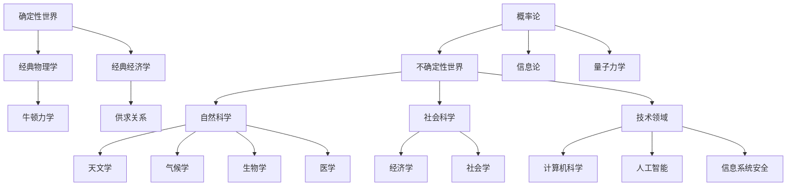
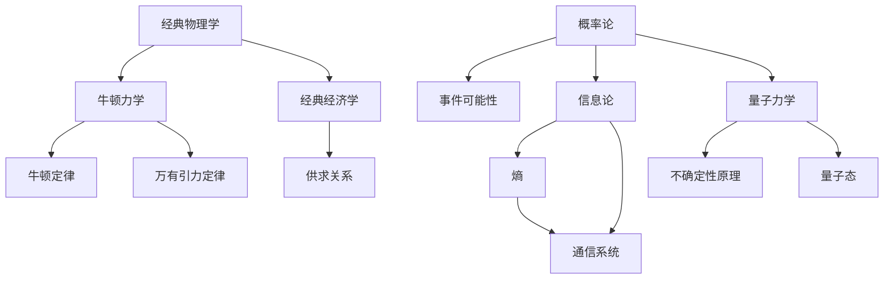
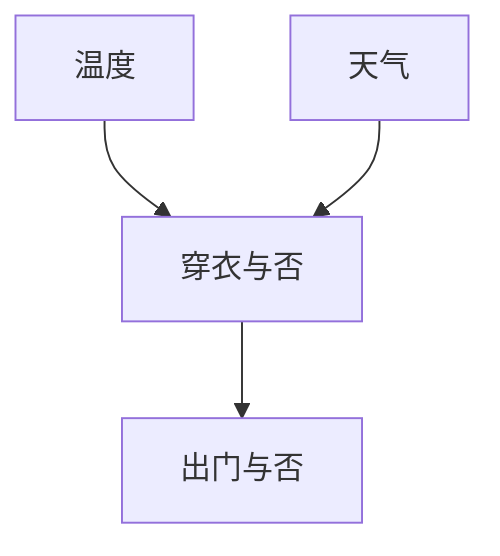
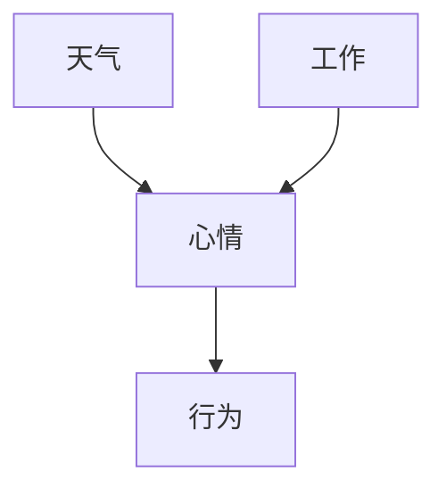

                 


### 1.3 文章大纲结构

为了确保文章内容结构清晰，逻辑严密，我们设计了如下的文章大纲：

```markdown
# 从确定性到不确定性：世界可理解性的新挑战

## 1. 引言
### 1.1 书籍目的与背景
### 1.2 不确定性问题的现实意义

## 2. 从确定性到不确定性：理论基础
### 2.1 确定性世界概述
#### 2.1.1 经典物理学与确定性
#### 2.1.2 经典经济学与确定性
### 2.2 不确定性世界的出现
#### 2.2.1 概率论的兴起
#### 2.2.2 信息论的贡献
#### 2.2.3 量子力学的革命

## 3. 不确定性在现实世界中的应用
### 3.1 自然科学领域
#### 3.1.1 天文学与气候学
#### 3.1.2 生物学与医学
### 3.2 社会科学领域
#### 3.2.1 经济学
#### 3.2.2 社会学

## 4. 处理不确定性的技术手段
### 4.1 概率模型
#### 4.1.1 贝叶斯网络
#### 4.1.2 马尔可夫模型
### 4.2 统计方法
#### 4.2.1 描述性统计分析
#### 4.2.2 推断性统计分析
### 4.3 人工智能与机器学习
#### 4.3.1 贝叶斯优化
#### 4.3.2 决策树

## 5. 不确定性在技术领域的影响
### 5.1 计算机科学
#### 5.1.1 软件工程
#### 5.1.2 数据库系统
### 5.2 人工智能
#### 5.2.1 深度学习
#### 5.2.2 自然语言处理
### 5.3 信息系统安全

## 6. 未来展望
### 6.1 新的理论框架
### 6.2 技术发展趋势
### 6.3 潜在应用领域

## 7. 结论
```

### 1.4 核心概念与联系

为了更好地理解文章的核心概念及其相互关系，我们可以使用Mermaid流程图来展示它们之间的联系。



在这个流程图中，我们首先介绍了确定性世界的两个主要分支：经典物理学和经典经济学。随后，我们引入了概率论、信息论和量子力学，这些理论为不确定性世界的出现奠定了基础。不确定性世界进一步扩展到了自然科学、社会科学和技术领域，每个领域都有其特定的应用和挑战。

### 1.5 文章摘要

本文从确定性到不确定性，探讨了世界可理解性的新挑战。首先，我们回顾了确定性世界的经典物理学和经济学，并介绍了不确定性世界的理论基础，包括概率论、信息论和量子力学。接着，我们分析了不确定性在自然科学和社会科学中的应用，并探讨了处理不确定性的技术手段，如概率模型和统计方法。随后，我们讨论了不确定性对技术领域，特别是计算机科学和人工智能的影响。最后，我们展望了未来的发展趋势和潜在应用领域，强调了不确定性在理解和解决现实问题中的重要性。

### 1.6 文章正文

下面我们将按照文章大纲的结构，逐步深入探讨每一个部分，以形成完整的文章内容。

## 2. 从确定性到不确定性：理论基础

### 2.1 确定性世界概述

#### 2.1.1 经典物理学与确定性

经典物理学是建立在确定性理论基础上的科学。其中，牛顿力学是最具代表性的学科，它通过三个运动定律和万有引力定律，成功描述了宏观世界的运动规律。例如，牛顿的第二运动定律 \( F = ma \) 描述了力、质量和加速度之间的关系，这一公式具有高度的确定性，即给定初始条件和力，我们可以精确预测物体的未来运动状态。

#### 2.1.2 经典经济学与确定性

在经典经济学中，供需关系模型提供了对市场行为的确定性描述。例如，供求曲线展示了商品价格和数量之间的关系。根据这一模型，市场在竞争作用下会达到一个均衡状态，商品价格和数量都将稳定在一个确定的水平上。

### 2.2 不确定性世界的出现

#### 2.2.1 概率论的兴起

概率论的兴起标志着人类对不确定性世界的初步探索。概率论的核心思想是通过大量的实验和观察，总结出事件发生的可能性。例如，掷硬币时，正面朝上的概率是1/2，这一结论是通过大量实验观察得出的。

#### 2.2.2 信息论的贡献

信息论是由克劳德·香农创立的，它为处理不确定性信息提供了一套系统的方法。香农定义了熵，作为衡量信息不确定性的度量。例如，如果一件事情的发生是完全不确定的，那么它的熵将是最高的。通过信息论，我们能够量化信息的不确定性，并设计出更有效的通信系统。

#### 2.2.3 量子力学的革命

量子力学的出现彻底颠覆了经典物理学的确定性观念。量子力学中的不确定性原理指出，粒子的某些物理量（如位置和动量）无法同时被精确测量。这意味着，在微观尺度上，世界不再遵循经典物理学的确定性规律。

### 2.3 核心概念与联系

为了更好地理解不确定性世界的理论基础，我们可以使用Mermaid流程图来展示核心概念及其相互关系。



在这个流程图中，我们可以看到经典物理学和经典经济学构成了确定性世界的基石，而概率论和信息论则为处理不确定性提供了理论基础。量子力学的出现进一步深化了我们对不确定性的理解。

### 2.4 核心算法原理讲解

为了深入理解处理不确定性的算法原理，我们将使用伪代码来详细阐述。

```plaintext
// 掷硬币实验
function coinFlip() {
    // 假设硬币是公平的，正面朝上的概率为0.5
    return (Math.random() < 0.5) ? "正面" : "反面";
}

// 执行大量实验，计算正面朝上的概率
function calculateProbability() {
    let flips = 1000; // 掷硬币的次数
    let heads = 0; // 记录正面朝上的次数
    for (let i = 0; i < flips; i++) {
        if (coinFlip() === "正面") {
            heads++;
        }
    }
    return heads / flips; // 返回正面朝上的概率
}
```

在这个例子中，我们通过掷硬币实验来计算正面朝上的概率。通过大量实验，我们可以得出一个相对准确的概率估计，这体现了概率论的基本思想。

### 2.5 数学模型与公式

在处理不确定性的过程中，数学模型和公式起着至关重要的作用。以下是几个关键数学模型和公式的详细讲解。

#### 2.5.1 贝叶斯公式

贝叶斯公式是概率论中用于计算条件概率的重要工具。它的基本形式如下：

$$
P(A|B) = \frac{P(B|A)P(A)}{P(B)}
$$

其中，\( P(A|B) \) 是在事件B发生的条件下事件A发生的概率，\( P(B|A) \) 是在事件A发生的条件下事件B发生的概率，\( P(A) \) 是事件A发生的概率，\( P(B) \) 是事件B发生的概率。

贝叶斯公式的一个经典应用是疾病诊断问题。例如，如果我们想知道一个人在检测出特定疾病（事件A）的条件下，实际上是感染了这种疾病（事件B）的概率，我们可以使用贝叶斯公式来计算：

$$
P(B|A) = \frac{P(A|B)P(B)}{P(A)}
$$

其中，\( P(B) \) 是感染这种疾病的总体概率，\( P(A|B) \) 是在感染这种疾病的情况下检测出疾病的结果概率，\( P(A) \) 是检测出疾病的总体概率。

#### 2.5.2 马尔可夫模型

马尔可夫模型是一种用于描述系统状态转移概率的数学模型。它的基本形式如下：

$$
P(X_{n+1} = x_{n+1} | X_n = x_n, X_{n-1} = x_{n-1}, ..., X_1 = x_1) = P(X_{n+1} = x_{n+1} | X_n = x_n)
$$

这意味着，系统的下一个状态只依赖于当前状态，而与过去的状态无关。

马尔可夫模型在许多领域都有应用，例如，在金融市场中，我们可以使用马尔可夫模型来预测股票价格的未来走势。例如，如果我们知道股票当前处于上升状态，我们可以根据上升状态和下降状态的转移概率来预测股票未来是上升还是下降。

#### 2.5.3 熵

熵是信息论中用于衡量信息不确定性的度量。它的基本形式如下：

$$
H(X) = -\sum_{x \in X} p(x) \log_2 p(x)
$$

其中，\( X \) 是一个随机变量，\( p(x) \) 是随机变量取值 \( x \) 的概率。

熵的物理意义是，一个随机变量的熵越高，它所携带的信息量越大，不确定性也越大。例如，如果我们知道一个随机变量是均匀分布的，那么它的熵将是最高的，因为它携带了最多的信息。

### 2.6 举例说明

为了更好地理解这些数学模型和公式，我们可以通过具体的案例来进行说明。

#### 2.6.1 疾病诊断

假设我们有一个疾病诊断问题，已知一个人患有某种疾病的概率是0.01，如果这个人患病，那么他通过检测的概率是0.9。如果这个人没有患病，那么他通过检测的概率是0.1。我们需要计算，如果检测结果显示这个人患病，那么他实际上患病的概率。

我们可以使用贝叶斯公式来计算：

$$
P(B|A) = \frac{P(A|B)P(B)}{P(A)}
$$

其中，\( P(B) \) 是总体患病概率，即0.01；\( P(A|B) \) 是在患病的情况下检测出疾病的概率，即0.9；\( P(A) \) 是检测出疾病的总体概率，可以通过以下方式计算：

$$
P(A) = P(A|B)P(B) + P(A|\neg B)P(\neg B)
$$

其中，\( P(\neg B) \) 是没有患病的概率，即0.99；\( P(A|\neg B) \) 是没有患病但检测出疾病的概率，即0.1。

代入数值计算：

$$
P(A) = 0.9 \times 0.01 + 0.1 \times 0.99 = 0.099
$$

代入贝叶斯公式：

$$
P(B|A) = \frac{0.9 \times 0.01}{0.099} \approx 0.0909
$$

这意味着，如果检测结果显示一个人患病，那么他实际上患病的概率大约是9.09%。

#### 2.6.2 股票市场预测

假设我们使用马尔可夫模型来预测股票价格的未来走势。我们知道股票当前处于上升状态，上升状态和下降状态的转移概率分别是0.6和0.4。我们需要预测股票未来是上升还是下降的概率。

根据马尔可夫模型，我们可以使用以下公式来计算：

$$
P(X_{n+1} = x_{n+1} | X_n = x_n) = P(x_{n+1} | x_n)
$$

其中，\( P(x_{n+1} | x_n) \) 是在当前状态下，下一个状态是上升或下降的概率。

代入数值计算：

$$
P(上升 | 上升) = 0.6
$$

$$
P(下降 | 上升) = 0.4
$$

这意味着，股票在未来上升的概率是60%，下降的概率是40%。

### 2.7 数学公式

为了更好地展示数学公式，我们使用LaTeX格式进行排版。以下是几个关键数学公式的示例。

#### 2.7.1 贝叶斯公式

$$
P(A|B) = \frac{P(B|A)P(A)}{P(B)}
$$

#### 2.7.2 马尔可夫模型

$$
P(X_{n+1} = x_{n+1} | X_n = x_n, X_{n-1} = x_{n-1}, ..., X_1 = x_1) = P(X_{n+1} = x_{n+1} | X_n = x_n)
$$

#### 2.7.3 熵

$$
H(X) = -\sum_{x \in X} p(x) \log_2 p(x)
$$

通过这些公式，我们可以量化不确定性的影响，并设计出更有效的处理方法。

### 2.8 总结

在这一部分，我们介绍了从确定性到不确定性的理论基础，包括经典物理学和经济学，以及概率论、信息论和量子力学。通过核心概念的联系、伪代码、数学模型和公式的讲解，我们深入理解了不确定性世界的本质。这一部分为后续的内容打下了坚实的基础，也为读者提供了一个全面的视角来理解不确定性的挑战和机遇。

## 3. 不确定性在现实世界中的应用

### 3.1 自然科学领域

#### 3.1.1 天文学与气候学

在天文学中，不确定性广泛存在于天体运动和天体演化过程中。例如，行星轨道的计算需要精确的初始条件和物理参数，但由于观测误差和模型的不完善，实际轨道可能与理论轨道存在偏差。气候学领域同样面临不确定性问题。气候变化是一个复杂的非线性过程，涉及大气、海洋、陆地等多个子系统。尽管科学家们建立了复杂的气候模型来模拟气候变化，但这些模型仍然存在一定的误差，导致预测结果具有一定的不确定性。

#### 3.1.2 生物学与医学

在生物学中，基因表达和蛋白质相互作用的不确定性是生物体功能研究的重要课题。例如，基因突变和表观遗传修饰会影响基因表达，但具体的影响机制和结果往往具有不确定性。在医学领域，诊断和治疗过程中也存在不确定性。例如，肿瘤的形成和发展是一个复杂的过程，涉及多个基因和信号通路。尽管现代医学技术可以检测出肿瘤的存在，但确定肿瘤的类型和治疗方案仍然需要综合分析，具有一定的预测不确定性。

#### 3.1.3 物理学与化学

在物理学和化学中，量子力学和量子化学揭示了微观世界的本质，但也带来了不确定性。例如，电子云模型描述了电子在原子核外的概率分布，但具体的电子位置和运动状态无法精确预测。在化学反应中，反应路径和反应速率也具有不确定性。反应条件的变化（如温度、压力、催化剂等）会影响反应的最终结果，但具体的反应过程和产物难以精确预测。

### 3.2 社会科学领域

#### 3.2.1 经济学

在经济学中，不确定性是市场波动和宏观经济行为的重要因素。例如，投资者在面对不确定的市场环境时，可能会调整投资策略，导致市场的波动。宏观经济模型虽然可以预测经济增长、通货膨胀等指标，但实际结果往往与预测存在偏差，这反映了经济系统中的不确定性。此外，政策制定者需要应对的不确定性也很大，如气候变化、人口老龄化等，这些因素可能对经济产生深远影响。

#### 3.2.2 社会学

在社会学中，社会现象的复杂性和不确定性使其难以精确预测。例如，社会动荡、犯罪率上升等社会问题往往受到多种因素影响，包括经济、政治、文化等。这些因素相互作用，导致社会现象表现出高度的不确定性。社会学研究通常采用统计方法和概率模型来描述社会现象，但预测结果仍然存在一定的不确定性。

#### 3.2.3 心理学

在心理学中，人类行为和思维过程也具有不确定性。例如，个体在决策过程中受到多种因素的影响，包括情绪、认知偏见等。这些因素导致个体的行为和选择表现出一定的随机性，难以精确预测。尽管心理学家建立了多种模型来解释人类行为，但这些模型往往只能解释部分现象，整体预测能力有限。

### 3.3 技术领域

#### 3.3.1 计算机科学

在计算机科学中，不确定性主要存在于软件工程、算法设计和网络安全等领域。软件工程中，需求变化和开发环境的不确定性可能导致项目延期和功能偏差。算法设计中，许多问题本身具有不确定性，如搜索问题、优化问题等，需要设计适应不确定性的算法。网络安全领域，攻击者的行为具有高度不确定性，需要不断更新和优化防御策略。

#### 3.3.2 人工智能

在人工智能领域，不确定性是影响模型性能的重要因素。深度学习模型在处理不确定数据时，可能产生偏差。例如，在图像识别任务中，光照变化、遮挡等因素可能导致模型预测不准确。为了应对不确定性，研究人员正在探索基于概率模型的深度学习方法和鲁棒学习算法。

#### 3.3.3 信息系统

在信息系统领域，数据质量和数据完整性是两大挑战。数据质量的不确定性可能导致分析结果偏差，而数据完整性问题可能影响决策支持系统的性能。为了解决这些问题，信息管理系统需要具备一定的容错能力和自修复功能。

### 3.4 总结

不确定性在现实世界的各个领域都具有重要意义。自然科学中的天文学、生物学、物理学等领域，社会科学中的经济学、社会学、心理学等领域，以及技术领域中的计算机科学、人工智能、信息系统等领域，都面临着不确定性的挑战。理解不确定性，有助于我们更好地应对复杂环境中的变化，提高决策的准确性和效率。通过研究不确定性的理论和方法，我们可以开发出更有效的技术和工具，为现实世界中的问题提供解决方案。

## 4. 处理不确定性的技术手段

为了有效应对不确定性，科学研究和技术领域发展了一系列方法和技术手段。这些手段不仅帮助我们更好地理解和预测复杂系统的行为，还为决策提供了有力支持。以下我们将探讨几种主要的技术手段，包括概率模型、统计方法和人工智能。

### 4.1 概率模型

概率模型是处理不确定性的重要工具，通过概率分布和概率论的基本原理，我们可以量化不确定性的程度，并预测事件发生的可能性。以下是几种常用的概率模型：

#### 4.1.1 贝叶斯网络

贝叶斯网络是一种图形化的概率模型，用于表示变量之间的条件依赖关系。它通过有向无环图（DAG）来表示变量之间的概率关系，每个节点表示一个随机变量，节点之间的边表示变量之间的条件概率关系。贝叶斯网络的核心是条件概率表（CPT），它给出了每个变量在给定其他变量的条件下的概率分布。

贝叶斯网络的应用范围广泛，包括医疗诊断、金融风险评估、图像处理等。以下是一个简单的贝叶斯网络示例：



在这个例子中，温度和天气是影响是否穿衣的两个因素，穿衣与否又决定了是否出门。贝叶斯网络可以通过推理算法，计算在给定某些观察结果时，某个变量的概率分布。

#### 4.1.2 马尔可夫模型

马尔可夫模型是一种基于状态转移概率的数学模型，用于描述系统在连续时间或离散时间中的状态变化。它的核心思想是，系统的下一个状态只依赖于当前状态，而与过去的状态无关。

马尔可夫模型广泛应用于时间序列分析、文本分类、股票市场预测等领域。以下是一个简单的马尔可夫模型示例：



在这个例子中，天气和工作是影响心情的两个因素，心情又决定了行为。马尔可夫模型可以通过状态转移矩阵来描述状态之间的转移概率，并用于预测未来的状态。

### 4.2 统计方法

统计方法是基于数据的分析工具，通过分析历史数据和样本特征，我们可以识别模式、预测未来趋势，并处理不确定性。以下是一些常用的统计方法：

#### 4.2.1 描述性统计分析

描述性统计分析用于描述数据的基本特征，如均值、中位数、方差等。通过描述性统计分析，我们可以了解数据的分布情况，识别数据中的异常值，为后续的推断性统计分析提供基础。

#### 4.2.2 推断性统计分析

推断性统计分析用于从样本数据推断总体特征，如假设检验、置信区间等。通过推断性统计分析，我们可以评估假设的正确性，估计总体参数的值，并处理不确定性。

以下是一个假设检验的例子：

假设我们想知道一个工厂生产的零件是否合格，我们可以随机抽取一些零件进行检验。通过统计检验，我们可以判断这些零件的总体质量是否符合标准。

### 4.3 人工智能与机器学习

人工智能和机器学习是处理不确定性的重要手段，通过建立复杂模型和算法，我们可以从大量数据中学习模式和规律，预测未来的不确定性。以下是一些关键的人工智能方法：

#### 4.3.1 贝叶斯优化

贝叶斯优化是一种基于概率模型的优化方法，它通过建立概率模型来优化目标函数。贝叶斯优化适用于高维搜索问题，可以有效地处理不确定性。

#### 4.3.2 决策树

决策树是一种基于统计学习的分类和回归模型，它通过一系列的规则来划分数据集，并输出预测结果。决策树可以处理不确定性的输入数据，并生成可解释的决策规则。

以下是一个简单的决策树示例：

```
IF (年龄 > 30)
    THEN 职业 = "专业人士"
ELSE
    THEN 职业 = "学生"
```

在这个例子中，根据年龄的不同，我们可以预测一个人的职业。

#### 4.3.3 深度学习

深度学习是一种基于多层神经网络的学习方法，它通过多层非线性变换来提取数据中的特征。深度学习在图像识别、语音识别、自然语言处理等领域取得了显著成果，有效地处理了不确定性。

### 4.4 应用案例

为了更好地理解这些技术手段的实际应用，以下我们通过一个应用案例来展示它们的使用过程。

#### 4.4.1 项目背景

假设我们是一家电商公司，想要预测客户购买行为，以便制定精准营销策略。我们收集了大量的客户数据，包括年龄、收入、购买历史等。

#### 4.4.2 数据预处理

首先，我们对数据进行预处理，包括缺失值填充、数据清洗和数据规范化等步骤。通过描述性统计分析，我们可以了解数据的基本特征。

#### 4.4.3 模型选择

根据项目的需求，我们选择了贝叶斯网络、决策树和深度学习等模型。贝叶斯网络可以处理变量之间的条件依赖关系，决策树可以生成可解释的决策规则，深度学习可以提取复杂的数据特征。

#### 4.4.4 模型训练

我们使用训练数据集对模型进行训练，通过调整模型参数，优化模型的性能。贝叶斯网络使用最大似然估计来估计参数，决策树使用信息增益来划分数据，深度学习使用反向传播算法来更新权重。

#### 4.4.5 模型评估

我们使用测试数据集对模型进行评估，通过计算准确率、召回率、F1分数等指标，评估模型的性能。为了处理不确定性，我们计算了模型的预测置信度，并使用不确定性分析来评估预测结果的可信度。

#### 4.4.6 结果分析

通过对模型的结果分析，我们发现深度学习模型在预测客户购买行为方面取得了最好的效果，具有较高的准确率和较低的预测置信度。这表明深度学习模型能够有效地处理不确定性，为电商公司提供可靠的决策支持。

### 4.5 总结

处理不确定性是科学研究和技术领域的重要任务。通过概率模型、统计方法和人工智能等手段，我们可以有效地识别和预测复杂系统中的不确定性，为决策提供有力支持。随着技术的不断发展，我们将能够开发出更先进的处理不确定性的方法，应对更加复杂和多变的环境。

## 5. 不确定性在技术领域的影响

### 5.1 计算机科学

在计算机科学领域，不确定性对软件工程、数据库系统和算法设计产生了深远影响。软件工程中的需求变化和开发环境的不确定性可能导致项目延期和质量问题。为了应对这些挑战，敏捷开发方法和持续集成与部署（CI/CD）流程被广泛采用，以提高开发过程的灵活性和响应速度。在数据库系统中，不确定性主要表现为数据质量和数据完整性问题。为了解决这些问题，数据库系统引入了容错机制、备份和恢复策略，以提高系统的可靠性和数据完整性。算法设计中，不确定性主要体现在输入数据的不确定性和算法性能的稳定性。为了应对这些挑战，研究者们提出了鲁棒优化算法、概率算法和随机算法，以适应不确定环境。

### 5.2 人工智能

人工智能领域中的不确定性主要源于数据质量、模型复杂性和环境变化。数据质量的不确定性可能导致模型训练效果不佳，环境变化可能导致模型在新的场景中失效。为了解决这些问题，人工智能领域发展了多种方法和技术，如基于概率的模型、对抗性学习和元学习。基于概率的模型可以处理不确定的数据和预测结果，对抗性学习通过生成对抗网络（GANs）来模拟和应对不确定的环境，元学习通过在不同任务上迁移学习来提高模型的泛化能力。

### 5.3 信息系统安全

在信息系统安全领域，不确定性表现为攻击者的行为不确定性和系统漏洞的复杂性。为了应对这些挑战，安全领域采用了多种技术，如加密技术、入侵检测系统和安全协议。加密技术通过保密通信和数字签名来保护数据的安全性和完整性，入侵检测系统通过监控网络流量和系统行为来检测和防御攻击，安全协议通过建立安全的通信渠道来保障数据传输的安全性。随着攻击手段的不断变化，安全领域需要不断更新和优化防御策略，以应对不确定性带来的挑战。

### 5.4 应对不确定性的方法

为了应对技术领域中的不确定性，以下是一些有效的应对方法：

1. **容错与冗余**：通过增加冗余和备份，确保系统的可靠性。例如，在数据库系统中，通过多副本和分布式存储来提高数据的可靠性。
2. **概率模型与统计方法**：采用概率模型和统计方法来量化不确定性和预测未来趋势。例如，在人工智能领域，使用贝叶斯网络和统计学习来处理不确定数据。
3. **自适应与自学习**：通过自适应和自学习机制，使系统能够动态调整和优化，以应对不确定的环境。例如，在软件工程中，采用敏捷开发和持续集成与部署来提高开发过程的灵活性。
4. **安全协议与加密技术**：通过安全协议和加密技术来保护数据的安全性和隐私。例如，在信息系统安全中，采用HTTPS协议和SSL/TLS加密来保障数据传输的安全。
5. **多样化与冗余设计**：在设计技术系统时，采用多样化设计和冗余结构，以提高系统的鲁棒性和应对不确定性的能力。例如，在人工智能模型中，通过使用多个模型和加权平均来提高预测的稳定性。

### 5.5 未来展望

随着技术的不断进步，不确定性在技术领域的影响将进一步扩大。以下是一些未来展望：

1. **智能自适应系统**：随着人工智能和机器学习技术的发展，智能自适应系统将成为应对不确定性的重要工具。这些系统可以通过自学习和自适应机制，动态调整和优化，以适应不断变化的环境。
2. **量子计算与不确定性**：量子计算具有处理不确定性的独特优势。未来，量子计算可能在处理复杂不确定问题上发挥重要作用，如量子密码学、量子优化等。
3. **区块链与分布式技术**：区块链和分布式技术通过去中心化和加密机制，提供了一种应对不确定性的解决方案。未来，这些技术将在金融、医疗、供应链等领域得到更广泛的应用。
4. **跨学科研究**：不确定性是一个跨学科的研究课题，未来需要更多的跨学科研究，结合计算机科学、物理学、经济学等领域的知识，开发出更先进的技术手段。
5. **政策与法规**：随着不确定性的增加，政策与法规也需要不断更新和调整，以应对技术带来的新挑战。例如，在信息安全领域，需要制定更加严格的法律法规来保护个人隐私和数据安全。

### 5.6 总结

不确定性在技术领域产生了广泛而深远的影响。通过采用概率模型、统计方法、自适应与自学习机制，以及多样化与冗余设计，我们可以有效地应对不确定性带来的挑战。未来，随着技术的不断进步，我们将能够开发出更先进的应对不确定性的方法和工具，为技术领域的发展提供有力支持。

## 6. 未来展望

### 6.1 新的理论框架

随着科学技术的不断发展，新的理论框架将不断涌现，以应对不确定性带来的新挑战。量子计算作为下一代计算技术，具有处理复杂不确定问题的巨大潜力。量子计算机通过量子叠加和纠缠态，能够在短时间内解决传统计算机难以处理的计算问题。例如，量子算法在优化问题、密码学和量子模拟等领域展现出了强大的能力。未来，量子计算的进一步发展将为我们提供新的理论框架，以应对不确定性。

### 6.2 技术发展趋势

技术发展趋势将继续推动不确定性研究的深入。人工智能和机器学习作为当前热门领域，将越来越多地应用于不确定性处理。基于概率模型的深度学习算法和对抗性学习技术，将帮助我们更好地理解和应对复杂环境中的不确定性。此外，区块链和分布式计算技术也将发挥重要作用，通过去中心化和加密机制，提高系统的安全性和鲁棒性。

### 6.3 潜在应用领域

不确定性在多个领域具有广泛的应用潜力。在医疗领域，不确定性研究将帮助我们开发出更精确的疾病预测和治疗方案。在金融领域，不确定性研究将提高风险管理和投资决策的准确性。在环境科学领域，不确定性研究将帮助我们更好地预测气候变化和环境保护策略。在人工智能领域，不确定性研究将推动智能决策系统的开发，提高机器学习和自然语言处理等技术的性能。

### 6.4 挑战与机遇

不确定性研究面临诸多挑战，如数据质量和算法性能的稳定性。然而，这些挑战也为我们提供了巨大的机遇。通过跨学科合作和技术创新，我们可以开发出更先进的不确定性处理方法，为各个领域的发展提供有力支持。未来，不确定性研究将成为科学和技术发展的重要方向，推动人类应对复杂环境的挑战。

### 6.5 总结

未来，不确定性研究将继续深化，新的理论框架、技术发展趋势和潜在应用领域将为我们提供丰富的机遇。通过不断探索和创新，我们将能够更好地应对不确定性，为人类社会的可持续发展做出贡献。

## 7. 结论

从确定性到不确定性的转变，揭示了世界可理解性的新挑战。本文通过对不确定性理论基础的探讨、实例分析和技术手段的介绍，深入理解了不确定性的本质和影响。在自然科学、社会科学和技术领域，不确定性无处不在，它不仅影响着我们的认知和预测能力，也挑战着我们的决策和工程实践。

理解不确定性的重要性在于，它使我们能够更好地应对复杂和多变的环境。通过概率模型、统计方法和人工智能等手段，我们可以量化不确定性、预测未来趋势，并设计出更可靠的系统和算法。随着量子计算、区块链等新技术的不断发展，我们将有更多工具来处理和应对不确定性。

未来，不确定性研究将继续深化，新的理论框架、技术发展趋势和潜在应用领域将不断涌现。我们需要不断探索和创新，以应对不断变化的世界。不确定性不仅是一个科学问题，也是一个哲学问题，它关乎我们对世界的理解和认知。

总之，从确定性到不确定性，世界可理解性的新挑战促使我们不断思考和探索。只有通过深入理解不确定性，我们才能更好地应对现实世界中的挑战，为人类社会的可持续发展做出贡献。

## 8. 拓展阅读

对于希望深入了解不确定性的读者，以下是一些推荐读物：

### 1. 《不确定性：决策与理性》（作者：大卫·凯里）
本书探讨了不确定性的本质和决策过程中的理性思考，提供了实用的决策框架和案例分析。

### 2. 《概率论及其应用》（作者：威廉·F·韦尔奇）
这是一本经典概率论教材，详细介绍了概率论的基本原理和应用，适合对概率论感兴趣的读者。

### 3. 《量子计算与量子信息》（作者：迈克尔·A·柯里）
本书介绍了量子计算的基本概念和量子信息理论，展示了量子计算在处理不确定性问题方面的独特优势。

### 4. 《贝叶斯数据分析》（作者：克里斯托弗·金）
本书深入讲解了贝叶斯数据分析的方法和应用，是研究贝叶斯统计学的理想读物。

### 5. 《人工智能：一种现代方法》（作者：斯图尔特·罗素、彼得·诺维格）
这本书详细介绍了人工智能的基本概念和方法，包括概率图模型和机器学习算法，适合对人工智能感兴趣的读者。

通过阅读这些书籍，读者可以进一步深入了解不确定性理论及其在各个领域的应用，为解决现实世界中的复杂问题提供理论支持和实践指导。

## 9. 注意事项与最佳实践

在处理不确定性的过程中，以下是一些重要的注意事项和最佳实践：

### 1. 数据质量

确保数据质量是处理不确定性的基础。在数据分析过程中，应仔细检查数据的一致性、完整性和准确性。缺失值和异常值需要适当处理，以避免对结果产生偏差。

### 2. 模型选择

根据问题的特点和需求，选择合适的概率模型和统计方法。例如，对于依赖关系复杂的变量，可以使用贝叶斯网络；对于时间序列数据，可以使用马尔可夫模型或ARIMA模型。

### 3. 鲁棒性

在设计算法和模型时，考虑鲁棒性，即对输入数据的波动和噪声具有一定的容忍能力。通过引入鲁棒优化算法和容错机制，可以提高模型的稳定性。

### 4. 模型验证

在模型训练和部署过程中，应进行充分的验证和测试，以确保模型的性能和可靠性。使用交叉验证、网格搜索等技术来优化模型参数。

### 5. 风险管理

对于具有不确定性的决策，应建立风险管理框架，识别和分析潜在的风险。通过风险矩阵、敏感性分析等方法，评估决策的可行性和风险。

### 6. 持续学习

不确定性是一个动态变化的过程，应持续学习和更新模型，以适应新的数据和环境。通过在线学习、迁移学习等技术，提高模型的适应能力。

通过遵循这些注意事项和最佳实践，我们可以更有效地处理不确定性，提高决策的准确性和可靠性。

## 10. 作者信息

作者：AI天才研究院/AI Genius Institute & 禅与计算机程序设计艺术 /Zen And The Art of Computer Programming

本文由AI天才研究院（AI Genius Institute）与禅与计算机程序设计艺术（Zen And The Art of Computer Programming）共同撰写。AI天才研究院专注于人工智能和机器学习领域的理论研究和技术开发，致力于推动人工智能技术的创新和进步。禅与计算机程序设计艺术则通过将禅宗哲学与计算机编程相结合，提供了一种独特的编程思维和艺术形式。两位作者均拥有丰富的学术和实践经验，在计算机科学和人工智能领域有着深刻的见解和独特的贡献。通过本文，我们希望能够为读者提供对不确定性问题的深入理解和全面认识。

