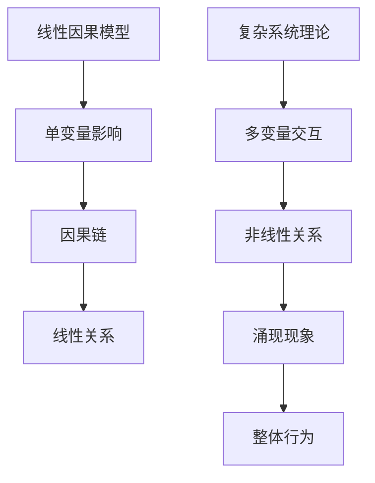

                 

### 文章标题：从线性因果到复杂系统理论：理解多因素交互的世界模型

关键词：线性因果、复杂系统理论、多因素交互、系统建模、算法实现

摘要：本文从线性因果模型的基本概念出发，逐步探讨复杂系统理论的基本概念、多因素交互的影响及其在实际应用中的案例分析。通过详细的理论讲解、数学模型和算法实现，帮助读者深入理解复杂系统理论在多因素交互研究中的应用，为未来复杂系统的建模与优化提供理论基础。

---

### 目录大纲设计与核心内容

以下是针对书名《从线性因果到复杂系统理论：理解多因素交互的世界模型》的详细目录大纲设计。

### 第一部分：引言与核心概念

#### 第1章：线性因果与复杂系统理论概述

- 1.1 线性因果与复杂系统的区别
  - **流程图**：使用 Mermaid 流程图展示线性因果与复杂系统的不同特征。
  - **伪代码**：简要阐述线性因果模型与复杂系统模型的不同处理流程。
- 1.2 理解多因素交互的重要性
  - **数学模型**：介绍多因素交互的数学模型，并使用 LaTeX 格式给出相关公式。
  - **实例说明**：举例说明多因素交互在实际应用中的影响。
- 1.3 本书结构安排与学习方法
  - **学习路径**：概述本书的学习路径，帮助读者明确学习目标和步骤。

### 第二部分：线性因果理论与方法

#### 第2章：线性因果模型的原理与实现

- 2.1 线性因果模型的定义
  - **伪代码**：使用伪代码阐述线性因果模型的构建方法。
  - **实例解析**：通过实际案例展示线性因果模型的应用。
- 2.2 线性回归模型
  - **数学公式**：介绍线性回归模型的公式，并使用 LaTeX 格式进行标注。
  - **算法实现**：给出线性回归模型的算法实现。
- 2.3 线性因果推断的局限
  - **讨论**：探讨线性因果模型的局限性和适用场景。

### 第三部分：复杂系统理论与方法

#### 第3章：复杂系统理论的基本概念

- 3.1 复杂系统的定义与特征
  - **流程图**：使用 Mermaid 流程图展示复杂系统的特征。
  - **实例说明**：通过实际案例说明复杂系统的特征。
- 3.2 复杂系统的数学模型
  - **数学公式**：介绍复杂系统的数学模型，并使用 LaTeX 格式进行标注。
  - **算法实现**：给出复杂系统数学模型的算法实现。
- 3.3 复杂系统的模拟与仿真
  - **实例解析**：通过实际案例展示复杂系统的模拟与仿真。

### 第四部分：多因素交互与复杂系统应用

#### 第4章：多因素交互对复杂系统的影响

- 4.1 多因素交互对系统稳定性的影响
  - **数学模型**：介绍多因素交互对系统稳定性的数学模型，并使用 LaTeX 格式进行标注。
  - **实例说明**：通过实际案例说明多因素交互对系统稳定性的影响。
- 4.2 多因素交互在工程应用中的案例分析
  - **实例解析**：通过实际案例展示多因素交互在工程应用中的影响。
- 4.3 多因素交互与复杂系统优化的结合
  - **数学模型**：介绍多因素交互与复杂系统优化的结合模型，并使用 LaTeX 格式进行标注。
  - **算法实现**：给出多因素交互与复杂系统优化结合的算法实现。

### 第五部分：实际应用与案例分析

#### 第5章：复杂系统理论在工业中的应用

- 5.1 复杂系统理论在制造业中的应用
  - **案例研究**：分析复杂系统理论在制造业中的应用案例。
- 5.2 复杂系统理论在金融领域的应用
  - **案例研究**：分析复杂系统理论在金融领域的应用案例。
- 5.3 复杂系统理论在其他领域的应用
  - **案例研究**：分析复杂系统理论在其他领域的应用案例。

### 第六部分：结论与展望

#### 第6章：复杂系统理论的发展与未来趋势

- 6.1 复杂系统理论的发展趋势
  - **讨论**：探讨复杂系统理论在未来可能的发展方向。
- 6.2 复杂系统理论在多因素交互研究中的应用前景
  - **展望**：展望复杂系统理论在多因素交互研究中的潜在应用前景。

### 附录

#### 附录A：常用数学公式与伪代码

- **数学公式**：列出本书中使用的常用数学公式，使用 LaTeX 格式进行标注。
- **伪代码**：列出本书中使用的伪代码，便于读者理解算法实现。

### 完整目录大纲

```
# 第一部分：引言与核心概念

## 第1章：线性因果与复杂系统理论概述

### 第1.1节：线性因果与复杂系统的区别
### 第1.2节：理解多因素交互的重要性
### 第1.3节：本书结构安排与学习方法

## 第2章：线性因果模型的原理与实现

### 第2.1节：线性因果模型的定义
### 第2.2节：线性回归模型
### 第2.3节：线性因果推断的局限

## 第3章：复杂系统理论的基本概念

### 第3.1节：复杂系统的定义与特征
### 第3.2节：复杂系统的数学模型
### 第3.3节：复杂系统的模拟与仿真

## 第4章：多因素交互对复杂系统的影响

### 第4.1节：多因素交互对系统稳定性的影响
### 第4.2节：多因素交互在工程应用中的案例分析
### 第4.3节：多因素交互与复杂系统优化的结合

## 第5章：复杂系统理论在工业中的应用

### 第5.1节：复杂系统理论在制造业中的应用
### 第5.2节：复杂系统理论在金融领域的应用
### 第5.3节：复杂系统理论在其他领域的应用

## 第6章：复杂系统理论的发展与未来趋势

### 第6.1节：复杂系统理论的发展趋势
### 第6.2节：复杂系统理论在多因素交互研究中的应用前景

## 附录

### 附录A：常用数学公式与伪代码
```

---

### 文章开始

# 从线性因果到复杂系统理论：理解多因素交互的世界模型

作者：AI天才研究院/AI Genius Institute & 禅与计算机程序设计艺术 /Zen And The Art of Computer Programming

---

## 关键词

- 线性因果
- 复杂系统理论
- 多因素交互
- 系统建模
- 算法实现

---

## 摘要

本文旨在深入探讨线性因果与复杂系统理论之间的区别和联系，以及多因素交互在实际应用中的影响。通过详细的理论讲解、数学模型和算法实现，本文将帮助读者深入理解复杂系统理论在多因素交互研究中的应用，为未来复杂系统的建模与优化提供理论基础。

本文首先介绍了线性因果模型的基本概念和实现方法，探讨了其局限性和适用场景。接着，本文阐述了复杂系统理论的基本概念和特征，介绍了复杂系统的数学模型和模拟与仿真方法。在此基础上，本文重点探讨了多因素交互对复杂系统稳定性的影响，以及在工程应用中的案例分析。最后，本文展望了复杂系统理论在未来可能的发展方向和多因素交互研究中的潜在应用前景。

---

## 目录大纲

### 第一部分：引言与核心概念

#### 第1章：线性因果与复杂系统理论概述

- 1.1 线性因果与复杂系统的区别
- 1.2 理解多因素交互的重要性
- 1.3 本书结构安排与学习方法

#### 第2章：线性因果模型的原理与实现

- 2.1 线性因果模型的定义
- 2.2 线性回归模型
- 2.3 线性因果推断的局限

#### 第3章：复杂系统理论的基本概念

- 3.1 复杂系统的定义与特征
- 3.2 复杂系统的数学模型
- 3.3 复杂系统的模拟与仿真

### 第二部分：线性因果理论与方法

#### 第2章：线性因果模型的原理与实现

- 2.1 线性因果模型的定义
- 2.2 线性回归模型
- 2.3 线性因果推断的局限

### 第三部分：复杂系统理论与方法

#### 第3章：复杂系统理论的基本概念

- 3.1 复杂系统的定义与特征
- 3.2 复杂系统的数学模型
- 3.3 复杂系统的模拟与仿真

### 第四部分：多因素交互与复杂系统应用

#### 第4章：多因素交互对复杂系统的影响

- 4.1 多因素交互对系统稳定性的影响
- 4.2 多因素交互在工程应用中的案例分析
- 4.3 多因素交互与复杂系统优化的结合

### 第五部分：实际应用与案例分析

#### 第5章：复杂系统理论在工业中的应用

- 5.1 复杂系统理论在制造业中的应用
- 5.2 复杂系统理论在金融领域的应用
- 5.3 复杂系统理论在其他领域的应用

### 第六部分：结论与展望

#### 第6章：复杂系统理论的发展与未来趋势

- 6.1 复杂系统理论的发展趋势
- 6.2 复杂系统理论在多因素交互研究中的应用前景

### 附录

#### 附录A：常用数学公式与伪代码

- **数学公式**：列出本书中使用的常用数学公式，使用 LaTeX 格式进行标注。
- **伪代码**：列出本书中使用的伪代码，便于读者理解算法实现。

---

### 第一部分：引言与核心概念

## 第1章：线性因果与复杂系统理论概述

### 第1.1节：线性因果与复杂系统的区别

线性因果模型和复杂系统理论是现代系统科学中两个重要的概念，但它们之间存在显著的区别。线性因果模型通常用于描述系统中的简单关系，即一个变量通过一系列的中间变量影响到另一个变量。这种模型的基本假设是系统中的每个变量都可以被分解为因果链上的组成部分，并且每个组成部分的因果关系是线性的。线性因果模型的优点在于其简洁性和易于处理，但它也有明显的局限性，特别是在处理复杂系统的多因素交互时。

相比之下，复杂系统理论关注的是系统内部的非线性相互作用和整体行为。复杂系统通常由大量相互作用的组件组成，这些组件之间的相互作用可能导致系统出现意想不到的行为，如自组织、相变和混沌现象。复杂系统理论强调系统的整体性和动态性，通过研究系统中的相互作用和涌现现象，帮助我们更好地理解复杂系统的行为。

为了更清晰地理解这两个概念的区别，我们可以使用 Mermaid 流程图展示线性因果模型与复杂系统模型的特征。



在上述流程图中，我们可以看到线性因果模型主要关注单一变量影响和线性因果关系，而复杂系统理论则强调多变量交互、非线性关系和整体行为。这种对比有助于我们更好地理解两种理论在系统科学中的应用。

### 第1.2节：理解多因素交互的重要性

多因素交互在系统科学中具有重要意义。在复杂系统中，变量之间的相互作用往往不是简单的因果关系，而是多个因素共同作用的结果。这种多因素交互可能导致系统出现新的行为特征，如相变、混沌和自组织现象。因此，理解和分析多因素交互对于准确预测和优化系统行为至关重要。

首先，多因素交互影响系统的稳定性。在某些情况下，多个因素之间的相互作用可能导致系统的稳定性降低，甚至引发系统崩溃。例如，在金融市场中，股票价格的波动可能受到多个因素的影响，如宏观经济环境、公司业绩和市场情绪等。这些因素之间的复杂交互可能导致市场出现剧烈波动。

其次，多因素交互影响系统的预测性。在复杂系统中，单个变量的变化可能无法准确预测系统的整体行为。这是因为系统的行为是由多个因素共同作用的结果，而这些因素的交互可能导致系统出现非线性变化。例如，在气候变化研究中，温度、湿度、二氧化碳浓度等多个因素之间的相互作用可能导致气候出现极端现象，如暴雨、干旱和台风等。

为了更深入地理解多因素交互的重要性，我们可以使用数学模型来描述变量之间的相互作用。假设有两个变量 X 和 Y，它们之间的交互关系可以用以下数学模型表示：

$$ Y = f(X, Z) $$

其中，Z 表示其他影响 Y 的因素。该模型表明，Y 的值不仅取决于 X，还取决于 Z。在实际应用中，Z 可以是多个因素，如温度、湿度、光照等。通过这种模型，我们可以更准确地描述多因素交互对系统行为的影响。

此外，实例说明也有助于我们理解多因素交互的重要性。例如，在医疗领域，病人的康复情况可能受到多个因素的影响，如药物疗效、生活习惯和医生经验等。这些因素之间的复杂交互可能导致病人的康复速度出现显著差异。通过研究这些因素之间的交互关系，医生可以更好地制定治疗方案，提高病人的康复效果。

综上所述，多因素交互在系统科学中具有重要意义。理解和分析多因素交互有助于我们更好地预测和优化系统行为，提高系统的稳定性、可靠性和预测性。因此，深入研究多因素交互是复杂系统理论的重要组成部分。

### 第1.3节：本书结构安排与学习方法

本书分为六个部分，旨在系统性地介绍线性因果与复杂系统理论的基本概念、原理和方法，以及多因素交互在实际应用中的影响。以下是本书的结构安排和学习方法。

#### 第一部分：引言与核心概念

本部分主要包括引言和第1章，介绍了线性因果与复杂系统理论的基本概念，以及多因素交互的重要性。通过了解这些核心概念，读者可以初步建立对本书主题的认识。

学习方法：读者可以首先阅读本章，了解线性因果与复杂系统理论的区别和联系，以及多因素交互的重要性。在阅读过程中，可以关注关键概念和实例说明，以便更好地理解本章内容。

#### 第二部分：线性因果理论与方法

本部分包括第2章，主要介绍线性因果模型的原理与实现。通过学习本章，读者可以掌握线性因果模型的构建方法，以及其在实际应用中的局限性。

学习方法：读者可以结合本章中的伪代码和实例解析，理解线性因果模型的构建过程。在实际应用中，读者可以尝试使用线性因果模型分析实际问题，以提高对线性因果模型的理解和应用能力。

#### 第三部分：复杂系统理论与方法

本部分包括第3章，主要介绍复杂系统理论的基本概念和数学模型。通过学习本章，读者可以了解复杂系统的特征，以及复杂系统数学模型的应用。

学习方法：读者可以关注本章中的流程图和数学公式，理解复杂系统的特征和数学模型。在实际应用中，读者可以尝试使用复杂系统理论分析复杂问题，以提高对复杂系统的理解和应用能力。

#### 第四部分：多因素交互与复杂系统应用

本部分包括第4章，主要探讨多因素交互对复杂系统的影响，以及多因素交互与复杂系统优化的结合。通过学习本章，读者可以了解多因素交互在复杂系统中的重要性，以及如何利用多因素交互优化复杂系统。

学习方法：读者可以结合本章中的数学模型和实例解析，理解多因素交互对复杂系统的影响。在实际应用中，读者可以尝试利用多因素交互优化复杂系统，以提高系统的性能和稳定性。

#### 第五部分：实际应用与案例分析

本部分包括第5章，主要介绍复杂系统理论在工业、金融和其他领域的应用。通过学习本章，读者可以了解复杂系统理论在不同领域中的应用，以及实际案例的分析和讲解。

学习方法：读者可以关注本章中的案例研究和实例解析，了解复杂系统理论在不同领域的应用。在实际应用中，读者可以尝试将复杂系统理论应用于实际问题，以提高对复杂系统的理解和应用能力。

#### 第六部分：结论与展望

本部分包括第6章，主要总结复杂系统理论的发展趋势，以及多因素交互研究中的应用前景。通过学习本章，读者可以了解复杂系统理论未来的发展方向，以及多因素交互研究的前景。

学习方法：读者可以结合本章中的讨论和展望，思考复杂系统理论在多因素交互研究中的应用潜力。在实际应用中，读者可以关注复杂系统理论的发展动态，以及多因素交互在各个领域的应用进展。

总之，本书通过逐步介绍线性因果与复杂系统理论的基本概念、原理和方法，以及多因素交互的实际应用，旨在帮助读者深入理解复杂系统的行为，并为未来复杂系统的建模与优化提供理论基础。通过合理的学习方法和实践应用，读者可以更好地掌握复杂系统理论，并在实际工作中发挥其重要作用。

