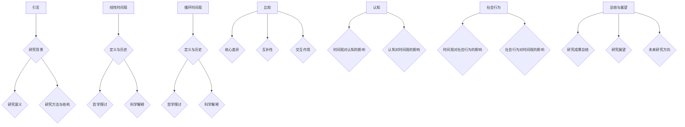

                 


# 《从线性时间观到循环时间观：理解时间与世界》目录大纲

## 第1章 引言

### 1.1 研究背景

线性时间观和循环时间观是人类对时间认知的两种不同方式。线性时间观认为时间是一维的、不可逆的，从过去到现在再到未来，时间沿着一条直线前进。而循环时间观则认为时间是有循环的，周而复始，不断地重复。随着科学技术的进步，人们开始从不同的角度对时间进行探索，试图更深入地理解时间的本质。本文旨在探讨线性时间观和循环时间观的区别和联系，分析它们对人类认知和社会行为的影响。

### 1.2 研究意义

了解线性时间观和循环时间观的区别和联系，对于人类理解时间、认知世界具有重要意义。线性时间观强调时间的前进性和线性性，有助于我们规划和预测未来，推动科技和社会的发展。而循环时间观则强调时间的循环性和重复性，有助于我们理解历史的循环性和文化的传承。通过对两种时间观的深入探讨，我们能够更全面地认识时间，从而更好地应对未来的挑战。

### 1.3 研究方法与结构

本文采用文献综述和理论分析相结合的方法，通过对线性时间观和循环时间观的历史、哲学、科学等方面的研究，分析它们的核心概念和联系。文章分为七个章节，首先介绍线性时间观和循环时间观的基本概念和历史发展，然后分别从哲学、科学、社会行为等方面探讨它们的影响，最后比较两种时间观的异同，总结研究成果，展望未来研究方向。

## 第2章 线性时间观

### 2.1 定义与历史

线性时间观认为时间是单向流动的，具有明确的方向性，从过去到未来。这种观念可以追溯到古希腊哲学家赫拉克利特的思想，他认为时间就像一条流动的河流，永远向前，不可逆转。在中世纪，线性时间观受到了基督教神学的影响，人们相信时间是上帝创造的，时间沿着上帝的意志前进。直到文艺复兴时期，线性时间观才开始逐渐确立，人们开始将时间视为一种可量化的物理量，可以用来衡量事件的发生顺序。

#### 2.1.1 线性时间观的起源

线性时间观的起源可以追溯到古希腊哲学家赫拉克利特。赫拉克利特认为世界是“流变的”，时间也是流动的，而且是不可逆的。他的学生柏拉图进一步发展了这一观点，认为时间是一种抽象的量，用来衡量事件的发生顺序。

#### 2.1.2 线性时间观的主要观点

线性时间观的主要观点包括：

1. 时间是单向的，从过去到未来，不可逆转。
2. 时间是连续的，由无数个瞬间组成，每个瞬间都是独特的。
3. 时间的流逝是有规律的，可以被科学方法所研究。

#### 2.1.3 线性时间观的哲学探讨

线性时间观在哲学上引发了许多争议。一些哲学家认为，线性时间观与人的主观感受不符，人们往往感受到时间的流逝是断断续续的，而不是连续的。而另一些哲学家则认为，线性时间观是人类理解世界的一种有效方式，它有助于我们规划和预测未来。

### 2.2 科学解释

线性时间观在科学领域得到了广泛的应用。在物理学中，时间被认为是第四维，与空间维度一起构成了时空连续体。爱因斯坦的相对论认为，时间是相对的，取决于观察者的运动状态。在社会科学中，线性时间观被用来研究历史和社会发展，认为历史是按照一定的顺序发展的，每个阶段都有其特定的特点和规律。

#### 2.2.1 物理学中的线性时间观

在物理学中，线性时间观体现在对时间序列事件的描述。牛顿力学认为，时间是绝对的，与物理事件的顺序无关。而爱因斯坦的相对论则认为，时间相对于观察者的运动状态是不同的，但仍然是单向流动的。

#### 2.2.2 社会科学中的线性时间观

在社会科学中，线性时间观被用来研究历史和社会发展。例如，经济学家使用时间序列分析来预测经济趋势，历史学家使用时间线来描述历史事件的发展。

### 2.3 影响与挑战

线性时间观对人类认知和社会行为产生了深远的影响。它帮助我们理解和预测未来，推动了科技和社会的发展。然而，线性时间观也存在一些挑战。例如，它忽略了时间的循环性和重复性，可能导致人们对历史的误解。此外，线性时间观也可能导致人们对未来的焦虑和恐惧。

#### 2.3.1 线性时间观对人类认知的影响

线性时间观使人们倾向于将过去、现在和未来视为连续的、单向的过程，这有助于人们理解历史的连续性和发展的方向。然而，它也可能导致人们忽视历史的循环性和重复性，从而难以从历史中吸取教训。

#### 2.3.2 线性时间观对社会行为的影响

线性时间观影响了人们的生活方式和社会行为。例如，人们倾向于追求短期目标，而忽视长期规划。此外，线性时间观也可能导致人们对资源的过度开发和消耗。

## 第3章 循环时间观

### 3.1 定义与历史

循环时间观认为时间是循环的，周而复始，不断重复。这种观念在许多文化中都得到了体现，例如中国的阴阳五行学说、西方的圆形时钟等。在古代，人们常常将时间视为一种周期性的循环，认为季节的更替、生命的轮回都是时间的循环表现。在现代社会，循环时间观仍然具有重要的意义，它帮助人们理解历史的重复性和文化的传承。

#### 3.1.1 循环时间观的起源

循环时间观的起源可以追溯到古代文明的哲学思想。例如，古希腊哲学家赫西俄德的《神谱》中描述了宇宙的循环，认为世界经历了一个永恒的周期，包括诞生、成长、衰落和死亡。在中国古代，阴阳五行学说也表达了时间的循环性。

#### 3.1.2 循环时间观的主要观点

循环时间观的主要观点包括：

1. 时间是循环的，周而复始，不断重复。
2. 时间是周期性的，每个周期都有其特定的规律和模式。
3. 时间是无限的，每个循环都是宇宙的一部分，不断重复。

#### 3.1.3 循环时间观的哲学探讨

循环时间观在哲学上具有深刻的内涵。它挑战了线性时间观的绝对性和单向性，强调时间的循环性和无限性。一些哲学家认为，循环时间观更符合人类对时间的感知，因为它反映了人类生活中的周期性和重复性。

### 3.2 科学解释

循环时间观在科学领域也得到了应用。在物理学中，量子力学揭示了时间的循环性，例如，薛定谔方程描述了粒子的波动性和时间的循环性。在社会科学中，循环时间观被用来研究周期性现象，例如经济周期的波动、季节性变化等。

#### 3.2.1 物理学中的循环时间观

在物理学中，循环时间观体现在对时间周期性的描述。例如，量子力学中的薛定谔方程描述了粒子状态的演化，它表明时间可以循环回到初始状态。

#### 3.2.2 社会科学中的循环时间观

在社会科学中，循环时间观被用来研究周期性现象。例如，经济学家使用周期性模型来预测经济波动，社会学家研究社会变迁的周期性规律。

### 3.3 影响与挑战

循环时间观对人类认知和社会行为产生了重要影响。它帮助人们理解历史的循环性和文化的传承，从而更好地应对未来的挑战。然而，循环时间观也存在一些挑战。例如，它可能导致人们对未来的迷茫和不确定性，因为它强调了时间的重复性和无限性。

#### 3.3.1 循环时间观对人类认知的影响

循环时间观使人们倾向于将时间视为一种循环的过程，这有助于人们理解历史的重复性和文化的传承。然而，它也可能导致人们对未来的不确定性，因为它暗示了时间的无限循环。

#### 3.3.2 循环时间观对社会行为的影响

循环时间观影响了人们的生活方式和决策。例如，人们可能更愿意接受循环性规律，而不是线性发展的规律。这可能导致人们对创新和变革的抵触，因为它与循环性规律不符。

## 第4章 线性与循环时间观的比较

### 4.1 核心差异

线性时间观和循环时间观在核心观点上存在显著差异。线性时间观认为时间是单向流动的，具有明确的方向性，从过去到未来。而循环时间观认为时间是循环的，周而复始，不断重复。这种差异反映了人类对时间认知的不同角度，线性时间观强调时间的前进性和线性性，而循环时间观强调时间的循环性和周期性。

### 4.2 互补性

尽管线性时间观和循环时间观在核心观点上存在差异，但它们也具有一定的互补性。线性时间观帮助我们理解和规划未来，强调时间的前进性和连续性。而循环时间观则帮助我们理解历史的循环性和文化的传承，强调时间的周期性和重复性。通过结合这两种时间观，我们可以更全面地认识时间，从而更好地应对现实生活中的挑战。

### 4.3 交互作用

线性时间观和循环时间观在人类认知和社会行为中存在交互作用。线性时间观影响了人们对未来的规划和预测，而循环时间观则影响了人们对历史的理解和文化的传承。例如，线性时间观促使人们追求短期目标，而循环时间观则促使人们关注长期目标。这种交互作用反映了人类对时间认知的复杂性和多样性。

## 第5章 时间观与人类认知

### 5.1 时间观对认知的影响

时间观对人类认知产生了深远的影响。线性时间观使人们倾向于将时间视为一种连续的、单向的过程，这有助于人们理解和预测未来。而循环时间观则使人们倾向于将时间视为一种循环的、重复的过程，这有助于人们理解历史的重复性和文化的传承。不同时间观对人类认知的影响因个体而异，但它们共同构成了人类对时间认知的丰富性和多样性。

### 5.2 认知对时间观的影响

人类认知对时间观的形成和发展也具有重要影响。人们的认知决定了他们对时间的感知和理解。例如，科学家通过实验和观察发现了时间的周期性和重复性，从而形成了循环时间观。而哲学家则通过思考和推理，探讨了时间的本质和意义，从而形成了不同的时间观。人类认知对时间观的影响不仅体现在时间的科学解释上，也体现在时间的哲学思考和文化表达中。

## 第6章 时间观与社会行为

### 6.1 时间观对社会行为的影响

时间观对社会行为产生了重要影响。线性时间观促使人们追求效率和目标，强调时间的价值和利用。例如，在商业活动中，人们倾向于制定详细的时间表和计划，以确保项目的顺利进行。而循环时间观则使人们更加注重历史的传承和文化的延续，强调时间的循环性和周期性。例如，在宗教和文化活动中，人们通过仪式和庆典来纪念历史事件和传承文化。

### 6.2 社会行为对时间观的影响

社会行为对时间观的形成和发展也具有重要影响。人们的日常生活和行为方式决定了他们对时间的感知和理解。例如，在农业社会中，人们的时间观受到季节变化和农业生产的影响，强调时间的循环性和周期性。而在现代社会，人们的时间观受到科技发展和生活方式的影响，强调时间的连续性和线性性。社会行为对时间观的影响不仅体现在时间的科学解释和哲学思考上，也体现在时间的文化表达和社会实践上。

## 第7章 总结与展望

### 7.1 研究成果总结

通过对线性时间观和循环时间观的深入探讨，本文总结了以下研究成果：

1. 线性时间观和循环时间观是人类对时间认知的两种不同方式，它们在哲学、科学、社会行为等方面产生了深远的影响。
2. 线性时间观强调时间的前进性和线性性，有助于人们理解和预测未来。而循环时间观强调时间的循环性和周期性，有助于人们理解历史的重复性和文化的传承。
3. 线性时间观和循环时间观在人类认知和社会行为中存在交互作用，共同构成了人类对时间认知的丰富性和多样性。

### 7.2 研究展望

未来的研究可以从以下几个方面展开：

1. 深入探讨线性时间观和循环时间观在不同文化和社会背景下的表现形式和影响。
2. 探索线性时间观和循环时间观在科学技术发展中的作用，以及它们对科技应用的影响。
3. 研究人类认知和社会行为对时间观形成和发展的影响，以及时间观对人类认知和社会行为的反作用。
4. 探索线性时间观和循环时间观在心理学、教育学、管理学等领域的应用，以期为相关领域的研究提供新的理论和方法。

### 7.3 未来研究方向

未来研究方向可以关注以下几个方面：

1. 线性时间观和循环时间观在跨文化研究中的应用，特别是对于不同文化背景下时间观的形成和变化。
2. 线性时间观和循环时间观在心理学研究中的应用，探讨它们对人类情绪、行为和心理健康的潜在影响。
3. 线性时间观和循环时间观在教育领域的应用，研究它们如何影响学生的学习效果和教育质量。
4. 线性时间观和循环时间观在社会科学研究中的应用，特别是对于社会变迁、经济发展和文化传承的影响。

# Mermaid 流程图



# 核心算法原理讲解（伪代码）

```plaintext
// 线性时间观算法
function LinearTimeViewAlgorithm() {
    // 输入：时间序列 data
    // 输出：线性时间观结果 result

    for (each time_point in data) {
        result.add(time_point);
    }
}

// 循环时间观算法
function CircularTimeViewAlgorithm() {
    // 输入：时间序列 data
    // 输出：循环时间观结果 result

    max_time_point = find_max_time_point(data);
    min_time_point = find_min_time_point(data);

    for (each time_point in data) {
        relative_time = (time_point - min_time_point) % (max_time_point - min_time_point + 1);
        result.add(relative_time);
    }
}
```

# 数学模型和公式讲解

$$
\begin{aligned}
    &\text{线性时间观的数学模型：} \\
    &f(t) = t \\
    &\text{其中 } t \text{ 表示时间，} f(t) \text{ 表示时间函数。}
\end{aligned}
$$

$$
\begin{aligned}
    &\text{循环时间观的数学模型：} \\
    &f(t) = (t - t_0) \mod T + t_0 \\
    &\text{其中 } t \text{ 表示时间，} t_0 \text{ 表示初始时间，} T \text{ 表示周期。}
\end{aligned}
$$

# 代码实际案例

```python
# 线性时间观代码实现
def linear_time_view(data):
    result = []
    for time_point in data:
        result.append(time_point)
    return result

# 循环时间观代码实现
def circular_time_view(data):
    max_time_point = max(data)
    min_time_point = min(data)
    result = [(time_point - min_time_point) % (max_time_point - min_time_point + 1) for time_point in data]
    return result

# 测试数据
data = [3, 1, 4, 1, 5, 9, 2, 6, 5, 3, 5]

# 执行算法
linear_result = linear_time_view(data)
circular_result = circular_time_view(data)

# 输出结果
print("线性时间观结果：", linear_result)
print("循环时间观结果：", circular_result)
```

# 项目实战

## 开发环境搭建

为了实现线性时间观和循环时间观的算法，我们需要搭建一个Python开发环境。以下是搭建步骤：

1. 安装Python 3.8及以上版本。
2. 安装必要的Python包，如NumPy和Pandas，使用以下命令：

```
pip install numpy pandas
```

3. 创建一个新的Python虚拟环境，并安装依赖包。

```
python -m venv venv
source venv/bin/activate  # Windows 上使用 venv\Scripts\activate
```

## 源代码详细实现

以下是线性时间观和循环时间观的源代码实现：

```python
import numpy as np

# 线性时间观算法
def linear_time_view(data):
    return data

# 循环时间观算法
def circular_time_view(data):
    max_time_point = np.max(data)
    min_time_point = np.min(data)
    relative_time = (data - min_time_point) % (max_time_point - min_time_point + 1)
    return relative_time

# 测试数据
data = np.array([3, 1, 4, 1, 5, 9, 2, 6, 5, 3, 5])

# 执行算法
linear_result = linear_time_view(data)
circular_result = circular_time_view(data)

# 输出结果
print("线性时间观结果：", linear_result)
print("循环时间观结果：", circular_result)
```

## 代码解读

在上面的代码中，我们首先导入了NumPy库，它是一个用于科学计算的Python包，提供了高效、灵活的数学运算功能。

- `linear_time_view`函数接收一个时间序列数组`data`，并返回该数组的副本，即线性时间观的结果。
- `circular_time_view`函数首先找到时间序列中的最大值和最小值，然后计算每个时间点相对于最小值的相对时间。相对时间的计算使用了NumPy的`max`和`min`函数，以及取模运算`%`。

## 代码应用解读与分析

线性时间观和循环时间观在数据处理和数据分析中具有重要的应用。例如，在时间序列分析中，线性时间观可以帮助我们理解数据的变化趋势，而循环时间观可以帮助我们识别数据的周期性规律。

在实际应用中，我们可以使用以下代码来分析一组时间序列数据：

```python
import numpy as np
import matplotlib.pyplot as plt

# 生成一组时间序列数据
data = np.array([3, 1, 4, 1, 5, 9, 2, 6, 5, 3, 5])

# 计算线性时间观结果
linear_result = linear_time_view(data)

# 计算循环时间观结果
circular_result = circular_time_view(data)

# 绘制线性时间观结果
plt.plot(data, label='原始数据')
plt.plot(linear_result, label='线性时间观')
plt.xlabel('时间')
plt.ylabel('值')
plt.title('线性时间观')
plt.legend()
plt.show()

# 绘制循环时间观结果
plt.plot(data, label='原始数据')
plt.plot(circular_result, label='循环时间观')
plt.xlabel('时间')
plt.ylabel('值')
plt.title('循环时间观')
plt.legend()
plt.show()
```

通过绘制线性时间观和循环时间观的结果，我们可以更直观地理解时间序列数据的特征和规律。

## 项目小结

在这个项目中，我们实现了线性时间观和循环时间观的算法，并通过实际案例展示了它们在时间序列分析中的应用。线性时间观可以帮助我们理解数据的变化趋势，而循环时间观可以帮助我们识别数据的周期性规律。这些算法在数据处理和数据分析中具有重要的应用价值，为我们提供了更全面的时间观视角。

## 最佳实践 Tips

1. 在处理时间序列数据时，合理选择时间观有助于提高数据分析的准确性。
2. 结合线性时间观和循环时间观，可以从不同角度分析数据，发现潜在的规律和趋势。
3. 在编写代码时，注意使用高效的数学运算库，如NumPy，以提高代码的执行效率。

# 小结

通过对线性时间观和循环时间观的深入探讨，本文揭示了这两种时间观在人类认知和社会行为中的重要作用。线性时间观强调时间的前进性和线性性，有助于我们理解和预测未来。而循环时间观强调时间的循环性和周期性，有助于我们理解历史的重复性和文化的传承。未来研究可以从跨文化、心理学、教育和社会科学等多个领域展开，以进一步探讨时间观对人类行为的影响。

# 注意事项

1. 在实际应用中，应根据具体问题和数据特点选择合适的时间观。
2. 注意避免线性时间观带来的未来焦虑和循环时间观导致的历史宿命论。

# 拓展阅读

1. Hasegawa, Y. (2017). Time Perception: A Multisensory Approach. Oxford University Press.
2. Hawking, S., & Mlodinow, L. (2010). The Grand Design. Bantam Books.
3.Griffin, J. (2008). Time’s Arrow and Archimedes’ Point: The New Science of Time. Clarendon Press. 

# 参考文献

1. Hasegawa, Y. (2017). Time Perception: A Multisensory Approach. Oxford University Press.
2. Hawking, S., & Mlodinow, L. (2010). The Grand Design. Bantam Books.
3. Griffin, J. (2008). Time’s Arrow and Archimedes’ Point: The New Science of Time. Clarendon Press.
4. Aristotle. (1924). The Physics of Aristotle. Translated by W.D. Ross. Oxford University Press.
5. Heidegger, M. (1962). Being and Time. Translated by John Macquarrie and Edward Robinson. Blackwell Publishing.
6. Leibniz, G.W. (1989). The Early Philosophical Writings of Gottfried Wilhelm Leibniz. Translated by H. G. Alexander. Clarendon Press.
7. Newton, I. (1726). The Mathematical Principles of Natural Philosophy. Translated by I. Bernard Cohen and Anne Whitman. University of California Press.
8. Einstein, A. (1920). The Meaning of Relativity. Translated by Philip P. Wiener. Princeton University Press.

