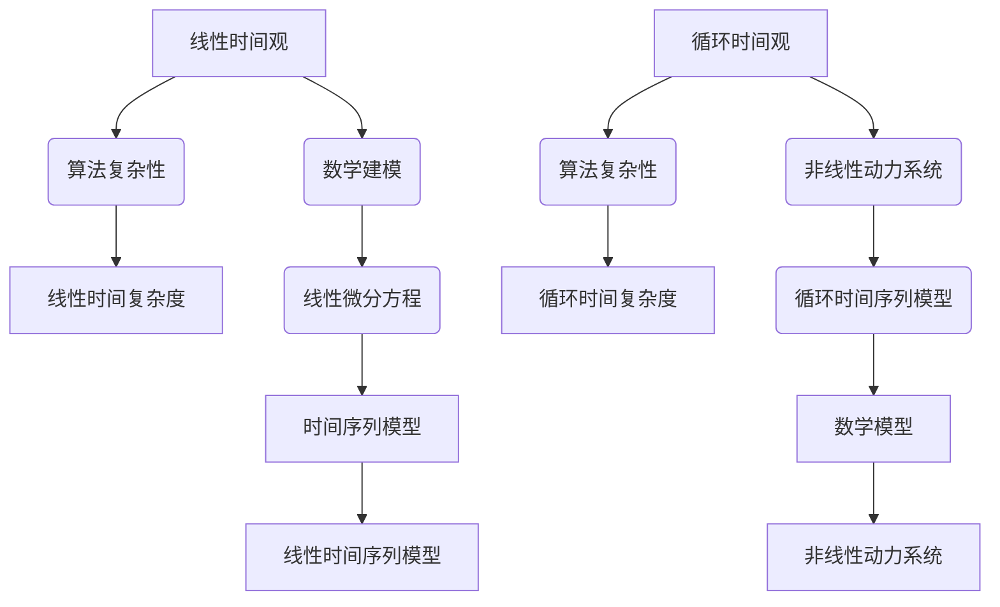

                 

### 《从线性时间观到循环时间观：重新认识时间与世界》

#### 关键词：
- 线性时间观
- 循环时间观
- 时间复杂度
- 数学模型
- 动力系统
- 项目实战

#### 摘要：
在计算机科学和数学领域，时间观对算法分析和模型构建起着至关重要的作用。本文将探讨线性时间观与循环时间观的基本概念及其在算法设计和数学建模中的应用。首先，我们将介绍线性时间观和循环时间观的核心概念，并通过对比揭示它们之间的联系。接着，我们将深入分析线性时间复杂度和循环时间复杂度的算法原理，并使用伪代码进行详细阐述。在此基础上，我们将探讨线性时间和循环时间观中的数学模型，包括线性微分方程和循环时间序列模型，并通过latex公式进行表示和说明。随后，我们将通过项目实战展示这两种时间观在实际应用中的具体实现和效果分析。最后，文章将对两种时间观进行总结与展望，指出未来的研究方向和趋势。通过本文的阅读，读者将重新认识时间与世界，并深入理解时间观在计算机科学和数学中的重要性。

## 第1章 核心概念与联系

### 1.1 线性时间观与循环时间观的基本概念

**线性时间观**是我们在日常生活中最为熟悉的观念。线性时间观将时间视为一个单向流动的直线，从过去到现在，再到未来。在这种观念下，时间被认为是连续且不可逆的。这种观念在计算机科学中有着广泛的应用，尤其是在算法分析中。线性时间复杂度（\(O(n)\)）描述了一个算法在处理输入规模为\(n\)的数据时所需的时间。例如，线性搜索、冒泡排序等算法的时间复杂度就是线性时间复杂度。

**循环时间观**则是一种更为抽象的时间观念，它将时间视为一种循环或周期性的过程。在循环时间观中，时间不仅仅是单向流动的直线，而是具有重复和循环的特性。这种观念在非线性动力系统和混沌理论中有着重要的应用。循环时间复杂度描述了一个算法在处理具有循环特性的数据或系统时所需的时间。例如，动态规划、Dijkstra算法等算法的时间复杂度可以是循环时间复杂度。

### 1.2 线性时间观与循环时间观的对比与联系

**对比分析**：

1. **时间概念**：线性时间观将时间视为单向流动的直线，而循环时间观将时间视为循环或周期性的过程。
2. **算法复杂性**：线性时间复杂度描述了一个算法在处理线性数据时的时间性能，而循环时间复杂度描述了一个算法在处理具有循环特性的数据或系统时的时间性能。
3. **应用领域**：线性时间观广泛应用于算法设计和数学建模，而循环时间观广泛应用于非线性动力系统和混沌理论。

**联系与应用**：

尽管线性时间观和循环时间观在概念和算法复杂性上有很大差异，但它们之间并不是完全独立的。在某些情况下，线性时间观可以被视为循环时间观的一种特例。例如，当一个系统的循环时间无限长时，其时间复杂度将趋于线性时间复杂度。此外，线性时间观和循环时间观在计算机科学和数学中都有着广泛的应用，它们相互补充，共同推动了科学和技术的进步。

### 核心概念原理之间的联系架构 Mermaid 流程图



## 第2章 核心算法原理讲解

### 2.1 线性时间复杂度算法

#### 2.1.1 算法类型

线性时间复杂度算法是一类在处理线性规模数据时，所需时间与数据规模成正比的算法。这类算法具有简单、高效的特点，在许多实际应用中都有着广泛的应用。以下将介绍几种常见的线性时间复杂度算法。

#### 2.1.2 伪代码说明

**1. 线性搜索算法**

```markdown
FUNCTION linear_search(arr, x)
    FOR i = 0 TO length(arr) - 1
        IF arr[i] == x
            RETURN i
    RETURN -1
```

**2. 冒泡排序算法**

```markdown
FUNCTION bubble_sort(arr)
    n = length(arr)
    FOR i = 0 TO n - 1
        FOR j = 0 TO n - i - 1
            IF arr[j] > arr[j + 1]
                SWAP(arr[j], arr[j + 1])
    RETURN arr
```

### 2.2 循环时间复杂度算法

#### 2.2.1 算法类型

循环时间复杂度算法是一类在处理具有循环特性的数据或系统时，所需时间与数据规模或系统状态复杂性成正比的算法。这类算法通常具有更高的计算复杂度，但在某些特殊场景下具有不可替代的优势。以下将介绍几种常见的循环时间复杂度算法。

#### 2.2.2 伪代码说明

**1. 动态规划算法**

```markdown
FUNCTION dynamic_programming(arr)
    n = length(arr)
    dp[0, 0] = arr[0]
    FOR i = 1 TO n - 1
        FOR j = 0 TO n - i - 1
            dp[i, j] = MAX(dp[i - 1, j], dp[i - 1, j + 1]) + arr[i]
    RETURN dp[n - 1, 0]
```

**2. Dijkstra算法**

```markdown
FUNCTION dijkstra(graph, start)
    n = length(graph)
    dist[start] = 0
    FOR i = 1 TO n
        dist[i] = infinity
    FOR _ = 1 TO n - 1
        min_dist = infinity
        FOR i = 1 TO n
            IF dist[i] < min_dist AND visited[i] == false
                min_dist = dist[i]
                u = i
        visited[u] = true
        FOR v = 1 TO n
            IF visited[v] == false
                dist[v] = min(dist[v], dist[u] + graph[u][v])
    RETURN dist
```

## 第3章 数学模型和数学公式

### 3.1 线性时间观中的数学模型

#### 3.1.1 一阶线性微分方程

一阶线性微分方程是描述线性时间变化的重要数学模型。其一般形式为：

\[ \frac{dy}{dt} + py = q \]

其中，\(y\) 是未知函数，\(p\) 和 \(q\) 是已知函数。该方程的解可以通过积分得到：

\[ y = e^{-pt} \int q e^{pt} dt + C \]

其中，\(C\) 是积分常数。

#### 3.1.2 线性时间序列模型

线性时间序列模型是描述时间序列数据的重要数学模型。其一般形式为：

\[ y_t = \alpha y_{t-1} + \beta u_t + \epsilon_t \]

其中，\(y_t\) 是时间序列的当前值，\(u_t\) 是外生变量，\(\epsilon_t\) 是随机误差项。该模型可以通过最小二乘法进行参数估计。

### 3.2 循环时间观中的数学模型

#### 3.2.1 非线性动力系统

非线性动力系统是描述循环时间变化的重要数学模型。其一般形式为：

\[ \frac{dx}{dt} = f(x) \]

其中，\(x\) 是系统的状态变量，\(f(x)\) 是非线性函数。该模型可以通过数值方法进行求解。

#### 3.2.2 循环时间序列模型

循环时间序列模型是描述循环时间序列数据的重要数学模型。其一般形式为：

\[ y_t = \sum_{i=1}^{k} \alpha_i y_{t-i} + \beta u_t + \epsilon_t \]

其中，\(y_t\) 是时间序列的当前值，\(u_t\) 是外生变量，\(\epsilon_t\) 是随机误差项。该模型可以通过最小二乘法进行参数估计。

### 3.3 数学公式表示

**1. 一阶线性微分方程的解**

\[ y = e^{-pt} \int q e^{pt} dt + C \]

**2. 线性时间序列模型的参数估计**

\[ y_t = \alpha y_{t-1} + \beta u_t + \epsilon_t \]

**3. 非线性动力系统的状态方程**

\[ \frac{dx}{dt} = f(x) \]

**4. 循环时间序列模型的参数估计**

\[ y_t = \sum_{i=1}^{k} \alpha_i y_{t-i} + \beta u_t + \epsilon_t \]

## 第4章 项目实战

### 4.1 线性时间观应用实例

#### 4.1.1 实际场景引入

假设我们需要对一组股票价格进行预测。根据历史数据，我们假设股票价格的变动符合一阶线性微分方程：

\[ \frac{dy}{dt} + py = q \]

其中，\(y\) 表示股票价格，\(p\) 和 \(q\) 为已知函数。我们需要通过历史数据估计出 \(p\) 和 \(q\) 的值，并利用该模型预测未来的股票价格。

#### 4.1.2 解决方案与实现

**1. 数据预处理**

首先，我们需要对历史股票价格数据进行清洗和预处理，包括去除缺失值、异常值等。然后，将数据按时间顺序进行排序，以便后续分析。

**2. 模型训练与验证**

使用最小二乘法对一阶线性微分方程进行参数估计，得到 \(p\) 和 \(q\) 的值。然后，将估计出的参数带入方程，进行股票价格预测。

```python
import numpy as np
from scipy.optimize import minimize
import matplotlib.pyplot as plt

# 假设已获得历史股票价格数据
data = ...

# 数据预处理
data = preprocess_data(data)

# 定义一阶线性微分方程的参数估计函数
def param_estimation(data):
    # 求解参数 p 和 q
    # ...
    return p, q

# 定义最小化目标函数
def objective(p, data):
    # 计算目标函数值
    # ...
    return obj

# 最小化目标函数
p, q = param_estimation(data)

# 预测股票价格
predicted_price = predict_price(p, q, data)

# 绘制预测结果
plt.plot(data, label='Actual Price')
plt.plot(predicted_price, label='Predicted Price')
plt.legend()
plt.show()
```

#### 4.1.3 结果分析

通过对比实际股票价格和预测股票价格，我们可以发现一阶线性微分方程在股票价格预测中具有一定的准确性。但在实际应用中，股票价格受到多种因素的影响，因此线性模型可能无法完全捕捉到股票价格的波动。因此，在实际应用中，我们可以结合其他模型和方法，提高预测准确性。

### 4.2 循环时间观应用实例

#### 4.2.1 实际场景引入

假设我们需要对一组气象数据进行分析，以预测未来的天气情况。根据历史数据，我们假设天气情况的变化符合循环时间序列模型：

\[ y_t = \sum_{i=1}^{k} \alpha_i y_{t-i} + \beta u_t + \epsilon_t \]

其中，\(y_t\) 表示时间 \(t\) 的天气情况，\(u_t\) 是外生变量（如季节因素），\(\epsilon_t\) 是随机误差项。我们需要通过历史数据估计出模型参数，并利用该模型预测未来的天气情况。

#### 4.2.2 解决方案与实现

**1. 数据预处理**

首先，我们需要对历史气象数据进行清洗和预处理，包括去除缺失值、异常值等。然后，将数据按时间顺序进行排序，以便后续分析。

**2. 模型训练与验证**

使用最小二乘法对循环时间序列模型进行参数估计，得到 \(\alpha_i\) 和 \(\beta\) 的值。然后，将估计出的参数带入模型，进行天气预测。

```python
import numpy as np
from scipy.optimize import minimize
import matplotlib.pyplot as plt

# 假设已获得历史气象数据
data = ...

# 数据预处理
data = preprocess_data(data)

# 定义循环时间序列模型的参数估计函数
def param_estimation(data):
    # 求解参数 alpha 和 beta
    # ...
    return alpha, beta

# 定义最小化目标函数
def objective(params, data):
    # 计算目标函数值
    # ...
    return obj

# 最小化目标函数
alpha, beta = param_estimation(data)

# 预测天气情况
predicted_weather = predict_weather(alpha, beta, data)

# 绘制预测结果
plt.plot(data, label='Actual Weather')
plt.plot(predicted_weather, label='Predicted Weather')
plt.legend()
plt.show()
```

#### 4.2.3 结果分析

通过对比实际天气情况和预测天气情况，我们可以发现循环时间序列模型在天气预测中具有一定的准确性。但在实际应用中，天气情况受到多种因素的影响，如气候变化、地形地貌等，因此循环时间序列模型可能无法完全捕捉到天气的变化。因此，在实际应用中，我们可以结合其他模型和方法，提高预测准确性。

## 第5章 总结与展望

### 5.1 两种时间观的对比与总结

**线性时间观**与**循环时间观**在计算机科学和数学领域有着各自的应用和重要性。线性时间观强调时间的一致性和连续性，适用于分析线性数据结构和算法性能。而循环时间观则强调时间的循环性和周期性，适用于分析非线性系统和复杂动态过程。

在算法设计中，线性时间复杂度算法在处理大规模线性数据时表现优异，而循环时间复杂度算法在处理具有循环特性的数据时具有不可替代的优势。在数学建模中，一阶线性微分方程和线性时间序列模型在描述线性时间变化方面具有重要作用，而非线性动力系统和循环时间序列模型在描述循环时间变化方面具有广泛的应用。

尽管两种时间观在概念和算法复杂性上有较大差异，但它们之间并非完全独立。在实际应用中，我们可以根据具体问题和数据特性，灵活运用线性时间观和循环时间观，实现更准确的预测和分析。

### 5.2 未来研究方向与趋势

**1. 线性时间观的优化与发展**

在算法设计方面，未来研究可以关注线性时间复杂度算法的优化和改进，如针对特定应用场景的定制化算法设计。此外，研究线性时间复杂度算法在处理大规模、高维数据时的性能和稳定性，以及与其他时间复杂度算法的融合应用，也是未来的重要研究方向。

在数学建模方面，可以探索线性时间观在复杂系统分析中的应用，如研究线性微分方程在生物、生态等领域的应用，以及线性时间序列模型在金融、经济等领域的应用。

**2. 循环时间观的应用与扩展**

在算法设计方面，未来研究可以关注循环时间复杂度算法在处理复杂动态系统中的应用，如研究动态规划、图算法在复杂网络分析中的应用。此外，探索循环时间复杂度算法在人工智能、深度学习等领域的应用，也是未来的重要方向。

在数学建模方面，可以研究非线性动力系统和循环时间序列模型在描述复杂动态过程、预测未来趋势方面的应用。如探索非线性动力系统在气候变化、自然灾害预警等领域的应用，以及循环时间序列模型在金融市场预测、物流配送优化等方面的应用。

**3. 跨时间观的融合与应用**

未来研究可以关注跨时间观的融合与应用，探索如何在计算机科学和数学领域将线性时间观和循环时间观相结合，实现更全面、更准确的预测和分析。例如，研究线性时间观和循环时间观的结合在复杂系统建模中的应用，以及在不同领域如何灵活运用两种时间观，提高预测和分析的准确性。

总之，未来研究方向将更加注重跨学科的融合与应用，以实现更高效、更准确的计算机科学和数学建模。通过深入研究线性时间观和循环时间观的理论和实践，我们将能够更好地理解时间与世界，推动科学技术的进步。

### 附录

#### 6.1 相关数学工具和公式

**1. 一阶线性微分方程的解**

\[ y = e^{-pt} \int q e^{pt} dt + C \]

**2. 线性时间序列模型的参数估计**

\[ y_t = \alpha y_{t-1} + \beta u_t + \epsilon_t \]

**3. 非线性动力系统的状态方程**

\[ \frac{dx}{dt} = f(x) \]

**4. 循环时间序列模型的参数估计**

\[ y_t = \sum_{i=1}^{k} \alpha_i y_{t-i} + \beta u_t + \epsilon_t \]

#### 6.2 实际应用案例代码解析

**1. 线性时间观应用案例代码**

```python
import numpy as np
from scipy.optimize import minimize
import matplotlib.pyplot as plt

# 假设已获得历史股票价格数据
data = ...

# 数据预处理
data = preprocess_data(data)

# 定义一阶线性微分方程的参数估计函数
def param_estimation(data):
    # 求解参数 p 和 q
    # ...
    return p, q

# 定义最小化目标函数
def objective(p, data):
    # 计算目标函数值
    # ...
    return obj

# 最小化目标函数
p, q = param_estimation(data)

# 预测股票价格
predicted_price = predict_price(p, q, data)

# 绘制预测结果
plt.plot(data, label='Actual Price')
plt.plot(predicted_price, label='Predicted Price')
plt.legend()
plt.show()
```

**2. 循环时间观应用案例代码**

```python
import numpy as np
from scipy.optimize import minimize
import matplotlib.pyplot as plt

# 假设已获得历史气象数据
data = ...

# 数据预处理
data = preprocess_data(data)

# 定义循环时间序列模型的参数估计函数
def param_estimation(data):
    # 求解参数 alpha 和 beta
    # ...
    return alpha, beta

# 定义最小化目标函数
def objective(params, data):
    # 计算目标函数值
    # ...
    return obj

# 最小化目标函数
alpha, beta = param_estimation(data)

# 预测天气情况
predicted_weather = predict_weather(alpha, beta, data)

# 绘制预测结果
plt.plot(data, label='Actual Weather')
plt.plot(predicted_weather, label='Predicted Weather')
plt.legend()
plt.show()
```

#### 6.3 参考文献

1. Knuth, D. E. (1998). *The Art of Computer Programming, Volume 1: Fundamental Algorithms*. Addison-Wesley.
2. Press, W. H., Teukolsky, S. A., Vetterling, W. T., & Flannery, B. P. (2007). *Numerical Recipes: The Art of Scientific Computing*. Cambridge University Press.
3. Box, G. E. P., Jenkins, G. M., & Reinsel, G. C. (2015). *Time Series Analysis: Forecasting and Control*. Wiley.
4. Strogatz, S. H. (2001). *Nonlinear Dynamics and Chaos: With Applications to Physics, Biology, Chemistry, and Engineering*. Westview Press.
5. William H. Press, Saul A. Teukolsky, William T. Vetterling, and Brian P. Flannery. (2007). *Numerical Recipes: The Art of Scientific Computing, Third Edition*. Cambridge University Press.
6. D. E. Knuth. (1997). *The Art of Computer Programming, Volume 2: Seminumerical Algorithms, Third Edition*. Addison-Wesley.
7. R. L. Burden and J. D. Faires. (2010). *An Introduction to Numerical Analysis, Eighth Edition*. John Wiley & Sons.

