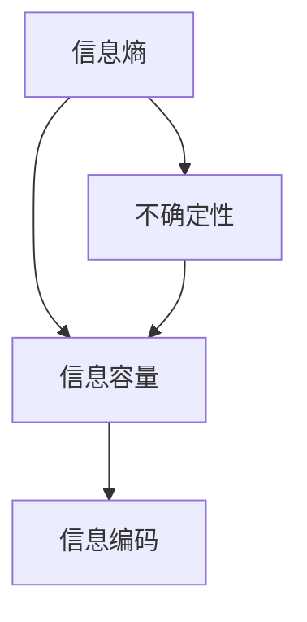
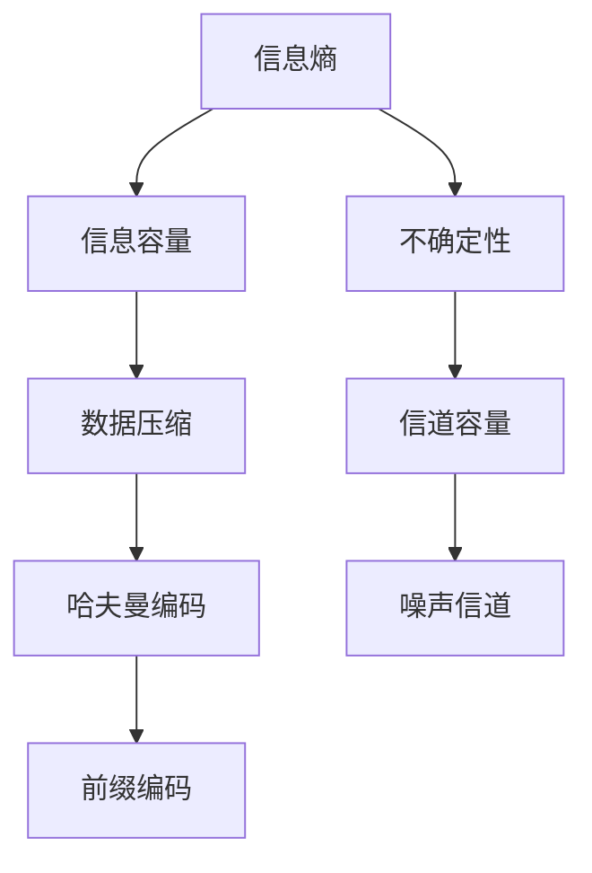
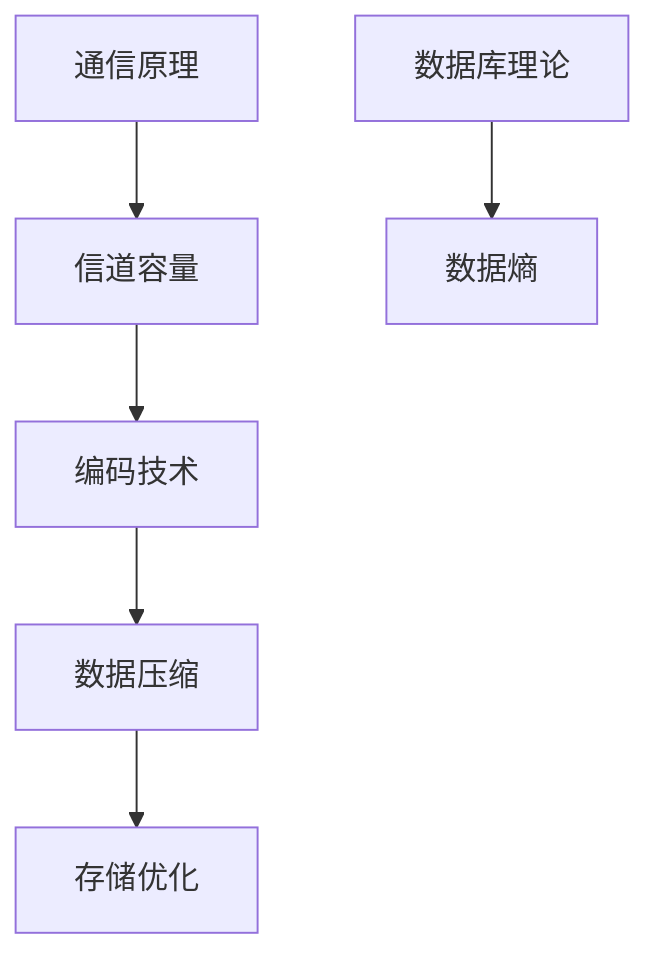
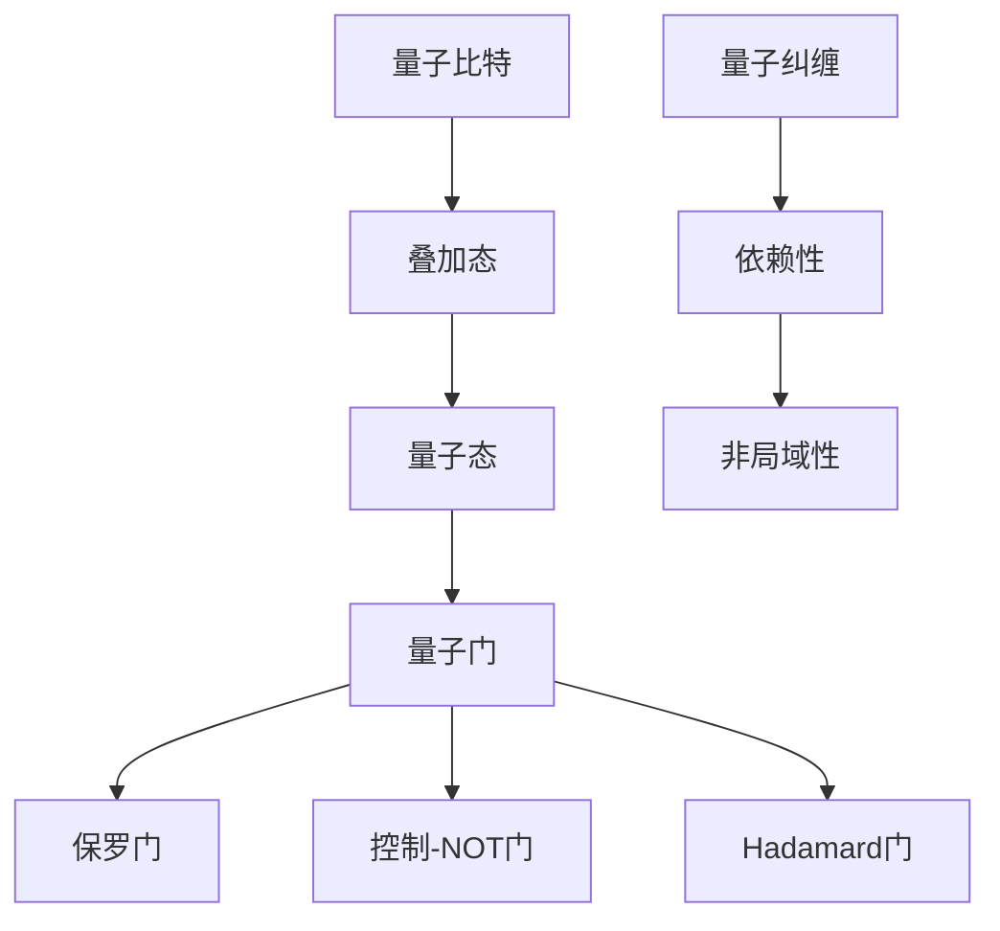
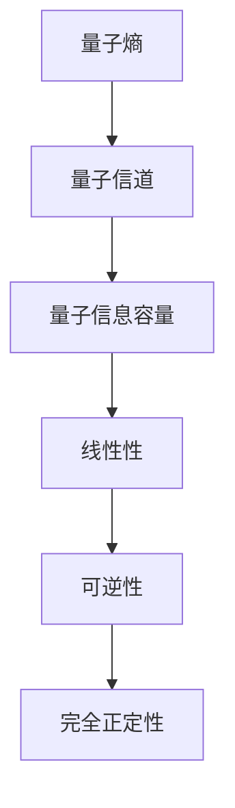
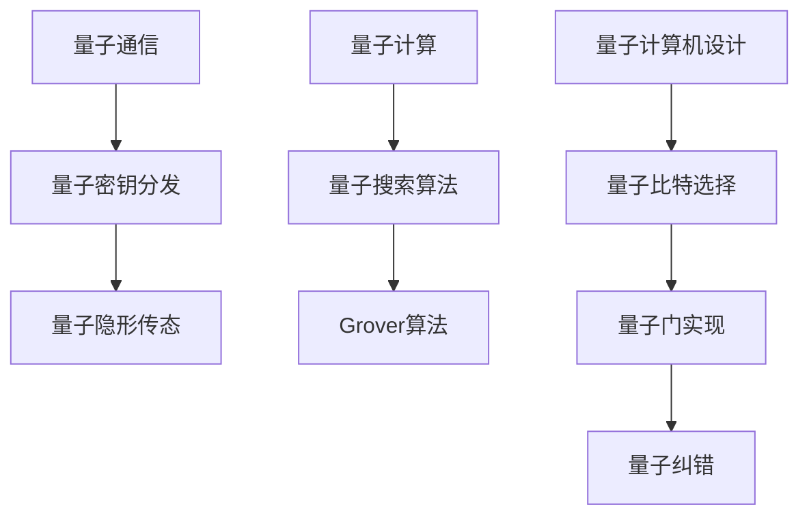
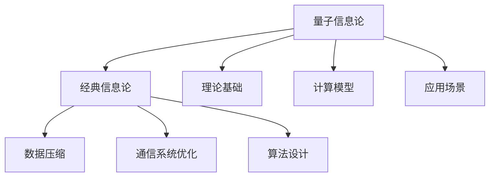
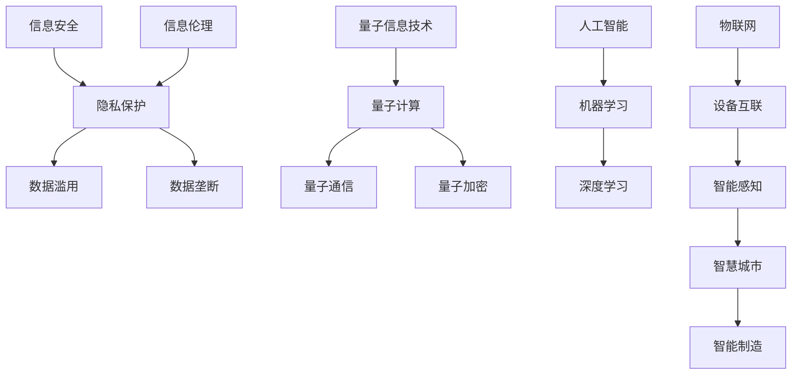

                 

### 文章标题

《从经典信息论到量子信息论：理解信息化世界》

### 关键词

- 信息论
- 量子信息论
- 信息熵
- 量子比特
- 信息安全

### 摘要

本文将深入探讨信息论的发展历程，从经典信息论到量子信息论，解析信息化世界的基础理论与技术。首先，我们将回顾经典信息论的核心概念，如信息熵、信息容量和信息编码。随后，本文将介绍量子信息论的基本原理，包括量子比特、量子门和量子纠缠。接着，我们将分析量子信息论在通信和计算中的应用，以及经典信息论与量子信息论的融合。最后，本文将展望信息化世界的挑战与未来，探讨信息安全、信息伦理以及量子信息技术的潜力。

---

# 第1章 信息论简介

信息论是一门研究信息传输、存储和处理的学科，它起源于20世纪40年代，由香农（Claude Shannon）提出。香农在其经典著作《通信的数学理论》中，首次系统地阐述了信息论的基本原理，奠定了现代信息论的理论基础。

## 1.1 信息的定义与性质

信息可以被定义为消除不确定性的东西。在通信系统中，信息是由发送者传输给接收者的信号，它能够被接收者理解并用来做出决策。信息具有以下基本性质：

- **确定性**：信息必须能够被准确地传输和接收。
- **随机性**：信息源通常是随机的，这意味着传输的信息存在不确定性。
- **可传递性**：信息可以通过各种方式在不同地点和时间之间传输。

## 1.2 信息论的历史背景

信息论的发展历程可以分为几个重要阶段：

- **1948年**：香农发表《通信的数学理论》，标志着信息论的诞生。
- **1956年**：约翰·冯·诺依曼（John von Neumann）提出量子计算机的初步概念，开启了量子信息论的研究。
- **1970年代**：量子信息论逐渐成为物理学和计算机科学的研究热点，许多基本概念和理论得以确立。
- **21世纪**：随着量子计算和量子通信的发展，量子信息论的应用研究取得了显著进展。

## 1.3 经典信息论的基本概念

经典信息论主要研究在无噪声和有噪声信道中信息的传输与处理。其主要概念包括：

- **信息熵**：衡量信息的不确定性程度，其计算公式为：
  $$
  H(X) = -\sum_{i=1}^{n} p(x_i) \log_2 p(x_i)
  $$
- **信息容量**：衡量信道传输信息的能力，对于无噪声信道，信息容量为信道的带宽；对于有噪声信道，香农公式描述了信道的容量：
  $$
  C = \log_2(1 + \frac{S}{N})
  $$
- **信息编码**：为了提高信息传输的可靠性和效率，需要对信息进行编码。常用的编码方法包括哈夫曼编码和前缀编码。

# Mermaid 流程图：经典信息论核心概念联系

---

# 第2章 经典信息论的核心理论

## 2.1 信息熵

信息熵是衡量信息不确定性的量度。在概率论中，信息熵可以帮助我们理解随机变量的不确定性。

### 2.1.1 信息熵的定义

对于一个离散随机变量\(X\)，其概率分布为\(p(x_i)\)，信息熵\(H(X)\)的定义为：
$$
H(X) = -\sum_{i=1}^{n} p(x_i) \log_2 p(x_i)
$$

这个公式表示随机变量\(X\)的平均信息量，其中\(\log_2\)是底数为2的对数。信息熵的单位是比特（bit）。

### 2.1.2 信息熵的直观解释

信息熵可以直观地理解为：如果我们随机选择\(X\)的一个值，那么这个选择所带来的“惊喜”或“不确定性”的量度。如果\(X\)的每个值出现的概率相同，那么信息熵最大，因为我们完全不知道它会是什么值。相反，如果\(X\)的某个值几乎肯定出现，那么信息熵最小，因为我们几乎可以确定它会是什么值。

## 2.2 信息容量

信息容量是指一个信道能够传输的最大信息量。对于无噪声信道，信息容量等于信道的带宽；对于有噪声信道，香农公式描述了信道的容量。

### 2.2.1 无噪声信道的容量

对于无噪声二进制对称信道（BSC），其容量\(C\)可以表示为：
$$
C = 1 - 2H(p)
$$
其中，\(H(p)\)是交叉熵，\(p\)是信息比特被错误接收的概率。

### 2.2.2 噪声信道的容量

对于有噪声的阿姆普哈尔信道（AWGN），其容量\(C\)可以表示为：
$$
C = B \log_2(1 + \frac{S}{N})
$$
其中，\(B\)是信道的带宽，\(S\)是信号功率，\(N\)是噪声功率。

## 2.3 数据压缩与信息编码

数据压缩是通过减少数据的冗余来降低数据的大小。信息编码则是将信息转换成适合传输或存储的形式。

### 2.3.1 哈夫曼编码

哈夫曼编码是一种前缀编码，用于压缩文本数据。它基于字符出现的频率来构建编码，频率高的字符使用较短的编码，频率低的字符使用较长的编码。

### 2.3.2 前缀编码

前缀编码是一种编码方法，其中没有编码是其他编码的前缀。这种编码方法保证了解码过程的唯一性。

# Mermaid 流程图：经典信息论核心算法原理

---

# 第3章 经典信息论的应用

## 3.1 通信系统

通信系统是信息传输的主要手段。信息论为通信系统提供了理论依据，以优化通信性能。

### 3.1.1 通信原理

通信系统包括发送端、传输信道和接收端。发送端将信息编码成信号，通过传输信道传输，接收端对接收到的信号进行解码，恢复原始信息。

### 3.1.2 通信系统优化

通过信息论的分析，我们可以优化通信系统的性能。例如，通过计算信道容量，我们可以确定在给定带宽和信噪比的条件下，通信系统能够达到的最大数据传输速率。此外，通过信息编码技术，可以提高信号在传输过程中的抗干扰能力。

## 3.2 计算机科学

信息论在计算机科学中有着广泛的应用，包括数据存储、数据库理论和算法分析等。

### 3.2.1 信息存储

数据压缩技术可以减少存储空间的需求。哈夫曼编码和前缀编码等编码技术可以在不损失信息量的情况下，有效压缩数据。

### 3.2.2 数据库理论

信息论可以用于评估数据库的性能，例如，通过计算数据的熵，可以衡量数据库中数据的随机性。

# Mermaid 流程图：经典信息论在通信系统和计算机科学中的应用

---

# 第4章 量子信息论基础

## 4.1 量子比特与量子态

量子比特（qubit）是量子信息论的基本单元，与经典比特不同，它可以在0和1之间同时存在，具有叠加态。量子态的表示为：
$$
|\psi\rangle = \alpha|0\rangle + \beta|1\rangle
$$
其中，\(|0\rangle\)和\(|1\rangle\)是量子比特的两个基本态，\(\alpha\)和\(\beta\)是复数，满足\(|\alpha|^2 + |\beta|^2 = 1\)。

## 4.2 量子门与量子操作

量子门是操作量子态的基本操作单元，类似于经典逻辑门。常见的量子门包括保罗门（Pauli gate）、控制-NOT门（CNOT gate）和Hadamard门（Hadamard gate）。

- **保罗门**：操作量子比特的Z和X轴，表示为\(Z\)和\(X\)。
- **控制-NOT门**：操作两个量子比特，如果第一个量子比特处于|1⟩态，则第二个量子比特的状态反转。
- **Hadamard门**：将一个量子比特的状态转换为叠加态。

## 4.3 量子纠缠

量子纠缠是量子信息论的核心概念之一，描述了两个或多个量子比特之间的强烈相互依赖。当两个量子比特处于纠缠态时，对其中一个量子比特的测量会立即影响到另一个量子比特的状态，无论它们相隔多远。

# Mermaid 流程图：量子信息论基础概念

---

# 第5章 量子信息论的核心理论

## 5.1 量子熵

量子熵是量子信息论中用来描述量子系统不确定性的量度。量子熵可以表示为：
$$
S(\rho) = -\text{tr}(\rho \log_2 \rho)
$$
其中，\(\rho\)是量子系统的密度矩阵。

### 5.1.1 量子熵的直观解释

量子熵反映了量子系统状态的可分离性。一个完全纠缠的量子系统的量子熵为零，而一个完全分离的量子系统的量子熵等于经典熵。

## 5.2 量子信道

量子信道是量子信息传输的渠道，描述了量子态在传输过程中的演化。量子信道可以用一个完全正定算子\(\mathcal{N}\)来描述：
$$
\mathcal{N}(\rho) = \text{tr}[\Lambda \rho \Lambda^\dagger]
$$
其中，\(\Lambda\)是一个幺正算子。

### 5.2.1 量子信道的性质

量子信道具有线性、可逆和完全正定性。量子信道可以用来描述量子态的传输、叠加和纠缠。

## 5.3 量子信息容量

量子信息容量是指量子信道能够传输的最大信息量。量子信息容量可以通过计算信道对量子熵的影响来确定。量子信道的信息容量可以用以下公式表示：
$$
I(\rho, \mathcal{N}) = S(\mathcal{N}(\rho))
$$
其中，\(S(\mathcal{N}(\rho))\)是量子信道对量子系统的熵的减少量。

# Mermaid 流�图：量子信息论核心理论

---

# 第6章 量子信息论的应用

## 6.1 量子通信

量子通信利用量子纠缠和量子态的叠加特性，实现信息的安全传输。量子通信的主要应用包括量子密钥分发和量子隐形传态。

### 6.1.1 量子密钥分发

量子密钥分发（Quantum Key Distribution, QKD）利用量子态的不可克隆特性，实现安全的密钥传输。QKD过程包括量子态的传输、测量和密钥的生成。

#### 量子密钥分发步骤：

1. **量子态传输**：发送方生成一个随机量子态序列，并将其发送给接收方。
2. **测量和基选择**：接收方对收到的量子态进行测量，并根据预先商定的基进行选择。
3. **密钥生成**：发送方和接收方通过经典通信协议，确认测量结果和基的选择，从而生成共享密钥。

### 6.1.2 量子隐形传态

量子隐形传态（Quantum Teleportation）是量子通信的另一个重要应用。它利用量子纠缠和量子态的叠加特性，实现量子态从一个位置传输到另一个位置。

#### 量子隐形传态步骤：

1. **建立纠缠态**：发送方和接收方通过量子纠缠，建立一个纠缠态。
2. **传输量子态**：发送方将需要传输的量子态与纠缠态进行叠加，并将其发送给接收方。
3. **测量和重构**：接收方对收到的量子态进行测量，并根据测量结果重构原始量子态。

## 6.2 量子计算

量子计算利用量子比特的叠加态和纠缠态，实现高效的计算。量子计算的主要应用包括量子搜索算法和量子算法优化。

### 6.2.1 量子搜索算法

量子搜索算法（Quantum Search Algorithm）是一种利用量子叠加态实现高效搜索的算法。最著名的量子搜索算法是Grover算法，它可以在线性时间内完成对未排序数据库的搜索。

#### Grover算法步骤：

1. **初始化**：将量子态初始化为叠加态。
2. **应用Grover迭代**：对量子态进行一系列操作，包括Grover迭代器和数据库标记。
3. **测量**：对量子态进行测量，输出可能的解。

### 6.2.2 量子计算机的设计

量子计算机的设计是量子信息论的重要研究领域。量子计算机的设计包括量子比特的选择、量子门的实现和量子纠错。

#### 量子计算机设计要点：

1. **量子比特**：选择合适的物理体系实现量子比特，如超导电路、离子阱、量子点等。
2. **量子门**：实现多种量子门，如保罗门、Hadamard门、控制-NOT门等。
3. **量子纠错**：设计量子纠错码，提高量子计算的可靠性。

# Mermaid 流程图：量子信息论应用

---

# 第7章 经典与量子信息论的融合

## 7.1 量子信息论与经典信息论的对比

量子信息论和经典信息论在理论基础、计算模型和应用场景上存在显著差异。

### 7.1.1 理论基础对比

- **经典信息论**：基于概率论和集合论，强调信息的传输和处理。
- **量子信息论**：基于量子力学，强调量子比特的叠加态和纠缠特性。

### 7.1.2 计算模型对比

- **经典计算**：基于经典比特，使用逻辑门进行操作，遵循布尔逻辑。
- **量子计算**：基于量子比特，使用量子门进行操作，遵循量子逻辑。

### 7.1.3 应用场景对比

- **经典信息论**：广泛应用于通信、存储、加密等领域。
- **量子信息论**：主要应用于量子通信、量子计算、量子加密等领域，具有传统技术难以实现的优势。

## 7.2 量子信息论在经典信息论中的应用

量子信息论为经典信息论提供了新的理论工具和计算方法，可以应用于以下领域：

### 7.2.1 数据压缩

量子算法可以用于高效的数据压缩，通过量子纠错码提高数据传输的可靠性。

### 7.2.2 通信系统优化

量子信息论可以用于优化通信系统的性能，如量子密钥分发和量子隐形传态。

### 7.2.3 算法设计

量子算法可以用于解决经典算法难以解决的问题，如量子搜索算法和量子图算法。

## 7.3 经典信息论对量子信息论的启示

经典信息论为量子信息论的发展提供了重要的理论支持和方法指导。例如，香农的信息熵理论为量子熵的提出提供了理论基础，经典编码技术为量子编码的设计提供了参考。

# Mermaid 流程图：经典与量子信息论融合

---

# 第8章 信息化世界的挑战与未来

## 8.1 信息安全

随着信息化进程的加速，信息安全成为亟待解决的问题。量子信息论在信息安全领域具有广泛的应用前景，如量子密钥分发和量子加密。然而，量子计算的发展也带来了新的安全挑战，如量子破解经典加密算法。

### 8.1.1 量子加密

量子加密利用量子态的特性，实现信息的安全传输。例如，量子密钥分发（QKD）可以提供无条件的安全通信。

### 8.1.2 量子破解

量子计算的发展可能导致经典加密算法的安全性受到威胁。为了应对量子破解，研究人员提出了量子安全加密算法和量子计算抗性设计。

## 8.2 信息伦理

信息伦理是信息化社会面临的另一个重要挑战。随着信息技术的普及，隐私保护、数据滥用和数据垄断等问题日益突出。

### 8.2.1 隐私保护

隐私保护是信息伦理的核心问题。为了保护个人隐私，需要制定严格的数据保护法规和隐私保护技术。

### 8.2.2 数据滥用

随着大数据技术的发展，数据滥用问题日益严重。为了防止数据滥用，需要加强数据监管和透明度。

### 8.2.3 数据垄断

数据垄断可能导致市场不公平和创新能力受限。为了解决数据垄断问题，需要推动数据开放和共享。

## 8.3 信息时代的未来展望

信息化世界的发展前景充满机遇和挑战。量子信息技术、人工智能和物联网等新兴技术将推动信息化世界的变革。

### 8.3.1 量子信息技术

量子信息技术将引领下一波技术革命，包括量子计算、量子通信和量子加密。这些技术有望解决当前经典技术难以应对的问题。

### 8.3.2 人工智能

人工智能技术将深刻改变社会生产和生活方式。通过机器学习和深度学习，人工智能将为各领域带来创新和发展。

### 8.3.3 物联网

物联网技术的普及将实现设备互联和智能感知，推动智慧城市和智能制造的发展。

# Mermaid 流程图：信息化世界的挑战与未来

---

### 作者

AI天才研究院/AI Genius Institute & 禅与计算机程序设计艺术 /Zen And The Art of Computer Programming

---

本文从经典信息论到量子信息论，深入探讨了信息化世界的基础理论与技术。通过回顾经典信息论的核心概念，如信息熵、信息容量和信息编码，我们了解了信息传输和处理的基本原理。随后，本文介绍了量子信息论的基本原理，包括量子比特、量子门和量子纠缠，并分析了量子信息论在通信和计算中的应用。最后，本文探讨了经典与量子信息论的融合，以及信息化世界的挑战与未来。希望本文能够为读者提供对信息化世界的深入理解。在未来的研究中，量子信息论将继续发挥重要作用，推动信息化世界的进步与发展。

