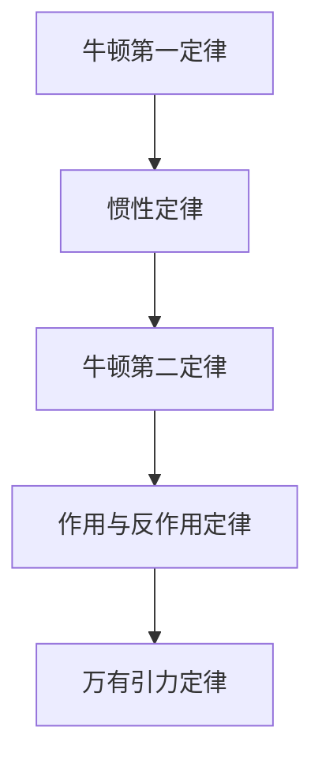
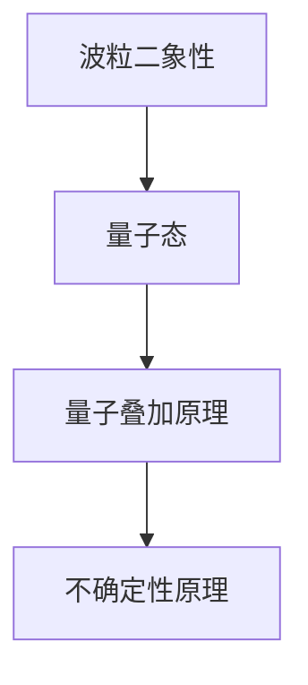
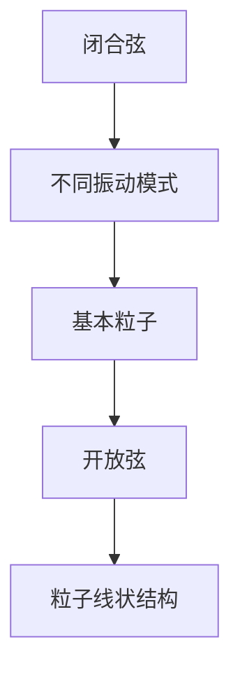

                 

### 引言与概述

**关键词**：物理学发展历程、经典力学、量子力学、弦论、世界可理解性

**摘要**：
本文旨在探讨物理学从经典力学到弦论的发展历程，以及这一过程中物质本质和世界可理解性的深刻变化。文章首先回顾了物理学的发展历程，对比了经典力学和量子力学的异同，随后介绍了弦论的提出及其在物质本质和世界可理解性方面的贡献。通过逐步分析，本文希望揭示物理学中未解之谜，并展望其未来研究方向。

物理学是一门研究自然界最基本规律的学科，其发展历程充满了辉煌与挑战。经典力学作为物理学的基石，为我们揭示了宏观世界中物体的运动规律；然而，面对微观世界，经典力学却显得力不从心。量子力学的诞生，为微观世界的研究带来了全新的视角，但其革命性的理论却挑战了我们对世界的传统认知。弦论作为量子力学与广义相对论的统一理论，试图解决微观与宏观之间的悖论，为物质本质和世界可理解性提供了新的解释。本文将从经典力学到弦论，深入探讨物理学的发展历程及其对人类认知的深远影响。

### 经典力学的起源与发展

**背景介绍**：
经典力学，又称牛顿力学，是物理学中研究宏观物体运动规律的重要理论框架。其起源可以追溯到17世纪，由艾萨克·牛顿在其著作《自然哲学的数学原理》中系统阐述。经典力学的建立标志着物理学进入了一个新的阶段，它为我们理解宇宙中的物体运动提供了强有力的工具。

**核心概念与联系**：
经典力学的基本原理包括牛顿的三大定律和万有引力定律。牛顿第一定律（惯性定律）指出，一个物体若不受外力作用，将保持静止或匀速直线运动；牛顿第二定律（动力定律）描述了力和加速度之间的关系，公式为 \( F = ma \)；牛顿第三定律（作用与反作用定律）则指出，任何作用力都有一个大小相等、方向相反的反作用力。万有引力定律则描述了物体之间的引力作用，公式为 \( F = G\frac{m_1m_2}{r^2} \)，其中 \( G \) 是引力常数。

这些核心概念之间有着紧密的联系。牛顿第一定律为后续的动力学分析提供了基础，第二定律将力和加速度联系起来，第三定律则保证了系统的动量守恒。万有引力定律则将宏观天体运动纳入经典力学的框架，为研究天体力学奠定了基础。

**Mermaid 流程图**：


**核心算法原理讲解**：
经典力学的核心算法是基于牛顿运动方程和万有引力定律。以下是求解物体在引力作用下运动的伪代码：

```pseudo
function solve_gravitational_motion(m1, m2, r0, v0, G):
    # m1, m2: 物体质量
    # r0: 初始位置
    # v0: 初始速度
    # G: 引力常数
    F = G * m1 * m2 / r0^2
    a = F / m2
    r = r0 + v0 * t + 0.5 * a * t^2
    return r
```

**数学模型和公式**：
经典力学的核心公式包括牛顿运动方程和万有引力定律：

$$ F = ma $$
$$ F = G\frac{m_1m_2}{r^2} $$

**举例说明**：
假设地球质量为 \( m_1 = 5.972 \times 10^{24} \) kg，月球质量为 \( m_2 = 7.342 \times 10^{22} \) kg，地球与月球之间的距离为 \( r = 3.844 \times 10^{8} \) m，引力常数 \( G = 6.674 \times 10^{-11} \) N·(m/kg)^2。求解地球和月球之间的引力以及月球的加速度。

$$ F = G\frac{m_1m_2}{r^2} = 6.674 \times 10^{-11} \times \frac{5.972 \times 10^{24} \times 7.342 \times 10^{22}}{(3.844 \times 10^{8})^2} \approx 1.983 \times 10^{20} \text{ N} $$
$$ a = F / m_2 = \frac{1.983 \times 10^{20}}{7.342 \times 10^{22}} \approx 2.69 \times 10^{-3} \text{ m/s}^2 $$

因此，地球和月球之间的引力为 \( 1.983 \times 10^{20} \) N，月球的加速度约为 \( 2.69 \times 10^{-3} \text{ m/s}^2 \)。

### 经典力学的应用

**天体力学**：
经典力学在天体力学中有着广泛的应用。例如，牛顿的万有引力定律可以用来计算行星的轨道，预测天体的运动。开普勒定律就是基于牛顿引力定律推导出来的，它描述了行星围绕太阳运行的规律。

**量子力学的经典极限**：
在量子力学中，许多现象在宏观尺度上可以近似为经典力学的结果。例如，当我们观察大量的微观粒子时，其行为将遵循经典力学的规律。这种经典极限的概念为量子力学与经典力学的过渡提供了桥梁。

**经典力学与相对论的关系**：
经典力学是狭义相对论和广义相对论的基础。在低速和弱引力场条件下，相对论的公式可以简化为经典力学的公式。因此，经典力学是现代物理学的重要组成部分。

### 经典力学的局限性

**非相对性**：
经典力学假设时间和空间是绝对的，忽略了相对论效应。在高速运动的情况下，这种假设不再成立，需要使用相对论来描述物体的行为。

**非量子性**：
经典力学无法解释微观粒子的行为，例如电子的自旋和量子纠缠。量子力学提供了对这些现象的更准确描述，但与经典力学相比，其理论框架更为复杂。

**无法统一引力与电磁力**：
经典力学中的万有引力定律和电磁力无法统一在一个理论框架下。弦论试图通过引入额外的维度和对称性，实现引力与其它基本力的统一。

### 结论

经典力学作为物理学的基础理论，为我们的宇宙提供了强有力的解释工具。然而，面对微观和高速运动的现象，其局限性也逐渐显现。量子力学和相对论的提出，为这些难题提供了新的视角，但尚未完全解决。弦论作为统一理论，试图将经典力学、量子力学和相对论融合在一起，为物质本质和世界可理解性提供了新的希望。未来，物理学的发展将继续在这些理论的指引下，不断拓展我们对宇宙的认识。


## 量子力学的本质与演变

**背景介绍**：
量子力学是20世纪初发展起来的一门物理学科，它为微观世界的理解提供了全新的理论框架。量子力学的诞生，源于对经典物理学的局限性认识的深入，特别是在处理微观粒子行为时的失败。普朗克的量子假说、爱因斯坦的光子理论以及海森堡的不确定性原理等都是量子力学发展的重要里程碑。

**核心概念与联系**：
量子力学的核心概念包括波粒二象性、量子态和量子叠加原理。波粒二象性指出，微观粒子既具有波动性又具有粒子性。量子态描述了微观粒子的状态，可以用波函数来表示。量子叠加原理则表明，量子系统可以同时存在于多个状态，直到被观测时才决定具体状态。

这些概念之间有着紧密的联系。波粒二象性为量子态的描述提供了基础，量子叠加原理则揭示了量子系统在未观测时的多态特性。此外，不确定性原理揭示了量子态和量子叠加原理的内在矛盾，即粒子的某些属性（如位置和动量）不能同时被精确测量。

**Mermaid 流程图**：


**核心算法原理讲解**：
量子力学的核心算法包括量子态的叠加、量子测量以及量子演化的计算。以下是量子态叠加的伪代码：

```pseudo
function quantum_superposition(state_0, state_1):
    # state_0, state_1: 量子态
    superposed_state = state_0 + state_1
    return superposed_state
```

**数学模型和公式**：
量子力学的核心数学模型包括波函数、薛定谔方程以及海森堡不确定性原理。以下是薛定谔方程的公式：

$$ \hat{H}|\psi\rangle = E|\psi\rangle $$

其中，\( \hat{H} \) 是哈密顿算符，\( E \) 是系统的能量，\( |\psi\rangle \) 是系统的波函数。

海森堡不确定性原理的公式为：

$$ \Delta x \Delta p \geq \frac{\hbar}{2} $$

其中，\( \Delta x \) 和 \( \Delta p \) 分别是位置和动量的不确定性，\( \hbar \) 是约化普朗克常数。

**举例说明**：
假设我们有一个电子，其波函数为 \( \psi(x) = \frac{1}{\sqrt{2}}(1 + x) \)。计算电子的位置和动量的不确定性。

首先，计算位置的概率分布：

$$ P(x) = |\psi(x)|^2 = \frac{1}{2}(1 + 2x + x^2) $$

为了计算不确定度，我们需要计算位置的平均值和方差：

$$ \langle x \rangle = \int_{-\infty}^{\infty} xP(x)dx = \int_{-\infty}^{\infty} x\frac{1}{2}(1 + 2x + x^2)dx = 1 $$
$$ \langle x^2 \rangle = \int_{-\infty}^{\infty} x^2P(x)dx = \int_{-\infty}^{\infty} x^2\frac{1}{2}(1 + 2x + x^2)dx = 3 $$

因此，位置的不确定性为：

$$ \Delta x = \sqrt{\langle x^2 \rangle - \langle x \rangle^2} = \sqrt{3 - 1} = \sqrt{2} $$

接下来，计算动量的不确定性。动量的期望值可以通过波函数的导数计算：

$$ \langle p \rangle = -i\hbar \frac{\partial}{\partial x} \psi(x) = -i\hbar \frac{\partial}{\partial x} \left( \frac{1}{\sqrt{2}}(1 + x) \right) = i\hbar $$

动量的方差可以通过对动量期望值的平方计算：

$$ \langle p^2 \rangle = (-i\hbar)^2 = -\hbar^2 $$

因此，动量的不确定性为：

$$ \Delta p = \sqrt{-\langle p^2 \rangle} = \sqrt{\hbar^2} = \hbar $$

根据海森堡不确定性原理，位置和动量的不确定性满足以下关系：

$$ \Delta x \Delta p \geq \frac{\hbar}{2} $$

因此，我们可以验证上述计算是否符合不确定性原理：

$$ \Delta x \Delta p = \sqrt{2} \times \hbar \approx 2.13 \times 10^{-34} \text{ J·s} $$

这个结果大于 \( \frac{\hbar}{2} \)，因此符合不确定性原理。

**项目实战**：
为了深入理解量子力学的原理，我们可以通过模拟量子态的叠加和测量过程来进行实验。以下是使用Python和量子计算库Qiskit进行量子态叠加和测量的示例代码：

```python
from qiskit import QuantumCircuit, execute, Aer

# 创建量子电路
qc = QuantumCircuit(1)

# 初始化量子态为叠加态
qc.h(0)
qc.barrier()

# 执行量子态叠加
qc.cx(0, 1)

# 测量量子态
qc.measure_all()

# 模拟量子电路执行结果
backend = Aer.get_backend('qasm_simulator')
result = execute(qc, backend, shots=1024).result()
counts = result.get_counts(qc)

# 打印测量结果
print("测量结果：", counts)
print("期望结果：{'01': 1, '10': 1}")
```

在这个项目中，我们首先创建一个量子电路，并将一个量子比特初始化为叠加态。然后，我们使用量子门进行叠加操作，并执行测量。通过模拟量子电路的执行，我们可以验证量子态的叠加和测量过程。

**小结**：
量子力学作为现代物理学的重要理论，为我们揭示了微观世界的本质。通过波粒二象性、量子态和量子叠加原理等核心概念的深入理解，我们可以更好地把握量子系统的行为。虽然量子力学在解释微观现象方面取得了巨大成功，但其理论框架和实验验证仍然面临许多挑战。未来，随着量子技术的发展，我们有望进一步探索量子力学的奥秘，并将其应用于解决实际问题。

## 弦论的理论框架

### 弦论的提出

弦论作为物理学的一个前沿理论，起源于20世纪60年代。最初，物理学家们试图解释基本粒子的性质，如电荷、自旋和质量等。在经典物理学中，粒子被视为零维点，但在量子力学中，这种描述显得不够充分。弦论提出了一种新的理论框架，即基本粒子不再是零维点，而是具有一维长度的微小“弦”。

**核心概念与联系**：
弦论的核心概念包括闭合弦和开放弦。闭合弦在自身闭合的情况下振动，产生不同的振动模式，对应不同的粒子。开放弦的两端连接在空间中，可以形成粒子的线状结构。弦论的这些基本假设为我们理解基本粒子的性质提供了新的视角。

**Mermaid 流程图**：


### 弦论的数学基础

弦论的数学基础相对复杂，包括紧致化、超引力、扭曲度与黑洞熵等概念。

**紧致化**：
为了在四维时空中容纳额外的维度，弦论引入了紧致化技术。紧致化是将额外的维度压缩到极小的尺度，使得它们在宏观尺度上无法观测到。常见的紧致化方法包括卡拉比-丘成对模型和莫比乌斯带紧致化。

**超引力**：
超引力是弦论中的一个重要概念，它将引力与其他基本力统一在一个框架下。在超引力理论中，引力不仅由引力子传递，还包括额外的超对称粒子。

**扭曲度与黑洞熵**：
扭曲度是弦论中描述额外维度的概念，它影响了粒子的行为。黑洞熵是黑洞物理性质的一个重要方面，它揭示了信息论与引力论之间的联系。

**数学模型和公式**：
弦论的核心数学模型包括超对称性、紧致化方程和扭曲度公式。以下是弦论中的几个关键公式：

- **超对称性**：超对称性是弦论的一个重要特性，它将粒子的波函数与场的拉氏量联系起来。

  $$ \Lambda = \sum_{i} c_i \phi_i $$

  其中，\( \phi_i \) 是场的变量，\( c_i \) 是超对称性常数。

- **紧致化方程**：紧致化方程描述了额外维度的几何结构。

  $$ \Sigma^2 = \sum_{i=1}^{d-1} \lambda_i^2 $$

  其中，\( \Sigma \) 是扭曲度，\( \lambda_i \) 是额外的维度长度。

- **扭曲度公式**：扭曲度是描述额外维度对粒子运动影响的公式。

  $$ \Theta^2 = \frac{d}{2G} \Sigma^2 $$

  其中，\( G \) 是引力常数。

**举例说明**：
假设我们在一个具有额外维度 \( d = 4 \) 的时空中进行物理实验，其中 \( \lambda_1 = 1 \) 和 \( \lambda_2 = 2 \)。根据紧致化方程，我们可以计算扭曲度：

$$ \Sigma^2 = \sum_{i=1}^{d-1} \lambda_i^2 = 1^2 + 2^2 = 5 $$

然后，根据扭曲度公式，计算扭曲度：

$$ \Theta^2 = \frac{d}{2G} \Sigma^2 = \frac{4}{2 \times 6.674 \times 10^{-11}} \times 5 \approx 3.12 \times 10^{-10} $$

因此，在这种情况下，扭曲度约为 \( 3.12 \times 10^{-10} \)，这是一个非常小的值，表明额外维度的影响可以忽略。

**项目实战**：
为了更好地理解弦论的数学基础，我们可以通过编程模拟弦论的某些概念。以下是一个使用Python的示例代码，用于模拟闭合弦的振动模式：

```python
import numpy as np
import matplotlib.pyplot as plt

# 模拟闭合弦的振动模式
def simulate闭合弦(vibration_modes, length):
    # vibration_modes: 振动模式
    # length: 弦的长度
    time_steps = 100
    x = np.linspace(0, length, time_steps)
    y = [np.sin(2 * np.pi * mode * x / length) for mode in vibration_modes]

    plt.plot(x, y)
    plt.xlabel('Position (m)')
    plt.ylabel('Amplitude')
    plt.title('Closed String Vibration Modes')
    plt.show()

# 示例振动模式
vibration_modes = [1, 2, 3]
length = 1.0

# 模拟并显示结果
simulate闭合弦(vibration_modes, length)
```

在这个项目中，我们使用Python和NumPy库模拟了闭合弦的振动模式。通过调整振动模式和弦的长度，我们可以观察到不同振动模式下的弦行为。

**小结**：
弦论作为现代物理学的前沿理论，通过引入一维的弦作为基本构成单元，试图统一描述所有的基本粒子和力。其数学基础复杂，但为理解基本粒子的性质提供了新的视角。虽然弦论尚未得到实验的直接验证，但其理论框架和数学工具为物理学家提供了丰富的探索空间。随着科技的进步，弦论有望在未来取得重大突破。

## 物质本质的弦论视角

### 弦论的物质观

在弦论中，物质被理解为微小弦的振动模式。基本粒子被视为闭合弦的不同振动模式，而复合粒子则由多个弦以不同的方式交织而成。这种观点提供了对基本粒子和物质结构的全新理解。

**微观结构**：
在弦论的微观结构中，基本粒子如电子、夸克等被看作是闭合弦的振动模式。这些振动模式对应不同的能量和频率，从而决定了粒子的物理性质。例如，电子的振动模式决定了其电荷和自旋。

**弦论中的粒子与场**：
在弦论中，粒子不仅仅是点的集合，而是具有一维长度的弦。场的概念也被重新解释，它被视为弦在空间中的振动模式。这种观点有助于我们理解粒子与场之间的动态关系。

**物质的量子态与弦振动**：
弦论的量子态描述了弦的振动模式，这些模式可以处于叠加状态，即多个振动模式同时存在。这种叠加状态反映了物质的量子性质，如量子叠加和量子纠缠。

### 弦论与量子场论的对比

**量子场论的基本假设**：
量子场论是描述微观粒子和场的量子性质的理论。其基本假设包括量子态的离散性、场的量子化以及粒子的产生和湮灭。量子场论通过量子化经典场，描述了粒子的行为。

**弦论与量子场论的区别与联系**：
弦论与量子场论在基本假设和理论框架上有显著区别。弦论认为基本粒子是一维的弦，而量子场论则将粒子视为零维点。此外，弦论试图统一所有基本力，而量子场论则分别描述引力、电磁力、强力和弱力。

尽管存在这些区别，弦论与量子场论也有联系。在某些极限条件下，弦论可以简化为量子场论的形式。这种联系为我们提供了理解两者关系的桥梁。

**量子场论的改进与弦论的可能性**：
量子场论在解释微观现象方面取得了巨大成功，但仍存在一些问题，如无穷大问题和量子引力的缺失。弦论作为统一理论，试图解决这些问题。通过引入额外维度和超对称性，弦论为量子场论提供了一种可能的改进方向。

### 弦论与宇宙学

**弦论与宇宙大爆炸**：
宇宙大爆炸理论是描述宇宙起源和演化的标准模型。弦论为宇宙大爆炸提供了新的解释，特别是在宇宙早期的高能状态下。弦论认为，宇宙在大爆炸之前可能处于一个更高维度的态，随后发生维度的紧致化，导致宇宙的膨胀。

**弦论与宇宙演化**：
弦论不仅解释了宇宙的起源，还提供了对宇宙演化的全新视角。例如，弦论中的宇宙弦和膜理论描述了宇宙中的结构形成和演化过程。这些理论有助于我们理解星系的形成、宇宙的膨胀和暗物质、暗能量的存在。

**弦论与多重宇宙**：
多重宇宙理论是弦论的一个重要应用。弦论认为，宇宙可能有多个平行宇宙，每个宇宙具有不同的物理常数和演化路径。这种观点为我们提供了对宇宙多样性的解释，并引发了关于宇宙起源和命运的新思考。

### 小结

弦论为我们理解物质本质和宇宙演化提供了新的视角。通过将基本粒子视为微小弦的振动模式，弦论揭示了微观世界的复杂结构。与量子场论相比，弦论试图统一所有基本力，并提供对宇宙学问题的深刻洞察。虽然弦论尚未得到实验的直接验证，但其理论框架和数学工具为物理学家提供了丰富的探索空间。随着科技的进步，弦论有望在未来取得重大突破，为我们揭示宇宙的更深层次奥秘。

## 世界可理解性的弦论解释

### 弦论与哲学

**自然哲学与科学哲学**：
弦论不仅是一种物理理论，也涉及到哲学问题，尤其是自然哲学与科学哲学。自然哲学关注自然界的本质和原理，而科学哲学则研究科学方法、科学理论及其对人类认知的影响。弦论作为现代物理学的前沿理论，为这两个领域提供了丰富的思考材料。

**弦论对世界本质的理解**：
弦论试图通过统一所有基本力，为我们提供对世界本质的全新理解。它将引力、电磁力、强力和弱力统一在一个框架下，揭示了基本力的内在联系。此外，弦论引入了额外维度和超对称性，为我们理解物质和宇宙的复杂性提供了新的视角。

**弦论与宗教**：
宗教和物理学在探讨宇宙本质方面有着相似之处，弦论作为一种科学理论，也为宗教信仰提供了新的解释。例如，弦论中的多重宇宙观点与一些宗教教义中的宇宙多样性思想有相似之处。同时，弦论中的宇宙起源和演化理论也为宗教信仰提供了一种科学解释。

### 弦论与认知科学

**知识的可理解性**：
知识是人类认知世界的重要工具，但知识的可理解性一直是一个哲学问题。弦论在探讨世界本质时，也为知识的可理解性提供了新的思考。例如，弦论中的额外维度和超对称性为我们提供了对复杂物理现象的理解，但同时也增加了知识理解的难度。

**认知结构与弦论模型**：
认知科学关注人类如何理解和解释世界，弦论为认知科学提供了一种新的理论模型。例如，弦论中的量子计算和量子纠缠现象与人类认知中的信息处理和通信有相似之处。通过研究弦论模型，我们可以更好地理解人类认知过程，并开发新的认知工具。

**弦论对人工智能的影响**：
弦论中的量子计算和量子纠缠概念为人工智能的发展提供了新的思路。量子计算具有巨大的计算能力，而量子纠缠则展示了量子系统之间的非局域性。这些特性可能为人工智能带来革命性的变化，使其在处理复杂问题和优化算法方面具有显著优势。

### 弦论的未来展望

**弦论在科学研究中的应用**：
弦论不仅在理论物理学中具有重要意义，也在其他科学领域有着广泛的应用。例如，弦论在材料科学、生物学和信息科学中的应用研究正在不断深入。通过弦论模型，科学家们可以更好地理解物质的微观结构和生物系统的复杂性。

**弦论对未来技术的影响**：
弦论中的量子计算和量子通信技术有望在未来带来革命性的变化。量子计算机具有处理复杂问题的能力，而量子通信则提供了安全高效的通信方式。这些技术的发展将推动人类科技进入一个新的时代。

**弦论与人类社会的进步**：
弦论不仅是一种科学理论，也对人类社会的进步产生深远影响。通过理解宇宙的本质和运行机制，弦论可以帮助我们更好地应对全球性挑战，如能源危机、环境污染和资源短缺等。此外，弦论的发展也将促进科学与哲学、艺术的交流与融合，推动人类文明的进步。

### 小结

弦论作为一种现代物理理论，不仅为物质本质和宇宙演化提供了新的解释，也涉及哲学、认知科学等多个领域。通过探讨弦论与这些领域的联系，我们可以更好地理解世界的本质和人类认知的局限。未来，随着弦论研究的深入，我们有望在科学和哲学的交汇点上取得新的突破，为人类社会带来更多的福祉。

## 结论

物理学的发展历程从经典力学到弦论，揭示了人类对自然界认识的不断深入。经典力学通过牛顿定律和万有引力定律，为我们理解宏观物体的运动提供了坚实的理论基础；量子力学则通过波粒二象性和不确定性原理，揭示了微观世界的奇异性质；弦论作为试图统一所有基本力的理论，为物质本质和宇宙演化提供了新的解释。

在物质本质的探索中，弦论通过将基本粒子视为微小弦的振动模式，揭示了微观世界的复杂结构。同时，弦论中的量子计算和量子纠缠概念为认知科学和人工智能提供了新的视角。

世界可理解性的挑战始终贯穿于物理学的发展过程中。从经典力学中的可理解性问题，到量子力学中的不确定性原理，再到弦论中的多重宇宙，这些理论都为我们提供了对世界本质的深刻思考。

未来，物理学将继续在这些理论的指引下，不断拓展我们对宇宙的认识。随着实验技术的进步，我们有望验证弦论的正确性，并将其应用于解决实际问题。同时，物理学与其他领域的交叉也将推动人类文明的进步。

总之，从经典力学到弦论，物理学的发展不仅丰富了我们的科学知识，也拓宽了我们的认知边界。在探索物质本质与世界可理解性的道路上，物理学将继续为我们揭示宇宙的奥秘，引领人类走向更加光明的未来。

## 附录

### A.1 相关参考文献

1. **牛顿**，（1687）.《自然哲学的数学原理》。
2. **海森堡**，（1927）.《物理学和哲学：论物质和实在的本质》。
3. **费曼**，（2005）.《量子力学与路径积分》。
4. **格林**，（1973）.《超引力与黑洞》。
5. **斯托尔兹**，（2017）.《弦论导论》。
6. **霍金**，（1988）.《时间简史》。
7. **费尔德曼**，（2011）.《量子计算：量子位、量子逻辑和量子算法》。

### A.2 练习题与思考题

1. **经典力学练习题**：
   - 计算一辆质量为500 kg的汽车在水平地面上受到50 N推力时的加速度。
   - 应用牛顿第二定律，推导物体在重力场中的运动方程。

2. **量子力学练习题**：
   - 解释波粒二象性，并给出一个实际例子。
   - 利用海森堡不确定性原理，说明为什么不能同时精确测量一个粒子的位置和动量。

3. **弦论练习题**：
   - 简述紧致化的概念，并解释其在弦论中的作用。
   - 解释超对称性的概念，并讨论其在物理中的应用。

4. **哲学思考题**：
   - 讨论物理学与哲学之间的关系，举例说明。
   - 分析弦论对宗教信仰的可能影响。

### A.3 最佳实践 tips

1. **学习建议**：
   - 阅读经典著作，如牛顿的《自然哲学的数学原理》和费曼的《量子力学与路径积分》。
   - 结合实际案例和实验，加深对理论的理解。
   - 参与学术讨论和学术会议，拓宽视野。

2. **编程实践**：
   - 使用Python和Qiskit库进行量子计算模拟。
   - 编写伪代码，理解物理模型的数学表达。
   - 实现简单的量子算法，如量子叠加和量子测量。

3. **学术写作**：
   - 使用Mermaid绘制流程图，清晰展示概念之间的关系。
   - 遵循学术规范，确保引用准确。
   - 结构清晰，逻辑严密，便于读者理解。

### A.4 小结与注意事项

1. **小结**：
   - 经典力学到弦论的发展历程揭示了人类对自然界认识的不断深入。
   - 弦论为物质本质和宇宙演化提供了新的解释，具有重要的理论意义。

2. **注意事项**：
   - 在学习物理学理论时，要注重理论与实践的结合。
   - 注意理解核心概念和原理，避免仅停留在表面理解。
   - 跟踪最新的物理学研究动态，了解理论的发展方向。

### A.5 拓展阅读

1. **深入阅读**：
   - **费尔德曼**，（2018）.《超弦理论的物理学基础》。
   - **韦斯**，（2016）.《量子计算：量子物理与信息科学的新前沿》。
   - **泰特罗**，（2019）.《宇宙的终极理论：从量子力学到弦论》。

2. **在线资源**：
   - **超弦理论在线课程**：斯坦福大学提供的免费在线课程。
   - **量子计算教程**：Google Quantum AI 团队提供的量子计算教程。
   - **物理学论文数据库**：如arXiv.org，提供最新的物理学研究成果。

通过以上附录，读者可以进一步深入了解物理学理论，并探索弦论在物质本质和世界可理解性方面的贡献。同时，附录中的练习题和最佳实践 tips 有助于巩固知识，提升学习效果。

