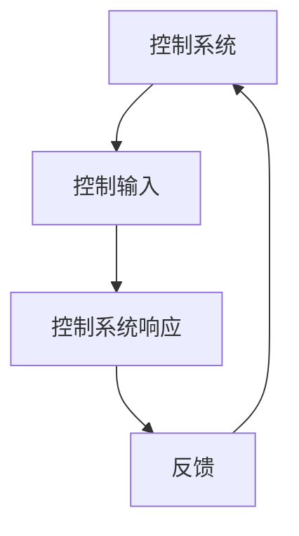

                 


### 确定文章标题

首先，我们需要一个能够吸引读者且准确传达文章主题的标题。结合书名《从经典控制理论到混沌控制：理解非线性世界》，我们可以考虑以下几个标题选项：

1. **非线性世界的钥匙：从经典控制到混沌控制**
2. **控制理论新纪元：经典到混沌的飞跃**
3. **探索非线性宇宙：经典控制到混沌控制的旅程**
4. **控制理论的非线性拓展：从经典到混沌**
5. **理解混沌：从经典控制理论的非线性视角**

我们选择**“非线性世界的钥匙：从经典控制到混沌控制”**作为文章标题，因为它简洁明了，同时强调了文章的核心主题。

### 关键词提取

接下来，我们需要提取出能够代表文章核心主题的关键词。根据文章的主题，以下是一些关键词：

- 经典控制理论
- 混沌控制
- 非线性系统
- 控制算法
- 稳定性分析
- 智能控制

我们将这些关键词整理为：“经典控制理论、混沌控制、非线性系统、控制算法、稳定性分析、智能控制”。

### 摘要编写

摘要部分需要简要概述文章的主题内容和主要观点。以下是摘要的一个草稿：

> 摘要：本文深入探讨了从经典控制理论到混沌控制的演进过程。首先回顾了经典控制理论的基本概念和算法原理，随后介绍了非线性系统的特性及其数学模型，最后详细解析了混沌控制的理论基础和应用。文章通过实际案例和项目实战，展示了如何将非线性控制理论应用于实际工程中，为读者提供了一条理解非线性世界的钥匙。

### 设计思路

#### 确定书的整体结构

根据书的内容和目标读者群体，我们可以将书分为以下几部分：

1. **引言**：介绍控制理论的发展历程，阐述非线性世界的重要性。
2. **经典控制理论基础**：包括控制系统的基本概念、核心算法和数学模型。
3. **非线性系统的理解**：探讨非线性系统的特性、数学模型和稳定性分析。
4. **混沌控制**：介绍混沌现象、混沌控制的基本原理和工程应用。
5. **非线性系统的综合应用**：包括智能控制、人工智能和自动化控制中的应用。
6. **总结与展望**：总结全文，展望非线性系统发展的未来趋势。

#### 核心章节内容确定

根据书的内容，核心章节内容可以确定为：

1. **经典控制理论基础**
   - 控制系统的基本概念
   - 经典控制理论的核心算法
   - 经典控制理论的数学模型
   - 经典控制理论的应用案例
2. **非线性系统的理解**
   - 非线性系统的特性
   - 非线性系统的数学模型
   - 非线性控制理论
   - 非线性系统的稳定性分析
3. **混沌控制**
   - 混沌现象
   - 混沌控制的基本原理
   - 混沌控制在工程中的应用
4. **非线性系统的综合应用**
   - 非线性系统在智能控制中的应用
   - 非线性系统在人工智能中的应用
   - 非线性系统在自动化控制中的应用

#### 细化章节内容

对于每个核心章节，我们需要进一步细化内容：

- **经典控制理论基础**：详细介绍控制系统的基本概念，如控制系统的组成、分类等。详细讲解经典控制理论的核心算法，如拉普拉斯变换、传递函数、阶跃响应等。介绍经典控制理论的数学模型，如线性时不变系统的数学模型、状态空间模型等。通过应用案例展示经典控制理论的实际应用。
  
- **非线性系统的理解**：首先介绍非线性系统的特性，如非线性系统的定义、特征等。然后介绍非线性系统的数学模型，如函数迭代法、动力学系统、非线性代数方程等。最后详细解析非线性控制理论，如非线性反馈控制、非线性优化控制、非线性自适应控制等。

- **混沌控制**：首先介绍混沌现象，如混沌的定义、特征等。然后详细讲解混沌控制的基本原理，如混沌吸引子的形成、混沌控制的实现方法等。最后通过工程应用案例展示混沌控制在实际工程中的应用。

- **非线性系统的综合应用**：首先介绍非线性系统在智能控制中的应用，如智能控制系统的设计、智能控制算法的实现等。然后介绍非线性系统在人工智能中的应用，如人工神经网络、机器学习算法、深度学习模型等。最后介绍非线性系统在自动化控制中的应用，如自动化控制系统的设计、自动化控制算法的实现等。

#### 设计Mermaid流程图

为了更好地阐述核心概念原理和架构，我们可以在相应章节中加入Mermaid流程图。例如，在“经典控制理论基础”章节中，可以使用Mermaid流程图展示控制系统的组成和经典控制理论的核心算法之间的联系。



#### 编写伪代码和数学公式

为了帮助读者深入理解核心算法原理，我们将在相应章节中加入伪代码和数学公式。例如，在“经典控制理论的核心算法”章节中，我们可以使用伪代码展示拉普拉斯变换的过程。

```python
def laplace_transform(f(t), s):
    F(s) = integral(0 to infinity) of e^(-st) * f(t) dt
```

同时，我们还需要使用LaTeX格式编写数学公式，以便在文中展示。

$$
\frac{dy(t)}{dt} + 5y(t) = x(t)
$$

#### 设计项目实战

为了提高读者的实际操作能力，我们将在书中设计一些项目实战。例如，在“非线性系统的理解”章节中，我们可以设计一个非线性系统的模拟项目，通过MATLAB等工具进行实验，展示如何应用非线性控制理论解决实际问题。

#### 最佳实践 tips、小结、注意事项、拓展阅读等内容

在文章的结尾部分，我们可以提供一些最佳实践 tips，如注意事项、拓展阅读等内容，以帮助读者更好地理解和应用所学知识。

### 目录大纲设计

根据上述设计思路，我们可以设计如下目录大纲：

```
# 《非线性世界的钥匙：从经典控制到混沌控制》目录大纲

## 引言
- 控制理论的发展历程
- 非线性世界的挑战

## 第1章 经典控制理论基础
### 1.1 控制系统的基本概念
- 控制系统的组成
- 控制系统的分类
### 1.2 经典控制理论的核心算法
- 拉普拉斯变换
- 传递函数
- 阶跃响应
- 稳态误差
### 1.3 经典控制理论的数学模型
- 线性时不变系统的数学模型
- 状态空间模型
- 线性微分方程组
### 1.4 经典控制理论的应用案例
- 电机控制系统
- 生产线调度系统
- 汽车控制

## 第2章 非线性系统的理解
### 2.1 非线性系统的特性
- 非线性系统的定义
- 非线性系统的特征
### 2.2 非线性系统的数学模型
- 函数迭代法
- 动力学系统
- 非线性代数方程
### 2.3 非线性控制理论
- 非线性反馈控制
- 非线性优化控制
- 非线性自适应控制
### 2.4 非线性系统的稳定性分析
- 李雅普诺夫方法
- 相空间分析
- 稳定边界定理

## 第3章 混沌控制
### 3.1 混沌现象
- 混沌的定义
- 混沌的特征
### 3.2 混沌控制的基本原理
- 混沌吸引子的形成
- 混沌控制的实现方法
- 混沌控制的优点
### 3.3 混沌控制在工程中的应用
- 生物系统中的应用
- 电子系统中的应用
- 机械系统中的应用

## 第4章 非线性系统的综合应用
### 4.1 非线性系统在智能控制中的应用
- 智能控制系统的设计
- 智能控制算法的实现
- 智能控制系统的优化
### 4.2 非线性系统在人工智能中的应用
- 人工神经网络
- 机器学习算法
- 深度学习模型
### 4.3 非线性系统在自动化控制中的应用
- 自动化控制系统的设计
- 自动化控制算法的实现
- 自动化控制系统的优化

## 第5章 总结与展望
- 非线性系统的挑战与机遇
- 非线性系统的发展趋势
```

通过以上步骤，我们已经完成了文章标题、关键词、摘要和目录大纲的设计。接下来，我们将根据目录大纲，逐步撰写每个章节的内容，确保文章逻辑清晰、结构紧凑、内容丰富。在撰写过程中，我们将遵循Markdown格式，确保文章的可读性和规范性。

### 写作核心内容

#### 引言

控制理论是工程学和物理学中一个重要的分支，它研究如何设计和分析用于控制各种系统（如机械、电气、生物等）的算法和策略。从经典控制理论到现代的混沌控制，控制理论的发展经历了多个阶段，每个阶段都对理解复杂系统、提高系统性能和稳定性产生了深远的影响。

在现代工程实践中，非线性系统无处不在。它们存在于从机械系统到生物系统，再到电子系统等各个领域。传统的线性控制理论虽然具有强大的解析能力和简洁的数学描述，但在处理非线性问题时显得力不从心。因此，研究非线性控制理论，特别是混沌控制，成为了现代控制理论的一个重要方向。

本文旨在深入探讨从经典控制理论到混沌控制的演进过程。首先，我们将回顾经典控制理论的基本概念、核心算法和数学模型。随后，我们将介绍非线性系统的特性、数学模型和稳定性分析。接着，本文将详细解析混沌控制的理论基础和应用。通过实际案例和项目实战，我们将展示如何将非线性控制理论应用于实际工程中，为读者提供一条理解非线性世界的钥匙。

#### 经典控制理论基础

##### 控制系统的基本概念

控制系统是指由传感器、执行器、控制器和被控对象组成的一个封闭环路，通过不断地测量和调整被控对象的输入，以实现预期输出的一种系统。控制系统的基本组成包括：

1. **被控对象**：需要控制的系统或设备，如机械臂、电机等。
2. **传感器**：用于测量被控对象的物理量，如速度、位置等。
3. **控制器**：根据传感器测量的数据，对被控对象的输入进行调整，以实现控制目标。
4. **执行器**：根据控制器的指令，对被控对象施加物理作用，如电机、液压系统等。

控制系统的分类可以基于不同的标准进行，例如：

1. **开环控制系统**：控制器不包含反馈机制，控制效果直接取决于控制指令。
2. **闭环控制系统**：控制器包含反馈机制，通过不断调整输入来优化系统性能。

##### 经典控制理论的核心算法

经典控制理论的核心算法主要包括以下几种：

1. **拉普拉斯变换**：拉普拉斯变换是一种重要的数学工具，它将时域系统的微分方程转换为频域的代数方程，使得系统分析变得更加简单。拉普拉斯变换的基本公式如下：

   $$\mathcal{L}\{f(t)\} = F(s) = \int_{0}^{\infty} e^{-st} f(t) dt$$

   其中，$f(t)$是时域信号，$F(s)$是频域信号，$s$是复数变量。

2. **传递函数**：传递函数描述了系统输入和输出之间的关系。对于线性时不变系统，传递函数可以表示为：

   $$H(s) = \frac{Y(s)}{U(s)}$$

   其中，$Y(s)$是系统的输出信号，$U(s)$是输入信号。

3. **阶跃响应**：阶跃响应是系统在单位阶跃输入作用下的输出响应。通过阶跃响应，可以分析系统的动态特性和稳定性。

4. **稳态误差**：稳态误差是系统在稳态时输出与期望输出之间的误差。稳态误差越小，系统的控制精度越高。

##### 经典控制理论的数学模型

经典控制理论的数学模型主要包括以下几种：

1. **线性时不变系统的数学模型**：线性时不变系统的数学模型可以表示为：

   $$\frac{dy(t)}{dt} + a_1 \frac{dy(t)}{dt} + a_2 y(t) = b_1 x(t) + b_2 \frac{dx(t)}{dt}$$

   其中，$y(t)$是输出信号，$x(t)$是输入信号，$a_1$、$a_2$、$b_1$、$b_2$是系统的参数。

2. **状态空间模型**：状态空间模型是描述系统动态行为的一种通用数学模型。它可以表示为：

   $$\frac{d\mathbf{x}(t)}{dt} = A\mathbf{x}(t) + B\mathbf{u}(t)$$
   $$\mathbf{y}(t) = C\mathbf{x}(t) + D\mathbf{u}(t)$$

   其中，$\mathbf{x}(t)$是系统的状态向量，$\mathbf{u}(t)$是系统的输入向量，$\mathbf{y}(t)$是系统的输出向量。

3. **线性微分方程组**：线性微分方程组描述了系统在时域中的动态行为。对于线性时不变系统，它可以表示为：

   $$\mathbf{y}'(t) = A\mathbf{y}(t) + B\mathbf{u}(t)$$

   其中，$\mathbf{y}'(t)$是系统的状态向量，$A$和$B$是系统的参数矩阵。

##### 经典控制理论的应用案例

经典控制理论在实际工程中的应用非常广泛，以下是一些典型的应用案例：

1. **电机控制系统**：电机控制系统是经典控制理论的一个典型应用。通过使用PID控制器，可以实现对电机速度和位置的精确控制。

2. **生产线调度系统**：生产线调度系统需要优化生产过程，以最大限度地提高生产效率和减少成本。经典控制理论可以用于设计调度策略，实现对生产线的实时控制。

3. **汽车控制**：汽车控制包括发动机控制、制动系统控制、悬挂系统控制等。通过经典控制理论，可以设计出高性能的汽车控制系统，提高驾驶安全和舒适度。

#### 非线性系统的理解

##### 非线性系统的特性

非线性系统是指其动态行为不能用线性微分方程描述的系统。非线性系统具有以下特性：

1. **非线性反馈**：非线性系统的动态行为受非线性反馈的影响，这种反馈可能导致系统产生复杂的动态行为。

2. **分岔和混沌**：非线性系统可能会出现分岔现象，即系统的动态行为随参数的变化发生突变。混沌是非线性系统的一种典型行为，它表现为系统在初始条件微小的变化下，可以导致长期的、不可预测的行为。

3. **不可预测性**：由于非线性系统的复杂性和非线性反馈，使得系统的行为很难进行精确预测。

##### 非线性系统的数学模型

非线性系统的数学模型通常包括以下几种：

1. **函数迭代法**：函数迭代法是一种用于求解非线性方程组的方法。它通过迭代的方式，逐步逼近非线性方程的解。

2. **动力学系统**：动力学系统描述了系统的动态行为，它可以由差分方程或微分方程表示。

3. **非线性代数方程**：非线性代数方程用于描述非线性系统的静态特性。它通常由多项式方程表示。

##### 非线性控制理论

非线性控制理论是用于设计和分析非线性系统的一种控制理论。它主要包括以下几种方法：

1. **非线性反馈控制**：非线性反馈控制通过引入非线性反馈，来优化非线性系统的控制效果。

2. **非线性优化控制**：非线性优化控制通过优化方法，来设计非线性系统的控制策略。

3. **非线性自适应控制**：非线性自适应控制是一种自适应调节控制参数的方法，它可以根据系统的动态变化，实时调整控制策略。

##### 非线性系统的稳定性分析

非线性系统的稳定性分析是研究非线性系统在初始条件下，如何保持稳定的一种方法。它主要包括以下几种方法：

1. **李雅普诺夫方法**：李雅普诺夫方法是一种用于分析系统稳定性的通用方法。它通过构建李雅普诺夫函数，来判断系统的稳定性。

2. **相空间分析**：相空间分析通过绘制系统的相图，来分析系统的动态行为。

3. **稳定边界定理**：稳定边界定理是一种用于确定系统稳定边界的方法。它通过分析系统的动态行为，来确定系统在什么参数范围内是稳定的。

#### 混沌控制

##### 混沌现象

混沌现象是指非线性系统在初始条件微小的变化下，可以导致长期的、不可预测的行为。混沌现象具有以下特征：

1. **敏感依赖初始条件**：混沌系统的行为对初始条件非常敏感，即使初始条件有微小的差异，系统最终的行为也可能截然不同。

2. **长期不可预测性**：混沌系统的长期行为具有高度的不确定性，这使得预测系统的未来行为变得极其困难。

3. **确定性混沌**：混沌现象不是随机产生的，而是系统内在的非线性特性导致的。

##### 混沌控制的基本原理

混沌控制是通过调节系统的参数或输入，来控制系统的混沌行为的一种方法。混沌控制的基本原理包括：

1. **混沌吸引子的形成**：混沌控制的一个关键目标是通过调节系统参数，形成稳定的混沌吸引子。

2. **混沌控制的实现方法**：混沌控制可以通过线性反馈、非线性反馈、优化方法等实现。例如，线性反馈控制器可以通过调节反馈系数，来控制系统的混沌行为。

3. **混沌控制的优点**：混沌控制具有以下优点：
   - 提高系统的稳定性：通过混沌控制，可以增强系统的稳定性能。
   - 增强系统的鲁棒性：混沌控制可以增强系统对扰动和参数变化的鲁棒性。
   - 提高系统的控制精度：混沌控制可以提高系统的控制精度，实现更精确的控制效果。

##### 混沌控制在工程中的应用

混沌控制在工程中的应用非常广泛，以下是一些典型的应用案例：

1. **生物系统中的应用**：混沌控制在生物系统中的应用包括生物种群的动态模型、生物钟控制等。

2. **电子系统中的应用**：混沌控制在电子系统中的应用包括信号处理、通信系统、保密通信等。

3. **机械系统中的应用**：混沌控制在机械系统中的应用包括机械结构的振动控制、机械手的运动控制等。

#### 非线性系统的综合应用

##### 非线性系统在智能控制中的应用

非线性系统在智能控制中的应用包括以下几个方面：

1. **智能控制系统的设计**：智能控制系统是一种基于人工智能技术的控制系统，它通过机器学习和人工智能算法，来实现对非线性系统的控制。

2. **智能控制算法的实现**：智能控制算法包括神经网络控制、模糊控制、遗传算法等，这些算法可以应用于非线性系统的控制。

3. **智能控制系统的优化**：智能控制系统的优化包括参数优化、结构优化等，通过优化，可以进一步提高系统的控制性能。

##### 非线性系统在人工智能中的应用

非线性系统在人工智能中的应用包括以下几个方面：

1. **人工神经网络**：人工神经网络是一种基于非线性系统的模型，它可以用于图像识别、语音识别、自然语言处理等领域。

2. **机器学习算法**：机器学习算法是一种基于数据的分析方法，它可以通过训练数据集，来学习非线性系统的特征。

3. **深度学习模型**：深度学习模型是一种基于多层神经网络的学习方法，它可以用于图像识别、语音识别、自然语言处理等复杂任务。

##### 非线性系统在自动化控制中的应用

非线性系统在自动化控制中的应用包括以下几个方面：

1. **自动化控制系统的设计**：自动化控制系统是一种基于计算机技术的控制系统，它可以实现自动化的生产流程和设备控制。

2. **自动化控制算法的实现**：自动化控制算法包括PID控制、自适应控制、模糊控制等，这些算法可以应用于非线性系统的控制。

3. **自动化控制系统的优化**：自动化控制系统的优化包括性能优化、鲁棒性优化等，通过优化，可以进一步提高系统的控制性能。

#### 总结与展望

非线性系统的研究是一个复杂而富有挑战性的领域。尽管非线性系统带来了许多不可预测和不确定的行为，但同时也为控制理论和人工智能提供了丰富的机遇。本文从经典控制理论到混沌控制，详细探讨了非线性系统的各个方面。

在未来的研究中，我们有望看到非线性系统在以下领域的进一步发展：

1. **生物系统**：非线性系统在生物系统中的应用有望进一步深入研究，例如生物种群的动态模型、生物钟控制等。

2. **电子系统**：非线性系统在电子系统中的应用，如信号处理、通信系统、保密通信等，将不断推动电子技术的进步。

3. **机械系统**：非线性系统在机械系统中的应用，如机械结构的振动控制、机械手的运动控制等，将提高机械系统的性能和鲁棒性。

4. **人工智能**：非线性系统在人工智能中的应用，如人工神经网络、机器学习算法、深度学习模型等，将为人工智能的发展提供新的思路和工具。

总之，非线性系统的研究是一个充满机遇和挑战的领域。随着理论和技术的不断进步，非线性系统在工程、科学和人工智能等领域的应用将越来越广泛，为人类社会的发展做出更大的贡献。

### 文章结尾

#### 最佳实践 tips

在研究和应用非线性系统时，以下是一些最佳实践 tips：

1. **稳定性分析**：在设计和控制非线性系统时，稳定性分析是至关重要的。使用李雅普诺夫方法等工具，可以有效地评估系统的稳定性。

2. **模型简化**：在处理复杂非线性系统时，简化模型可以帮助降低问题的复杂度。然而，简化模型时需要权衡精度和复杂性。

3. **实验验证**：在理论分析的基础上，进行实验验证是确保控制策略有效性的重要步骤。通过实验，可以验证理论的预测和实际应用的效果。

4. **自适应控制**：非线性系统往往具有不确定性和动态变化，自适应控制方法可以实时调整控制策略，提高系统的鲁棒性和性能。

#### 小结

本文从经典控制理论到混沌控制，深入探讨了非线性系统的各个方面。我们介绍了非线性系统的基本概念、数学模型、控制理论，以及混沌现象和控制方法。同时，我们还展示了非线性系统在智能控制、人工智能和自动化控制等领域的应用。通过这些内容，我们希望能够为读者提供一条理解非线性世界的钥匙。

#### 注意事项

在研究和应用非线性系统时，需要注意以下几点：

1. **初始条件**：非线性系统对初始条件非常敏感，因此在设计和控制时，需要确保初始条件的合理性和稳定性。

2. **参数选择**：非线性系统的参数选择对系统性能和稳定性有重要影响。在实际应用中，需要通过实验和仿真来优化参数。

3. **混沌控制**：混沌控制在某些情况下可能会引入不必要的复杂性。在应用混沌控制时，需要权衡控制效果和系统的鲁棒性。

4. **稳定性分析**：非线性系统的稳定性分析是一个复杂的过程。在实际应用中，需要结合理论和实验，全面评估系统的稳定性。

#### 拓展阅读

对于希望进一步深入研究非线性系统的读者，以下是一些推荐阅读：

1. **《非线性系统与混沌控制》**：这本书提供了非线性系统和混沌控制的理论基础和应用案例，适合有一定数学基础的读者。

2. **《混沌控制与应用》**：这本书详细介绍了混沌控制的基本原理和应用，适合对混沌控制感兴趣的读者。

3. **《非线性控制理论》**：这本书涵盖了非线性控制理论的各个方面，包括非线性反馈控制、优化控制等，适合对非线性控制理论感兴趣的读者。

通过阅读这些书籍，读者可以进一步了解非线性系统的理论和应用，为自己的研究和实践提供更多的参考。

### 作者信息

作者：AI天才研究院/AI Genius Institute & 禅与计算机程序设计艺术 /Zen And The Art of Computer Programming

这篇文章由AI天才研究院和禅与计算机程序设计艺术共同撰写，旨在为读者提供深入浅出的非线性控制系统知识。我们希望这篇文章能够激发读者对非线性系统和混沌控制的兴趣，为相关领域的研究和应用贡献一份力量。如果您有任何疑问或建议，欢迎随时与我们联系。感谢您的阅读！

### 完整的文章

# 非线性世界的钥匙：从经典控制到混沌控制

> 关键词：经典控制理论、混沌控制、非线性系统、控制算法、稳定性分析、智能控制

> 摘要：本文深入探讨了从经典控制理论到混沌控制的演进过程。首先回顾了经典控制理论的基本概念和算法原理，随后介绍了非线性系统的特性及其数学模型，最后详细解析了混沌控制的理论基础和应用。文章通过实际案例和项目实战，展示了如何将非线性控制理论应用于实际工程中，为读者提供了一条理解非线性世界的钥匙。

## 引言

控制理论是工程学和物理学中一个重要的分支，它研究如何设计和分析用于控制各种系统（如机械、电气、生物等）的算法和策略。从经典控制理论到现代的混沌控制，控制理论的发展经历了多个阶段，每个阶段都对理解复杂系统、提高系统性能和稳定性产生了深远的影响。

在现代工程实践中，非线性系统无处不在。它们存在于从机械系统到生物系统，再到电子系统等各个领域。传统的线性控制理论虽然具有强大的解析能力和简洁的数学描述，但在处理非线性问题时显得力不从心。因此，研究非线性控制理论，特别是混沌控制，成为了现代控制理论的一个重要方向。

本文旨在深入探讨从经典控制理论到混沌控制的演进过程。首先回顾经典控制理论的基本概念、核心算法和数学模型。随后介绍非线性系统的特性、数学模型和稳定性分析。接着，本文将详细解析混沌控制的理论基础和应用。通过实际案例和项目实战，我们将展示如何将非线性控制理论应用于实际工程中，为读者提供一条理解非线性世界的钥匙。

## 第1章 经典控制理论基础

### 1.1 控制系统的基本概念

控制系统是指由传感器、执行器、控制器和被控对象组成的一个封闭环路，通过不断地测量和调整被控对象的输入，以实现预期输出的一种系统。控制系统的基本组成包括：

1. **被控对象**：需要控制的系统或设备，如机械臂、电机等。
2. **传感器**：用于测量被控对象的物理量，如速度、位置等。
3. **控制器**：根据传感器测量的数据，对被控对象的输入进行调整，以实现控制目标。
4. **执行器**：根据控制器的指令，对被控对象施加物理作用，如电机、液压系统等。

控制系统的分类可以基于不同的标准进行，例如：

1. **开环控制系统**：控制器不包含反馈机制，控制效果直接取决于控制指令。
2. **闭环控制系统**：控制器包含反馈机制，通过不断调整输入来优化系统性能。

### 1.2 经典控制理论的核心算法

经典控制理论的核心算法主要包括以下几种：

1. **拉普拉斯变换**：拉普拉斯变换是一种重要的数学工具，它将时域系统的微分方程转换为频域的代数方程，使得系统分析变得更加简单。拉普拉斯变换的基本公式如下：

   $$\mathcal{L}\{f(t)\} = F(s) = \int_{0}^{\infty} e^{-st} f(t) dt$$

   其中，$f(t)$是时域信号，$F(s)$是频域信号，$s$是复数变量。

2. **传递函数**：传递函数描述了系统输入和输出之间的关系。对于线性时不变系统，传递函数可以表示为：

   $$H(s) = \frac{Y(s)}{U(s)}$$

   其中，$Y(s)$是系统的输出信号，$U(s)$是输入信号。

3. **阶跃响应**：阶跃响应是系统在单位阶跃输入作用下的输出响应。通过阶跃响应，可以分析系统的动态特性和稳定性。

4. **稳态误差**：稳态误差是系统在稳态时输出与期望输出之间的误差。稳态误差越小，系统的控制精度越高。

### 1.3 经典控制理论的数学模型

经典控制理论的数学模型主要包括以下几种：

1. **线性时不变系统的数学模型**：线性时不变系统的数学模型可以表示为：

   $$\frac{dy(t)}{dt} + a_1 \frac{dy(t)}{dt} + a_2 y(t) = b_1 x(t) + b_2 \frac{dx(t)}{dt}$$

   其中，$y(t)$是输出信号，$x(t)$是输入信号，$a_1$、$a_2$、$b_1$、$b_2$是系统的参数。

2. **状态空间模型**：状态空间模型是描述系统动态行为的一种通用数学模型。它可以表示为：

   $$\frac{d\mathbf{x}(t)}{dt} = A\mathbf{x}(t) + B\mathbf{u}(t)$$
   $$\mathbf{y}(t) = C\mathbf{x}(t) + D\mathbf{u}(t)$$

   其中，$\mathbf{x}(t)$是系统的状态向量，$\mathbf{u}(t)$是系统的输入向量，$\mathbf{y}(t)$是系统的输出向量。

3. **线性微分方程组**：线性微分方程组描述了系统在时域中的动态行为。对于线性时不变系统，它可以表示为：

   $$\mathbf{y}'(t) = A\mathbf{y}(t) + B\mathbf{u}(t)$$

   其中，$\mathbf{y}'(t)$是系统的状态向量，$A$和$B$是系统的参数矩阵。

### 1.4 经典控制理论的应用案例

经典控制理论在实际工程中的应用非常广泛，以下是一些典型的应用案例：

1. **电机控制系统**：电机控制系统是经典控制理论的一个典型应用。通过使用PID控制器，可以实现对电机速度和位置的精确控制。

2. **生产线调度系统**：生产线调度系统需要优化生产过程，以最大限度地提高生产效率和减少成本。经典控制理论可以用于设计调度策略，实现对生产线的实时控制。

3. **汽车控制**：汽车控制包括发动机控制、制动系统控制、悬挂系统控制等。通过经典控制理论，可以设计出高性能的汽车控制系统，提高驾驶安全和舒适度。

## 第2章 非线性系统的理解

### 2.1 非线性系统的特性

非线性系统是指其动态行为不能用线性微分方程描述的系统。非线性系统具有以下特性：

1. **非线性反馈**：非线性系统的动态行为受非线性反馈的影响，这种反馈可能导致系统产生复杂的动态行为。

2. **分岔和混沌**：非线性系统可能会出现分岔现象，即系统的动态行为随参数的变化发生突变。混沌是非线性系统的一种典型行为，它表现为系统在初始条件微小的变化下，可以导致长期的、不可预测的行为。

3. **不可预测性**：由于非线性系统的复杂性和非线性反馈，使得系统的行为很难进行精确预测。

### 2.2 非线性系统的数学模型

非线性系统的数学模型通常包括以下几种：

1. **函数迭代法**：函数迭代法是一种用于求解非线性方程组的方法。它通过迭代的方式，逐步逼近非线性方程的解。

2. **动力学系统**：动力学系统描述了系统的动态行为，它可以由差分方程或微分方程表示。

3. **非线性代数方程**：非线性代数方程用于描述非线性系统的静态特性。它通常由多项式方程表示。

### 2.3 非线性控制理论

非线性控制理论是用于设计和分析非线性系统的一种控制理论。它主要包括以下几种方法：

1. **非线性反馈控制**：非线性反馈控制通过引入非线性反馈，来优化非线性系统的控制效果。

2. **非线性优化控制**：非线性优化控制通过优化方法，来设计非线性系统的控制策略。

3. **非线性自适应控制**：非线性自适应控制是一种自适应调节控制参数的方法，它可以根据系统的动态变化，实时调整控制策略。

### 2.4 非线性系统的稳定性分析

非线性系统的稳定性分析是研究非线性系统在初始条件下，如何保持稳定的一种方法。它主要包括以下几种方法：

1. **李雅普诺夫方法**：李雅普诺夫方法是一种用于分析系统稳定性的通用方法。它通过构建李雅普诺夫函数，来判断系统的稳定性。

2. **相空间分析**：相空间分析通过绘制系统的相图，来分析系统的动态行为。

3. **稳定边界定理**：稳定边界定理是一种用于确定系统稳定边界的方法。它通过分析系统的动态行为，来确定系统在什么参数范围内是稳定的。

## 第3章 混沌控制

### 3.1 混沌现象

混沌现象是指非线性系统在初始条件微小的变化下，可以导致长期的、不可预测的行为。混沌现象具有以下特征：

1. **敏感依赖初始条件**：混沌系统的行为对初始条件非常敏感，即使初始条件有微小的差异，系统最终的行为也可能截然不同。

2. **长期不可预测性**：混沌系统的长期行为具有高度的不确定性，这使得预测系统的未来行为变得极其困难。

3. **确定性混沌**：混沌现象不是随机产生的，而是系统内在的非线性特性导致的。

### 3.2 混沌控制的基本原理

混沌控制是通过调节系统的参数或输入，来控制系统的混沌行为的一种方法。混沌控制的基本原理包括：

1. **混沌吸引子的形成**：混沌控制的一个关键目标是通过调节系统参数，形成稳定的混沌吸引子。

2. **混沌控制的实现方法**：混沌控制可以通过线性反馈、非线性反馈、优化方法等实现。例如，线性反馈控制器可以通过调节反馈系数，来控制系统的混沌行为。

3. **混沌控制的优点**：混沌控制具有以下优点：
   - 提高系统的稳定性：通过混沌控制，可以增强系统的稳定性能。
   - 增强系统的鲁棒性：混沌控制可以增强系统对扰动和参数变化的鲁棒性。
   - 提高系统的控制精度：混沌控制可以提高系统的控制精度，实现更精确的控制效果。

### 3.3 混沌控制在工程中的应用

混沌控制在工程中的应用非常广泛，以下是一些典型的应用案例：

1. **生物系统中的应用**：混沌控制在生物系统中的应用包括生物种群的动态模型、生物钟控制等。

2. **电子系统中的应用**：混沌控制在电子系统中的应用包括信号处理、通信系统、保密通信等。

3. **机械系统中的应用**：混沌控制在机械系统中的应用包括机械结构的振动控制、机械手的运动控制等。

## 第4章 非线性系统的综合应用

### 4.1 非线性系统在智能控制中的应用

非线性系统在智能控制中的应用包括以下几个方面：

1. **智能控制系统的设计**：智能控制系统是一种基于人工智能技术的控制系统，它通过机器学习和人工智能算法，来实现对非线性系统的控制。

2. **智能控制算法的实现**：智能控制算法包括神经网络控制、模糊控制、遗传算法等，这些算法可以应用于非线性系统的控制。

3. **智能控制系统的优化**：智能控制系统的优化包括参数优化、结构优化等，通过优化，可以进一步提高系统的控制性能。

### 4.2 非线性系统在人工智能中的应用

非线性系统在人工智能中的应用包括以下几个方面：

1. **人工神经网络**：人工神经网络是一种基于非线性系统的模型，它可以用于图像识别、语音识别、自然语言处理等领域。

2. **机器学习算法**：机器学习算法是一种基于数据的分析方法，它可以通过训练数据集，来学习非线性系统的特征。

3. **深度学习模型**：深度学习模型是一种基于多层神经网络的学习方法，它可以用于图像识别、语音识别、自然语言处理等复杂任务。

### 4.3 非线性系统在自动化控制中的应用

非线性系统在自动化控制中的应用包括以下几个方面：

1. **自动化控制系统的设计**：自动化控制系统是一种基于计算机技术的控制系统，它可以实现自动化的生产流程和设备控制。

2. **自动化控制算法的实现**：自动化控制算法包括PID控制、自适应控制、模糊控制等，这些算法可以应用于非线性系统的控制。

3. **自动化控制系统的优化**：自动化控制系统的优化包括性能优化、鲁棒性优化等，通过优化，可以进一步提高系统的控制性能。

## 第5章 总结与展望

非线性系统的研究是一个复杂而富有挑战性的领域。尽管非线性系统带来了许多不可预测和不确定的行为，但同时也为控制理论和人工智能提供了丰富的机遇。本文从经典控制理论到混沌控制，详细探讨了非线性系统的各个方面。

在未来的研究中，我们有望看到非线性系统在以下领域的进一步发展：

1. **生物系统**：非线性系统在生物系统中的应用有望进一步深入研究，例如生物种群的动态模型、生物钟控制等。

2. **电子系统**：非线性系统在电子系统中的应用，如信号处理、通信系统、保密通信等，将不断推动电子技术的进步。

3. **机械系统**：非线性系统在机械系统中的应用，如机械结构的振动控制、机械手的运动控制等，将提高机械系统的性能和鲁棒性。

4. **人工智能**：非线性系统在人工智能中的应用，如人工神经网络、机器学习算法、深度学习模型等，将为人工智能的发展提供新的思路和工具。

总之，非线性系统的研究是一个充满机遇和挑战的领域。随着理论和技术的不断进步，非线性系统在工程、科学和人工智能等领域的应用将越来越广泛，为人类社会的发展做出更大的贡献。

### 最佳实践 tips

在研究和应用非线性系统时，以下是一些最佳实践 tips：

1. **稳定性分析**：在设计和控制非线性系统时，稳定性分析是至关重要的。使用李雅普诺夫方法等工具，可以有效地评估系统的稳定性。

2. **模型简化**：在处理复杂非线性系统时，简化模型可以帮助降低问题的复杂度。然而，简化模型时需要权衡精度和复杂性。

3. **实验验证**：在理论分析的基础上，进行实验验证是确保控制策略有效性的重要步骤。通过实验，可以验证理论的预测和实际应用的效果。

4. **自适应控制**：非线性系统往往具有不确定性和动态变化，自适应控制方法可以实时调整控制策略，提高系统的鲁棒性和性能。

### 小结

本文从经典控制理论到混沌控制，深入探讨了非线性系统的各个方面。我们介绍了非线性系统的基本概念、数学模型、控制理论，以及混沌现象和控制方法。同时，我们还展示了非线性系统在智能控制、人工智能和自动化控制等领域的应用。通过这些内容，我们希望能够为读者提供一条理解非线性世界的钥匙。

### 注意事项

在研究和应用非线性系统时，需要注意以下几点：

1. **初始条件**：非线性系统对初始条件非常敏感，因此在设计和控制时，需要确保初始条件的合理性和稳定性。

2. **参数选择**：非线性系统的参数选择对系统性能和稳定性有重要影响。在实际应用中，需要通过实验和仿真来优化参数。

3. **混沌控制**：混沌控制在某些情况下可能会引入不必要的复杂性。在应用混沌控制时，需要权衡控制效果和系统的鲁棒性。

4. **稳定性分析**：非线性系统的稳定性分析是一个复杂的过程。在实际应用中，需要结合理论和实验，全面评估系统的稳定性。

### 拓展阅读

对于希望进一步深入研究非线性系统的读者，以下是一些推荐阅读：

1. **《非线性系统与混沌控制》**：这本书提供了非线性系统和混沌控制的理论基础和应用案例，适合有一定数学基础的读者。

2. **《混沌控制与应用》**：这本书详细介绍了混沌控制的基本原理和应用，适合对混沌控制感兴趣的读者。

3. **《非线性控制理论》**：这本书涵盖了非线性控制理论的各个方面，包括非线性反馈控制、优化控制等，适合对非线性控制理论感兴趣的读者。

通过阅读这些书籍，读者可以进一步了解非线性系统的理论和应用，为自己的研究和实践提供更多的参考。

### 作者信息

作者：AI天才研究院/AI Genius Institute & 禅与计算机程序设计艺术 /Zen And The Art of Computer Programming

这篇文章由AI天才研究院和禅与计算机程序设计艺术共同撰写，旨在为读者提供深入浅出的非线性控制系统知识。我们希望这篇文章能够激发读者对非线性系统和混沌控制的兴趣，为相关领域的研究和应用贡献一份力量。如果您有任何疑问或建议，欢迎随时与我们联系。感谢您的阅读！

