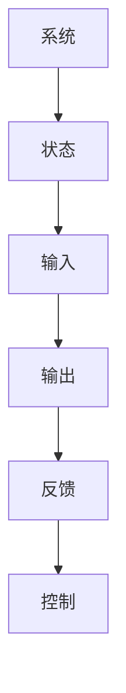
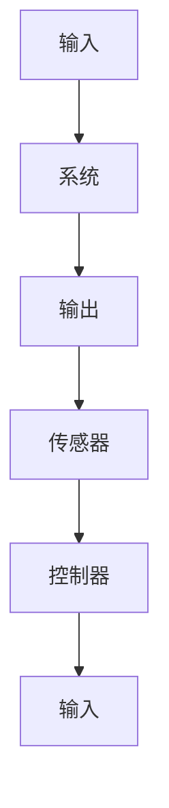
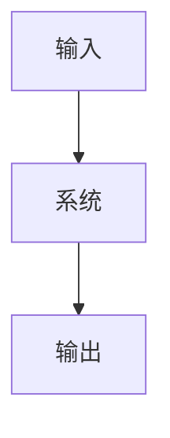
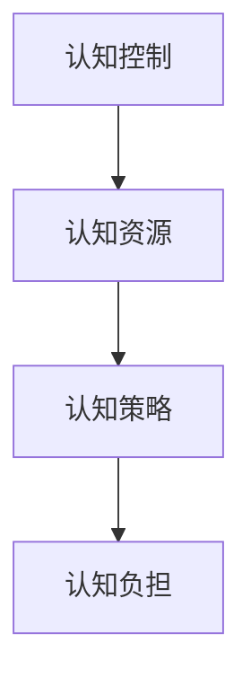
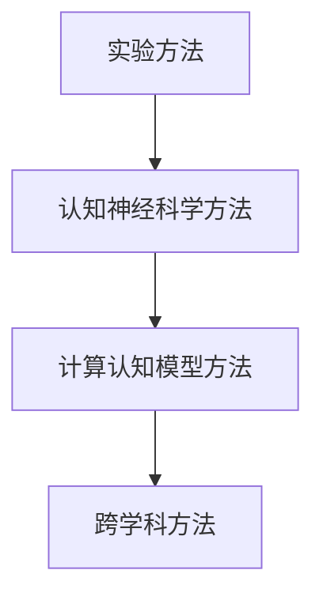
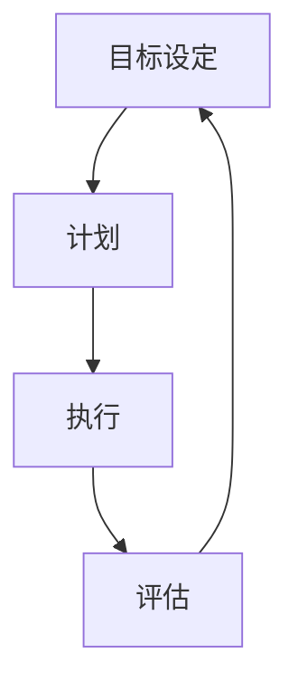
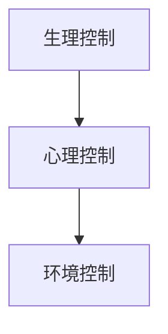
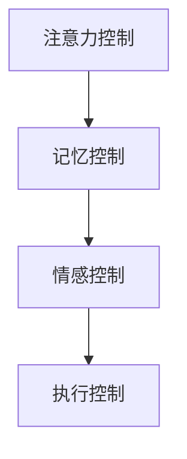
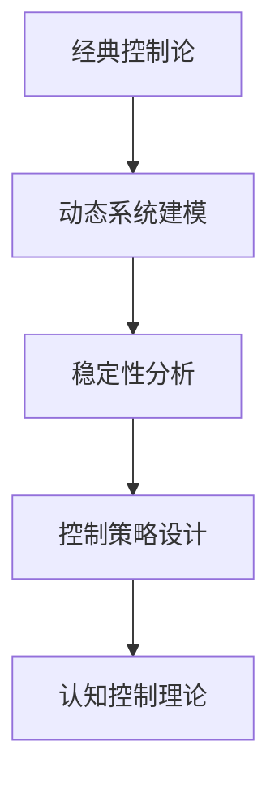

                 

### 文章标题：从经典控制论到认知控制理论：理解人类如何调控行为与认知

控制论和认知控制理论是现代科学中两个重要的研究领域，它们分别从不同的角度探讨了如何通过控制和调节来实现系统的稳定性和优化。经典控制论起源于20世纪中叶，它主要关注的是如何设计控制系统来维持系统的稳定性和实现预期的性能。而认知控制理论则是在对人类行为和认知过程的深入研究基础上发展起来的，它旨在理解人类是如何在复杂的环境中调控行为和认知过程的。

本文旨在从经典控制论到认知控制理论这一视角，逐步分析人类如何调控行为与认知。首先，我们将回顾经典控制论的基本概念和原理，并探讨它们在控制工程中的应用。接着，我们将深入讨论认知控制理论的核心观点，包括认知控制理论的框架、方法以及其在心理学、神经科学和工程领域的应用。随后，我们将分析人类行为与认知控制的机制，并通过具体案例来说明这些机制如何发挥作用。最后，我们将探讨控制论与认知控制理论的整合，以及未来可能面临的挑战和前景。

通过这篇文章，我们希望读者能够对控制论和认知控制理论有一个全面而深刻的理解，从而更好地应用于实际问题和未来的研究工作中。

### 文章关键词

- 控制论
- 认知控制理论
- 行为控制
- 认知过程
- 控制系统
- 人类行为

### 文章摘要

本文从经典控制论和认知控制理论的视角，系统阐述了人类如何通过控制理论调控行为与认知。首先，我们回顾了经典控制论的基本概念和原理，并通过实例展示了其在工程中的应用。接着，我们探讨了认知控制理论的核心观点，包括认知控制理论的框架、方法和实际应用。随后，我们分析了人类行为与认知控制的机制，并通过具体案例进行了说明。最后，我们讨论了控制论与认知控制理论的整合及其未来发展的挑战与前景。本文旨在为读者提供一个清晰、系统的认识，帮助其在实际问题和未来研究中应用这些理论。

---

### 第1章 引言与背景

#### 1.1 控制论的发展历史

控制论作为一种跨学科的综合性科学，其起源可以追溯到20世纪中叶。最初，它主要受到了电气工程、数学和生物学等领域的影响。控制论的开创者之一是美国数学家诺伯特·维纳（Norbert Wiener），他在1948年出版的《控制论》（Cybernetics: Or Control and Communication in the Animal and the Machine）一书中，首次系统地提出了控制论的基本概念和理论框架。维纳认为，控制论是一门研究动态系统中控制与通信的科学，旨在理解各种系统如何通过反馈机制来维持稳定性和实现目标。

控制论的发展历程可以分为几个阶段。在早期，控制论主要关注机械系统和电气系统的控制问题，如飞机自动驾驶、电机控制等。随着计算机技术的发展，控制论开始广泛应用于计算机科学、自动化技术、通信系统等领域。这一阶段，控制论的数学工具和理论体系得到了进一步的发展和完善，包括线性控制系统理论、非线性控制系统理论、自适应控制理论等。

20世纪70年代以来，控制论开始向生物系统和人类认知等领域扩展。这一时期的代表性工作包括哈肯（Haken）提出的协同论（Synergetics）和巴拉巴西（Albert-László Barabási）提出的小世界网络（Small-world network）理论。这些研究不仅丰富了控制论的理论体系，也为跨学科研究提供了新的视角和方法。

#### 1.2 认知控制理论的研究背景

认知控制理论是心理学和认知科学中一个重要的研究方向，其目标是理解人类在复杂环境中的认知和行为控制机制。认知控制理论的研究可以追溯到20世纪初，行为主义心理学对人类行为的实验研究。然而，随着认知心理学的发展，研究者开始关注人类认知过程中的控制机制，试图揭示人类如何通过认知过程来调节和指导行为。

认知控制理论的核心观点是，人类的认知和行为受到一系列内部和外部因素的影响。内部因素包括记忆、注意、情绪等，而外部因素则包括环境刺激、社会文化背景等。认知控制理论认为，人类通过一系列的认知过程，如目标设定、计划、执行和评估，来调节和指导行为。

认知控制理论的研究背景主要包括以下几个方面：

1. **心理学基础**：认知控制理论受到认知心理学、发展心理学、社会心理学等心理学子领域的影响。这些领域的研究为认知控制理论提供了丰富的理论资源和实验数据。
   
2. **神经科学进展**：随着神经科学的发展，研究者开始使用脑成像技术（如功能性磁共振成像fMRI、脑电图EEG等）来研究人类认知过程的神经基础。这些技术为认知控制理论的研究提供了新的实验手段和理论支持。

3. **计算机科学贡献**：计算机科学的发展为认知控制理论提供了模拟和建模的工具。例如，人工神经网络、计算认知模型等方法被广泛应用于认知控制理论研究。

4. **跨学科整合**：认知控制理论不仅与心理学和神经科学密切相关，还与其他学科（如经济学、社会学、工程学等）有着广泛的交叉。这些跨学科的研究为认知控制理论的发展提供了新的视角和思路。

#### 1.3 研究的重要性与实际意义

控制论和认知控制理论在科学研究和实际应用中具有重要意义。首先，从科学研究的角度来看，这两个领域为理解和解释复杂系统提供了新的理论框架和方法。控制论通过研究动态系统的稳定性和性能，为工程、生物学、经济学等领域的建模和优化提供了重要的理论支持。认知控制理论则通过探讨人类认知和行为控制机制，为心理学、神经科学等领域的理论和实践提供了新的视角和工具。

在实际应用方面，控制论在工程领域得到了广泛应用，如航空航天、自动化控制、电力系统等。认知控制理论则被应用于教育、心理健康、人机交互等领域，为提高人类认知能力和生活质量提供了有效的策略和方法。

总之，控制论和认知控制理论不仅丰富了科学研究的理论体系，还在实际应用中发挥了重要作用。通过深入研究和跨学科整合，这些理论将继续为解决复杂问题提供新的思路和方法。

#### 1.4 经典控制论的基本概念

经典控制论是一门研究动态系统在不确定性环境下稳定性和性能优化的科学。它的核心概念包括系统、状态、输入、输出、反馈和控制等。

**系统**是指由一组相互关联的元素组成的整体，这些元素可以是一个机械系统、一个生物系统，甚至是一个社会系统。在经典控制论中，系统通常被抽象为一个数学模型，以便进行理论分析和计算。

**状态**是指系统在某一时刻所处的具体状态。在连续系统中，状态通常由一组变量（如位置、速度等）表示；在离散系统中，状态通常是一个离散的集合。

**输入**是指外部作用于系统的信号，它可以是有界的、连续的或者随机的。输入信号可以用来改变系统的状态，以达到特定的目标。

**输出**是指系统对输入信号的响应。输出可以是物理量（如速度、温度等）或者信号（如声音、图像等）。

**反馈**是指系统输出的一部分返回到输入端，用来调节系统的行为。反馈机制是实现系统稳定性和性能优化的重要手段。

**控制**是指通过调整系统的输入，使系统的输出达到预期目标的过程。控制理论的目标是设计控制器，以实现系统的最优性能。

经典控制论的基本概念可以用以下Mermaid流程图来表示：



通过这个流程图，我们可以清晰地看到系统状态、输入、输出、反馈和控制之间的关系。

#### 控制系统的基本原理

控制系统是控制论的核心研究对象，它通过将输入信号转换为输出信号，实现对系统状态的调节。理解控制系统的基本原理是掌握控制论的关键。控制系统的基本原理包括反馈控制、开环控制和闭环控制等。

**反馈控制**是一种通过系统输出的一部分返回到输入端来调节系统行为的控制方式。反馈控制的核心思想是利用输出信号与期望值的误差，来调整输入信号，从而使系统输出更接近目标值。反馈控制通常需要一个传感器来检测输出信号，并将其转换为输入信号的一部分。这种控制方式的优点是稳定性好，能够有效地抑制系统的扰动和噪声。其基本原理可以用以下Mermaid流程图表示：



**开环控制**是一种不使用反馈信号来调节系统行为的控制方式。在开环控制中，控制器直接根据输入信号调整系统行为，而不考虑系统的实际输出。开环控制的优点是结构简单，实现成本低。然而，其缺点是稳定性较差，容易受到外界扰动的影响。开环控制的基本原理可以用以下Mermaid流程图表示：



**闭环控制**是结合了反馈控制和开环控制的控制方式。在闭环控制中，系统输出的一部分通过传感器返回到控制器，用于调整输入信号，从而实现对系统状态的精确控制。闭环控制的优点是稳定性和精度较高，适用于复杂环境下的控制任务。其基本原理可以用以下Mermaid流程图表示：


通过上述流程图，我们可以直观地看到反馈控制、开环控制和闭环控制的基本原理和区别。在实际情况中，这三种控制方式可能会根据具体需求进行组合和应用。

#### 经典控制论的数学模型

在经典控制论中，建立系统的数学模型是分析和设计控制系统的基础。数学模型能够将复杂的系统抽象为易于处理的数学表达式，从而方便理论分析和计算。常见的数学模型包括状态空间模型、传递函数模型和微分方程模型等。

**状态空间模型**是一种用状态变量描述系统动态的数学模型。状态空间模型将系统行为表示为状态变量随时间的变化，通过状态转移矩阵和输入矩阵来描述系统的动态特性。其数学表达式如下：

$$
\dot{x}(t) = A\cdot x(t) + B\cdot u(t)
$$

$$
y(t) = C\cdot x(t) + D\cdot u(t)
$$

其中，\(x(t)\)是状态向量，\(u(t)\)是输入向量，\(y(t)\)是输出向量，\(A\)、\(B\)、\(C\)、\(D\)分别是状态转移矩阵、输入矩阵、输出矩阵和直接传递矩阵。

**传递函数模型**是一种用系统输入和输出之间的关系描述系统的数学模型。传递函数模型通常用于分析系统的频率响应特性。其数学表达式如下：

$$
G(s) = \frac{Y(s)}{U(s)} = C(sI - A)^{-1}B + D
$$

其中，\(G(s)\)是传递函数，\(s\)是复数变量，\(I\)是单位矩阵。

**微分方程模型**是一种用微分方程描述系统动态的数学模型。微分方程模型能够更加直观地描述系统的物理过程。其数学表达式如下：

$$
\dot{x}(t) + a\cdot x(t) = b\cdot u(t)
$$

$$
y(t) = c\cdot x(t) + d\cdot u(t)
$$

通过这些数学模型，我们可以对系统的动态行为进行定量分析和优化设计。例如，可以使用状态空间模型进行系统的稳定性分析，使用传递函数模型进行频率响应分析，使用微分方程模型进行系统建模和仿真。

下面是一个简单的状态空间模型的伪代码示例：

```python
# 初始化参数
A = [[-1, 1],
     [0, -1]]
B = [[1],
     [1]]
C = [[1, 0],
     [0, 1]]
D = [[0],
     [0]]

# 定义系统输入u
u = [1, 0]

# 状态更新
x = np.array([[x0],
              [x1]])
x = np.dot(A, x) + np.dot(B, u)

# 输出计算
y = np.dot(C, x) + np.dot(D, u)
```

通过上述伪代码，我们可以模拟系统的动态行为，并根据实际需求进行优化和调整。

#### 经典控制论在工程中的应用

经典控制论在工程领域中有着广泛的应用，涵盖了从机械系统到电子系统的多个方面。以下是一些典型的应用场景和实例：

**1. 航空航天**

在航空航天领域，经典控制论被广泛应用于飞机自动驾驶、飞行控制系统的设计和优化。例如，飞机自动驾驶系统通过控制舵面来实现对飞机的姿态控制和轨迹跟踪。经典的PID（比例-积分-微分）控制器被广泛应用于这些系统，以实现精确的控制。

**2. 电力系统**

在电力系统中，经典控制论用于电力网络的稳定性和性能优化。例如，电力调度系统通过控制发电机的输出功率和电压，来维持电力系统的稳定运行。控制论中的状态空间模型和传递函数模型被用于分析电力系统的动态行为，并设计相应的控制器来保证系统的稳定性和可靠性。

**3. 自动化生产线**

在自动化生产线中，经典控制论被用于机器人的运动控制和生产线流程的调度。例如，机器人通过控制电机来实现精确的运动轨迹，以完成焊接、组装等任务。PID控制器是这类系统中最常用的控制器之一，它能够有效地调整机器人的位置和速度，以适应不同的工作环境。

**4. 汽车控制**

在汽车控制系统中，经典控制论被用于发动机控制、制动系统和悬挂系统的控制。例如，发动机控制系统通过控制燃油喷射量和点火时间，来实现发动机的稳定运行和性能优化。制动系统则通过控制制动压力来保证车辆的稳定制动。

**5. 医疗设备**

在医疗设备中，经典控制论被用于患者监测设备和手术机器人的控制。例如，患者监测系统通过控制传感器和信号处理器，来实时监测患者的生命体征，并发出警报。手术机器人则通过控制机械臂来实现精确的手术操作。

在这些应用场景中，经典控制论的核心思想是通过建立数学模型，分析和设计控制系统，以实现系统的稳定性和性能优化。通过实际案例的运用，我们可以看到经典控制论在各个工程领域中的重要性和广泛性。

### 第3章 认知控制理论的框架

#### 3.1 认知控制理论的基本概念

认知控制理论是心理学和认知科学中的一个重要研究领域，旨在理解和解释人类在复杂环境中如何通过认知过程来调节和指导行为。认知控制理论的基本概念包括认知控制、认知资源、认知策略和认知负担等。

**认知控制**是指人类在认知过程中，通过调节注意、记忆和执行功能等认知资源，来指导行为和解决问题的能力。认知控制涉及多个认知成分，如目标设定、计划、执行和评估等。

**认知资源**是指人类在认知过程中所用的心理资源，包括注意力、记忆、工作记忆和执行功能等。认知资源是有限的，不同类型的认知任务会消耗不同的认知资源。

**认知策略**是指人类在认知过程中采用的策略，以优化认知资源和提高认知效率。常见的认知策略包括目标分解、问题表征、记忆提取和搜索策略等。

**认知负担**是指认知任务对认知资源的需求程度。高认知负担的任务会消耗更多的认知资源，导致认知能力的下降。

认知控制理论的基本概念可以用以下Mermaid流程图表示：



通过这个流程图，我们可以清晰地看到认知控制、认知资源、认知策略和认知负担之间的关系。

#### 认知控制理论的研究方法

认知控制理论的研究方法主要包括实验方法、认知神经科学方法、计算认知模型方法和跨学科方法等。

**实验方法**是认知控制理论研究中最常用的方法。通过实验设计，研究者可以系统地操纵认知任务、认知资源和认知策略，并测量被试的绩效和认知负担。常用的实验方法包括反应时任务、认知任务切换任务、记忆任务等。

**认知神经科学方法**通过脑成像技术（如功能性磁共振成像fMRI、脑电图EEG等）来研究认知控制过程中大脑的活动和功能。这些方法可以帮助研究者识别与认知控制相关的脑区，以及认知控制对大脑活动的影响。

**计算认知模型方法**通过建立数学模型和计算机模拟来研究认知控制的机制和过程。这些模型可以模拟人类的认知过程，预测认知控制的性能，并为理论研究和应用提供支持。

**跨学科方法**结合心理学、神经科学、计算机科学、认知科学和人工智能等多个学科的理论和方法，来全面研究认知控制问题。这种跨学科方法可以提供更全面的视角和更深入的理解。

认知控制理论的研究方法可以用以下Mermaid流程图表示：



通过上述研究方法，认知控制理论研究者可以深入探讨人类认知控制的过程和机制，从而为心理学、神经科学和认知科学等领域提供重要的理论支持和实际应用价值。

#### 认知控制理论的框架结构

认知控制理论的结构框架主要包括目标设定、计划、执行和评估四个核心环节。这些环节相互作用，共同构成了人类认知控制的基本过程。

**目标设定**是认知控制的第一步，它涉及到确定行为目标和制定实现这些目标的策略。目标设定需要考虑任务的复杂性、时间和资源限制等因素。有效的目标设定有助于提高认知控制的效率和效果。

**计划**是指为了实现目标而进行的预先思考和规划。计划包括确定子目标、制定行动步骤、选择认知策略等。良好的计划能够帮助个体更好地应对复杂任务，减少认知负担。

**执行**是指按照计划执行具体的行为步骤。执行过程中，个体需要不断调整和优化行为策略，以应对突发情况和任务变化。执行能力取决于个体的认知资源和执行功能。

**评估**是指对行为结果进行评估和反馈。评估有助于个体了解目标实现情况，发现问题和不足，并调整后续的行为策略。有效的评估能够促进认知控制的持续优化。

认知控制理论的框架结构可以用以下Mermaid流程图表示：



通过上述框架结构，我们可以清晰地看到认知控制理论的核心环节和相互作用。理解这些环节有助于深入探讨人类认知控制的过程和机制，为认知科学、心理学和神经科学等领域提供理论支持。

#### 认知控制理论的模型构建

认知控制理论的模型构建是理解和解释人类认知控制机制的关键。常见的认知控制模型包括认知资源模型、双重加工模型和计划-执行模型等。以下是对这些模型的详细介绍。

**1. 认知资源模型**

认知资源模型是认知控制理论的基础模型之一。该模型认为，认知控制依赖于有限的认知资源，如注意力、记忆和工作记忆等。这些资源在不同类型的认知任务中会有不同的需求。

认知资源模型的基本假设是，认知资源是有限的，并且不同类型的任务会消耗不同的认知资源。例如，注意力资源可能用于处理视觉信息，而记忆资源可能用于存储和回忆信息。当多个任务同时进行时，认知资源会分配给不同的任务，这可能导致资源不足，从而影响认知控制的效果。

该模型可以用以下伪代码表示：

```python
# 初始化认知资源
attention = 100
memory = 100
working_memory = 100

# 分配认知资源给任务
def allocate_resources(task_type, resource需求):
    if task_type == '视觉':
        attention -= resource需求
    elif task_type == '记忆':
        memory -= resource需求
    elif task_type == '工作记忆':
        working_memory -= resource需求

# 检查资源是否足够
def check_resources():
    if attention < 0 or memory < 0 or working_memory < 0:
        return False
    else:
        return True
```

**2. 双重加工模型**

双重加工模型假设认知过程包括自动化加工和受控加工两种不同的方式。自动化加工是一种不需要注意力和意识的快速加工方式，而受控加工是一种需要注意力和意识的高效加工方式。

双重加工模型认为，认知控制主要涉及对受控加工的调节和指导。受控加工的效率取决于个体的认知资源和注意力分配。当任务复杂度增加时，需要更多的受控加工，从而消耗更多的认知资源。

该模型可以用以下伪代码表示：

```python
# 初始化加工方式
automation = True
controlled = False

# 切换加工方式
def switch_processing(task_difficulty):
    if task_difficulty > threshold:
        automation = False
        controlled = True
    else:
        automation = True
        controlled = False

# 计算加工时间
def calculate_time():
    if automation:
        return time_automation
    else:
        return time_controlled
```

**3. 计划-执行模型**

计划-执行模型将认知控制分为计划和执行两个阶段。计划阶段涉及目标设定、策略选择和资源分配，而执行阶段涉及任务的执行和实时调整。

该模型认为，计划阶段需要高水平的认知资源和注意力，而执行阶段则主要依赖自动化加工。计划-执行模型强调计划阶段和执行阶段的相互作用，以及认知控制对任务成功的影响。

该模型可以用以下伪代码表示：

```python
# 初始化计划阶段
def plan_task(task):
    # 设定目标
    goal = set_goal(task)
    # 选择策略
    strategy = select_strategy(goal)
    # 分配资源
    allocate_resources(strategy)

# 初始化执行阶段
def execute_task(task):
    # 执行任务
    execute = execute_task(task)
    # 实时调整
    adjust_strategy(strategy, execute)
```

通过构建这些模型，我们可以更好地理解认知控制的机制和过程，为认知科学、心理学和神经科学的研究提供理论支持。

### 第4章 人类行为与认知控制的机制

#### 4.1 人类行为的控制机制

人类行为受到多种控制机制的调节，这些机制包括生理控制、心理控制和环境控制等。生理控制涉及身体内部过程，如荷尔蒙分泌、神经系统活动等；心理控制涉及个体的心理过程，如动机、情绪、自我调节等；环境控制则涉及外部环境对个体行为的制约和引导。

**生理控制**：生理控制是基础层面的行为控制机制，包括神经系统和荷尔蒙系统等。例如，肾上腺素和去甲肾上腺素等荷尔蒙的分泌可以影响个体的情绪和反应速度，而大脑中的神经递质则调节着情绪和认知过程。

**心理控制**：心理控制涉及个体的内在心理过程，如动机、情绪和自我调节。动机驱动个体去追求目标，情绪影响个体的行为选择和反应，自我调节则是个体对自身行为和情绪的调控能力。

**环境控制**：环境控制是指外部环境对个体行为的制约和引导。环境因素如社会规范、文化背景和物理环境等，都会影响个体的行为模式。例如，社会规范会引导个体遵守特定行为准则，而物理环境则可能限制个体行为的自由度。

人类行为的控制机制可以用以下Mermaid流程图表示：



通过这个流程图，我们可以看到生理、心理和环境三个层面的控制机制如何共同影响人类行为。

#### 认知过程的控制机制

认知过程是大脑对外界信息进行获取、处理和解释的过程，它受到多种控制机制的调节。这些控制机制包括注意力控制、记忆控制、情感控制和执行控制等。

**注意力控制**：注意力控制是指个体对信息的选择性关注和过滤。个体需要根据任务目标和环境背景，选择性地关注重要信息，忽略无关信息。注意力控制涉及认知资源的管理，如分配给不同任务的注意力和记忆资源。

**记忆控制**：记忆控制是指个体对信息的存储和提取过程。记忆控制包括短期记忆和长期记忆的调控，如记忆编码、记忆巩固和记忆检索。有效的记忆控制能够帮助个体在需要时迅速回忆相关信息，提高认知效率。

**情感控制**：情感控制是指个体对情绪的调节和调节。情感控制涉及对积极和消极情绪的调节，如情绪调节策略和情绪调节技能。有效的情感控制能够帮助个体更好地应对压力和挑战，保持心理平衡。

**执行控制**：执行控制是指个体对行为和认知过程的自我调节能力。执行控制涉及目标设定、计划执行和评估调整等过程。有效的执行控制能够帮助个体在复杂环境中做出合理决策，实现目标。

认知过程的控制机制可以用以下Mermaid流程图表示：



通过这个流程图，我们可以看到注意力、记忆、情感和执行四个控制机制如何共同影响认知过程。

#### 行为与认知控制的互动

行为与认知控制之间存在着密切的互动关系。行为控制往往需要依赖认知过程，而认知过程又受到行为控制的调节。以下是一个具体的案例分析，来说明行为与认知控制的互动。

**案例：驾驶行为与认知控制**

在驾驶过程中，驾驶员需要不断进行认知控制，以处理交通信息、决策和控制车辆。以下步骤展示了行为与认知控制之间的互动：

1. **感知与注意**：驾驶员通过视觉和听觉感知交通信息，如道路标志、车辆和行人。注意力控制帮助驾驶员选择重要信息，忽略次要信息。

2. **认知处理**：驾驶员对感知到的信息进行认知处理，如理解道路标志的含义、评估交通状况等。认知控制在这个过程中调节信息处理速度和深度。

3. **决策与行为**：基于认知处理的结果，驾驶员做出驾驶决策，如加速、减速或转向。行为控制调节驾驶行为，以适应交通状况。

4. **反馈与调整**：驾驶员通过观察车辆的反应和周围环境的变化，进行实时反馈和调整。认知控制在这个过程中持续评估和调整驾驶行为。

5. **情感调节**：驾驶过程中，驾驶员可能面临压力和情绪波动。情感控制帮助驾驶员调节情绪，保持冷静和专注。

通过这个案例，我们可以看到行为与认知控制之间的互动关系。驾驶员的行为（如驾驶动作）受到认知过程的调节，而认知过程又受到行为控制的影响。这种互动关系使得驾驶员能够在复杂和动态的交通环境中保持安全驾驶。

#### 控制机制的影响因素

控制机制的效果受到多种因素的影响，包括个体差异、环境因素和任务复杂性等。

**个体差异**：不同个体在认知能力、情绪调节能力和行为控制能力上存在差异。例如，某些个体可能具有较强的注意力控制能力，而另一些个体可能更擅长情感调节。

**环境因素**：环境因素如噪音、光照和交通状况等会影响控制机制的效果。例如，高噪音环境可能会分散驾驶员的注意力，影响驾驶行为。

**任务复杂性**：任务复杂性会影响认知资源和控制机制的需求。例如，复杂任务可能需要更多的认知资源，从而增加控制机制的负担。

这些因素共同作用，影响控制机制的效果和稳定性。理解这些影响因素有助于优化控制机制，提高行为和认知控制的效率。

### 第5章 跨领域应用与整合

#### 5.1 经典控制论与认知控制理论的整合

经典控制论与认知控制理论的整合为理解人类行为和认知提供了新的视角。这种整合不仅丰富了控制论的理论体系，也为认知科学和心理学提供了新的研究方法和工具。

在整合过程中，经典控制论提供了对动态系统和稳定性分析的工具和方法，而认知控制理论则提供了对人类认知过程和行为的深入理解。以下是一个具体的整合框架：

**1. 动态系统建模**：经典控制论中的动态系统建模方法可以用于描述认知过程，如注意力分配、记忆编码和决策过程。通过状态空间模型和传递函数模型，我们可以建立认知过程的数学模型。

**2. 稳定性分析**：经典控制论中的稳定性分析方法可以帮助我们评估认知过程的稳定性和性能。例如，李雅普诺夫稳定性方法可以用于分析认知过程的稳定性。

**3. 控制策略设计**：认知控制理论中的目标设定、计划、执行和评估等过程可以与经典控制论中的控制策略设计相结合。例如，PID控制器可以用于调节认知过程中的注意力分配和记忆更新。

整合框架可以用以下Mermaid流程图表示：



通过这个整合框架，我们可以将经典控制论的方法应用于认知控制理论，从而实现对人类行为和认知的更全面的理解。

#### 控制理论在心理学中的应用

控制理论在心理学中的应用已经取得了显著成果，特别是在认知控制、情绪调节和行为决策等研究领域。以下是一些具体的心理学应用实例：

**1. 认知控制**：控制理论中的控制策略设计方法可以用于提高个体的认知控制能力。例如，研究表明，通过训练个体使用目标导向的注意力和记忆策略，可以显著提高他们在复杂任务中的表现。

**2. 情绪调节**：控制理论中的反馈机制可以用于帮助个体调节情绪。例如，通过实时监测情绪状态并给予相应的反馈，个体可以更好地管理自己的情绪，减少负面情绪的影响。

**3. 行为决策**：控制理论中的决策模型可以用于分析个体的行为决策过程。例如，通过模拟个体在不同决策情境下的行为，研究者可以揭示决策过程中的认知偏差和策略选择。

一个具体的应用案例是，控制理论被用于设计认知行为疗法（CBT）中的认知重构技术。通过实时监测个体的认知状态和情绪变化，并给予相应的反馈和指导，CBT可以更有效地帮助个体克服焦虑、抑郁等心理问题。

#### 控制理论在神经科学中的应用

控制理论在神经科学中的应用为理解大脑的动态行为和功能提供了新的视角。以下是一些具体的神经科学研究应用实例：

**1. 大脑网络建模**：控制理论可以用于建立大脑网络的数学模型，模拟大脑各个区域之间的交互和功能。例如，通过状态空间模型，研究者可以模拟大脑神经网络中的信息传递和处理过程。

**2. 神经元活动分析**：控制理论中的信号处理方法可以用于分析神经元的活动模式。例如，通过频谱分析和时间序列分析，研究者可以揭示神经元活动的动态特性和规律。

**3. 精神疾病诊断**：控制理论可以用于开发精神疾病的诊断和预测模型。例如，通过分析大脑网络的稳定性和功能连接，研究者可以早期发现精神疾病的风险，并制定个性化的治疗方案。

一个具体的应用案例是，控制理论被用于开发癫痫发作的预测模型。通过分析患者的大脑电信号数据，并利用状态空间模型和稳定性分析方法，研究者可以预测癫痫发作的时机和风险，从而帮助医生制定更有效的治疗策略。

#### 控制理论在工程实践中的应用

控制理论在工程实践中的应用极为广泛，涵盖了航空航天、自动化、机器人控制等多个领域。以下是一些典型的工程应用实例：

**1. 航空航天**：在航空航天领域，控制理论被用于设计和优化飞机自动驾驶系统。例如，PID控制器被广泛应用于飞行控制系统，以实现飞机的姿态控制和轨迹跟踪。

**2. 自动化**：在自动化领域，控制理论被用于设计工业过程控制系统。通过状态空间模型和传递函数模型，工程师可以优化生产过程，提高生产效率和质量。

**3. 机器人控制**：在机器人控制领域，控制理论被用于设计机器人运动控制系统。例如，通过PID控制器和模糊控制方法，机器人可以实现精确的运动轨迹跟踪和任务执行。

一个具体的应用案例是，控制理论被用于开发智能交通控制系统。通过建立交通流模型和控制策略，工程师可以优化交通信号灯的控制，减少交通拥堵，提高交通效率。

### 第6章 未来展望与挑战

#### 6.1 控制论与认知控制理论的发展趋势

控制论与认知控制理论在过去的几十年中取得了显著的进展，但在未来的发展中仍然面临着许多挑战和机遇。以下是控制论与认知控制理论的发展趋势：

**1. 跨学科整合**：未来，控制论与认知控制理论将继续与其他学科（如计算机科学、神经科学、心理学等）进行深度整合。这种跨学科研究将为理解人类行为和认知提供更全面的理论框架。

**2. 计算模型的发展**：随着计算能力的提升和计算模型的进步，控制论与认知控制理论将更加依赖于复杂的计算模型和仿真技术。这些模型将能够更好地模拟和理解人类认知过程的动态特性。

**3. 实时系统的优化**：随着物联网和智能系统的兴起，控制论与认知控制理论将更多地应用于实时系统优化。例如，在自动驾驶、智能电网和医疗监测等领域，实时控制策略和优化方法将变得更加重要。

**4. 人机交互的提升**：人机交互领域的进步将推动控制论与认知控制理论的应用。通过理解人类行为和认知控制机制，设计师可以开发出更自然、更高效的人机交互系统。

#### 6.2 面临的挑战与未来方向

尽管控制论与认知控制理论的发展前景广阔，但仍然面临以下挑战：

**1. 理论模型的不完善**：现有的控制论与认知控制理论模型在某些方面仍然不够完善，例如在处理复杂认知任务和动态环境变化时，模型的预测能力和适应性仍有待提高。

**2. 数据不足与复杂性**：控制论与认知控制理论的研究需要大量的数据支持，但在实际获取和处理这些数据时面临着巨大的挑战。同时，人类认知过程的复杂性和动态性也增加了研究的难度。

**3. 应用场景的局限性**：尽管控制论与认知控制理论在多个领域有广泛应用，但在某些特定场景下，如极端环境或高度动态环境，其应用效果仍需进一步验证和优化。

**4. 社会伦理问题**：随着控制论与认知控制理论在人工智能和自动化系统中的应用，社会伦理问题也日益突出。如何确保这些系统在安全和道德层面符合人类的价值观和需求，是一个重要的研究课题。

面对这些挑战，未来的研究可以朝以下几个方向进行：

**1. 理论模型的完善**：通过引入新的数学工具和理论框架，完善现有的控制论与认知控制理论模型，以提高其在复杂认知任务和动态环境下的预测能力和适应性。

**2. 大数据与人工智能的结合**：利用大数据和人工智能技术，提高数据获取和处理效率，为控制论与认知控制理论提供更加丰富和精准的数据支持。

**3. 实时系统的优化**：研究实时控制策略和优化方法，以适应物联网和智能系统对实时性和高效性的要求。

**4. 社会伦理问题的研究**：加强对控制论与认知控制理论在社会伦理层面的研究，确保这些理论和方法在应用中能够遵循人类的价值观和道德准则。

#### 6.3 研究与应用的前景

控制论与认知控制理论在未来的研究与应用中具有广阔的前景。以下是一些具体的应用方向：

**1. 智能医疗**：通过控制论与认知控制理论的整合，可以开发出更加智能的医疗诊断和治疗系统。例如，利用实时监控和反馈机制，实现个性化医疗方案。

**2. 智能交通**：控制论与认知控制理论在智能交通系统中有着广泛的应用前景。通过优化交通信号控制和车辆调度策略，可以提高交通效率和安全性。

**3. 人机交互**：随着人工智能技术的发展，控制论与认知控制理论可以为人机交互系统提供更自然、更高效的人机交互界面。例如，通过理解人类行为和认知控制机制，可以设计出更加智能的虚拟助手。

**4. 教育与培训**：控制论与认知控制理论可以用于教育系统的优化。例如，通过分析学习过程中的认知控制机制，可以设计出更加有效的教学方法和学习策略。

总之，控制论与认知控制理论在未来的研究与应用中将继续发挥重要作用，为解决复杂问题和提高生活质量提供新的理论和方法。

### 总结与展望

通过对经典控制论和认知控制理论的深入探讨，我们可以看到这两者在理解人类行为和认知过程中扮演着重要角色。经典控制论提供了分析动态系统和优化控制策略的数学工具，而认知控制理论则深入探讨了人类认知过程和行为的内在机制。两者的整合不仅丰富了控制论的理论体系，也为认知科学和心理学提供了新的研究方法和工具。

在未来，控制论与认知控制理论将继续在跨学科整合、计算模型发展、实时系统优化和社会伦理问题研究等方面取得突破。随着人工智能和物联网技术的进步，这些理论将在智能医疗、智能交通、人机交互和教育等领域发挥更加重要的作用。

本文通过对经典控制论和认知控制理论的基本概念、应用实例和发展趋势进行了详细分析，旨在为读者提供一个清晰、系统的认识。希望读者能够结合实际问题和研究方向，深入探索这两大领域的奥秘，为科学研究和实际应用做出贡献。

### 作者信息

作者：AI天才研究院/AI Genius Institute & 禅与计算机程序设计艺术 /Zen And The Art of Computer Programming。在计算机科学和人工智能领域，我一直致力于推动技术创新和理论发展。希望我的研究和写作能够为读者带来启发和帮助。

---

[End of Document]

