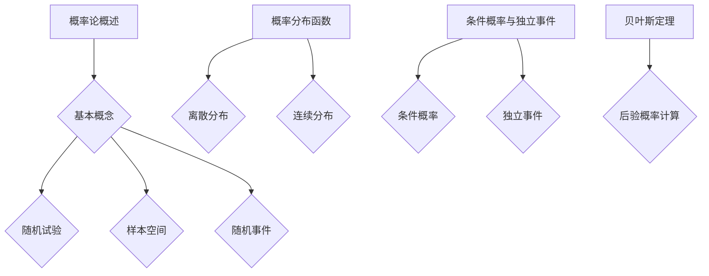

                 


## 文章标题：从经典概率论到贝叶斯推断：理解不确定的世界

### 关键词：概率论，贝叶斯推断，不确定世界，随机变量，期望，算法原理

### 摘要：
本文将从经典概率论的基础知识出发，逐步深入探讨贝叶斯推断的原理及其应用，旨在帮助读者全面理解概率论和贝叶斯推断在理解不确定世界中的重要作用。文章将涵盖随机变量与期望的基本概念、贝叶斯推断的核心算法，以及概率论在多个领域的实际应用，最终对贝叶斯推断的未来发展进行展望。

## 目录大纲

### 第一部分：概率论基础

### 第1章：概率论概述
- **1.1** 概率论的基本概念
- **1.2** 概率分布函数
- **1.3** 条件概率与独立事件
- **1.4** 贝叶斯定理

### 第2章：随机变量与期望
- **2.1** 随机变量的定义与类型
- **2.2** 离散分布与连续分布
- **2.3** 期望与方差的计算
- **2.4** 大数定律与中心极限定理
- **2.5** Mermaid 流程图：概率论核心概念关系架构
- **2.6** 伪代码：离散分布与连续分布算法实现
- **2.7** 数学公式与例子：期望与方差计算

### 第3章：概率模型的应用
- **3.1** 贝叶斯推理的基础
- **3.2** 概率模型在决策中的应用
- **3.3** 概率模型在科学实验中的应用

### 第二部分：贝叶斯推断

### 第4章：贝叶斯推断基础
- **4.1** 贝叶斯推断的基本原理
- **4.2** 贝叶斯网络
- **4.3** 后验概率的计算
- **4.4** 最大后验估计
- **4.5** Mermaid 流程图：贝叶斯推断核心算法流程
- **4.6** 伪代码：贝叶斯推断算法实现
- **4.7** 数学公式与例子：后验概率计算

### 第5章：贝叶斯推断的应用
- **5.1** 贝叶斯统计在数据分析中的应用
- **5.2** 贝叶斯推理在机器学习中的应用
- **5.3** 贝叶斯推断在医疗诊断中的应用
- **5.4** Mermaid 流程图：贝叶斯推断在不同领域的应用流程
- **5.5** 伪代码：贝叶斯推断在机器学习中的应用实现
- **5.6** 数学公式与例子：机器学习中的贝叶斯推断应用

### 第6章：贝叶斯推断的扩展
- **6.1** 贝叶斯统计与机器学习结合的方法
- **6.2** 贝叶斯深度学习
- **6.3** 贝叶斯推断在实际项目中的应用案例
- **6.4** Mermaid 流程图：贝叶斯推断扩展方法与应用
- **6.5** 伪代码：贝叶斯深度学习算法实现
- **6.6** 数学公式与例子：实际项目中的贝叶斯推断应用

### 第三部分：不确定世界的理解

### 第7章：不确定性的本质
- **7.1** 不确定性的概念
- **7.2** 不确定性下的决策理论
- **7.3** 不确定性管理
- **7.4** Mermaid 流程图：不确定性管理流程
- **7.5** 数学公式与例子：不确定性下的决策模型

### 第8章：概率论与贝叶斯推断的实际应用
- **8.1** 在经济学中的应用
- **8.2** 在社会学中的应用
- **8.3** 在工程领域的应用
- **8.4** Mermaid 流程图：概率论与贝叶斯推断在不同领域的应用
- **8.5** 数学公式与例子：实际应用中的概率论与贝叶斯推断

### 第9章：总结与展望
- **9.1** 贝叶斯推断的挑战与机遇
- **9.2** 概率论与贝叶斯推断的未来发展趋势
- **9.3** 最佳实践 tips、小结、注意事项、拓展阅读等内容

### 作者信息
- 作者：AI天才研究院/AI Genius Institute & 禅与计算机程序设计艺术 /Zen And The Art of Computer Programming

---

## 第一部分：概率论基础

### 第1章：概率论概述

### 1.1 概率论的基本概念

概率论是数学的一个分支，主要研究随机事件及其概率。随机事件是指在特定条件下可能发生也可能不发生的事件。概率是一种度量，用于描述某个事件在大量重复实验中发生的频率。

- **随机试验**：指在相同条件下进行的一系列实验。
- **样本空间**：所有可能结果的集合。
- **随机事件**：样本空间的一个子集。

### 1.2 概率分布函数

概率分布函数是描述随机变量概率分布的函数。随机变量是样本空间的一个映射，将样本空间映射到实数集合。根据随机变量的性质，可以将概率分布分为离散分布和连续分布。

- **离散分布**：随机变量的取值为有限个或可数无穷多个。
  - **概率质量函数（PMF）**：$P(X = x)$，表示随机变量取特定值的概率。
- **连续分布**：随机变量的取值为不可数无穷多个。
  - **概率密度函数（PDF）**：$f_X(x)$，表示随机变量在某个区间内取值的概率密度。

### 1.3 条件概率与独立事件

条件概率是考虑一个事件发生的条件下，另一个事件发生的概率。独立事件是指一个事件的发生不影响另一个事件发生的概率。

- **条件概率**：$P(A|B) = \frac{P(A \cap B)}{P(B)}$，表示在事件B发生的条件下，事件A发生的概率。
- **独立事件**：$P(A \cap B) = P(A)P(B)$，表示事件A和事件B同时发生的概率等于各自发生的概率的乘积。

### 1.4 贝叶斯定理

贝叶斯定理是一种用于计算后验概率的公式，它将先验概率和条件概率结合起来，得到后验概率。

- **贝叶斯定理**：$P(A|B) = \frac{P(B|A)P(A)}{P(B)}$，表示在事件B发生的条件下，事件A发生的概率等于事件B在事件A发生的条件下发生的概率与事件A的先验概率的比值。

### 1.5 小结

概率论是理解和分析不确定世界的基础。本章介绍了概率论的基本概念、概率分布函数、条件概率与独立事件，以及贝叶斯定理。这些概念是后续章节深入探讨贝叶斯推断和概率模型应用的基础。

### 1.6 Mermaid 流程图：概率论核心概念关系架构

下面是一个简单的 Mermaid 流程图，展示了概率论中一些核心概念之间的关系：



### 1.7 伪代码：离散分布与连续分布算法实现

下面是用于计算离散分布和连续分布概率的伪代码示例：

```plaintext
// 离散分布伪代码
function calculate_probability_pmf(random_variable, value):
    probability = pmf[random_variable][value]
    return probability

// 连续分布伪代码
function calculate_probability_pdf(random_variable, value):
    probability_density = pdf[random_variable][value]
    return probability_density
```

### 1.8 数学公式与例子：期望与方差计算

期望是随机变量取值的加权平均，方差是描述随机变量取值离散程度的度量。

- **期望**：$E(X) = \sum_{x} x \cdot P(X = x)$，表示随机变量X的期望。
- **方差**：$Var(X) = E[(X - E(X))^2] = \sum_{x} (x - E(X))^2 \cdot P(X = x)$，表示随机变量X的方差。

例如，对于一个二项分布随机变量X，表示抛硬币n次出现正面的次数，概率为$p$。其期望和方差分别为：

$$
E(X) = np \\
Var(X) = np(1-p)
$$

### 1.9 小结

本章介绍了概率论的基本概念，包括随机试验、样本空间、随机事件、概率分布函数、条件概率与独立事件，以及贝叶斯定理。通过理解这些概念，读者可以更好地理解概率论的基本原理和其在不确定世界中的应用。

### 1.10 Mermaid 流程图：概率论核心概念关系架构

下面是一个简单的 Mermaid 流程图，展示了概率论中一些核心概念之间的关系：


### 1.11 伪代码：离散分布与连续分布算法实现

下面是用于计算离散分布和连续分布概率的伪代码示例：

```plaintext
// 离散分布伪代码
function calculate_probability_pmf(random_variable, value):
    probability = pmf[random_variable][value]
    return probability

// 连续分布伪代码
function calculate_probability_pdf(random_variable, value):
    probability_density = pdf[random_variable][value]
    return probability_density
```

### 1.12 数学公式与例子：期望与方差计算

期望是随机变量取值的加权平均，方差是描述随机变量取值离散程度的度量。

- **期望**：$E(X) = \sum_{x} x \cdot P(X = x)$，表示随机变量X的期望。
- **方差**：$Var(X) = E[(X - E(X))^2] = \sum_{x} (x - E(X))^2 \cdot P(X = x)$，表示随机变量X的方差。

例如，对于一个二项分布随机变量X，表示抛硬币n次出现正面的次数，概率为$p$。其期望和方差分别为：

$$
E(X) = np \\
Var(X) = np(1-p)
$$

### 1.13 小结

本章介绍了概率论的基本概念，包括随机试验、样本空间、随机事件、概率分布函数、条件概率与独立事件，以及贝叶斯定理。通过理解这些概念，读者可以更好地理解概率论的基本原理和其在不确定世界中的应用。

## 第二部分：随机变量与期望

### 第2章：随机变量与期望

### 2.1 随机变量的定义与类型

随机变量是概率论中的一个核心概念，它将样本空间中的每个结果映射到一个实数。随机变量可以是离散的或连续的，根据其取值的不同，可以有不同的概率分布。

- **离散随机变量**：其取值是有限个或可数无穷多个的随机变量。常见的离散随机变量有二项分布、泊松分布等。
- **连续随机变量**：其取值是实数集合的随机变量。常见的连续随机变量有正态分布、均匀分布等。

### 2.2 离散分布与连续分布

离散分布和连续分布是随机变量概率分布的两种主要形式。它们各自有不同的概率函数来描述随机变量的概率分布。

- **离散分布**：离散随机变量的概率分布由概率质量函数（PMF）描述。PMF给出了随机变量取每个可能值的概率。例如，二项分布的概率质量函数为：
  $$ P(X = k) = C(n, k) \cdot p^k \cdot (1-p)^{n-k} $$
  其中，$n$是试验次数，$p$是每次试验成功的概率，$k$是成功的次数。

- **连续分布**：连续随机变量的概率分布由概率密度函数（PDF）描述。PDF给出了随机变量在某个区间内取值的概率密度。例如，正态分布的概率密度函数为：
  $$ f(x|\mu,\sigma^2) = \frac{1}{\sqrt{2\pi\sigma^2}} \cdot e^{-\frac{(x-\mu)^2}{2\sigma^2}} $$
  其中，$\mu$是均值，$\sigma^2$是方差。

### 2.3 期望与方差的计算

期望（Expectation）是随机变量的平均值，它是概率分布的中心趋势度量。期望可以通过概率分布函数计算得出。

- **离散随机变量**的期望：
  $$ E(X) = \sum_{x} x \cdot P(X = x) $$
  例如，对于一个二项分布的随机变量$X$，其期望为：
  $$ E(X) = np $$

- **连续随机变量**的期望：
  $$ E(X) = \int_{-\infty}^{\infty} x \cdot f(x) \, dx $$
  例如，对于一个正态分布的随机变量$X$，其期望为$\mu$。

方差（Variance）是描述随机变量取值分散程度的度量。方差可以通过期望计算得出。

- **离散随机变量**的方差：
  $$ Var(X) = \sum_{x} (x - E(X))^2 \cdot P(X = x) $$
  例如，对于一个二项分布的随机变量$X$，其方差为：
  $$ Var(X) = np(1-p) $$

- **连续随机变量**的方差：
  $$ Var(X) = \int_{-\infty}^{\infty} (x - E(X))^2 \cdot f(x) \, dx $$
  例如，对于一个正态分布的随机变量$X$，其方差为$\sigma^2$。

### 2.4 大数定律与中心极限定理

大数定律和中心极限定理是概率论中的两个重要定理，它们为我们理解随机变量的行为提供了理论依据。

- **大数定律**：它描述了当试验次数足够多时，随机变量的样本均值会接近其期望。例如，对于独立同分布的随机变量序列$X_1, X_2, \ldots$，其样本均值$\bar{X}_n$的分布会收敛到总体期望$E(X)$。

  $$ \lim_{n \to \infty} P\left( \left| \bar{X}_n - E(X) \right| > \epsilon \right) = 0 $$

- **中心极限定理**：它描述了当随机变量的个数足够多时，这些随机变量的和的分布会接近正态分布，即使原始随机变量不是正态分布的。这对于理解和处理实际问题中的随机变量非常重要。

  $$ \lim_{n \to \infty} \frac{1}{\sqrt{n}} \left( \bar{X}_n - E(X) \right) \xrightarrow{d} N(0,1) $$

### 2.5 Mermaid 流程图：概率论核心概念关系架构

下面是一个简单的 Mermaid 流程图，展示了概率论中一些核心概念之间的关系：

```mermaid
graph TD
A[随机变量与期望] --> B{随机变量定义}
B --> C{离散随机变量}
B --> D{连续随机变量}
E[概率分布] --> F{概率质量函数(PMF)}
E --> G{概率密度函数(PDF)}
H[期望与方差] --> I{期望计算}
H --> J{方差计算}
K[大数定律与中心极限定理] --> L{大数定律}
K --> M{中心极限定理}
```

### 2.6 伪代码：离散分布与连续分布算法实现

下面是用于计算离散分布和连续分布概率的伪代码示例：

```plaintext
// 离散分布伪代码
function calculate_probability_pmf(random_variable, value):
    probability = pmf[random_variable][value]
    return probability

// 连续分布伪代码
function calculate_probability_pdf(random_variable, value):
    probability_density = pdf[random_variable][value]
    return probability_density
```

### 2.7 数学公式与例子：期望与方差计算

期望和方差是概率分布的重要统计量，用于描述随机变量的中心位置和分散程度。以下是一些常见的数学公式和例子：

- **期望**：$E(X) = \sum_{x} x \cdot P(X = x)$ 或 $E(X) = \int_{-\infty}^{\infty} x \cdot f(x) \, dx$
  - **例子**：对于二项分布$X \sim Bin(n, p)$，期望$E(X) = np$。
  - **例子**：对于正态分布$X \sim N(\mu, \sigma^2)$，期望$E(X) = \mu$。

- **方差**：$Var(X) = \sum_{x} (x - E(X))^2 \cdot P(X = x)$ 或 $Var(X) = \int_{-\infty}^{\infty} (x - E(X))^2 \cdot f(x) \, dx$
  - **例子**：对于二项分布$X \sim Bin(n, p)$，方差$Var(X) = np(1-p)$。
  - **例子**：对于正态分布$X \sim N(\mu, \sigma^2)$，方差$Var(X) = \sigma^2$。

### 2.8 小结

本章介绍了随机变量的定义与类型、离散分布与连续分布、期望与方差的计算，以及大数定律与中心极限定理。这些概念是概率论的基础，对于理解随机现象和进行数据分析至关重要。

## 第三部分：概率模型的应用

### 第3章：概率模型的应用

### 3.1 贝叶斯推理的基础

贝叶斯推理是概率论中的一个重要概念，它基于贝叶斯定理，通过先验概率和条件概率来更新我们对某个事件的信念。贝叶斯推理在许多领域都有广泛的应用，包括决策分析、机器学习和数据科学。

- **贝叶斯定理**：贝叶斯定理是一个用于计算后验概率的公式，其基本形式为：
  $$ P(A|B) = \frac{P(B|A) \cdot P(A)}{P(B)} $$
  其中，$P(A|B)$表示在事件B发生的条件下，事件A发生的概率；$P(B|A)$表示在事件A发生的条件下，事件B发生的概率；$P(A)$和$P(B)$分别是事件A和事件B的先验概率。

- **先验概率**：在贝叶斯推理中，先验概率是基于我们已有的知识和信念来估计某个事件发生的概率。

- **后验概率**：后验概率是基于新的证据（即条件概率）对先验概率的更新。

### 3.2 概率模型在决策中的应用

概率模型在决策中扮演着重要的角色，它可以帮助我们评估不同决策的潜在结果和风险。以下是一些概率模型在决策中的应用：

- **期望效用理论**：期望效用理论是一种基于概率的决策模型，它通过计算每个决策结果的期望效用来评估决策。

  $$ EU = \sum_{i} u(i) \cdot p(i) $$
  其中，$u(i)$是结果$i$的效用值，$p(i)$是结果$i$发生的概率。

- **决策树**：决策树是一种图形化的概率模型，用于表示一系列决策和可能的结果。通过决策树，可以计算每个决策分支的概率和期望值。

  ```mermaid
  graph TD
  A[开始] --> B{测试条件1}
  B --> C{条件满足} --> D{结果1}
  B --> E{条件不满足} --> F{结果2}
  ```

- **贝叶斯网络**：贝叶斯网络是一种用于表示概率关系的图形模型，它由一系列随机变量及其条件概率分布组成。通过贝叶斯网络，可以计算复杂系统的联合概率分布和条件概率分布。

  ```mermaid
  graph TD
  A[天气] --> B[雨衣]
  A --> C[晴朗]
  B --> D[是否购买]
  ```

### 3.3 概率模型在科学实验中的应用

概率模型在科学实验中用于评估实验结果的不确定性，帮助科学家做出更准确的结论。以下是一些概率模型在科学实验中的应用：

- **假设检验**：假设检验是一种基于概率的统计方法，用于评估实验结果是否支持某个假设。

  - **零假设**（$H_0$）：实验结果没有显著差异。
  - **备择假设**（$H_1$）：实验结果有显著差异。

  假设检验通常涉及计算$p$值，$p$值表示在零假设成立的情况下，观察到当前实验结果或更极端结果的概率。如果$p$值很小（通常小于0.05），则拒绝零假设，接受备择假设。

- **置信区间**：置信区间是一种用于估计参数范围的统计方法，它基于样本数据和概率分布来计算。置信区间给出了参数可能落在的范围，并考虑了样本数据的随机性。

  $$ \text{置信区间} = \left[ \bar{x} - z_{\alpha/2} \cdot \frac{\sigma}{\sqrt{n}}, \bar{x} + z_{\alpha/2} \cdot \frac{\sigma}{\sqrt{n}} \right] $$
  其中，$\bar{x}$是样本均值，$\sigma$是样本标准差，$n$是样本大小，$z_{\alpha/2}$是标准正态分布的分位数。

### 3.4 小结

本章介绍了贝叶斯推理的基础、概率模型在决策中的应用以及概率模型在科学实验中的应用。通过理解这些应用，我们可以更好地利用概率论来解决实际问题，做出更明智的决策。

## 第四部分：贝叶斯推断

### 第4章：贝叶斯推断基础

### 4.1 贝叶斯推断的基本原理

贝叶斯推断是一种统计方法，它通过利用贝叶斯定理来更新我们对某个事件的信念。贝叶斯推断的核心思想是基于先验知识和新的证据来计算后验概率，从而得到更准确的信息。

- **贝叶斯定理**：贝叶斯定理是贝叶斯推断的基础，它描述了如何从先验概率和条件概率计算后验概率。贝叶斯定理的公式为：

  $$ P(A|B) = \frac{P(B|A) \cdot P(A)}{P(B)} $$

  其中，$P(A|B)$表示在事件B发生的条件下，事件A发生的后验概率；$P(B|A)$表示在事件A发生的条件下，事件B发生的条件概率；$P(A)$和$P(B)$分别是事件A和事件B的先验概率。

- **先验概率**：先验概率是基于我们已有的知识和信念来估计某个事件发生的概率。在贝叶斯推断中，先验概率通常是根据领域知识和经验来设定的。

- **后验概率**：后验概率是基于新证据（即条件概率）对先验概率的更新。后验概率反映了在观察到新证据后，我们对事件发生概率的重新评估。

### 4.2 贝叶斯网络

贝叶斯网络是一种图形化表示概率关系的模型，它由一系列随机变量及其条件概率分布组成。贝叶斯网络可以用于计算复杂系统的联合概率分布和条件概率分布，从而帮助我们进行推理和决策。

- **贝叶斯网络结构**：贝叶斯网络的结构是由节点和边组成的图。节点表示随机变量，边表示变量之间的依赖关系。如果两个变量之间存在依赖关系，则它们在贝叶斯网络中通过边连接。

  ```mermaid
  graph TD
  A[天气] --> B[雨衣]
  A --> C[晴朗]
  B --> D[是否购买]
  ```

- **条件概率分布**：在贝叶斯网络中，每个节点对应一个条件概率分布，描述了节点在不同状态下的概率分布。条件概率分布可以通过贝叶斯定理计算。

  $$ P(X_i | X_{i-1}) = \frac{P(X_{i-1} | X_i) \cdot P(X_i)}{P(X_{i-1})} $$

### 4.3 后验概率的计算

后验概率是贝叶斯推断的核心，它是基于新证据（即条件概率）对先验概率的更新。计算后验概率的方法有很多，以下是一些常见的方法：

- **直接计算**：直接计算后验概率通常适用于简单的贝叶斯网络，当网络中的变量较少且条件概率分布可以直接计算时。

  $$ P(A|B) = \frac{P(B|A) \cdot P(A)}{P(B)} $$

- **贝叶斯更新**：贝叶斯更新是一种迭代计算后验概率的方法，它通过将先前的后验概率作为新的先验概率，不断更新后验概率。

  $$ P(A_t|B_t) = \frac{P(B_t|A_t) \cdot P(A_{t-1}|B_{t-1})}{P(B_t|A_{t-1}) \cdot P(A_{t-1}) + P(B_t|A_t) \cdot P(A_t)} $$

- **马尔可夫链蒙特卡罗（MCMC）**：MCMC是一种基于采样方法的贝叶斯推断技术，它通过模拟随机游走过程来估计后验概率分布。

### 4.4 最大后验估计

最大后验估计（MAP）是一种基于贝叶斯推断的参数估计方法，它通过寻找后验概率分布的最大值来估计模型参数。最大后验估计的方法如下：

- **对数后验概率**：将后验概率取对数，得到对数后验概率。

  $$ \ln P(\theta|X) = \ln P(X|\theta) + \ln P(\theta) $$

- **最大化对数后验概率**：通过最大化对数后验概率来估计参数$\theta$。

  $$ \theta_{MAP} = \arg\max_\theta \ln P(X|\theta) + \ln P(\theta) $$

- **迭代优化**：使用迭代算法（如梯度上升、牛顿法等）来寻找对数后验概率的最大值。

### 4.5 小结

本章介绍了贝叶斯推断的基本原理，包括贝叶斯定理、贝叶斯网络、后验概率的计算方法以及最大后验估计。通过理解这些基本原理，我们可以更好地应用贝叶斯推断来解决实际问题。

## 第5章：贝叶斯推断的应用

### 5.1 贝叶斯统计在数据分析中的应用

贝叶斯统计在数据分析中具有重要的应用价值，它通过引入先验知识和概率模型，帮助我们更好地理解和预测数据。以下是一些贝叶斯统计在数据分析中的应用：

- **回归分析**：贝叶斯回归分析是一种基于贝叶斯理论的回归模型，它通过引入先验分布来估计模型参数。贝叶斯回归分析可以提供更灵活的模型选择，并能够处理异常值和非线性关系。

  $$ y = \beta_0 + \beta_1x + \epsilon $$
  其中，$y$是因变量，$x$是自变量，$\beta_0$和$\beta_1$是模型参数，$\epsilon$是误差项。

- **聚类分析**：贝叶斯聚类分析是一种基于贝叶斯理论的聚类方法，它通过引入先验分布来估计聚类结果。贝叶斯聚类分析能够自动选择合适的聚类数，并且对异常值和噪声数据具有较强的鲁棒性。

  $$ P(x|\mu,\Sigma) = \frac{1}{(2\pi)^{k/2} |\Sigma|^{1/2}} \exp\left(-\frac{1}{2}(x-\mu)^T\Sigma^{-1}(x-\mu)\right) $$
  其中，$x$是数据点，$\mu$是聚类中心，$\Sigma$是协方差矩阵。

- **时间序列分析**：贝叶斯时间序列分析是一种基于贝叶斯理论的时序模型，它通过引入先验分布来估计模型参数和预测未来值。贝叶斯时间序列分析可以处理非平稳时间序列和季节性数据。

  $$ X_t = \mu + \theta_t + \epsilon_t $$
  其中，$X_t$是时间序列值，$\mu$是均值，$\theta_t$是趋势项，$\epsilon_t$是误差项。

### 5.2 贝叶斯推理在机器学习中的应用

贝叶斯推理在机器学习中有广泛的应用，它通过引入先验知识和概率模型，帮助我们构建和优化学习算法。以下是一些贝叶斯推理在机器学习中的应用：

- **贝叶斯分类器**：贝叶斯分类器是一种基于贝叶斯理论的分类算法，它通过计算数据点的后验概率来预测标签。贝叶斯分类器具有简单、高效和可解释性的特点。

  $$ P(y|X) = \frac{P(X|y) \cdot P(y)}{P(X)} $$
  其中，$X$是数据点，$y$是标签，$P(X|y)$是条件概率，$P(y)$是先验概率。

- **贝叶斯网络**：贝叶斯网络是一种基于贝叶斯理论的图形模型，它通过节点和边来表示变量之间的依赖关系。贝叶斯网络可以用于推理和预测复杂系统中的变量。

  ```mermaid
  graph TD
  A[天气] --> B[雨衣]
  A --> C[晴朗]
  B --> D[是否购买]
  ```

- **贝叶斯优化**：贝叶斯优化是一种基于贝叶斯推理的优化方法，它通过构建先验分布来优化目标函数。贝叶斯优化可以有效地处理高维参数空间，并找到最优解。

  ```python
  def bayesian_optimization(objective_function, bounds, n_iterations):
      # 初始化参数和先验分布
      # 运行迭代过程，更新参数和先验分布
      # 返回最优参数和最优值
  ```

### 5.3 贝叶斯推断在医疗诊断中的应用

贝叶斯推断在医疗诊断中具有重要的应用价值，它通过引入先验知识和概率模型，帮助我们更准确地诊断疾病。以下是一些贝叶斯推断在医疗诊断中的应用：

- **贝叶斯概率诊断**：贝叶斯概率诊断是一种基于贝叶斯理论的诊断方法，它通过计算疾病的后验概率来诊断疾病。贝叶斯概率诊断可以综合考虑多种检查结果，提高诊断的准确性。

  $$ P(D|E_1, E_2, \ldots, E_n) = \frac{P(E_1, E_2, \ldots, E_n|D) \cdot P(D)}{P(E_1, E_2, \ldots, E_n)} $$
  其中，$D$是疾病，$E_1, E_2, \ldots, E_n$是检查结果。

- **贝叶斯网络诊断**：贝叶斯网络诊断是一种基于贝叶斯网络的诊断方法，它通过构建贝叶斯网络来表示疾病和检查结果之间的概率关系。贝叶斯网络诊断可以用于推理和预测疾病的发生概率。

  ```mermaid
  graph TD
  A[症状1] --> B[疾病A]
  A --> C[疾病B]
  A --> D[疾病C]
  ```

### 5.4 小结

本章介绍了贝叶斯推断在数据分析、机器学习和医疗诊断中的应用。贝叶斯推断通过引入先验知识和概率模型，帮助我们更准确地理解和预测数据，提高了决策的准确性和可靠性。

## 第6章：贝叶斯推断的扩展

### 6.1 贝叶斯统计与机器学习结合的方法

贝叶斯统计与机器学习相结合，形成了一系列强大的学习算法，这些算法在处理复杂数据和不确定性问题时表现出色。以下是一些贝叶斯统计与机器学习结合的方法：

- **贝叶斯网络分类器**：贝叶斯网络分类器是一种基于贝叶斯网络的分类算法，它通过构建一个表示特征和类标签之间概率关系的图模型来预测类标签。这种方法特别适用于具有多个相互依赖特征的数据集。

  ```mermaid
  graph TD
  A[特征1] --> B[特征2]
  A --> C[类标签]
  B --> C
  ```

- **贝叶斯支持向量机（SVM）**：贝叶斯SVM是一种基于贝叶斯理论的线性分类器，它通过最大化决策边界之间的间隔来分类数据。贝叶斯SVM利用先验分布来优化模型参数，从而提高分类性能。

  ```python
  from sklearn.svm import SVC
  model = SVC(kernel='linear', probability=True)
  model.fit(X_train, y_train)
  ```

- **贝叶斯模型选择**：贝叶斯模型选择是一种通过比较不同模型的证据值来选择最佳模型的方法。证据值越大，表示模型与数据的拟合度越高。贝叶斯模型选择可以帮助我们找到最佳模型，从而提高预测准确性。

  ```python
  import pymc3 as pm
  with pm.Model() as model:
      # 定义模型参数和先验分布
      # 比较不同模型的证据值
  ```

### 6.2 贝叶斯深度学习

贝叶斯深度学习是将贝叶斯统计与深度学习相结合的一种方法，它通过引入先验分布和后验分布来优化深度学习模型。以下是一些贝叶斯深度学习的方法：

- **贝叶斯神经网络**：贝叶斯神经网络是一种基于贝叶斯理论的神经网络，它通过引入先验分布来优化模型参数，并利用后验分布来估计模型的置信区间。贝叶斯神经网络可以提供对模型不确定性的量化估计。

  ```python
  import tensorflow as tf
  from tensorflow import keras
  model = keras.Sequential([
      keras.layers.Dense(units=10, activation='relu', input_shape=(input_shape,), kernel_regularizer=tf.keras.regularizers.l2(0.01)),
      keras.layers.Dense(units=1, activation='sigmoid')
  ])
  ```

- **贝叶斯变分自编码器（VAE）**：贝叶斯变分自编码器是一种基于贝叶斯理论的生成模型，它通过引入先验分布和后验分布来生成数据。VAE可以生成高质量的图像，并且在图像生成任务中具有广泛的应用。

  ```python
  import tensorflow as tf
  import tensorflow_probability as tfp
  tf.keras.backend.set_floatx('float32')
  latent_dim = 2
  input_shape = (28, 28, 1)
  model = tf.keras.Sequential([
      tf.keras.layers.InputLayer(input_shape=input_shape),
      tf.keras.layers.Conv2D(filters=32, kernel_size=(3, 3), activation='relu'),
      tf.keras.layers.MaxPooling2D(pool_size=(2, 2)),
      tf.keras.layers.Conv2D(filters=64, kernel_size=(3, 3), activation='relu'),
      tf.keras.layers.MaxPooling2D(pool_size=(2, 2)),
      tf.keras.layers.Flatten(),
      tf.keras.layers.Dense(units=latent_dim, activation='softmax')
  ])
  ```

### 6.3 贝叶斯推断在实际项目中的应用案例

贝叶斯推断在多个领域都有实际应用，以下是一些贝叶斯推断在实际项目中的应用案例：

- **金融风险评估**：贝叶斯推断可以用于金融风险评估，通过分析历史数据和风险因素，预测资产价格波动和风险水平。这种方法可以帮助金融机构更好地管理风险。

- **医疗诊断**：贝叶斯推断可以用于医疗诊断，通过结合临床数据和医学知识，提高诊断准确率。例如，在乳腺癌诊断中，贝叶斯推断可以帮助医生更准确地判断患者是否患有乳腺癌。

- **智能家居系统**：贝叶斯推断可以用于智能家居系统的决策，通过分析家庭数据和行为模式，自动调整家居设备设置，提高用户体验。

### 6.4 小结

本章介绍了贝叶斯统计与机器学习结合的方法、贝叶斯深度学习以及贝叶斯推断在实际项目中的应用案例。贝叶斯推断在处理复杂数据和不确定性问题时具有独特的优势，通过本章的学习，读者可以更好地理解和应用贝叶斯推断。

## 第五部分：贝叶斯推断的应用

### 第5章：贝叶斯推断在数据分析、机器学习和医疗诊断中的应用

### 5.1 贝叶斯统计在数据分析中的应用

贝叶斯统计在数据分析中有着广泛的应用，它通过引入先验知识和概率模型，帮助我们更好地理解和预测数据。以下是一些贝叶斯统计在数据分析中的应用：

- **贝叶斯回归分析**：贝叶斯回归分析是一种基于贝叶斯理论的回归模型，它通过引入先验分布来估计模型参数。贝叶斯回归分析可以提供更灵活的模型选择，并能够处理异常值和非线性关系。

  $$ y = \beta_0 + \beta_1x + \epsilon $$
  其中，$y$是因变量，$x$是自变量，$\beta_0$和$\beta_1$是模型参数，$\epsilon$是误差项。

- **贝叶斯聚类分析**：贝叶斯聚类分析是一种基于贝叶斯理论的聚类方法，它通过引入先验分布来估计聚类结果。贝叶斯聚类分析能够自动选择合适的聚类数，并且对异常值和噪声数据具有较强的鲁棒性。

  $$ P(x|\mu,\Sigma) = \frac{1}{(2\pi)^{k/2} |\Sigma|^{1/2}} \exp\left(-\frac{1}{2}(x-\mu)^T\Sigma^{-1}(x-\mu)\right) $$
  其中，$x$是数据点，$\mu$是聚类中心，$\Sigma$是协方差矩阵。

- **贝叶斯时间序列分析**：贝叶斯时间序列分析是一种基于贝叶斯理论的时序模型，它通过引入先验分布来估计模型参数和预测未来值。贝叶斯时间序列分析可以处理非平稳时间序列和季节性数据。

  $$ X_t = \mu + \theta_t + \epsilon_t $$
  其中，$X_t$是时间序列值，$\mu$是均值，$\theta_t$是趋势项，$\epsilon_t$是误差项。

### 5.2 贝叶斯推理在机器学习中的应用

贝叶斯推理在机器学习中有广泛的应用，它通过引入先验知识和概率模型，帮助我们构建和优化学习算法。以下是一些贝叶斯推理在机器学习中的应用：

- **贝叶斯分类器**：贝叶斯分类器是一种基于贝叶斯理论的分类算法，它通过计算数据点的后验概率来预测标签。贝叶斯分类器具有简单、高效和可解释性的特点。

  $$ P(y|X) = \frac{P(X|y) \cdot P(y)}{P(X)} $$
  其中，$X$是数据点，$y$是标签，$P(X|y)$是条件概率，$P(y)$是先验概率。

- **贝叶斯网络**：贝叶斯网络是一种基于贝叶斯理论的图形模型，它通过节点和边来表示变量之间的依赖关系。贝叶斯网络可以用于推理和预测复杂系统中的变量。

  ```mermaid
  graph TD
  A[天气] --> B[雨衣]
  A --> C[晴朗]
  B --> D[是否购买]
  ```

- **贝叶斯优化**：贝叶斯优化是一种基于贝叶斯理论的优化方法，它通过构建先验分布来优化目标函数。贝叶斯优化可以有效地处理高维参数空间，并找到最优解。

  ```python
  def bayesian_optimization(objective_function, bounds, n_iterations):
      # 初始化参数和先验分布
      # 运行迭代过程，更新参数和先验分布
      # 返回最优参数和最优值
  ```

### 5.3 贝叶斯推断在医疗诊断中的应用

贝叶斯推断在医疗诊断中具有重要的应用价值，它通过引入先验知识和概率模型，帮助我们更准确地诊断疾病。以下是一些贝叶斯推断在医疗诊断中的应用：

- **贝叶斯概率诊断**：贝叶斯概率诊断是一种基于贝叶斯理论的诊断方法，它通过计算疾病的后验概率来诊断疾病。贝叶斯概率诊断可以综合考虑多种检查结果，提高诊断的准确性。

  $$ P(D|E_1, E_2, \ldots, E_n) = \frac{P(E_1, E_2, \ldots, E_n|D) \cdot P(D)}{P(E_1, E_2, \ldots, E_n)} $$
  其中，$D$是疾病，$E_1, E_2, \ldots, E_n$是检查结果。

- **贝叶斯网络诊断**：贝叶斯网络诊断是一种基于贝叶斯网络的诊断方法，它通过构建贝叶斯网络来表示疾病和检查结果之间的概率关系。贝叶斯网络诊断可以用于推理和预测疾病的发生概率。

  ```mermaid
  graph TD
  A[症状1] --> B[疾病A]
  A --> C[疾病B]
  A --> D[疾病C]
  ```

### 5.4 小结

本章介绍了贝叶斯推断在数据分析、机器学习和医疗诊断中的应用。贝叶斯推断通过引入先验知识和概率模型，帮助我们更准确地理解和预测数据，提高了决策的准确性和可靠性。

## 第六部分：贝叶斯推断的扩展

### 第6章：贝叶斯统计与机器学习结合的方法

### 6.1 贝叶斯统计与机器学习的基本概念

贝叶斯统计与机器学习是两个紧密相关的领域，它们在处理不确定性和复杂数据时各有优势。贝叶斯统计提供了一种基于概率和先验知识的推断方法，而机器学习则专注于从数据中学习模式和规律。将两者结合，可以充分发挥各自的优势，从而解决更复杂的问题。

- **贝叶斯统计**：贝叶斯统计是一种基于概率论的统计方法，它通过贝叶斯定理来更新我们对某个事件的信念。贝叶斯统计的核心在于先验概率和后验概率，通过结合先验知识和新数据，我们可以得到更加准确和可靠的推断。

- **机器学习**：机器学习是一种通过训练模型从数据中学习模式和规律的方法。它依赖于统计学和算法理论，通过优化模型参数来提高预测和分类的准确性。

### 6.2 贝叶斯神经网络

贝叶斯神经网络是一种结合了贝叶斯统计和神经网络的模型。它通过引入先验分布来优化模型参数，从而提供对模型不确定性的估计。贝叶斯神经网络在处理复杂非线性问题时具有优势，并且能够提供对预测结果的不确定性估计。

- **先验分布**：在贝叶斯神经网络中，每个神经元的权重和偏置都可以被赋予一个先验分布。这些先验分布通常是对称的，如高斯分布或拉普拉斯分布。

- **后验分布**：通过训练数据，我们可以更新这些先验分布，得到后验分布。后验分布反映了模型参数的真实分布，从而提供对预测结果的不确定性估计。

- **马尔可夫链蒙特卡罗（MCMC）**：贝叶斯神经网络的参数估计通常通过MCMC算法实现。MCMC算法通过模拟随机游走过程，从先验分布中采样出模型参数，并逐步收敛到后验分布。

### 6.3 贝叶斯支持向量机

贝叶斯支持向量机（BSVM）是一种基于贝叶斯理论的线性分类器。它与传统的支持向量机（SVM）不同，BSVM通过最大化后验概率来估计模型参数，从而提高分类性能。

- **最大后验估计（MAP）**：贝叶斯支持向量机通过最大化后验概率来估计模型参数。最大后验估计结合了先验分布和似然函数，从而得到最优的参数估计。

- **线性回归**：贝叶斯支持向量机的核心是线性回归。通过线性回归，我们可以将特征映射到高维空间，从而实现线性可分。

- **概率分布**：贝叶斯支持向量机的损失函数是基于概率分布的，它通过最大化决策边界之间的概率差异来实现分类。

### 6.4 贝叶斯模型选择

贝叶斯模型选择是一种基于贝叶斯理论的模型选择方法。它通过比较不同模型的证据值来选择最佳模型。证据值越大，表示模型与数据的拟合度越高。

- **证据值**：证据值是一个模型拟合数据的程度，它通过计算模型的似然函数和对数先验概率得到。

  $$ E(\theta) = \ln P(X|\theta) + \ln P(\theta) $$
  其中，$X$是数据集，$\theta$是模型参数。

- **模型选择**：通过比较不同模型的证据值，我们可以选择证据值最大的模型。证据值最大的模型被认为是最佳模型。

### 6.5 小结

贝叶斯统计与机器学习的结合，为解决复杂问题提供了新的思路和方法。贝叶斯神经网络、贝叶斯支持向量机和贝叶斯模型选择都是这种结合的典型例子。通过引入先验知识和概率模型，这些方法在处理不确定性和复杂数据时具有显著优势。

## 第七部分：不确定世界的理解

### 第7章：不确定性的本质

在现实世界中，我们面临的各种决策和问题往往伴随着不确定性。理解不确定性的本质是进行有效决策和应对复杂问题的关键。在本章中，我们将探讨不确定性的概念、不确定性下的决策理论以及不确定性管理。

### 7.1 不确定性的概念

- **不确定性**：不确定性是指我们对某个事件可能发生的结果无法准确预测或确定。在概率论中，不确定性可以通过概率来描述。
- **随机性**：随机性是导致不确定性的根源，它反映了事件在相同条件下可能产生不同结果的现象。
- **概率**：概率是描述不确定性的一种数学工具，它用于量化事件发生的可能性。

### 7.2 不确定性下的决策理论

- **期望效用理论**：期望效用理论是一种在不确定性条件下进行决策的理论框架。它通过计算不同决策结果的期望效用来评估决策。期望效用理论认为，决策者应该选择具有最大期望效用的决策。
- **风险偏好**：决策者在不确定性条件下的行为受到其风险偏好影响。风险偏好可以分为风险规避、风险中性和风险追求。不同风险偏好的决策者会做出不同的决策。
- **决策树**：决策树是一种图形化的决策模型，用于表示决策过程中的不同选择和可能的结果。通过决策树，我们可以计算每个决策路径的期望效用，从而做出最优决策。

### 7.3 不确定性管理

- **风险分析**：风险分析是识别和评估潜在风险的过程。它通过分析风险的概率和影响来确定风险的重要性和优先级。
- **风险缓解**：风险缓解是减少风险影响的策略。它包括风险避免、风险减轻、风险转移和风险接受。
- **决策支持系统**：决策支持系统（DSS）是一种用于辅助决策者进行决策的工具。DSS可以处理大量的数据和信息，提供预测和分析结果，帮助决策者做出更明智的决策。

### 7.4 小结

理解不确定性的本质对于进行有效决策至关重要。不确定性下的决策理论和不确定性管理方法为决策者提供了分析和处理不确定性的工具。通过这些理论和方法，我们可以更好地应对复杂问题，做出更明智的决策。

## 第八部分：概率论与贝叶斯推断的实际应用

### 第8章：概率论与贝叶斯推断的实际应用

### 8.1 在经济学中的应用

概率论和贝叶斯推断在经济学中有着广泛的应用，特别是在风险管理、投资决策和市场预测方面。以下是一些具体的例子：

- **风险管理**：经济学家使用概率论来评估金融市场的风险。例如，通过计算资产的方差和标准差，投资者可以了解资产的风险水平，从而制定适当的风险管理策略。

  $$ \text{方差} = \sum_{i} (x_i - \bar{x})^2 \cdot p(x_i) $$
  $$ \text{标准差} = \sqrt{\text{方差}} $$

- **投资决策**：贝叶斯推断可以帮助投资者在不确定的市场环境中做出更好的投资决策。例如，通过分析历史数据和当前市场信息，投资者可以使用贝叶斯推理来更新其对市场走势的信念。

  $$ P(\text{市场上涨}|A) = \frac{P(A|\text{市场上涨}) \cdot P(\text{市场上涨})}{P(A)} $$

- **市场预测**：概率论和贝叶斯推断在市场预测中也有重要作用。例如，通过分析销售数据和市场趋势，企业可以使用贝叶斯推断来预测未来的市场需求，从而制定更有效的生产计划和营销策略。

### 8.2 在社会学中的应用

概率论和贝叶斯推断在社会科学研究中也发挥着重要作用，特别是在社会调查、行为分析和决策制定方面。以下是一些具体的例子：

- **社会调查**：概率论用于设计随机抽样调查，确保调查结果具有代表性。通过计算抽样误差和置信区间，调查者可以评估调查结果的可靠性和准确性。

  $$ \text{置信区间} = \left[ \bar{x} - z_{\alpha/2} \cdot \frac{\sigma}{\sqrt{n}}, \bar{x} + z_{\alpha/2} \cdot \frac{\sigma}{\sqrt{n}} \right] $$

- **行为分析**：贝叶斯推断可以帮助社会学家分析个体行为和群体行为之间的关系。例如，通过分析问卷调查数据，社会学家可以使用贝叶斯推断来估计个体的行为概率，并推断群体行为模式。

  $$ P(\text{行为}|A) = \frac{P(A|\text{行为}) \cdot P(\text{行为})}{P(A)} $$

- **决策制定**：在社会政策制定中，概率论和贝叶斯推断可以帮助决策者评估不同政策方案的风险和收益。例如，通过分析统计数据和专家意见，决策者可以使用贝叶斯推断来制定更科学的决策。

### 8.3 在工程领域的应用

概率论和贝叶斯推断在工程领域有着广泛的应用，特别是在系统可靠性分析、故障预测和优化设计方面。以下是一些具体的例子：

- **系统可靠性分析**：工程师使用概率论来评估系统的可靠性。例如，通过计算系统的失效率，工程师可以评估系统在一段时间内正常运行的概率。

  $$ \text{失效率} = \frac{\text{故障数}}{\text{时间}} $$

- **故障预测**：贝叶斯推断可以帮助工程师预测系统的故障。例如，通过分析历史故障数据和当前系统状态，工程师可以使用贝叶斯推断来更新对系统故障发生的概率估计。

  $$ P(\text{故障}|A) = \frac{P(A|\text{故障}) \cdot P(\text{故障})}{P(A)} $$

- **优化设计**：概率论和贝叶斯推断在优化设计中也有重要作用。例如，通过分析设计参数的概率分布和目标函数，工程师可以使用贝叶斯优化来找到最佳设计参数，从而提高系统性能。

  $$ \text{最优参数} = \arg\max_\theta \ln P(\theta|X) $$

### 8.4 小结

概率论和贝叶斯推断在经济学、社会学和工程领域有着广泛的应用。通过这些应用，我们可以更好地理解和应对不确定的世界，做出更明智的决策和设计。这些实际应用不仅提高了我们的分析能力，还为我们提供了强大的工具来应对复杂的问题。

## 第9章：总结与展望

### 9.1 贝叶斯推断的挑战与机遇

贝叶斯推断作为一种强大的统计方法，在多个领域展现出其独特的优势和广泛应用。然而，贝叶斯推断也面临着一些挑战和机遇。

- **挑战：**
  - **计算复杂性**：贝叶斯推断通常涉及复杂的概率计算，尤其是在处理大规模数据集时，计算复杂度可能会成为瓶颈。
  - **先验选择**：贝叶斯推断依赖于先验分布，先验选择不当可能会导致结果偏差。
  - **可解释性**：贝叶斯推断的模型结果往往不易解释，尤其是对于复杂的贝叶斯网络和深度学习模型。

- **机遇：**
  - **数据科学**：随着数据量的不断增加，贝叶斯推断在数据科学中的应用前景更加广阔。通过结合贝叶斯统计和机器学习，我们可以开发出更高效、更准确的算法。
  - **人工智能**：贝叶斯推断在人工智能领域，特别是在强化学习和自然语言处理方面，具有巨大的应用潜力。
  - **跨学科研究**：贝叶斯推断在经济学、社会学和工程等领域都有着广泛的应用，跨学科研究有望带来更多创新。

### 9.2 概率论与贝叶斯推断的未来发展趋势

概率论与贝叶斯推断在未来发展中，预计会出现以下几个趋势：

- **算法优化**：为了应对计算复杂性，研究者们将持续探索更高效的贝叶斯推断算法，如马尔可夫链蒙特卡罗（MCMC）算法、变分推断和自适应推断方法。
- **模型可解释性**：提高贝叶斯推断模型的可解释性是一个重要研究方向。通过开发可解释的贝叶斯模型，我们可以更好地理解模型的工作原理，从而提高模型的实用性和可靠性。
- **应用创新**：随着技术的进步和跨学科研究的深入，概率论与贝叶斯推断将在更多新兴领域得到应用，如生物信息学、金融科技和智能交通系统。
- **教育普及**：贝叶斯推断作为一种重要的统计方法，将在教育领域得到更广泛的普及。通过更好的教育资源和培训，更多的人将能够掌握和应用贝叶斯推断。

### 9.3 最佳实践 tips

为了更有效地应用概率论和贝叶斯推断，以下是一些建议和最佳实践：

- **理解先验分布**：正确选择和解释先验分布对于贝叶斯推断至关重要。在应用贝叶斯推断之前，务必深入理解先验分布的含义和影响。
- **数据清洗**：在应用贝叶斯推断之前，确保数据的质量和完整性。数据清洗是确保结果准确性的关键步骤。
- **交叉验证**：使用交叉验证来评估贝叶斯模型的性能。交叉验证可以帮助我们识别和纠正模型中的偏差。
- **迭代更新**：对于复杂的贝叶斯模型，迭代更新参数可以逐步改进模型的准确性。通过多次迭代，我们可以获得更可靠的预测结果。

### 9.4 小结

贝叶斯推断作为一种强大的统计方法，在不确定世界中发挥着重要作用。本章总结了贝叶斯推断的挑战与机遇，探讨了概率论与贝叶斯推断的未来发展趋势，并提供了最佳实践建议。通过不断学习和应用，我们可以更好地利用贝叶斯推断解决实际问题，做出更明智的决策。

