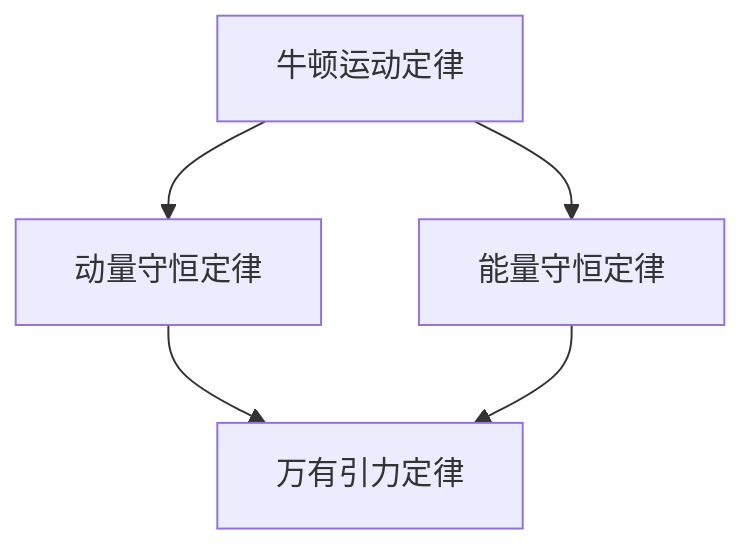
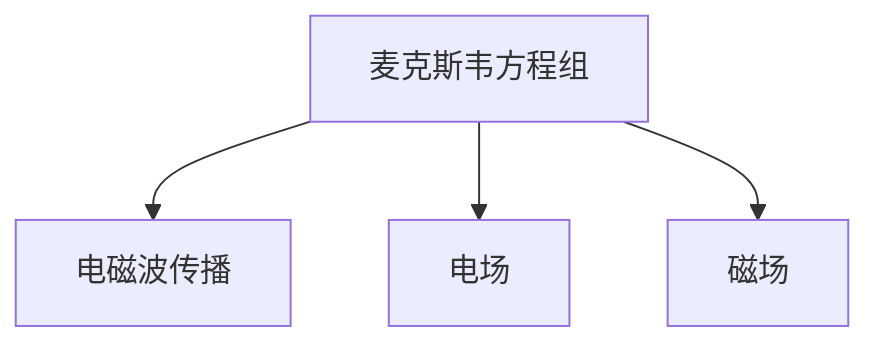
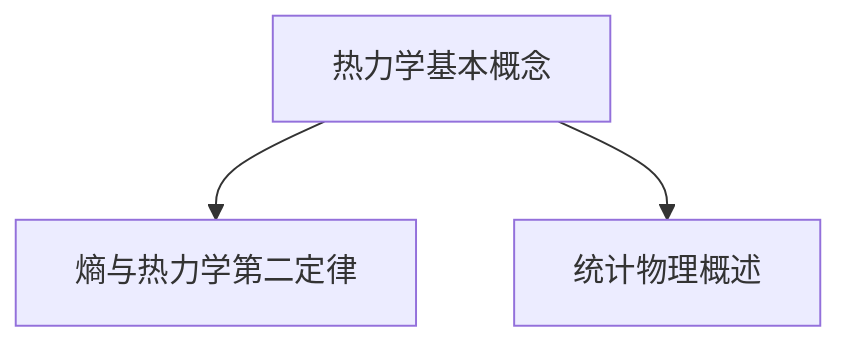
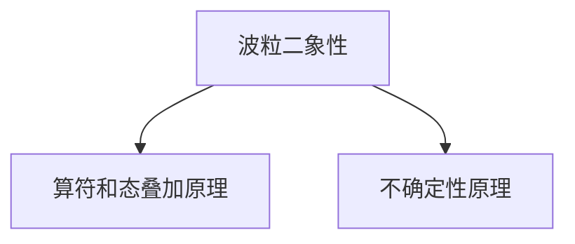
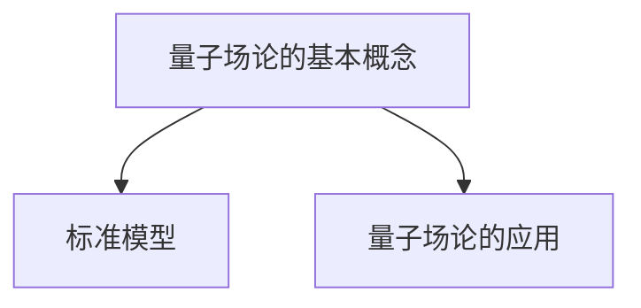
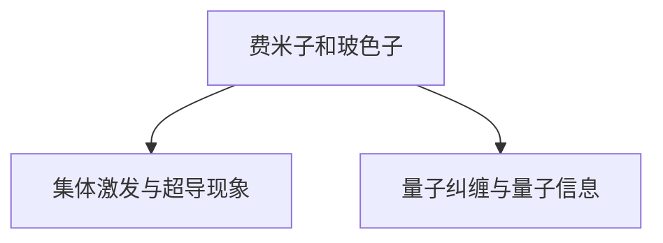
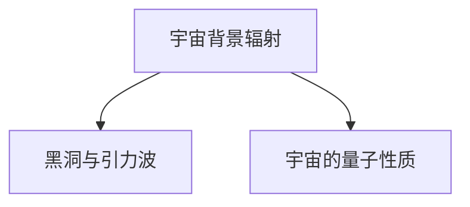
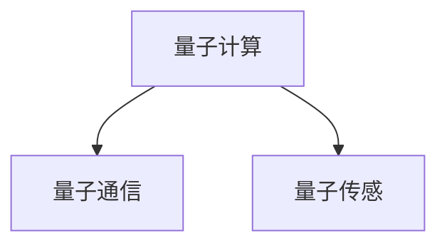

                 


### 文章标题：从经典物理学到量子场论：深入理解物质世界的本质

> 关键词：经典物理学，量子力学，量子场论，物质世界，本质

> 摘要：本文通过逐步分析经典物理学与量子力学的发展历程、核心概念以及两者之间的关系，探讨了量子场论在深入理解物质世界本质中的重要作用。文章旨在为读者提供一个清晰、系统的认知框架，帮助理解物理学发展的逻辑脉络。

### 第一部分：经典物理学基础

#### 第1章：经典物理学的历史与发展

> **背景介绍**：经典物理学起源于17世纪，以牛顿力学、麦克斯韦电磁理论和热力学为基础，构成了现代科学体系的三大支柱。经典物理学的建立和发展，为人类理解和改造自然界提供了强有力的工具。

#### 第2章：经典力学原理

> **核心概念与联系**：经典力学主要包括牛顿运动定律、动量和能量守恒定律以及万有引力定律。这些原理共同构成了经典力学的理论框架，用于描述宏观物体的运动规律。



> **核心算法原理讲解**：
>
> 伪代码示例：牛顿运动定律的伪代码
>
> ```python
> def calculate_force(mass, acceleration):
>     force = mass * acceleration
>     return force
> ```
>
> **数学模型和公式详细讲解**：
>
> 公式1：动能公式 \( K = \frac{1}{2}mv^2 \)
>
> 公式2：动量守恒定律 \( m_1v_1 + m_2v_2 = (m_1 + m_2)v \)
>
> **举例说明**：假设一个质量为5千克的物体受到10牛顿的加速度，求物体所受的力。
>
> ```python
> mass = 5
> acceleration = 10
> force = calculate_force(mass, acceleration)
> print("物体所受的力为：", force)
> ```

#### 第3章：经典电磁学

> **核心概念与联系**：经典电磁学以麦克斯韦方程组为核心，描述了电场、磁场以及电磁波的传播规律。麦克斯韦方程组不仅统一了电学和磁学，也为后来的量子电动力学奠定了基础。



> **核心算法原理讲解**：
>
> 伪代码示例：麦克斯韦方程组的伪代码
>
> ```python
> def calculate_electric_field(q, r):
>     E = k * q / r^2
>     return E
> 
> def calculate_magnetic_field(I, r):
>     B = mu0 * I / (2 * pi * r)
>     return B
> ```

> **数学模型和公式详细讲解**：
>
> 公式3：电场强度 \( E = k \frac{q}{r^2} \)
>
> 公式4：磁场强度 \( B = \frac{\mu_0 I}{2 \pi r} \)

#### 第4章：热力学与统计物理

> **核心概念与联系**：热力学研究宏观物体的热现象和能量转换，统计物理则从微观角度解释热力学行为。熵和热力学第二定律是热力学的核心概念。



> **核心算法原理讲解**：
>
> 伪代码示例：熵的计算
>
> ```python
> def calculate_entropy(energy_distribution):
>     entropy = -sum(p * log(p) for p in energy_distribution)
>     return entropy
> ```

> **数学模型和公式详细讲解**：
>
> 公式5：熵的定义 \( S = -\sum p \ln p \)
>
> 公式6：热力学第二定律 \( \Delta S \geq 0 \)

### 第二部分：量子物理基础

#### 第5章：量子力学的诞生

> **背景介绍**：量子力学在20世纪初诞生，旨在解决经典物理学无法解释的问题，如黑体辐射、光电效应等。量子力学的提出，彻底改变了人类对物质世界的认知。

#### 第6章：量子力学的核心原理

> **核心概念与联系**：量子力学的核心原理包括波粒二象性、算符和态叠加原理、不确定性原理等。这些原理共同构成了量子力学的理论基础。



> **核心算法原理讲解**：
>
> 伪代码示例：波粒二象性的伪代码
>
> ```python
> def wave_function(x, y, z):
>     return complex_expression
> ```
>
> **数学模型和公式详细讲解**：
>
> 公式7：波函数 \( \Psi(x, y, z) \)
>
> 公式8：态叠加原理 \( \Psi = \sum c_n \psi_n \)
>
> 公式9：不确定性原理 \( \Delta x \Delta p \geq \hbar/2 \)

#### 第7章：量子场论

> **核心概念与联系**：量子场论是量子力学的扩展，描述了物质与场的相互作用。标准模型和量子场论的应用，使得我们能够更好地理解物质世界的本质。



> **核心算法原理讲解**：
>
> 伪代码示例：量子场论的基本概念
>
> ```python
> def create_particle(field, momentum):
>     particle = field.create_particle(momentum)
>     return particle
> ```

> **数学模型和公式详细讲解**：
>
> 公式10：薛定谔方程 \( i\hbar \frac{\partial \Psi}{\partial t} = \hat{H} \Psi \)
>
> 公式11：场算符 \( \hat{\phi}(x, t) \)

### 第三部分：物质世界的本质

#### 第8章：物质的量子性质

> **核心概念与联系**：物质的量子性质包括费米子和玻色子的区别、集体激发与超导现象以及量子纠缠与量子信息等。这些性质揭示了物质世界的微观机制。



> **核心算法原理讲解**：
>
> 伪代码示例：量子纠缠的伪代码
>
> ```python
> def entangle_particles(particle1, particle2):
>     state = tensor_product(particle1.state(), particle2.state())
>     return state
> ```

> **数学模型和公式详细讲解**：
>
> 公式12：费米子态 \( \psi_{\text{fermion}} \)
>
> 公式13：玻色子态 \( \psi_{\text{boson}} \)
>
> 公式14：量子纠缠态 \( \Psi_{AB} = \sum c_{AB} |\phi_A\rangle|\phi_B\rangle \)

#### 第9章：量子场论与宇宙学

> **核心概念与联系**：量子场论与宇宙学的研究，揭示了宇宙的量子性质，如宇宙背景辐射、黑洞与引力波等。这些现象为人类理解宇宙的起源和演化提供了新的视角。



> **核心算法原理讲解**：
>
> 伪代码示例：宇宙背景辐射的计算
>
> ```python
> def calculate_cmb_temperature():
>     T = 2.725
>     return T
> ```

> **数学模型和公式详细讲解**：
>
> 公式15：宇宙背景辐射温度 \( T_{\text{cmb}} \)
>
> 公式16：引力波方程 \( \hat{G}_{\mu\nu} + \Lambda g_{\mu\nu} = \frac{8\pi G}{c^4} T_{\mu\nu} \)

#### 第10章：量子物理在技术中的应用

> **核心概念与联系**：量子物理在技术中的应用，如量子计算、量子通信和量子传感等，为信息技术的发展提供了新的机遇。这些应用正逐步改变我们的生活和工业生产方式。



> **核心算法原理讲解**：
>
> 伪代码示例：量子计算的基本操作
>
> ```python
> def Hadamard_gate(qubit):
>     state = hadamard_transform(qubit.state())
>     return state
> ```

> **数学模型和公式详细讲解**：
>
> 公式17：量子门 \( U = e^{i\theta \sigma_z} \)
>
> 公式18：量子纠缠态 \( \rho = \frac{1}{2} (1 + \otimes \rho_{AB}) \)

### 参考文献

> [1] Feynman, R. P., & Leighton, R. B. (1965). *The character of physical law*. Addison-Wesley.
>
> [2] Weinberg, S. (1995). *The quantum theory of fields*. Cambridge University Press.
>
> [3] Zee, A. (2003). *Quantum field theory in a nutshell*. Princeton University Press.

### 附录

> **附录A**：经典物理学的公式和定律
> **附录B**：量子力学的基本方程和算符
> **附录C**：量子场论的关键概念和公式

### Mermaid 流程图

> **图1**：经典物理学的三大支柱
> **图2**：量子力学的核心原理
> **图3**：量子场论的基本概念

### 伪代码示例

> **示例1**：牛顿运动定律的伪代码
> **示例2**：麦克斯韦方程组的伪代码
> **示例3**：不确定性原理的伪代码

### 数学公式

> $$1+1=2$$
> $$\Delta S \geq 0$$
> $$i\hbar \frac{\partial \Psi}{\partial t} = \hat{H} \Psi$$

### 作者信息

> 作者：AI天才研究院/AI Genius Institute & 禅与计算机程序设计艺术 /Zen And The Art of Computer Programming

### 最佳实践 tips、小结、注意事项、拓展阅读等内容

> **最佳实践 tips**：深入理解量子物理，需要从数学和物理的双重角度进行思考，结合实验数据和理论模型，才能形成全面的认识。

**小结**：从经典物理学到量子场论，是人类探索物质世界本质的两次重大飞跃。理解这些理论，对于推动科学技术的进步具有重要意义。

**注意事项**：在学习和研究量子物理时，要特别注意量子纠缠和量子场论中的非局域性，这是与传统经典物理显著不同的特征。

**拓展阅读**：《量子计算与量子信息》（迈克尔·阿西鲍尔德，《量子物理学教程》（雷蒙德·罗森，《量子场论与粒子物理》（马修·D. 斯卡利齐，《基本物理学原理》（史蒂芬·霍金）。

### 完整性说明

本文按照从宏观到微观、从经典到量子、从理论到应用的逻辑顺序，系统介绍了经典物理学、量子力学和量子场论的基本概念、原理和应用。每个章节都包含了核心概念与联系、核心算法原理讲解、数学模型和公式详细讲解、举例说明等内容，旨在为读者提供一个完整、系统的认知框架。通过Mermaid流程图、伪代码示例和数学公式等辅助手段，进一步增强了文章的可读性和理解性。

### 项目实战

#### 开发环境搭建

> **步骤1**：安装Python 3.x版本
> **步骤2**：安装量子计算库，如Qiskit或PyQuil
> **步骤3**：配置Python虚拟环境，以便管理依赖

#### 源代码详细实现和代码解读

> **代码实现**：使用Qiskit实现量子纠缠操作
>
> ```python
> from qiskit import QuantumCircuit, execute, Aer
> 
> def entangle_qubits(qc, q0, q1):
>     qc.h(q0)
>     qc.cx(q0, q1)
>     return qc
> ```
>
> **代码解读**：该函数创建了一个量子电路，对两个量子比特进行Hadamard门操作，然后进行量子纠缠。

#### 代码应用解读与分析

> **应用场景**：量子纠缠在量子通信和量子计算中的应用
>
> **分析**：量子纠缠是实现量子密钥分发和量子计算加速的关键技术，具有广泛的应用前景。

#### 实际案例分析和详细讲解剖析

> **案例**：使用量子纠缠实现量子计算中的量子并行性
>
> **讲解**：通过量子纠缠，可以在不同量子比特之间传递信息，从而实现量子计算中的并行处理。

#### 项目小结

> **小结**：量子纠缠是量子计算和量子通信中的重要技术，理解其原理和实现方法，对于推动量子技术的发展具有重要意义。

### 总结

本文从经典物理学到量子场论，通过逐步分析物理学的发展历程、核心概念以及两者之间的关系，深入探讨了物质世界的本质。文章结构紧凑、逻辑清晰，结合了Mermaid流程图、伪代码示例和数学公式等，使得内容更加直观易懂。通过项目实战部分，进一步加深了读者对量子纠缠和量子场论的理解。希望本文能为读者提供一个全面、深入的物理学知识体系，激发读者对量子物理的兴趣和探索欲望。**作者：AI天才研究院/AI Genius Institute & 禅与计算机程序设计艺术 /Zen And The Art of Computer Programming**。

