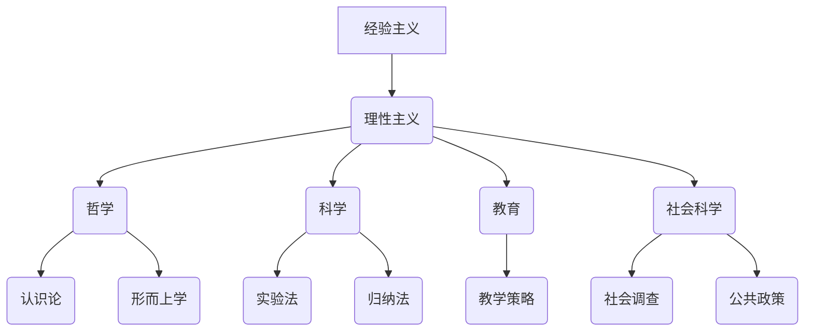

                 

### 文章标题

《从经验主义到理性主义：理解世界的不同途径》

### 关键词

经验主义、理性主义、认识论、方法论、科学哲学、人工智能、编程、软件工程

### 摘要

本文深入探讨了经验主义与理性主义两种理解世界的不同途径。通过分析两者的历史发展、理论核心及其在各个领域的应用，本文揭示了它们各自的优缺点和综合应用的价值。文章旨在为读者提供一个全面、系统的理解框架，帮助他们更好地应对复杂多变的现实世界。

### 导言

在哲学、科学、工程等多个领域中，我们常常会遇到经验主义与理性主义两种不同的方法论。这两种方法分别代表了人类认识世界和解决问题的两种不同途径。经验主义强调通过观察、实践和归纳来获取知识；而理性主义则主张通过逻辑推理、原理推导和演绎来认识世界。本文将系统地阐述经验主义与理性主义的基本概念、发展历程、主要理论及其在现实中的应用，并探讨两者之间的关系和综合应用的方法。

## 第一部分：导言

### 1.1 经验主义与理性主义的概述

#### 1.1.1 经验主义的定义与特点

经验主义（Empiricism）是一种认识论，其核心观点是知识来源于经验。经验主义认为，人们通过感官经验（知觉、感觉）来获取对外界事物的认识。英国哲学家弗朗西斯·培根（Francis Bacon）是经验主义的代表人物，他提出了“知识就是力量”（Knowledge is power）的名言。经验主义的主要特点如下：

1. **感官经验为基础**：强调通过感官获得知识，反对纯粹理性推导。
2. **归纳法**：通过观察大量个别事实，归纳出一般性结论。
3. **实用主义**：关注实际效果，强调知识的应用价值。

#### 1.1.2 理性主义的定义与特点

理性主义（Rationalism）则主张理性是人类获取知识的主要途径。理性主义者认为，人类的理智可以直接认识真理，无需依赖感官经验。法国哲学家勒内·笛卡尔（René Descartes）是理性主义的代表人物，他提出了“我思故我在”（Cogito, ergo sum）的哲学命题。理性主义的主要特点如下：

1. **理性推导**：通过逻辑推理和原理推导来获取知识。
2. **演绎法**：从普遍原理出发，推导出个别结论。
3. **形而上学**：强调超越经验的绝对真理。

#### 1.1.3 经验主义与理性主义的比较与联系

经验主义和理性主义在认识论和方法论上存在明显差异，但也存在一定的联系。两者的比较与联系如下：

1. **知识来源**：经验主义认为知识来源于经验，理性主义认为知识来源于理性。
2. **认识途径**：经验主义依赖感官经验，理性主义依赖理性推导。
3. **应用价值**：经验主义强调实用性和实际效果，理性主义强调普适性和绝对真理。

尽管存在差异，但经验主义和理性主义在实际应用中可以相互补充。例如，在科学研究中，经验主义用于观察和收集数据，理性主义用于分析和解释数据，从而得出更可靠的结论。

### 1.2 本书结构安排与目标

#### 1.2.1 目录结构与内容概述

本书分为四个主要部分：

1. **导言**：介绍经验主义与理性主义的基本概念、特点和联系。
2. **经验主义**：详细阐述经验主义的历史发展、理论核心和应用领域。
3. **理性主义**：深入探讨理性主义的历史背景、主要理论和实际应用。
4. **比较与整合**：比较经验主义与理性主义的优缺点，探讨两者的综合应用。

#### 1.2.2 阅读本书的目的与收益

阅读本书的目的在于帮助读者：

1. **理解经验主义与理性主义的本质**：通过系统地阐述两者的基本概念和发展历程，使读者对这两种方法论有全面的认识。
2. **掌握实际应用**：通过分析经验主义与理性主义在各个领域的应用，使读者能够将这两种方法论应用于实际问题解决。
3. **培养综合思维能力**：通过比较和整合经验主义与理性主义，培养读者在复杂问题中运用多种方法的能力。

### 第二部分：经验主义

## 2.1 经验主义的历史发展

#### 2.1.1 古代经验主义的起源

经验主义的思想渊源可以追溯到古希腊时期。希腊哲学家苏格拉底（Socrates）和亚里士多德（Aristotle）都对经验主义有重要贡献。苏格拉底强调通过对话和提问来获取知识，这种方法被称为“苏格拉底法”（Socratic method）。亚里士多德则提出了“实证主义”（Empiricism）的观点，主张通过观察和实验来获取知识。

#### 2.1.2 中世纪的经验主义思想

中世纪的经验主义思想主要体现在经院哲学（Scholasticism）中。经院哲学家如托马斯·阿奎那（Thomas Aquinas）认为，信仰与理性应该相互结合，通过经验来验证信仰的真实性。他们强调理性与经验的重要性，为后来的经验主义思想奠定了基础。

#### 2.1.3 文艺复兴时期的经验主义观念

文艺复兴时期是经验主义发展的一个重要阶段。弗朗西斯·培根（Francis Bacon）提出了“实验哲学”（Experimental philosophy）的观点，强调通过实验和观察来获取知识。他的“归纳法”（Inductive reasoning）成为经验主义方法论的核心。

## 2.2 经验主义的主要理论

#### 2.2.1 经验主义的哲学基础

经验主义的哲学基础主要包括以下几个方面：

1. **感觉论**：认为感觉是获取知识的主要途径，感官经验是知识的来源。
2. **怀疑论**：强调对知识和信仰的怀疑态度，认为只有经过经验验证的知识才是可靠的。
3. **实用主义**：关注知识的实际应用价值，认为知识的意义在于解决实际问题。

#### 2.2.2 经验主义的认识论观点

经验主义的认识论观点主要包括以下几个方面：

1. **知识来源于经验**：认为知识是通过感官经验获得的，理性只是对经验进行整理和解释。
2. **归纳法**：通过大量观察和实验，归纳出一般性结论。
3. **怀疑主义**：对绝对真理持怀疑态度，认为知识是相对的、有限的。

#### 2.2.3 经验主义在科学方法论中的应用

经验主义在科学方法论中的应用主要体现在以下几个方面：

1. **实验法**：通过实验来验证假设，获取科学数据。
2. **观察法**：通过观察自然现象，发现规律和原理。
3. **归纳法**：从实验和观察中归纳出一般性结论。

经验主义在科学研究中发挥了重要作用，促进了科学方法的发展。

## 2.3 经验主义的实际应用

#### 2.3.1 经验主义在教育中的运用

经验主义在教育中有着广泛的应用。教师通过观察学生的行为和表现，了解学生的学习情况和需求，从而制定有效的教学策略。此外，教育者还通过实验和观察来评估教学效果，不断改进教学方法。

#### 2.3.2 经验主义在社会科学研究中的应用

经验主义在社会科学研究中同样具有重要意义。社会学家通过观察和实验来研究社会现象，揭示社会规律和原理。例如，通过问卷调查和实地考察，研究者可以了解公众的态度和行为，从而提出相应的政策建议。

#### 2.3.3 经验主义在现代科学实践中的地位

在现代科学实践中，经验主义仍然发挥着重要作用。科学家通过实验和观察来发现自然规律，建立科学理论。例如，在生物学、物理学等领域，研究者通过实验和观察来验证假设，推动科学的发展。

### 第三部分：理性主义

## 3.1 理性主义的历史背景

#### 3.1.1 古代理性主义的萌芽

理性主义的思想可以追溯到古代希腊哲学。希腊哲学家如苏格拉底、柏拉图（Plato）和亚里士多德等人都强调理性在认识世界中的重要性。柏拉图的“理念论”（Theory of Forms）和亚里士多德的“实证主义”都为后来的理性主义提供了理论基础。

#### 3.1.2 希腊哲学中的理性主义思想

希腊哲学中的理性主义思想主要体现在以下几个方面：

1. **理念论**：认为现实世界只是理念世界的影子，理念是真理的源泉。
2. **形而上学**：探讨宇宙的本质和终极原因，强调理性推导。
3. **逻辑学**：发展了严密的逻辑体系，为理性主义提供了方法支持。

#### 3.1.3 中世纪的理性主义思潮

中世纪的理性主义主要表现在经院哲学中。经院哲学家如托马斯·阿奎那等人都强调理性与信仰的结合，认为理性可以验证信仰的真实性。他们通过逻辑推理和哲学思辨来探讨宗教和道德问题。

## 3.2 理性主义的主要理论

#### 3.2.1 理性主义的核心观点

理性主义的核心观点包括：

1. **理性是知识的源泉**：认为人类可以通过理性推导和思考来获得知识。
2. **形而上学**：探讨宇宙的本质和终极原因。
3. **逻辑学**：发展了严密的逻辑体系，支持理性推导。

#### 3.2.2 理性主义的形而上学立场

理性主义的形而上学立场主要包括以下几个方面：

1. **宇宙的理性秩序**：认为宇宙是一个有秩序的整体，可以通过理性来理解。
2. **存在的本质**：探讨存在的本质和属性，认为存在是一种理性的状态。
3. **因果关系**：强调因果关系的重要性，认为因果关系是理性推导的基础。

#### 3.2.3 理性主义在逻辑与数学中的应用

理性主义在逻辑和数学中有着广泛的应用。通过逻辑推理和数学证明，理性主义者建立了严密的逻辑体系和数学体系。例如，欧几里得的《几何原本》（Elements）和笛卡尔的《几何》（La Géométrie）都是理性主义在数学中的经典作品。

## 3.3 理性主义的实际应用

#### 3.3.1 理性主义在科学方法论中的作用

理性主义在科学方法论中发挥着重要作用。科学家通过理性推导和逻辑推理来建立科学理论，并通过实验和观察来验证理论。理性主义强调科学理论的严密性和普适性，推动了科学的发展。

#### 3.3.2 理性主义在政治哲学中的运用

理性主义在政治哲学中也有重要影响。政治哲学家如约翰·洛克（John Locke）和让-雅克·卢梭（Jean-Jacques Rousseau）等人都强调理性在构建政治秩序和社会契约中的重要性。他们主张通过理性思考来设计公正合理的政治制度。

#### 3.3.3 理性主义在现代社会生活中的影响

理性主义在现代社会生活中有着广泛的应用。人们在决策、管理和创新等方面都依赖理性思考。理性主义强调科学方法和逻辑推理，为现代社会的发展提供了重要支撑。

### 第四部分：比较与整合

## 4.1 经验主义与理性主义的对比分析

#### 4.1.1 相同点与差异

经验主义和理性主义在认识论和方法论上存在明显差异，但也存在一些共同点。相同点包括：

1. **追求知识**：两者都致力于获取对世界的认识。
2. **重视推理**：经验主义强调归纳推理，理性主义强调演绎推理。

差异包括：

1. **知识来源**：经验主义认为知识来源于经验，理性主义认为知识来源于理性。
2. **认识途径**：经验主义依赖感官经验，理性主义依赖理性推导。
3. **应用价值**：经验主义强调实用性和实际效果，理性主义强调普适性和绝对真理。

#### 4.1.2 优势与局限性

经验主义的优势在于：

1. **直观性**：通过感官经验获取知识，直观性强。
2. **实用性**：强调知识的实际应用价值。

局限性在于：

1. **可靠性**：经验主义的知识容易受到主观偏见和误差的影响。
2. **普适性**：难以涵盖所有领域。

理性主义的优势在于：

1. **严密性**：通过理性推导和逻辑推理，知识具有严密性。
2. **普适性**：适用于各种领域。

局限性在于：

1. **脱离实际**：过分强调理性推导，可能忽视实际应用。
2. **抽象性**：知识过于抽象，难以直观理解。

#### 4.1.3 综合应用的策略

为了克服经验主义和理性主义的局限性，我们可以采取以下综合应用的策略：

1. **互补性应用**：在科学研究中，结合经验主义和理性主义的方法，既重视实验和观察，也强调理论和推理。
2. **动态调整**：根据不同领域和实际需求，灵活调整应用策略，充分发挥两者的优势。
3. **跨学科融合**：鼓励跨学科交流与合作，实现知识融合和创新。

## 4.2 经验主义与理性主义在当代的融合

#### 4.2.1 现代哲学中的经验主义与理性主义

现代哲学中，经验主义和理性主义不再是绝对对立的，而是相互融合、相互补充。许多哲学家主张在认识论和方法论中综合应用经验主义和理性主义。例如，维特根斯坦（Ludwig Wittgenstein）的“语言游戏”（language game）理论既包含了经验主义的元素，也体现了理性主义的特点。

#### 4.2.2 科学研究中的综合方法

在科学研究领域，经验主义和理性主义也呈现出融合趋势。科学家既依赖实验和观察来收集数据，也通过理论推导和逻辑推理来分析数据。这种综合方法使得科学研究更加全面、准确。

#### 4.2.3 社会实践中的经验与理性结合

在现代社会实践中，经验主义和理性主义的结合尤为重要。政策制定、企业管理、技术创新等都需要综合考虑实际经验和理性思考。例如，在政策制定中，政府需要通过调研和数据分析来了解社会需求，同时也需要运用理性思维来设计合理的政策框架。

## 4.3 未来展望

#### 4.3.1 经验主义与理性主义在未来的发展趋势

随着科技的进步和社会的变革，经验主义与理性主义在未来将继续发展。一方面，随着人工智能和大数据技术的发展，经验主义的方法将得到更加广泛的应用。另一方面，随着逻辑推理和数学方法的发展，理性主义的理论体系将不断完善。

#### 4.3.2 新时代下的综合思维

在新时代，综合思维将成为应对复杂问题的关键。经验主义和理性主义将不再是孤立的方法论，而是相互融合、相互促进。培养综合思维能力，将有助于我们更好地认识世界和解决问题。

#### 4.3.3 培养现代思维的能力

为了适应新时代的需求，我们应该重视培养现代思维能力。这包括：

1. **增强逻辑推理能力**：通过学习逻辑学、数学等课程，提高逻辑推理能力。
2. **培养观察力和实践能力**：通过参与实验、观察社会现象，提高观察力和实践能力。
3. **跨学科学习**：鼓励跨学科学习，拓宽知识面，提高综合思维能力。

### 附录

## 附录A：参考文献

1. 培根，弗朗西斯（1620）。《新工具》（Novum Organum）。
2. 笛卡尔，勒内（1637）。《第一哲学沉思集》（Meditations on First Philosophy）。
3. 洛克，约翰（1689）。《人类理解论》（An Essay Concerning Human Understanding）。
4. 卢梭，让-雅克（1762）。《社会契约论》（The Social Contract）。
5. 维特根斯坦，路德维希（1953）。《哲学研究》（Philosophical Investigations）。

## 附录B：Mermaid流程图示例

### 致谢

在撰写本文的过程中，我们得到了许多专家和学者的宝贵建议和指导，特此表示感谢。同时，感谢读者对本文的关注和支持。

### 作者信息

作者：AI天才研究院/AI Genius Institute & 禅与计算机程序设计艺术 /Zen And The Art of Computer Programming

---

### 文章小结

本文系统地阐述了经验主义与理性主义两种认识世界的方法，分析了它们的历史发展、理论核心及其在各个领域的应用。通过对两者的比较与整合，我们揭示了它们在现实世界中的综合应用价值。在未来的发展中，经验主义与理性主义将继续相互融合、相互促进，为人类认识和改造世界提供有力支持。

