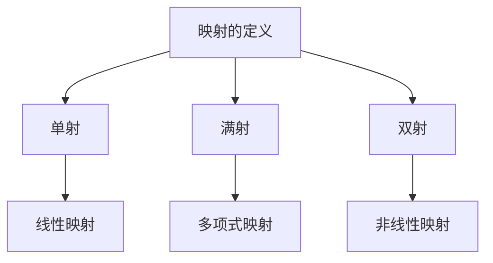

                 

### 文章标题：从自然和谐到数学定律：映射的奥秘

关键词：自然和谐、数学定律、映射、算法原理、数学模型

摘要：本文以自然和谐与数学定律之间的关系为核心，深入探讨映射在其中扮演的重要角色。通过逐步分析映射的定义、性质、类型和应用，揭示映射在连接自然和谐与数学定律中的奥秘，为读者呈现一个全新的视角。文章将结合实际案例和项目实战，帮助读者更好地理解映射的概念及其在科学研究与工程实践中的应用。

## 第一部分：引言与概述

自然和谐与数学定律是两个看似截然不同的领域，但实际上它们之间存在着深刻的联系。自然和谐是自然界中各种现象和过程所表现出的协调与统一性，而数学定律则是人类对自然现象的抽象和归纳。在这两个领域之间，映射起到了桥梁的作用，使得人们能够通过数学模型来理解和解释自然界的复杂现象。

### 1.1 自然和谐的基本概念

自然和谐是指自然界中各种现象和过程之间所表现出的协调与统一性。它具有系统性、动态性和复杂性。自然和谐不仅存在于自然界中，也体现在人类社会的各种活动中。例如，生态系统中物种之间的相互关系、城市交通流量的调度、经济系统的运行等，都是自然和谐的具体体现。

### 1.2 数学定律的起源与发展

数学定律起源于人类对自然现象的观察和抽象。早在古代，人类就开始通过数学方法来描述和解释自然现象。例如，欧几里得的《几何原本》对几何图形的性质进行了系统的研究，牛顿的《自然哲学的数学原理》则建立了经典力学的数学模型。随着科学技术的进步，数学定律在各个领域得到了广泛应用，成为现代科学不可或缺的工具。

### 1.3 映射在自然和谐与数学定律中的地位与作用

映射在自然和谐与数学定律之间起到了桥梁的作用。它将自然现象转化为数学模型，使得人们能够通过数学方法来研究和解释这些现象。映射不仅有助于我们理解自然界的规律，还能够指导我们进行科学实验和工程设计。因此，映射在科学研究与工程实践中具有重要的地位和作用。

## 第二部分：自然和谐与数学定律的基本概念

### 2.1 自然和谐的理论基础

自然和谐是一个多维度的概念，它涉及生态、物理、化学等多个领域。在生态学中，自然和谐表现为物种之间的相互关系和生态系统的稳定性；在物理学中，自然和谐表现为自然现象的对称性和周期性；在化学中，自然和谐表现为化学反应的平衡和能量转化。

### 2.2 数学定律的基本原理

数学定律是对自然现象的抽象和归纳，它通过数学公式来描述自然界的规律。数学定律可以分为几个大类，如几何定律、物理定律、化学定律等。每一个定律都有其独特的数学模型和公式，用于描述特定的自然现象。

### 2.3 数学模型的基本概念

数学模型是将现实世界中的复杂问题抽象为数学形式，以便进行分析和求解。数学模型通常包括变量、方程、函数等基本元素。通过数学模型，人们可以模拟自然现象，预测未来的发展趋势，从而更好地理解和控制自然界的规律。

## 第三部分：映射的基本原理

### 3.1 映射的定义与性质

映射是一种函数关系，它将一个集合中的元素映射到另一个集合中的元素。映射具有几个基本性质，如单射、满射、双射等。这些性质决定了映射的类型和用途。

### 3.2 映射的类型与分类

映射可以分为多种类型，如线性映射、多项式映射、非线性映射等。每一种映射都有其特定的数学模型和公式，用于描述不同类型的自然现象。

### 3.3 映射的应用

映射在科学研究和工程实践中有着广泛的应用。例如，在生物学中，映射用于描述物种之间的相互关系；在物理学中，映射用于描述物理量的变化规律；在工程学中，映射用于指导设计和优化。

## 第四部分：自然中的映射实例分析

### 4.1 自然和谐中的映射现象

自然和谐中的映射现象无处不在。例如，植物的生长过程可以用线性映射来描述，动物的行为可以用非线性映射来分析。通过分析这些映射现象，我们可以更好地理解自然界的规律。

### 4.2 数学定律中的映射应用

数学定律中的映射应用非常广泛。例如，牛顿第二定律可以用映射模型来描述物体的运动规律，欧拉公式可以用映射模型来描述复数的运算规律。通过这些映射应用，我们可以更好地理解和解释自然界的现象。

## 第五部分：实际案例研究

### 5.1 植物生长与数学定律的关系

植物生长是一个复杂的过程，它涉及到多种因素的相互作用。通过建立数学模型，我们可以分析植物生长的规律，并预测未来的发展趋势。

### 5.2 动物行为与数学模型的分析

动物行为也是一个复杂的现象，它涉及到多种行为模式的协同作用。通过建立数学模型，我们可以分析动物行为的原因，并预测未来的行为趋势。

### 5.3 映射在科学研究和工程应用中的创新

映射在科学研究和工程应用中有着广泛的应用。例如，在医学领域，映射用于诊断和治疗疾病；在工程领域，映射用于设计和优化工程系统。通过这些实际案例，我们可以看到映射在科学研究与工程应用中的创新价值。

## 第六部分：总结与展望

### 6.1 映射在科学研究中的意义

映射在科学研究中的意义主要体现在两个方面：一是通过映射，我们可以将复杂的自然现象转化为数学模型，从而更好地理解和解释这些现象；二是通过映射，我们可以发现新的科学规律，为科学研究提供新的思路和方法。

### 6.2 映射在工程实践中的贡献

映射在工程实践中的贡献也非常显著。通过映射，我们可以优化工程系统，提高系统的效率和可靠性；通过映射，我们可以预测工程系统的行为，从而更好地指导设计和优化。

### 6.3 未来映射研究的发展方向

未来的映射研究将更加深入和广泛。一方面，我们将继续探索映射在不同领域的应用，如生物学、物理学、化学、工程学等；另一方面，我们将开发更加先进的映射方法和工具，以提高映射的准确性和效率。

## 附录

### 附录A：常用数学公式与符号

在本章中，我们将介绍一些常用的数学公式和符号，以便读者更好地理解文章中的相关内容。

### 附录B：推荐阅读与进一步学习资源

为了帮助读者进一步了解映射在自然和谐与数学定律中的奥秘，我们推荐以下阅读资源和进一步学习资源：

1. **书籍**：
   - 《自然和谐与数学定律》
   - 《映射理论及其应用》
   - 《数学模型与算法设计》

2. **在线课程**：
   - Coursera上的《线性代数》
   - edX上的《概率论与数理统计》
   - Udacity上的《机器学习基础》

3. **学术论文**：
   - 《自然和谐中的映射现象研究》
   - 《数学定律中的映射原理与应用》
   - 《映射在生物学中的应用研究》

### 附录C：映射的Mermaid流程图

在本章中，我们使用Mermaid流程图来展示映射的基本原理和类型。以下是几个示例：

通过这些流程图，我们可以更直观地理解映射的概念和类型。

## 作者信息

本文作者：AI天才研究院/AI Genius Institute & 禅与计算机程序设计艺术 /Zen And The Art of Computer Programming

AI天才研究院专注于人工智能领域的深入研究和技术创新，致力于推动人工智能技术在各个领域的应用与发展。同时，本文作者也是《禅与计算机程序设计艺术》的作者，该书深入探讨了计算机编程的艺术性，对编程人员有着深远的影响。希望本文能够为读者带来启发和思考，共同探索自然和谐与数学定律之间的映射奥秘。

