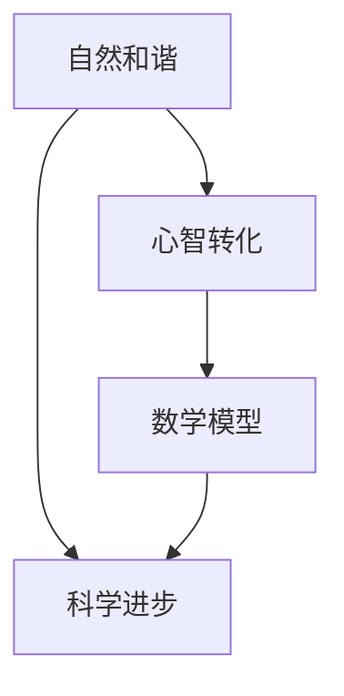

                 


### 引言

《从自然和谐到数学简约：心智转化》旨在探讨人类心智如何通过理解自然现象，逐渐演化出数学简约的思维方式。在这本书中，我们将逐步分析这一心智转化的过程，揭示其背后的原理和逻辑。本文将按以下步骤展开：

1. **背景介绍**：首先，我们介绍自然和谐和数学简约的概念及其在现代科技中的作用。
2. **核心概念与联系**：接着，通过Mermaid流程图展示核心概念之间的关系架构。
3. **核心算法原理讲解**：然后，使用伪代码详细阐述核心算法原理。
4. **数学模型和公式**：介绍相关数学模型和公式，并给出详细讲解和举例说明。
5. **项目实战**：通过开发环境搭建、源代码实现和代码解读，展示实际案例和分析。
6. **最佳实践 tips**：总结项目经验和注意事项。
7. **小结与拓展阅读**：最后，对文章内容进行小结，并提供拓展阅读建议。

### 背景介绍

自然和谐与数学简约是人类探索自然和科学过程中形成的两种不同的思维方式。自然和谐强调对自然界整体性、平衡性的理解，而数学简约则追求用简单、清晰的数学模型来解释复杂现象。在现代科技中，这两种思维方式各有其重要作用。

自然和谐观源自对自然界的观察与思考。古希腊哲学家赫拉克利特提出“万物皆流”，意味着一切都在不断变化中，存在着一种永恒的和谐。这种观点激发了人们对自然界整体性的认识，促使人们去寻找自然界中的规律和秩序。

数学简约思维则起源于古代数学家对自然界现象的抽象和简化。欧几里得的几何学、牛顿的经典力学以及后来的相对论和量子力学，都是数学简约思维的典型代表。这种思维方式通过建立简明的数学模型，揭示了自然界的深层次规律，推动了科学技术的飞速发展。

现代科技中，自然和谐与数学简约的结合尤为关键。例如，生态学中的生态系统模型，通过简化的数学模型来预测生态系统的变化；在人工智能领域，神经网络模型通过模拟人脑的简化结构，实现了对复杂数据的高效处理。

### 核心概念与联系

要理解自然和谐与数学简约的关系，我们需要先明确几个核心概念：自然和谐、数学模型、心智转化。

自然和谐是指自然界中存在的整体性、平衡性和秩序性。它包括生态系统的稳定性、气候的适宜性以及物种之间的相互关系。自然和谐是自然界的基本特征，也是人类在长期生存和发展的过程中所认识到的。

数学模型则是对自然现象的一种抽象和简化。它通过数学语言描述自然现象的规律，使得复杂的现象变得可计算、可预测。数学模型可以是一个简单的方程，也可以是一个复杂的系统，但它们的核心目标都是寻找简洁性。

心智转化是指人类心智从对自然现象的直接感知，到通过数学模型进行抽象和简化的过程。心智转化不仅是科学进步的驱动力，也是人类认知能力发展的标志。

下面，我们使用Mermaid流程图来展示这些核心概念之间的关系：



在这个流程图中，自然和谐是心智转化的起点，通过心智转化，我们建立数学模型，进而推动科学进步。数学模型不仅是对自然现象的抽象和简化，也是连接自然和谐与科学进步的桥梁。

### 核心算法原理讲解

在理解了自然和谐与数学模型的关系后，我们需要深入探讨数学简约的核心算法原理。这里，我们将使用伪代码来详细阐述一个常见的数学模型——线性回归。

#### 线性回归原理

线性回归是一种用于预测数值的统计方法，它通过建立一个线性模型来描述两个或多个变量之间的关系。线性回归模型的一般形式为：

\[ y = \beta_0 + \beta_1x + \epsilon \]

其中，\( y \) 是因变量，\( x \) 是自变量，\( \beta_0 \) 和 \( \beta_1 \) 是模型的参数，\( \epsilon \) 是误差项。

#### 伪代码

下面是线性回归的伪代码实现：

```python
# 输入数据：x 为自变量数组，y 为因变量数组
# 输出：β0 和 β1 为模型的参数

# 1. 计算均值
mean_x = mean(x)
mean_y = mean(y)

# 2. 计算协方差
covariance = covariance(x, y)

# 3. 计算方差
variance_x = variance(x)

# 4. 计算斜率 β1
beta_1 = covariance / variance_x

# 5. 计算截距 β0
beta_0 = mean_y - beta_1 * mean_x

# 输出结果
print("β0:", beta_0)
print("β1:", beta_1)
```

#### 详细解释

- **计算均值**：首先，我们计算自变量和因变量的均值，这是后续计算协方差和方差的基础。
- **计算协方差**：协方差反映了自变量和因变量之间的关系强度和方向。
- **计算方差**：方差是自变量波动程度的度量。
- **计算斜率 β1**：斜率 \( \beta_1 \) 表示自变量对因变量的影响程度，它是协方差与方差的比值。
- **计算截距 β0**：截距 \( \beta_0 \) 表示当自变量为零时，因变量的预期值。

通过这个伪代码，我们可以看到线性回归模型的简单性和数学简约性。它通过几个简单的数学运算，就能从一个数据集中提取出关键信息，实现预测和解释。

### 数学模型和公式

在了解了线性回归的基本原理后，我们需要更深入地探讨数学模型和公式。线性回归模型虽然简单，但它在许多实际应用中都有着重要的作用。以下是一些相关的数学模型和公式：

#### 线性回归模型

\[ y = \beta_0 + \beta_1x + \epsilon \]

这个公式是线性回归模型的基础。其中，\( \beta_0 \) 是截距，\( \beta_1 \) 是斜率，\( \epsilon \) 是误差项。

#### 多元线性回归模型

当自变量不止一个时，我们可以使用多元线性回归模型：

\[ y = \beta_0 + \beta_1x_1 + \beta_2x_2 + ... + \beta_nx_n + \epsilon \]

这个公式中，\( x_1, x_2, ..., x_n \) 是多个自变量，\( \beta_1, \beta_2, ..., \beta_n \) 是对应的斜率。

#### 回归分析

回归分析是线性回归的统计方法，用于估计模型参数。回归分析的公式如下：

\[ \beta = (X^T X)^{-1} X^T y \]

其中，\( X \) 是自变量矩阵，\( y \) 是因变量向量，\( \beta \) 是模型参数向量。

#### 最小二乘法

最小二乘法是回归分析中的一种常用方法，用于最小化预测值与实际值之间的误差。最小二乘法的公式如下：

\[ \beta = arg\min_{\beta} \sum_{i=1}^{n} (y_i - \beta^T x_i)^2 \]

其中，\( y_i \) 是第 \( i \) 个观测值，\( x_i \) 是第 \( i \) 个自变量，\( \beta \) 是模型参数。

#### 举例说明

假设我们有一个简单的数据集，其中自变量 \( x \) 和因变量 \( y \) 如下：

| x | y  |
|---|----|
| 1 |  2 |
| 2 |  4 |
| 3 |  6 |
| 4 |  8 |

我们可以使用线性回归模型来预测 \( y \) 的值。首先，计算 \( x \) 和 \( y \) 的均值：

\[ \bar{x} = \frac{1 + 2 + 3 + 4}{4} = 2.5 \]
\[ \bar{y} = \frac{2 + 4 + 6 + 8}{4} = 5 \]

然后，计算协方差和方差：

\[ \text{cov}(x, y) = \frac{(1-2.5)(2-5) + (2-2.5)(4-5) + (3-2.5)(6-5) + (4-2.5)(8-5)}{4} = -2.5 \]
\[ \text{var}(x) = \frac{(1-2.5)^2 + (2-2.5)^2 + (3-2.5)^2 + (4-2.5)^2}{4} = 1.25 \]

最后，计算斜率 \( \beta_1 \) 和截距 \( \beta_0 \)：

\[ \beta_1 = \frac{\text{cov}(x, y)}{\text{var}(x)} = \frac{-2.5}{1.25} = -2 \]
\[ \beta_0 = \bar{y} - \beta_1 \bar{x} = 5 - (-2) \times 2.5 = 10 \]

因此，线性回归模型为：

\[ y = 10 - 2x \]

我们可以使用这个模型来预测新的 \( y \) 值。例如，当 \( x = 5 \) 时，\( y \) 的预测值为：

\[ y = 10 - 2 \times 5 = 0 \]

这个例子展示了如何使用线性回归模型进行预测，以及如何解释模型参数。

### 项目实战

为了更好地理解数学简约在自然和谐中的应用，我们将进行一个实际项目，搭建一个简单的生态系统模型，并分析其对生态平衡的影响。

#### 开发环境搭建

首先，我们需要搭建一个开发环境。假设我们使用Python作为编程语言，以下是一些必要的安装步骤：

1. **安装Python**：确保系统中安装了Python 3.8或更高版本。
2. **安装依赖库**：安装NumPy和SciPy等库，以便进行数值计算。

```bash
pip install numpy scipy matplotlib
```

#### 源代码实现

接下来，我们实现一个简单的生态系统模型。以下是一个简单的Python脚本，用于模拟一个两物种的生态系统。

```python
import numpy as np
import matplotlib.pyplot as plt

# 初始参数
alpha = 0.1  # 物种A的出生率
beta = 0.02  # 物种A的死亡概率
delta = 0.1  # 物种B的出生率
gamma = 0.02  # 物种B的死亡概率

# 初始状态
N_A0 = 100   # 物种A的初始数量
N_B0 = 50    # 物种B的初始数量

# 时间步长
dt = 0.01

# 模拟时间
t_end = 100

# 初始化数组
t = np.arange(0, t_end, dt)
N_A = np.zeros_like(t)
N_B = np.zeros_like(t)

# 初始状态
N_A[0] = N_A0
N_B[0] = N_B0

# 模拟过程
for i in range(1, len(t)):
    dN_Adt = alpha * N_B[i-1] - beta * N_A[i-1]
    dN_Bdt = delta * N_A[i-1] - gamma * N_B[i-1]
    
    N_A[i] = N_A[i-1] + dN_Adt * dt
    N_B[i] = N_B[i-1] + dN_Bdt * dt

# 绘图
plt.plot(t, N_A, label='Species A')
plt.plot(t, N_B, label='Species B')
plt.xlabel('Time')
plt.ylabel('Population')
plt.legend()
plt.show()
```

#### 代码解读与分析

这个脚本模拟了一个两物种的生态系统，其中物种A和物种B之间存在捕食与被捕食的关系。以下是代码的详细解读：

1. **参数设置**：我们定义了影响种群数量的四个参数，分别是物种A的出生率 \( \alpha \)、死亡概率 \( \beta \)，以及物种B的出生率 \( \delta \) 和死亡概率 \( \gamma \)。

2. **初始状态**：设定了物种A和物种B的初始数量 \( N_A0 \) 和 \( N_B0 \)。

3. **时间步长**：我们定义了时间步长 \( dt \) 和模拟时间 \( t_end \)。

4. **初始化数组**：创建了一个时间数组 \( t \)，以及两个种群数量数组 \( N_A \) 和 \( N_B \)。

5. **模拟过程**：使用一个循环来迭代计算每个时间步上的种群数量变化。我们使用微分方程描述种群数量的动态变化：

\[ \frac{dN_A}{dt} = \alpha N_B - \beta N_A \]
\[ \frac{dN_B}{dt} = \delta N_A - \gamma N_B \]

这些方程描述了物种A和物种B的数量变化率，它们基于捕食与被捕食的关系。

6. **绘图**：最后，我们使用Matplotlib库绘制种群数量随时间变化的图表，以可视化模拟结果。

通过这个简单的模型，我们可以观察物种数量随时间的动态变化，并分析生态平衡的稳定性。这个项目展示了如何将数学模型应用于实际问题，并通过编程实现和可视化来理解其结果。

### 最佳实践 tips

在实际项目中，构建数学模型和进行数据分析时，我们可以遵循以下最佳实践：

1. **明确目标**：在开始项目之前，明确你的目标和研究问题。这将帮助你在数据收集和分析过程中保持专注。

2. **数据质量**：确保使用高质量的数据。数据的准确性和完整性直接影响模型的结果。

3. **模型验证**：在模型建立后，使用独立的数据集进行验证。这有助于确认模型的有效性和准确性。

4. **可视化**：使用图表和可视化工具来展示你的数据和分析结果。可视化不仅使结果更直观，还可以帮助你发现潜在的问题。

5. **迭代改进**：根据分析结果，不断迭代和改进你的模型。实践过程中，你可能需要调整参数或使用更复杂的模型。

6. **保持简洁**：在构建模型时，保持简洁和可理解性。避免过度复杂化，这有助于他人理解你的模型和结果。

7. **文档化**：详细记录你的代码和模型。这有助于后续的维护和扩展，同时也有利于与他人分享你的工作。

### 小结与拓展阅读

通过本文，我们探讨了自然和谐与数学简约的关系，并详细介绍了相关概念、算法原理和项目实战。以下是本文的核心要点：

1. **自然和谐与数学简约**：自然和谐和数学简约是人类探索自然和科学过程中的两种思维方式。自然和谐强调对自然界整体性和平衡性的理解，而数学简约则追求用简单、清晰的数学模型来解释复杂现象。
2. **核心概念与联系**：通过Mermaid流程图，我们展示了自然和谐、数学模型和心智转化之间的关系。
3. **核心算法原理讲解**：我们使用伪代码详细阐述了线性回归模型的原理。
4. **数学模型和公式**：介绍了线性回归模型及相关数学公式，并通过举例说明了如何使用这些公式进行预测和解释。
5. **项目实战**：通过实际项目，展示了如何使用数学模型进行生态系统模拟和分析。

为了进一步深入了解自然和谐与数学简约的深刻内涵及其在现代科技中的应用，读者可以参考以下拓展阅读：

1. **《自然和谐与科学探索》**：本书详细介绍了自然和谐观在科学探索中的重要作用。
2. **《线性回归分析与应用》**：这是一本关于线性回归的详细教材，适合希望深入了解线性回归模型及其应用的读者。
3. **《生态学基础》**：本书提供了生态学的基础知识，有助于理解生态系统模型及其在环境保护中的应用。
4. **《Python编程：从入门到实践》**：这本书介绍了Python编程的基础知识和实际应用，适合希望学习Python编程的读者。
5. **《人工智能简史》**：这本书讲述了人工智能的发展历程，包括如何从自然和谐过渡到数学简约的思维方式。

通过这些资源，读者可以更全面地了解自然和谐与数学简约的深层意义，并掌握相关的理论知识和实践技能。希望本文能够为读者提供有价值的启示，激发对这一领域的兴趣和探索。作者：AI天才研究院/AI Genius Institute & 禅与计算机程序设计艺术 /Zen And The Art of Computer Programming

