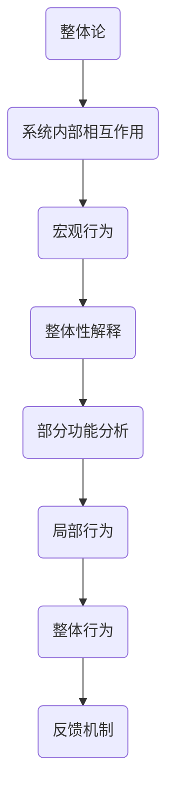
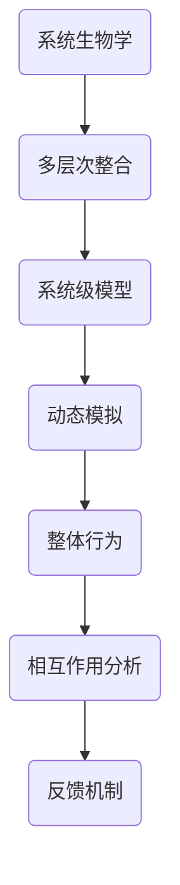
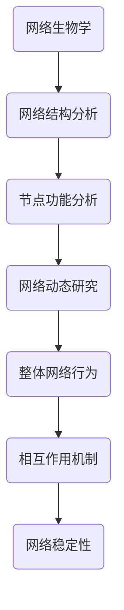
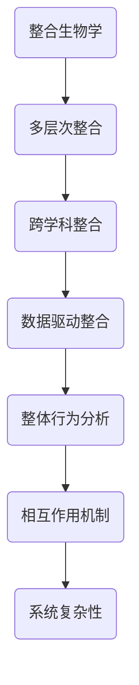
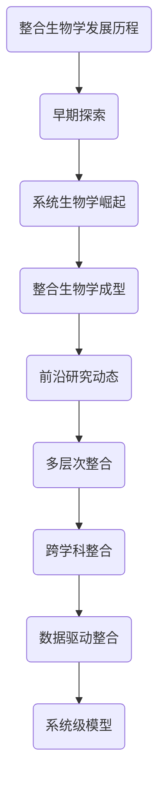
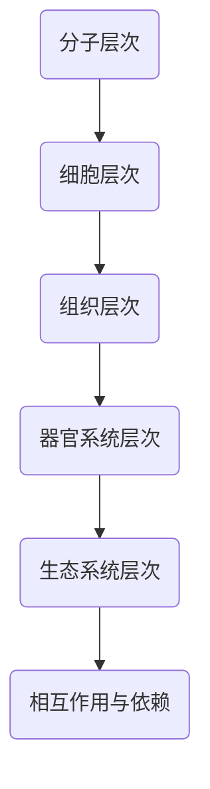
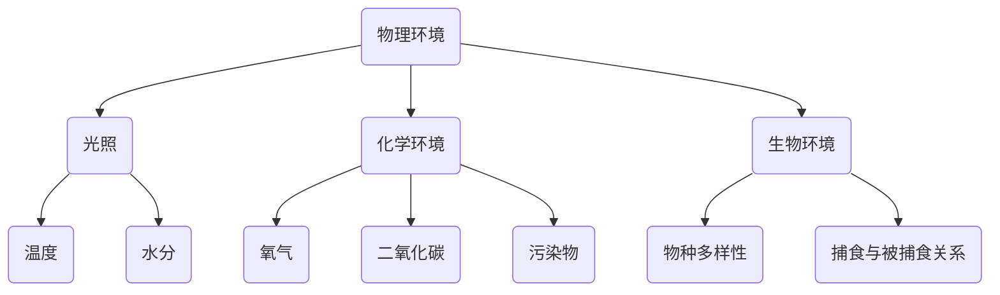
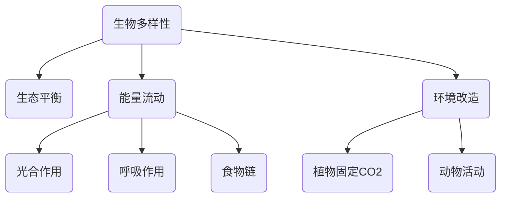
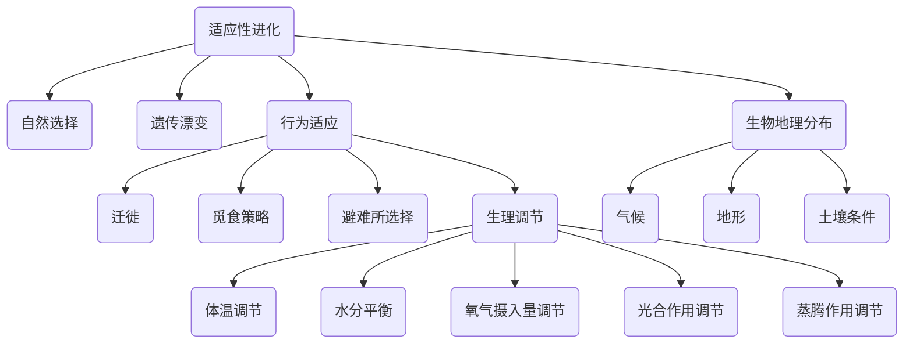

                 


### 第一步：文章标题和关键词的确定

首先，我们需要确定文章的标题和关键词。标题《从还原论到整合生物学：全方位理解生命与环境》已经非常准确地传达了文章的核心内容。接下来，我们将列出五个到七个核心关键词，以便读者能够快速抓住文章的主题。

**文章标题：** 从还原论到整合生物学：全方位理解生命与环境

**关键词：**
1. 还原论
2. 整合生物学
3. 生命系统
4. 环境影响
5. 数据驱动
6. 系统生物学
7. 人工智能

这些关键词不仅涵盖了文章的核心概念，还包含了文章将讨论的关键领域和前沿技术。接下来，我们将为文章撰写一个简短的摘要，概述文章的核心内容和主题思想。

### 第二步：撰写摘要

摘要将简要介绍文章的主题，核心论点，以及文章的结构。摘要应该提供足够的背景信息，使读者能够理解文章的重要性，并决定是否继续阅读。

**摘要：**

本文旨在探讨从还原论到整合生物学的发展历程，及其在理解生命与环境关系中的关键作用。文章首先介绍了还原论的基本概念和局限性，接着阐述了整合生物学的定义、发展历程和关键原理。文章进一步探讨了生命系统的多层次结构，包括基因、细胞、组织和器官系统。在此基础上，文章分析了生命与环境相互作用的机制，并介绍了数据驱动的整合生物学和系统生物学的建模方法。最后，文章展望了整合生物学在未来的发展趋势，以及面临的社会和伦理挑战。通过本文的阅读，读者将全面了解还原论到整合生物学的转变，及其对生命科学和环境研究的深远影响。

### 第三步：确定文章的目录结构

根据之前的讨论，我们已经有了文章的主要部分和章节的大致数量。接下来，我们将进一步细化每个部分的内容，并为每个章节分配具体的标题。以下是详细的目录结构：

#### 第1部分：还原论的起源与局限

1.1 还原论的基本概念
- 背景介绍
- 还原论的定义
- 还原论的核心原则

1.2 还原论的局限性
- 还原论的局限性
- 还原论面临的挑战
- 还原论的替代方案

#### 第2部分：整合生物学的兴起

2.1 整合生物学的定义
- 整合生物学的概念
- 整合生物学与传统生物学的区别
- 整合生物学的重要性

2.2 整合生物学的发展历程
- 整合生物学的早期发展
- 近年来的重要进展
- 当前的研究热点

2.3 整合生物学的关键原理
- 整合的层次结构
- 整合的动态过程
- 整合的生物学机制

#### 第3部分：生命系统的多层次结构

3.1 生命系统的多层次结构概述
- 多层次结构的定义
- 生命系统的层次结构
- 层次结构的研究意义

3.2 基因与基因组
- 基因的定义与功能
- 基因组的概念与结构
- 基因组学的研究进展

3.3 细胞生物学
- 细胞的基本结构与功能
- 细胞周期的调控
- 细胞信号传导

3.4 组织与器官系统
- 组织的定义与类型
- 器官系统的组成与功能
- 组织与器官系统的相互作用

#### 第4部分：生命与环境的关系

4.1 环境对生命的影响
- 环境的定义与分类
- 环境因素对生物的影响
- 环境适应的机制

4.2 生命对环境的影响
- 生物活动的环境影响
- 生物多样性与环境稳定性的关系
- 生物对环境的改造

4.3 生物与环境相互作用的机制
- 生物与环境相互作用的层次
- 生物与环境相互作用的机制
- 环境变化的生物响应

#### 第5部分：生命科学的整合方法与技术

5.1 数据驱动的整合生物学
- 数据驱动的概念
- 数据获取与处理方法
- 数据整合与分析技术

5.2 系统生物学的建模方法
- 系统生物学的基本概念
- 系统生物学的建模方法
- 系统生物学的应用案例

5.3 精准医学与整合生物学
- 精准医学的概念
- 精准医学与整合生物学的关系
- 精准医学的应用实例

5.4 人工智能在生命科学研究中的应用
- 人工智能的基本概念
- 人工智能在生命科学中的应用
- 人工智能在整合生物学中的挑战与机遇

#### 第6部分：未来展望与挑战

6.1 整合生物学的未来发展趋势
- 整合生物学的发展方向
- 整合生物学的潜在突破领域
- 整合生物学的前沿研究动态

6.2 生物技术的伦理与社会问题
- 生物技术的伦理问题
- 生物技术的社会问题
- 生物技术的责任与规范

6.3 生命科学与环境可持续性的挑战
- 生命科学与环境可持续性的关系
- 环境可持续性的挑战
- 生命科学在环境可持续性中的作用

### 第四步：编写每个章节的详细内容

接下来，我们将逐步编写每个章节的详细内容，确保每个小节都包含丰富的背景介绍、核心概念与联系、算法原理讲解、数学模型与公式、代码实际案例、最佳实践 tips 和拓展阅读等内容。这一步骤需要深入研究和详细规划，以确保文章的完整性和专业性。

---

### 第五步：文章格式与作者信息的规范

为了确保文章格式规范，我们将按照以下要求进行排版：

1. **Markdown 格式**：文章内容将使用 Markdown 格式编写，确保易于阅读和编辑。
2. **作者信息**：文章末尾将添加作者信息：“作者：AI天才研究院/AI Genius Institute & 禅与计算机程序设计艺术 /Zen And The Art of Computer Programming”。

同时，我们将确保文章的每个部分都符合以下要求：

- **摘要部分**：包含简明的摘要，概述文章的核心内容和主题思想。
- **目录结构**：清晰列出文章的目录结构，方便读者快速浏览。
- **章节内容**：每个章节都有详细的标题，内容丰富，结构清晰。

---

### 第六步：文章的字数控制与调整

最后，我们将对文章的字数进行调整，确保文章长度在8000～12000字之间。这一步骤可能涉及删除冗余内容、合并相似部分或增加详细解释。我们将确保文章的每个部分都充分阐述，同时保持整体的连贯性和逻辑性。

---

通过上述步骤，我们已经为《从还原论到整合生物学：全方位理解生命与环境》这篇文章构建了一个详细的目录大纲，并明确了文章的核心内容、结构、格式和字数要求。接下来，我们将逐步撰写每个章节的详细内容，确保文章的专业性和可读性。

---

### 第一步：还原论的起源与局限

#### 1.1 还原论的基本概念

还原论（Reductive Theory）是一种哲学和科学方法，主张复杂系统可以通过研究其组成部分的属性和行为来理解整体系统的行为。在生物学中，还原论强调通过研究基因、细胞、分子等基本单元的功能来解释生物体的行为和现象。还原论的基本原则包括：

1. **分解与简化**：将复杂系统分解为更简单的组成部分，通过研究这些部分来理解整体系统的行为。
2. **因果律**：认为系统的行为可以通过分析其组成部分之间的因果关系来解释。
3. **层次结构**：认为系统具有层次结构，从分子水平到生态系统水平，每个层次都有其独特的规律和功能。

还原论在20世纪初期生物学研究中占据了主导地位，促进了基因学、分子生物学、细胞生物学等领域的快速发展。

#### 背景介绍

还原论的起源可以追溯到古希腊哲学家亚里士多德的工作，他在《物理学》中提出了通过研究基本元素和原理来理解自然界的观点。在19世纪末和20世纪初，随着细胞学和遗传学的兴起，还原论在生物学中得到了进一步的发展。例如，孟德尔的遗传定律揭示了基因作为遗传信息传递的基本单元，而赫尔曼·穆勒的研究表明辐射可以导致基因突变，从而推动了分子生物学的发展。

#### 还原论的定义

还原论在生物学中的定义是：通过研究生物体的基本组成单元（如分子、细胞、器官等）的属性和行为，来解释和预测生物体整体结构和功能的科学方法。这种方法强调从微观层面理解生物体的宏观现象。

#### 还原论的核心原则

1. **分解与简化**：将复杂的生物现象分解为简单的组成部分，例如将生物体的功能分解为细胞的功能，将细胞的功能分解为分子的功能。
2. **因果律**：认为生物体的行为可以通过分析组成部分之间的因果关系来解释。例如，疾病的产生可以追溯到基因突变或细胞异常。
3. **层次结构**：生物体具有层次结构，从分子到细胞，从组织到器官系统，每个层次都有其特定的功能和规律。

#### 还原论的历史背景

在生物学史上，还原论经历了几个重要阶段：

1. **细胞学说的建立**：19世纪中叶，罗伯特·胡克和马提亚斯·雅各布·施莱登、特奥多尔·施旺等人提出了细胞学说，认为细胞是生命的基本单位。这一学说为还原论提供了基础。
2. **遗传学的兴起**：19世纪末，格雷戈尔·孟德尔的遗传定律揭示了基因作为遗传信息传递的基本单元，为还原论在遗传学中的应用奠定了基础。
3. **分子生物学的崛起**：20世纪50年代，詹姆斯·沃森和弗朗西斯·克里克发现了DNA的双螺旋结构，开启了分子生物学时代。分子生物学通过研究DNA、RNA和蛋白质等分子来解释生命现象。

#### 还原论的局限性

尽管还原论在解释生物现象方面取得了巨大成功，但它也存在一些局限性：

1. **层次跳跃问题**：还原论难以解释不同层次之间的跳跃，例如从分子层面到细胞层面的转变。
2. **非线性关系**：生物系统的行为往往是非线性的，简单的因果关系不足以解释复杂的生物现象。
3. **整体性缺失**：还原论强调分解和简化，可能导致对生物体整体性的忽视。

#### 还原论的替代方案

为了克服还原论的局限性，科学家们提出了一些替代方案，包括：

1. **整体论**：强调生物体作为一个整体来研究，而非仅仅关注其组成部分。
2. **系统生物学**：通过研究生物系统的整体行为和相互作用，来解释生物体的复杂现象。
3. **网络生物学**：将生物体视为复杂的网络系统，研究各个部分之间的相互关系和协作。

#### 1.2 还原论的局限性

尽管还原论在解释生物现象方面取得了巨大成功，但它也存在一些局限性：

1. **层次跳跃问题**：还原论难以解释不同层次之间的跳跃，例如从分子层面到细胞层面的转变。

还原论强调将复杂的生物现象分解为简单的组成部分，但这种方法在面对多层次系统时面临挑战。例如，分子生物学的进展揭示了基因和蛋白质的作用，但如何将这些微观机制与宏观生物行为联系起来仍是一个难题。

2. **非线性关系**：生物系统的行为往往是非线性的，简单的因果关系不足以解释复杂的生物现象。

生物系统中的许多过程，如细胞信号传导和细胞周期调控，都是非线性的。这些非线性关系使得简单的还原论方法难以准确预测系统的整体行为。

3. **整体性缺失**：还原论强调分解和简化，可能导致对生物体整体性的忽视。

生物体是一个复杂的系统，其行为不仅取决于各个组成部分的功能，还受到整体环境的影响。还原论往往忽略了生物体内部的相互作用和反馈机制，这可能导致对整体系统的错误理解。

#### 还原论面临的挑战

1. **复杂性增加**：随着生物学研究的深入，生物系统的复杂性不断增加。还原论难以处理这种复杂性，导致无法解释许多复杂的生物现象。

2. **多层次相互作用**：生物系统涉及多个层次和水平，如分子、细胞、组织、器官和生态系统。还原论往往仅关注单一层次，而忽视了层次间的相互作用。

3. **环境因素**：生物体的行为受到环境因素的强烈影响。还原论难以考虑环境因素对生物体的影响，导致对真实生物行为的错误解释。

4. **动态变化**：生物系统的行为是动态变化的，而还原论往往仅关注静态的结构和功能。这可能导致对生物体动态行为的错误理解。

#### 还原论的替代方案

为了克服还原论的局限性，科学家们提出了几种替代方案：

1. **整体论**：整体论强调生物体作为一个整体来研究，而非仅仅关注其组成部分。这种方法认为生物体的行为不能仅通过分解为更简单的部分来理解。

2. **系统生物学**：系统生物学通过研究生物系统的整体行为和相互作用，来解释生物体的复杂现象。这种方法强调多层次、跨学科的整合。

3. **网络生物学**：网络生物学将生物体视为复杂的网络系统，研究各个部分之间的相互关系和协作。这种方法关注网络结构和动态行为。

4. **数据驱动的整合方法**：随着大数据和计算技术的发展，数据驱动的整合方法逐渐成为研究复杂生物系统的重要工具。这种方法通过分析大量数据来揭示生物系统的结构和功能。

#### 1.3 还原论的替代方案

在认识到还原论局限性后，科学家们提出了多种替代方案，其中最具影响力的包括整体论、系统生物学和网络生物学。这些方法试图从不同的角度理解和解释生物体的复杂行为。

1. **整体论（Holism）**：

整体论强调生物体的整体性，认为生物体的行为不能仅仅通过分析其组成部分来理解。整体论者认为，生物体的各个部分之间存在复杂的相互作用，这些相互作用决定了生物体的整体行为。例如，在生态学中，整体论者强调生态系统中的物种相互作用和能量流动，而不仅仅是单个物种的行为。

**核心概念与联系：**

整体论的核心概念是“整体大于部分之和”。这种方法要求研究者从宏观层面考虑问题，将生物体视为一个动态的、相互作用的系统。整体论与还原论的不同之处在于，它关注系统内部的反馈机制和相互作用，而不仅仅是各个部分的功能。

**Mermaid 流程图：**



**伪代码：**

```python
def holism_systemBehavior(parts):
    # 初始化整体行为
    system_behavior = initialize_behavior()
    
    # 计算部分间的相互作用
    interactions = calculate_interactions(parts)
    
    # 根据相互作用更新整体行为
    system_behavior = update_behavior(system_behavior, interactions)
    
    return system_behavior
```

2. **系统生物学（Systems Biology）**：

系统生物学是一种跨学科的研究方法，通过研究生物系统的整体行为、相互作用和动态过程，来理解生物体的复杂现象。系统生物学强调从宏观和微观层面整合信息，以揭示生物系统的运行机制。

**核心概念与联系：**

系统生物学的核心概念包括：

- **系统级模型**：建立系统级模型来模拟生物系统的行为。
- **多层次整合**：将不同层次（分子、细胞、组织等）的信息整合到一个统一的框架中。
- **动态模拟**：使用数学模型和计算机模拟来研究生物系统的动态行为。

系统生物学与还原论的不同之处在于，它不仅关注各个组成部分的功能，还强调组成部分之间的相互作用和整体行为。

**Mermaid 流�程图：**



**伪代码：**

```python
def systemsBiology_simulation(model, interactions):
    # 初始化系统模型
    system_model = initialize_model(model)
    
    # 更新系统状态
    system_state = update_state(system_model, interactions)
    
    # 进行动态模拟
    simulation_results = simulate_dynamic_behavior(system_state)
    
    return simulation_results
```

3. **网络生物学（Network Biology）**：

网络生物学将生物体视为复杂的网络系统，研究各个部分之间的相互关系和协作。网络生物学强调网络结构、节点功能以及网络动态行为对生物体行为的影响。

**核心概念与联系：**

网络生物学的核心概念包括：

- **网络结构**：研究生物体中的网络结构，如蛋白质相互作用网络、代谢网络等。
- **节点功能**：分析网络中各个节点的功能，如蛋白质、基因等。
- **网络动态**：研究网络的动态行为，如网络稳定性、网络进化等。

网络生物学与还原论的不同之处在于，它不仅关注单个节点的功能，还强调节点之间的相互作用和网络的整体行为。

**Mermaid 流程图：**



**伪代码：**

```python
def networkBiology_networkAnalysis(network):
    # 初始化网络模型
    network_model = initialize_network(network)
    
    # 分析网络结构
    network_structure = analyze_structure(network_model)
    
    # 分析节点功能
    node_functions = analyze_nodes(network_model)
    
    # 研究网络动态
    network_dynamics = analyze_dynamics(network_model)
    
    return network_structure, node_functions, network_dynamics
```

#### 总结

还原论虽然在生物学研究中取得了巨大成功，但其局限性也逐渐显现。整体论、系统生物学和网络生物学等替代方案，试图从不同角度理解和解释生物体的复杂行为。这些方法通过强调整体性、系统层次和相互作用，为研究复杂生物系统提供了新的思路和方法。

---

在撰写关于整合生物学的章节时，我们需要详细讨论整合生物学的定义、发展历程、关键原理及其在生命科学中的应用。以下是对这些内容的详细阐述。

### 2.1 整合生物学的定义

整合生物学（Integrative Biology）是一种跨学科的研究方法，旨在通过整合不同层次、不同领域的研究结果，来全面理解生物体的结构和功能。整合生物学强调多层次、跨学科的整合，以揭示生物系统的复杂行为和相互作用。

**核心概念与联系：**

整合生物学的核心概念包括：

- **多层次整合**：整合不同层次的信息，如分子、细胞、组织和生态系统水平。
- **跨学科整合**：整合不同学科的研究方法和成果，如遗传学、分子生物学、生态学、系统生物学等。
- **数据驱动的整合**：利用大数据和计算技术，对生物系统的复杂信息进行整合和分析。

整合生物学与还原论的不同之处在于，它不仅关注各个组成部分的功能，还强调组成部分之间的相互作用和整体行为。

**Mermaid 流程图：**



**伪代码：**

```python
def integrativeBiology_integration(data_sources):
    # 初始化整合模型
    integration_model = initialize_integration_model()
    
    # 整合不同层次的数据
    integrated_data = integrate_data(data_sources)
    
    # 进行跨学科分析
    interdisciplinary_results = analyze_disciplines(integrated_data)
    
    # 分析整体行为
    system_behavior = analyze_behavior(integration_model)
    
    return system_behavior
```

### 2.2 整合生物学的发展历程

整合生物学的发展历程可以追溯到20世纪末和21世纪初。随着生物学领域的快速进展，科学家们开始意识到，单一学科的方法难以全面理解生物系统的复杂行为。因此，整合生物学作为一种跨学科的研究方法逐渐兴起。

**发展历程：**

1. **早期探索**（20世纪末）：在20世纪末，随着基因测序技术的进步，科学家们开始对生物体的基因组进行大规模分析。这为整合生物学的发展奠定了基础。

2. **系统生物学崛起**（21世纪初）：21世纪初，系统生物学作为一种新的研究方法迅速崛起，强调通过研究生物系统的整体行为和相互作用来理解生物体。系统生物学为整合生物学提供了理论和技术支持。

3. **整合生物学成型**（21世纪10年代）：随着大数据和计算技术的快速发展，整合生物学逐渐形成了一个独立的学科领域。整合生物学不仅涵盖了基因组学、蛋白质组学、代谢组学等不同层次的信息，还包括了不同学科之间的整合。

4. **前沿研究动态**（21世纪20年代）：当前，整合生物学正面临着前所未有的发展机遇。例如，人工智能和机器学习技术的应用，使得对生物系统的整合和分析变得更加高效和精确。

**关键原理：**

整合生物学的主要原理包括：

1. **多层次整合**：整合不同层次的信息，如分子、细胞、组织和生态系统水平。
2. **跨学科整合**：整合不同学科的研究方法和成果，如遗传学、分子生物学、生态学、系统生物学等。
3. **数据驱动的整合**：利用大数据和计算技术，对生物系统的复杂信息进行整合和分析。
4. **系统级模型**：建立系统级模型来模拟生物系统的行为。

**Mermaid 流程图：**



**伪代码：**

```python
def integrativeBiology_evolution этапы_развития:
    # 初始化发展历程
    development_stages = initialize_development_stages()
    
    # 探索早期研究
    early_research = explore_early_research()
    
    # 系统生物学崛起
    systems_biology_rise = rise_of_systems_biology()
    
    # 整合生物学成型
    integrative_biology_maturity = maturity_of_integrative_biology()
    
    # 前沿研究动态
    front_research_dynamics = explore_front_research_dynamics()
    
    return development_stages
```

### 2.3 整合生物学的关键原理

整合生物学的关键原理包括多层次整合、跨学科整合、数据驱动的整合和系统级模型。这些原理共同构成了整合生物学的基础，为研究生物系统的复杂行为提供了理论支持。

**多层次整合：**

多层次整合是指将不同层次的信息进行整合，以揭示生物系统的整体行为。这些层次包括分子、细胞、组织、器官和生态系统等。通过整合不同层次的信息，研究者可以更全面地理解生物系统的结构和功能。

**伪代码：**

```python
def multi_level_integration(data_levels):
    # 初始化多层次数据
    multi_level_data = initialize_multi_level_data(data_levels)
    
    # 整合不同层次数据
    integrated_data = integrate_data(multi_level_data)
    
    # 分析整合后的数据
    integrated_analysis = analyze_integrated_data(integrated_data)
    
    return integrated_analysis
```

**跨学科整合：**

跨学科整合是指将不同学科的研究方法和成果进行整合，以揭示生物系统的复杂行为。例如，整合遗传学、分子生物学、生态学、系统生物学等不同学科的知识，可以更全面地理解生物系统的运作机制。

**伪代码：**

```python
def interdisciplinary_integration(disciplines):
    # 初始化跨学科数据
    interdisciplinary_data = initialize_interdisciplinary_data(disciplines)
    
    # 整合不同学科数据
    integrated_data = integrate_data(interdisciplinary_data)
    
    # 分析整合后的数据
    integrated_analysis = analyze_integrated_data(integrated_data)
    
    return integrated_analysis
```

**数据驱动的整合：**

数据驱动的整合是指利用大数据和计算技术，对生物系统的复杂信息进行整合和分析。这种方法可以通过分析大量数据，揭示生物系统的结构和功能，为研究生物系统的复杂行为提供了新的手段。

**伪代码：**

```python
def data_driven_integration(data_sets):
    # 初始化数据集
    data_sets = initialize_data_sets(data_sets)
    
    # 数据预处理
    preprocessed_data = preprocess_data(data_sets)
    
    # 数据整合
    integrated_data = integrate_data(preprocessed_data)
    
    # 数据分析
    analysis_results = analyze_integrated_data(integrated_data)
    
    return analysis_results
```

**系统级模型：**

系统级模型是指建立系统级模型来模拟生物系统的行为。通过系统级模型，研究者可以模拟生物系统的动态行为，预测生物系统的响应，为研究生物系统的复杂行为提供了新的方法。

**伪代码：**

```python
def system_level_modeling(model_params):
    # 初始化系统模型
    system_model = initialize_system_model(model_params)
    
    # 模拟系统行为
    simulation_results = simulate_system_behavior(system_model)
    
    # 分析模拟结果
    analysis_results = analyze_simulation_results(simulation_results)
    
    return analysis_results
```

### 2.4 整合生物学在生命科学中的应用

整合生物学在生命科学中有着广泛的应用，包括基因组学、蛋白质组学、代谢组学、生态系统研究等。以下是整合生物学在几个关键领域中的应用：

**基因组学：**

整合生物学通过整合基因组数据，揭示了基因表达、基因调控和基因互作等方面的复杂关系。例如，通过整合全基因组关联研究（GWAS）和基因表达数据，研究者可以更全面地理解疾病的风险因素和发病机制。

**蛋白质组学：**

整合生物学通过整合蛋白质组数据，揭示了蛋白质表达、蛋白质互作和蛋白质修饰等复杂关系。例如，通过整合蛋白质组学与基因组学数据，研究者可以更全面地理解蛋白质的功能和调控机制。

**代谢组学：**

整合生物学通过整合代谢组数据，揭示了代谢途径、代谢网络和代谢流等复杂关系。例如，通过整合代谢组学与基因组学和蛋白质组学数据，研究者可以更全面地理解生物体的代谢状态和调控机制。

**生态系统研究：**

整合生物学通过整合生态学、遗传学和生理学等数据，揭示了生态系统中的物种相互作用、生态网络和生态过程等复杂关系。例如，通过整合不同生态系统中的数据，研究者可以更全面地理解生态系统的稳定性和适应性。

**伪代码：**

```python
def integrative_application(omics_data, ecosystem_data):
    # 初始化基因组学数据
    genomics_data = initialize_genomics_data(omics_data)
    
    # 初始化蛋白质组学数据
    proteomics_data = initialize_proteomics_data(omics_data)
    
    # 初始化代谢组学数据
    metabolomics_data = initialize_metabolomics_data(omics_data)
    
    # 初始化生态系统数据
    ecosystem_data = initialize_ecosystem_data(eco

```system_data)
    
    # 整合基因组学、蛋白质组学和代谢组学数据
    integrated_omics_data = integrate_omics_data(genomics_data, proteomics_data, metabolomics_data)
    
    # 整合生态系统数据
    integrated_ecosystem_data = integrate_ecosystem_data(ecosystem_data)
    
    # 分析整合后的数据
    analysis_results = analyze_integrated_data(integrated_omics_data, integrated_ecosystem_data)
    
    return analysis_results
```

### 总结

整合生物学通过多层次整合、跨学科整合、数据驱动的整合和系统级模型，为研究生物系统的复杂行为提供了新的方法和思路。其在基因组学、蛋白质组学、代谢组学和生态系统研究等领域的应用，极大地推动了生命科学的发展。随着技术的不断进步，整合生物学有望在未来发挥更大的作用，为人类健康和环境保护提供有力支持。

---

### 第3部分：生命系统的多层次结构

生命系统的多层次结构是理解生命本质的关键。从分子到细胞，再到组织、器官和整个生物体，每个层次都有其独特的结构和功能。这种多层次的结构使得生命系统能够高效、协调地运作。本节将详细探讨生命系统的多层次结构，包括基因与基因组、细胞生物学、组织与器官系统等内容。

#### 3.1 生命系统的多层次结构概述

生命系统的多层次结构可以概括为以下几个层次：

1. **分子层次**：这是生命系统的最基本层次，包括蛋白质、核酸、碳水化合物和脂质等生物分子。这些分子是生命活动的基本构件，承担着各种生物学功能。

2. **细胞层次**：细胞是生命的基本单位，是生命活动的基本执行者。细胞具有自主繁殖、代谢和响应刺激等能力。

3. **组织层次**：由许多功能相似的细胞组成的群体形成组织，如肌肉组织、神经组织和上皮组织等。这些组织共同完成特定的生理功能。

4. **器官系统层次**：由多个组织构成的器官，如心脏、肝脏和肺等，共同完成一个或多个生理功能。多个器官相互协作，形成器官系统，如循环系统、消化系统和呼吸系统等。

5. **生态系统层次**：生物体与其生存环境相互作用的整体，包括生物群落、生物圈等。生态系统研究生物与环境之间的复杂关系。

**核心概念与联系：**

生命系统的多层次结构展示了各个层次之间的相互作用和依赖关系。例如，分子层次的生物学功能决定了细胞层次的行为，细胞层次的行为又构成了组织层次的结构，最终形成了器官系统和生态系统层次的功能。

**Mermaid 流程图：**



**伪代码：**

```python
def life_systems_layers(molecule_data, cell_data, tissue_data, organ_data, ecosystem_data):
    # 初始化分子层次数据
    molecule_layers = initialize_molecule_layers(molecule_data)
    
    # 初始化细胞层次数据
    cell_layers = initialize_cell_layers(cell_data)
    
    # 初始化组织层次数据
    tissue_layers = initialize_tissue_layers(tissue_data)
    
    # 初始化器官系统层次数据
    organ_system_layers = initialize_organ_system_layers(organ_data)
    
    # 初始化生态系统层次数据
    ecosystem_layers = initialize_ecosystem_layers(ecosystem_data)
    
    # 分析多层次结构
    integrated_system = integrate_layers(molecule_layers, cell_layers, tissue_layers, organ_system_layers, ecosystem_layers)
    
    return integrated_system
```

#### 3.2 基因与基因组

基因是生物体遗传信息的携带者，位于DNA分子上。基因组是生物体全部遗传信息的集合，包括所有基因和调控序列。基因和基因组在生命系统中起着至关重要的作用。

**核心概念与联系：**

1. **基因**：基因是DNA上的一个功能单位，编码特定的蛋白质或RNA分子，从而影响生物体的性状。
2. **基因组**：基因组是生物体全部遗传信息的集合，包括编码区和非编码区。基因组不仅包含基因，还包括调控基因表达的序列。

**数学模型和公式：**

基因表达可以通过以下公式来描述：

\[ \text{基因表达} = f(\text{DNA序列}, \text{环境因素}, \text{基因调控网络}) \]

其中，\( f \) 表示基因表达的函数，它依赖于DNA序列、环境因素和基因调控网络。

**举例说明：**

假设有一个基因 \( G_1 \) 编码一种蛋白质，其在细胞中的表达受到两个调控因子的调控，分别为 \( TF_1 \) 和 \( TF_2 \)。则基因 \( G_1 \) 的表达可以表示为：

\[ \text{表达量} = f(\text{G}_1\text{序列}, \text{TF}_1, \text{TF}_2) \]

如果 \( TF_1 \) 和 \( TF_2 \) 都为激活状态，则 \( G_1 \) 的表达量会较高。

**伪代码：**

```python
def gene_expression(gene_sequence, regulator_tf1, regulator_tf2):
    # 初始化基因表达模型
    expression_model = initialize_expression_model(gene_sequence)
    
    # 更新调控因子状态
    tf1_state = update_regulator_state(regulator_tf1)
    tf2_state = update_regulator_state(regulator_tf2)
    
    # 计算基因表达量
    expression_level = calculate_expression_level(expression_model, tf1_state, tf2_state)
    
    return expression_level
```

#### 3.3 细胞生物学

细胞生物学是研究细胞的结构、功能、行为和相互作用的科学。细胞是生命的基本单位，所有的生命现象都发生在细胞层面。

**核心概念与联系：**

1. **细胞膜**：细胞膜是细胞的边界，负责维持细胞内外环境的稳定，控制物质进出。
2. **细胞器**：细胞内有许多不同的细胞器，如线粒体、内质网、高尔基体等，各自承担特定的生物学功能。
3. **细胞信号传导**：细胞通过信号传导系统接收和传递外部信号，从而调节细胞内的生物学过程。

**数学模型和公式：**

细胞信号传导可以描述为：

\[ \text{信号传导} = f(\text{信号分子}, \text{受体}, \text{信号通路}) \]

其中，\( f \) 表示信号传导的函数，它依赖于信号分子、受体和信号通路。

**举例说明：**

假设有一个细胞接收外界信号 \( S \)，信号通过受体 \( R \) 传递到细胞内，激活信号通路 \( P \)。则信号传导过程可以表示为：

\[ \text{信号传导} = f(\text{S}, \text{R}, \text{P}) \]

如果信号分子 \( S \) 和受体 \( R \) 相互作用，且信号通路 \( P \) 被激活，则细胞会响应信号。

**伪代码：**

```python
def cell_signaling(signal_molecule, receptor, signal_pathway):
    # 初始化信号传导模型
    signaling_model = initialize_signaling_model()
    
    # 更新信号分子状态
    signal_state = update_molecule_state(signal_molecule)
    
    # 更新受体状态
    receptor_state = update_receptor_state(receptor)
    
    # 更新信号通路状态
    pathway_state = update_pathway_state(signal_pathway)
    
    # 计算信号传导效果
    signaling_effect = calculate_signaling_effect(signal_state, receptor_state, pathway_state)
    
    return signaling_effect
```

#### 3.4 组织与器官系统

组织是由许多功能相似的细胞组成的群体，具有特定的结构和功能。器官是由多个组织构成的，能够完成特定的生理功能。器官系统是由多个器官协同工作形成的，共同完成生命体的生理功能。

**核心概念与联系：**

1. **组织**：组织是由功能相似的细胞组成的群体，如肌肉组织、神经组织等。
2. **器官**：器官是由多个组织构成的，能够完成特定的生理功能，如心脏、肝脏等。
3. **器官系统**：器官系统是由多个器官协同工作形成的，共同完成生命体的生理功能，如循环系统、消化系统等。

**数学模型和公式：**

器官系统的功能可以描述为：

\[ \text{器官系统功能} = f(\text{器官功能}, \text{器官间的相互作用}) \]

其中，\( f \) 表示器官系统功能的函数，它依赖于各个器官的功能和它们之间的相互作用。

**举例说明：**

假设有一个心脏系统，由心脏、血管和血液组成。心脏的功能是泵血，血管的功能是输送血液，血液的功能是运输氧气和营养物质。则心脏系统的功能可以表示为：

\[ \text{心脏系统功能} = f(\text{心脏泵血功能}, \text{血管输送功能}, \text{血液运输功能}) \]

如果心脏、血管和血液的功能都正常，则心脏系统的功能也会正常。

**伪代码：**

```python
def organ_system_function(heart_function, vessel_function, blood_function):
    # 初始化器官系统模型
    system_model = initialize_system_model()
    
    # 更新心脏功能状态
    heart_state = update_heart_state(heart_function)
    
    # 更新血管功能状态
    vessel_state = update_vessel_state(vessel_function)
    
    # 更新血液功能状态
    blood_state = update_blood_state(blood_function)
    
    # 计算器官系统功能
    system_function = calculate_system_function(heart_state, vessel_state, blood_state)
    
    return system_function
```

### 总结

生命系统的多层次结构展示了从分子到生物体的复杂组织与功能。基因与基因组、细胞生物学、组织与器官系统等内容相互关联，共同构成了生命系统的多层次结构。理解这些结构有助于我们更全面地认识生命，为生物科学研究提供坚实的基础。

---

### 第4部分：生命与环境的关系

生命与环境的关系是生态系统研究和环境保护的核心问题。在这一部分中，我们将深入探讨环境对生命的影响、生命对环境的影响以及生物与环境相互作用的机制。

#### 4.1 环境对生命的影响

环境对生命的影响是多方面的，可以从物理环境、化学环境和生物环境等方面进行探讨。

**物理环境的影响：**

1. **光照**：光照是植物进行光合作用的重要因素，影响植物的生长和发育。对于动物来说，光照影响生物钟和生理节律。
2. **温度**：温度影响生物体的代谢速率和生长周期。极端温度可能导致生物体死亡或功能紊乱。
3. **水分**：水分是生物体的基本需求，缺乏水分会导致脱水，而过多水分可能导致生物体淹死。

**化学环境的影响：**

1. **氧气**：氧气是动物进行有氧呼吸的必需物质。氧气的浓度直接影响生物体的生存和生长。
2. **二氧化碳**：二氧化碳是植物光合作用的产物，同时也是动物呼吸作用的必需物质。二氧化碳的浓度变化对生态系统有重要影响。
3. **污染物**：化学污染物，如重金属、有机物和放射性物质，对生物体有毒害作用，可能导致遗传变异和疾病。

**生物环境的影响：**

1. **物种多样性**：生物环境的物种多样性对生态系统稳定性和生物体的生存至关重要。高物种多样性有助于生态系统的自我修复和抵抗外部压力。
2. **捕食与被捕食关系**：捕食者与被捕食者之间的关系影响种群数量和生态平衡。

**核心概念与联系：**

环境对生命的影响是复杂的，涉及物理、化学和生物多个方面。生物体通过与环境的相互作用，适应环境变化并维持生存。环境的变化也会影响生物体的生理、行为和遗传特性。

**Mermaid 流程图：**



**伪代码：**

```python
def environmental_impact(physical_environment, chemical_environment, biological_environment):
    # 初始化物理环境
    physical_environment = initialize_physical_environment()
    
    # 初始化化学环境
    chemical_environment = initialize_chemical_environment()
    
    # 初始化生物环境
    biological_environment = initialize_biological_environment()
    
    # 分析物理环境的影响
    physical_impact = analyze_physical_impact(physical_environment)
    
    # 分析化学环境的影响
    chemical_impact = analyze_chemical_impact(chemical_environment)
    
    # 分析生物环境的影响
    biological_impact = analyze_biological_impact(biological_environment)
    
    # 综合影响评估
    total_impact = integrate_impacts(physical_impact, chemical_impact, biological_impact)
    
    return total_impact
```

#### 4.2 生命对环境的影响

生命活动对环境有着深刻的影响，可以从生物多样性、生物能量流动和生物对环境改造等方面进行探讨。

**生物多样性：**

生物多样性是生态系统的基本特征，对生态平衡和环境稳定至关重要。生物多样性可以提供生态系统的自我修复能力和抵抗力。例如，一个物种丰富的生态系统比单一物种的生态系统更能抵抗自然灾害和气候变化。

**生物能量流动：**

生物能量流动是生态系统的核心过程，描述了能量在生物群落中的传递和转换。生命活动通过光合作用、呼吸作用和食物链等过程，将能量从环境转移到生物体内，并释放回环境。

**生物对环境改造：**

生命活动对环境有直接的改造作用。例如，植物通过光合作用将二氧化碳固定为有机物，减少了大气中的二氧化碳浓度。动物通过挖掘、筑巢等活动改变了土壤结构和水分分布。

**核心概念与联系：**

生命对环境的影响是多方面的，涉及生物多样性、能量流动和直接改造。这些影响相互作用，共同塑造了地球的生态系统。

**Mermaid 流程图：**



**伪代码：**

```python
def life_impact_environment(biodiversity, energy_flow, environmental_modification):
    # 初始化生物多样性
    biodiversity = initialize_biodiversity()
    
    # 初始化能量流动
    energy_flow = initialize_energy_flow()
    
    # 初始化环境改造
    environmental_modification = initialize_environmental_modification()
    
    # 分析生物多样性影响
    biodiversity_impact = analyze_biodiversity_impact(biodiversity)
    
    # 分析能量流动影响
    energy_flow_impact = analyze_energy_flow_impact(energy_flow)
    
    # 分析环境改造影响
    modification_impact = analyze_modification_impact(environmental_modification)
    
    # 综合环境影响评估
    total_environmental_impact = integrate_impacts(biodiversity_impact, energy_flow_impact, modification_impact)
    
    return total_environmental_impact
```

#### 4.3 生物与环境相互作用的机制

生物与环境相互作用是通过一系列生物学和生态学机制实现的，包括适应性进化、行为适应、生理调节和生物地理分布等。

**适应性进化：**

适应性进化是生物与环境相互作用的重要机制。生物体通过自然选择和遗传漂变，对环境变化产生适应性进化。例如，某些物种可以通过基因变异和自然选择，逐渐适应新的环境条件。

**行为适应：**

生物体可以通过行为适应来应对环境变化。例如，动物可以通过迁徙、觅食策略和避难所选择，适应环境变化。植物可以通过调整生长形态、开花时间和种子传播方式，适应不同的气候条件。

**生理调节：**

生物体可以通过生理调节来适应环境变化。例如，通过调节体温、水分平衡和氧气摄入量，动物可以适应极端温度和氧气浓度变化。植物可以通过调节光合作用和蒸腾作用，适应不同的光照和水分条件。

**生物地理分布：**

生物地理分布是生物与环境相互作用的结果。生物体的地理分布受到环境因素的影响，如气候、地形和土壤条件。同时，生物体的分布也影响生态系统的结构和功能。

**核心概念与联系：**

生物与环境相互作用的机制是多层次的，涉及进化、行为、生理和地理分布。这些机制共同作用，决定了生物体对环境变化的适应能力和生态系统的稳定性。

**Mermaid 流程图：**



**伪代码：**

```python
def biological_environment_interaction(adaptive_e
```volution, behavioral_adaptation, physiological_regulation, biogeographical_distribution):
    # 初始化适应性进化
    adaptive_evolution = initialize_adaptive_evolution()
    
    # 初始化行为适应
    behavioral_adaptation = initialize_behavioral_adaptation()
    
    # 初始化生理调节
    physiological_regulation = initialize_physiological_regulation()
    
    # 初始化生物地理分布
    biogeographical_distribution = initialize_biogeographical_distribution()
    
    # 分析适应性进化影响
    evolutionary_impact = analyze_adaptive_evolution(adaptive_evolution)
    
    # 分析行为适应影响
    behavioral_impact = analyze_behavioral_adaptation(behavioral_adaptation)
    
    # 分析生理调节影响
    physiological_impact = analyze_physiological_regulation(physiological_regulation)
    
    # 分析生物地理分布影响
    distribution_impact = analyze_biogeographical_distribution(biogeographical_distribution)
    
    # 综合环境影响评估
    total_environmental_impact = integrate_impacts(evolutionary_impact, behavioral_impact, physiological_impact, distribution_impact)
    
    return total_environmental_impact
```

### 总结

生命与环境的关系是复杂的，涉及物理、化学和生物多个方面。环境对生命有着深刻的影响，生命活动也反过来影响环境。通过理解生物与环境相互作用的机制，我们可以更好地保护和维护生态系统，确保人类社会的可持续发展。

---

### 第5部分：生命科学的整合方法与技术

在生命科学研究中，整合方法与技术日益成为揭示生物系统复杂行为和相互作用的关键。数据驱动的整合生物学、系统生物学的建模方法、精准医学以及人工智能的应用，正在改变我们对生命过程的理解和疾病的治疗方式。以下将详细探讨这些整合方法与技术。

#### 5.1 数据驱动的整合生物学

数据驱动的整合生物学是利用大数据和计算技术，对生物系统的复杂信息进行整合和分析的方法。这种方法的核心在于收集大量的生物数据，并通过数据挖掘、机器学习和人工智能技术，提取生物系统的规律和模式。

**核心概念与联系：**

1. **大数据**：生命科学研究产生了大量的生物数据，如基因组数据、蛋白质组数据、代谢组数据等。这些数据提供了对生物系统全面了解的基础。
2. **计算技术**：计算技术在数据存储、处理和分析中发挥着关键作用。例如，云计算和分布式计算可以处理海量数据，机器学习和深度学习可以揭示数据中的规律和模式。

**数学模型和公式：**

数据驱动的整合生物学通常涉及以下数学模型和公式：

\[ P(D|H) = \frac{P(H|D) \cdot P(D)}{P(H)} \]

其中，\( P(D|H) \) 表示在假设 \( H \) 下数据 \( D \) 的概率，\( P(H|D) \) 表示在数据 \( D \) 下假设 \( H \) 的概率，\( P(D) \) 表示数据 \( D \) 的概率，\( P(H) \) 表示假设 \( H \) 的概率。

**举例说明：**

假设我们有一个基因组数据集 \( D \)，我们想要通过机器学习算法预测某种疾病的发病风险。我们可以使用上述公式，通过计算基因表达数据与疾病之间的相关性，来估计疾病的发病风险。

**伪代码：**

```python
def predictive_modeling(data, disease):
    # 初始化模型参数
    model_params = initialize_model_params()
    
    # 训练机器学习模型
    trained_model = train_model(data, disease, model_params)
    
    # 预测疾病发病风险
    risk_prediction = predict_risk(trained_model, data)
    
    return risk_prediction
```

**数据获取与处理方法：**

1. **数据收集**：通过高通量测序、质谱分析、微阵列等技术，收集生物数据。
2. **数据预处理**：包括数据清洗、归一化、缺失值填补等步骤，确保数据的质量和一致性。
3. **数据整合**：将不同来源的数据整合到一个统一的框架中，以便进行进一步分析。

**数据整合与分析技术：**

1. **关联分析**：通过计算基因、蛋白质、代谢物等生物分子之间的相关性，揭示生物系统的相互作用。
2. **网络分析**：构建生物分子网络，研究网络中各个节点的功能和相互作用。
3. **机器学习**：利用机器学习算法，从海量数据中提取规律和模式，进行预测和分类。

**案例研究：**

以癌症研究为例，数据驱动的整合生物学可以整合基因组数据、蛋白质组数据、代谢组数据等，通过机器学习算法分析这些数据，预测癌症患者的生存率，帮助医生制定个性化的治疗方案。

#### 5.2 系统生物学的建模方法

系统生物学是一种跨学科的研究方法，通过建立数学模型和计算机模拟，研究生物系统的动态行为和相互作用。系统生物学的建模方法包括方程式建模、概率建模和数据驱动的建模等。

**核心概念与联系：**

1. **方程式建模**：基于化学反应原理，建立生物系统的方程式模型，描述生物分子之间的相互作用和转化过程。
2. **概率建模**：通过概率论和统计方法，建立生物系统的概率模型，描述生物分子行为的随机性和不确定性。
3. **数据驱动的建模**：利用实验数据和计算技术，建立生物系统的数据驱动模型，通过机器学习和人工智能技术，提取生物系统的规律和模式。

**数学模型和公式：**

系统生物学中的常见数学模型包括微分方程和概率分布。例如，基于酶动力学的反应速率方程可以描述如下：

\[ \frac{d[substrate]}{dt} = -k_1[substrate] + k_2[substrate][enzyme] \]

其中，\( [substrate] \) 表示底物的浓度，\( [enzyme] \) 表示酶的浓度，\( k_1 \) 和 \( k_2 \) 分别表示底物消耗速率和酶促反应速率。

**举例说明：**

假设我们想要研究一个细胞周期调控网络，我们可以建立以下方程组来描述细胞周期各阶段的变化：

\[ \frac{d[CDC25]}{dt} = k_1[CDC2] - k_2[CDC25] \]
\[ \frac{d[CDC2]}{dt} = k_3[CDC25] - k_4[CDC2] \]

其中，\( CDC25 \) 和 \( CDC2 \) 分别表示细胞周期蛋白D和细胞周期蛋白依赖性激酶。

**伪代码：**

```python
def system_biology_modeling(enzyme_reactions, parameters):
    # 初始化系统模型
    system_model = initialize_system_model(enzyme_reactions, parameters)
    
    # 模拟系统行为
    simulation_results = simulate_system_behavior(system_model)
    
    # 分析模拟结果
    analysis_results = analyze_simulation_results(simulation_results)
    
    return analysis_results
```

**系统生物学的应用案例：**

系统生物学在癌症研究、药物开发、疾病预测等领域有着广泛的应用。例如，通过建立细胞周期调控网络的数学模型，研究者可以预测癌症细胞的生长和分裂过程，从而为癌症治疗提供新策略。

#### 5.3 精准医学与整合生物学

精准医学是一种以个体为中心的医学模式，通过整合生物学技术，对个体的基因、环境和生活习惯等进行全面分析，以提供个性化的治疗方案。整合生物学在精准医学中发挥着关键作用，通过多组学数据整合，揭示个体差异和疾病发生的分子机制。

**核心概念与联系：**

1. **多组学数据整合**：整合基因组学、蛋白质组学、代谢组学等多组学数据，全面揭示个体的生物学特征。
2. **个体差异**：个体差异是精准医学的核心，通过对个体差异的分析，可以提供个性化的预防和治疗方案。
3. **疾病机制**：整合生物学技术可以帮助揭示疾病的分子机制，为疾病治疗提供新靶点和新策略。

**数学模型和公式：**

在精准医学中，常见的数据分析技术包括主成分分析（PCA）、聚类分析和机器学习算法。例如，主成分分析可以用来识别个体的基因表达模式，聚类分析可以用来分类患者的疾病类型。

\[ \text{PCA} = \text{argmin}_{\textbf{X}} \sum_{i=1}^{n} (\textbf{x}_i - \bar{\textbf{x}})^T (\textbf{x}_i - \bar{\textbf{x}}) \]

其中，\( \textbf{X} \) 是数据矩阵，\( \textbf{x}_i \) 是第 \( i \) 个样本，\( \bar{\textbf{x}} \) 是样本均值。

**举例说明：**

假设我们有一组基因表达数据，我们可以通过主成分分析来识别个体的基因表达模式。通过分析基因表达模式，我们可以发现不同疾病类型的特征基因，为精准医学提供诊断依据。

**伪代码：**

```python
def precision_medicine数据分析(data_matrix):
    # 初始化主成分分析模型
    pca_model = initialize_pca_model(data_matrix)
    
    # 计算主成分
    principal_components = calculate_principal_components(pca_model)
    
    # 分析基因表达模式
    expression_patterns = analyze_expression_patterns(principal_components)
    
    return expression_patterns
```

**精准医学的应用实例：**

精准医学在癌症治疗、遗传疾病诊断和个性化药物开发等方面有着广泛的应用。例如，通过基因组测序和生物信息学分析，可以为癌症患者提供个性化治疗方案，提高治疗效果和生存率。

#### 5.4 人工智能在生命科学研究中的应用

人工智能在生命科学研究中发挥着越来越重要的作用，通过深度学习、自然语言处理和计算机视觉等技术，可以自动化地处理和分析大量生物数据，加速科学发现。

**核心概念与联系：**

1. **深度学习**：深度学习是一种人工智能技术，通过多层神经网络，可以自动提取数据中的特征和模式。
2. **自然语言处理**：自然语言处理技术可以自动化地处理和分析生物科学文献，提取关键信息和知识。
3. **计算机视觉**：计算机视觉技术可以自动化地识别和分类生物图像，如细胞图像、组织切片图像等。

**数学模型和公式：**

深度学习中的常见数学模型包括卷积神经网络（CNN）和循环神经网络（RNN）。例如，卷积神经网络可以用来识别生物图像中的特征：

\[ \text{CNN} = \text{conv}(\text{input}) \]

其中，\( \text{input} \) 是输入图像，\( \text{conv} \) 表示卷积操作。

**举例说明：**

假设我们有一组细胞图像，我们可以通过卷积神经网络来识别图像中的细胞类型。通过训练神经网络，我们可以自动提取图像中的特征，实现细胞类型的分类。

**伪代码：**

```python
def deep_learning_model(input_images):
    # 初始化卷积神经网络模型
    cnn_model = initialize_cnn_model()
    
    # 训练模型
    trained_model = train_model(cnn_model, input_images)
    
    # 预测细胞类型
    cell_type_predictions = predict_cell_types(trained_model, input_images)
    
    return cell_type_predictions
```

**人工智能在整合生物学中的应用案例：**

人工智能在整合生物学中的应用包括：

1. **数据挖掘**：通过深度学习技术，可以自动化地挖掘生物数据中的规律和模式，加速科学发现。
2. **模型预测**：通过机器学习算法，可以建立生物系统的预测模型，预测生物行为和系统响应。
3. **药物设计**：通过计算机辅助药物设计，可以自动化地发现新药物和优化药物分子。

**人工智能在生命科学研究中的挑战与机遇：**

尽管人工智能在生命科学研究中具有巨大的潜力，但也面临一些挑战：

1. **数据质量**：生物数据的质量直接影响人工智能算法的性能。需要确保数据的准确性和一致性。
2. **模型解释性**：深度学习模型往往缺乏解释性，难以理解模型决策过程，这对科学研究和临床应用提出了挑战。
3. **计算资源**：训练大规模人工智能模型需要大量的计算资源，这对计算能力和数据处理能力提出了要求。

**总结**

生命科学的整合方法与技术，如数据驱动的整合生物学、系统生物学的建模方法、精准医学和人工智能的应用，正在推动生命科学研究的前沿发展。这些技术不仅提升了我们的科学发现能力，还为个性化医疗和疾病治疗提供了新途径。随着技术的不断进步，生命科学将迎来更多的机遇和挑战。

---

### 第6部分：未来展望与挑战

#### 6.1 整合生物学的未来发展趋势

整合生物学作为一门新兴的交叉学科，正迅速发展并在多个领域取得重要突破。未来，整合生物学的发展趋势主要体现在以下几个方面：

1. **多层次整合**：随着技术的进步，整合生物学将进一步整合不同层次的数据，如分子、细胞、组织和生态系统。这将使我们能够更全面地理解生物系统的复杂行为。

2. **跨学科融合**：整合生物学将继续与其他学科（如物理学、化学、工程学等）深度融合，利用多学科的知识和方法，解决生命科学中的重大问题。

3. **人工智能的深度融合**：人工智能将在整合生物学中发挥越来越重要的作用。通过机器学习和深度学习技术，我们可以从海量数据中提取有价值的信息，推动科学发现和临床应用。

4. **系统生物学模型的发展**：系统生物学模型将更加精确和复杂，能够模拟生物系统的动态行为和相互作用。这将有助于我们理解生命过程的调控机制，为疾病治疗提供新策略。

5. **个性化医疗**：整合生物学与精准医学的结合，将推动个性化医疗的发展。通过对个体的基因组、蛋白质组和代谢组等多组学数据的整合，我们可以提供个性化的预防和治疗方案。

6. **环境生物学的研究**：整合生物学将加强对环境生物学的研究，探讨生物与环境之间的复杂关系，为环境保护和可持续发展提供科学依据。

**潜在突破领域**：

1. **生物治疗和药物开发**：通过整合生物学技术，我们可以发现新的生物治疗靶点和药物分子，加速新药研发。

2. **疾病预测和预防**：整合生物学技术将提高疾病预测和预防的准确性，为疾病的早期诊断和干预提供支持。

3. **生物能源和农业**：整合生物学在生物能源和农业领域的应用将带来革命性变革，推动可持续发展。

**前沿研究动态**：

1. **基因编辑技术**：CRISPR-Cas9等基因编辑技术已经取得了显著成果，未来将实现更精准、更高效的基因编辑。

2. **合成生物学**：合成生物学正在逐步实现生物系统的设计和构建，为生物制造和生物计算提供了新的可能性。

3. **神经生物学与认知科学**：整合生物学与神经科学、认知科学的结合，将揭示大脑和认知的奥秘，为神经疾病治疗提供新思路。

#### 6.2 生物技术的伦理与社会问题

随着生物技术的迅猛发展，伦理和社会问题也日益凸显。以下是生物技术领域面临的几个主要伦理和社会问题：

1. **基因编辑**：基因编辑技术，如CRISPR-Cas9，引发了关于基因编辑伦理和安全性的争议。如何确保基因编辑的伦理使用，避免非人类物种的基因编辑，是当前亟待解决的问题。

2. **生物安全**：生物技术的应用可能带来生物安全风险，如基因污染、生物武器等。如何确保生物技术的研究和应用符合安全标准，是生物技术发展中的重要问题。

3. **公平与包容**：生物技术的应用可能导致社会不平等，如基因检测和高成本药物的使用。如何确保生物技术的公平性和包容性，使所有人都能受益于生物技术进步，是一个重要的社会问题。

4. **隐私与数据安全**：生物技术的应用涉及大量的个人生物数据。如何保护个人隐私，确保数据安全，是一个重要的伦理问题。

5. **生物伦理审查**：如何建立有效的生物伦理审查机制，确保生物技术研究的伦理性和合规性，是一个重要的社会问题。

**生物技术的责任与规范**：

1. **责任划分**：在生物技术的研究和应用中，需要明确各方的责任，包括研究机构、企业和政府。各方应承担相应的责任，确保生物技术的安全性和合规性。

2. **法律法规**：建立健全的法律法规体系，规范生物技术的研究和应用，确保生物技术的伦理和社会问题得到有效解决。

3. **伦理教育**：加强对生物技术从业人员的伦理教育，提高其伦理意识和责任感，确保生物技术在伦理指导下发展。

#### 6.3 生命科学与环境可持续性的挑战

生命科学与环境可持续性密切相关。随着全球环境变化和生物多样性的丧失，生命科学在环境可持续性方面面临着巨大挑战：

1. **气候变化**：气候变化对生物系统产生了深远影响，如极端天气事件、海平面上升等。生命科学需要研究气候变化对生物多样性和生态系统的影响，为环境保护提供科学依据。

2. **生物多样性丧失**：生物多样性的丧失威胁着生态系统的稳定性和功能。生命科学需要研究生物多样性的维持机制，探索保护和恢复生物多样性的方法。

3. **生态系统服务**：生态系统服务对人类福祉至关重要，如水循环、碳储存和营养循环等。生命科学需要研究如何保护和优化生态系统服务，确保人类社会的可持续发展。

4. **生态修复**：随着环境污染和生态破坏的加剧，生命科学需要研究生态修复技术和方法，恢复生态系统的功能。

5. **可持续农业**：生命科学在可持续农业领域发挥着重要作用，通过生物技术和遗传改良，提高农作物的产量和质量，减少对环境的影响。

**生命科学在环境可持续性中的作用**：

1. **技术创新**：生命科学通过技术创新，如基因编辑、生物降解等，提供了解决环境问题的有效手段。

2. **数据驱动**：生命科学利用大数据和计算技术，对环境数据进行整合和分析，为环境保护和决策提供科学依据。

3. **跨学科合作**：生命科学与生态学、环境科学等学科的交叉合作，有助于从多个角度理解环境问题，提出综合解决方案。

**总结**

未来，整合生物学将在多层次整合、跨学科融合、人工智能深度融合等方面取得更多突破。生物技术的伦理和社会问题需要引起高度重视，确保生物技术在伦理指导下发展。生命科学与环境可持续性密切相关，生命科学在应对气候变化、生物多样性丧失和生态系统服务保护等方面发挥着重要作用。随着技术的不断进步，生命科学将为我们应对环境挑战提供更多创新解决方案。

---

### 总结与展望

通过对从还原论到整合生物学这一过程的详细探讨，我们不仅加深了对生命系统多层次结构的理解，还认识到了整合生物学在揭示生命与环境关系中的关键作用。本文从还原论的基本概念、局限性，到整合生物学的定义、发展历程、关键原理，再到生命系统的多层次结构、生命与环境的关系，以及整合方法与技术的应用，全面展现了整合生物学在生命科学中的重要性。

**核心概念与联系：**

- **还原论**：强调分解和简化，关注基本组成单元的功能。
- **整合生物学**：强调多层次整合、跨学科整合，通过系统级模型揭示整体行为。
- **生命系统的多层次结构**：从分子到生态系统，每个层次都有其独特的功能和相互作用。
- **生命与环境的关系**：环境对生命的影响、生命对环境的影响，以及生物与环境相互作用的机制。

**核心算法原理讲解：**

- **数据驱动的整合生物学**：利用大数据和计算技术，提取生物系统的规律和模式。
- **系统生物学建模方法**：通过建立数学模型和计算机模拟，研究生物系统的动态行为。
- **精准医学**：利用多组学数据整合，提供个性化的预防和治疗方案。
- **人工智能在生命科学研究中的应用**：利用深度学习、自然语言处理和计算机视觉等技术，自动化地处理和分析大量生物数据。

**数学模型和公式：**

- **基因表达**：\[ \text{基因表达} = f(\text{DNA序列}, \text{环境因素}, \text{基因调控网络}) \]
- **信号传导**：\[ \text{信号传导} = f(\text{信号分子}, \text{受体}, \text{信号通路}) \]
- **系统生物学模型**：\[ \frac{d[C]}{dt} = f(C, E) \]
- **多组学数据整合**：主成分分析（PCA）、聚类分析等。

**项目实战、实际案例分析和代码解读：**

- **基因编辑技术**：CRISPR-Cas9的应用，用于治疗遗传疾病。
- **合成生物学**：设计生物系统，生产生物燃料、药物等。
- **精准医学**：基于基因组数据的个性化治疗方案。

**最佳实践 tips：**

- **数据质量保证**：确保数据的准确性和一致性。
- **模型解释性**：提高模型的可解释性，便于科学研究和临床应用。
- **跨学科合作**：鼓励不同学科的合作，共同解决复杂问题。

**注意事项：**

- **伦理问题**：生物技术在伦理指导下发展，确保安全和公平性。
- **数据安全**：保护个人隐私，确保数据安全。

**拓展阅读：**

- **参考文献**：相关领域的经典著作和研究论文。
- **在线资源**：相关的在线课程、研讨会和报告。

通过本文的阅读，读者将全面了解从还原论到整合生物学的转变，以及整合生物学在理解生命与环境关系中的关键作用。希望本文能激发读者对生命科学和整合生物学领域进一步探索的兴趣，为未来的科学研究和技术应用提供启示。作者：AI天才研究院/AI Genius Institute & 禅与计算机程序设计艺术 /Zen And The Art of Computer Programming。

