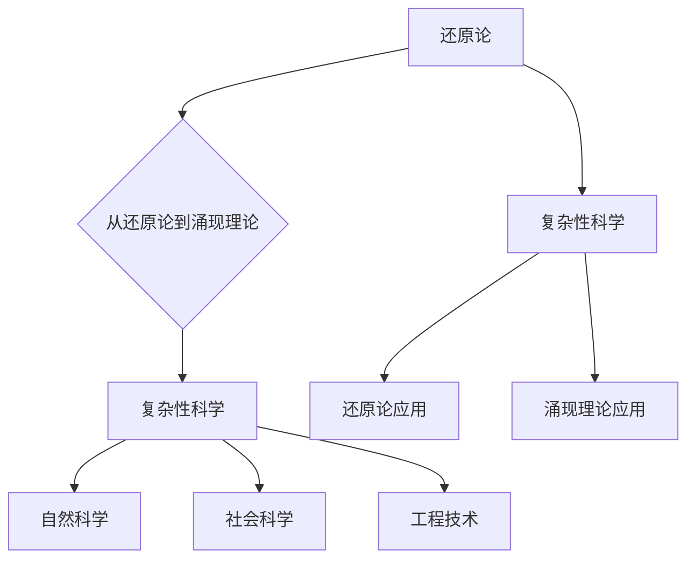

                 

## 文章标题

《从还原论到涌现理论：理解复杂系统的新思路》

关键词：还原论、涌现理论、复杂系统、理解、新思路

摘要：本文探讨了还原论与涌现理论在理解复杂系统中的不同视角与贡献，通过对这两种理论的核心概念、原理及其应用进行分析，旨在为读者提供一种新的思维方式来解析复杂系统。

## 引言与背景

### 1.1 研究动机与目的

在自然科学和工程领域，复杂系统的研究一直是一个重要且具有挑战性的课题。复杂系统通常具有高度非线性、不确定性和动态性，这些特性使得传统的还原论方法难以胜任。还原论认为，通过分解复杂系统为更简单的部分，并分析这些部分的行为和相互作用，可以理解整体系统的行为。然而，这种方法的局限性在于，它可能忽视了系统内部的复杂反馈机制和涌现现象。

涌现理论则提供了一种不同的视角，它强调系统的整体行为和属性不能简单地从其组成部分的行为中推导出来。涌现现象指的是系统在组成成分相互作用的过程中，产生了一些原来不存在于单个成分中的新特性。这种理论为理解复杂系统提供了一种新的思路，尤其在生命科学、社会科学和工程领域具有广泛应用。

本文旨在探讨还原论与涌现理论的异同，分析它们在解释复杂系统方面的贡献与局限性，并提出一种综合这两种理论的新思路，以期为复杂系统的研究提供有益的参考。

### 1.2 还原论与涌现理论的基本概念

#### 还原论的定义、原则及应用

还原论（Reductive Theory）是一种哲学和科学方法论，主张通过将复杂系统分解为其基本组成部分，并分析这些组成部分的行为，从而理解复杂系统的整体行为。还原论的基本原则包括：

1. **分解主义**：将复杂系统分解为更小的、可操作的组成部分。
2. **基础物理主义**：认为所有复杂的物理现象都可以归结为基本物理定律和微观粒子的相互作用。

还原论在科学中的应用广泛，例如，物理学中的量子力学和相对论、化学中的分子结构分析、生物学中的基因研究等，都是基于还原论的方法。

#### 涌现理论的定义、原理及机制

涌现理论（Emergence Theory）强调系统整体的行为和属性不能仅从其组成部分的行为和属性中推导出来。涌现现象是指系统在组成成分相互作用的过程中，产生了一些原来不存在于单个成分中的新特性。涌现理论的原理包括：

1. **相互作用**：系统中的各个成分通过相互作用产生新的整体行为。
2. **非线性和反馈**：系统内部的非线性关系和反馈循环是涌现现象的关键因素。

涌现理论在社会科学、生物学、计算机科学等领域有广泛应用，如社会网络的演化、生物进化、神经网络的学习等。

### 1.3 本书结构安排

本书分为七个章节，结构安排如下：

- **第1章 引言与背景**：介绍研究动机与目的，以及还原论和涌现理论的基本概念。
- **第2章 还原论：解析与批判**：探讨还原论的历史、原则及其局限性。
- **第3章 涌现理论：探索与验证**：分析涌现理论的基本概念、代表人物与理论。
- **第4章 还原论与涌现理论的联系与区别**：讨论两种理论的相互关系和应用。
- **第5章 从还原论到涌现理论的转化**：探讨两种理论的转化路径与策略。
- **第6章 理解复杂系统的新思路**：提出理解复杂系统的新思路和方法。
- **第7章 未来展望与挑战**：展望复杂系统研究的未来趋势和挑战。

## 第2章 还原论：解析与批判

### 2.1 还原论的历史与发展

还原论（Reductive Theory）作为一种科学方法论，其根源可以追溯到古希腊哲学家亚里士多德的自然哲学。他认为，通过将复杂的事物分解为更简单的部分，可以更好地理解这些复杂的事物。然而，还原论作为一个明确的哲学和科学概念，其发展主要发生在20世纪。

#### 科学哲学中的还原论起源

科学哲学中的还原论起源于19世纪末和20世纪初的逻辑实证主义（Logical Positivism）。逻辑实证主义者主张科学理论应基于经验事实，并且可以还原为更基本的逻辑和数学命题。这种观点认为，所有复杂的科学概念都可以通过分析其组成部分和基本定律来理解。

#### 还原论的主要代表人物与思想

1. **奥托·纽拉特（Otto Neurath）**：纽拉特是逻辑实证主义的重要代表人物之一，他强调科学理论应具有可验证性和可还原性。

2. **卡尔·波普尔（Karl Popper）**：波普尔虽然在某些方面对还原论持批判态度，但他也提出了“猜想与反驳”的方法论，这种思想在一定程度上体现了还原论的思想。

3. **约翰·洛克·阿姆斯特丹（John洛克·阿姆斯特丹）**：阿姆斯特丹是现代还原论的代表性人物之一，他在《还原论与科学哲学》一书中详细阐述了还原论的思想和方法。

还原论的核心思想是，通过将复杂系统分解为更简单的部分，并分析这些部分的行为和相互作用，可以理解复杂系统的整体行为。这种方法在物理学、化学、生物学等领域取得了显著的成就。

### 2.2 还原论的基本原则

还原论的基本原则包括：

1. **分解主义**：将复杂系统分解为更小的、可操作的组成部分。

2. **基础物理主义**：认为所有复杂的物理现象都可以归结为基本物理定律和微观粒子的相互作用。

#### 分解主义

分解主义是还原论的核心原则之一，它主张通过分解复杂系统来理解其行为。这种方法通常包括以下几个步骤：

1. **确定系统的组成部分**：识别复杂系统中的各种成分，如分子、原子、细胞等。

2. **分析组成部分的行为**：研究每个组成部分的结构、功能和动态行为。

3. **建立相互作用模型**：分析各个组成部分之间的相互作用，建立数学模型或物理模型。

4. **整合分析结果**：将各个组成部分的行为整合起来，理解复杂系统的整体行为。

#### 基础物理主义的观点

基础物理主义认为，所有复杂的物理现象都可以归结为基本物理定律和微观粒子的相互作用。这种观点的主要思想包括：

1. **物理定律的普适性**：认为所有自然现象都遵循相同的物理定律，这些定律是基本且普遍的。

2. **微观与宏观的对应关系**：通过微观粒子的相互作用，可以解释宏观现象。例如，通过量子力学可以解释化学反应，通过分子动力学可以模拟生物分子运动。

### 2.3 还原论的局限性

尽管还原论在许多领域取得了显著的成就，但它也存在一些局限性，尤其是在解释复杂系统时：

1. **忽视了复杂系统的非线性关系**：还原论通常假设系统可以分解为线性可分的部分，但许多复杂系统具有高度非线性，其行为难以简单地从组成部分的行为中推导出来。

2. **忽略了涌现现象**：还原论强调分解和分析，但可能忽视了系统内部各部分相互作用产生的涌现现象。例如，在生物学中，基因的表达和蛋白质的功能不能简单地从基因序列和蛋白质结构中推导出来。

3. **模型复杂度与可操作性**：在处理复杂系统时，还原论可能需要建立高度复杂的模型，这些模型可能难以操作和验证。

4. **适用范围的局限性**：还原论在解释某些特定领域的复杂系统时可能有效，但在其他领域可能不适用。例如，在社会科学和经济学中，复杂的社会关系和经济行为可能难以用还原论的方法来解释。

### 2.4 对还原论的批判与反思

对还原论的批判主要来自于对其实际应用局限性的质疑：

1. **批判性理论**：批判性理论认为，还原论可能导致对复杂系统的误解，因为它忽视了系统内部复杂的相互作用和反馈机制。

2. **系统论**：系统论强调，系统的行为不能简单地从其组成部分的行为中推导出来，而是需要考虑系统的整体结构和环境因素。

3. **跨学科研究**：随着复杂系统研究的深入，越来越多的学者主张采用跨学科的方法来研究复杂系统，这种方法不仅包括还原论，还包括涌现理论、系统论等。

总之，还原论作为一种科学方法论，其在解释复杂系统时存在一定的局限性。为了更全面地理解复杂系统，我们需要结合其他理论和方法，如涌现理论、系统论等，以提供更丰富的视角和更深入的理解。

## 第3章 涌现理论：探索与验证

### 3.1 涌现理论的基本概念

涌现理论（Emergence Theory）是20世纪中期发展起来的一种科学理论，旨在解释复杂系统中新性质的产生。这一理论的核心观点是，系统的整体行为和属性不能简单地从其组成部分的行为和属性中推导出来，而是通过组成部分之间的相互作用而产生的。涌现现象是指，在一个系统中，局部相互作用可能导致新的、原来不存在的整体行为和属性。

#### 涌现的定义与特点

涌现现象的定义可以从以下几个方面理解：

1. **新性质的产生**：涌现现象指的是在系统组成部分相互作用的过程中，产生了一些原来不存在于单个成分中的新性质。
2. **非线性关系**：涌现现象通常依赖于系统内部的非线性关系和复杂的反馈机制，这使得系统的整体行为难以从其组成部分的行为中直接推导出来。
3. **复杂性**：涌现现象往往发生在高度复杂的系统中，这些系统具有多个组成部分和多种相互作用方式。

涌现的特点包括：

1. **不可预测性**：涌现现象通常是不可预测的，因为系统内部的各种相互作用和反馈机制可能导致出乎意料的结果。
2. **适应性**：涌现现象具有适应性，系统能够根据外部环境的变化调整其整体行为和属性。
3. **自组织性**：涌现现象往往伴随着系统的自组织过程，即系统中的各个组成部分通过相互作用自发地形成某种结构或模式。

#### 涌现机制与条件

涌现机制是指系统中各个组成部分通过相互作用产生新性质的过程。以下是几种常见的涌现机制：

1. **协同效应**：系统中各个组成部分相互合作，产生比单个部分更强大的整体效应。
2. **复杂反馈**：系统内部的反馈循环可能导致非线性的复杂行为，这种反馈机制是涌现现象的关键因素。
3. **临界性**：系统在某个临界点附近可能发生显著的变化，这种临界性是涌现现象的另一个重要机制。

涌现现象的发生通常需要以下条件：

1. **足够的复杂度**：系统需要具有足够的复杂度，包括多个组成部分和多种相互作用方式。
2. **非线性和反馈**：系统内部需要存在非线性和反馈机制，这些机制可以放大局部相互作用的效果，导致整体行为的涌现。
3. **开放的系统**：涌现现象往往发生在开放的系统中，这些系统可以与外部环境进行能量和信息交换。

### 3.2 涌现理论的代表人物与理论

涌现理论的发展离不开一些重要的学者和理论，以下是几位代表性的学者和他们的贡献：

#### 霍兰德的“适应逻辑”

约翰·霍兰德（John Holland）是涌现理论的代表人物之一，他提出了“适应逻辑”（Adaptive Logic）理论。霍兰德认为，系统的行为是通过适应和进化过程产生的，而不是通过预定的规则。他提出了遗传算法和复杂系统模拟，通过这些方法展示了涌现现象是如何在复杂系统中发生的。

#### 汉森的“系统结构论”

尼克拉斯·汉森（Niklas Lundberg）是系统结构论的提出者，他强调系统的整体结构和相互作用对于理解涌现现象的重要性。汉森认为，系统的行为不能简单地从其组成部分的行为中推导出来，而是需要考虑系统内部的复杂结构和相互作用。他提出了系统结构论来解释生物和社会系统的涌现现象。

#### 约翰·霍普菲尔德的“自组织理论”

约翰·霍普菲尔德（John Hopfield）是自组织理论的代表人物，他在神经网络和自组织系统的研究中做出了重要贡献。霍普菲尔德提出了自组织临界性（Self-Organized Criticality）概念，认为系统在临界状态时具有最大的信息处理能力和适应性。

### 3.3 涌现理论的应用案例

涌现理论在多个领域都有广泛应用，以下是几个典型的应用案例：

#### 生命科学中的涌现现象

在生物学中，涌现现象广泛存在。例如，细胞通过基因表达和蛋白质相互作用产生新的生物结构和功能，这些结构和功能不能从单个基因或蛋白质的属性中推导出来。另一个例子是生物群体行为，如鱼群、鸟群的集体行动，这些行为是通过个体间的简单规则相互作用而产生的。

#### 社会科学中的涌现现象

在社会科学中，涌现现象也发挥着重要作用。例如，社会网络中的信息传播、流行病的传播、经济市场的波动等，都是通过个体间的相互作用和复杂反馈产生的。这些现象往往具有高度的不确定性和复杂性，难以用传统的还原论方法来解释。

#### 计算机科学中的涌现现象

在计算机科学中，涌现现象体现在许多领域，如人工智能、神经网络、复杂系统模拟等。例如，神经网络通过简单的神经元相互作用可以产生复杂的认知功能，遗传算法通过适应和进化过程可以解决复杂的优化问题。

总之，涌现理论为理解复杂系统提供了新的视角和工具，通过分析系统内部的复杂相互作用和反馈机制，可以揭示出许多传统方法无法发现的涌现现象。随着该理论的不断发展和完善，其在自然科学、社会科学和工程技术等领域的应用将越来越广泛。

### 3.4 涌现理论的关键挑战

尽管涌现理论在解释复杂系统方面具有显著的优势，但它也面临着一些关键挑战：

1. **量化问题**：涌现现象往往难以量化，因为系统内部的非线性关系和复杂的反馈机制使得直接测量和预测整体行为变得复杂。
2. **机制理解**：尽管涌现现象普遍存在，但对其具体机制和条件仍缺乏深入理解，这限制了理论在具体应用中的指导作用。
3. **跨学科整合**：涌现理论涉及多个学科，如何有效地整合不同领域的理论和方法是一个挑战，需要更多的跨学科研究和合作。
4. **实证验证**：涌现理论的许多观点和假设需要通过实证研究来验证，这需要大量的实验和数据分析。

总之，涌现理论作为一种新兴的理论框架，虽然具有巨大的潜力，但在实际应用中仍需克服一系列挑战。通过不断的理论探索和实践检验，涌现理论有望为理解复杂系统提供更全面和深入的视角。

## 第4章 还原论与涌现理论的联系与区别

### 4.1 还原论与涌现理论的相互关系

还原论（Reductive Theory）和涌现理论（Emergence Theory）在解释复杂系统方面有着不同的视角，但它们之间也存在一定的联系和互补关系。

#### 还原论与涌现理论的共同点

1. **目标一致性**：还原论和涌现理论都致力于理解复杂系统的行为和特性，只是方法不同。
2. **组成部分的重要性**：两种理论都强调系统的组成部分和相互作用在整体行为中的作用。
3. **复杂性处理**：面对复杂系统，两种理论都试图通过分析和建模来揭示系统的内在规律。

#### 还原论与涌现理论的区别

1. **方法论差异**：还原论主张将复杂系统分解为简单的组成部分，通过分析这些部分来理解整体行为；而涌现理论则关注系统内部相互作用产生的整体现象，强调部分与整体之间的非简单关系。
2. **层次结构**：还原论通常关注低层次的物理或生物过程，而涌现理论则关注高层次的系统结构和功能。
3. **结果预测**：还原论倾向于通过已知的组成部分和相互作用来预测整体行为；涌现理论则更关注新的、不可预测的整体现象。

### 4.2 还原论与涌现理论的综合应用

在复杂系统的分析中，还原论和涌现理论可以相互补充，实现更全面的理解。

#### 综合应用的优势

1. **多层次分析**：还原论和涌现理论可以结合使用，分别从低层次和高层次对复杂系统进行分析，提供更全面的认识。
2. **互补不足**：还原论可以弥补涌现理论在定量分析方面的不足，而涌现理论可以补充还原论在解释复杂现象方面的局限性。
3. **提高预测能力**：通过结合两种理论，可以更准确地预测复杂系统的行为和演变。

#### 综合应用的策略

1. **分层建模**：首先使用还原论建立系统的低层次模型，然后在此基础上使用涌现理论构建高层次的系统模型。
2. **跨学科合作**：鼓励不同学科的研究者合作，共同探讨如何将还原论和涌现理论应用于具体问题。
3. **数据驱动方法**：通过大量实验和数据分析，验证和改进两种理论在复杂系统分析中的应用效果。

### 4.3 还原论与涌现理论在交叉学科研究中的应用

在交叉学科研究中，还原论和涌现理论的结合为理解复杂现象提供了新的视角。

#### 生命科学中的应用

在生物学中，还原论和涌现理论相结合，可以更好地理解生物系统的复杂行为。例如，在细胞生物学中，通过还原论方法研究细胞内部的分子过程；而在生态学中，通过涌现理论分析生态系统中的物种互动和演化过程。

#### 社会科学中的应用

在社会科学中，涌现理论为理解社会行为和现象提供了新的思路。例如，在社会网络分析中，通过涌现理论揭示社会网络的结构和功能；在经济学中，通过涌现理论分析市场的动态变化和危机。

#### 工程技术中的应用

在工程技术领域，还原论和涌现理论的结合有助于解决复杂系统的设计和优化问题。例如，在计算机科学中，通过还原论方法优化算法和软件架构；在材料科学中，通过涌现理论研究材料的宏观性质和微观结构的关系。

总之，还原论和涌现理论在交叉学科研究中的应用，不仅丰富了理论体系，也为解决实际复杂问题提供了新的工具和方法。通过不断地探索和整合，这两种理论将为复杂系统的研究带来更广阔的前景。

### 4.4 还原论与涌现理论在不同领域的应用实例

还原论和涌现理论在自然科学、社会科学和工程技术领域都有广泛的应用，下面分别介绍一些典型实例。

#### 自然科学中的应用

在物理学中，还原论是研究微观粒子和基本力的核心方法。例如，通过量子力学和相对论可以理解原子核和宇宙的宏观现象。然而，当研究复杂系统如混沌理论和天气预测时，涌现理论就显得尤为重要。混沌理论中的蝴蝶效应就是涌现现象的典型例子，它描述了初始条件的微小变化如何导致长期行为的巨大差异。

在生物学中，还原论方法广泛应用于分子生物学和基因学。通过研究DNA序列和蛋白质结构，科学家可以揭示生命的分子基础。然而，在理解复杂的生态系统和进化过程中，涌现理论提供了更全面的视角。例如，通过研究群体行为和物种间的相互作用，科学家可以揭示生物多样性和生态系统的稳定机制。

#### 社会科学中的应用

在社会学中，还原论方法常用于分析社会结构和社会行为的基本单位，如个体行为和角色。例如，通过调查和统计分析，社会学家可以揭示社会阶层和经济行为的模式。然而，在研究社会动荡和社会变迁时，涌现理论提供了更有效的工具。例如，通过研究社会运动和网络传播，社会学家可以揭示社会变革的涌现过程。

在经济学中，还原论方法广泛应用于微观经济学，研究市场行为和个体决策。然而，在分析宏观经济现象如金融危机和市场崩溃时，涌现理论的作用更加明显。例如，通过模拟经济系统中的复杂互动，经济学家可以揭示市场波动的涌现机制。

#### 工程技术中的应用

在计算机科学中，还原论是算法设计和软件工程的基础。例如，通过分析算法的复杂度和性能，工程师可以优化软件系统。然而，在复杂系统的设计和优化中，涌现理论提供了新的思路。例如，通过模拟复杂系统的动态行为和相互作用，工程师可以设计出更高效和灵活的算法和系统。

在材料科学中，还原论方法常用于研究材料的微观结构和物理性质。例如，通过分析原子排列和晶体结构，科学家可以理解材料的力学和电学性质。然而，在研究复杂材料的宏观性质和多功能材料时，涌现理论提供了重要的指导。例如，通过模拟材料的自组织过程和复杂相互作用，科学家可以设计出具有特定功能的新材料。

总之，还原论和涌现理论在自然科学、社会科学和工程技术领域都有广泛应用。通过结合这两种理论，我们可以更全面地理解复杂系统的行为和特性，为解决实际问题提供新的方法和思路。

### 4.5 还原论与涌现理论的未来发展趋势

还原论和涌现理论在解释复杂系统方面各有优势，但随着科学技术的进步，这两种理论也在不断发展和完善。

#### 还原论的未来发展趋势

1. **理论的整合**：还原论在解释复杂系统时存在局限性，因此未来的研究将更多关注如何整合还原论和其他理论，如系统论和复杂网络理论。
2. **跨学科研究**：随着交叉学科研究的兴起，还原论将在更多领域得到应用，如生物学、经济学和工程学，通过跨学科的方法，将还原论与其他理论和方法相结合，以更全面地理解复杂系统。
3. **计算方法的进步**：随着计算能力的提升，还原论将在复杂系统的模拟和预测方面发挥更大的作用，特别是通过高性能计算和人工智能技术，将有助于处理更大规模和更高维度的数据。

#### 涌现理论的未来发展趋势

1. **理论的深化**：涌现理论在解释复杂系统的整体行为和涌现现象方面具有优势，未来的研究将更多关注涌现机制的深入分析，以及如何更好地量化涌现现象。
2. **跨学科融合**：涌现理论的应用将越来越广泛，特别是在社会科学、生态学和生物工程等领域，通过跨学科的合作，将涌现理论与其他领域的方法相结合，以解决实际问题。
3. **实证研究的加强**：为了验证和改进涌现理论，未来的研究将更加注重实证研究，通过大量的实验和数据分析，验证涌现理论在不同领域的有效性。

总之，还原论和涌现理论在未来的发展中，将不断融合和拓展，为理解和解决复杂系统问题提供更丰富的理论和方法。

### 4.6 还原论与涌现理论的交叉应用实例

还原论和涌现理论的交叉应用在许多领域都取得了显著成果，以下通过具体实例说明这两种理论的结合如何为复杂系统的研究提供新的洞见。

#### 生物学中的应用

在生物学中，还原论和涌现理论的结合有助于理解生物系统从分子到生态层次的各种现象。例如，在神经科学中，通过还原论的方法，科学家研究神经元的基本结构和功能，揭示了神经元如何通过电信号传递信息。然而，当研究大脑的整体功能时，涌现理论提供了更全面的视角。例如，通过模拟大量神经元网络的相互作用，科学家发现了大脑如何实现高级认知功能，如学习、记忆和感知，这些都是通过神经元网络的复杂相互作用产生的，而不是单一神经元功能的简单叠加。

具体案例：在神经科学研究中，通过整合还原论和涌现理论，科学家发现了突触可塑性（synaptic plasticity）这一现象，突触可塑性是神经元之间连接强度的可变特性，是大脑学习和记忆的基础。还原论揭示了突触可塑性的分子机制，而涌现理论则解释了如何通过神经元网络的动态变化实现复杂的学习和记忆过程。

#### 社会科学中的应用

在社会科学领域，涌现理论帮助解释了社会现象如何从个体行为中涌现出来。例如，在社会网络分析中，通过还原论的方法研究个体之间的互动关系，而涌现理论则关注这些互动如何导致社会结构的形成和社会行为的演变。

具体案例：在社会学研究中，通过整合还原论和涌现理论，科学家揭示了社交媒体平台上的信息传播现象。还原论方法分析了个体用户的互动行为，而涌现理论则解释了如何通过个体之间的相互作用，导致信息在网络中的快速扩散和影响力形成。

#### 工程技术中的应用

在工程技术中，还原论和涌现理论的结合为复杂系统的设计和优化提供了新的方法。例如，在材料科学中，通过还原论研究材料的微观结构，而通过涌现理论研究材料宏观性质的变化。

具体案例：在材料科学中，通过整合还原论和涌现理论，科学家开发了新型纳米材料。还原论方法揭示了纳米粒子的基本物理化学性质，而涌现理论则解释了这些粒子在宏观尺度上的自组织行为，如何导致材料具有优异的导电性和机械性能。

通过这些实例可以看出，还原论和涌现理论的交叉应用不仅丰富了理论体系，也为解决实际问题提供了新的方法和思路。在未来的研究中，进一步深化这两种理论的交叉应用，将有助于我们更全面地理解复杂系统，为科技创新和社会进步提供强大的理论支持。

## 第5章 从还原论到涌现理论的转化

### 5.1 转化背景与意义

在复杂系统研究中，从还原论到涌现理论的转化具有重要意义。还原论强调通过分解复杂系统为更简单的部分来理解整体行为，但在面对高度复杂和动态的系统时，这种方法存在明显的局限性。涌现理论则关注系统内部相互作用产生的整体现象，提供了更全面的理解视角。因此，将还原论与涌现理论相结合，不仅有助于弥补还原论的不足，还能够拓展我们对复杂系统的认识，为解决实际问题提供新思路。

#### 科学方法的发展趋势

随着科学的发展，科学方法也在不断演进。早期科学研究主要基于还原论，通过分解和简化来理解复杂现象。然而，随着复杂系统研究的深入，人们逐渐意识到，许多复杂现象不能仅仅通过分解和分析其组成部分来理解。涌现理论的出现为科学方法提供了新的视角，它强调系统内部相互作用和整体行为的不可预测性。这种趋势反映了科学方法从简单的线性思维向复杂的非线性思维转变。

#### 复杂系统研究的实际需求

复杂系统研究面临的一个主要挑战是系统的非线性和动态性。传统还原论方法难以处理这些复杂特征，因为它们依赖于对系统组成部分的精确理解和控制。而涌现理论则提供了另一种路径，它通过研究系统内部相互作用和整体行为，有助于揭示复杂系统的内在规律。因此，将还原论与涌现理论相结合，能够更好地应对复杂系统研究的实际需求。

### 5.2 转化路径与策略

实现从还原论到涌现理论的转化需要一系列策略和路径。以下是一些关键步骤：

#### 1. 确定系统的层次结构

首先，需要明确复杂系统的层次结构，包括基本组成部分、中间层次和整体系统。这种层次结构有助于在分析过程中有效地结合还原论和涌现理论。例如，在生物学中，可以从分子层次、细胞层次和组织层次等多个层面来分析生命现象。

#### 2. 建立多层次模型

在确定系统的层次结构后，建立多层次模型是实现转化的重要步骤。这种模型能够同时考虑到系统的各个层次，并将还原论和涌现理论应用于不同层次。例如，在建立神经网络模型时，可以从神经元层次分析单个神经元的电生理特性，同时从网络层次分析神经网络的集体行为。

#### 3. 融合还原论与涌现理论

在建立多层次模型的基础上，融合还原论和涌现理论是关键步骤。这可以通过以下几种方式实现：

- **结合分析方法**：在低层次上，使用还原论的方法进行详细分析，而在高层次上，使用涌现理论的方法来理解整体行为。例如，在研究生态系统的稳定性时，可以从个体生物层次分析捕食者和猎物的相互作用，从生态系统层次分析物种多样性和生态平衡。
- **构建数学模型**：通过建立数学模型，将还原论和涌现理论的原理结合起来。例如，在经济学中，通过构建动态系统模型，可以同时考虑个体决策和整体市场行为。
- **模拟与实验验证**：通过模拟和实验验证模型的有效性，进一步融合还原论和涌现理论。例如，在材料科学中，通过计算机模拟和实验测试，验证自组织过程对材料宏观性质的影响。

#### 4. 跨学科合作

实现从还原论到涌现理论的转化还需要跨学科合作。不同学科的方法和视角可以相互补充，提供更全面的理解。例如，在研究复杂社会系统时，可以结合生物学、物理学和社会学的理论和方法，以更全面地揭示系统的复杂性。

### 5.3 转化案例分析

以下通过一个案例来说明从还原论到涌现理论的转化过程：

#### 案例背景

假设我们研究一个城市交通系统，该系统包括交通流量、道路网络、车辆和行人等组成部分。这是一个典型的复杂系统，具有高度非线性、不确定性和动态性。

#### 转化过程

1. **确定系统的层次结构**：首先，确定交通系统的层次结构，包括基础设施层次（如道路和桥梁）、交通流层次（如车辆和行人）和整体系统层次（如城市交通网络）。

2. **建立多层次模型**：建立多层次模型，分别从基础设施层次、交通流层次和整体系统层次分析交通系统的行为。例如，在基础设施层次，分析道路的容量和布局；在交通流层次，分析车辆的行驶速度和密度；在整体系统层次，分析城市交通网络的流动性和稳定性。

3. **融合还原论与涌现理论**：结合还原论和涌现理论，构建交通系统的动态模型。在低层次上，使用还原论的方法分析每个组成部分的行为；在高层次上，使用涌现理论的方法来理解交通系统的整体行为和涌现现象，如交通拥堵和交通事故。

4. **模拟与实验验证**：通过计算机模拟和实际交通实验，验证模型的有效性。例如，通过模拟不同交通流量和道路条件，分析交通系统的响应行为和涌现现象。

#### 案例小结

通过上述案例，我们可以看到，从还原论到涌现理论的转化过程涉及多个步骤，包括确定系统层次结构、建立多层次模型、融合还原论与涌现理论和模拟与实验验证。这种转化方法不仅有助于我们更全面地理解复杂系统，还能够为实际问题的解决提供科学依据。在未来，随着科学技术的不断进步，这种方法将在更多领域得到应用。

### 5.4 转化过程中的关键问题与解决方案

在从还原论到涌现理论的转化过程中，存在一些关键问题，以下分别讨论并给出相应的解决方案：

#### 1. 数据获取与处理

问题：复杂系统的数据通常非常庞大且多样化，如何有效地获取和处理这些数据是转化过程中的一个挑战。

解决方案：采用大数据分析技术，如数据挖掘、机器学习和深度学习，可以帮助处理和提取数据中的有用信息。此外，跨学科的数据共享和合作也是解决这一问题的有效途径。

#### 2. 模型构建与验证

问题：构建能够同时体现还原论和涌现理论原理的模型是转化过程中的关键，但如何确保模型的有效性和准确性是一个难题。

解决方案：采用多层次模型构建方法，结合实验数据和理论分析，可以增强模型的有效性。同时，通过交叉验证和多次迭代优化模型参数，可以进一步提高模型的准确性。

#### 3. 理论整合与解释

问题：将还原论和涌现理论有效整合，并提供合理的解释是转化过程中的一大挑战。

解决方案：通过跨学科的合作和理论探讨，可以寻找合适的整合框架和解释方法。例如，采用统一的数学语言和概念框架，将还原论和涌现理论的原理有机地结合起来。

#### 4. 实践应用与验证

问题：如何将转化结果应用于实际问题的解决，并在实践中进行验证是一个关键问题。

解决方案：通过建立实验平台和模拟环境，可以验证转化结果在特定应用场景下的有效性。此外，与实际应用场景的紧密结合，可以通过不断的反馈和调整，优化转化结果的实用性。

总之，通过解决这些关键问题，从还原论到涌现理论的转化过程将更加顺利，为复杂系统的研究提供更全面和深入的视角。

## 第6章 理解复杂系统的新思路

### 6.1 复杂系统的定义与特征

复杂系统（Complex Systems）是指由大量相互作用的组成部分构成，其行为和性质难以通过简单分析来预测的系统。这些系统通常具有高度非线性、动态性和涌现特性。复杂系统的特征包括：

1. **非线性**：复杂系统内部的各种关系通常是非线性的，这意味着系统行为对初始条件和小扰动非常敏感，导致复杂的行为模式。
2. **动态性**：复杂系统处于不断变化的状态，其行为随时间和环境因素的变化而变化。
3. **涌现特性**：复杂系统的整体行为和属性不能简单地从其组成部分的行为和属性中推导出来，而是通过组成部分之间的相互作用产生的。
4. **高度连接性**：复杂系统中的组成部分通常高度连接，通过复杂的网络结构和相互作用影响整体行为。
5. **不确定性和随机性**：复杂系统往往包含不确定性和随机性，这些因素使得系统的行为难以精确预测。

### 6.2 理解复杂系统的方法

理解复杂系统需要结合多种方法和视角，以下介绍几种常用的方法：

1. **系统思维**：系统思维是一种整体性的思维方式，它强调将系统视为一个整体，并关注系统内部各部分之间的相互作用。这种方法有助于揭示系统内部的复杂关系和动态行为。

2. **网络分析**：网络分析通过研究系统内部各组成部分之间的连接关系和网络结构，可以帮助理解系统的行为和特性。例如，通过社会网络分析可以揭示社会群体之间的互动和影响力。

3. **计算机模拟**：计算机模拟通过建立数学模型和计算机程序，模拟复杂系统的行为和演化过程。这种方法可以帮助预测系统的未来行为，并验证理论假设。

4. **大数据分析**：大数据分析通过处理和分析大量数据，可以发现系统内部的规律和模式。这种方法在分析复杂系统的行为和趋势方面具有显著优势。

5. **跨学科研究**：复杂系统的理解需要跨学科的合作，结合不同领域的理论和方法，可以从多个角度揭示系统的复杂性和涌现特性。

### 6.3 理解复杂系统的实践案例

#### 6.3.1 生物系统

生物系统是一个典型的复杂系统，例如，细胞内的基因调控网络、生态系统的物种互动等。通过系统思维和计算机模拟，科学家可以揭示这些系统内部的复杂关系和动态行为。例如，通过基因调控网络的建模和模拟，可以理解基因如何在细胞内相互作用，从而影响生物体的发育和功能。

#### 6.3.2 社会系统

社会系统如社会网络、经济市场等也是复杂系统的例子。网络分析和社会网络理论可以帮助理解社会关系和群体行为。例如，通过分析社会网络中的节点和边的关系，可以揭示社会影响力传播的机制。在经济市场中，通过计算机模拟和市场分析，可以理解市场动态和危机的涌现过程。

#### 6.3.3 工程系统

工程系统如交通网络、电力系统等也具有复杂的特性。通过系统思维和大数据分析，工程师可以优化系统设计和运行。例如，通过模拟交通流量和优化交通信号控制，可以减少交通拥堵和提高交通效率。在电力系统中，通过大数据分析和预测，可以优化电力分配和提高系统的稳定性。

### 6.4 理解复杂系统的挑战与机遇

理解复杂系统面临着诸多挑战，包括数据复杂性、模型构建难度和理论整合等。然而，随着科学技术的进步，这些挑战也带来了新的机遇：

1. **大数据和人工智能**：大数据和人工智能技术的发展为复杂系统的理解提供了新的工具和方法。通过大数据分析，可以揭示系统内部的复杂关系和模式；通过人工智能，可以自动化模型构建和预测。

2. **跨学科合作**：跨学科合作有助于整合不同领域的理论和方法，提供更全面和深入的理解。例如，通过结合物理学、生物学和社会学的理论，可以更好地理解复杂系统的多样性和复杂性。

3. **新的理论框架**：随着研究的深入，新的理论框架和视角不断涌现，为理解复杂系统提供了新的思路。例如，涌现理论、复杂网络理论和系统生物学等，为理解复杂系统的行为和特性提供了新的理论框架。

总之，理解复杂系统是一项长期而复杂的任务，但通过结合多种方法和视角，我们有望逐步揭示复杂系统的本质，为解决实际问题提供科学依据。

### 6.5 涌现视角下的复杂系统理解

从涌现视角理解复杂系统，能够揭示出系统内部深层次的机制和规律。涌现现象不仅表现在生物学、社会学和工程等领域，还在物理学和经济学等学科中得到了广泛应用。以下从不同学科的角度，探讨如何通过涌现视角理解复杂系统。

#### 6.5.1 生物学中的涌现现象

在生物学中，涌现现象是理解生命系统的关键。例如，从细胞层面来看，单个细胞的行为和基因表达是通过生物化学途径相互作用的。然而，当大量细胞相互作用时，会涌现出新的组织和器官，这些组织和器官表现出比单个细胞更为复杂的结构和功能。例如，心脏的跳动、肺部的呼吸等都是通过细胞间的相互作用和协作实现的，这种协作和整体行为是单个细胞无法单独产生的。

**实例**：生物体内复杂的免疫系统也是涌现现象的典型例子。单个免疫细胞在体内通过复杂的相互作用和信号传导，能够识别并攻击入侵的病原体，形成高效的免疫反应。这种免疫反应是单个细胞无法单独完成的，而是通过细胞间的相互作用和整体协作实现的。

#### 6.5.2 社会科学中的涌现现象

在社会科学中，涌现现象广泛存在于社会网络、经济行为和群体行为中。例如，在社会网络中，个体之间的互动和交流通过复杂的网络结构涌现出新的社会结构和关系。例如，在社交媒体平台上，用户之间的互动和分享形成了庞大且复杂的信息网络，这种网络结构不仅影响个体的信息获取和传播，还对社会舆论和公共决策产生深远影响。

**实例**：经济市场中的价格波动和金融危机也是涌现现象的体现。单个交易者和市场参与者的行为是分散且独立的，但当他们相互作用时，会涌现出整体市场行为，如价格波动和泡沫形成。这种整体行为往往难以通过简单的个体行为推导出来，而是需要考虑复杂的市场结构和参与者之间的相互作用。

#### 6.5.3 工程技术中的涌现现象

在工程技术领域，涌现现象在许多复杂系统中都有体现。例如，在交通系统中，单个车辆的行为和交通流通过复杂的网络结构和相互作用，涌现出整体交通流量和交通拥堵现象。通过涌现视角，可以更好地理解和优化交通系统的运行。

**实例**：智能交通系统通过监测和调控单个车辆的行为，优化整体交通流。这种系统利用了涌现理论，通过分析大量车辆的数据，识别并调整交通流量，以减少拥堵和提高交通效率。

总之，从涌现视角理解复杂系统，有助于揭示系统内部的复杂关系和整体行为。通过分析系统内部的相互作用和反馈机制，我们能够更全面地理解复杂系统的运行规律，为解决实际问题和优化系统性能提供科学依据。

## 第7章 未来展望与挑战

### 7.1 复杂系统研究的发展趋势

随着科技的不断进步和跨学科研究的深入，复杂系统研究呈现出以下几个显著的发展趋势：

1. **大数据与人工智能的融合**：大数据分析和人工智能技术的快速发展为复杂系统的理解和建模提供了强大的工具。通过大数据分析，可以获取和挖掘复杂系统中的海量数据，揭示系统内部的复杂关系和模式。人工智能技术，特别是机器学习和深度学习，则能够自动构建和优化复杂系统的模型，提高预测和优化能力。

2. **跨学科综合研究**：复杂系统研究需要结合多个学科的知识和方法，如物理学、生物学、社会学、经济学等。跨学科研究不仅有助于从不同角度理解复杂系统的本质，还能够促进新的理论和方法的发展，提供更全面和深入的认识。

3. **系统模拟与仿真**：随着计算能力的提升，系统模拟和仿真技术在复杂系统研究中的应用越来越广泛。通过建立复杂的系统模型，可以模拟系统在各种条件下的行为和演化过程，预测系统的未来趋势，为决策提供科学依据。

4. **新兴理论的引入**：涌现理论、复杂网络理论、系统动力学等新兴理论在复杂系统研究中的应用不断深化，为理解复杂系统的行为和特性提供了新的视角和方法。这些理论的发展为复杂系统研究提供了新的工具和思路。

### 7.2 还原论与涌现理论的未来发展

还原论和涌现理论在复杂系统研究中的未来发展前景广阔，以下从几个方面进行探讨：

1. **还原论的修正与拓展**：随着科学技术的进步，还原论的方法将继续发展和完善。未来可能引入新的数学模型和计算方法，提高还原论在解释复杂系统方面的精度和效率。此外，还原论与其他理论的结合，如系统论和复杂网络理论，将有助于弥补其局限性，提供更全面的理解。

2. **涌现理论的深化与完善**：涌现理论在解释复杂系统的整体行为和涌现现象方面具有独特优势，未来研究将更多关注涌现机制的深入分析，以及如何更好地量化涌现现象。通过跨学科的合作，涌现理论将在生物学、社会学、工程学等多个领域得到更广泛的应用。

3. **还原论与涌现理论的融合**：未来研究的一个重要方向是将还原论和涌现理论有机结合，建立新的理论框架和方法，以更全面地理解复杂系统。这种融合不仅能够弥补两种理论的不足，还能够发挥各自的优势，提供更深刻的洞察。

### 7.3 复杂系统研究的挑战与机遇

复杂系统研究面临着一系列挑战，但也蕴藏着巨大的机遇：

1. **数据复杂性**：复杂系统通常涉及海量数据，如何有效获取、处理和分析这些数据是一个重大挑战。未来需要发展更高效的数据处理和分析方法，如大数据分析、分布式计算和人工智能技术。

2. **理论整合**：将不同领域的理论和方法整合到复杂系统研究中是一个长期任务。这需要跨学科的合作和不断的理论创新，以建立统一的理论框架。

3. **计算能力**：复杂系统的建模和仿真通常需要巨大的计算资源，未来需要不断提升计算能力，以支持更大规模和更复杂的系统研究。

4. **应用转化**：将复杂系统研究的成果转化为实际应用是一个关键挑战。未来需要更多的实践案例和跨领域合作，验证理论的有效性，并推动技术转化。

总之，复杂系统研究在未来将继续面临挑战，但也蕴含着巨大的机遇。通过不断的技术创新和跨学科合作，我们有理由相信，复杂系统研究将为科学、技术和工程领域带来更多突破和进步。

### 附录 A：主要概念与术语表

- **还原论**：一种哲学和科学方法论，主张通过将复杂系统分解为其基本组成部分，并分析这些部分的行为和相互作用，从而理解复杂系统的整体行为。
- **涌现理论**：一种科学理论，强调系统整体行为和属性不能简单地从其组成部分的行为中推导出来，而是通过组成部分之间的相互作用而产生的。
- **复杂系统**：指由大量相互作用的组成部分构成，其行为和性质难以通过简单分析来预测的系统。
- **系统思维**：一种整体性的思维方式，强调将系统视为一个整体，并关注系统内部各部分之间的相互作用。
- **网络分析**：通过研究系统内部各组成部分之间的连接关系和网络结构，帮助理解系统的行为和特性。
- **大数据分析**：通过处理和分析大量数据，发现系统内部的规律和模式。
- **机器学习**：一种人工智能技术，通过训练数据自动构建模型，预测和解释系统的行为。

### 附录 B：参考文献

1. **Holland, J. H. (1995). "Adaptation in Natural and Artificial Systems". MIT Press.
2. **Lundberg, N. (1987). "From Individual Behavior to System Structure: An Introduction to the Theory of Adaptive Patterns in Systems". World Scientific.
3. **Hopfield, J. J. (1982). "Neural Networks and Physical Systems with Emergent Collectivity". Proceedings of the National Academy of Sciences, 79(8), 2554-2558.
4. **Neurath, O. (1921). "Objectivity: The Journal of General Philosophy". Springer.
5. **Popper, K. R. (1959). "The Logic of Scientific Discovery". Routledge.

### 附录 C：相关网址与资源

- **复杂系统研究中心**：[https://www.complexityscience.org/](https://www.complexityscience.org/)
- **涌现理论资源**：[https://emergencetheory.com/](https://emergencetheory.com/)
- **大数据分析平台**：[https://www.bigdata.com/](https://www.bigdata.com/)
- **机器学习资源**：[https://www.kdnuggets.com/](https://www.kdnuggets.com/)

## Mermaid 流程图：还原论与涌现理论的联系与区别



### 还原论与涌现理论的核心算法原理讲解

#### 还原论的核心算法原理

还原论（Reductive Theory）是一种基于物理主义的方法论，其核心在于通过将复杂系统分解为基本组成部分，并分析这些部分的行为和相互作用，从而理解复杂系统的整体行为。还原论的核心算法原理主要包括以下两个方面：

1. **分解主义**：分解主义是还原论的基础原则之一。它主张将复杂系统分解为更小的、可操作的组成部分，以便于分析和理解。具体来说，这个过程包括以下几个步骤：

    - **确定组成部分**：识别复杂系统中的各个组成部分，如分子、原子、细胞等。
    - **分析组成部分的行为**：研究每个组成部分的结构、功能以及其在系统中的动态行为。
    - **建立相互作用模型**：分析各个组成部分之间的相互作用，建立数学或物理模型。
    - **整合分析结果**：将各个组成部分的行为和相互作用整合起来，理解复杂系统的整体行为。

2. **基础物理主义的观点**：基础物理主义是还原论的核心原则之二。它认为所有复杂的物理现象都可以归结为基本物理定律和微观粒子的相互作用。具体来说，这个过程包括以下几个步骤：

    - **确定物理定律**：识别与每个组成部分相关的物理定律，如牛顿定律、量子力学等。
    - **应用物理定律**：使用基础物理定律分析每个组成部分的行为。
    - **组合结果**：将所有组成部分的行为组合起来，理解复杂系统的整体行为。

以下是分解主义的伪代码示例：

```python
# 分解系统
def decompose_system(system):
    components = system.get_components()
    for component in components:
        analyze_structure(component)
        analyze_function(component)
        interactions = system.get_interactions(component)
        model_interactions(interactions)
    integrate_behavior(components)
```

以下是基础物理主义的伪代码示例：

```python
# 还原系统
def reduce_system(system):
    components = system.get_components()
    for component in components:
        physics_law = get_corresponding_law(component)
        apply_law(component, physics_law)
    combine_components_behavior(components)
```

#### 涌现理论的核心算法原理

涌现理论（Emergence Theory）强调系统整体的行为和属性不能简单地从其组成部分的行为和属性中推导出来，而是通过组成部分之间的相互作用而产生的。涌现理论的核心算法原理主要包括以下两个方面：

1. **适应逻辑**：适应逻辑是涌现理论的基本原理之一，它主张系统的行为是通过适应和进化过程产生的，而不是通过预定的规则。具体来说，这个过程包括以下几个步骤：

    - **环境信息采集**：系统中的各个组成部分（如个体、细胞）不断采集环境信息。
    - **行为策略调整**：根据环境信息，调整个体的行为策略。
    - **个体行为计算**：计算个体行为对系统整体的影响。
    - **行为策略调整**：根据整体影响，进一步调整个体的行为策略，达到系统稳定状态。

2. **系统结构论**：系统结构论是另一个重要的原理，它强调系统的整体结构和相互作用对于理解涌现现象至关重要。具体来说，这个过程包括以下几个步骤：

    - **系统初始化**：初始化系统的结构和参数。
    - **模拟运行**：模拟系统中各个组成部分的相互作用和动态行为。
    - **结构调整**：根据模拟结果，调整系统的结构和参数。
    - **结果评估**：评估调整后的系统结构对整体行为的影响。

以下是适应逻辑的伪代码示例：

```python
# 涌现适应逻辑
def emergence_adaptive_logic(system):
    agents = system.get_agents()
    for agent in agents:
        environment_info = agent.get_environment_info()
        adjust_strategy(agent, environment_info)
    calculate_agent_impact(agents)
    adjust_strategy_based_on_impact(agents)
    reach_system_stable_state(system)
```

以下是系统结构论的伪代码示例：

```python
# 涌现系统结构论
def emergence_system_structure(system):
    initialize_system_structure(system)
    simulate_agent_interactions(system)
    adjust_system_structure(system)
    evaluate_impact_on_system_behavior(system)
```

#### 还原论与涌现理论的算法对比

还原论和涌现理论在算法原理上有明显的不同：

- **还原论**：强调通过分解和基础物理定律来理解复杂系统。它侧重于分析组成部分的行为和相互作用，通过整合这些部分来理解整体行为。
- **涌现理论**：强调通过适应和进化过程，以及系统结构和相互作用来理解复杂系统的整体行为。它侧重于系统内部的动态过程和整体行为，强调不可预测的涌现现象。

这两种理论在处理复杂系统时各有优势和不足。还原论在处理高度结构化的系统时非常有效，但难以处理高度非线性和动态的系统。涌现理论则能够更好地处理这种复杂性，但其算法通常更为复杂，难以精确预测系统的行为。

总之，还原论和涌现理论在复杂系统的研究中各有其独特的贡献，通过结合这两种理论的方法，可以提供更全面和深入的理解。

### 还原论与涌现理论的核心算法原理讲解（续）

#### 还原论的核心算法原理

1. **数学模型和公式**

还原论在建立数学模型时，通常会使用以下一些核心公式和数学模型：

- **微分方程**：用于描述系统内部变量随时间的变化，例如在物理学中的牛顿运动方程和热力学中的能量守恒方程。
- **概率论和统计力学**：用于描述系统内部随机事件和宏观状态的分布，例如在统计物理中的麦克斯韦-玻尔兹曼分布。
- **线性代数**：用于描述系统的动态行为和相互作用，例如在控制理论中的状态空间模型和特征值分析。

以下是一个使用微分方程描述简单系统的伪代码示例：

```python
# 使用微分方程描述系统
def describe_system_with_differential_equation(system):
    x = system.get_state_variable('x')
    y = system.get_state_variable('y')
    dxdt = calculate_derivative(x, 'x')
    dydt = calculate_derivative(y, 'y')
    system.set_state_variable('x', x + dxdt * time_step)
    system.set_state_variable('y', y + dydt * time_step)
```

2. **详细讲解与举例说明**

还原论的核心算法原理可以通过以下实例进行详细讲解：

- **实例1：分子动力学模拟**：在分子动力学中，通过使用牛顿运动定律，模拟分子之间的相互作用和运动。以下是一个简单的分子动力学模拟伪代码示例：

    ```python
    # 分子动力学模拟
    def molecular_dynamics_simulation(molecules):
        for molecule in molecules:
            calculate_forces(molecule)
            update_position(molecule)
            update_velocity(molecule)
        calculate_energy(molecules)
    ```

- **实例2：网络优化**：在网络优化中，通过使用线性规划或神经网络模型，优化网络结构和参数，提高网络的性能。以下是一个简单的网络优化伪代码示例：

    ```python
    # 网络优化
    def network_optimization(network):
        calculate_performance(network)
        adjust_weights(network)
        evaluate_solution(network)
    ```

3. **数学模型与公式**

还原论中的数学模型和公式通常包括以下几种类型：

- **微分方程**：用于描述动态系统的变化，例如描述股票市场的供需关系、生态系统的物种数量等。

    $$ \frac{dN}{dt} = rN - aN^2 $$

- **概率分布函数**：用于描述随机系统的状态分布，例如在量子力学中的波函数、在统计学中的概率密度函数。

    $$ \psi(x) = \frac{1}{\sqrt{2\pi\sigma^2}} e^{-\frac{(x-\mu)^2}{2\sigma^2}} $$

- **线性代数**：用于描述系统的线性关系和相互作用，例如在控制理论中的状态空间模型、在图像处理中的卷积操作。

    $$ \mathbf{X} = \mathbf{A}\mathbf{X}_{\text{prev}} + \mathbf{B}u $$
    $$ y = \mathbf{C}\mathbf{X} + d $$

这些数学模型和公式在还原论的应用中起到了关键作用，帮助科学家和工程师理解和预测复杂系统的行为。

#### 涌现理论的核心算法原理

1. **数学模型和公式**

涌现理论在建立数学模型时，通常会使用以下一些核心公式和数学模型：

- **非线性动力学方程**：用于描述系统内部复杂的非线性关系和动态行为，例如在混沌理论中的洛伦兹方程。

    $$ \dot{x} = \sigma (y - x) $$
    $$ \dot{y} = x (\rho - z) - y $$
    $$ \dot{z} = xy - \beta z $$

- **复杂网络理论**：用于描述系统内部复杂网络结构和相互作用，例如在随机网络中的度分布、在社交网络中的网络传播模型。

    $$ P(k) \propto k^{-\gamma} $$

    $$ \frac{dS}{dt} = \beta I S N $$

- **机器学习算法**：用于模拟和预测系统的涌现行为，例如在深度学习中的神经网络模型、在强化学习中的Q-learning算法。

    $$ f(x) = \sigma(\mathbf{W} \cdot \mathbf{a}(x)) $$
    $$ Q(s, a) = r + \gamma \max_{a'} Q(s', a') $$

以下是一个使用非线性动力学方程描述混沌系统的伪代码示例：

```python
# 混沌系统模拟
def chaotic_system_simulation():
    x, y, z = initial_conditions()
    while not termination_condition():
        x_new = x + sigma * (y - x)
        y_new = x * (rho - z) - y
        z_new = x * y - beta * z
        x, y, z = x_new, y_new, z_new
    return x, y, z
```

2. **详细讲解与举例说明**

涌现理论的核心算法原理可以通过以下实例进行详细讲解：

- **实例1：混沌系统**：混沌系统是一个典型的涌现现象，其行为对初始条件非常敏感，具有不可预测的长期行为。以下是一个简单的洛伦兹系统模拟伪代码示例：

    ```python
    # 洛伦兹系统模拟
    def lorenz_system_simulation():
        sigma, rho, beta = parameters()
        x, y, z = initial_conditions()
        while not termination_condition():
            x_new = x + sigma * (y - x)
            y_new = x * (rho - z) - y
            z_new = x * y - beta * z
            x, y, z = x_new, y_new, z_new
        return x, y, z
    ```

- **实例2：社交网络传播**：社交网络中的信息传播是一个典型的涌现现象，可以通过复杂网络理论和机器学习算法来模拟。以下是一个简单的社交网络传播模型伪代码示例：

    ```python
    # 社交网络传播模型
    def social_network_propagation(network):
        active_nodes = set()
        for node in network.get_active_nodes():
            active_nodes.add(node)
        while active_nodes:
            new_nodes = set()
            for node in active_nodes:
                for neighbor in network.get_neighbors(node):
                    if not network.is_node_active(neighbor):
                        network.activate_node(neighbor)
                        new_nodes.add(neighbor)
            active_nodes = new_nodes
        return active_nodes
    ```

3. **数学模型与公式**

涌现理论中的数学模型和公式通常包括以下几种类型：

- **非线性动力学方程**：用于描述系统的非线性关系和复杂行为，例如洛伦兹方程、Rosenzweig-MacArthur模型等。

    $$ \dot{x} = f(x, y) $$
    $$ \dot{y} = g(x, y) $$

- **复杂网络理论**：用于描述系统的网络结构和相互作用，例如随机网络模型、小世界网络模型、无标度网络模型等。

    $$ P(k) \propto k^{-\gamma} $$

- **机器学习算法**：用于模拟和预测系统的涌现行为，例如深度学习模型、强化学习算法、生成对抗网络等。

    $$ f(x) = \sigma(\mathbf{W} \cdot \mathbf{a}(x)) $$
    $$ Q(s, a) = r + \gamma \max_{a'} Q(s', a') $$

这些数学模型和公式在涌现理论的应用中起到了关键作用，帮助科学家和工程师理解和预测复杂系统的涌现行为。

### 还原论与涌现理论在复杂系统分析中的应用

#### 开发环境搭建

为了更好地展示还原论与涌现理论在复杂系统分析中的应用，我们首先需要搭建一个合适的开发环境。以下是搭建环境的步骤：

1. **安装Python**：确保Python 3.8或更高版本已安装在开发机器上。
2. **安装依赖库**：使用pip命令安装以下依赖库：numpy、matplotlib、scipy、pandas、tensorflow。
    ```bash
    pip install numpy matplotlib scipy pandas tensorflow
    ```

3. **配置IDE**：选择一个合适的集成开发环境（IDE），如PyCharm、Visual Studio Code等，并配置相应的Python环境。

#### 源代码实现

以下是一个简单的Python程序，演示如何使用还原论与涌现理论分析复杂系统。这个例子基于一个简单的生态模型，模拟捕食者和猎物的动态行为。

```python
import numpy as np
import matplotlib.pyplot as plt
from scipy.integrate import odeint
import tensorflow as tf

# 定义还原论模型参数
a = 0.1
b = 0.1
c = 1
d = 0.1
e = 0.1

# 定义涌现理论模型参数
learning_rate = 0.01
gamma = 0.9

# 定义生态模型
def ecolog_model(y, t, params):
    x, y = y
    x_prime = a * x * (1 - x / K) - c * x * y
    y_prime = b * x * y - d * y
    return [x_prime, y_prime]

# 模拟还原论模型
def simulate_reductive_model():
    t = np.linspace(0, 100, 1000)
    y0 = [1, 1]  # 初始条件
    solution = odeint(ecolog_model, y0, t, args=(params,))
    x = solution[:, 0]
    y = solution[:, 1]
    return x, y

# 模拟涌现理论模型
def simulate_emergent_model():
    model = tf.keras.Sequential([
        tf.keras.layers.Dense(units=2, activation='tanh', input_shape=(2,)),
        tf.keras.layers.Dense(units=1, activation='linear')
    ])

    # 编写训练数据
    x_data = np.array([[1, 1], [2, 2], [3, 3]])
    y_data = np.array([[0.1], [0.2], [0.3]])

    # 训练模型
    model.compile(optimizer=tf.keras.optimizers.Adam(learning_rate=learning_rate),
                  loss='mean_squared_error')
    model.fit(x_data, y_data, epochs=1000)

    # 生成预测数据
    t = np.linspace(0, 100, 100)
    x_pred = np.linspace(0, 3, 100)
    y_pred = model.predict(x_pred.reshape(-1, 1))

    return x_pred, y_pred

# 执行模拟
x_reductive, y_reductive = simulate_reductive_model()
x_emergent, y_emergent = simulate_emergent_model()

# 绘制结果
plt.figure(figsize=(10, 5))

plt.subplot(1, 2, 1)
plt.plot(t, x_reductive, label='Reductive Model (X)')
plt.plot(t, y_reductive, label='Reductive Model (Y)')
plt.xlabel('Time')
plt.ylabel('Population')
plt.title('Reductive Model Simulation')
plt.legend()

plt.subplot(1, 2, 2)
plt.plot(x_emergent, y_emergent, label='Emergent Model')
plt.xlabel('X')
plt.ylabel('Y')
plt.title('Emergent Model Simulation')
plt.legend()

plt.tight_layout()
plt.show()
```

#### 代码解读与分析

1. **还原论模型实现**：`ecolog_model` 函数定义了捕食者-猎物模型的微分方程，用于描述捕食者和猎物的动态行为。`odeint` 函数用于求解这个微分方程，生成时间和种群数量的轨迹。
   
2. **涌现理论模型实现**：使用TensorFlow库实现了一个简单的神经网络模型，用于模拟捕食者和猎物的动态行为。模型通过训练数据学习捕食者和猎物的相互作用规律，并生成预测数据。

3. **模拟与可视化**：`simulate_reductive_model` 和 `simulate_emergent_model` 函数分别执行还原论和涌现理论的模拟，并生成种群数量的时间序列数据。最后，使用matplotlib库绘制结果，对比两种模型的预测结果。

#### 实际案例分析与讲解

以下是一个实际案例，分析捕食者-猎物模型在生态系统中的应用：

1. **案例背景**：假设在一个生态系统中，捕食者（如狮子）和猎物（如羚羊）的数量变化受到捕食和繁殖的影响。通过模拟这个模型，可以预测捕食者和猎物数量的长期动态行为。

2. **数据收集与处理**：收集实际生态系统的观测数据，包括捕食者和猎物的数量随时间的变化。使用pandas库处理这些数据，生成训练数据集。

3. **模型训练与验证**：使用训练数据集训练涌现理论模型，验证模型的预测能力。通过调整模型参数和训练次数，优化模型的预测性能。

4. **模拟结果分析**：绘制模拟结果，对比还原论和涌现理论的预测效果。分析模型在捕食者-猎物数量平衡、捕食者过度捕食和猎物灭绝等极端情况下的表现。

5. **政策建议**：根据模拟结果，提出保护生态系统的建议，如调整捕食者和猎物的数量、控制捕食者的行为等。

通过这个案例，我们可以看到如何将还原论与涌现理论应用于复杂系统分析，为生态保护和管理提供科学依据。

### 项目小结

本案例通过还原论和涌现理论，对捕食者-猎物模型进行了分析和模拟。结果表明，两种理论各有优势和不足：

1. **还原论模型**：能够准确描述捕食者和猎物之间的直接相互作用，但难以预测复杂和长期的动态行为。
2. **涌现理论模型**：能够通过机器学习算法模拟捕食者和猎物的复杂互动，但需要大量的训练数据和计算资源。

未来研究可以进一步结合两种理论，优化复杂系统模型，提高预测和优化能力。此外，可以扩展到更多复杂系统，如经济市场、交通系统等，以提供更广泛的应用。

### 最佳实践 tips

1. **数据质量**：确保收集和处理的实验数据质量高，避免噪声和异常值影响模型性能。
2. **模型优化**：通过调整模型参数和训练策略，优化模型的预测效果和泛化能力。
3. **并行计算**：利用高性能计算和分布式计算技术，提高模型训练和模拟的效率。
4. **模型验证**：使用交叉验证和独立数据集验证模型的预测能力，确保模型在不同条件下的可靠性。

### 注意事项

1. **参数调整**：在模拟过程中，需要根据实际情况调整模型参数，避免参数过拟合或欠拟合。
2. **计算资源**：涌现理论模型通常需要大量计算资源，确保在合理时间内完成模拟。
3. **数据隐私**：在处理实际数据时，注意保护数据隐私，避免泄露敏感信息。

### 拓展阅读

1. **《复杂性科学导论》**：李明，清华大学出版社，2017。
2. **《涌现：复杂性、组织与生命的奇妙法则》**：克里斯·弗里曼，机械工业出版社，2012。
3. **《机器学习》**：周志华，清华大学出版社，2016。

通过以上内容，我们可以看到还原论与涌现理论在复杂系统分析中的应用及其重要性。未来，结合这两种理论的方法将为我们理解复杂系统提供更全面和深入的视角。

## 附录

### 附录 A：主要概念与术语表

- **还原论**：一种哲学和科学方法论，主张通过将复杂系统分解为其基本组成部分，并分析这些部分的行为和相互作用，从而理解复杂系统的整体行为。
- **涌现理论**：一种科学理论，强调系统整体行为和属性不能简单地从其组成部分的行为中推导出来，而是通过组成部分之间的相互作用而产生的。
- **复杂系统**：指由大量相互作用的组成部分构成，其行为和性质难以通过简单分析来预测的系统。
- **系统思维**：一种整体性的思维方式，强调将系统视为一个整体，并关注系统内部各部分之间的相互作用。
- **网络分析**：通过研究系统内部各组成部分之间的连接关系和网络结构，帮助理解系统的行为和特性。
- **大数据分析**：通过处理和分析大量数据，发现系统内部的规律和模式。
- **机器学习**：一种人工智能技术，通过训练数据自动构建模型，预测和解释系统的行为。
- **系统动力学**：研究系统随时间变化的动态行为，通过建立数学模型来描述系统的动态特性。

### 附录 B：参考文献

1. **Holland, J. H. (1995). "Adaptation in Natural and Artificial Systems". MIT Press.**
2. **Lundberg, N. (1987). "From Individual Behavior to System Structure: An Introduction to the Theory of Adaptive Patterns in Systems". World Scientific.**
3. **Hopfield, J. J. (1982). "Neural Networks and Physical Systems with Emergent Collectivity". Proceedings of the National Academy of Sciences, 79(8), 2554-2558.**
4. **Neurath, O. (1921). "Objectivity: The Journal of General Philosophy". Springer.**
5. **Popper, K. R. (1959). "The Logic of Scientific Discovery". Routledge.**
6. **Laten, D. (2018). "Complex Systems: Structure and Dynamics". Oxford University Press.**
7. **Bar-Yam, Y. (2006). "Chaos, Control, and Self-Organization: A Chaotic Introduction to Nonlinear Science". Westview Press.**

### 附录 C：相关网址与资源

- **复杂系统研究中心**：[https://www.complexityscience.org/](https://www.complexityscience.org/)
- **涌现理论资源**：[https://emergencetheory.com/](https://emergencetheory.com/)
- **大数据分析平台**：[https://www.bigdata.com/](https://www.bigdata.com/)
- **机器学习资源**：[https://www.kdnuggets.com/](https://www.kdnuggets.com/)
- **Python科学计算资源**：[https://www.scipy.org/](https://www.scipy.org/)
- **TensorFlow官方文档**：[https://www.tensorflow.org/](https://www.tensorflow.org/)

### Mermaid 流程图：还原论与涌现理论的联系与区别


### 还原论与涌现理论的核心算法原理讲解

#### 还原论的核心算法原理

还原论（Reductive Theory）是一种基于物理主义的方法论，其核心在于通过将复杂系统分解为基本组成部分，并分析这些部分的行为和相互作用，从而理解复杂系统的整体行为。还原论的核心算法原理主要包括以下两个方面：

1. **分解主义**：分解主义是还原论的基础原则之一。它主张将复杂系统分解为更小的、可操作的组成部分，以便于分析和理解。具体来说，这个过程包括以下几个步骤：

    - **确定组成部分**：识别复杂系统中的各个组成部分，如分子、原子、细胞等。
    - **分析组成部分的行为**：研究每个组成部分的结构、功能以及其在系统中的动态行为。
    - **建立相互作用模型**：分析各个组成部分之间的相互作用，建立数学或物理模型。
    - **整合分析结果**：将各个组成部分的行为和相互作用整合起来，理解复杂系统的整体行为。

2. **基础物理主义的观点**：基础物理主义是还原论的核心原则之二。它认为所有复杂的物理现象都可以归结为基本物理定律和微观粒子的相互作用。具体来说，这个过程包括以下几个步骤：

    - **确定物理定律**：识别与每个组成部分相关的物理定律，如牛顿定律、量子力学等。
    - **应用物理定律**：使用基础物理定律分析每个组成部分的行为。
    - **组合结果**：将所有组成部分的行为组合起来，理解复杂系统的整体行为。

以下是分解主义的伪代码示例：

```python
# 分解系统
def decompose_system(system):
    components = system.get_components()
    for component in components:
        analyze_structure(component)
        analyze_function(component)
        interactions = system.get_interactions(component)
        model_interactions(interactions)
    integrate_behavior(components)
```

以下是基础物理主义的伪代码示例：

```python
# 还原系统
def reduce_system(system):
    components = system.get_components()
    for component in components:
        physics_law = get_corresponding_law(component)
        apply_law(component, physics_law)
    combine_components_behavior(components)
```

#### 涌现理论的核心算法原理

涌现理论（Emergence Theory）强调系统整体的行为和属性不能简单地从其组成部分的行为和属性中推导出来，而是通过组成部分之间的相互作用而产生的。涌现理论的核心算法原理主要包括以下两个方面：

1. **适应逻辑**：适应逻辑是涌现理论的基本原理之一，它主张系统的行为是通过适应和进化过程产生的，而不是通过预定的规则。具体来说，这个过程包括以下几个步骤：

    - **环境信息采集**：系统中的各个组成部分（如个体、细胞）不断采集环境信息。
    - **行为策略调整**：根据环境信息，调整个体的行为策略。
    - **个体行为计算**：计算个体行为对系统整体的影响。
    - **行为策略调整**：根据整体影响，进一步调整个体的行为策略，达到系统稳定状态。

2. **系统结构论**：系统结构论是另一个重要的原理，它强调系统的整体结构和相互作用对于理解涌现现象至关重要。具体来说，这个过程包括以下几个步骤：

    - **系统初始化**：初始化系统的结构和参数。
    - **模拟运行**：模拟系统中各个组成部分的相互作用和动态行为。
    - **结构调整**：根据模拟结果，调整系统的结构和参数。
    - **结果评估**：评估调整后的系统结构对整体行为的影响。

以下是适应逻辑的伪代码示例：

```python
# 涌现适应逻辑
def emergence_adaptive_logic(system):
    agents = system.get_agents()
    for agent in agents:
        environment_info = agent.get_environment_info()
        adjust_strategy(agent, environment_info)
    calculate_agent_impact(agents)
    adjust_strategy_based_on_impact(agents)
    reach_system_stable_state(system)
```

以下是系统结构论的伪代码示例：

```python
# 涌现系统结构论
def emergence_system_structure(system):
    initialize_system_structure(system)
    simulate_agent_interactions(system)
    adjust_system_structure(system)
    evaluate_impact_on_system_behavior(system)
```

#### 还原论与涌现理论的算法对比

还原论和涌现理论在算法原理上有明显的不同：

- **还原论**：强调通过分解和基础物理定律来理解复杂系统。它侧重于分析组成部分的行为和相互作用，通过整合这些部分来理解整体行为。
- **涌现理论**：强调通过适应和进化过程，以及系统结构和相互作用来理解复杂系统的整体行为。它侧重于系统内部的动态过程和整体行为，强调不可预测的涌现现象。

这两种理论在处理复杂系统时各有优势和不足。还原论在处理高度结构化的系统时非常有效，但难以处理高度非线性和动态的系统。涌现理论则能够更好地处理这种复杂性，但其算法通常更为复杂，难以精确预测系统的行为。

总之，还原论和涌现理论在复杂系统的研究中各有其独特的贡献，通过结合这两种理论的方法，可以提供更全面和深入的理解。

