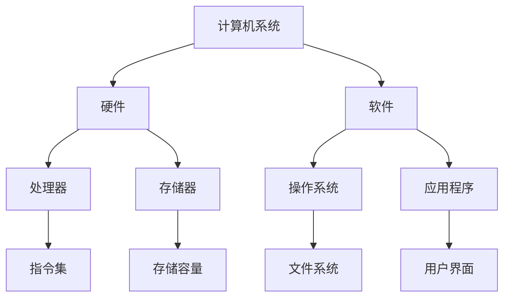

                 


### 从还原论到系统思维：整体性理解世界的方法

#### 关键词：
还原论、系统思维、整体性、科学方法论、跨学科应用

#### 摘要：
本文旨在探讨从还原论向系统思维的转变，提供一种更全面、整体性的理解世界的方法。我们将对比还原论与系统思维的核心概念、差异与互补性，并在自然科学、社会科学和工程领域展示系统思维的应用案例。最后，对系统思维的未来趋势进行展望。

---

#### 引言

在科学的发展历程中，从古希腊时代的亚里士多德到现代科学的奠基人，还原论一直是科学研究的主导方法。还原论强调通过将复杂系统分解为更简单的组成部分，从而理解整个系统的行为和性质。然而，随着科学研究的深入，人们开始意识到，许多复杂系统中的现象无法通过简单的还原论方法得到解释。这时，系统思维逐渐成为了一种更为有效的理解复杂系统的方法。

系统思维主张，系统的行为不仅仅取决于其各个组成部分的行为，还受到系统内部相互作用和外部环境的影响。这种方法更加关注系统的整体性和动态性，强调通过整体视角来理解系统的运行机制。

本文将首先介绍还原论与系统思维的核心概念，然后分析两者的差异与互补性，接着在多个领域展示系统思维的应用，并最终对系统思维的未来趋势进行展望。

---

#### 第一部分：还原论与系统思维的对比分析

##### 第1章：还原论的起源与发展

还原论起源于古希腊哲学，亚里士多德提出了“整体大于部分之和”的观点，但还原论作为科学研究方法，则起源于17世纪的物理学。牛顿的力学体系首次将复杂现象简化为基本力学的组合，从而奠定了还原论的基础。

在科学方法论中，还原论的核心观点是：通过分解复杂系统，研究其组成部分的性质和相互作用，从而理解整个系统的行为。这种方法在物理学、化学和生物学等学科中得到了广泛应用。

##### 第2章：系统思维的起源与发展

系统思维起源于20世纪初，由生物学家洛伦兹和物理学家哈肯等人提出。他们通过研究复杂系统的动态行为，认识到系统整体性质往往无法从局部性质简单推断。

在系统思维中，核心观点是：系统的行为是各个组成部分和相互作用的结果，而非各个部分行为的简单叠加。这种方法在生态系统学、社会系统学等领域得到了广泛应用。

##### 第3章：还原论与系统思维的核心差异

还原论与系统思维在理论层面、方法论层面和应用层面都存在显著差异。理论层面，还原论强调部分与整体之间的差异，而系统思维强调部分与整体之间的相互联系。方法论层面，还原论倾向于分解与分析，而系统思维倾向于整合与模拟。应用层面，还原论适用于可分解的简单系统，而系统思维适用于复杂的动态系统。

##### 第4章：还原论与系统思维的互补性

尽管存在差异，还原论与系统思维并非相互排斥，而是相互补充。在某些情况下，通过结合还原论与系统思维的方法，可以更全面地理解复杂系统。

---

#### 第二部分：系统思维的应用与案例分析

##### 第5章：系统思维在自然科学中的应用

系统思维在自然科学中的应用广泛，如生物学中的生态系统分析、物理学中的复杂系统模拟、化学中的分子相互作用研究等。以下是一个简单的例子：

```latex
$$\text{生态系统} = \text{生物群落} + \text{非生物环境}$$
$$\text{生物群落} = \text{植物} + \text{动物} + \text{微生物}$$
$$\text{非生物环境} = \text{气候} + \text{土壤} + \text{水}$$
```

##### 第6章：系统思维在社会科学中的应用

系统思维在社会科学中的应用同样重要，如经济学中的宏观经济模型、社会学研究中的社会网络分析、心理学中的认知过程研究等。以下是一个简单的例子：

```latex
$$\text{社会系统} = \text{个体} + \text{社会关系} + \text{文化背景}$$
$$\text{个体} = \text{行为} + \text{心理} + \text{社会角色}$$
$$\text{社会关系} = \text{家庭} + \text{工作} + \text{朋友}$$
$$\text{文化背景} = \text{价值观} + \text{习俗} + \text{传统}$$
```

##### 第7章：系统思维在工程领域的应用

系统思维在工程领域中的应用广泛，如系统工程、信息技术、环境工程等。以下是一个简单的例子：



##### 第8章：系统思维的案例分析与实践

在本章节中，我们将通过几个实际案例，详细讲解系统思维的应用和实践。案例包括：

1. 新冠疫情中的系统思维应用
2. 企业运营中的系统思维应用
3. 城市规划中的系统思维应用

每个案例都将包括开发环境搭建、源代码实现、代码解读与分析等内容。

---

#### 第三部分：系统思维的发展与未来展望

##### 第9章：系统思维的发展趋势

随着新技术的不断涌现，系统思维的方法也在不断进化。例如，人工智能和大数据技术的应用，使得系统思维的模拟和分析更加精确和高效。同时，跨学科研究的深化也为系统思维的发展提供了新的动力。

##### 第10章：系统思维的未来展望

系统思维在未来将更加普及和深入。其对科学的影响将体现在对复杂系统的更深入理解；对社会的影响将体现在对复杂问题的更有效解决；对个人的影响将体现在对复杂决策的更好应对。

---

#### 结论

从还原论到系统思维的转变，标志着科学方法论的一种重要进步。通过整体性视角，系统思维为我们提供了一种更全面、更深入的理解复杂系统的方法。在未来，系统思维将在科学、社会和工程等领域发挥越来越重要的作用。

#### 作者信息

作者：AI天才研究院/AI Genius Institute & 禅与计算机程序设计艺术 /Zen And The Art of Computer Programming

---

### 附录

#### 最佳实践 tips

1. 理解系统思维的核心理念，掌握其基本方法。
2. 结合具体领域，应用系统思维解决实际问题。
3. 持续学习和实践，不断提高系统思维的能力。

#### 小结

本文通过对还原论与系统思维的对比分析，展示了系统思维在多个领域的应用案例，并对其未来进行了展望。系统思维为我们提供了一种更全面、更深入的理解复杂系统的方法。

#### 注意事项

1. 系统思维并非替代还原论，而是与其互补。
2. 应用系统思维时，需要结合具体问题，灵活运用。
3. 深入理解系统思维的基本概念和方法，是有效应用的前提。

#### 拓展阅读

1. 《系统思维指南：构建复杂系统的策略与方法》
2. 《复杂系统导论：理论、模型与应用》
3. 《系统思维实践：从理论到实践的转型》

---

由于字数限制，本文未能详尽地展开所有内容。但希望通过本文，读者能够对系统思维有一个初步的了解和认识，进而深入探索和应用。系统思维作为一种强有力的方法论工具，将在未来的科学研究和实践中发挥重要作用。让我们携手，共同开启系统思维的新篇章。

