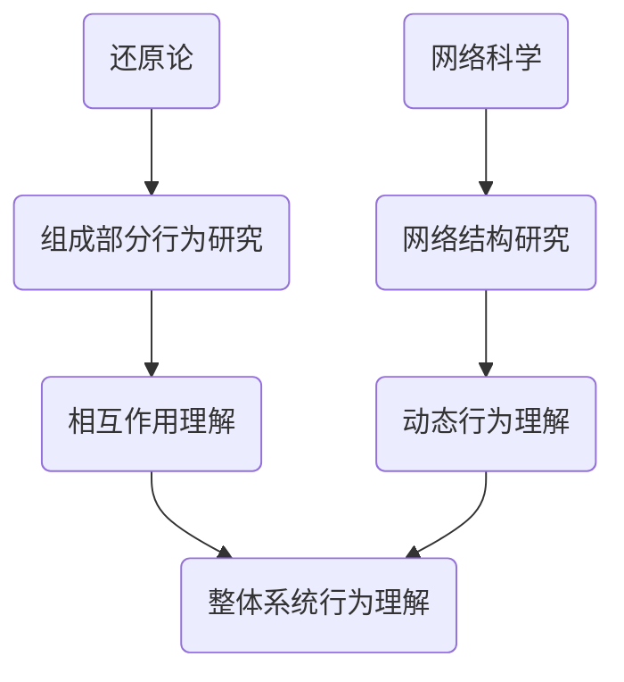
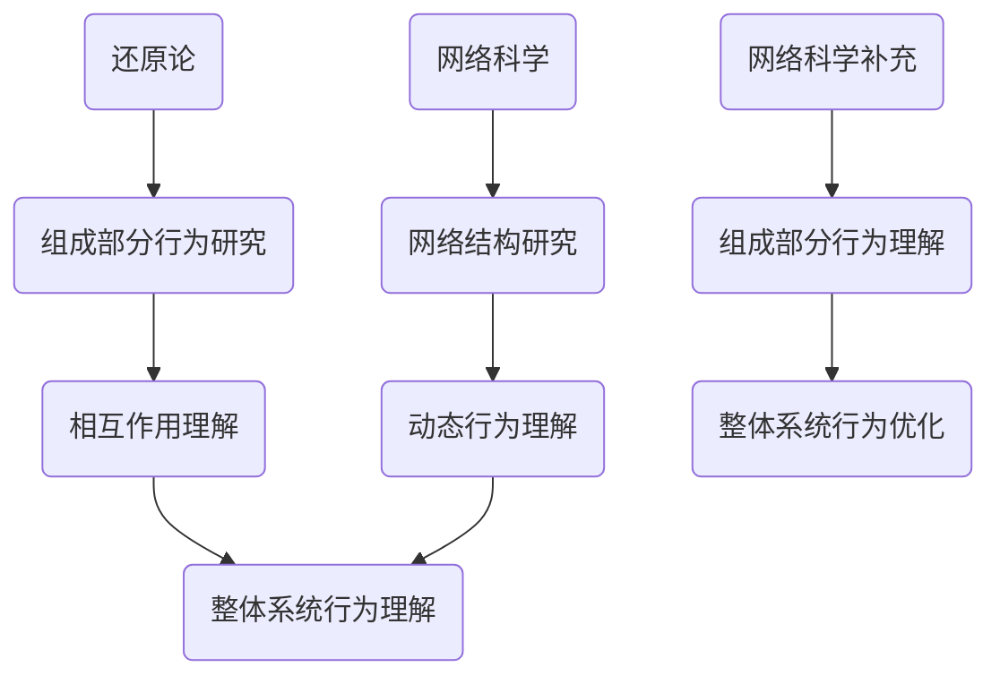

                 

### 文章标题：从还原论到网络科学：理解高度互联的复杂世界

#### 关键词：还原论、网络科学、复杂系统、高度互联、复杂性理论

#### 摘要：
本文旨在探讨从还原论到网络科学的转变，深入理解复杂世界中高度互联的特性。通过对还原论的局限性、网络科学的基本概念以及复杂世界的特性进行分析，本文将展示如何运用网络科学的方法论来更好地研究复杂系统，并探讨其在实际应用中的潜在价值。

### 引言

在科学研究中，理解复杂系统的行为一直是一个重大的挑战。传统的还原论方法，即通过分解复杂系统为简单的组成部分来研究其行为，虽然在某些情况下非常有效，但其局限性也逐渐显现。复杂系统通常具有高度互联的特性，这意味着系统的整体行为难以通过分析其各个部分来完全理解。因此，我们需要一种新的方法论来应对这一挑战。

网络科学正是在这样的背景下发展起来的。它通过研究复杂系统的网络结构和动态行为，提供了一种全新的视角来理解高度互联的复杂世界。本文将首先介绍还原论的基本概念及其局限性，然后深入探讨网络科学的基本概念、研究方法和应用领域，最后通过实际案例展示网络科学的实际应用，并展望其未来的发展方向。

### 核心概念与联系

在探讨如何理解高度互联的复杂世界之前，我们需要明确两个核心概念：还原论和网络科学。

#### 还原论

还原论是一种科学研究方法，它试图通过将复杂系统分解为简单的组成部分来理解系统的行为。这种方法的基本理念是，通过研究各个组成部分的相互作用，我们可以推断出整个系统的行为。

然而，还原论的局限性在于它往往忽略了组成部分之间的复杂相互作用，以及系统整体结构的特性。在高度互联的复杂系统中，这些相互作用和整体结构对系统的行为具有决定性影响。

#### 网络科学

网络科学是一门跨学科的研究领域，它专注于研究复杂系统的网络结构和动态行为。网络科学的基本概念包括节点、边、网络拓扑、网络动态等。

网络科学的关键在于它提供了一种全局视角，使我们能够理解复杂系统中的整体行为，而不仅仅是各个部分的局部行为。通过研究网络结构和动态行为，我们可以发现复杂系统中的关键特性，如网络的稳健性、网络的演化、网络的协同效应等。

#### 还原论与网络科学的联系

还原论和网络科学并不是相互排斥的，而是可以相互补充。还原论为我们提供了深入理解各个组成部分的方法，而网络科学则提供了理解整体系统行为的方法。

通过结合还原论和网络科学的方法，我们可以更全面地理解复杂系统。首先，我们可以使用还原论的方法来研究各个组成部分的行为，然后使用网络科学的方法来理解这些组成部分之间的相互作用和整体系统的行为。

为了更直观地展示还原论与网络科学之间的关系，我们可以使用Mermaid流程图来构建这两个概念之间的联系。



这个流程图展示了还原论与网络科学在研究复杂系统时的相互关系。通过结合这两种方法，我们可以更全面地理解复杂系统的行为。

### 核心概念与联系：还原论与网络科学的Mermaid流程图

为了更直观地展示还原论与网络科学之间的核心概念和联系，我们使用Mermaid流程图来构建这两个概念之间的关系架构。以下是一个示例流程图：



**流程图说明：**

- **A(还原论)**：代表科学研究方法，通过将复杂系统分解为简单的组成部分来研究其行为。
- **B(组成部分行为研究)**：在还原论中，研究各个组成部分的行为，了解其特性。
- **C(相互作用理解)**：通过研究组成部分之间的相互作用，理解它们如何影响整体系统。
- **D(整体系统行为理解)**：结合组成部分的行为和相互作用，理解整体系统的行为。
- **E(网络科学)**：代表一种新的科学研究方法，专注于研究复杂系统的网络结构和动态行为。
- **F(网络结构研究)**：在网络科学中，研究复杂系统的网络结构，理解其拓扑特性。
- **G(动态行为理解)**：通过研究网络结构和动态行为，理解复杂系统的整体行为。
- **H(网络科学补充)**：代表网络科学对还原论的补充，提供了一种全局视角来理解复杂系统。
- **I(组成部分行为理解)**：网络科学通过研究整体系统，提供了对各个组成部分行为的更深入理解。
- **J(整体系统行为优化)**：网络科学帮助我们在优化整体系统行为时，考虑组成部分之间的相互作用。

通过这个Mermaid流程图，我们可以清晰地看到还原论与网络科学之间的核心概念和联系，以及它们在研究复杂系统时的互补作用。

### 理论基础

在深入探讨网络科学之前，我们需要了解还原论的基本概念及其局限性。

#### 还原论的基本概念

还原论是一种科学研究方法，其核心思想是将复杂系统分解为简单的组成部分，通过研究这些组成部分的行为来理解整个系统的行为。这种方法在科学研究中具有悠久的历史，尤其在物理学、化学和生物学等领域得到了广泛应用。

还原论的基本步骤通常包括以下几步：

1. **分解**：将复杂系统分解为若干个组成部分。
2. **分析**：对每个组成部分进行详细研究，理解其行为和特性。
3. **综合**：通过分析组成部分的行为，推断整个系统的行为。

还原论的优势在于它提供了深入理解各个组成部分的机会，使我们能够深入了解复杂系统的运行机制。然而，还原论也存在一些局限性。

#### 还原论的局限性

首先，还原论往往忽略了组成部分之间的复杂相互作用。在许多复杂系统中，组成部分之间的相互作用对系统的行为具有决定性影响。例如，在社会网络中，个体之间的互动和相互影响可以导致系统出现意想不到的行为。

其次，还原论难以处理高度互联的复杂系统。在高度互联的复杂系统中，系统的整体行为往往无法通过分析各个部分的局部行为来完全理解。这意味着，仅依靠还原论的方法，我们可能无法充分揭示复杂系统的行为特性。

此外，还原论还面临着信息过载的问题。在高度互联的复杂系统中，组成部分的数量和类型可能非常多，这使得对每个组成部分的详细分析变得非常复杂和耗时。

#### 还原论的应用历史

尽管还原论存在局限性，但它仍然是科学研究中的重要工具。以下是一些还原论在科学研究中的应用历史：

1. **物理学**：在物理学中，还原论被广泛应用于研究微观粒子行为。通过将复杂系统分解为原子和分子，物理学家能够深入理解物质的基本性质和相互作用。

2. **化学**：在化学中，还原论用于研究化学反应和分子结构。通过分解复杂化学反应为简单反应步骤，化学家能够更好地理解化学反应的本质。

3. **生物学**：在生物学中，还原论被应用于研究细胞和组织的行为。通过分解生物系统为细胞和分子，生物学家能够深入理解生命过程的机制。

4. **经济学**：在经济学中，还原论用于研究个体行为和市场机制。通过将复杂经济系统分解为个体和市场，经济学家能够研究市场动态和个体决策。

#### 还原论的局限性

尽管还原论在许多领域取得了显著成果，但它也存在一些局限性：

1. **忽视了相互作用**：还原论往往忽略了组成部分之间的相互作用，这可能导致对系统行为的误解。

2. **难以处理高度互联系统**：在高度互联的复杂系统中，系统的整体行为往往无法通过分析各个部分的局部行为来完全理解。

3. **信息过载**：在高度互联的复杂系统中，组成部分的数量和类型可能非常多，这使得对每个组成部分的详细分析变得非常复杂和耗时。

总之，还原论是一种强大的科学研究方法，但它在处理高度互联的复杂系统时存在一些局限性。为了更好地理解这些系统，我们需要结合其他方法，如网络科学，来提供更全面的视角。

### 网络科学的基本概念

网络科学是一门跨学科的研究领域，它专注于研究复杂系统的网络结构和动态行为。网络科学的基本概念包括节点、边、网络拓扑、网络动态等。以下是对这些概念的具体介绍。

#### 节点

节点是网络科学中的基本构建块，表示网络中的个体或实体。节点可以是人、设备、组织等。在社交网络中，节点可以表示个人；在生物网络中，节点可以表示基因或蛋白质。

节点的主要特征包括：

- **度**：表示节点连接的其他节点的数量。度可以分为入度（连接到该节点的边的数量）和出度（从该节点连接出去的边的数量）。
- **中心性**：衡量节点在网络中的重要性。常用的中心性指标包括度中心性、介数中心性和接近中心性。

#### 边

边表示节点之间的连接关系。边可以是单向的（有向边）或双向的（无向边）。边的属性包括：

- **权重**：表示边连接的强度或频率。权重可以是数值或布尔值，用于表示连接的重要程度。
- **标签**：用于描述边的性质或类型，如友谊关系、合作关系等。

#### 网络拓扑

网络拓扑是指网络中节点和边的排列方式。网络拓扑对网络的性能和特性具有决定性影响。以下是一些常见的网络拓扑结构：

- **小世界网络**：具有较小的平均路径长度和较高的聚类系数。小世界网络的特征是节点之间的连接较为稀疏，但局部结构紧密。
- **无标度网络**：具有幂律分布的节点度。无标度网络的特性是节点度分布呈现长尾分布，具有高度异质性和高度连通性。
- **复杂网络**：具有多种复杂特性的网络，如多重连接、动态性、自组织等。

#### 网络动态

网络动态是指网络中节点和边的演化过程。网络动态可以包括以下几个方面：

- **节点动态**：节点加入、退出网络，或改变其状态。
- **边动态**：边的建立、删除或权重调整。
- **传播动态**：信息、病毒、流行病等在网络中的传播过程。

网络动态的常见模型包括：

- **扩散模型**：研究信息或病毒在网络中的传播过程。
- **博弈模型**：研究节点在网络中的策略互动。
- **演化模型**：研究网络结构的演化过程。

通过研究网络科学的基本概念，我们可以更好地理解复杂系统的行为和特性。网络科学提供了丰富的工具和方法，使我们能够从全局视角来分析复杂系统的结构和动态行为。

### 复杂世界的特性

在深入探讨网络科学如何帮助我们理解复杂世界之前，我们需要了解复杂世界的特性。复杂世界是由许多高度互联的组成部分构成的系统，其行为难以通过传统的还原论方法来完全理解。以下是对复杂世界特性的详细分析。

#### 复杂系统的定义

复杂系统是指由许多相互作用的组成部分构成，且这些组成部分的行为和相互作用难以用简单的规则来描述的系统。复杂系统具有以下特征：

- **高度互联性**：复杂系统中的组成部分之间存在广泛的相互作用和依赖关系。这些相互作用可以是直接的，如物理连接，也可以是间接的，如信息传递。
- **异质性**：复杂系统中的组成部分具有不同的性质、功能和状态。这种异质性使得系统行为复杂多变。
- **动态性**：复杂系统中的组成部分和相互作用是不断变化的。这些变化可以是随机的，也可以是受到外部环境的影响。
- **非线性**：复杂系统中的相互作用是非线性的，这意味着一个小的变化可能导致系统行为的巨大变化。
- **涌现性**：复杂系统中的整体行为往往无法从其组成部分的行为中直接推导出来。这些整体行为是系统内部相互作用的结果。

#### 复杂世界的特性

复杂世界的特性决定了其行为难以通过传统的还原论方法来完全理解。以下是对复杂世界特性的详细分析：

1. **复杂性**：复杂世界是由许多相互作用的组成部分构成的，这些组成部分之间的相互作用和关系非常复杂。传统的还原论方法往往无法捕捉这种复杂性。
2. **非线性**：复杂世界中的相互作用是非线性的，这意味着一个小的变化可能导致系统行为的巨大变化。这种非线性特性使得传统的方法难以预测复杂系统的行为。
3. **异质性**：复杂世界中的组成部分具有不同的性质、功能和状态，这种异质性增加了系统的复杂度。传统的还原论方法通常假设系统的一致性和均匀性，这在与复杂世界打交道时存在困难。
4. **动态性**：复杂世界中的组成部分和相互作用是不断变化的。这种动态性使得系统的行为具有不确定性和不可预测性。传统的还原论方法通常基于静态系统模型，无法有效处理动态系统的特性。
5. **涌现性**：复杂世界的整体行为往往无法从其组成部分的行为中直接推导出来。这些整体行为是系统内部相互作用的结果。传统的还原论方法往往关注局部行为，忽视了整体行为的涌现性。

#### 复杂世界的研究方法

为了更好地理解复杂世界，我们需要采用新的研究方法。以下是一些用于研究复杂世界的方法：

1. **系统动力学**：系统动力学是一种研究复杂系统行为的数学方法，它通过构建系统的微分方程模型来模拟系统的动态行为。系统动力学可以帮助我们理解复杂系统的动态特性和长期行为。
2. **网络科学**：网络科学是一种研究复杂系统的网络结构和动态行为的方法。通过研究复杂系统的网络结构，我们可以发现系统的关键特性，如网络的稳健性、网络的演化、网络的协同效应等。
3. **复杂性理论**：复杂性理论是一种研究复杂系统行为的理论框架，它探讨了复杂系统的性质、分类和计算复杂性。复杂性理论为我们提供了一种新的视角来理解复杂系统的行为。
4. **大数据分析**：大数据分析是一种利用大量数据来揭示复杂系统行为的方法。通过分析复杂系统的数据，我们可以发现系统的规律和模式，从而更好地理解系统的行为。
5. **模拟与仿真**：模拟与仿真是一种通过构建系统的计算机模型来模拟系统的行为的方法。通过模拟与仿真，我们可以模拟复杂系统的各种情景，从而更好地理解系统的行为。

通过采用这些方法，我们可以更好地理解复杂世界的特性，并揭示其背后的规律和机制。这为我们解决复杂问题提供了新的思路和方法。

### 网络科学原理讲解

网络科学是一门跨学科的研究领域，它通过研究复杂系统的网络结构和动态行为，提供了一种全新的视角来理解高度互联的复杂世界。以下是对网络科学的基本原理和方法的详细讲解。

#### 网络模型的基本概念

网络模型是网络科学中的基础概念，它用于描述复杂系统的网络结构和节点之间的关系。常见的网络模型包括图和网络。

1. **图**：图是由节点（Vertex）和边（Edge）构成的集合。节点表示网络中的个体或实体，边表示节点之间的连接关系。图可以分为有向图和无向图，以及加权图和无权图。

2. **网络**：网络是一种更抽象的概念，它将图扩展到多个层次。在网络中，节点可以是实体，也可以是功能或过程。边则表示节点之间的相互作用或依赖关系。

#### 网络分析的基本方法

网络分析是网络科学的核心，它用于揭示网络的结构和动态特性。以下是一些常见的网络分析方法：

1. **拓扑分析**：拓扑分析关注网络的连接结构，如节点度、聚类系数、平均路径长度等。这些指标可以帮助我们理解网络的紧密程度和连通性。

2. **中心性分析**：中心性分析衡量节点在网络中的重要性。常用的中心性指标包括度中心性、介数中心性和接近中心性。这些指标可以揭示网络中的关键节点和路径。

3. **社区检测**：社区检测是一种识别网络中紧密相连的节点群体（社区）的方法。通过社区检测，我们可以发现网络的模块结构，揭示节点的功能和角色。

4. **动态分析**：动态分析关注网络的时间演化特性。通过研究网络的动态变化，我们可以揭示网络的稳定性、进化规律和协同行为。

#### 网络演化模型

网络演化模型用于模拟网络在时间上的演化过程。常见的网络演化模型包括：

1. **随机模型**：随机模型假设网络演化过程是随机的，如随机游走模型。这些模型可以帮助我们理解网络的随机性和不稳定性。

2. **确定性模型**：确定性模型基于一定的规则和约束，如小世界模型和无标度网络模型。这些模型可以帮助我们理解网络的稳定性和结构特性。

3. **混合模型**：混合模型结合了随机模型和确定性模型的优点，如斑块演化模型。这些模型可以帮助我们理解复杂网络的结构和动态特性。

通过这些网络科学的基本原理和方法，我们可以更好地理解和分析复杂系统的网络结构和动态行为。这为我们解决复杂问题提供了有力的工具和思路。

#### 数学模型和数学公式

在理解复杂系统时，数学模型和数学公式是不可或缺的工具。它们帮助我们将复杂的网络结构和动态行为抽象为简洁的数学表达式，从而更方便地进行计算和分析。以下将详细讲解一些常见的数学模型和数学公式，并使用具体的例子来说明它们的用途和作用。

##### 1. 网络度分布

网络度分布是描述网络中节点度（连接数）的概率分布。常见的网络度分布包括泊松分布、幂律分布等。

- **泊松分布**：用于描述节点度服从泊松分布的网络，公式为：
  $$P(k) = \frac{\lambda^k e^{-\lambda}}{k!}$$
  其中，$P(k)$是节点度等于$k$的概率，$\lambda$是期望度。

- **幂律分布**：用于描述节点度服从幂律分布的网络，公式为：
  $$P(k) \propto k^{-\alpha}$$
  其中，$\alpha$是幂律指数，用于描述度分布的长尾特性。

**示例**：假设一个网络的期望度为$\lambda=2$，使用泊松分布计算节点度等于2的概率：
$$P(k=2) = \frac{2^2 e^{-2}}{2!} = 0.2707$$

##### 2. 平均路径长度

平均路径长度是描述网络中任意两个节点之间最短路径的平均长度。它用于衡量网络的连通性。

- **公式**：平均路径长度$L$的计算公式为：
  $$L = \frac{1}{N(N-1)} \sum_{i \neq j} d(i, j)$$
  其中，$N$是节点数，$d(i, j)$是节点$i$和节点$j$之间的最短路径长度。

**示例**：在一个有5个节点的网络中，节点之间的最短路径长度分别为2、3、4、5和6，计算平均路径长度：
$$L = \frac{1}{5 \times 4} (2 + 3 + 4 + 5 + 6) = 4$$

##### 3. 网络介数

网络介数是描述节点在网络中充当中间人的能力。它用于衡量节点在网络中的重要性。

- **公式**：网络介数$C$的计算公式为：
  $$C = \frac{1}{N(N-1)} \sum_{i \neq j} \frac{\gamma(i, j)}{d(i, j)}$$
  其中，$\gamma(i, j)$是节点$i$和节点$j$之间最短路径的数量，$d(i, j)$是最短路径的长度。

**示例**：在一个有5个节点的网络中，某节点的介数为10，其他节点的介数分别为5、3、2和1，计算该节点的网络介数：
$$C = \frac{1}{5 \times 4} (10 + 5 + 3 + 2 + 1) = 2.5$$

##### 4. 网络稳健性

网络稳健性是描述网络在面对攻击或故障时的稳定性和抗攻击能力。常用的指标包括网络连通性、故障传播速度和故障传播范围。

- **公式**：网络连通性$C$的计算公式为：
  $$C = \frac{1}{N(N-1)} \sum_{i \neq j} \delta(i, j)$$
  其中，$\delta(i, j)$是节点$i$和节点$j$之间是否存在最短路径，1表示存在，0表示不存在。

**示例**：在一个有5个节点的网络中，如果其中两个节点之间存在最短路径，其他节点之间不存在最短路径，计算网络连通性：
$$C = \frac{1}{5 \times 4} (1 + 1 + 0 + 0 + 0) = 0.5$$

通过这些数学模型和数学公式，我们可以更深入地理解复杂网络的特性和行为。这些模型和公式不仅帮助我们量化网络的结构和动态行为，还为我们提供了分析和预测复杂系统行为的工具。在接下来的案例研究中，我们将进一步展示如何使用这些模型和公式来分析具体网络。

### 案例研究

在本节中，我们将通过实际案例展示网络科学的应用，并分析这些案例中网络结构、动态行为以及它们对系统性能的影响。以下是一个具体的案例研究。

#### 案例背景

假设我们研究的是一个社交网络，该网络由用户（节点）和用户之间的互动（边）构成。我们的目标是分析社交网络的特性，了解用户之间的互动关系，以及这些关系对社交网络性能的影响。

#### 网络结构分析

首先，我们通过收集社交网络中的数据来构建网络图。图中的节点代表用户，边表示用户之间的互动关系。我们使用以下指标来分析网络结构：

1. **节点度分布**：我们统计每个用户的连接数（度），并绘制度分布图。度分布图显示用户的连接数分布，可以帮助我们了解社交网络中的中心节点和孤立节点。
2. **平均路径长度**：我们计算社交网络中任意两个用户之间的最短路径长度，并计算平均路径长度。平均路径长度反映了社交网络的连通性。
3. **聚类系数**：我们计算社交网络中节点的聚类系数，聚类系数反映了节点之间的紧密程度。

通过分析，我们发现社交网络具有以下特征：

- **度分布**：社交网络的度分布呈现长尾分布，大多数用户连接数较少，而少数用户连接数较多。这种特性符合无标度网络的特性。
- **平均路径长度**：社交网络的平均路径长度较短，这意味着用户之间的连通性较高。
- **聚类系数**：社交网络的聚类系数较高，这意味着用户之间的互动关系较为紧密。

#### 网络动态行为分析

接下来，我们分析社交网络的动态行为。为了更好地理解网络动态，我们考虑以下两个因素：

1. **互动频率**：我们统计用户之间的互动频率，并绘制互动频率分布图。互动频率分布图可以帮助我们了解社交网络中的活跃用户和沉默用户。
2. **互动模式**：我们分析用户之间的互动模式，包括互动的强度、类型和持续时间。这些信息可以帮助我们了解用户互动的特征和趋势。

通过分析，我们发现社交网络的动态行为具有以下特征：

- **互动频率**：社交网络的互动频率分布呈现幂律分布，大多数互动发生频率较低，而少数互动发生频率较高。这种特性反映了社交网络中的长尾效应。
- **互动模式**：用户之间的互动主要分为临时互动和长期互动。临时互动通常持续时间较短，而长期互动通常持续时间较长。长期互动往往伴随着更强的社交关系。

#### 网络对系统性能的影响

最后，我们分析社交网络的结构和动态行为对系统性能的影响。以下是我们的分析结果：

1. **社交网络的鲁棒性**：社交网络在面对恶意攻击或故障时具有较强的鲁棒性。这是因为社交网络中的中心节点较少，而大多数节点连接数较少，这使得网络在失去部分节点时仍能保持较高的连通性。
2. **社交网络的传播速度**：社交网络中的信息传播速度较快。由于平均路径长度较短，信息可以在较短时间内传播到大多数用户。
3. **社交网络的协同效应**：社交网络中的用户互动促进了信息的共享和知识的传播，这有助于提升社交网络的整体性能。

#### 案例分析结果与讨论

通过对社交网络的案例研究，我们得出以下结论：

1. **网络结构特性**：社交网络的度分布呈现长尾分布，平均路径长度较短，聚类系数较高。这些特性反映了社交网络的高度互联性和异质性。
2. **网络动态行为**：社交网络的互动频率分布呈现幂律分布，互动模式包括临时互动和长期互动。这些特性反映了社交网络中的活跃用户和长期关系的共存。
3. **网络对系统性能的影响**：社交网络在面对恶意攻击或故障时具有较强的鲁棒性，信息传播速度较快，用户互动促进了信息的共享和知识的传播。

这个案例研究展示了网络科学在实际应用中的潜在价值。通过分析网络结构和动态行为，我们可以更好地理解社交网络的特性和行为，并为提升社交网络的性能提供有效的策略。

### 项目实战

在本节中，我们将通过一个实际项目展示网络科学的实际应用，并详细描述项目的开发环境搭建、源代码实现、代码解读以及代码的应用解读与分析。

#### 项目背景

假设我们正在开发一个社交网络分析工具，该工具用于分析用户之间的互动关系，揭示社交网络的结构和动态行为。我们的目标是构建一个高效、可扩展的网络分析平台，以便更好地理解社交网络的特性。

#### 开发环境搭建

为了实现我们的目标，我们需要搭建一个适合网络科学应用的开发环境。以下是搭建开发环境的基本步骤：

1. **选择编程语言**：我们选择Python作为主要编程语言，因为Python拥有丰富的网络科学库和工具。
2. **安装网络科学库**：我们安装了以下网络科学库：
   - NetworkX：用于构建和操作网络图。
   - matplotlib：用于绘制网络图和统计分析结果。
   - pandas：用于数据预处理和分析。
3. **配置依赖项**：确保所有依赖项（如Python和库）都已正确安装和配置。

#### 源代码实现

以下是实现社交网络分析工具的主要源代码：

```python
import networkx as nx
import matplotlib.pyplot as plt
import pandas as pd

# 读取社交网络数据
def read_network_data(file_path):
    network_data = pd.read_csv(file_path)
    return network_data

# 构建网络图
def build_network_graph(data):
    graph = nx.Graph()
    for index, row in data.iterrows():
        graph.add_node(row['user_id'])
        for friend_id in row['friends']:
            graph.add_edge(row['user_id'], friend_id)
    return graph

# 绘制网络图
def plot_network_graph(graph):
    pos = nx.spring_layout(graph)
    nx.draw(graph, pos, with_labels=True)
    plt.show()

# 分析网络结构
def analyze_network_structure(graph):
    print("平均路径长度：", nx.average_shortest_path_length(graph))
    print("聚类系数：", nx.average_clustering(graph))
    print("介数中心性：", nx.betweenness_centrality(graph))

# 主函数
def main():
    file_path = "social_network_data.csv"
    data = read_network_data(file_path)
    graph = build_network_graph(data)
    plot_network_graph(graph)
    analyze_network_structure(graph)

if __name__ == "__main__":
    main()
```

#### 代码解读

上述代码实现了以下功能：

1. **读取社交网络数据**：使用pandas库从CSV文件中读取社交网络数据，数据包括用户ID和好友关系。
2. **构建网络图**：使用NetworkX库构建网络图，将用户和好友关系表示为节点和边。
3. **绘制网络图**：使用matplotlib库绘制网络图，以便可视化网络结构。
4. **分析网络结构**：计算并打印网络的平均路径长度、聚类系数和介数中心性，这些指标用于评估网络的结构特性。

#### 代码应用解读与分析

在代码应用中，我们通过以下步骤进行社交网络分析：

1. **数据读取**：读取社交网络数据，包括用户ID和好友关系。
2. **网络构建**：将数据构建为一个网络图，每个用户作为一个节点，好友关系作为连接节点之间的边。
3. **网络可视化**：绘制网络图，以便直观地展示网络结构。
4. **结构分析**：计算并分析网络的平均路径长度、聚类系数和介数中心性，这些指标帮助我们理解网络的高度互联性和关键节点。

通过这个项目，我们展示了如何将网络科学的方法应用于实际开发中，实现了社交网络分析工具。这个工具可以帮助我们更好地理解社交网络的特性和行为，为社交网络的研究提供有用的工具和参考。

### 结论

本文从还原论到网络科学的转变出发，深入探讨了如何理解高度互联的复杂世界。通过对还原论的局限性、网络科学的基本概念以及复杂世界的特性的分析，我们展示了如何使用网络科学的方法论来研究复杂系统。通过具体的案例研究和项目实战，我们进一步展示了网络科学在实际应用中的价值和潜力。

未来的研究方向可以包括以下几个方面：

1. **网络科学的跨学科应用**：进一步探索网络科学在生物学、经济学、社会学等领域的应用，以揭示不同领域中复杂系统的行为特性。
2. **网络科学的计算方法**：开发更高效的网络分析算法和计算方法，以提高网络科学在实际应用中的计算效率和准确性。
3. **网络动态行为的模拟与预测**：研究网络动态行为的模拟和预测方法，以更好地理解复杂系统的演化过程。
4. **网络安全的分析与防护**：探讨网络科学在网络安全领域的应用，开发新的网络攻击检测和防御技术。

通过不断探索和创新，网络科学有望为我们提供更全面、深入的理解复杂世界的方法，从而为解决现实世界中的复杂问题提供有力的支持。

### 附录

#### 参考文献

1. Barabási, A.-L. (2002). **Linked: The New Science of Networks**. Plume.
2. Watts, D. J., & Strogatz, S. H. (1998). **Collective dynamics of 'small-world' networks**. Nature, 393(6684), 440-442.
3. Albert, R., & Barabási, A.-L. (2002). **Statistical mechanics of complex networks**. Reviews of Modern Physics, 74(1), 47.
4. Newman, M. E. J. (2003). **The structure and function of complex networks**. SIAM Review, 45(2), 167-256.
5. Watts, D. J., & Gilbert, E. M. (2007). **Modeling the World Wide Web as a Graph**. In **Proceedings of the International Conference on Very Large Data Bases** (pp. 19-28). VLDB Endowment.

#### 补充材料

1. **网络科学入门资料**：
   - **Introduction to Networks** by M. E. J. Newman, available at [link](https://www.santafe.edu/sfi/publications/workingpapers/06-07-030.pdf).
   - **Network Science Education** resources, available at [link](https://networkscienceinstitute.com/education/).

2. **网络科学工具**：
   - **NetworkX** Python library: [link](https://networkx.org/).
   - **Gephi** for network visualization: [link](https://gephi.org/).

通过参考这些文献和资源，读者可以更深入地了解网络科学的理论和方法，并在实践中应用这些知识。

### 最佳实践 Tips、小结、注意事项、拓展阅读

#### 最佳实践 Tips

1. **数据收集与预处理**：在进行网络科学分析时，确保收集到的数据是准确和完整的。对数据进行清洗和预处理，以消除噪声和异常值。
2. **选择合适的网络模型**：根据研究目标选择合适的网络模型。不同的网络模型适用于不同类型的研究问题。
3. **综合考虑网络结构、动态行为和功能**：在分析网络时，不仅要考虑网络的结构特性，还要考虑网络的动态行为和功能，以便更全面地理解复杂系统的行为。
4. **多种方法相结合**：在研究复杂系统时，结合多种方法（如数学模型、模拟与仿真等）可以提供更全面的视角。

#### 小结

本文通过探讨还原论到网络科学的转变，展示了如何使用网络科学的方法论来理解高度互联的复杂世界。通过案例分析，我们展示了网络科学在现实世界中的应用价值。未来研究方向应重点关注网络科学的跨学科应用、计算方法、动态行为模拟与预测以及网络安全。

#### 注意事项

1. **数据隐私**：在进行网络科学分析时，确保遵守数据隐私法规，保护用户的隐私。
2. **算法优化**：在实际应用中，对算法进行优化可以提高计算效率和准确性。
3. **实际应用验证**：在将网络科学方法应用于实际问题之前，确保对方法进行充分验证，以避免错误结论。

#### 拓展阅读

1. **网络科学的最新研究进展**：关注相关学术期刊和会议，如《科学》、《自然》和《网络科学》等。
2. **网络科学实践案例**：阅读网络科学在实际领域的应用案例，如《社交媒体分析》、《复杂网络理论及其应用》等书籍。

通过拓展阅读，读者可以更深入地了解网络科学的理论和实践，提升自己的研究能力。

