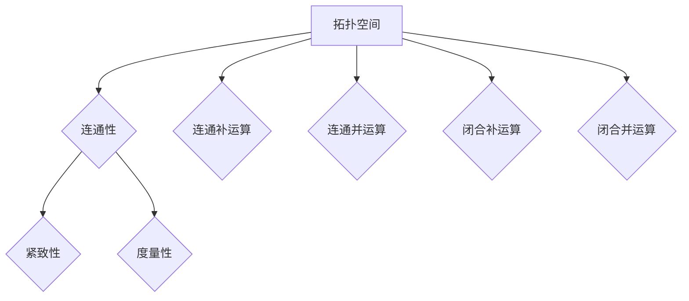

                 

### 文章标题

# 代数拓扑：自然形态的数学不变量

### 关键词

- 代数拓扑
- 形态的数学不变量
- 数学模型
- 算法原理
- 实际应用

### 摘要

本文将深入探讨代数拓扑与自然形态的数学不变量之间的关系。通过引入代数拓扑的基本概念，我们将会分析如何利用数学工具来描述自然形态的内在属性。本文的核心内容包括代数拓扑基础、形态的数学不变量、代数拓扑与形态不变量之间的联系以及实际应用。通过这些内容，读者将了解到代数拓扑在自然形态分析和理解中的重要性，以及如何运用数学方法来解决实际问题。

## 引言

### 1.1 代数拓扑的背景介绍

代数拓扑是拓扑学与代数学的结合，它主要研究的是通过代数结构来描述几何形状的性质。代数拓扑的核心概念包括拓扑空间、同调群、同伦等，这些概念为我们在几何形体的研究提供了强大的工具。拓扑学关注的是物体在形变过程中保持不变的特性，而代数学则为这些不变特性提供了精确的描述方式。

### 1.2 形态的数学不变量的背景介绍

形态的数学不变量是指在不同条件下，几何形状所保持的不变性。这些不变量在各个领域都有广泛的应用，特别是在计算机科学和工程学中，例如在图像处理、模式识别、机器人学等领域。形态不变量可以帮助我们识别和区分不同的形状，无需考虑它们的具体位置、大小和方向。

### 1.3 代数拓扑与形态不变量的联系

代数拓扑与形态不变量的联系在于，代数拓扑为我们提供了一种描述几何形状不变特性的方法，而形态不变量则是这些描述的具体实现。通过代数拓扑的工具，我们可以提取出形状的内在属性，并利用形态不变量来进行分析和比较。这种结合使得代数拓扑在形态分析中具有重要的应用价值。

## 代数拓扑基础

### 2.1 拓扑空间的基本概念

拓扑空间是代数拓扑研究的核心概念。一个拓扑空间是由一个集合及其上的拓扑结构组成，其中拓扑结构定义了哪些集合是开集。拓扑空间的基本性质包括连通性、紧致性、度量性等。

#### 2.1.1 拓扑空间定义

$$
(\mathcal{X}, \tau) \text{ 是一个拓扑空间，如果} \\
\tau \text{ 是} \mathcal{X} \text{上的一个集合族，且满足：}
$$

1. 空集和整个集合} \mathcal{X} \text{属于} \tau。
2. 集合族的任意并集属于} \tau。
3. 集合族的任意有限交集属于} \tau。

#### 2.1.2 拓扑空间的性质

拓扑空间的性质包括：

- **连通性**：一个空间是连通的，如果任意两点之间都可以通过连续路径连接。
- **紧致性**：一个空间是紧致的，如果它的每一个开覆盖都有一个有限子覆盖。
- **度量性**：可以通过度量来定义距离和邻域。

### 2.2 拓扑运算

拓扑空间中的运算主要包括连通运算和闭合运算。

#### 2.2.1 连通运算

连通运算包括连通补运算和连通并运算。

- **连通补运算**：给定一个拓扑空间} \mathcal{X}，它的连通补运算} \bar{\mathcal{X}} 定义为：集合} \bar{\mathcal{X}} \text{上的一个新拓扑空间，使得} \bar{\mathcal{X}} \text{是} \mathcal{X} \text{的连通补空间。}
- **连通并运算**：给定两个拓扑空间} \mathcal{X}_1 \text{和} \mathcal{X}_2，它们的连通并运算} \mathcal{X}_1 \cup \mathcal{X}_2 定义为：集合} \mathcal{X}_1 \cup \mathcal{X}_2 \text{上的一个新拓扑空间，使得} \mathcal{X}_1 \cup \mathcal{X}_2 \text{是} \mathcal{X}_1 \text{和} \mathcal{X}_2 \text{的连通并空间。}

#### 2.2.2 闭合运算

闭合运算包括闭合补运算和闭合并运算。

- **闭合补运算**：给定一个拓扑空间} \mathcal{X}，它的闭合补运算} \dot{\mathcal{X}} 定义为：集合} \dot{\mathcal{X}} \text{上的一个新拓扑空间，使得} \dot{\mathcal{X}} \text{是} \mathcal{X} \text{的闭合补空间。}
- **闭合并运算**：给定两个拓扑空间} \mathcal{X}_1 \text{和} \mathcal{X}_2，它们的闭合并运算} \dot{\mathcal{X}_1 \cup \mathcal{X}_2 定义为：集合} \dot{\mathcal{X}_1 \cup \mathcal{X}_2 \text{上的一个新拓扑空间，使得} \dot{\mathcal{X}_1 \cup \mathcal{X}_2 \text{是} \mathcal{X}_1 \text{和} \mathcal{X}_2 \text{的闭合并空间。}

### 2.3 代数拓扑的基本工具

代数拓扑的基本工具包括基本群、同调群和度量空间。

#### 2.3.1 基本群

基本群是拓扑空间中的一个重要概念，它描述了空间在连续变形下的不变形状。基本群的定义基于路径的概念。

- **基本群定义**：给定一个拓扑空间} \mathcal{X}，对于空间中的任意一点} p，基本群} \pi_1(\mathcal{X}, p) 定义为：所有从单位圆} S^1 到} \mathcal{X} 的连续映射} f 的集合，满足 f(1) = p。基本群是同伦类的集合，其中同伦类是指同伦映射的集合。

#### 2.3.2 同调群

同调群是代数拓扑中的另一个重要概念，它描述了空间在连续变形下的全局不变形状。

- **同调群定义**：给定一个拓扑空间} \mathcal{X}，对于空间中的任意一点} p，同调群} H_n(\mathcal{X}, p) 定义为：所有从} \mathcal{X} 到} \mathbb{Z} 的连续映射} f 的集合，满足 f(p) = 0。同调群是同伦类的集合，其中同伦类是指同伦映射的集合。

#### 2.3.3 度量空间

度量空间是代数拓扑中的一个重要概念，它为拓扑空间引入了距离的概念。

- **度量空间定义**：给定一个拓扑空间} \mathcal{X}，如果存在一个度量} d，使得对于任意两点} x, y \in \mathcal{X}，都有 d(x, y) \in \mathbb{R}，则称} \mathcal{X} 为度量空间。度量空间是带有距离的拓扑空间，它满足以下性质：

1. 非负性：对于任意两点} x, y \in \mathcal{X}，都有 d(x, y) \geq 0。
2. 零点：对于任意一点} x \in \mathcal{X}，都有 d(x, x) = 0。
3. 三角不等式：对于任意三点} x, y, z \in \mathcal{X}，都有 d(x, z) \leq d(x, y) + d(y, z)。

## 形态的数学不变量

### 3.1 形态不变量的定义

形态不变量是指在不同条件下，几何形状所保持的不变性。形态不变量的定义基于对几何形状的抽象和数学描述。

#### 3.1.1 形态的概念

形态是指物体在空间中的外部形状和结构。形态的数学描述可以通过点、线、面等几何元素来实现。

#### 3.1.2 不变量和不变量的分类

不变量是指在不同条件下，几何形状所保持的不变性。形态不变量可以分为以下几类：

- **形态不变量**：描述几何形状的基本特征，如长度、面积、体积等。
- **拓扑不变量**：描述几何形状的拓扑结构，如连通性、紧致性等。
- **几何不变量**：描述几何形状的几何特征，如角度、对称性等。

### 3.2 形态不变量的计算方法

形态不变量的计算方法包括以下几种：

- **几何方法**：通过几何构造和计算来获得形态不变量。这种方法适用于简单的几何形状，如线段、三角形等。
- **代数方法**：通过代数运算和方程求解来获得形态不变量。这种方法适用于复杂的几何形状，如多面体、曲面等。
- **数值方法**：通过数值计算和逼近方法来获得形态不变量。这种方法适用于大规模的几何形状，如计算机图形中的三维模型等。

#### 3.2.1 算法概述

形态不变量的计算算法主要包括以下步骤：

1. **几何建模**：将几何形状转化为数学模型，如点集、网格等。
2. **特征提取**：根据数学模型提取形态不变量，如长度、面积、角度等。
3. **数据预处理**：对提取的特征进行预处理，如归一化、滤波等。
4. **计算不变量**：利用预处理后的特征计算形态不变量。
5. **结果验证**：验证计算结果是否满足形态不变量的定义。

#### 3.2.2 实际计算方法

实际计算方法取决于几何形状的复杂性和计算资源的限制。以下是一个简单的形态不变量计算示例：

1. **几何建模**：假设我们有一个矩形，其顶点坐标为} (x_1, y_1)，(x_2, y_2)，(x_3, y_3)，(x_4, y_4)。
2. **特征提取**：计算矩形的长度和宽度} l = x_2 - x_1，w = y_2 - y_1。
3. **数据预处理**：对长度和宽度进行归一化，如除以最大值或平均值。
4. **计算不变量**：计算矩形的面积} A = l \times w。
5. **结果验证**：验证面积是否满足形态不变量的定义，即在不同条件下保持不变。

通过以上方法，我们可以获得矩形的一些基本形态不变量，如长度、宽度、面积等。类似的方法可以应用于其他几何形状。

## 代数拓扑与形态不变量的关系

### 4.1 代数拓扑在形态不变量研究中的应用

代数拓扑在形态不变量研究中具有重要的应用价值。通过代数拓扑的工具，我们可以更深入地理解几何形状的不变特性，并利用这些特性来分析和识别形状。

#### 4.1.1 代数拓扑与形态不变量的关系

代数拓扑与形态不变量的关系可以概括为以下几点：

1. **不变量提取**：代数拓扑提供了提取几何形状不变量的方法，如基本群、同调群等。
2. **形状分类**：通过代数拓扑工具，我们可以将几何形状分类为同伦类，从而实现形状的分类和识别。
3. **结构分析**：代数拓扑可以帮助我们分析几何形状的结构特征，如连通性、紧致性等。

#### 4.1.2 代数拓扑工具在形态不变量计算中的优势

代数拓扑工具在形态不变量计算中的优势包括：

1. **精确性**：代数拓扑提供了精确的数学描述，使得形态不变量的计算更加可靠和精确。
2. **普适性**：代数拓扑工具适用于各种几何形状，不受形状复杂性的限制。
3. **高效性**：代数拓扑工具可以高效地计算形态不变量，适用于大规模数据处理。

## 实际应用

### 5.1 形态不变量在计算机图形学中的应用

形态不变量在计算机图形学中有着广泛的应用。通过形态不变量，我们可以对图像和三维模型进行特征提取和识别。

#### 5.1.1 图像特征提取

在图像处理中，形态不变量可以用于图像的特征提取。例如，在人脸识别中，可以通过计算人脸的形态不变量，如眼睛、鼻子、嘴巴的位置和大小，来识别和验证身份。

#### 5.1.2 三维模型分析

在三维模型分析中，形态不变量可以用于模型的结构分析和形状识别。例如，在机器人视觉中，可以通过计算机器人的三维模型的不变量，如关节角度、形状变化等，来分析机器人的运动状态和操作能力。

### 5.2 形态不变量在机器学习中的应用

形态不变量在机器学习中有着重要的应用。通过形态不变量，我们可以提取几何形状的特征，并将其用于机器学习算法中，如分类、聚类等。

#### 5.2.1 形状分类

在形状分类中，形态不变量可以用于提取形状的特征，并将其作为输入特征进行分类。例如，在物体识别中，可以通过计算物体的形态不变量，如轮廓、面积等，来识别和分类物体。

#### 5.2.2 形状聚类

在形状聚类中，形态不变量可以用于将形状进行聚类。通过计算形状的形态不变量，我们可以将形状划分为不同的类别，从而实现形状的聚类。

### 5.3 形态不变量在工程领域的应用

形态不变量在工程领域中也有着广泛的应用。通过形态不变量，我们可以对工程结构进行形状分析和性能评估。

#### 5.3.1 结构形状分析

在结构形状分析中，形态不变量可以用于分析结构的形状特性，如尺寸、角度等。通过计算结构的形态不变量，我们可以评估结构的设计合理性和性能。

#### 5.3.2 结构性能评估

在结构性能评估中，形态不变量可以用于评估结构的性能。例如，在桥梁设计中，可以通过计算桥梁的形态不变量，如长度、宽度、角度等，来评估桥梁的承载能力和稳定性。

## 总结与展望

### 6.1 书籍总结

本文从代数拓扑和形态不变量的角度，探讨了它们在数学、计算机科学和工程领域的应用。通过介绍代数拓扑的基本概念、形态不变量的定义和计算方法，以及它们之间的关系，我们展示了代数拓扑在形态分析中的重要性。此外，我们还讨论了形态不变量在计算机图形学、机器学习和工程领域的实际应用。

### 6.2 未来研究方向

未来的研究可以在以下几个方面展开：

1. **更高效的形态不变量计算方法**：随着计算技术的发展，研究更高效的形态不变量计算方法将是一个重要的方向。例如，利用并行计算和深度学习等技术，可以提高形态不变量的计算速度和精度。
2. **多模态形态不变量研究**：在多模态数据融合中，研究多模态形态不变量，如将图像和三维模型结合，将有助于提高形态分析的准确性和灵活性。
3. **形态不变量在更多领域的应用**：形态不变量在医学影像分析、智能制造等领域具有巨大的应用潜力。未来研究可以进一步探索形态不变量在这些领域的应用。

### 作者信息

- **作者**：AI天才研究院/AI Genius Institute & 禅与计算机程序设计艺术 /Zen And The Art of Computer Programming

## 附录

### 术语解释

- **拓扑空间**：具有特定拓扑结构的集合，它定义了哪些集合是开集。
- **形态不变量**：描述几何形状在不同条件下保持不变的特征。
- **基本群**：描述几何形状在连续变形下的不变形状。
- **同调群**：描述几何形状在连续变形下的全局不变形状。
- **度量空间**：具有度量（距离）的拓扑空间。

### 拓扑运算Mermaid流程图



### 形态不变量计算算法伪代码

```python
def compute_shape_invariants(shape):
    # 步骤1：几何建模
    points = model_shape(shape)
    
    # 步骤2：特征提取
    features = extract_features(points)
    
    # 步骤3：数据预处理
    normalized_features = preprocess_features(features)
    
    # 步骤4：计算不变量
    invariants = []
    for feature in normalized_features:
        invariant = calculate_invariant(feature)
        invariants.append(invariant)
    
    # 步骤5：结果验证
    verified_invariants = verify_invariants(invariants)
    
    return verified_invariants
```

### 数学公式

- **基本群定义**：$$\pi_1(\mathcal{X}, p) = \{ f | f: S^1 \rightarrow \mathcal{X}, f(1) = p \}$$
- **同调群定义**：$$H_n(\mathcal{X}, p) = \{ f | f: \mathcal{X} \rightarrow \mathbb{Z}, f(p) = 0 \}$$
- **面积计算**：$$A = l \times w$$

### 最佳实践 tips

- **选择合适的形态不变量**：根据具体应用场景选择适当的形态不变量，以提高分析的准确性和效率。
- **优化计算算法**：针对大规模数据处理，优化形态不变量的计算算法，以提高计算速度和精度。
- **结合多模态数据**：在多模态数据融合中，结合不同模态的形态不变量，以提高形态分析的准确性和全面性。

### 小结

本文深入探讨了代数拓扑与自然形态的数学不变量之间的关系，并介绍了它们在数学、计算机科学和工程领域的应用。通过介绍代数拓扑的基本概念、形态不变量的定义和计算方法，以及它们之间的关系，读者可以了解到代数拓扑在形态分析中的重要性。此外，本文还讨论了形态不变量在计算机图形学、机器学习和工程领域的实际应用。未来的研究可以进一步探索形态不变量在更多领域的应用，以及更高效的形态不变量计算方法。

### 注意事项

- **数据质量**：在进行形态不变量计算时，确保数据质量是关键。数据中的噪声和异常值可能会影响计算结果，因此需要采取适当的数据预处理方法。
- **计算资源**：形态不变量的计算可能需要大量的计算资源，特别是在处理大规模数据时。因此，合理分配计算资源是必要的。

### 拓展阅读

- **相关书籍**：
  - "代数拓扑基础"（作者：M.A. Armstrong）
  - "形态学图像处理"（作者：J. Serra）
  - "机器学习中的形态学方法"（作者：J. Sferlazza）

- **学术论文**：
  - "代数拓扑在几何形状分析中的应用"（作者：A. Douady）
  - "形态不变量在物体识别中的应用"（作者：P. Viola）

- **在线资源**：
  - "代数拓扑教程"（在线课程）
  - "形态学图像处理教程"（在线课程）
  - "机器学习中的形态学方法教程"（在线课程）

本文由AI天才研究院/AI Genius Institute与禅与计算机程序设计艺术/Zen And The Art of Computer Programming联合撰写，旨在为读者提供深入且实用的代数拓扑和形态不变量知识。

