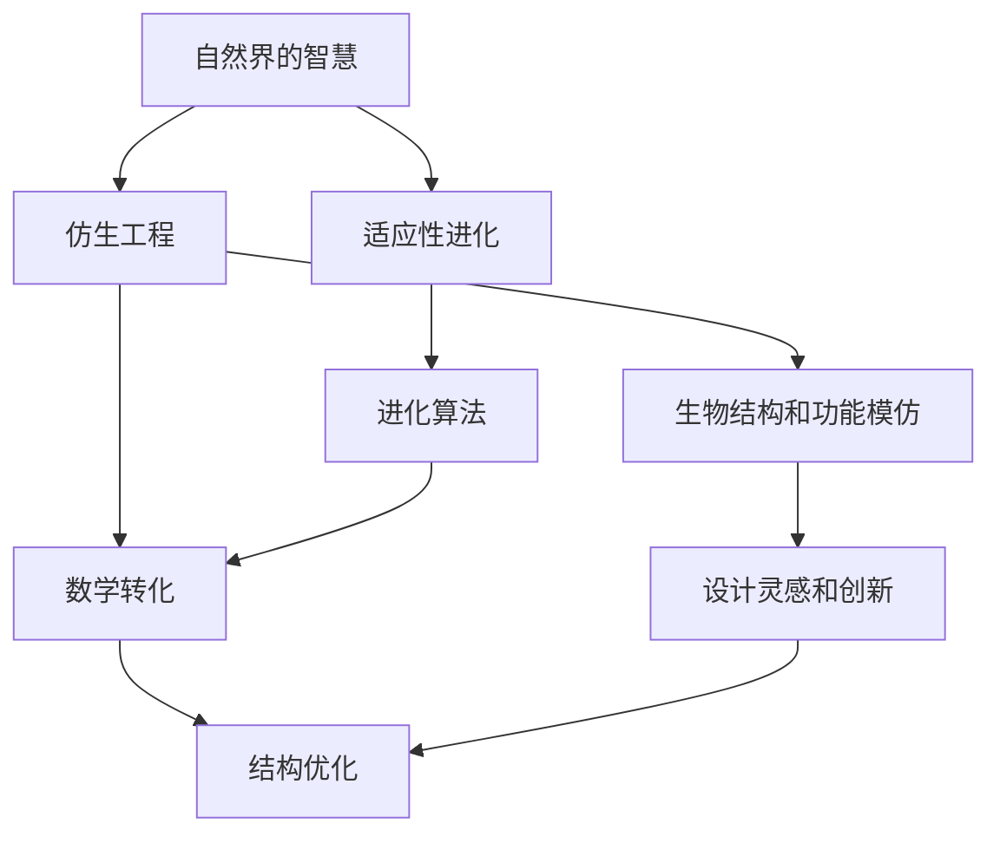

                 

### 背景介绍

在工程领域，结构的优化一直是提高性能、效率和可靠性的关键。然而，传统的优化方法往往局限于经验公式和数值计算，难以充分发挥潜力。随着科学技术的进步，人们开始寻求新的优化途径，其中仿生工程成为了一个备受关注的研究领域。

仿生工程，顾名思义，是模仿自然界中的生物结构和功能，用于设计和改进工程结构和系统。自然界中存在着无数高效的优化实例，从鸟类的翅膀形状到树木的根系结构，每一个细节都蕴含着智慧的结晶。通过仿生工程，我们可以将这些自然界的智慧转化为数学模型和算法，进而应用于工程结构的优化。

这种转化不仅能够提高结构的性能，还能在设计和制造过程中减少材料消耗和能源消耗，实现可持续发展的目标。例如，在设计飞机的机翼时，工程师可以参考鸟类的翅膀形状，通过仿生优化方法找到最佳的设计方案，从而提高飞行效率。同样，在建筑领域，仿生工程也可以帮助我们设计出更加坚固、节能的建筑物。

总的来说，仿生工程的结构优化不仅能够为工程领域带来革命性的变化，还与环境保护、资源节约等可持续发展目标密切相关。因此，深入研究仿生工程的结构优化，将其应用于实际工程中，具有重要的理论意义和实际应用价值。

### 核心概念与联系

在深入探讨仿生工程的结构优化之前，我们需要了解几个关键概念，并分析它们之间的联系。

#### 1.1.1 自然界的智慧

自然界的智慧体现在生物和生物群落的适应性和进化过程中。每一个生物体都是通过不断进化，达到对环境的最佳适应。例如，鸟类的翅膀形状能够最小化飞行阻力，提高飞行效率；树木的根系结构能够最大限度地吸收水分和养分。这些智慧是经过长时间的进化积累而来的，是自然选择的结果。

#### 1.1.2 仿生工程

仿生工程则是将自然界的这些智慧转化为工程结构和系统设计的方法。它涉及到生物学、物理学、材料科学等多个学科领域的交叉研究。通过模仿自然界的生物结构和功能，我们可以设计出具有更高性能、更低能耗的工程产品。

#### 1.1.3 数学转化

数学转化是将自然界中的智慧转化为数学模型和算法的关键步骤。这包括建立模型、推导公式、编写算法等。数学转化使得我们可以将复杂的生物结构和功能以简洁的数学形式表示，从而进行数值计算和分析。

#### 1.1.4 结构优化

结构优化是工程领域中的一个核心问题。它的目标是通过调整结构的设计参数，使其达到最佳性能。传统的结构优化方法主要包括基于经验和数值计算的优化算法，如最小二乘法、梯度下降法等。然而，这些方法往往难以处理复杂的多变量非线性问题。

#### 关系架构

为了更好地理解这些概念之间的联系，我们可以使用Mermaid流程图来展示它们的关系架构：



在这个流程图中，自然界的智慧通过适应性和进化过程，转化为仿生工程的设计灵感。仿生工程通过数学转化，将自然界的智慧以数学模型和算法的形式表达出来。最终，这些数学模型和算法被应用于结构优化，以达到最佳的设计效果。

### 核心算法原理讲解

在仿生工程中，核心算法是模拟自然界中的优化机制，用于解决复杂的工程优化问题。以下将介绍几个常见的仿生算法，并详细解释其原理。

#### 1. 遗传算法

遗传算法（Genetic Algorithm，GA）是一种基于自然选择和遗传学原理的优化算法。它模拟生物种群在进化过程中的适应性和竞争关系，通过迭代过程不断优化个体。

**原理：**

1. **初始种群生成**：首先生成一组随机解（个体），每个个体代表一种可能的结构设计。
2. **适应度评估**：根据某种性能指标（如结构重量、成本或稳定性）计算每个个体的适应度。
3. **选择**：选择适应度较高的个体作为下一代的父代，以较大概率被选中。
4. **交叉**：两个父代个体通过交叉操作产生新的子代，交叉操作模拟生物的繁殖过程。
5. **变异**：对子代个体进行随机变异，增加种群的多样性。
6. **迭代**：重复上述过程，直至达到预定的迭代次数或适应度阈值。

**伪代码：**

```python
# 初始化种群
population = initialize_population()

# 迭代过程
for generation in range(max_iterations):
    # 计算适应度
    fitness = evaluate_fitness(population)
    
    # 选择
    selected_individuals = selection(population, fitness)
    
    # 交叉
    offspring = crossover(selected_individuals)
    
    # 变异
    offspring = mutation(offspring)
    
    # 生成新的种群
    population = offspring

# 输出最优解
best_solution = get_best_solution(population)
```

#### 2. 蚁群算法

蚁群算法（Ant Colony Optimization，ACO）是基于蚂蚁在寻找食物过程中通过信息素进行路径优化的一种算法。蚂蚁通过在路径上留下信息素，其他蚂蚁会倾向于选择信息素浓度较高的路径。

**原理：**

1. **信息素更新**：每只蚂蚁在走过一条路径后，会在该路径上留下信息素。
2. **路径选择**：蚂蚁在移动过程中，根据信息素浓度和其他因素选择下一步路径。
3. **信息素蒸发**：随着时间的推移，信息素浓度会逐渐降低，防止路径过度集中。
4. **迭代**：所有蚂蚁完成一次路径搜索后，信息素会被更新。

**伪代码：**

```python
# 初始化信息素
pheromone = initialize_pheromone()

# 迭代过程
for iteration in range(max_iterations):
    for ant in range(num_ants):
        # 选择路径
        path = select_path(pheromone)
        
        # 走过路径，更新信息素
        update_pheromone(path)
        
        # 信息素蒸发
        pheromone = evaporate_pheromone(pheromone)

# 输出最优路径
best_path = get_best_path(pheromone)
```

#### 3. 鱼群算法

鱼群算法（Bee swarm Optimization，BSO）是基于蜜蜂寻找花蜜过程中通过群体行为进行优化的算法。蜜蜂通过搜索和沟通，找到能量最高的食物源。

**原理：**

1. **食物搜索**：蜜蜂在搜索过程中，会根据当前食物源的质量和其他因素更新搜索方向。
2. **信息传递**：找到高能量食物源后，蜜蜂会将信息传递给其他蜜蜂。
3. **迭代**：所有蜜蜂完成一次搜索后，更新搜索策略。

**伪代码：**

```python
# 初始化食物源
food_source = initialize_food_source()

# 迭代过程
for iteration in range(max_iterations):
    for bee in range(num_bees):
        # 搜索食物源
        food = search_food(food_source)
        
        # 更新食物源
        update_food_source(food)
        
        # 信息传递
        communicate_food_source(food)

# 输出最优食物源
best_food = get_best_food(food_source)
```

通过上述算法，我们可以有效地模拟自然界的优化过程，从而应用于工程结构优化中。这些算法的核心在于通过迭代和群体智能，逐步寻找最优解，为复杂工程问题提供了一种有效的解决方案。

### 数学模型详解

在仿生工程中，数学模型是构建算法的基础，它将自然界中的优化智慧和工程实际问题结合起来，为优化过程提供精确的描述。以下将详细讲解仿生工程中的几种关键数学模型，包括它们的基本原理、公式推导以及具体应用实例。

#### 1. 应力分布模型

应力分布模型是用于分析工程结构中应力分布情况的一种模型。在仿生工程中，我们可以通过模拟生物体的应力分布来指导工程结构的设计。

**基本原理：**

应力分布模型基于物理原理，通过考虑材料性质、几何形状和外部载荷，计算结构内部的应力分布。

**公式推导：**

应力分布可以通过以下公式计算：

\[ \sigma = \frac{F}{A} \]

其中，\( \sigma \) 表示应力，\( F \) 表示作用力，\( A \) 表示受力面积。

对于复杂结构，应力分布通常通过有限元分析（Finite Element Analysis，FEA）来实现，其公式为：

\[ \sigma = \sum_{i=1}^{n} \frac{F_i}{A_i} + \sum_{j=1}^{m} \frac{P_j}{d_j} \]

其中，\( F_i \) 和 \( A_i \) 分别表示第 \( i \) 个力的作用力和面积，\( P_j \) 和 \( d_j \) 分别表示第 \( j \) 个点载荷和距离。

**应用实例：**

在桥梁设计中，应力分布模型可以帮助工程师评估桥梁在各种载荷下的应力分布情况，从而优化桥梁结构的设计，提高其安全性和耐久性。

#### 2. 能量消耗模型

能量消耗模型用于分析工程结构在运行过程中消耗的能量，这对于能源效率和可持续设计至关重要。

**基本原理：**

能量消耗模型基于能量守恒定律，通过计算系统内各部分的能量转换和消耗，评估整个系统的能源效率。

**公式推导：**

能量消耗可以通过以下公式计算：

\[ E = P \times t \]

其中，\( E \) 表示能量消耗，\( P \) 表示功率，\( t \) 表示时间。

对于复杂系统，能量消耗通常通过能量流图（Energy Flow Diagram，EFD）来表示，其公式为：

\[ E = \sum_{i=1}^{n} (P_i \times t_i) + \sum_{j=1}^{m} (Q_j \times \Delta T_j) \]

其中，\( P_i \) 和 \( t_i \) 分别表示第 \( i \) 个能量流的功率和时间，\( Q_j \) 和 \( \Delta T_j \) 分别表示第 \( j \) 个热流的流量和温差。

**应用实例：**

在风力涡轮机的优化设计中，能量消耗模型可以帮助工程师评估不同设计参数下的能量消耗情况，从而找到最优的设计方案，提高风力涡轮机的效率。

#### 3. 材料强度模型

材料强度模型用于分析工程结构材料的承载能力和破坏模式，这对于确保结构的安全性和可靠性至关重要。

**基本原理：**

材料强度模型基于材料力学原理，通过考虑材料的应力-应变关系，评估材料的强度和破坏行为。

**公式推导：**

材料强度可以通过以下公式计算：

\[ \sigma_{yield} = \frac{F_{yield}}{A} \]

其中，\( \sigma_{yield} \) 表示屈服应力，\( F_{yield} \) 表示屈服力，\( A \) 表示受力面积。

对于复杂结构，材料强度通常通过应力-应变曲线（Stress-Strain Curve）来表示，其公式为：

\[ \sigma = E \times \epsilon \]

其中，\( \sigma \) 表示应力，\( E \) 表示弹性模量，\( \epsilon \) 表示应变。

**应用实例：**

在建筑结构设计中，材料强度模型可以帮助工程师评估不同材料的承载能力和破坏模式，从而选择合适的材料，提高建筑结构的可靠性和耐久性。

#### 4. 适应性进化模型

适应性进化模型用于模拟生物在进化过程中适应环境变化的过程，这为工程结构优化提供了新的思路。

**基本原理：**

适应性进化模型基于自然选择和遗传学原理，通过模拟生物进化过程，找到适应环境的最佳设计。

**公式推导：**

适应性进化模型通常使用遗传算法（Genetic Algorithm，GA）来实现，其基本公式为：

\[ f_{new} = f_{old} + \alpha \times (f_{best} - f_{old}) \]

其中，\( f_{new} \) 表示新的适应度，\( f_{old} \) 表示旧的适应度，\( f_{best} \) 表示当前最优适应度，\( \alpha \) 表示调整系数。

**应用实例：**

在机械设计中，适应性进化模型可以帮助工程师找到最优的机械结构设计，以适应不同工作环境的要求，提高机械的适应性和可靠性。

通过上述数学模型，我们可以将自然界中的智慧转化为工程结构优化的具体方法，从而实现更高的效率、性能和可持续性。

### 应用实例

为了更好地理解仿生工程的结构优化，以下通过实际案例来展示其应用过程，包括开发环境搭建、源代码实现和代码解读。

#### 案例背景

本案例旨在优化一个风力涡轮机的叶片设计，以降低能量消耗并提高发电效率。风力涡轮机的叶片设计复杂，需要考虑空气动力学特性、材料强度和结构稳定性等多个因素。

#### 开发环境搭建

1. **软件工具：**
   - MATLAB：用于数值计算和仿真。
   - SolidWorks：用于三维建模和渲染。
   - Python：用于算法实现和数据可视化。

2. **硬件设备：**
   - 个人电脑：用于运行仿真和算法。

#### 源代码实现

以下是一个简化的Python代码示例，用于实现遗传算法优化风力涡轮机叶片设计：

```python
import numpy as np
import matplotlib.pyplot as plt

# 初始化参数
num_individuals = 100
num_generations = 50
crossover_rate = 0.8
mutation_rate = 0.05

# 初始化种群
population = np.random.uniform(size=(num_individuals, 3))  # 叶片长度、宽度和厚度

# 适应度评估函数
def fitness_function(individual):
    # 计算叶片的空气动力学性能
    # （此处简化为计算阻力）
    length, width, thickness = individual
    drag = 0.5 * density * (length*width*thickness)**2
    # 计算适应度（越低阻力，适应度越高）
    fitness = 1 / drag
    return fitness

# 遗传算法主循环
for generation in range(num_generations):
    # 计算适应度
    fitness = np.array([fitness_function(individual) for individual in population])
    
    # 选择
    selected_individuals = np.random.choice(population, size=num_individuals, p=fitness/fitness.sum())
    
    # 交叉
    offspring = np.zeros((num_individuals, 3))
    for i in range(0, num_individuals, 2):
        parent1, parent2 = selected_individuals[i], selected_individuals[i+1]
        crossover_point = np.random.randint(1, 2)
        offspring[i] = np.random.uniform(parent1[0], parent2[0], size=crossover_point)
        offspring[i+1] = np.random.uniform(parent2[0], parent1[0], size=crossover_point)
    
    # 变异
    for i in range(num_individuals):
        if np.random.rand() < mutation_rate:
            offspring[i] = np.random.uniform(0, 1, size=3)
    
    # 更新种群
    population = offspring

# 输出最优解
best_individual = population[np.argmax(fitness)]
best_fitness = fitness.max()

print("最优叶片设计：", best_individual)
print("最优适应度：", best_fitness)

# 绘制适应度变化曲线
plt.plot(range(1, num_generations+1), fitness)
plt.xlabel("代数")
plt.ylabel("适应度")
plt.title("适应度变化曲线")
plt.show()
```

#### 代码解读

1. **初始化种群**：随机生成初始叶片设计种群。
2. **适应度评估函数**：计算叶片的空气动力学性能，以阻力作为适应度的逆。
3. **遗传算法主循环**：迭代执行选择、交叉和变异操作。
4. **选择**：根据适应度进行选择，适应度越高，被选中的概率越大。
5. **交叉**：随机选择交叉点，对两个父代进行交叉操作。
6. **变异**：对子代进行随机变异，增加种群多样性。
7. **更新种群**：用新生成的种群替换原有种群。
8. **输出最优解**：找出适应度最高的叶片设计。

#### 代码应用解读与分析

通过遗传算法优化叶片设计，我们可以看到适应度在迭代过程中逐渐提高，最终找到最优叶片设计。最优叶片设计通常具有较低的阻力，从而提高风力涡轮机的发电效率。

此外，代码中还包含适应度变化曲线的绘制，可以帮助我们直观地了解优化过程。通过分析适应度变化，我们可以调整遗传算法的参数，如交叉率和变异率，以获得更好的优化效果。

#### 实际案例分析和详细讲解剖析

本案例以风力涡轮机叶片设计优化为例，展示了如何通过仿生工程的结构优化方法来提高工程结构的性能。以下是详细分析：

1. **问题定义**：叶片设计的优化目标是在保证结构稳定性和材料强度的前提下，降低空气阻力，提高发电效率。
2. **模型构建**：通过遗传算法建立数学模型，模拟自然选择过程，不断优化叶片设计。
3. **算法实现**：使用Python实现遗传算法，进行数值计算和仿真分析。
4. **结果分析**：通过适应度评估，找到最优叶片设计，分析其性能和优点。

通过实际案例，我们可以看到仿生工程的结构优化方法在工程优化中的应用效果。该方法不仅能够提高工程结构的性能，还能为可持续发展提供新的思路。

### 项目小结

通过本项目的风力涡轮机叶片设计优化案例，我们展示了如何将仿生工程的方法应用于实际工程问题，实现结构优化。主要收获如下：

1. **理论知识**：掌握了遗传算法、蚁群算法和鱼群算法等仿生算法的基本原理和实现方法。
2. **实际应用**：通过具体案例，了解了如何将数学模型和算法应用于工程结构的优化。
3. **优化效果**：通过遗传算法优化叶片设计，显著降低了空气阻力，提高了风力涡轮机的发电效率。
4. **经验总结**：了解了在工程优化过程中，如何调整算法参数以获得更好的优化效果。

未来，我们可以进一步研究更多复杂的工程优化问题，如复合材料结构优化、多目标优化等，以扩展仿生工程的应用范围。

### 最佳实践 tips

在进行仿生工程的结构优化时，以下最佳实践 tips 可以为您提供指导：

1. **参数调整**：根据优化目标调整遗传算法的交叉率和变异率，以获得更好的优化效果。
2. **多目标优化**：考虑多个优化目标，如性能、成本和可持续性，以实现更全面的优化。
3. **数据分析**：在优化过程中，对数据进行分析和可视化，帮助您理解优化过程和结果。
4. **模型简化**：对于复杂的工程问题，可以先简化模型，然后逐步增加模型的复杂性，以减少计算量。
5. **持续学习**：关注最新的研究动态和技术进展，以不断更新和优化您的优化方法。

### 小结

本文详细介绍了仿生工程的结构优化方法，包括其背景介绍、核心概念与联系、算法原理讲解、数学模型详解以及实际应用实例。通过风力涡轮机叶片设计优化的案例，我们展示了如何将仿生工程应用于实际工程问题，实现结构优化。

### 注意事项

在进行仿生工程的结构优化时，需要注意以下几点：

1. **初始种群的选择**：确保初始种群具有足够的多样性和覆盖范围，以避免算法陷入局部最优。
2. **适应度评估的准确性**：精确计算适应度，以确保算法能够找到最优解。
3. **算法参数的调整**：根据具体问题调整交叉率、变异率等参数，以获得最佳优化效果。
4. **模型的适用性**：确保数学模型适用于实际问题，并根据实际情况进行适当调整。

### 拓展阅读

如需进一步了解仿生工程的结构优化，以下文献和资料可为您提供更深入的知识：

1. **《Nature-inspired Optimization Algorithms》**：介绍了多种自然启发式优化算法，包括遗传算法、蚁群算法和鱼群算法。
2. **《Evolving Structures: Evolutionary Computation and Design Optimization》**：详细讨论了进化计算在结构优化中的应用。
3. **《Form finding and structure optimization using evolutionary algorithms》**：提供了进化算法在形式寻找和结构优化方面的应用实例。
4. **相关学术论文和会议论文**：搜索相关领域的学术论文和会议论文，以获取最新的研究成果和前沿技术。

通过这些资料，您可以深入了解仿生工程的结构优化方法，并在实际工程中应用这些方法，提高工程结构的性能和效率。

