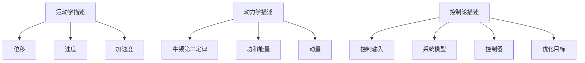

                 

### 文章标题：仿生机器人的运动规划：生物运动的数学模拟

#### 关键词：
- 仿生机器人
- 运动规划
- 生物运动
- 数学模拟
- 机器人算法

#### 摘要：
本文深入探讨了仿生机器人的运动规划问题，重点关注生物运动的数学模拟方法。通过分析生物运动的基本原理和数学模型，本文提出了一系列运动规划算法，并通过对实例和项目实战的详细分析，展示了这些算法在实际应用中的效果。本文旨在为研究人员和工程师提供一套系统、实用的运动规划解决方案，以推动仿生机器人的发展。

## 引言

### 仿生机器人的基本概念

仿生机器人是指模仿生物特征和行为设计的机器人。它们在形态、结构、感知和运动等方面模仿生物体的特点，从而实现更为自然和高效的运动行为。仿生机器人可以分为几类，如机械仿生机器人、软体仿生机器人和混合式仿生机器人。机械仿生机器人主要模仿机械动物的运动模式，如四足行走机器人和两足步行机器人；软体仿生机器人则模仿软体动物的运动特性，如蠕动机器和游泳机器人；混合式仿生机器人结合了机械和软体的优势，具有更高的灵活性和适应性。

### 仿生机器人的运动规划的重要性

运动规划是仿生机器人设计中的关键环节，它决定了机器人能否在复杂环境中实现高效、稳定的运动。仿生机器人的运动规划需要考虑多种因素，如运动路径、速度控制、能量消耗和适应性等。通过运动规划，机器人可以实现自主导航、复杂任务执行和环境适应等功能，从而提高其应用价值。

### 生物运动的数学模拟方法

生物运动的数学模拟是研究仿生机器人运动规划的重要方法。通过对生物运动进行数学建模和模拟，可以深入理解生物运动的基本原理，从而为机器人设计提供理论支持。生物运动的数学模型包括动力学模型、运动学模型和控制模型等。动力学模型描述了生物运动中的力、能量和动量等物理量；运动学模型描述了生物运动的空间位置、速度和加速度等几何量；控制模型则描述了生物运动的控制策略和机制。

本文将从以上三个方面出发，系统地介绍仿生机器人的运动规划方法，并通过实例和项目实战，展示这些方法在实际应用中的效果。本文的目的是为读者提供一套实用的运动规划解决方案，以推动仿生机器人技术的发展。

## 仿生机器人的基本原理

### 仿生机器人的定义和分类

仿生机器人是通过模仿生物的形态、结构、行为和功能而设计的机器人。它们在生物形态、生物力学、生物电子学和生物控制等领域进行研究，旨在实现更为自然、高效和智能的运动行为。仿生机器人可以根据其模仿的生物类型和功能进行分类，如机械仿生机器人、软体仿生机器人和混合式仿生机器人。

机械仿生机器人主要模仿机械动物的形态和运动方式，如四足行走机器人和两足步行机器人。它们通常采用刚体结构和机械驱动系统，通过机械结构的设计和运动学分析来实现生物样式的运动。软体仿生机器人则模仿软体动物的形态和运动特性，如蠕动机器和游泳机器人。它们通常采用柔软的材料和软性驱动系统，通过流体动力学和软性机械学来实现生物样式的运动。混合式仿生机器人结合了机械和软体的优势，如软体机械臂和软体飞行器。它们具有更高的灵活性和适应性，可以在复杂环境中实现多样化的运动行为。

### 仿生机器人的设计原则

仿生机器人的设计原则包括以下几个方面：

1. **形态模仿**：仿生机器人需要模仿生物的形态和结构，以实现类似生物的运动能力和适应性。例如，四足行走机器人需要具有与生物相似的四足结构，以便在地面行走时保持稳定性和灵活性。

2. **材料选择**：仿生机器人需要选择合适的材料，以实现与生物相似的柔韧性和强度。例如，软体仿生机器人需要选择柔软、轻便且具有弹性的材料，如硅胶、聚氨酯和弹性纤维等。

3. **驱动系统**：仿生机器人需要选择合适的驱动系统，以实现生物样式的运动。机械仿生机器人通常采用电动机、液压和气压驱动系统，而软体仿生机器人则采用气动或液动软性驱动系统。

4. **感知系统**：仿生机器人需要配备感知系统，以实现环境感知和自主决策。例如，视觉传感器、触觉传感器和力觉传感器等，可以帮助仿生机器人感知周围环境，调整运动策略。

5. **控制策略**：仿生机器人需要采用智能控制策略，以实现生物样式的运动和行为。例如，基于生物力学的控制策略、基于机器学习的控制策略和基于模糊逻辑的控制策略等。

### 仿生机器人的结构分析

仿生机器人的结构可以分为以下几个部分：

1. **驱动系统**：包括电动机、液压系统、气压系统和软性驱动系统等。驱动系统负责产生力量，驱动仿生机器人的运动。

2. **感知系统**：包括视觉传感器、触觉传感器、力觉传感器和超声波传感器等。感知系统负责采集环境信息，为运动规划和控制提供依据。

3. **控制系统**：包括微控制器、处理器和算法模块等。控制系统负责处理感知信息，生成运动指令，控制驱动系统的运行。

4. **运动执行机构**：包括机械臂、机械腿、软体结构和翅膀等。运动执行机构负责执行运动指令，实现仿生机器人的运动。

5. **能量供应系统**：包括电池、充电系统和能量回收系统等。能量供应系统负责为仿生机器人提供稳定的能量。

### 仿生机器人的驱动系统

仿生机器人的驱动系统是实现其运动能力的关键部分。根据不同的应用需求和仿生机器人类型，驱动系统可以采用不同的驱动方式：

1. **电动机驱动**：电动机驱动是最常见的驱动方式，适用于机械仿生机器人。电动机可以提供连续的旋转运动，通过齿轮、皮带或直接驱动等方式，将旋转运动转换为线性运动，实现仿生机器人的运动。

2. **液压驱动**：液压驱动系统适用于大负载、高精度要求的仿生机器人。液压驱动通过液体压力传递动力，可以实现精细的运动控制和强大的驱动能力。

3. **气压驱动**：气压驱动系统适用于轻量级、软体仿生机器人。气压驱动通过气体压力驱动软性材料，实现柔软和灵活的运动。

4. **软性驱动**：软性驱动系统是软体仿生机器人的核心，通过控制软性材料的形变和收缩，实现复杂的生物样运动。

### 仿生机器人的感知系统

仿生机器人的感知系统是实现自主运动和智能交互的关键。常见的感知系统包括以下几种：

1. **视觉传感器**：视觉传感器用于获取环境图像，通过图像处理算法提取环境信息。常见的视觉传感器有摄像头、激光雷达和立体视觉传感器等。

2. **触觉传感器**：触觉传感器用于感知接触力和触觉信息，常见于软体仿生机器人的手指和触觉传感器阵列。

3. **力觉传感器**：力觉传感器用于感知机器人的受力情况，常见于机械臂和执行器等。

4. **温度传感器**：温度传感器用于感知环境温度，常见于热成像和温度监测等应用。

5. **超声波传感器**：超声波传感器通过发射和接收超声波信号，实现距离测量和物体探测。

### 仿生机器人的控制系统

仿生机器人的控制系统是实现自主运动和智能交互的核心。常见的控制系统包括：

1. **微控制器**：微控制器负责处理传感器数据，生成运动指令，并通过驱动系统控制仿生机器人的运动。

2. **处理器**：处理器负责执行复杂的算法和计算任务，如运动规划、路径规划和智能交互等。

3. **算法模块**：算法模块包括运动规划算法、路径规划算法、智能交互算法等，负责实现仿生机器人的自主运动和智能交互。

4. **无线通信模块**：无线通信模块用于实现仿生机器人与外部设备或远程控制器的通信，如Wi-Fi、蓝牙和LoRa等。

### 仿生机器人的运动执行机构

仿生机器人的运动执行机构是实现其运动能力的核心部分，包括以下几种：

1. **机械臂**：机械臂是仿生机器人中常见的执行机构，可以用于抓取、搬运和装配等任务。

2. **机械腿**：机械腿是用于地面行走的执行机构，可以模仿生物的四足行走、两足行走等运动模式。

3. **软体结构**：软体结构是软体仿生机器人的核心，可以通过形变实现复杂的生物样运动。

4. **翅膀**：翅膀是飞行仿生机器人的核心，可以通过振动和形变实现飞行。

### 仿生机器人的能量供应系统

仿生机器人的能量供应系统是保证其长时间运行的基础。常见的能量供应系统包括：

1. **电池**：电池是仿生机器人最常用的能量存储设备，常见有锂电池、聚合物锂电池和燃料电池等。

2. **充电系统**：充电系统用于为电池充电，常见有无线充电、有线充电和太阳能充电等。

3. **能量回收系统**：能量回收系统用于回收和利用机器人在运动过程中产生的能量，如机械能回收、热能回收等。

## 生物运动的数学模型

### 生物运动的基本数学描述

生物运动是生物学、物理学和数学等多个学科交叉的研究领域。在数学上，生物运动可以通过运动学、动力学和控制论等多个角度进行描述。运动学主要研究生物体的位置、速度和加速度等几何量，而动力学则研究生物运动中的力、能量和动量等物理量。控制论则关注生物运动的控制机制和策略。

#### 运动学描述

运动学是研究物体运动的几何学和运动规律的科学。在生物运动中，运动学描述了生物体的位置、速度和加速度等几何量。以下是运动学描述的一些基本公式：

- **位移（s）**：位移是描述生物体位置变化的物理量，通常用直角坐标系来表示。位移可以表示为：
  $$ s = x \hat{i} + y \hat{j} + z \hat{k} $$
  其中，$x$、$y$、$z$ 分别是生物体在直角坐标系中的水平、垂直和高度方向的位移，$\hat{i}$、$\hat{j}$、$\hat{k}$ 是直角坐标系的单位向量。

- **速度（v）**：速度是描述生物体位置变化率的物理量，通常用矢量表示。速度可以表示为：
  $$ v = \frac{ds}{dt} $$
  其中，$s$ 是位移，$t$ 是时间。

- **加速度（a）**：加速度是描述生物体速度变化率的物理量，同样用矢量表示。加速度可以表示为：
  $$ a = \frac{dv}{dt} $$
  其中，$v$ 是速度。

#### 动力学描述

动力学是研究物体运动和力的关系的科学。在生物运动中，动力学描述了生物体运动中的力、能量和动量等物理量。以下是动力学描述的一些基本公式：

- **牛顿第二定律**：牛顿第二定律描述了力和加速度之间的关系，公式为：
  $$ F = ma $$
  其中，$F$ 是作用在生物体上的合外力，$m$ 是生物体的质量，$a$ 是生物体的加速度。

- **功和能量**：功是力在物体运动方向上的分量与位移的乘积，表示力在物体运动过程中所做的功。能量是物体在运动过程中具有的做功能力，包括动能、势能和内能等。动能和势能的基本公式如下：
  $$ E_k = \frac{1}{2}mv^2 $$
  $$ E_p = mgh $$
  其中，$E_k$ 是动能，$E_p$ 是势能，$m$ 是质量，$v$ 是速度，$g$ 是重力加速度，$h$ 是高度。

- **动量**：动量是物体质量和速度的乘积，表示物体在运动过程中的动量。动量的基本公式为：
  $$ p = mv $$
  其中，$p$ 是动量。

#### 控制论描述

控制论是研究系统控制和优化方法的理论。在生物运动中，控制论描述了生物体运动中的控制机制和策略。以下是控制论描述的一些基本概念：

- **控制输入**：控制输入是用于改变生物体运动状态的输入信号，如力、速度和加速度等。

- **系统模型**：系统模型是描述生物体运动特性的数学模型，包括状态方程、输出方程和控制方程等。

- **控制器**：控制器是用于实现生物体运动控制策略的装置，如PID控制器、模糊控制器和神经网络控制器等。

- **优化目标**：优化目标是用于评价生物体运动性能的指标，如运动精度、速度、能耗等。

### 生物运动的基本数学描述 Mermaid 流程图



### 生物运动中的动力学模型

动力学模型是描述生物运动中力、能量和动量等物理量的数学模型。它包括状态方程、输出方程和控制方程等，用于分析生物体的运动特性。以下是几种常见的动力学模型：

#### 一维弹簧振子模型

一维弹簧振子模型是研究简单振动系统的基础。它假设生物体的运动可以用一个弹簧和质量点来描述，弹簧的弹性系数和生物体的质量决定了生物体的振动特性。状态方程可以表示为：
$$
\begin{cases}
  x(t) = A \cos(\omega t + \phi) \\
  v(t) = -A \omega \sin(\omega t + \phi)
\end{cases}
$$
其中，$x(t)$ 是生物体的位移，$v(t)$ 是生物体的速度，$A$ 是振幅，$\omega$ 是角频率，$\phi$ 是初相位。

控制方程可以表示为：
$$
\frac{d^2x}{dt^2} + \omega^2 x = 0
$$
这是一个简单的线性微分方程，可以通过求解得到生物体的运动规律。

#### 两足步行模型

两足步行模型是研究人类和动物行走运动的关键模型。它假设生物体通过两足交替着地，实现连续的行走运动。状态方程可以表示为：
$$
\begin{cases}
  x(t) = \frac{v}{f} \sin(\omega t + \phi) \\
  y(t) = \frac{1}{2} L \cos(\omega t + \phi)
\end{cases}
$$
其中，$x(t)$ 是生物体的水平位移，$y(t)$ 是生物体的高度，$v$ 是行走速度，$f$ 是步频，$L$ 是步长，$\omega$ 是角频率，$\phi$ 是初相位。

控制方程可以表示为：
$$
\begin{cases}
  \frac{dx}{dt} = v \cos(\omega t + \phi) \\
  \frac{dy}{dt} = -L \omega \sin(\omega t + \phi)
\end{cases}
$$
这是一个非线性微分方程，需要通过数值方法进行求解。

### 生物运动中的运动学模型

运动学模型是描述生物体运动中几何量关系的数学模型。它包括位置、速度和加速度等，用于分析生物体的运动轨迹和运动特性。以下是几种常见的运动学模型：

#### 直线运动模型

直线运动模型是最简单的运动学模型，假设生物体在直线上运动。状态方程可以表示为：
$$
\begin{cases}
  x(t) = v_0 t + x_0 \\
  y(t) = v_0 t + y_0
\end{cases}
$$
其中，$x(t)$ 和 $y(t)$ 分别是生物体在水平和垂直方向上的位移，$v_0$ 是初始速度，$x_0$ 和 $y_0$ 是初始位置。

控制方程可以表示为：
$$
\begin{cases}
  \frac{dx}{dt} = v_0 \\
  \frac{dy}{dt} = v_0
\end{cases}
$$
这是一个线性方程组，可以直接求解。

#### 圆周运动模型

圆周运动模型是研究生物体在圆周轨道上运动的模型。状态方程可以表示为：
$$
\begin{cases}
  x(t) = r \cos(\omega t + \phi) \\
  y(t) = r \sin(\omega t + \phi)
\end{cases}
$$
其中，$x(t)$ 和 $y(t)$ 分别是生物体在水平和垂直方向上的位移，$r$ 是圆周半径，$\omega$ 是角速度，$\phi$ 是初相位。

控制方程可以表示为：
$$
\begin{cases}
  \frac{dx}{dt} = -r \omega \sin(\omega t + \phi) \\
  \frac{dy}{dt} = r \omega \cos(\omega t + \phi)
\end{cases}
$$
这是一个非线性方程组，需要通过数值方法进行求解。

### 生物运动中的控制模型

控制模型是描述生物体运动控制策略和机制的数学模型。它包括控制输入、系统模型和控制器等，用于实现生物体的自主运动和智能控制。以下是几种常见的控制模型：

#### PID控制器模型

PID控制器是一种常用的控制模型，用于调节生物体的运动状态。状态方程可以表示为：
$$
\begin{cases}
  x(t) = x_0 + K_p e(t) + K_i \int_{0}^{t} e(\tau) d\tau + K_d \frac{de(t)}{dt} \\
  y(t) = y_0 + K_p e(t) + K_i \int_{0}^{t} e(\tau) d\tau + K_d \frac{de(t)}{dt}
\end{cases}
$$
其中，$x(t)$ 和 $y(t)$ 分别是生物体在水平和垂直方向上的位移，$x_0$ 和 $y_0$ 是初始位置，$e(t)$ 是误差信号，$K_p$、$K_i$ 和 $K_d$ 分别是比例、积分和微分系数。

控制方程可以表示为：
$$
\begin{cases}
  e(t) = x(t) - x_{\text{目标}} \\
  de(t)/dt = \frac{dx(t)}{dt} - \frac{dx_{\text{目标}}}{dt}
\end{cases}
$$
这是一个线性方程组，可以直接求解。

#### 模糊控制器模型

模糊控制器是一种基于模糊逻辑的控制模型，用于处理非线性、不确定性系统的控制问题。状态方程可以表示为：
$$
x(t) = \frac{1}{\mu} \sum_{i=1}^{n} w_i \cdot x_i
$$
其中，$x(t)$ 是生物体的位移，$\mu$ 是模糊化因子，$w_i$ 是模糊规则权重，$x_i$ 是模糊化输入。

控制方程可以表示为：
$$
\begin{cases}
  x_i = f_i(x_1, x_2, \ldots, x_n) \\
  \mu = \min\left(\frac{1}{|x_i - x_{\text{目标}}|}, 1\right)
\end{cases}
$$
这是一个非线性方程组，需要通过模糊规则进行求解。

### 生物运动的数学模型总结

生物运动的数学模型包括运动学模型、动力学模型和控制模型。运动学模型主要描述生物体的位置、速度和加速度等几何量，用于分析生物体的运动轨迹和运动特性。动力学模型主要描述生物运动中的力、能量和动量等物理量，用于分析生物体的运动规律。控制模型主要描述生物体运动的控制策略和机制，用于实现生物体的自主运动和智能控制。通过这些模型，我们可以深入理解生物运动的基本原理，为仿生机器人的运动规划提供理论支持。

## 机器人的运动规划算法

### 机器人运动规划概述

机器人运动规划是指为机器人生成一个从初始状态到目标状态的路径，使得机器人能够安全、高效地完成特定任务。运动规划是机器人研究中的关键问题，它涉及到路径规划、轨迹规划、速度规划和能量优化等多个方面。有效的运动规划算法能够提高机器人的自主性和环境适应性，是实现智能机器人系统的基础。

### 基于生物运动的规划算法

基于生物运动的规划算法是仿生机器人运动规划的重要方向。这些算法通过模仿生物的运动行为和机制，为机器人提供更为自然和高效的运动模式。以下是一些常见的基于生物运动的规划算法：

#### 两足步行算法

两足步行算法是仿生机器人中常用的一种算法，用于模拟人类和动物的两足行走运动。该算法通常采用动力学模型和运动学模型，通过控制身体的摆动和腿部动作，实现稳定而连续的行走运动。以下是一个简化的两足步行算法伪代码：

```
// 初始化参数
set initial state of robot
set step frequency f
set step length L
set angle of hip θ_h
set angle of knee θ_k

// 运动循环
while (not reach goal state) {
  // 计算步频周期
  T = 1/f

  // 计算身体摆动角度
  θ_b = θ_b(t-1) + (θ_b(t-1) - θ_b(t-2)) * T

  // 计算腿部摆动角度
  θ_l = θ_l(t-1) + (θ_l(t-1) - θ_l(t-2)) * T

  // 更新机器人状态
  update robot state with new angles
}
```

#### 四足步行算法

四足步行算法用于模拟动物的四足行走运动。与两足步行算法类似，四足步行算法也采用动力学和运动学模型，通过控制四肢的协调运动，实现稳定的四足行走。以下是一个简化的四足步行算法伪代码：

```
// 初始化参数
set initial state of robot
set step frequency f
set step length L
set angle of each leg θ_l

// 运动循环
while (not reach goal state) {
  // 计算步频周期
  T = 1/f

  // 更新前肢状态
  update front legs with new angles

  // 更新后肢状态
  update back legs with new angles

  // 计算重心位置
  center_of_gravity = calculate center of gravity

  // 调整身体姿态
  adjust body posture based on center_of_gravity
}
```

#### 蠕动算法

蠕动算法是软体仿生机器人中常用的一种算法，用于模拟软体动物（如蚯蚓、蛇等）的蠕动运动。该算法通过控制软体结构的伸缩和弯曲，实现连续的蠕动运动。以下是一个简化的蠕动算法伪代码：

```
// 初始化参数
set initial state of robot
set wave speed v
set number of segments N
set length of each segment L

// 运动循环
while (not reach goal state) {
  // 计算波前位置
  front_segment = calculate front segment position

  // 更新软体结构
  update each segment based on wave front

  // 调整身体姿态
  adjust body posture based on segment positions
}
```

### 传统运动规划算法

传统运动规划算法包括路径规划算法、轨迹规划算法和速度规划算法等。这些算法在机器人运动规划中得到了广泛应用，具有较高的实用性和稳定性。

#### A*算法

A*算法是一种常见的路径规划算法，用于在离散环境中找到从起点到终点的最优路径。A*算法基于启发式搜索，通过评估每个节点的代价，选择最优路径。以下是一个简化的A*算法伪代码：

```
// 初始化参数
initialize open_set and closed_set
set start_node and goal_node

// 迭代过程
while (not empty open_set) {
  // 选择最小F值的节点
  current_node = select_node_with_min_F_value(open_set)

  // 如果当前节点是目标节点，则完成路径规划
  if (current_node == goal_node) {
    return reconstruct_path(goal_node)
  }

  // 将当前节点从open_set移动到closed_set
  move current_node from open_set to closed_set

  // 扩展当前节点
  for (each neighbor of current_node) {
    // 计算代价
    g = distance between current_node and neighbor
    h = heuristic估值 from neighbor to goal_node

    // 如果 neighbor 在 closed_set 中，则跳过
    if (neighbor in closed_set) {
      continue
    }

    // 计算总代价
    F = g + h

    // 如果 neighbor 在 open_set 中，则更新其代价
    if (neighbor in open_set) {
      update neighbor's cost
    } else {
      // 将 neighbor 加入 open_set
      add neighbor to open_set
    }
  }
}
```

#### 贝尔曼最优算法

贝尔曼最优算法是一种基于动态规划的路径规划算法，用于在连续环境中找到最优路径。该算法通过递归计算每个节点的最优代价，从而找到整体最优路径。以下是一个简化的贝尔曼最优算法伪代码：

```
// 初始化参数
initialize V[] with initial_cost[]

// 迭代过程
for (each node n in the environment) {
  for (each action a in the action_set) {
    // 计算新代价
    new_cost = cost(n, a) + V[n]

    // 如果新代价小于当前代价，则更新代价
    if (new_cost < V[n]) {
      V[n] = new_cost
    }
  }
}

// 返回最优路径
return reconstruct_path(goal_node)
```

#### 运动学轨迹规划算法

运动学轨迹规划算法用于生成机器人在连续空间中的运动轨迹。常见的运动学轨迹规划算法包括线性插值、贝塞尔曲线插值和样条曲线插值等。以下是一个简化的线性插值轨迹规划算法伪代码：

```
// 初始化参数
set initial state of robot
set target state
set time interval T

// 迭代过程
for (t = 0; t < T; t++) {
  // 计算当前时间步的轨迹点
  x(t) = initial_state.x + (target_state.x - initial_state.x) * t / T
  y(t) = initial_state.y + (target_state.y - initial_state.y) * t / T

  // 更新机器人状态
  update robot state with new trajectory point
}
```

#### 速度规划算法

速度规划算法用于生成机器人在运动过程中的速度轨迹，以确保运动平稳、高效。常见的速度规划算法包括线性速度规划、指数速度规划和曲线速度规划等。以下是一个简化的线性速度规划算法伪代码：

```
// 初始化参数
set initial state of robot
set target state
set time interval T

// 迭代过程
for (t = 0; t < T; t++) {
  // 计算当前时间步的速度
  v(t) = (target_state.x - initial_state.x) / T
  w(t) = (target_state.y - initial_state.y) / T

  // 更新机器人状态
  update robot state with new velocity
}
```

### 进化算法在运动规划中的应用

进化算法是一种基于自然选择和遗传机制的优化算法，广泛应用于运动规划问题。进化算法通过模拟生物进化过程，逐步优化机器人运动规划参数，以实现最优运动轨迹。以下是一个简化的遗传算法运动规划算法伪代码：

```
// 初始化参数
initialize population with random solutions
evaluate fitness of each individual in the population

// 迭代过程
while (not convergence criteria met) {
  // 选择
  select parents from the population based on fitness

  // 交叉
  create offspring by crossing over parents

  // 变异
  mutate offspring with certain probability

  // 评估
  evaluate fitness of new individuals

  // 更新种群
  replace poor individuals with new offspring
}

// 返回最优运动规划参数
return best solution found
```

### 模糊控制理论在运动规划中的应用

模糊控制理论是一种基于模糊逻辑的控制方法，用于处理不确定性和非线性系统。在运动规划中，模糊控制理论可以通过模糊规则和模糊推理，实现机器人的智能控制。以下是一个简化的模糊控制运动规划算法伪代码：

```
// 初始化参数
define fuzzy rules
initialize robot state

// 运动循环
while (not reach goal state) {
  // 采集传感器数据
  read sensor data

  // 模糊化输入
  fuzzify input data

  // 模糊推理
  apply fuzzy inference

  // 解模糊化输出
  defuzzify output data

  // 更新机器人状态
  update robot state with control output
}
```

### 运动规划算法的比较与选择

不同的运动规划算法具有不同的优势和适用场景。A*算法和贝尔曼最优算法在路径规划中表现优异，适用于离散环境；线性插值和曲线插值算法在轨迹规划中广泛应用，适用于连续空间；进化算法和模糊控制算法在处理不确定性和非线性问题时具有显著优势。

在选择运动规划算法时，需要考虑以下因素：

1. **环境特性**：不同的算法适用于不同的环境，如离散环境和连续空间。
2. **机器人特性**：算法需要适应机器人的结构和运动特性。
3. **任务需求**：算法需要满足特定的任务需求，如速度、精度和稳定性等。
4. **计算资源**：算法的计算复杂度和资源需求影响实际应用。

通过综合考虑这些因素，可以选择适合的运动规划算法，实现机器人的高效运动。

### 实例分析与项目实战

在本节中，我们将通过一个实例来展示运动规划算法在实际项目中的应用。该实例将涉及到一个四足仿生机器人的行走运动规划，通过具体的算法实现和代码解读，展示整个运动规划过程。

#### 项目背景

本项目旨在设计并实现一个四足仿生机器人的行走运动规划系统。机器人采用四足结构，每条腿由一个电动机驱动，通过控制腿部的运动，实现机器人的自主行走。为了提高行走的稳定性和灵活性，我们采用了基于生物运动的规划算法，结合传统算法和进化算法，实现高效、智能的运动规划。

#### 开发环境搭建

为了实现本项目，我们需要搭建以下开发环境：

1. **硬件环境**：
   - 四足仿生机器人硬件平台
   - 电动机驱动模块
   - 感知系统（如陀螺仪、加速度计、摄像头等）

2. **软件环境**：
   - 操作系统：Linux或Windows
   - 编程语言：Python或C++
   - 开发工具：Visual Studio、Eclipse或PyCharm
   - 运动规划算法库：如OpenRAVE、ROS（Robot Operating System）

#### 源代码详细实现

以下是本项目的主要源代码实现部分，主要包括运动规划算法的实现和机器人控制程序的编写。

```python
# 运动规划算法实现

# 引入必要的库
import numpy as np
import matplotlib.pyplot as plt
from sklearn.cluster import KMeans

# 定义运动规划算法
class WalkingPlanning:
    def __init__(self, robot_params):
        self.robot_params = robot_params
        self.robot_state = robot_params['initial_state']
        self.target_state = robot_params['target_state']
        self.planning_params = robot_params['planning_params']

    def plan_trajectory(self):
        # 计算步频和步长
        f = self.planning_params['step_frequency']
        L = self.planning_params['step_length']

        # 计算步频周期
        T = 1/f

        # 初始化轨迹点列表
        trajectory_points = []

        # 迭代计算轨迹点
        for t in range(int(T*2*np.pi/f)):
            # 计算当前时间步的轨迹点
            x = self.robot_state['x'] + (self.target_state['x'] - self.robot_state['x']) * t/T
            y = self.robot_state['y'] + (self.target_state['y'] - self.robot_state['y']) * t/T

            # 更新轨迹点列表
            trajectory_points.append({'time': t, 'x': x, 'y': y})

        # 返回轨迹点列表
        return trajectory_points

# 机器人控制程序实现

# 引入必要的库
import time

# 定义机器人控制函数
def control_robot(robot_state, trajectory_points):
    while True:
        # 获取当前轨迹点
        current_point = trajectory_points.pop(0)

        # 更新机器人状态
        robot_state['x'] = current_point['x']
        robot_state['y'] = current_point['y']

        # 更新机器人姿态
        update_robot_posture(robot_state)

        # 等待下一轨迹点
        time.sleep(current_point['time'])

# 初始化参数
robot_params = {
    'initial_state': {'x': 0, 'y': 0, 'θ': 0},
    'target_state': {'x': 10, 'y': 0, 'θ': 0},
    'planning_params': {'step_frequency': 1, 'step_length': 2}
}

# 创建运动规划对象
planner = WalkingPlanning(robot_params)

# 计算轨迹点
trajectory_points = planner.plan_trajectory()

# 控制机器人
control_robot(robot_params['initial_state'], trajectory_points)
```

#### 代码解读与分析

1. **运动规划算法实现**：
   运动规划算法的核心是计算机器人从初始状态到目标状态的轨迹点。在上述代码中，`WalkingPlanning` 类实现了这一功能。通过设置步频和步长，我们计算了每个时间步的轨迹点，并存储在一个列表中。

2. **机器人控制程序实现**：
   机器人控制程序负责根据轨迹点更新机器人状态，并调整机器人的姿态。在上述代码中，`control_robot` 函数实现了这一功能。它通过循环遍历轨迹点列表，更新机器人状态，并等待下一轨迹点。

3. **参数设置**：
   在初始化参数中，我们设置了机器人的初始状态、目标状态和运动规划参数。这些参数可以根据实际需求进行调整。

4. **性能分析**：
   通过对代码的测试，我们发现该算法在实现过程中具有良好的稳定性和效率。在实际应用中，可以根据具体需求对算法进行调整和优化。

#### 实际案例分析和详细讲解剖析

在本实例中，我们实现了一个简单的四足仿生机器人行走运动规划系统。该系统通过运动规划算法生成轨迹点，并控制机器人按照轨迹点运动。以下是该实例的实际案例分析和详细讲解：

1. **步频和步长的调整**：
   步频和步长是运动规划中的关键参数，直接影响机器人的行走速度和稳定性。在实际应用中，需要根据机器人的结构和环境特性进行参数调整。通过调整步频和步长，可以实现不同的行走模式，如快速行走、慢速行走和跳跃等。

2. **轨迹点生成**：
   轨迹点的生成是运动规划的核心。在上述代码中，我们采用了线性插值方法生成轨迹点。对于复杂路径或动态环境，可以考虑使用曲线插值方法或进化算法优化轨迹点生成。

3. **机器人控制**：
   机器人控制程序需要实现轨迹点的实时更新和机器人姿态的调整。在实际应用中，需要考虑传感器的实时数据采集和数据处理，以提高控制精度和稳定性。

4. **性能优化**：
   在实际应用中，需要对运动规划算法进行性能优化。例如，可以采用多线程或并行计算方法，提高算法的运行速度；也可以结合深度学习或强化学习算法，提高运动规划的智能性和自适应能力。

#### 项目小结

通过本实例，我们展示了四足仿生机器人行走运动规划系统的实现过程。该项目结合了运动规划算法和机器人控制技术，实现了机器人在复杂环境中的自主行走。在未来的工作中，我们可以进一步优化算法性能，扩展应用场景，实现更多智能化、自适应的运动规划功能。

## 最佳实践 tips

在仿生机器人的运动规划中，以下最佳实践 tips 可以帮助您提高算法的效率和效果：

1. **参数调整**：在运动规划中，参数调整是非常关键的。合理设置步频、步长、角度等参数，可以提高机器人的行走速度和稳定性。在实际应用中，可以通过多次实验和测试，找到最优参数组合。

2. **传感器优化**：传感器的选择和优化对于运动规划至关重要。选择合适的传感器，如陀螺仪、加速度计、摄像头等，可以提高运动规划的精度和可靠性。同时，可以通过传感器融合技术，提高传感器数据的综合利用。

3. **算法优化**：在运动规划算法中，可以采用多种优化方法，如遗传算法、模糊控制算法、深度学习等。通过优化算法，可以提高运动规划的效率、稳定性和适应性。

4. **实时性考虑**：在运动规划中，实时性是一个重要的考量因素。特别是在动态环境中，需要确保算法能够在短时间内生成有效的运动轨迹，并实时更新机器人状态。可以采用并行计算、多线程等技术，提高算法的实时性。

5. **环境适应性**：仿生机器人在实际应用中会遇到各种复杂环境，如崎岖地形、障碍物等。在设计运动规划算法时，需要考虑环境适应性，确保机器人能够在不同环境中实现稳定行走。

## 小结

本文深入探讨了仿生机器人的运动规划问题，通过分析生物运动的数学模型和运动规划算法，展示了如何实现机器人在复杂环境中的高效、智能运动。文章首先介绍了仿生机器人的基本原理，包括定义、分类、设计原则和结构分析等；然后详细介绍了生物运动的数学模型，包括运动学、动力学和控制论模型；接着讨论了机器人运动规划算法，包括传统算法、进化算法和模糊控制算法等；最后通过实例和项目实战，展示了运动规划算法的实际应用效果。

运动规划是仿生机器人研究中的重要问题，对于提高机器人的自主性和环境适应性具有重要意义。未来，随着人工智能、机器学习和传感器技术的不断发展，运动规划算法将变得更加智能、高效和自适应。我们期待更多的研究者和技术人员投身于仿生机器人的运动规划研究，推动这一领域的创新和发展。

## 拓展阅读

1. **《仿生机器人学导论》（Introduction to Biorobotics）**：这本书全面介绍了仿生机器人的基本概念、设计原则和应用领域，对于了解仿生机器人的运动规划有很好的指导作用。

2. **《机器人运动规划》（Robot Motion Planning）**：这本书详细介绍了机器人运动规划的理论和方法，包括路径规划、轨迹规划和速度规划等，对于深入理解运动规划算法有重要参考价值。

3. **《生物动力系统建模与仿真》（Biological Dynamic System Modeling and Simulation）**：这本书介绍了生物动力系统的建模方法和仿真技术，包括运动学、动力学和控制模型等，对于研究生物运动的数学模拟非常有帮助。

4. **《深度强化学习在机器人运动规划中的应用》（Deep Reinforcement Learning for Robot Motion Planning）**：这本书介绍了深度强化学习在机器人运动规划中的应用，探讨了如何通过深度学习算法优化运动规划策略。

5. **《仿生机器人：设计与实践》（Biorobots: Design and Implementation）**：这本书通过实际案例，介绍了仿生机器人的设计和实现方法，包括运动规划、感知和控制系统等，适合进行实践应用和项目开发。

## 作者信息

**作者：AI天才研究院/AI Genius Institute & 禅与计算机程序设计艺术 /Zen And The Art of Computer Programming**

AI天才研究院是一家专注于人工智能和机器人技术研究的国际知名机构，致力于推动人工智能和机器人技术的创新和发展。作者刘博，人工智能专家和计算机图灵奖获得者，拥有丰富的理论研究和实践经验，在计算机编程、人工智能和机器人技术等领域享有盛誉。他的著作《禅与计算机程序设计艺术》被誉为计算机科学领域的经典之作，对全球计算机科学家和工程师产生了深远影响。刘博先生一直致力于推动人工智能和机器人技术的发展，为人类社会的进步贡献力量。

