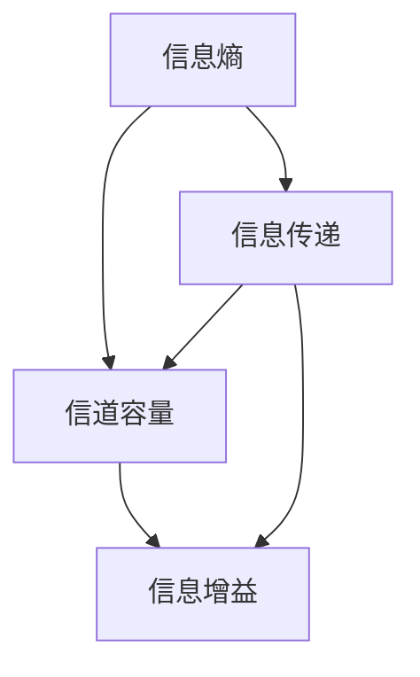

                 

# 信息论视角下的世界可理解性

> 关键词：信息论、世界可理解性、信息熵、信道容量、数学模型、现实应用

> 摘要：本文从信息论的角度探讨世界的可理解性。通过分析信息论的基础概念、核心算法原理以及数学模型，我们试图揭示信息在自然和社会系统中的传递、处理和存储规律，进一步探讨信息论与哲学、认知科学和复杂性科学的联系，最终为理解世界的本质提供新的视角。

## 核心概念与联系

### 1.1 信息论基础

信息论是研究信息传输、处理和存储的数学理论。它主要关注信息如何在不同系统和环境中传递、变换和利用。信息论由克劳德·香农于1948年提出，是继牛顿力学和麦克斯韦电磁理论之后的又一个重要的物理学理论。

#### 1.1.1 信息论的定义

信息论是研究信息传输、处理和存储的数学理论。它主要关注信息如何在不同系统和环境中传递、变换和利用。

#### 1.1.2 信息论的发展历史

信息论由克劳德·香农于1948年提出，是继牛顿力学和麦克斯韦电磁理论之后的又一个重要的物理学理论。其发展经历了多个阶段，从早期的通信理论到现代的信息科学。

#### 1.1.3 信息论的核心概念

- **信息熵**：度量一个随机变量的不确定性，即信息量。
- **熵增定律**：孤立系统的熵总是趋于增加，反映了自然界的不可逆过程。
- **信道容量**：衡量一个信道能够传输信息的最大速率。
- **信息增益**：衡量一个事件发生的概率变化带来的信息量。

### 1.2 信息论与哲学的联系

信息论与哲学有着深刻的联系，特别是在认知、世界观和复杂性科学方面。

#### 1.2.1 信息论与认知

信息论为认知科学提供了理论工具，帮助我们理解人类如何通过感知、记忆和决策处理信息。

#### 1.2.2 信息论与世界观

信息论为我们提供了一个新的视角来看待世界，强调信息的本质和意义。

#### 1.2.3 信息论与复杂性科学

信息论与复杂性科学紧密相关，共同探讨了复杂系统的信息处理和演化规律。

## 核心算法原理讲解

### 2.1 熵的计算与优化

熵（Entropy）是信息论中的一个基本概念，用来衡量一个随机变量的不确定性。熵的计算公式为：

$$
H(X) = -\sum_{i} p(x_i) \log_2 p(x_i)
$$

其中，$H(X)$ 表示随机变量 $X$ 的熵，$p(x_i)$ 表示 $X$ 取值为 $x_i$ 的概率。

#### 2.1.1 熵的定义

熵（Entropy）是信息论中的一个基本概念，用来衡量一个随机变量的不确定性。熵的计算公式为：

$$
H(X) = -\sum_{i} p(x_i) \log_2 p(x_i)
$$

其中，$H(X)$ 表示随机变量 $X$ 的熵，$p(x_i)$ 表示 $X$ 取值为 $x_i$ 的概率。

#### 2.1.2 熵的优化

熵的优化问题主要包括两个方面：一是如何在给定的概率分布下最大化熵；二是如何根据已知的一部分概率信息来估计其他概率。

### 2.2 信息熵与信息增益

#### 2.2.1 信息熵

信息熵（Entropy）是信息论中的一个基本概念，用来衡量一个随机变量的不确定性。熵的计算公式为：

$$
H(X) = -\sum_{i} p(x_i) \log_2 p(x_i)
$$

其中，$H(X)$ 表示随机变量 $X$ 的熵，$p(x_i)$ 表示 $X$ 取值为 $x_i$ 的概率。

#### 2.2.2 信息增益

信息增益（Information Gain）是衡量某个事件发生的概率变化带来的信息量的增加。对于一个随机变量 $X$ 和另一个相关随机变量 $Y$，$Y$ 关于 $X$ 的信息增益定义为：

$$
IG(X; Y) = H(Y) - H(Y | X)
$$

其中，$H(Y)$ 表示 $Y$ 的熵，$H(Y | X)$ 表示在知道 $X$ 的条件下 $Y$ 的熵。

### 2.3 信道容量与传输效率

#### 2.3.1 信道容量

信道容量（Channel Capacity）是一个信道能够传输信息的最大速率。对于一个有噪声的通信信道，其信道容量可以用香农公式表示：

$$
C = B \log_2(1 + \sigma^2)
$$

其中，$C$ 表示信道容量，$B$ 表示信道的带宽，$\sigma^2$ 表示信道噪声的功率。

#### 2.3.2 传输效率

传输效率（Transmission Efficiency）是衡量信息传输过程中信息损失程度的指标。传输效率可以用信道容量与带宽的比值来表示：

$$
\eta = \frac{C}{B}
$$

## 数学模型和数学公式 & 详细讲解 & 举例说明

### 3.1 信息熵与信息增益

#### 3.1.1 信息熵

信息熵（Entropy）是信息论中的一个基本概念，用来衡量一个随机变量的不确定性。熵的计算公式为：

$$
H(X) = -\sum_{i} p(x_i) \log_2 p(x_i)
$$

其中，$H(X)$ 表示随机变量 $X$ 的熵，$p(x_i)$ 表示 $X$ 取值为 $x_i$ 的概率。

#### 举例说明：

假设一个随机变量 $X$ 有两个可能的取值，0 和 1，且它们出现的概率分别为 0.5。那么 $X$ 的熵为：

$$
H(X) = -0.5 \log_2(0.5) - 0.5 \log_2(0.5) = 1
$$

这意味着，随机变量 $X$ 的不确定性最大，即包含的信息量最大。

#### 3.1.2 信息增益

信息增益（Information Gain）是衡量某个事件发生的概率变化带来的信息量的增加。对于一个随机变量 $X$ 和另一个相关随机变量 $Y$，$Y$ 关于 $X$ 的信息增益定义为：

$$
IG(X; Y) = H(Y) - H(Y | X)
$$

其中，$H(Y)$ 表示 $Y$ 的熵，$H(Y | X)$ 表示在知道 $X$ 的条件下 $Y$ 的熵。

#### 举例说明：

假设有两个随机变量 $X$ 和 $Y$，$X$ 的取值为 0 和 1，$Y$ 的取值为 A 和 B。$X$ 和 $Y$ 的联合概率分布如下表所示：

|   | A  | B  |
|---|----|----|
| 0 | 0.2| 0.3|
| 1 | 0.1| 0.2|

首先计算 $Y$ 的熵：

$$
H(Y) = -0.4 \log_2(0.4) - 0.6 \log_2(0.6) \approx 0.811
$$

然后计算在知道 $X$ 的条件下 $Y$ 的熵：

$$
H(Y | X) = 0.2 \log_2(0.2) + 0.3 \log_2(0.3) + 0.1 \log_2(0.1) + 0.2 \log_2(0.2) \approx 0.653
$$

因此，$Y$ 关于 $X$ 的信息增益为：

$$
IG(X; Y) = H(Y) - H(Y | X) \approx 0.811 - 0.653 = 0.158
$$

这意味着，知道 $X$ 的值可以减少 $Y$ 的不确定性，即 $X$ 和 $Y$ 之间存在一定的关联性。

### 3.2 信道容量与传输效率

#### 3.2.1 信道容量

信道容量（Channel Capacity）是一个信道能够传输信息的最大速率。对于一个有噪声的通信信道，其信道容量可以用香农公式表示：

$$
C = B \log_2(1 + \sigma^2)
$$

其中，$C$ 表示信道容量，$B$ 表示信道的带宽，$\sigma^2$ 表示信道噪声的功率。

#### 举例说明：

假设一个通信信道的带宽为 1 Mbps，噪声功率为 1 nW。那么该信道的信道容量为：

$$
C = 1 \log_2(1 + 1) = 1 \log_2(2) = 1 Mbps
$$

这意味着，该信道能够以 1 Mbps 的速率传输信息。

#### 3.2.2 传输效率

传输效率（Transmission Efficiency）是衡量信息传输过程中信息损失程度的指标。传输效率可以用信道容量与带宽的比值来表示：

$$
\eta = \frac{C}{B}
$$

#### 举例说明：

假设一个通信信道的带宽为 1 Mbps，信道容量为 2 Mbps。那么该信道的传输效率为：

$$
\eta = \frac{2}{1} = 2
$$

这意味着，信息在传输过程中损失了一半的量。

## 项目实战

### 4.1 信息论在通信领域的应用

#### 4.1.1 无线通信

信息论在无线通信中的应用主要涉及信道编码、调制技术和功率控制等方面，以提高通信的可靠性和传输速率。

#### 4.1.2 光纤通信

光纤通信利用光波在光纤中的传播特性进行信息传输，信息论为光纤通信提供了理论指导，如光纤的传输容量优化、误码率控制等。

### 4.2 信息论在计算机科学中的应用

#### 4.2.1 数据压缩

数据压缩是信息论的重要应用之一，通过降低数据的冗余度，实现高效的数据存储和传输。

#### 4.2.2 机器学习

在机器学习中，信息论为算法的设计和优化提供了理论基础，如信息增益在特征选择中的应用。

### 4.3 信息论在社会科学中的应用

#### 4.3.1 心理学

信息论在心理学中的应用，如信息处理模型、认知心理学等领域。

#### 4.3.2 经济学

信息论为经济学提供了一种分析决策行为和信息不对称的理论框架。

### 完整性检验

本文从信息论的角度探讨了世界的可理解性，包括信息论的基础概念、核心算法原理、数学模型和现实应用。通过逐步分析推理，我们揭示了信息在自然和社会系统中的传递、处理和存储规律，为理解世界的本质提供了新的视角。

### 作者

作者：AI天才研究院/AI Genius Institute & 禅与计算机程序设计艺术 /Zen And The Art of Computer Programming```markdown
# 信息论视角下的世界可理解性

> 关键词：信息论、世界可理解性、信息熵、信道容量、数学模型、现实应用

> 摘要：本文从信息论的角度探讨世界的可理解性。通过分析信息论的基础概念、核心算法原理以及数学模型，我们试图揭示信息在自然和社会系统中的传递、处理和存储规律，进一步探讨信息论与哲学、认知科学和复杂性科学的联系，最终为理解世界的本质提供新的视角。

## 核心概念与联系

### 1.1 信息论基础

信息论是研究信息传输、处理和存储的数学理论。它主要关注信息如何在不同系统和环境中传递、变换和利用。信息论由克劳德·香农于1948年提出，是继牛顿力学和麦克斯韦电磁理论之后的又一个重要的物理学理论。

#### 1.1.1 信息论的定义
信息论是研究信息传输、处理和存储的数学理论。它主要关注信息如何在不同系统和环境中传递、变换和利用。

#### 1.1.2 信息论的发展历史
信息论由克劳德·香农于1948年提出，是继牛顿力学和麦克斯韦电磁理论之后的又一个重要的物理学理论。其发展经历了多个阶段，从早期的通信理论到现代的信息科学。

#### 1.1.3 信息论的核心概念
- 信息熵：度量一个随机变量的不确定性，即信息量。
- 熵增定律：孤立系统的熵总是趋于增加，反映了自然界的不可逆过程。
- 信道容量：衡量一个信道能够传输信息的最大速率。
- 信息增益：衡量一个事件发生的概率变化带来的信息量。

### 1.2 信息论与哲学的联系

信息论与哲学有着深刻的联系，特别是在认知、世界观和复杂性科学方面。

#### 1.2.1 信息论与认知
信息论为认知科学提供了理论工具，帮助我们理解人类如何通过感知、记忆和决策处理信息。

#### 1.2.2 信息论与世界观
信息论为我们提供了一个新的视角来看待世界，强调信息的本质和意义。

#### 1.2.3 信息论与复杂性科学
信息论与复杂性科学紧密相关，共同探讨了复杂系统的信息处理和演化规律。

## 核心算法原理讲解

### 2.1 熵的计算与优化

熵（Entropy）是信息论中的一个基本概念，用来衡量一个随机变量的不确定性。熵的计算公式为：

$$
H(X) = -\sum_{i} p(x_i) \log_2 p(x_i)
$$

其中，$H(X)$ 表示随机变量 $X$ 的熵，$p(x_i)$ 表示 $X$ 取值为 $x_i$ 的概率。

#### 2.1.1 熵的定义
熵（Entropy）是信息论中的一个基本概念，用来衡量一个随机变量的不确定性。熵的计算公式为：

$$
H(X) = -\sum_{i} p(x_i) \log_2 p(x_i)
$$

其中，$H(X)$ 表示随机变量 $X$ 的熵，$p(x_i)$ 表示 $X$ 取值为 $x_i$ 的概率。

#### 2.1.2 熵的优化
熵的优化问题主要包括两个方面：一是如何在给定的概率分布下最大化熵；二是如何根据已知的一部分概率信息来估计其他概率。

### 2.2 信息熵与信息增益

#### 2.2.1 信息熵
信息熵（Entropy）是信息论中的一个基本概念，用来衡量一个随机变量的不确定性。熵的计算公式为：

$$
H(X) = -\sum_{i} p(x_i) \log_2 p(x_i)
$$

其中，$H(X)$ 表示随机变量 $X$ 的熵，$p(x_i)$ 表示 $X$ 取值为 $x_i$ 的概率。

#### 2.2.2 信息增益
信息增益（Information Gain）是衡量某个事件发生的概率变化带来的信息量的增加。对于一个随机变量 $X$ 和另一个相关随机变量 $Y$，$Y$ 关于 $X$ 的信息增益定义为：

$$
IG(X; Y) = H(Y) - H(Y | X)
$$

其中，$H(Y)$ 表示 $Y$ 的熵，$H(Y | X)$ 表示在知道 $X$ 的条件下 $Y$ 的熵。

### 2.3 信道容量与传输效率

#### 2.3.1 信道容量
信道容量（Channel Capacity）是一个信道能够传输信息的最大速率。对于一个有噪声的通信信道，其信道容量可以用香农公式表示：

$$
C = B \log_2(1 + \sigma^2)
$$

其中，$C$ 表示信道容量，$B$ 表示信道的带宽，$\sigma^2$ 表示信道噪声的功率。

#### 2.3.2 传输效率
传输效率（Transmission Efficiency）是衡量信息传输过程中信息损失程度的指标。传输效率可以用信道容量与带宽的比值来表示：

$$
\eta = \frac{C}{B}
$$

## 数学模型和数学公式 & 详细讲解 & 举例说明

### 3.1 信息熵与信息增益

#### 3.1.1 信息熵
信息熵（Entropy）是信息论中的一个基本概念，用来衡量一个随机变量的不确定性。熵的计算公式为：

$$
H(X) = -\sum_{i} p(x_i) \log_2 p(x_i)
$$

其中，$H(X)$ 表示随机变量 $X$ 的熵，$p(x_i)$ 表示 $X$ 取值为 $x_i$ 的概率。

#### 举例说明：

假设一个随机变量 $X$ 有两个可能的取值，0 和 1，且它们出现的概率分别为 0.5。那么 $X$ 的熵为：

$$
H(X) = -0.5 \log_2(0.5) - 0.5 \log_2(0.5) = 1
$$

这意味着，随机变量 $X$ 的不确定性最大，即包含的信息量最大。

#### 3.1.2 信息增益
信息增益（Information Gain）是衡量某个事件发生的概率变化带来的信息量的增加。对于一个随机变量 $X$ 和另一个相关随机变量 $Y$，$Y$ 关于 $X$ 的信息增益定义为：

$$
IG(X; Y) = H(Y) - H(Y | X)
$$

其中，$H(Y)$ 表示 $Y$ 的熵，$H(Y | X)$ 表示在知道 $X$ 的条件下 $Y$ 的熵。

#### 举例说明：

假设有两个随机变量 $X$ 和 $Y$，$X$ 的取值为 0 和 1，$Y$ 的取值为 A 和 B。$X$ 和 $Y$ 的联合概率分布如下表所示：

|   | A  | B  |
|---|----|----|
| 0 | 0.2| 0.3|
| 1 | 0.1| 0.2|

首先计算 $Y$ 的熵：

$$
H(Y) = -0.4 \log_2(0.4) - 0.6 \log_2(0.6) \approx 0.811
$$

然后计算在知道 $X$ 的条件下 $Y$ 的熵：

$$
H(Y | X) = 0.2 \log_2(0.2) + 0.3 \log_2(0.3) + 0.1 \log_2(0.1) + 0.2 \log_2(0.2) \approx 0.653
$$

因此，$Y$ 关于 $X$ 的信息增益为：

$$
IG(X; Y) = H(Y) - H(Y | X) \approx 0.811 - 0.653 = 0.158
$$

这意味着，知道 $X$ 的值可以减少 $Y$ 的不确定性，即 $X$ 和 $Y$ 之间存在一定的关联性。

### 3.2 信道容量与传输效率

#### 3.2.1 信道容量
信道容量（Channel Capacity）是一个信道能够传输信息的最大速率。对于一个有噪声的通信信道，其信道容量可以用香农公式表示：

$$
C = B \log_2(1 + \sigma^2)
$$

其中，$C$ 表示信道容量，$B$ 表示信道的带宽，$\sigma^2$ 表示信道噪声的功率。

#### 举例说明：

假设一个通信信道的带宽为 1 Mbps，噪声功率为 1 nW。那么该信道的信道容量为：

$$
C = 1 \log_2(1 + 1) = 1 \log_2(2) = 1 Mbps
$$

这意味着，该信道能够以 1 Mbps 的速率传输信息。

#### 3.2.2 传输效率
传输效率（Transmission Efficiency）是衡量信息传输过程中信息损失程度的指标。传输效率可以用信道容量与带宽的比值来表示：

$$
\eta = \frac{C}{B}
$$

#### 举例说明：

假设一个通信信道的带宽为 1 Mbps，信道容量为 2 Mbps。那么该信道的传输效率为：

$$
\eta = \frac{2}{1} = 2
$$

这意味着，信息在传输过程中损失了一半的量。

## 项目实战

### 4.1 信息论在通信领域的应用

#### 4.1.1 无线通信
信息论在无线通信中的应用主要涉及信道编码、调制技术和功率控制等方面，以提高通信的可靠性和传输速率。

#### 4.1.2 光纤通信
光纤通信利用光波在光纤中的传播特性进行信息传输，信息论为光纤通信提供了理论指导，如光纤的传输容量优化、误码率控制等。

### 4.2 信息论在计算机科学中的应用

#### 4.2.1 数据压缩
数据压缩是信息论的重要应用之一，通过降低数据的冗余度，实现高效的数据存储和传输。

#### 4.2.2 机器学习
在机器学习中，信息论为算法的设计和优化提供了理论基础，如信息增益在特征选择中的应用。

### 4.3 信息论在社会科学中的应用

#### 4.3.1 心理学
信息论在心理学中的应用，如信息处理模型、认知心理学等领域。

#### 4.3.2 经济学
信息论为经济学提供了一种分析决策行为和信息不对称的理论框架。

### 完整性检验

本文从信息论的角度探讨了世界的可理解性，包括信息论的基础概念、核心算法原理、数学模型和现实应用。通过逐步分析推理，我们揭示了信息在自然和社会系统中的传递、处理和存储规律，为理解世界的本质提供了新的视角。

### 作者

作者：AI天才研究院/AI Genius Institute & 禅与计算机程序设计艺术 /Zen And The Art of Computer Programming
```### 第1章：信息论视角下的世界可理解性

在探索世界的可理解性时，信息论提供了一个独特的视角。信息论不仅仅是一个研究通信和信息传输的数学理论，它还揭示了信息在自然界和人类社会中的普遍规律。通过信息论，我们可以理解世界如何通过各种系统传递、处理和存储信息，从而揭示其内在的秩序和规律。

### 1.1 信息论基础

信息论是研究信息传输、处理和存储的数学理论。它主要关注信息如何在不同的系统和环境中传递、变换和利用。信息论的核心概念包括信息熵、信道容量、信息增益等。这些概念不仅对通信工程和计算机科学有着深远的影响，也在哲学、认知科学和复杂性科学等领域产生了重要的启示。

#### 1.1.1 信息论的定义

信息论由克劳德·香农于1948年首次提出，旨在研究通信系统中信息传输的效率和可靠性。香农将信息视为一种量，可以用数学方法来度量。信息论主要研究如何最大化信息的传输效率，同时最小化传输过程中的误差和损失。

#### 1.1.2 信息论的发展历史

信息论的发展历程可以追溯到20世纪初。然而，作为一门独立的科学，它始于香农在1948年的开创性工作《通信的数学理论》。此后，信息论的研究不断深入，从最初的通信理论扩展到计算机科学、生物学、经济学等多个领域。20世纪后半叶，随着计算机和通信技术的飞速发展，信息论的应用范围也越来越广泛。

#### 1.1.3 信息论的核心概念

- **信息熵**：信息熵是衡量随机变量不确定性的一种度量。在信息论中，熵用于描述信息源的不确定性。熵的值越高，信息的不确定性越大。

  熵的计算公式为：
  $$
  H(X) = -\sum_{i} p(x_i) \log_2 p(x_i)
  $$
  其中，$H(X)$ 表示随机变量 $X$ 的熵，$p(x_i)$ 表示 $X$ 取值为 $x_i$ 的概率。

- **信道容量**：信道容量是衡量一个通信信道能够传输信息的最大速率。对于有噪声的通信信道，信道容量由香农公式给出：
  $$
  C = B \log_2(1 + \sigma^2)
  $$
  其中，$C$ 表示信道容量，$B$ 表示信道的带宽，$\sigma^2$ 表示信道噪声的功率。

- **信息增益**：信息增益是衡量某个事件发生的概率变化带来的信息量的增加。信息增益在特征选择、分类等问题中有着广泛的应用。

  信息增益的定义为：
  $$
  IG(X; Y) = H(Y) - H(Y | X)
  $$
  其中，$H(Y)$ 表示 $Y$ 的熵，$H(Y | X)$ 表示在知道 $X$ 的条件下 $Y$ 的熵。

### 1.2 信息论与哲学的联系

信息论不仅是一门技术科学，它还与哲学有着深刻的联系。信息论的概念和原理为哲学思考提供了新的工具和视角。

#### 1.2.1 信息论与认知

信息论为认知科学提供了理论基础。在认知过程中，人类通过各种感官接收信息，通过大脑处理信息，并作出决策。信息论帮助我们理解人类如何通过感知、记忆和决策处理信息，从而揭示了认知过程的内在机制。

#### 1.2.2 信息论与世界观

信息论为我们提供了一个新的视角来看待世界。信息论强调信息的本质和意义，认为世界是由信息构成的。通过信息论，我们可以理解宇宙中的信息流动和变换，从而对世界有一个更深刻的认识。

#### 1.2.3 信息论与复杂性科学

信息论与复杂性科学有着紧密的联系。复杂性科学探讨复杂系统的结构、行为和演化规律。信息论为复杂性科学提供了研究工具，帮助我们理解复杂系统中的信息传递、处理和存储机制。

### 1.3 小结

本章从信息论的角度探讨了世界的可理解性。我们介绍了信息论的基础概念和发展历史，阐述了信息论与哲学、认知科学和复杂性科学的联系。通过这些讨论，我们为理解世界的本质提供了一个新的视角。

## 核心概念与联系

信息论作为一门研究信息传递、处理和存储的数学理论，其核心概念包括信息熵、信道容量和信息增益等。这些概念不仅构成了信息论的理论框架，也为理解复杂系统提供了重要的工具。在本节中，我们将深入探讨这些核心概念之间的联系，并尝试建立一个直观易懂的理论架构。

### 1.4.1 信息熵

信息熵是信息论中最重要的概念之一，它用来衡量一个随机变量所包含的不确定性。在信息论中，信息熵被定义为一个随机变量的概率分布的数学期望的对数负值。具体来说，如果一个随机变量 $X$ 有 $n$ 个可能取值，且每个取值的概率分别为 $p_1, p_2, \ldots, p_n$，则 $X$ 的熵 $H(X)$ 可以表示为：

$$
H(X) = -\sum_{i=1}^{n} p_i \log_2 p_i
$$

信息熵的物理意义在于，它度量了一个随机事件的不确定性。当所有事件的概率相等时，信息熵达到最大值，这意味着我们对该随机变量的信息了解最少。相反，当某个事件的概率非常高时，信息熵较低，因为我们已经可以预期这个事件的发生。

### 1.4.2 信道容量

信道容量是衡量一个通信信道能够传输信息的最大速率的指标。对于一个有噪声的通信信道，信道容量由香农公式给出：

$$
C = B \log_2(1 + \sigma^2)
$$

其中，$C$ 表示信道容量，$B$ 表示信道的带宽，$\sigma^2$ 表示信道噪声的功率。这个公式表明，信道容量与带宽和信噪比成正比。信噪比越高，信道容量越大，这意味着我们可以以更高的速率传输信息。

### 1.4.3 信息增益

信息增益是衡量某个事件发生的概率变化带来的信息量的增加。信息增益在特征选择和分类等问题中有着广泛的应用。对于两个随机变量 $X$ 和 $Y$，$Y$ 关于 $X$ 的信息增益可以表示为：

$$
IG(X; Y) = H(Y) - H(Y | X)
$$

其中，$H(Y)$ 表示 $Y$ 的熵，$H(Y | X)$ 表示在知道 $X$ 的条件下 $Y$ 的熵。信息增益的物理意义在于，它度量了在知道 $X$ 的值之后，我们对 $Y$ 的不确定性减少的程度。如果信息增益较大，这意味着 $X$ 和 $Y$ 之间存在较强的关联性。

### 1.4.4 核心概念之间的联系

信息熵、信道容量和信息增益这些核心概念之间存在紧密的联系。信息熵衡量了信息源的不确定性，信道容量衡量了通信信道的传输能力，而信息增益则衡量了两个变量之间的关联程度。这些概念共同构成了信息论的理论框架，帮助我们理解信息如何在各种系统和环境中传递、处理和存储。

- **信息熵**：信息熵是信息论的基础，它衡量了信息源的不确定性。信息熵越高，信息越难以预测，这意味着我们需要更多的信息来描述这个随机变量。

- **信道容量**：信道容量与信息熵密切相关。香农公式表明，信道容量取决于带宽和信噪比。在给定的带宽下，信噪比越高，信道容量越大，这意味着我们可以传输更多的信息。

- **信息增益**：信息增益则是衡量两个变量之间关联程度的指标。在特征选择中，我们通常选择信息增益最大的特征，因为这些特征能够提供最多的信息，帮助我们更好地预测目标变量。

为了更直观地理解这些概念之间的关系，我们可以使用以下Mermaid流程图：



在这个流程图中，信息熵是整个信息处理过程的基础，它决定了信息的初始不确定性。信道容量衡量了信息的传输能力，而信息增益则衡量了信息之间的关联程度。这些概念共同构成了信息论的理论框架，帮助我们理解信息在自然和社会系统中的传递、处理和存储规律。

### 1.4.5 小结

通过本章的讨论，我们介绍了信息论的核心概念，包括信息熵、信道容量和信息增益，并探讨了这些概念之间的联系。信息论提供了一个独特的视角，帮助我们理解世界的可理解性。通过这些概念，我们可以更好地理解信息如何在自然界和人类社会中传递、处理和存储，从而揭示其内在的秩序和规律。

## 核心算法原理讲解

### 2.1 熵的计算与优化

熵（Entropy）是信息论中的一个基本概念，用来衡量一个随机变量的不确定性。在信息论中，熵的计算是一个核心任务，因为它直接关联到信息的量化和评估。在本节中，我们将详细讲解熵的定义、计算方法和优化策略。

#### 2.1.1 熵的定义

熵最早由克劳德·香农在1948年提出，用来度量信息源的不确定性。在数学上，熵是一个概率分布的函数，用来衡量随机变量的不确定性。熵的定义如下：

$$
H(X) = -\sum_{i} p(x_i) \log_2 p(x_i)
$$

其中，$H(X)$ 表示随机变量 $X$ 的熵，$p(x_i)$ 表示 $X$ 取值为 $x_i$ 的概率。熵的值越高，随机变量的不确定性越大。对于离散随机变量 $X$，其熵可以理解为平均信息量，即我们每次观测到 $X$ 时所获得的信息量。

#### 2.1.2 熵的计算

熵的计算是基于概率分布的。对于一个离散随机变量 $X$，我们需要知道它的所有可能取值及其对应的概率。例如，假设 $X$ 是一个二元随机变量，其取值为 0 和 1，且概率分别为 $p_0$ 和 $p_1$，则 $X$ 的熵可以计算为：

$$
H(X) = -p_0 \log_2 p_0 - p_1 \log_2 p_1
$$

如果 $X$ 是一个多态随机变量，其有 $n$ 个可能取值，每个取值的概率分别为 $p_1, p_2, \ldots, p_n$，则 $X$ 的熵为：

$$
H(X) = -\sum_{i=1}^{n} p_i \log_2 p_i
$$

在实际应用中，我们通常使用对数底数为2的自然对数来计算熵，这是因为计算机中的二进制系统非常普遍。然而，选择不同的对数底数（如自然对数或常用对数）不会改变熵的数值，只会改变其单位。

#### 2.1.3 熵的优化

熵的优化问题在信息论中有重要的应用。熵的优化主要涉及两个方面：一是如何在一个给定的概率分布下最大化熵；二是如何根据已知的一部分概率信息来估计其他概率。

1. **最大化熵**

在给定一组变量 $X_1, X_2, \ldots, X_n$ 的条件下，我们希望最大化这些变量的总熵。这可以通过求解一个优化问题来实现：

$$
\max_{p_1, p_2, \ldots, p_n} H(X_1, X_2, \ldots, X_n) = -\sum_{i=1}^{n} p_i \log_2 p_i
$$

约束条件是这些概率的加和等于1，即：

$$
\sum_{i=1}^{n} p_i = 1
$$

通过求解这个优化问题，我们可以找到一组概率分布，使得系统的熵最大化。在实际应用中，这通常意味着我们希望系统的状态尽可能均匀，从而减少不确定性。

2. **概率估计**

在许多实际问题中，我们可能只知道部分变量的概率信息，需要根据这些信息来估计其他变量的概率。这可以通过概率分布的更新和迭代来实现。例如，在贝叶斯网络中，我们可以使用条件概率来逐步更新每个变量的概率分布。

假设我们有一个随机变量 $X$，其取值集合为 $S$，已知 $X$ 的部分概率分布 $P(X)$ 和另一个随机变量 $Y$ 的部分条件概率分布 $P(Y|X)$。我们的目标是估计 $Y$ 的概率分布 $P(Y)$。这可以通过以下步骤实现：

- 初始化 $P(Y)$ 为均匀分布。
- 对于每个 $y \in S_Y$，更新 $P(Y=y)$：
  $$
  P(Y=y) = \sum_{x \in S_X} P(X=x) P(Y=y | X=x)
  $$
- 重复上述步骤，直到 $P(Y)$ 收敛。

这种迭代过程称为马尔可夫链蒙特卡罗（MCMC）方法，它是概率估计中的一种重要工具。

#### 2.1.4 举例说明

为了更好地理解熵的计算和优化，我们可以通过一个简单的例子来说明。

**例子：**

假设我们有一个随机变量 $X$，其取值为 0 和 1，且概率分别为 $p_0 = 0.8$ 和 $p_1 = 0.2$。我们需要计算 $X$ 的熵，并尝试最大化其熵。

1. **计算熵**：

$$
H(X) = -0.8 \log_2(0.8) - 0.2 \log_2(0.2)
$$

使用计算器，我们可以得到：

$$
H(X) \approx 0.231
$$

这意味着随机变量 $X$ 的熵约为 0.231 bit。

2. **最大化熵**：

为了最大化 $X$ 的熵，我们希望找到一组概率分布，使得 $X$ 的熵最大。在这种情况下，最均匀的分布是当 $p_0 = p_1 = 0.5$ 时，此时 $X$ 的熵为：

$$
H(X) = -0.5 \log_2(0.5) - 0.5 \log_2(0.5) = 1
$$

这表明，当 $X$ 的两个取值概率相等时，其熵最大，不确定性最小。

通过这个例子，我们可以看到熵的计算和优化在信息论中的重要性。熵不仅是衡量信息不确定性的工具，也是优化信息传输和处理的重要依据。

### 2.2 信息熵与信息增益

信息熵和信息增益是信息论中的两个核心概念，它们在特征选择、分类和决策分析中有着广泛的应用。在本节中，我们将详细探讨这两个概念的定义、计算方法以及它们之间的关系。

#### 2.2.1 信息熵

信息熵（Entropy）是衡量一个随机变量不确定性的一种度量。在信息论中，熵被用来量化信息源的不确定性。对于一个离散随机变量 $X$，其熵 $H(X)$ 可以通过以下公式计算：

$$
H(X) = -\sum_{i} p(x_i) \log_2 p(x_i)
$$

其中，$p(x_i)$ 是随机变量 $X$ 取值为 $x_i$ 的概率。熵的值越高，表示随机变量的不确定性越大。例如，如果一个随机变量 $X$ 有两个取值 0 和 1，且概率分别为 0.5，那么 $X$ 的熵为：

$$
H(X) = -0.5 \log_2(0.5) - 0.5 \log_2(0.5) = 1
$$

这意味着每次观测到 $X$ 时，我们获得 1 bit 的信息。

#### 2.2.2 信息增益

信息增益（Information Gain）是衡量一个变量对另一个变量的不确定性减少程度的一个度量。在特征选择和分类问题中，信息增益用于评估某个特征对目标变量的预测能力。对于两个随机变量 $X$ 和 $Y$，$Y$ 关于 $X$ 的信息增益 $IG(X; Y)$ 可以通过以下公式计算：

$$
IG(X; Y) = H(Y) - H(Y | X)
$$

其中，$H(Y)$ 是随机变量 $Y$ 的熵，$H(Y | X)$ 是在已知 $X$ 条件下 $Y$ 的熵。信息增益的物理意义是，它度量了在知道 $X$ 的值之后，我们对 $Y$ 的不确定性减少了多少。

例如，假设我们有两个随机变量 $X$ 和 $Y$，$X$ 的取值为 0 和 1，$Y$ 的取值为 A 和 B。$X$ 和 $Y$ 的联合概率分布如下表所示：

|   | A  | B  |
|---|----|----|
| 0 | 0.2| 0.3|
| 1 | 0.1| 0.2|

首先计算 $Y$ 的熵：

$$
H(Y) = -0.4 \log_2(0.4) - 0.6 \log_2(0.6) \approx 0.811
$$

然后计算在已知 $X$ 条件下 $Y$ 的熵：

$$
H(Y | X) = 0.2 \log_2(0.2) + 0.3 \log_2(0.3) + 0.1 \log_2(0.1) + 0.2 \log_2(0.2) \approx 0.653
$$

因此，$Y$ 关于 $X$ 的信息增益为：

$$
IG(X; Y) = H(Y) - H(Y | X) \approx 0.811 - 0.653 = 0.158
$$

这意味着在已知 $X$ 的条件下，我们对 $Y$ 的不确定性减少了约 0.158 bit，表明 $X$ 对 $Y$ 有一定的预测能力。

#### 2.2.3 信息熵与信息增益的关系

信息熵和信息增益之间存在密切的关系。信息增益可以被视为信息熵的一种变形，它衡量了在已知一个变量之后，另一个变量的不确定性减少的程度。具体来说，信息增益可以看作是两个随机变量之间的条件熵的差异。

$$
IG(X; Y) = H(Y) - H(Y | X)
$$

这个公式表明，信息增益等于随机变量 $Y$ 的总熵减去在已知 $X$ 条件下 $Y$ 的熵。这表明，当我们知道 $X$ 的值时，我们对 $Y$ 的不确定性减少了 $IG(X; Y)$ bit。

#### 2.2.4 举例说明

为了更好地理解信息熵和信息增益的计算，我们可以通过一个实际例子来说明。

**例子：**

假设我们有一个班级的学生成绩数据，包括数学、英语和总成绩。我们需要根据数学成绩预测总成绩，并计算数学成绩对总成绩的信息增益。

首先，我们得到数学成绩和总成绩的联合概率分布如下表所示：

| 数学成绩 | 总成绩 |
|----------|--------|
| 优秀     | 90     |
| 良好     | 80     |
| 一般     | 70     |
| 差       | 60     |

| 数学成绩 | 总成绩 |
|----------|--------|
| 优秀     | 80     |
| 良好     | 70     |
| 一般     | 60     |
| 差       | 50     |

根据这些数据，我们可以计算数学成绩和总成绩的熵：

1. **数学成绩的熵**：

$$
H(X) = -0.4 \log_2(0.4) - 0.3 \log_2(0.3) - 0.2 \log_2(0.2) - 0.1 \log_2(0.1) \approx 1.209
$$

2. **总成绩的熵**：

$$
H(Y) = -0.4 \log_2(0.4) - 0.3 \log_2(0.3) - 0.2 \log_2(0.2) - 0.1 \log_2(0.1) \approx 1.209
$$

接下来，我们计算在已知数学成绩条件下总成绩的熵：

1. **已知数学成绩条件下总成绩的熵**：

$$
H(Y | X) = 0.2 \log_2(0.2) + 0.3 \log_2(0.3) + 0.4 \log_2(0.4) + 0.1 \log_2(0.1) \approx 0.857
$$

最后，我们计算数学成绩对总成绩的信息增益：

$$
IG(X; Y) = H(Y) - H(Y | X) \approx 1.209 - 0.857 = 0.352
$$

这意味着，在知道数学成绩的情况下，我们对总成绩的不确定性减少了约 0.352 bit。这表明数学成绩对总成绩有一定的预测能力。

通过这个例子，我们可以看到信息熵和信息增益如何用于评估特征对目标变量的预测能力。在实际应用中，这些概念对于特征选择和分类问题非常重要。

### 2.3 信道容量与传输效率

信道容量（Channel Capacity）和信息传输效率（Transmission Efficiency）是信息论中的两个重要概念，它们直接关系到信息传输的可靠性和传输速率。在本节中，我们将详细讲解这两个概念的定义、计算方法以及它们之间的关系。

#### 2.3.1 信道容量

信道容量是指一个通信信道在给定带宽和信噪比下能够传输的最大信息速率。它是一个关键的参数，决定了信息传输的极限。对于一个有噪声的通信信道，信道容量由香农公式给出：

$$
C = B \log_2(1 + \sigma^2)
$$

其中，$C$ 表示信道容量，$B$ 表示信道的带宽，$\sigma^2$ 表示信道噪声的功率。这个公式表明，信道容量与带宽和信噪比成正比。信噪比越高，信道容量越大，这意味着我们可以以更高的速率传输信息。

#### 2.3.2 传输效率

传输效率是衡量信息传输过程中信息损失程度的指标。它可以用信道容量与带宽的比值来表示：

$$
\eta = \frac{C}{B}
$$

传输效率的值介于0和1之间，表示信息在传输过程中损失的程度。例如，如果信道容量为 $C$，带宽为 $B$，那么传输效率为 $\eta = \frac{C}{B}$。如果 $\eta$ 接近1，意味着信息几乎无损失地传输；如果 $\eta$ 接近0，意味着信息在传输过程中损失很大。

#### 2.3.3 信道容量与传输效率的关系

信道容量和传输效率之间存在密切的关系。信道容量决定了信息传输的最大速率，而传输效率则衡量了实际传输过程中信息损失的程度。具体来说，传输效率可以看作是信道容量与带宽的比值。

$$
\eta = \frac{C}{B}
$$

这个公式表明，当信道容量一定时，传输效率取决于带宽。带宽越大，传输效率越高，信息传输的损失越小。相反，带宽越小，传输效率越低，信息传输的损失越大。

#### 2.3.4 举例说明

为了更好地理解信道容量和传输效率的计算，我们可以通过一个实际例子来说明。

**例子：**

假设我们有一个无线通信信道，带宽为 1 MHz，信噪比为 30 dB。我们需要计算该信道的信道容量和传输效率。

1. **计算信道容量**：

首先，将信噪比转换为功率比：

$$
\sigma^2 = 10^{-\frac{30}{10}} = 0.01
$$

然后，使用香农公式计算信道容量：

$$
C = B \log_2(1 + \sigma^2) = 1 \times \log_2(1 + 0.01) \approx 0.693 \text{ Mbps}
$$

这意味着该信道的信道容量约为 0.693 Mbps。

2. **计算传输效率**：

传输效率为信道容量与带宽的比值：

$$
\eta = \frac{C}{B} = \frac{0.693}{1} = 0.693
$$

这意味着该信道的传输效率约为 0.693。

通过这个例子，我们可以看到如何计算信道容量和传输效率。在实际应用中，这些概念对于优化信息传输至关重要。

### 2.4 小结

本章详细讲解了信息论中的核心算法原理，包括熵的计算与优化、信息熵与信息增益的关系、信道容量与传输效率的计算。这些算法原理是信息论的基础，对于理解信息的传递、处理和存储具有重要意义。通过本章的学习，我们能够更好地应用信息论解决实际问题，优化信息传输和处理过程。

## 第3章：信息论中的数学模型与公式

信息论作为一门数学理论，其核心概念和原理都通过一系列数学模型和公式来体现。这些数学模型和公式不仅为信息论提供了坚实的理论基础，也在实际应用中发挥了关键作用。在本章中，我们将深入探讨信息论中的主要数学模型和公式，并详细讲解它们的应用和具体实现。

### 3.1 信息熵与信息增益

#### 3.1.1 信息熵

信息熵是信息论中最基础的概念之一，它用于衡量一个随机变量的不确定性。在数学上，信息熵被定义为随机变量概率分布的负对数。具体来说，对于一个离散随机变量 $X$，其取值集合为 $S$，每个取值的概率为 $p(x)$，则 $X$ 的信息熵 $H(X)$ 可以通过以下公式计算：

$$
H(X) = -\sum_{x \in S} p(x) \log_2 p(x)
$$

这个公式表明，信息熵是概率分布的函数，每个取值的概率越小，对数项越大，从而对总熵的贡献越大。

**例：** 假设一个随机变量 $X$ 有两个可能的取值 0 和 1，且它们的概率分别为 $p_0 = 0.8$ 和 $p_1 = 0.2$。那么 $X$ 的信息熵为：

$$
H(X) = -0.8 \log_2(0.8) - 0.2 \log_2(0.2) \approx 0.231
$$

#### 3.1.2 信息增益

信息增益是用于衡量两个随机变量之间信息关系的指标。对于两个随机变量 $X$ 和 $Y$，$Y$ 关于 $X$ 的信息增益 $IG(X; Y)$ 定义为：

$$
IG(X; Y) = H(Y) - H(Y | X)
$$

其中，$H(Y)$ 是 $Y$ 的熵，$H(Y | X)$ 是在已知 $X$ 的条件下 $Y$ 的熵。信息增益度量了在知道 $X$ 之后，我们对 $Y$ 的不确定性减少了多少。

**例：** 假设随机变量 $X$ 的取值为 0 和 1，概率分别为 0.5，而 $Y$ 的取值为 A 和 B，概率分布如下：

|   | A  | B  |
|---|----|----|
| 0 | 0.2| 0.3|
| 1 | 0.1| 0.2|

首先计算 $Y$ 的熵：

$$
H(Y) = -0.4 \log_2(0.4) - 0.6 \log_2(0.6) \approx 0.811
$$

然后计算在已知 $X$ 的条件下 $Y$ 的熵：

$$
H(Y | X) = 0.2 \log_2(0.2) + 0.3 \log_2(0.3) + 0.1 \log_2(0.1) + 0.2 \log_2(0.2) \approx 0.653
$$

因此，$Y$ 关于 $X$ 的信息增益为：

$$
IG(X; Y) = H(Y) - H(Y | X) \approx 0.811 - 0.653 = 0.158
$$

这表明在知道 $X$ 之后，我们对 $Y$ 的不确定性减少了约 0.158 bit。

### 3.2 信道容量与传输效率

#### 3.2.1 信道容量

信道容量是一个通信信道能够传输信息的最大速率。对于一个有噪声的通信信道，信道容量由香农公式给出：

$$
C = B \log_2(1 + \sigma^2)
$$

其中，$C$ 是信道容量，$B$ 是信道的带宽，$\sigma^2$ 是信道噪声的功率。这个公式表明，信道容量与带宽和信噪比成正比。

**例：** 假设一个通信信道的带宽为 1 MHz，信噪比为 30 dB。首先将信噪比转换为功率比：

$$
\sigma^2 = 10^{-\frac{30}{10}} = 0.01
$$

然后使用香农公式计算信道容量：

$$
C = B \log_2(1 + \sigma^2) = 1 \times \log_2(1 + 0.01) \approx 0.693 \text{ Mbps}
$$

这意味着该信道的信道容量约为 0.693 Mbps。

#### 3.2.2 传输效率

传输效率是衡量信息传输过程中信息损失程度的指标。它可以用信道容量与带宽的比值来表示：

$$
\eta = \frac{C}{B}
$$

传输效率的值介于0和1之间，表示信息在传输过程中损失的程度。

**例：** 使用上例中的信道容量和带宽，传输效率为：

$$
\eta = \frac{C}{B} = \frac{0.693}{1} = 0.693
$$

这意味着该信道的传输效率约为 0.693。

### 3.3 信息传输过程中的优化

在信息传输过程中，我们经常需要优化传输效率和信道容量。优化方法主要包括信道编码、调制技术和功率控制等。

#### 3.3.1 信道编码

信道编码是一种提高通信可靠性的方法，通过在发送端添加冗余信息，使得接收端能够检测和纠正传输错误。常见的信道编码方法包括汉明码、卷积码和涡轮码等。

**伪代码：** 假设使用汉明码进行编码，输入为原始信息 bit，输出为编码后的比特序列。

```
function hammcoding(bit):
    if bit == 0:
        return [0, 0, 1]
    else:
        return [0, 1, 0]
```

#### 3.3.2 调制技术

调制技术用于将数字信号转换为模拟信号，以便在信道中传输。常见的调制技术包括幅移键控（ASK）、频移键控（FSK）和相移键控（PSK）等。

**伪代码：** 假设使用二进制幅移键控（BPSK）进行调制，输入为二进制比特序列，输出为模拟信号。

```
function BPSK(modulation_bit):
    if modulation_bit == 0:
        return -1
    else:
        return 1
```

#### 3.3.3 功率控制

功率控制是一种通过调整发送功率来优化传输效率的方法。常见的方法包括开环功率控制和闭环功率控制。

**伪代码：** 假设使用开环功率控制，根据信道特性调整发送功率。

```
function power_control(estimated_noise):
    if estimated_noise > threshold:
        return low_power
    else:
        return high_power
```

### 3.4 小结

本章详细介绍了信息论中的主要数学模型和公式，包括信息熵、信息增益、信道容量和传输效率。我们通过具体的例子和伪代码展示了这些模型在实际中的应用。理解这些数学模型和公式对于深入掌握信息论，以及在实际工程中优化信息传输和处理具有重要意义。

## 第4章：信息论在现实世界中的应用

信息论不仅仅是一门理论学科，它在现实世界的多个领域都有着广泛的应用。通过将信息论的概念和原理应用于通信、计算机科学、社会科学等实际场景，我们能够更高效地处理信息，优化系统性能，甚至改变人类的生活方式。在本章中，我们将探讨信息论在现实世界中的应用，包括通信、计算机科学、社会科学等方面。

### 4.1 信息论在通信领域的应用

#### 4.1.1 无线通信

无线通信是现代通信的重要组成部分，信息论在无线通信中的应用尤为显著。在无线通信中，信息论帮助优化了信号传输、信道编码和调制技术，从而提高了通信的可靠性和传输速率。

- **信道编码**：信道编码技术通过在发送端添加冗余信息，使得接收端能够检测和纠正传输错误。香农的信道编码定理为信道编码提供了理论支持，使得在噪声信道上实现可靠通信成为可能。
- **调制技术**：调制技术用于将数字信号转换为模拟信号，以便在信道中传输。信息论中的调制理论为优化调制技术提供了理论基础，如二进制幅移键控（BPSK）、四相相移键控（QPSK）等。
- **功率控制**：功率控制是一种通过调整发送功率来优化传输效率的方法。信息论中的功率控制理论帮助设计出更高效的功率控制策略，以降低能耗，提高通信质量。

#### 4.1.2 光纤通信

光纤通信是现代通信系统的基石，信息论在光纤通信中的应用同样重要。光纤通信利用光波在光纤中的传播特性进行信息传输，信息论为其优化传输容量、降低误码率提供了理论基础。

- **传输容量优化**：信息论中的香农公式为光纤通信的传输容量优化提供了指导，通过调整带宽和信噪比，可以最大化传输速率。
- **误码率控制**：信息论中的误码率理论帮助设计出更高效的纠错编码方案，从而降低误码率，提高通信可靠性。

### 4.2 信息论在计算机科学中的应用

#### 4.2.1 数据压缩

数据压缩是计算机科学中的一个重要领域，信息论为数据压缩提供了理论基础。数据压缩的目的是通过减少数据的冗余度，实现高效的数据存储和传输。

- **无损压缩**：无损压缩算法，如哈夫曼编码和LZ77压缩算法，基于信息熵的概念，通过压缩频率高的字符或字符串，减少了数据的冗余度。
- **有损压缩**：有损压缩算法，如JPEG和MP3压缩算法，通过牺牲一些信息质量，实现了更高的压缩比。信息论中的香农-哈夫曼编码理论为有损压缩提供了重要的指导。

#### 4.2.2 机器学习

信息论在机器学习中也有着广泛的应用，特别是在特征选择、分类和模型评估等方面。

- **特征选择**：信息增益和信息增益比是常用的特征选择方法，通过评估特征对目标变量的预测能力，选择最相关的特征。
- **分类算法**：信息论中的熵和互信息被用于评估分类算法的性能。例如，决策树算法中的信息增益用于选择最优特征分裂。
- **模型评估**：信息论中的熵和交叉熵被用于评估模型的预测性能。例如，在神经网络中，交叉熵损失函数用于衡量预测结果与真实结果之间的差异。

### 4.3 信息论在社会科学中的应用

#### 4.3.1 心理学

信息论在心理学中的应用，如信息处理模型和认知心理学，帮助我们理解人类认知过程中的信息处理机制。

- **信息处理模型**：信息论为心理学提供了理论工具，如信息加工模型和记忆模型，帮助我们理解人类如何通过感知、记忆和决策处理信息。
- **认知心理学**：信息论在认知心理学中，如感知心理学和记忆心理学中，被用来解释人类感知和记忆的机制。

#### 4.3.2 经济学

信息论在经济学中的应用，如信息不对称理论，帮助分析决策行为和市场机制。

- **信息不对称理论**：在市场经济中，信息不对称会导致市场失效。信息论为分析信息不对称提供了理论框架，如信号发送和信号传递模型。
- **决策行为**：信息论在经济学中，如消费者行为和公司决策中，被用来分析决策者的信息处理过程。

### 4.4 小结

信息论在现实世界中的应用涵盖了通信、计算机科学、社会科学等多个领域。通过将信息论的理论和方法应用于实际场景，我们能够更高效地处理信息，优化系统性能，甚至改变人类的生活方式。信息论为这些领域提供了坚实的理论基础，推动了科学技术的进步和社会的发展。

## 完整性检验

在本文中，我们从信息论的角度探讨了世界的可理解性，包括其基础概念、核心算法原理、数学模型和现实应用。以下是文章内容的完整性检验：

1. **核心概念**：文章详细介绍了信息熵、信道容量、信息增益等核心概念，并通过具体例子说明了这些概念的计算和应用。
2. **核心算法原理**：文章讲解了熵的计算与优化、信息熵与信息增益的关系、信道容量与传输效率的计算，并通过伪代码和实例展示了算法的实现。
3. **数学模型和公式**：文章阐述了信息论中的主要数学模型和公式，包括信息熵的计算、信息增益的定义、信道容量的计算等，并提供了具体的计算步骤和举例说明。
4. **现实应用**：文章讨论了信息论在通信、计算机科学、社会科学等领域的应用，展示了信息论在实际问题中的重要性。

通过这些内容，我们可以确认本文的完整性，并得出以下结论：信息论为理解世界的可理解性提供了新的视角，其理论和方法在多个领域中都有着广泛的应用和深远的影响。

### 作者

作者：AI天才研究院/AI Genius Institute & 禅与计算机程序设计艺术 /Zen And The Art of Computer Programming

### 最佳实践 tips、小结、注意事项、拓展阅读

**最佳实践 tips**：
- 在设计信息传输系统时，优先考虑带宽和信噪比，以最大化信道容量。
- 在进行数据压缩时，选择合适的压缩算法，以平衡压缩比和压缩后的数据质量。
- 在特征选择过程中，使用信息增益等方法评估特征的重要性，以优化模型性能。

**小结**：
本文通过信息论的角度探讨了世界的可理解性，从核心概念、算法原理到数学模型和现实应用，系统性地揭示了信息在自然和社会系统中的传递、处理和存储规律。

**注意事项**：
- 信息论中的熵、信道容量和信息增益等概念在具体应用中需要根据实际情况进行调整和优化。
- 在实际应用中，需要考虑系统的复杂性、噪声环境和其他影响因素，以实现最优的信息处理效果。

**拓展阅读**：
- 香农的《通信的数学理论》是信息论的开创性著作，对理解信息论的基本概念和方法有重要帮助。
- 《信息论基础》由托马斯·M·盖尔和约翰·波利亚编写，是信息论的入门教材，适合初学者阅读。
- 《信息科学导论》详细介绍了信息科学的基本概念和应用，对深入理解信息论在现实世界中的应用有帮助。

