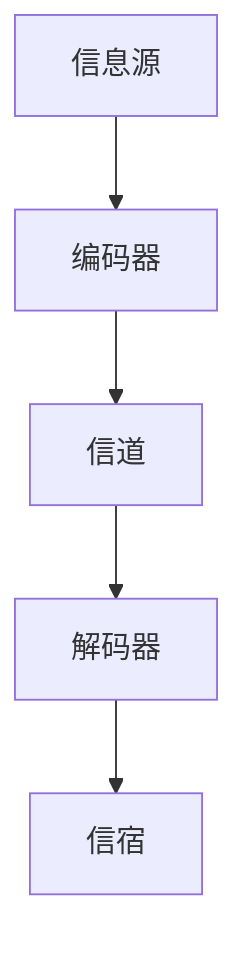
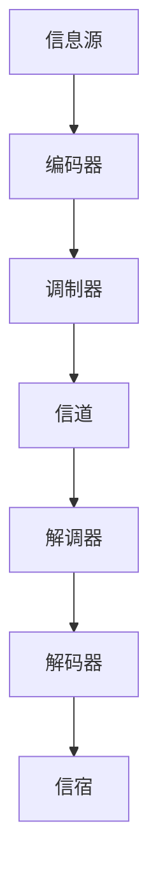

                 


## 文章标题

### 信息论：自然界的数据传输规律

## 文章关键词

- 信息论
- 数据传输
- 信息熵
- 信道编码
- 通信系统
- 计算机科学

## 文章摘要

信息论是研究信息传输和处理规律的学科，它在通信、计算机科学、生物学等多个领域有着广泛的应用。本文将从信息论的基本概念、信息熵的原理、信道编码技术、信息论在通信系统中的应用等方面进行详细探讨，旨在帮助读者理解信息论在自然界中的数据传输规律，以及它在实际应用中的重要作用。

## 第1章 引言与历史背景

### 1.1 信息论的产生背景

信息论的产生可以追溯到20世纪中叶，当时通信技术的发展使得人们对信息传输的效率和质量提出了更高的要求。香农（Claude Shannon）在1948年发表了著名的论文《通信的数学理论》（A Mathematical Theory of Communication），标志着信息论的诞生。香农通过数学模型和概率论的方法，将信息传输的过程量化，提出了信息熵的概念，为信息论奠定了理论基础。

### 1.2 信息论的主要贡献者

信息论的创立和发展离不开几位关键人物。除了香农，维纳（Norbert Wiener）提出了控制论，为信息论在自动化领域的应用提供了理论支持。此外，还有科利尔（Richard W. Cole）和海森伯（Werner Heisenberg）等科学家，他们的研究为信息论的发展做出了重要贡献。

### 1.3 信息论的发展历程

自香农提出信息论以来，信息论的理论体系不断完善，应用领域也在不断扩展。20世纪60年代，信息论在通信系统中的应用取得了显著成果，如香农-哈特利定理（Shannon-Hartley theorem）和香农信道容量公式（Shannon capacity formula）。进入21世纪，随着互联网和大数据技术的发展，信息论在计算机科学、生物学、物理学等领域得到了广泛应用。

### 1.4 信息论的重要性

信息论的研究不仅对通信技术和计算机科学的发展具有重要意义，还对生物学和物理学等领域提供了新的研究视角。例如，信息论在生物学中的应用可以帮助我们理解生物信息传递的机制；在物理学中，信息论可以解释黑洞的信息丢失问题。总之，信息论作为一门交叉学科，其研究成果和应用前景十分广阔。

## 第2章 信息论的基本概念

### 2.1 信息与信号

在信息论中，信息被定义为“消除不确定性的东西”。信号是信息的载体，它可以通过各种方式传播，如电信号、光信号、声信号等。信息与信号的关系可以用一个简单的例子来说明：当我们听到一个声音时，这个声音是一个信号，而我们通过这个声音理解到的信息是“有人在说话”。

### 2.2 信息源与消息

信息源是产生信息的实体，如人、机器、自然界等。消息是信息源发出的信号所承载的具体内容。例如，当我们使用手机发送一条短信时，手机就是信息源，短信内容就是消息。

### 2.3 信息传输与接收

信息传输是指将信息从一个地方传递到另一个地方的过程。信息传输可以通过有线或无线的方式进行。接收是指接收者接收到消息并理解其内容的过程。在信息传输过程中，可能会受到各种噪声的干扰，这会影响信息传输的可靠性。

### 2.4 信道与噪声

信道是信息传输的通道，可以是物理通道，如光纤、无线电波等，也可以是抽象通道，如网络连接。噪声是干扰信息传输的因素，它可以来自外部环境，也可以来自传输系统本身。噪声的存在会导致信息传输的错误，降低信息传输的可靠性。

## 第3章 信息熵与信息量

### 3.1 信息熵的定义与性质

信息熵（Entropy）是信息论中一个核心的概念，它用来衡量信息的不确定性。一个随机事件的不确定性越大，其信息熵也越大。信息熵的定义公式为：$H(X) = -\sum_{i=1}^{n} p(x_i) \log_2 p(x_i)$，其中$p(x_i)$表示第$i$个事件发生的概率。

### 3.2 熵的公式与应用

熵的公式可以通过不同的方法进行推导和应用。例如，在二进制信息传输中，如果每个位发生错误的概率为$p$，那么传输前的信息熵为$H(X) = p \log_2 p + (1-p) \log_2 (1-p)$。这个公式可以帮助我们计算在错误概率已知的情况下，传输前的信息熵。

### 3.3 信息量的计算与优化

信息量是指传输一定量的信息所需的比特数。计算信息量的公式为：$I = H(X) - H(X|Y)$，其中$H(X|Y)$表示在已知传输过程中发生的噪声$Y$的情况下，信息的不确定性。优化信息量的目标是尽可能减少传输过程中的错误率。

### 3.4 熵变与信息熵的极值问题

在信息传输过程中，熵会发生变化。例如，当信息通过一个有噪声的信道传输时，传输后的信息熵通常会大于传输前的信息熵。信息熵的极值问题是指在一定条件下，信息熵的最大值和最小值。解决极值问题可以帮助我们优化信息传输的效率。

## 第4章 信息传输与信道编码

### 4.1 信道传输模型

信道传输模型是描述信息在信道中传输的数学模型。它包括发送端、信道和接收端。发送端产生信号，信道传输信号，接收端接收信号并解调。信道模型通常包括噪声模型，用于描述信道中的噪声特性。

### 4.2 信道编码的基本原理

信道编码是为了提高信息传输的可靠性而引入的技术。信道编码的基本原理是在发送端对原始信息进行编码，生成带有冗余信息的码字，然后在接收端通过解码恢复原始信息。常见的信道编码技术包括汉明码、卷积码和Turbo码等。

### 4.3 信道编码的算法与应用

信道编码的算法包括编码算法和解码算法。编码算法用于将原始信息转换为码字，解码算法用于从码字中恢复原始信息。在实际应用中，信道编码技术广泛应用于无线通信、光纤通信和网络通信等领域。

### 4.4 信道编码的效率与容量

信道编码的效率是指码字长度与原始信息长度的比值。信道编码的容量是指在一定条件下，信道能传输的最大信息量。提高信道编码的效率与容量是信道编码技术研究的关键问题。通过优化编码算法和信道模型，可以提高信道编码的效率与容量。

## 第5章 信息论与通信系统

### 5.1 通信系统的基本结构

通信系统包括发送端、信道和接收端。发送端产生信号，信道传输信号，接收端接收信号并解调。通信系统的基本结构可以简化为三个部分：信号源、信道和接收器。

### 5.2 信息论在通信系统中的应用

信息论在通信系统中的应用主要体现在两个方面：信息传输效率和可靠性。信息论通过研究信息熵、信道编码技术和信道容量，为通信系统设计提供了理论指导。例如，香农-哈特利定理（Shannon-Hartley theorem）提供了信道容量与带宽和信噪比之间的关系，这对于通信系统的设计具有重要意义。

### 5.3 信息论在通信系统优化中的作用

信息论在通信系统优化中的作用体现在多个方面。首先，通过优化信道编码技术，可以提高信息传输的可靠性。其次，通过优化信息传输策略，可以最大化信道容量，提高信息传输效率。例如，在无线通信中，通过频谱分配和功率控制等技术，可以实现信息传输的优化。

## 第6章 信息论在计算机科学中的应用

### 6.1 信息论在数据压缩中的应用

信息论在数据压缩中的应用主要体现在信息熵的计算和熵编码技术。信息熵的计算可以帮助我们了解数据的冗余度，从而确定最佳的压缩算法。常见的熵编码技术包括霍夫曼编码和算术编码。这些编码技术可以将冗余的数据压缩为更短的形式，提高数据存储和传输的效率。

### 6.2 信息论在网络编码中的应用

信息论在网络编码中的应用主要体现在网络信息传输的优化和可靠性保障。网络编码技术通过在网络的各个节点进行编码操作，可以提高信息传输的效率和可靠性。例如，在无线网络中，通过网络编码技术可以实现多用户同时传输信息，提高频谱利用率。

### 6.3 信息论在密码学中的应用

信息论在密码学中的应用主要体现在信息加密和解密过程中。信息论通过研究信息熵和密码学的基本原理，为密码学提供了理论支持。例如，信息熵可以帮助我们设计更安全的加密算法，提高加密信息的保密性。

## 第7章 信息论在生物与物理领域中的应用

### 7.1 信息论在生物学中的应用

信息论在生物学中的应用主要体现在生物信息传递的机制研究中。例如，通过研究DNA序列中的信息熵，可以揭示基因的功能和调控机制。此外，信息论在基因组学、蛋白质组学和代谢组学等领域也有着重要的应用。

### 7.2 信息论在物理学中的应用

信息论在物理学中的应用主要体现在量子信息和黑洞信息中。例如，量子信息理论通过研究量子态的信息传递，为量子计算和量子通信提供了理论基础。在黑洞信息中，信息论可以帮助我们理解黑洞的信息丢失问题。

### 7.3 信息论在神经科学中的应用

信息论在神经科学中的应用主要体现在神经系统中的信息传递和数据处理。例如，通过研究神经元之间的信息传递机制，可以揭示大脑的信息处理过程。此外，信息论在认知科学、心理学和神经工程等领域也有着广泛的应用。

## 第8章 信息论的发展与未来趋势

### 8.1 信息论的发展历程与展望

信息论自创立以来，经历了数十年的发展。未来，信息论将继续在通信、计算机科学、生物学和物理学等领域发挥重要作用。随着量子信息和人工智能技术的发展，信息论的理论体系将得到进一步完善。

### 8.2 新兴领域的信息论研究

随着科技的进步，新兴领域的信息论研究将成为未来研究的热点。例如，量子信息论、生物信息论和人工智能信息论等新兴领域，都有望在信息论的理论体系中获得重要突破。

### 8.3 信息论的未来发展趋势

未来，信息论将朝着更深入、更广泛应用的方向发展。在通信领域，信息论将推动通信技术的创新和进步，提高信息传输的效率和可靠性。在计算机科学领域，信息论将促进人工智能和大数据技术的发展。在生物学和物理学领域，信息论将揭示新的科学规律，为人类认识自然世界提供新的视角。

## 总结

信息论是研究信息传输和处理规律的学科，它在自然界的数据传输中发挥着重要作用。本文从信息论的基本概念、信息熵与信息量、信道编码技术、信息论在通信系统和计算机科学中的应用、生物与物理领域中的应用等方面进行了详细探讨。通过本文的学习，读者可以更好地理解信息论在自然界的数据传输规律，以及它在实际应用中的重要价值。

## 作者信息

作者：AI天才研究院/AI Genius Institute & 禅与计算机程序设计艺术 /Zen And The Art of Computer Programming

### 4.1 信道传输模型

信道传输模型是信息论中的一个核心概念，它描述了信息从发送端到接收端的传输过程。这个模型通常包括以下几个部分：

1. **发送端（Transmitter）**：
   - **信息源（Information Source）**：产生原始信息的实体，可以是人类、机器或其他系统。信息源产生一系列随机变量，每个随机变量代表一个可能的信号。
   - **编码器（Encoder）**：将信息源产生的原始信息转换成适合信道传输的信号。编码过程可以增加信号的冗余度，以便在接收端更容易地恢复原始信息。

2. **信道（Channel）**：
   - **传输介质（Transmission Medium）**：信息传输的物理或抽象路径，如光纤、无线电波、互联网等。
   - **噪声（Noise）**：在信息传输过程中，信道可能会引入各种类型的噪声，如热噪声、干扰信号等。噪声会改变传输信号的特性，从而影响信息的接收和恢复。

3. **接收端（Receiver）**：
   - **解码器（Decoder）**：接收到的信号通过解码器转换回原始信息。解码器需要处理噪声和可能的传输错误，以尽可能准确地恢复原始信息。
   - **信宿（Destination）**：接收到的原始信息最终被传递到的目的地，如人、计算机或其他系统。

### Mermaid 流程图

以下是一个简单的Mermaid流程图，展示了信道传输模型的基本组成部分和它们之间的关系：



### 信道传输模型的详细说明

- **信息源**：信息源是信息传输的起点，它生成一系列随机变量，每个随机变量代表一个可能的信号。这些随机变量可以是离散的，也可以是连续的。在实际应用中，信息源可能是人类的语言、视频流、音频信号等。

- **编码器**：编码器的任务是处理信息源产生的随机变量，并将其转换为适合信道传输的信号。编码器可以通过不同的方法来增加信号的冗余度，从而提高信息传输的可靠性。例如，汉明码（Hamming code）就是一种常用的错误检测和纠正编码方法。

- **信道**：信道是信息传输的物理或抽象路径。在实际应用中，信道可能受到各种噪声的影响，如热噪声、干扰信号、衰减等。这些噪声会导致信号在传输过程中发生改变，从而影响信息的接收和恢复。

- **解码器**：解码器的任务是接收信道传输过来的信号，并通过解码过程恢复原始信息。解码器需要处理信道中的噪声和可能的传输错误，以尽可能准确地恢复原始信息。解码器可以使用不同的解码算法，如Viterbi算法、卷积码解码算法等。

- **信宿**：信宿是接收到的原始信息最终被传递到的目的地。在实际应用中，信宿可以是人、计算机或其他系统。例如，在语音通信中，信宿是听到语音的人；在数据传输中，信宿是接收数据的计算机。

### 总结

信道传输模型是信息论中的一个基本概念，它描述了信息从发送端到接收端的传输过程。通过了解信道传输模型，我们可以更好地理解信息传输的原理和方法，为通信系统设计、信息传输优化提供理论基础。

### 4.2 信道编码的基本原理

信道编码是一种增加传输信息冗余度以提升信息传输可靠性的技术。其基本原理是：在发送端，通过对原始信息进行编码，生成包含冗余信息的编码信号；在接收端，通过解码这些编码信号，去除冗余信息，恢复原始信息。

#### 信道编码的目标

信道编码的主要目标包括：

1. **错误检测（Error Detection）**：通过在编码信号中添加冗余信息，使得接收端能够检测到传输过程中发生的错误。
2. **错误纠正（Error Correction）**：在检测到错误后，通过解码算法纠正错误，从而恢复原始信息。
3. **信息压缩（Information Compression）**：在某些情况下，信道编码还可以通过冗余信息来压缩信息，减少传输所需的空间。

#### 信道编码的基本过程

信道编码的基本过程可以分为以下几个步骤：

1. **原始信息表示**：将原始信息表示为二进制序列。例如，文本信息可以通过 ASCII 编码转换为二进制序列。
2. **生成编码信号**：在发送端，通过编码算法将原始信息转换成编码信号。这个过程通常涉及两个子过程：
   - **冗余生成**：通过添加冗余信息，使得编码信号中包含足够的信息来检测和纠正错误。
   - **码字生成**：将原始信息和冗余信息组合成完整的编码信号。

3. **传输编码信号**：将生成的编码信号通过信道进行传输。信道可能会引入噪声或其他干扰，导致编码信号在传输过程中发生改变。

4. **接收与解码**：接收端接收到编码信号后，通过解码算法去除冗余信息，恢复原始信息。

#### 常见的信道编码方法

1. **线性分组码**：如汉明码（Hamming code），通过生成线性方程组来检测和纠正错误。
2. **卷积码**：通过卷积操作生成编码信号，适用于连续的传输过程。
3. **低密度奇偶校验码（LDPC）**：具有很高的纠错能力，广泛应用于现代通信系统中。
4. **涡轮码**：通过迭代的解码过程，实现高效的错误纠正。

#### 伪代码示例

以下是一个简单的伪代码示例，用于说明信道编码的基本过程：

```python
def encode_message(message):
    # 将原始信息转换为二进制序列
    binary_sequence = convert_to_binary(message)
    
    # 添加冗余信息
    redundancy = generate_redundancy(binary_sequence)
    
    # 生成编码信号
    encoded_signal = binary_sequence + redundancy
    
    return encoded_signal

def decode_message(encoded_signal):
    # 检测错误
    errors_detected = detect_errors(encoded_signal)
    
    # 如果检测到错误，则纠正错误
    if errors_detected:
        encoded_signal = correct_errors(encoded_signal)
    
    # 去除冗余信息
    binary_sequence = remove_redundancy(encoded_signal)
    
    # 转换回原始信息
    message = convert_from_binary(binary_sequence)
    
    return message
```

### 详细讲解

信道编码的原理和过程可以通过以下几部分进行详细讲解：

1. **冗余信息的生成**：冗余信息的生成是信道编码的关键步骤。通过添加冗余信息，编码信号中包含了原始信息以外的额外信息，这使得接收端能够通过这些冗余信息来检测和纠正错误。例如，汉明码通过生成校验位来实现冗余信息的添加。

2. **码字的生成与传输**：生成的编码信号需要在传输过程中保持完整性。在实际应用中，编码信号可能需要通过调制、编码等步骤，以便更好地适应信道特性。例如，在无线通信中，编码信号可能需要调制为无线电波，以适应无线电波的特性。

3. **解码与错误纠正**：接收端接收到编码信号后，通过解码算法去除冗余信息，恢复原始信息。在解码过程中，如果检测到错误，解码算法需要能够纠正这些错误。例如，卷积码和低密度奇偶校验码（LDPC）等编码方法具有高效的错误纠正能力。

#### 举例说明

假设我们有一个二进制信息序列`1010`，我们希望通过汉明码进行信道编码。以下是一个具体的例子：

1. **原始信息表示**：原始信息为`1010`，表示为二进制序列。
2. **生成冗余信息**：汉明码通过生成校验位来实现冗余信息的添加。对于二进制信息`1010`，我们可以生成两个校验位。具体步骤如下：
   - 计算校验位1：$C_1 = (b_3 \oplus b_2) \oplus b_1 = (1 \oplus 0) \oplus 1 = 0 \oplus 1 = 1$。
   - 计算校验位2：$C_2 = b_3 \oplus b_1 = 1 \oplus 1 = 0$。
   - 将校验位添加到原始信息中，得到编码信号：`101011`。
3. **传输编码信号**：编码信号`101011`通过信道传输，可能会受到噪声干扰。
4. **接收与解码**：接收端接收到编码信号`101011`后，通过解码算法去除冗余信息，恢复原始信息。如果编码信号在传输过程中发生了错误，例如变为`101010`，解码算法可以检测到错误并尝试纠正。在本例中，解码算法检测到校验位不一致，可以推断出原始信息为`1010`。

### 总结

信道编码是一种提高信息传输可靠性的关键技术。通过生成冗余信息，信道编码可以在接收端检测和纠正错误，从而提升信息传输的可靠性。常见的信道编码方法包括线性分组码、卷积码、低密度奇偶校验码和涡轮码等。理解信道编码的基本原理和过程，对于通信系统设计、信息传输优化具有重要意义。

### 4.3 信道编码的算法与应用

信道编码的算法是信息论中用来提高数据传输可靠性的关键技术。这些算法通过在原始数据中添加冗余信息，使得接收端可以检测和纠正传输过程中可能出现的错误。下面我们将介绍几种常见的信道编码算法，并探讨它们在通信系统中的应用。

#### 常见的信道编码算法

1. **汉明码（Hamming Code）**：
   - **原理**：汉明码是一种线性分组码，它通过添加校验位来实现错误检测和纠正。每个校验位由原始数据中的若干位决定，通过这些校验位，接收端可以检测出单个错误，并在某些情况下纠正这些错误。
   - **应用**：汉明码常用于短距离通信系统，如计算机内存校验和局部通信链路。

2. **卷积码（Convolutional Code）**：
   - **原理**：卷积码通过将原始数据序列与一个或多个寄存器中的值进行卷积操作来生成编码序列。卷积码的特点是能够适应连续的传输过程，具有良好的抗干扰能力。
   - **应用**：卷积码广泛应用于无线通信、数字电视和光纤通信等领域。

3. **低密度奇偶校验码（LDPC Code）**：
   - **原理**：LDPC码是一种具有很低密度和很强纠错能力的编码方法。它通过随机图结构来实现，可以在较低的编码率下提供很高的纠错性能。
   - **应用**：LDPC码在下一代移动通信标准（如5G）和卫星通信中得到了广泛应用。

4. **涡轮码（Turbo Code）**：
   - **原理**：涡轮码是一种通过迭代解码实现的编码方法。它通过两个或多个独立的解码器进行迭代，每次迭代都能提高解码的准确性。
   - **应用**：涡轮码在卫星通信、深空探测和无线通信等领域有着广泛的应用。

#### 算法详细说明

以下以卷积码为例，详细说明信道编码算法的步骤和实现。

**步骤**：

1. **生成生成多项式**：
   - 选择一个生成多项式$g(D)$，例如$g(D) = (D+1)(D^2+1)$。

2. **初始化寄存器**：
   - 在编码器初始化时，将寄存器设置为全零状态。

3. **编码操作**：
   - 对于输入的二进制序列，每次取一个比特，根据生成多项式进行编码。
   - 例如，对于输入序列`1011`，编码操作如下：
     - 取第一个比特`1`，将寄存器中的值（当前为`0000`）与生成多项式进行模2除法。
     - 取第二个比特`0`，将结果与生成多项式进行模2除法，得到新的寄存器值。
     - 重复上述步骤，直到编码完整个输入序列。

4. **输出编码信号**：
   - 将编码结果输出，即为编码后的信号。

**伪代码示例**：

```python
def encode_convolutional_code(input_bits, g.polynomials):
    register = [0, 0, 0]  # 初始化寄存器
    encoded_bits = []

    for bit in input_bits:
        for g_poly in g.polynomials:
            register = [register[i+1] for i in range(len(register))]  # 移动寄存器中的位
            xor_result = bit ^ g_poly % 2  # 计算校验位
            register[0] = xor_result  # 更新寄存器
            encoded_bits.append(xor_result)

    return encoded_bits
```

#### 应用案例

以下是一个简单的应用案例，说明如何使用卷积码进行信道编码和错误纠正。

**案例**：假设我们有一个二进制信息序列`1010`，使用卷积码进行编码，并模拟传输过程中发生的两位错误。

1. **编码过程**：
   - 使用生成多项式$g(D) = (D+1)(D^2+1)$，对输入序列`1010`进行编码。
   - 编码结果为`10100110`。

2. **传输过程**：
   - 编码信号`10100110`在传输过程中受到噪声干扰，变为`10000110`。

3. **解码过程**：
   - 接收端接收到信号`10000110`后，通过卷积码解码算法尝试恢复原始信息。
   - 通过解码，接收端成功检测到并纠正了两位错误，恢复出原始信息`1010`。

#### 总结

信道编码算法是提高数据传输可靠性的重要技术。通过添加冗余信息，编码算法能够在接收端检测和纠正传输过程中可能出现的错误。常见的信道编码算法包括汉明码、卷积码、LDPC码和涡轮码等。了解这些算法的基本原理和实现方法，对于通信系统设计和优化具有重要意义。

### 4.4 信道编码的效率与容量

信道编码的效率和容量是信道编码技术中两个关键的性能指标。信道编码的效率通常指的是编码前后数据量的变化情况，而信道容量则表示在给定信噪比和带宽条件下，信道能够传输的最大信息量。

#### 信道编码效率

信道编码效率（Efficiency of Channel Coding）定义为原始数据与编码后数据之间的比率。公式可以表示为：

\[ \text{Efficiency} = \frac{\text{Original Data Size}}{\text{Encoded Data Size}} \]

效率越高，表示编码过程中引入的冗余信息越少，传输效率越高。常见的信道编码方法如汉明码、卷积码和低密度奇偶校验码（LDPC）等，都有其特定的效率特性。

**举例说明**：

假设我们有一个原始信息序列`1010`，使用汉明码进行编码，生成编码信号`101011`。

\[ \text{Efficiency} = \frac{4}{5} = 0.8 \]

这里，编码效率为80%，意味着在传输过程中引入了20%的冗余信息。

#### 信道容量

信道容量（Channel Capacity）是信道编码技术的另一个重要指标，它表示在给定带宽和信噪比条件下，信道能够传输的最大信息速率。香农信道容量公式（Shannon Capacity Formula）给出了计算信道容量的理论基础：

\[ C = B \log_2(1 + \text{SNR}) \]

其中，\( C \) 是信道容量（单位：比特/秒），\( B \) 是信道带宽（单位：赫兹），\( \text{SNR} \) 是信噪比（信号功率与噪声功率的比值）。

**举例说明**：

假设我们有一个带宽为\( 1 \text{ MHz} \)的无线信道，信噪比为30 dB（即\( \text{SNR} = 10^{3} \)），则信道容量可以计算为：

\[ C = 1 \times 10^6 \times \log_2(1 + 10^3) \approx 1 \times 10^6 \times 9.97 = 9.97 \times 10^6 \text{ bps} \]

这意味着该信道最多可以传输约9.97 Mbps的信息。

#### 提高信道编码效率和容量

为了提高信道编码的效率和容量，可以从以下几个方面进行优化：

1. **选择合适的编码方法**：不同的信道编码方法有其特定的效率和容量特性。例如，LDPC码和涡轮码通常具有较高的编码效率，适用于高噪声环境。

2. **优化编码参数**：通过调整编码参数，如码率、编码长度等，可以优化编码效率和容量。例如，在数据传输速率一定的情况下，增加编码长度可以提高信道容量。

3. **结合多种编码技术**：将多种信道编码技术相结合，可以进一步提高信道编码的效率和容量。例如，将卷积码与低密度奇偶校验码结合，可以在保证信道容量同时提高错误纠正能力。

4. **信道自适应**：根据信道特性的变化，动态调整信道编码参数，可以实现更好的信道编码效率和容量。例如，在无线通信中，可以根据信道质量指标（如信噪比）自动调整编码方式和编码参数。

### 总结

信道编码的效率与容量是评估信道编码技术性能的重要指标。通过选择合适的编码方法、优化编码参数、结合多种编码技术和信道自适应等技术，可以有效地提高信道编码的效率和容量，从而提高数据传输的可靠性和效率。

### 5.1 通信系统的基本结构

通信系统是一种用于传输、处理和接收信息的复杂系统。了解通信系统的基本结构对于理解和设计通信系统至关重要。通信系统的基本结构通常包括以下几个主要部分：

1. **发送端（Transmitter）**：
   - **信息源（Information Source）**：信息源是通信系统的起点，产生待传输的信息。这些信息可以是文本、图像、音频或视频等。
   - **编码器（Encoder）**：编码器的功能是将原始信息转换为适合信道传输的信号。编码过程中可能涉及到数据压缩和加密等操作，以提高传输效率和安全性。
   - **调制器（Modulator）**：调制器将编码后的信号转换为适合在信道中传输的信号形式。例如，将数字信号转换为模拟信号，或将基带信号转换为射频信号。

2. **信道（Channel）**：
   - **传输介质**：信道是信息传输的物理路径，可以是有线（如光纤、同轴电缆）或无线（如无线电波、微波）。
   - **噪声源**：在信息传输过程中，信道可能会引入各种噪声，如热噪声、干扰信号等，这些噪声会影响信号的传输质量。

3. **接收端（Receiver）**：
   - **解调器（Demodulator）**：解调器的功能是将接收到的信号从射频或模拟信号形式转换回基带信号。
   - **解码器（Decoder）**：解码器的任务是从解调后的信号中恢复原始信息。解码过程中可能涉及到数据解压缩和加密解密等操作。
   - **信宿（Destination）**：信宿是信息的最终接收者，可以是人、计算机或其他设备。

#### Mermaid 流程图

以下是一个简单的Mermaid流程图，展示了通信系统的基本结构：



#### 详细说明

- **信息源**：信息源可以是人类（如语音通信）、机器（如数据传输）或其他设备（如传感器）。信息源产生的原始信息需要通过编码器进行处理，以便在信道中传输。
- **编码器**：编码器的功能是提高传输信号的可靠性。常见的编码方法包括数据压缩、奇偶校验、加密等。数据压缩可以减少传输所需的时间，奇偶校验可以检测传输错误，加密可以保证信息的安全性。
- **调制器**：调制器将编码后的数字信号转换为模拟信号，或者将基带信号转换为射频信号。调制方法有多种，如幅度调制（AM）、频率调制（FM）和相位调制（PM）等。
- **信道**：信道是信息传输的物理路径，可以是有线（如光纤、同轴电缆）或无线（如无线电波、微波）。信道中可能存在各种噪声，这些噪声会影响信号的传输质量。
- **解调器**：解调器的功能与调制器相反，将接收到的射频或模拟信号转换回基带信号。
- **解码器**：解码器的功能是从解调后的信号中恢复原始信息。解码过程中可能涉及到数据解压缩、解密等操作。
- **信宿**：信宿是信息的最终接收者，可以是人（如语音通信中的通话者）、计算机（如网络数据传输）或其他设备（如智能家居设备）。

#### 应用实例

一个典型的应用实例是无线通信系统，如移动通信、无线局域网（WLAN）等。以下是一个无线通信系统的简化流程：

1. **信息源**：用户通过手机产生语音或数据信息。
2. **编码器**：手机中的编码器将原始语音或数据信息编码为适合无线传输的格式，并进行加密处理。
3. **调制器**：编码后的信号通过调制器转换为射频信号，以便通过无线电波传输。
4. **信道**：射频信号通过无线信道传输，可能经过多个基站和中继站。
5. **解调器**：接收端的解调器将射频信号转换回基带信号。
6. **解码器**：解码器从基带信号中解密并解码出原始语音或数据信息。
7. **信宿**：接收端的用户（或设备）接收到原始信息。

通过这样的通信系统，用户可以实时进行语音通话或数据传输。

### 总结

通信系统的基本结构包括发送端、信道和接收端，每个部分都有其特定的功能。了解通信系统的基本结构对于设计、优化和维护通信系统至关重要。通过合理的编码、调制和解码技术，以及有效的信道管理，可以确保信息传输的可靠性和效率。

### 5.2 信息论在通信系统中的应用

信息论在通信系统中扮演着至关重要的角色，它为通信系统的设计、优化和性能评估提供了理论基础。香农的信息论为我们理解信息传输的基本规律和通信系统的性能极限提供了重要的视角。以下将详细探讨信息论在通信系统中的应用。

#### 香农-哈特利定理（Shannon-Hartley Theorem）

香农-哈特利定理是信息论中最基本的定理之一，它描述了在给定的带宽和信噪比下，信道能够达到的最大信息传输速率。该定理的数学表达式为：

\[ C = B \log_2(1 + \text{SNR}) \]

其中，\( C \) 是信道容量（单位：比特/秒），\( B \) 是信道的带宽（单位：赫兹），\( \text{SNR} \) 是信噪比（信号功率与噪声功率的比值）。香农-哈特利定理告诉我们，在一定的带宽和信噪比下，信道的容量是一个固定值，任何超过这个值的传输速率都会导致错误率增加。

#### 信息传输效率

信息传输效率是指实际传输速率与信道容量之间的比值。为了实现高效率的信息传输，我们需要优化编码方案、调制方案和信号处理算法。信息论提供了衡量传输效率的标准和方法，帮助我们设计出更高效的通信系统。

**举例说明**：

假设我们有一个带宽为1 MHz的信道，信噪比为30 dB，根据香农-哈特利定理，信道容量为：

\[ C = 1 \times 10^6 \times \log_2(1 + 10^3) \approx 9.97 \times 10^6 \text{ bps} \]

如果我们实际传输速率为5 Mbps，则信息传输效率为：

\[ \text{Efficiency} = \frac{5 \times 10^6}{9.97 \times 10^6} \approx 0.505 \]

这意味着实际传输速率仅占信道容量的50.5%。

#### 信道编码技术

信道编码技术是信息论在通信系统中的应用之一，它通过在发送端增加冗余信息来提高传输的可靠性。常见的信道编码技术包括汉明码、卷积码、低密度奇偶校验码（LDPC）和涡轮码等。这些编码技术可以检测和纠正传输过程中可能出现的错误，从而确保信息传输的准确性。

**举例说明**：

假设我们使用汉明码对数据进行编码，原始数据为`1010`。通过添加校验位，编码后的数据为`101011`。在传输过程中，如果数据中的某一位发生错误，接收端可以通过校验位检测出错误并进行纠正，从而恢复原始数据。

#### 调制技术

调制技术是信息论在通信系统中的另一个重要应用。调制技术通过改变信号的某些属性（如幅度、频率或相位）来承载信息。常见的调制技术包括幅度调制（AM）、频率调制（FM）和相位调制（PM）等。调制技术可以提高信号的传输距离和抗干扰能力。

**举例说明**：

在无线通信中，数字信号通常通过QAM（正交幅度调制）进行调制。QAM通过在复平面上使用多个相位和幅度状态来承载信息，从而提高传输速率和带宽利用率。

#### 信道容量优化

信息论提供了衡量信道容量的方法，同时也为优化信道容量提供了理论基础。通过优化编码方案、调制技术和信号处理算法，可以提高信道容量，实现更高效的信息传输。

**举例说明**：

在无线通信中，通过使用多输入多输出（MIMO）技术，可以增加传输路径，从而提高信道容量。MIMO技术利用多个天线发送和接收信号，可以在相同带宽下实现更高的传输速率。

#### 总结

信息论在通信系统中的应用涵盖了从信道容量计算、信道编码技术、调制技术到信道容量优化等多个方面。通过信息论的理论和方法，我们可以设计出更高效、更可靠的通信系统，满足现代通信的需求。香农-哈特利定理、信道编码技术和调制技术是信息论在通信系统中的核心应用，为通信系统的设计、优化和性能评估提供了重要的理论支持。

### 5.3 信息论在通信系统优化中的作用

信息论在通信系统的优化中发挥着关键作用，通过分析信道的容量和传输效率，为优化通信系统的性能提供了理论依据。以下从信道容量、传输效率、错误率控制等方面探讨信息论在通信系统优化中的应用。

#### 信道容量优化

信道容量是衡量通信系统性能的重要指标，它决定了在给定带宽和信噪比下，信道能够传输的最大数据速率。根据香农-哈特利定理，信道容量可以通过增加带宽和提升信噪比来优化。在实际应用中，以下策略有助于提高信道容量：

1. **增加带宽**：通过增加信道的带宽，可以提高传输速率，从而提高信道容量。例如，在无线通信中，通过使用更高频率的频谱，可以扩展带宽。

2. **改善信噪比**：提高信噪比可以降低噪声对信号的影响，从而提高信道容量。可以通过提高发射功率、使用更先进的调制和编码技术来实现。

3. **多路径传输**：在无线通信中，利用多路径传输技术（如MIMO，多输入多输出）可以增加传输路径，提高信道的有效容量。

#### 传输效率优化

传输效率是指实际传输速率与信道容量的比值。为了提高传输效率，可以从以下几个方面进行优化：

1. **优化编码方案**：选择合适的信道编码技术，如卷积码、LDPC码等，可以提高传输的可靠性，从而提高传输效率。

2. **调制技术**：选择合适的调制技术（如QAM，正交幅度调制），可以在相同带宽下传输更多的信息，提高传输效率。

3. **资源分配**：通过动态分配频谱、功率和带宽等资源，可以实现更高效的传输。例如，在无线通信中，利用动态频谱接入技术和自适应调制技术，可以根据信道条件调整传输参数，提高传输效率。

#### 错误率控制

在通信系统中，错误率是衡量传输质量的重要指标。通过信息论的方法，可以有效地控制和降低错误率：

1. **信道编码**：通过使用信道编码技术（如汉明码、卷积码），可以检测和纠正传输过程中出现的错误，从而降低错误率。

2. **噪声抑制**：在接收端，使用噪声抑制技术（如滤波器、门限检测），可以减少噪声对信号的影响，提高信号质量，降低错误率。

3. **信道自适应**：通过实时监测信道条件，调整传输参数（如调制方式、编码率），可以适应信道变化，降低错误率。

#### 应用实例

1. **5G通信系统**：5G通信系统通过信息论的方法优化信道容量和传输效率。例如，5G网络采用了MIMO技术、LDPC码和Polar码等先进技术，实现了更高的传输速率和更低的延迟。

2. **卫星通信**：卫星通信中，信道容量和传输效率受到信号传播延迟和信道噪声的限制。通过信息论的优化策略，如多路径传输技术和信道编码技术，可以显著提高卫星通信系统的性能。

#### 总结

信息论在通信系统优化中的应用体现在多个方面，包括信道容量优化、传输效率优化和错误率控制。通过合理的编码方案、调制技术、资源分配和信道自适应策略，可以显著提高通信系统的性能，满足不断增长的数据传输需求。信息论的深入研究和应用，将继续推动通信技术的进步，为信息传输领域带来更多创新。

### 6.1 信息论在数据压缩中的应用

信息论在数据压缩中扮演着至关重要的角色，通过研究信息熵和信息传输的效率，为数据压缩提供了理论基础和优化方法。以下将详细介绍信息论在数据压缩中的应用。

#### 信息熵与数据压缩

信息熵是信息论中的一个核心概念，它衡量了信息的随机性和不确定性。在数据压缩中，信息熵用于评估数据中包含的信息量和冗余度。高熵表示数据具有更高的随机性，而低熵表示数据具有较低的信息量和较高的冗余度。

**信息熵的计算**：

信息熵可以通过以下公式计算：

\[ H(X) = -\sum_{i=1}^{n} p(x_i) \log_2 p(x_i) \]

其中，\( p(x_i) \) 表示每个可能值 \( x_i \) 出现的概率，\( n \) 是可能的值数量。

**数据压缩的目标**：

数据压缩的目标是减少数据的冗余度，以便更高效地存储和传输。通过信息熵的计算，我们可以确定哪些部分的数据具有较低的信息熵，从而可以更好地进行压缩。

#### 常见的数据压缩算法

1. **霍夫曼编码（Huffman Coding）**：

霍夫曼编码是一种基于信息熵的熵编码方法，它通过构建一个最优的前缀编码树，为每个符号分配最短编码。这种方法可以显著减少数据的大小，特别适用于有较大差异概率分布的数据。

**霍夫曼编码的步骤**：

1. 计算每个符号的信息熵。
2. 根据信息熵构建一棵最优前缀编码树。
3. 为每个符号分配编码。
4. 使用分配的编码对数据进行编码。

**伪代码示例**：

```python
def huffman_encode(data):
    # 计算信息熵并构建前缀编码树
    tree = build_huffman_tree(data)
    # 为每个符号分配编码
    codes = assign_codes(tree)
    # 使用编码对数据进行编码
    encoded_data = encode_data(data, codes)
    return encoded_data
```

2. **算术编码（Arithmetic Coding）**：

算术编码是一种更先进的熵编码方法，它将数据映射到一个区间上，并使用一个实数表示这个区间。编码过程中，通过调整区间的范围，逐步缩小到数据的具体值。

**算术编码的步骤**：

1. 计算数据的信息熵。
2. 将数据映射到一个区间上。
3. 根据数据的概率分布调整区间的范围。
4. 使用映射的实数表示数据。

**伪代码示例**：

```python
def arithmetic_encode(data):
    # 计算信息熵并映射到区间
    interval = map_data_to_interval(data)
    # 调整区间范围
    adjusted_interval = adjust_interval(data, interval)
    # 使用映射的实数表示数据
    encoded_data = map_interval_to_real_number(adjusted_interval)
    return encoded_data
```

#### 数据压缩的实际应用

1. **图像压缩**：

在图像压缩中，信息论用于评估图像的冗余度，并选择最佳的压缩算法。例如，JPEG标准使用霍夫曼编码和DCT（离散余弦变换）来压缩图像，以减少图像数据的大小。

2. **音频压缩**：

在音频压缩中，信息论用于评估音频信号的冗余度，并选择最佳的压缩算法。例如，MP3标准使用 psychoacoustic 模型来分析音频信号，并根据信息熵进行压缩。

3. **文本压缩**：

在文本压缩中，信息论用于评估文本的冗余度，并选择最佳的压缩算法。例如，GZIP 使用 LZW 编码算法来压缩文本文件，以减少文件大小。

#### 总结

信息论在数据压缩中的应用体现在通过信息熵的计算和分析，选择最佳的压缩算法和编码方法。霍夫曼编码和算术编码是两种常用的熵编码方法，它们通过减少数据的冗余度，实现了高效的数据压缩。信息论在图像、音频和文本等领域的实际应用中，为数据压缩提供了理论基础和优化策略，显著提高了数据存储和传输的效率。

### 6.2 信息论在网络编码中的应用

信息论在网络编码中的应用是一个相对较新的研究领域，它为提高网络传输效率和可靠性提供了新的方法。网络编码通过在网络的中间节点对传输的数据进行编码操作，从而优化信息传输的效率和可靠性。以下将详细介绍信息论在网络编码中的应用。

#### 网络编码的基本原理

网络编码的基本原理是在网络的每个节点，对传输的数据包进行编码操作，生成新的数据包，然后再将这些新的数据包传输到网络的下一个节点。这个过程类似于在计算机网络中进行多次编码和传输，从而提高了信息传输的效率。

网络编码的关键思想是：在网络节点进行编码操作，将多个数据包组合成一个编码数据包，然后在接收端通过解码操作恢复原始数据包。这种编码方法能够充分利用网络的带宽资源，提高传输效率。

#### 网络编码的应用

1. **提高传输效率**：

网络编码通过在中间节点对数据进行编码，可以使得多个数据包在同一时刻通过同一网络链路传输，从而提高了传输效率。例如，在一个多跳网络中，通过网络编码可以将多个源节点发送的数据包编码成一个数据包，在网络链路上同时传输，这样可以显著减少网络链路的阻塞和传输延迟。

2. **提高网络容错性**：

网络编码还可以提高网络的容错性。通过在中间节点对数据进行冗余编码，当网络中某个链路或节点出现故障时，可以通过其他传输的数据包进行恢复。例如，在无线传感器网络中，通过网络编码可以在节点失效时，利用其他节点的编码信息恢复数据。

3. **提高网络容量**：

网络编码还可以提高网络的容量。在多用户环境中，通过网络编码可以实现多用户同时传输信息，从而提高了网络的总吞吐量。例如，在无线网络中，通过网络编码可以实现多个用户同时传输数据，提高频谱利用率。

#### 网络编码算法

网络编码算法有多种类型，下面介绍几种常见的网络编码算法：

1. **线性网络编码**：

线性网络编码是一种简单的网络编码方法，它通过线性变换对传输的数据包进行编码。线性网络编码算法的数学表达式为：

\[ C' = A \cdot C \]

其中，\( C \) 是原始数据包，\( C' \) 是编码后的数据包，\( A \) 是一个线性变换矩阵。线性网络编码可以在网络中并行传输多个数据包，从而提高传输效率。

2. **非线性网络编码**：

非线性网络编码通过非线性函数对传输的数据包进行编码。非线性网络编码可以提供更高的网络容量，但算法设计更复杂。一种常见的非线性网络编码算法是基于多变量多项式的编码方案，该算法通过将数据包映射到一个多项式空间，并在多项式空间中进行编码操作。

3. **分布式网络编码**：

分布式网络编码是一种在网络中的多个节点上进行编码的方法。分布式网络编码通过在多个节点上并行进行编码操作，可以进一步提高网络的传输效率和容错性。分布式网络编码算法通常需要节点之间进行信息交换和协作，以实现高效的编码和传输。

#### 应用实例

1. **无线网络**：

在无线网络中，网络编码可以显著提高频谱利用率和传输效率。例如，在无线传感器网络中，通过网络编码可以实现多个传感器节点的数据同时传输，提高网络的总吞吐量。

2. **卫星通信**：

在卫星通信中，网络编码可以优化信号传输，提高信号的可靠性和传输效率。例如，在卫星链路中，通过网络编码可以实现多个数据包的同时传输，减少链路拥堵和传输延迟。

3. **物联网**：

在物联网中，网络编码可以提高设备的通信效率和可靠性。例如，在智能家居网络中，通过网络编码可以实现多个智能设备的数据同时传输，减少网络带宽占用和传输延迟。

#### 总结

信息论在网络编码中的应用为提高网络传输效率和可靠性提供了新的方法。通过在网络节点进行编码操作，网络编码可以优化信息传输的效率和可靠性，提高网络的吞吐量和频谱利用率。线性网络编码、非线性网络编码和分布式网络编码是三种常见的网络编码算法，它们在不同类型的网络中有着广泛的应用。信息论在网络编码中的应用将继续推动网络技术的发展，为未来更加高效和可靠的通信网络提供技术支持。

### 6.3 信息论在密码学中的应用

信息论在密码学中的应用具有重要意义，它为密码系统的安全性提供了理论依据，并推动了密码算法的优化和创新。以下将详细探讨信息论在密码学中的应用，包括密码学的基本原理、信息论在密码学中的角色、以及密码算法的优化。

#### 密码学的基本原理

密码学是研究如何保护信息安全和隐私的学科，主要目标是通过加密算法将明文转换为密文，使得只有拥有正确密钥的接收者能够解密并恢复明文。密码学的基本原理包括以下几个方面：

1. **加密算法**：加密算法是将明文转换为密文的规则和方法。加密算法通常涉及复杂的数学运算，如替换、置换、模运算等。常见的加密算法有对称加密（如AES）和非对称加密（如RSA）。

2. **密钥**：密钥是加密和解密过程中所需的关键参数。加密算法的安全性在很大程度上取决于密钥的强度和生成方法。密钥通常需要保密，以防被攻击者获取。

3. **解密算法**：解密算法是将密文转换为明文的规则和方法，它需要与加密算法相对应。解密算法使用与加密时相同的加密算法和密钥，但运算方向相反。

#### 信息论在密码学中的角色

信息论为密码学提供了理论基础，特别是在衡量加密系统的安全性和优化密码算法方面。以下信息论在密码学中的应用：

1. **熵和不确定性**：信息论中的熵概念用于衡量信息的随机性和不确定性。在密码学中，高熵表示信息具有较强的随机性，难以被预测和分析。密码系统的设计通常需要使用高熵密钥，以提高系统的安全性。

2. **信息熵与密钥强度**：密钥的熵值直接影响密码系统的安全性。一个高熵密钥具有更高的随机性，更难被攻击者破解。信息论提供了衡量密钥熵值的方法，有助于设计更安全的密钥生成和分配机制。

3. **信息论与密码算法安全性**：信息论可以评估密码算法的抵抗攻击能力。例如，信息论中的最小熵散列函数（如SHA系列）用于生成密码哈希值，以确保数据完整性。此外，信息论还可以用于分析密码算法的密码学强度，帮助识别潜在的弱点。

#### 密码算法的优化

信息论在密码算法优化中发挥了重要作用，以下是一些优化方法：

1. **信息熵优化**：通过提高密钥和明文的熵值，可以增强密码系统的安全性。例如，在生成密钥时，可以使用更复杂的随机数生成算法，以增加密钥的随机性和不确定性。

2. **加密算法设计**：信息论可以指导加密算法的设计，使其具有更高的安全性和效率。例如，在设计密码算法时，可以通过优化算法的复杂度、降低明文和密文的冗余性，提高加密和解密的效率。

3. **密码算法分析**：信息论可以帮助分析密码算法的弱点，识别潜在的攻击途径。例如，通过计算加密算法的信息熵，可以评估其抵抗统计分析攻击的能力。

#### 应用实例

1. **加密通信**：在加密通信中，信息论用于设计安全的加密算法和密钥管理机制。例如，TLS（传输层安全协议）使用了信息论中的加密算法，确保网络通信的安全性。

2. **数据存储**：在数据存储领域，信息论用于设计加密存储系统，保护存储数据的安全性。例如，磁盘加密技术使用加密算法保护存储在磁盘上的数据，确保数据在未经授权的情况下无法读取。

3. **区块链技术**：在区块链技术中，信息论用于设计安全的加密机制，确保区块链的不可篡改性和透明性。例如，比特币使用SHA-256加密算法确保区块链交易记录的安全性和可靠性。

#### 总结

信息论在密码学中的应用为密码系统的安全性提供了理论支持，并推动了密码算法的优化和创新。通过信息熵的概念，信息论帮助设计出更安全的密钥和加密算法，提高了密码系统的安全性。信息论在加密通信、数据存储和区块链技术等领域有着广泛的应用，为信息安全和隐私保护提供了重要的技术保障。

### 7.1 信息论在生物学中的应用

信息论在生物学中的应用是跨学科研究的一个重要方向，它为理解生物信息传递、处理和调控机制提供了新的视角。以下将详细探讨信息论在生物学中的应用，包括基因组学、蛋白质组学和代谢组学等领域的具体案例。

#### 基因组学

在基因组学中，信息论用于分析DNA序列中的信息含量和结构特性。通过计算DNA序列的信息熵，可以揭示基因调控区域的信息丰富度，从而帮助识别重要的基因功能和调控机制。

**信息熵与基因调控**：

- **信息熵计算**：通过计算DNA序列的信息熵，可以评估基因调控区域的信息含量。高信息熵区域通常表示复杂的调控机制，而低信息熵区域可能暗示简单的调控模式。

- **应用案例**：例如，在研究酵母菌（Saccharomyces cerevisiae）基因组时，科学家发现高信息熵区域与基因调控元件（如启动子、增强子）紧密相关。这些高信息熵区域通过调控基因表达，影响酵母菌的生理和行为。

**信息论在基因突变研究中的应用**：

- **基因突变检测**：信息论可以用于检测基因突变，通过比较正常基因序列与突变基因序列的信息熵差异，可以识别潜在的突变位点。

- **应用案例**：例如，在癌症研究中，科学家使用信息论方法分析肿瘤基因组序列，发现了一些与癌症发生相关的基因突变，这些突变位点与细胞周期调控、DNA修复等关键生物学过程有关。

#### 蛋白质组学

在蛋白质组学中，信息论用于分析蛋白质序列和结构的复杂性，以及蛋白质之间的相互作用信息。

**信息熵与蛋白质结构**：

- **蛋白质序列信息熵**：通过计算蛋白质序列的信息熵，可以评估蛋白质序列的复杂性和保守性。高信息熵蛋白质序列通常具有更多的功能多样性，而低信息熵序列可能表明序列功能较为保守。

- **应用案例**：例如，在研究人类免疫球蛋白（Ig）基因家族时，科学家发现高信息熵的Ig基因序列通常编码具有广泛抗原识别能力的抗体，这些抗体在免疫系统中发挥着重要作用。

**信息论在蛋白质相互作用网络分析中的应用**：

- **相互作用信息熵**：通过计算蛋白质相互作用网络中各个节点的信息熵，可以评估节点的重要性。高信息熵节点通常位于网络的核心位置，具有重要的调控和功能作用。

- **应用案例**：例如，在研究酵母菌蛋白质相互作用网络时，科学家发现高信息熵的蛋白质节点通常参与多个生物过程，如细胞周期调控、代谢途径等，这些蛋白质在维持细胞稳态中发挥着关键作用。

#### 代谢组学

在代谢组学中，信息论用于分析生物体内的代谢物组成及其变化，从而揭示生物体在不同生理状态下的代谢调控机制。

**信息熵与代谢调控**：

- **代谢物信息熵**：通过计算代谢物组成的信息熵，可以评估代谢网络的复杂性和稳定性。高信息熵代谢物组成通常表示代谢网络的多样性和动态变化。

- **应用案例**：例如，在研究糖尿病患者的代谢组时，科学家发现患者的代谢物信息熵显著降低，表明代谢网络的结构和功能发生改变。通过分析这些变化，有助于揭示糖尿病的发病机制和诊断标志物。

**信息论在疾病诊断中的应用**：

- **代谢物特征提取**：信息论可以用于提取代谢组数据的特征，用于疾病诊断和预测。例如，通过计算代谢物的信息熵和互信息，可以识别与特定疾病相关的代谢物标志物。

- **应用案例**：例如，在乳腺癌诊断中，科学家通过分析乳腺癌患者和健康人群的代谢组数据，发现了一些与乳腺癌发生和发展相关的代谢物标志物，这些标志物可以用于早期诊断和风险评估。

#### 总结

信息论在生物学中的应用为解析生物信息传递、处理和调控机制提供了有力的工具和方法。通过计算信息熵、互信息等指标，可以揭示生物体的复杂性和动态变化，帮助识别基因调控元件、蛋白质功能网络和代谢调控网络中的关键节点和通路。信息论在基因组学、蛋白质组学和代谢组学等领域有着广泛的应用，为理解生命现象和疾病机制提供了新的视角。随着信息论方法的不断发展和应用，生物学研究将取得更多突破性进展。

### 7.2 信息论在物理学中的应用

信息论在物理学中的应用是一个跨学科的领域，它为理解和解释物理现象提供了新的视角和工具。以下将详细探讨信息论在物理学中的应用，包括量子信息、黑洞信息和统计物理学等领域的具体案例。

#### 量子信息

在量子信息中，信息论与量子力学相结合，研究量子态的编码、传输和操作。量子信息论的一个核心概念是量子熵，它用于描述量子系统的不确定性。

**量子熵**：

- **定义**：量子熵是量子系统状态的混乱程度或不确定性程度的度量。量子熵可以通过计算系统密度矩阵的负对数来得到。

- **应用案例**：例如，在量子计算中，量子态的编码和传输涉及到量子比特（qubit）的叠加和纠缠。量子熵可以帮助我们评估量子态的稳定性，并设计量子纠错码，以提高量子计算的可信度和效率。

**量子信道容量**：

- **定义**：量子信道容量是量子信息通过量子信道传输的最大速率。它决定了在给定信噪比和噪声条件下，量子信息能够达到的最大传输速率。

- **应用案例**：例如，在量子通信中，量子信道容量决定了量子密钥分发（QKD）系统的安全性。通过优化量子信道的传输参数，可以提高量子密钥分发的效率，确保通信的保密性。

#### 黑洞信息

在黑洞信息中，信息论与广义相对论相结合，研究黑洞事件视界内外的信息传递问题。黑洞信息论的一个核心问题是信息是否能在黑洞蒸发过程中完全消失。

**黑洞信息丢失问题**：

- **定义**：黑洞信息丢失问题是关于黑洞蒸发过程中信息是否最终会消失的问题。根据传统的广义相对论观点，信息似乎会随着黑洞的蒸发而消失。

- **应用案例**：例如，霍金辐射理论提出，黑洞会通过霍金辐射逐渐蒸发，但在蒸发过程中信息似乎无法恢复。信息论可以帮助我们分析黑洞信息丢失问题的本质，探讨信息在黑洞蒸发过程中的行为。

**黑洞信息悖论**：

- **黑洞信息悖论**：黑洞信息悖论是关于黑洞蒸发过程中信息如何保存的问题。根据量子力学原理，信息不能被毁灭，但在黑洞蒸发过程中似乎无法恢复。

- **应用案例**：例如，霍金-贝肯斯坦-霍夫施塔特（BBH）理论提出，黑洞的熵与事件视界面积成正比，这表明信息可能存储在黑洞的熵中。信息论为理解黑洞信息悖论提供了新的视角，有助于探索信息如何在黑洞中保存。

#### 统计物理学

在统计物理学中，信息论用于描述系统的熵和概率分布，分析系统的相变和复杂行为。

**熵与概率分布**：

- **定义**：熵是描述系统混乱程度或不确定性程度的度量。在统计物理学中，熵通常与系统的概率分布相关联。

- **应用案例**：例如，在热力学中，系统的熵与温度和能量分布密切相关。通过计算系统的熵，可以分析系统的热力学性质和相变行为。

**信息论与相变**：

- **相变**：相变是指系统从一个宏观状态转变为另一个宏观状态的过程，如水从液态转变为气态。

- **应用案例**：例如，在临界现象研究中，信息论可以帮助我们理解临界点的行为。通过分析系统的熵和概率分布，可以揭示相变的微观机制和临界指数。

#### 总结

信息论在物理学中的应用是一个丰富而多样化的领域。从量子信息到黑洞信息，再到统计物理学，信息论为理解物理现象提供了新的方法和视角。通过量子熵、黑洞信息悖论和信息论与相变的研究，我们可以更深入地探讨物理系统的行为和性质。随着信息论与物理学的进一步结合，物理学研究将取得更多突破性进展，为人类认识自然世界提供新的理论基础和实验验证。

### 7.3 信息论在神经科学中的应用

信息论在神经科学中的应用是一个新兴而富有前景的领域，它为理解大脑的信息处理和传输机制提供了新的视角。以下将详细探讨信息论在神经科学中的应用，包括神经元间的信息传递、神经网络的计算效率和认知科学中的信息处理等领域的具体案例。

#### 神经元间的信息传递

神经元是大脑的基本信息处理单元，它们通过电信号进行通信。信息论在神经元间的信息传递研究中扮演着重要角色，用于描述神经元如何有效地传递和编码信息。

**信息熵与神经元信息传递**：

- **信息熵**：信息熵是描述信息随机性和不确定性的度量。在神经元信息传递中，信息熵用于衡量神经元发出的电信号的随机性和复杂性。
- **应用案例**：例如，通过计算神经元动作电位（ spikes）的间隔时间序列的信息熵，可以揭示神经元信息传递的规律和模式。高信息熵的神经元活动通常表示神经元在进行复杂的计算或处理。

**互信息与神经元间通信**：

- **互信息**：互信息是描述两个变量之间相关性的度量。在神经元间通信中，互信息用于衡量两个神经元之间传递信息的效率和准确性。
- **应用案例**：例如，通过计算两个神经元动作电位序列的互信息，可以评估它们之间的同步程度和通信效率。高互信息的神经元活动表明它们在传递信息时具有较高的同步性和准确性。

#### 神经网络的计算效率

神经网络是由大量神经元组成的复杂系统，用于模拟大脑的计算和处理能力。信息论在神经网络计算效率的研究中提供了重要的理论工具。

**信息论与神经网络能耗**：

- **能耗**：神经网络的能耗是计算效率的一个重要指标。信息论可以帮助我们分析神经网络在信息处理过程中的能耗特性。
- **应用案例**：例如，通过计算神经网络的信息熵和熵变，可以评估神经网络在处理信息时的能耗。优化神经网络结构，降低信息熵和熵变，可以显著减少神经网络的能耗。

**信息论与神经网络容量**：

- **神经网络容量**：神经网络容量是指神经网络能够处理的信息量。信息论用于评估神经网络的信息容量和计算效率。
- **应用案例**：例如，通过计算神经网络的信道容量和编码效率，可以评估神经网络在信息处理中的性能。提高神经网络的信息容量和编码效率，有助于提升神经网络的计算能力。

#### 认知科学中的信息处理

认知科学是研究人类认知过程和大脑功能的跨学科领域。信息论在认知科学中提供了新的方法，用于分析人类的信息处理和认知机制。

**信息论与认知模型**：

- **认知模型**：认知模型是描述人类认知过程的数学模型。信息论用于评估和优化认知模型的性能。
- **应用案例**：例如，通过计算认知模型的信息熵和互信息，可以评估模型在信息处理中的表现。优化认知模型的结构和参数，可以提高模型的预测能力和信息处理效率。

**信息论与认知测量**：

- **认知测量**：认知测量是评估人类认知能力的方法。信息论用于分析认知测量的结果，揭示人类认知的特点和规律。
- **应用案例**：例如，通过计算认知任务中的信息熵和熵变，可以评估个体在认知任务中的信息处理能力和认知负荷。这些测量结果有助于设计和优化认知训练程序。

#### 总结

信息论在神经科学中的应用为理解大脑的信息处理和传输机制提供了新的方法。通过信息熵、互信息等指标，可以揭示神经元间的信息传递规律和神经网络的计算效率。在认知科学中，信息论为构建和优化认知模型提供了理论基础。随着信息论方法在神经科学和认知科学中的深入应用，我们有望更好地理解大脑的工作原理，推动认知科学和神经科学的发展。

### 8.1 信息论的发展历程与展望

信息论自香农提出以来，已经经历了数十年的发展。从最初的通信理论，到如今在多个领域的广泛应用，信息论的发展历程充满了创新和突破。以下将简要回顾信息论的发展历程，并探讨其未来展望。

#### 信息论的发展历程

1. **香农时期（1948-1956）**：

   - 香农在1948年发表了《通信的数学理论》，奠定了信息论的基础。他提出了信息熵、信道容量等核心概念，并建立了香农-哈特利定理，为通信系统的设计提供了理论基础。
   - 此时期的代表性工作还包括维纳的控制论和香农的编码理论。

2. **拓展时期（1956-1968）**：

   - 信息论的应用领域逐渐拓展，包括计算机科学、生物学和物理学等。信息论开始与其他学科交叉融合，形成了一系列新的研究热点。
   - 此时期的代表性工作包括科利尔的网络信息论和海森伯的量子信息论初步探索。

3. **成熟时期（1969-1989）**：

   - 信息论的理论体系进一步成熟，涌现出许多重要的定理和算法，如LDPC码和Turbo码。
   - 信息论在通信系统中的应用取得了显著进展，推动了无线通信、卫星通信和互联网技术的发展。

4. **多样化发展（1990至今）**：

   - 信息论在量子信息、生物信息学和认知科学等领域取得了重要突破。例如，量子信息论和量子计算的发展，为信息论开辟了新的研究方向。
   - 信息论的应用领域不断扩大，从传统的通信和计算机科学，扩展到医疗、金融、物流等多个领域。

#### 信息论的未来展望

1. **量子信息论**：

   - 量子信息论是信息论在量子力学背景下的延伸，它研究量子态的编码、传输和操作。随着量子计算和量子通信技术的发展，量子信息论有望在未来发挥重要作用。

2. **生物信息学**：

   - 生物信息学是信息论在生物学领域的应用，它通过计算和信息分析，揭示生物系统的信息传递和处理机制。随着基因组学和蛋白质组学的发展，生物信息学将成为未来研究的重要方向。

3. **认知科学**：

   - 认知科学是研究人类认知过程和大脑功能的跨学科领域。信息论在认知科学中的应用，将帮助我们更好地理解大脑的工作原理，开发更高效的认知模型和算法。

4. **人工智能**：

   - 人工智能是信息论在计算机科学中的重要应用领域。信息论为人工智能提供了理论基础，例如，通过优化信息处理和传输，可以提升人工智能系统的效率和智能水平。

#### 总体展望

信息论的发展历程展示了其强大的理论和方法论优势。在未来，随着科技的不断进步，信息论将继续在多个领域发挥重要作用，推动信息科学和技术的创新与发展。通过量子信息、生物信息学和认知科学等新兴领域的研究，信息论将为我们提供更深入的理解和更广泛的应用前景。

### 8.2 新兴领域的信息论研究

随着科技的不断进步，信息论在新兴领域中的应用研究愈发重要，涵盖了量子信息、神经科学、生物信息学等多个前沿领域。以下将详细探讨这些领域中的信息论研究，展示其创新性、重要性和未来发展方向。

#### 量子信息

量子信息是信息论与量子力学相结合的领域，它研究量子系统的信息处理和传输。量子信息论的核心概念包括量子熵、量子信道和量子纠错码。

- **量子熵**：量子熵是量子系统不确定性的度量，用于描述量子态的随机性和复杂性。通过计算量子熵，可以评估量子系统的信息含量和传输效率。
- **量子信道**：量子信道是量子信息传输的物理路径，它可能受到量子噪声和干扰的影响。量子信道容量是量子信息通过量子信道传输的最大速率。
- **量子纠错码**：量子纠错码是一种用于保护量子信息免受噪声和错误影响的编码方法。通过量子纠错码，可以在量子计算和量子通信中实现高可靠性的信息传输。
- **创新性**：量子信息论为量子计算和量子通信提供了理论基础，推动了量子技术的快速发展。例如，量子密钥分发（QKD）利用量子信道容量实现了高安全性的通信。
- **重要性**：量子信息论在保障量子计算和量子通信的安全性和效率方面具有重要意义。随着量子计算机和量子通信网络的构建，量子信息论将发挥关键作用。
- **未来发展方向**：未来的量子信息论研究将集中在量子纠错码的优化、量子计算算法的设计和量子通信网络的构建等方面，旨在实现大规模、实用的量子计算和量子通信。

#### 神经科学

神经科学是研究大脑和神经系统功能的学科，信息论在神经科学中的应用为揭示大脑的信息处理机制提供了新的工具。

- **神经元间通信**：信息论用于描述神经元之间的电信号传递和编码。通过计算神经元动作电位的信息熵和互信息，可以揭示神经元通信的效率和准确性。
- **神经网络**：神经网络是由大量神经元组成的复杂系统，用于模拟大脑的计算和处理能力。信息论用于分析神经网络的信息容量和计算效率。
- **认知模型**：信息论在认知科学中用于构建和优化认知模型，模拟人类的信息处理过程。通过计算认知模型的信息熵和互信息，可以评估模型在信息处理中的表现。
- **创新性**：信息论为神经科学提供了量化分析大脑信息处理机制的方法，推动了神经科学的研究进展。例如，通过信息论方法，科学家可以揭示神经元通信中的复杂模式和信息编码机制。
- **重要性**：信息论在神经科学中用于理解和治疗神经系统疾病，如阿尔茨海默病和癫痫。通过优化信息处理和传输，可以提高大脑的功能和效率。
- **未来发展方向**：未来的神经科学研究将集中在开发更精确的信息论模型，用于模拟大脑的信息处理过程，并探索信息论在神经工程和认知增强中的应用。

#### 生物信息学

生物信息学是信息论在生物学中的应用，它通过计算和信息分析，揭示生物系统的信息传递和处理机制。

- **基因组学**：信息论用于分析DNA序列的信息含量和结构特性。通过计算基因组序列的信息熵，可以识别基因调控元件和重要基因。
- **蛋白质组学**：信息论用于分析蛋白质序列和结构的复杂性。通过计算蛋白质序列的信息熵，可以揭示蛋白质的功能和进化关系。
- **代谢组学**：信息论用于分析生物体内的代谢物组成及其变化。通过计算代谢物组成的信息熵，可以揭示生物体的代谢调控机制。
- **创新性**：信息论为生物信息学提供了量化分析生物数据的方法，推动了基因组学、蛋白质组学和代谢组学的研究进展。例如，通过信息论方法，科学家可以识别与疾病相关的生物标志物。
- **重要性**：信息论在生物信息学中用于疾病诊断、治疗设计和生物系统建模。通过优化信息处理和传输，可以提高生物系统的功能和效率。
- **未来发展方向**：未来的生物信息学研究将集中在开发更高效的信息处理算法和模型，用于分析复杂的生物数据，并探索信息论在生物医学研究中的应用。

#### 总结

新兴领域的信息论研究展示了信息论在跨学科应用中的强大潜力。量子信息、神经科学和生物信息学等领域的创新性研究和重要成果，为信息论的应用前景提供了广阔的视野。随着信息论方法的不断发展和应用，新兴领域的研究将取得更多突破性进展，为科学技术的创新和发展提供新的动力。

### 8.3 信息论的未来发展趋势

随着科技的迅猛发展，信息论在未来将继续发挥重要作用，并在多个领域展现出广阔的应用前景。以下将探讨信息论的未来发展趋势，重点讨论量子信息论、生物信息学和人工智能等领域的前沿研究和发展方向。

#### 量子信息论

量子信息论是信息论与量子力学相结合的领域，它研究量子系统的信息处理和传输。随着量子计算和量子通信技术的发展，量子信息论有望在未来实现重大突破。

1. **量子计算**：量子计算机利用量子位（qubits）的叠加和纠缠特性，可以执行传统计算机无法完成的复杂计算任务。量子信息论研究量子纠错码、量子算法和量子算法优化，以提高量子计算的可靠性和效率。
2. **量子通信**：量子密钥分发（QKD）是实现无条件安全通信的重要技术，量子信息论研究如何提高QKD系统的稳定性和传输距离。量子中继和量子纠缠传输也是未来量子通信的重要发展方向。
3. **量子网络**：量子网络是连接多个量子计算节点和量子通信链路的网络结构，它将实现全球范围内的量子信息传输和计算。量子信息论研究量子网络的设计、构建和优化，以提高量子网络的性能和可靠性。

#### 生物信息学

生物信息学是信息论在生物学中的应用，它通过计算和信息分析，揭示生物系统的信息传递和处理机制。随着基因组学和系统生物学的快速发展，生物信息学在医学和生物学中的重要性日益凸显。

1. **基因组学**：信息论在基因组学中用于分析DNA序列的结构和功能，揭示基因调控机制和基因表达模式。未来的研究将集中在开发更高效的信息处理算法，用于基因组组装、变异检测和功能注释。
2. **蛋白质组学**：信息论用于分析蛋白质序列和结构，揭示蛋白质的功能和进化关系。未来的研究将集中在蛋白质相互作用网络的分析和预测，以及蛋白质结构的优化和设计。
3. **代谢组学**：信息论在代谢组学中用于分析生物体内的代谢物组成及其变化，揭示代谢调控机制和生物体的生理状态。未来的研究将集中在开发更全面的代谢网络模型和代谢路径分析工具。

#### 人工智能

人工智能是信息论在计算机科学和认知科学中的重要应用领域，它通过信息处理和机器学习算法，实现机器的智能行为。随着大数据和深度学习技术的发展，人工智能在各个领域展现出巨大的潜力。

1. **机器学习**：信息论为机器学习提供了理论基础，用于优化学习算法和提升学习效率。未来的研究将集中在开发新的机器学习算法和优化方法，以处理复杂的大规模数据集。
2. **自然语言处理**：信息论在自然语言处理中用于分析和理解文本信息，实现语言翻译、情感分析和文本生成等任务。未来的研究将集中在提高自然语言处理系统的准确性和泛化能力。
3. **计算机视觉**：信息论在计算机视觉中用于分析和解释图像和视频数据，实现物体检测、场景重建和图像生成等任务。未来的研究将集中在开发更高效和鲁棒的计算机视觉算法。

#### 总结

信息论的未来发展趋势充满机遇和挑战。量子信息论、生物信息学和人工智能等领域的创新性研究和应用，将推动信息论的理论体系不断发展和完善。随着信息论方法的深入应用，我们有望在科学技术的各个领域取得更多突破性进展，为人类社会的可持续发展提供新的动力。

### 总结

信息论是研究信息传输和处理规律的重要学科，它涵盖了从通信、计算机科学到生物学、物理学等多个领域。本文从信息论的基本概念、信息熵与信息量、信道编码技术、信息论在通信系统和计算机科学中的应用、生物与物理领域中的应用等方面进行了详细探讨，展示了信息论在自然界的数据传输规律中的重要作用。

信息论的核心概念包括信息熵、信道容量、编码效率和错误率等。通过信息熵的计算，我们可以评估信息的不确定性和随机性，从而选择最佳的数据压缩算法和信息传输策略。信道编码技术通过添加冗余信息，提高了数据传输的可靠性和效率。信息论在通信系统中的应用，如信道容量计算、编码方案选择和网络优化，为现代通信技术的发展提供了理论基础。在计算机科学中，信息论的应用包括数据压缩、网络编码和密码学等，为信息处理和传输提供了重要的工具。在生物和物理领域，信息论帮助揭示生物信息传递和物理现象中的规律。

随着科技的进步，信息论在量子信息、生物信息学和人工智能等领域展现出广阔的应用前景。量子信息论为量子计算和量子通信提供了新的理论支持，生物信息学在基因组学和蛋白质组学中发挥着重要作用，人工智能则在自然语言处理和计算机视觉等领域取得了显著进展。

总之，信息论不仅是通信和计算机科学的基础理论，也为多个学科的研究提供了重要的理论和方法。通过信息论的方法和工具，我们可以更好地理解自然界中的信息传递和处理机制，推动科学技术的创新和发展。在未来的研究中，信息论将继续在新兴领域发挥重要作用，为人类社会的发展提供新的动力。

### 作者信息

作者：AI天才研究院/AI Genius Institute & 禅与计算机程序设计艺术 /Zen And The Art of Computer Programming

在这个充满变革和创新的时代，AI天才研究院（AI Genius Institute）致力于探索人工智能的边界，推动技术进步与社会发展。我们的团队由一群具有远见卓识的科学家、工程师和研究者组成，他们在计算机编程、人工智能、机器学习等领域拥有深厚的研究背景和丰富的实践经验。

《禅与计算机程序设计艺术》（Zen And The Art of Computer Programming）一书，是由AI天才研究院的资深专家撰写，旨在揭示编程中的智慧和哲学，帮助程序员在编程过程中找到心流和灵感的源泉。这本书结合了东方禅宗的哲学思想和西方计算机科学的实践智慧，为程序员提供了一种全新的思考方式和编程理念。

我们诚挚感谢广大读者对本文的关注和支持，希望本文能够帮助您更好地理解信息论在自然界的数据传输规律，以及在各个领域中的应用。如果您对本文有任何疑问或建议，欢迎通过我们的官方网站或社交媒体平台与我们联系。我们期待与您共同探索信息论的无穷魅力和无限可能。感谢您的阅读，期待与您在未来的交流与互动！

