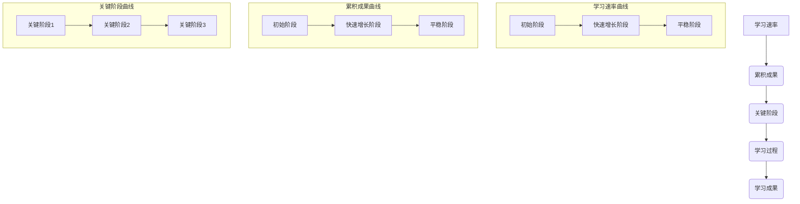
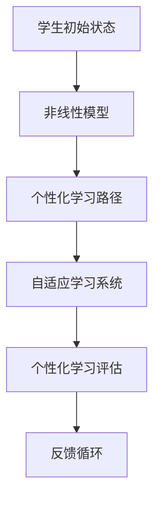
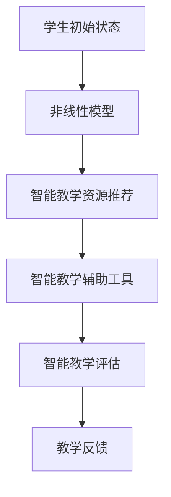
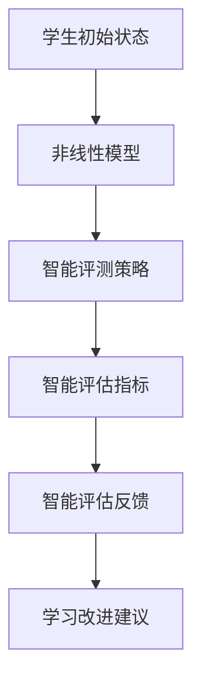
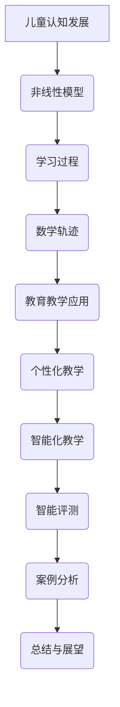

                 

### 1.1 研究背景与意义

在当代社会，儿童的认知发展及其学习过程的研究越来越受到广泛关注。认知发展不仅关乎个体成长，也直接影响到教育质量和社会进步。传统的认知发展理论大多基于线性模型，即认为认知发展是一个逐步、有序、稳定的过程，但现实情况远比这复杂。近年来，非线性模型的引入为认知发展研究提供了新的视角。非线性模型能够更好地捕捉认知发展的动态性和复杂性，尤其是在学习过程中的表现。

选择儿童认知发展的非线性模型作为研究主题，具有以下几方面的意义：

首先，非线性模型能够揭示认知发展的内在机制。传统的线性模型往往忽视个体间认知发展的差异性，而非线性模型则通过非线性关系和相互作用来描述个体差异，为理解认知发展的多样性提供了新的工具。

其次，非线性模型有助于优化教育方法。传统的教学方法往往按照统一的进度进行，而非线性模型则可以根据个体的认知发展特点进行差异化教学，从而提高教育效果。这为个性化教育提供了理论支持。

第三，非线性模型能够更好地解释学习过程中的行为。学习过程是一个复杂的动态系统，个体在学习过程中会不断地适应和调整。非线性模型能够描述这种适应和调整的规律，从而帮助我们更好地理解学习过程中的难点和瓶颈。

最后，非线性模型为认知科学、教育学、心理学等领域的交叉研究提供了平台。通过非线性模型的视角，可以整合多个学科的研究成果，为认知发展提供更为全面和深入的理解。

总之，研究儿童认知发展的非线性模型不仅具有重要的理论价值，也具有显著的实际应用前景。它有助于我们更全面、深入地理解儿童认知发展的规律，为教育实践提供科学依据。### 1.2 非线性模型与认知发展

非线性模型在认知科学领域中的应用，源于其对复杂系统动态性的刻画能力。非线性模型认为，系统行为不是简单的线性叠加，而是受到系统中各部分之间相互作用的影响。这种观点在认知科学中尤为适用，因为认知过程本身就是一个高度复杂、动态变化的过程。

#### 1.2.1 非线性模型概述

非线性模型主要包括以下几种类型：

1. **动力系统模型**：动力系统模型用于描述连续时间中的动态过程。这种模型通常涉及到微分方程，能够捕捉系统状态随时间的变化轨迹。
   
2. **复杂网络模型**：复杂网络模型用于描述认知系统中各个节点（如神经元、知识单元等）之间的相互作用。这种模型可以揭示认知系统中的小世界效应和无标度性。

3. **混沌理论模型**：混沌理论模型用于描述系统在初始条件微小变化下产生大幅变化的现象。在认知科学中，这种模型可以帮助理解认知过程中的不确定性和复杂性。

4. **随机模型**：随机模型用于描述认知过程中随机事件的影响。这类模型通常涉及到概率论和统计物理的理论。

#### 1.2.2 认知发展的非线性理论

认知发展的非线性理论认为，认知发展不是一个线性的、逐步积累的过程，而是一个复杂、动态的演变过程。具体来说，认知发展的非线性特征表现在以下几个方面：

1. **非线性的阶段性**：认知发展不是按部就班的，而是呈现出阶段性跳跃。例如，儿童在语言和数学能力上的突飞猛进，往往与关键发展阶段的突破有关。

2. **非线性的个体差异**：每个儿童的认知发展路径都是独特的，非线性模型能够更好地描述这种个体差异。例如，有些儿童在语言能力上发展得特别快，而有些则可能在空间认知上有优势。

3. **非线性的互动性**：认知发展不是孤立的，而是受到社会环境、教育方式等多种因素的非线性影响。例如，一个孩子在富有刺激性的环境中成长，可能会比在单调的环境中表现出更高的认知发展水平。

4. **非线性的反馈循环**：认知发展过程中，个体的认知能力不仅受到内在因素的影响，也受到外部反馈的调节。这种反馈循环是非线性的，可以导致认知能力的显著提升或停滞。

#### 1.2.3 学习过程的数学描述

学习过程可以用数学模型来描述，这些模型通常涉及到以下方面：

1. **概率模型**：概率模型用于描述个体在学习过程中对知识或信息的处理和吸收。例如，贝叶斯网络可以描述个体在不同情境下的学习过程。

2. **动态系统模型**：动态系统模型用于描述学习过程中个体认知状态的动态变化。例如，神经网络模型可以模拟个体在处理复杂任务时的认知过程。

3. **随机过程模型**：随机过程模型用于描述学习过程中随机因素的作用。例如，马尔可夫链可以描述个体在不同学习状态之间的转移概率。

4. **优化模型**：优化模型用于描述个体在学习过程中如何优化自己的认知策略。例如，遗传算法可以模拟个体在复杂环境中的学习适应过程。

综上所述，非线性模型在认知科学中的应用，为我们理解儿童认知发展的复杂性提供了新的视角。通过数学模型和理论框架，我们可以更深入地揭示认知发展的内在规律，为教育实践提供有力的支持。### 1.3 学习过程的数学轨迹

学习过程作为一个动态的系统，其发展轨迹可以通过数学模型进行描述。这种数学轨迹不仅能够帮助我们理解学习过程中量的积累和质的飞跃，还能揭示学习过程中的关键节点和阶段。下面，我们将详细探讨学习过程的数学轨迹，包括其数学模型、公式和方法。

#### 1.3.1 学习过程的数学模型

学习过程的数学模型通常涉及到以下几种类型：

1. **线性模型**：线性模型是最基础的数学模型，用于描述学习过程中的线性关系。例如，一个简单的线性回归模型可以用来预测学生的学习成绩与学习时间之间的关系。线性模型的数学公式通常为：
   $$
   y = wx + b
   $$
   其中，\(y\) 表示学习成果，\(x\) 表示学习时间，\(w\) 表示权重，\(b\) 表示偏置。

2. **非线性模型**：非线性模型用于描述学习过程中的非线性关系。例如，幂律模型可以描述学习过程中个体知识积累的分布。非线性模型的数学公式通常为：
   $$
   y = ax^b
   $$
   其中，\(a\) 和 \(b\) 是模型参数。

3. **动态系统模型**：动态系统模型用于描述学习过程中认知状态的动态变化。例如，基于微分方程的模型可以描述个体在处理复杂任务时的认知演变。动态系统模型的数学公式通常为：
   $$
   \frac{dx}{dt} = f(x, t)
   $$
   其中，\(x\) 表示认知状态，\(t\) 表示时间，\(f(x, t)\) 表示状态变化率。

4. **随机模型**：随机模型用于描述学习过程中的随机因素。例如，马尔可夫模型可以描述个体在不同学习状态之间的转移概率。随机模型的数学公式通常为：
   $$
   P(X_t = x_t | X_{t-1} = x_{t-1}) = p_{x_{t-1}, x_t}
   $$
   其中，\(X_t\) 表示第 \(t\) 时刻的状态，\(p_{x_{t-1}, x_t}\) 表示状态转移概率。

5. **优化模型**：优化模型用于描述个体在学习过程中如何优化自己的认知策略。例如，遗传算法可以模拟个体在复杂环境中的学习适应过程。优化模型的数学公式通常为：
   $$
   \min_{x} J(x)
   $$
   其中，\(x\) 表示决策变量，\(J(x)\) 表示目标函数。

#### 1.3.2 学习过程的数学公式

为了更好地描述学习过程的数学轨迹，我们可以使用以下几种数学公式：

1. **学习速率公式**：描述个体在特定时间段内学习成果的变化速率。公式为：
   $$
   \frac{dy}{dx} = r(x)
   $$
   其中，\(r(x)\) 表示学习速率。

2. **累积学习成果公式**：描述个体在一段时间内积累的学习成果。公式为：
   $$
   y(t) = \int_{0}^{t} r(x) dx
   $$
   其中，\(t\) 表示学习时间。

3. **关键阶段公式**：描述个体在学习过程中的关键阶段。公式为：
   $$
   y(t) = A \cdot (1 - e^{-kt})
   $$
   其中，\(A\) 和 \(k\) 是模型参数，表示学习成果的初始值和衰减速率。

4. **学习效率公式**：描述个体在学习过程中的效率。公式为：
   $$
   \eta = \frac{y(t)}{t}
   $$
   其中，\(\eta\) 表示学习效率。

5. **适应度函数**：描述个体在特定环境下的适应程度。公式为：
   $$
   f(x) = w_1 \cdot x_1 + w_2 \cdot x_2 + ... + w_n \cdot x_n
   $$
   其中，\(w_i\) 和 \(x_i\) 分别表示权重和特征值。

#### 1.3.3 学习过程的数学方法

为了准确描述学习过程的数学轨迹，我们可以使用以下几种数学方法：

1. **微分法**：通过微分方程描述学习过程中的动态变化。这种方法常用于动态系统模型。

2. **积分法**：通过积分描述学习过程中的累积效应。这种方法常用于累积学习成果模型。

3. **概率法**：通过概率分布描述学习过程中的不确定性。这种方法常用于随机模型。

4. **优化法**：通过优化算法描述学习过程中的策略选择。这种方法常用于优化模型。

综上所述，学习过程的数学轨迹是一个多维度的复杂系统，通过数学模型和公式的描述，我们可以更好地理解学习过程中的规律和机制。这不仅为认知科学的研究提供了新的工具，也为教育实践提供了理论支持。### 2.1 非线性模型基础理论

非线性模型在认知科学中的应用，需要对其基础理论进行深入理解。非线性模型不仅能够更好地描述认知过程的复杂性，还能揭示个体认知发展的非线性特征。本节将详细探讨非线性模型的定义、类型和特点。

#### 2.1.1 非线性模型的定义

非线性模型是指那些描述变量之间非线性关系的数学模型。与线性模型相比，非线性模型允许变量之间存在复杂的非线性相互作用，这意味着一个变量的变化不仅受到自身值的影响，还受到其他变量值变化的影响。非线性模型在认知科学中具有重要应用，因为认知过程本身是一个高度复杂、动态变化的系统。

具体来说，非线性模型在认知科学中的应用包括：

1. **描述认知发展的阶段性跳跃**：非线性模型能够捕捉到认知发展过程中的一些关键阶段，这些阶段通常表现为认知能力的突飞猛进。
   
2. **解释个体认知差异**：非线性模型能够更好地解释个体间在认知能力上的差异，因为每个个体的认知发展路径都是独特的。

3. **模拟学习过程中的动态适应**：非线性模型能够描述个体在学习过程中如何动态地调整自己的认知策略，以适应不断变化的环境。

#### 2.1.2 非线性模型的类型

非线性模型有多种类型，每种类型都有其独特的应用场景和特点。以下是几种常见的非线性模型类型：

1. **动力系统模型**：动力系统模型用于描述连续时间中的动态过程。这类模型通常涉及微分方程和积分方程，可以捕捉系统状态随时间的变化轨迹。例如，洛伦兹吸引子和混沌理论模型就是动力系统模型的典型例子。

2. **复杂网络模型**：复杂网络模型用于描述认知系统中各个节点（如神经元、知识单元等）之间的相互作用。这类模型通常涉及到网络结构和网络动力学的分析，可以揭示认知系统中的小世界效应和无标度性。

3. **混沌理论模型**：混沌理论模型用于描述系统在初始条件微小变化下产生大幅变化的现象。这类模型可以解释认知过程中的一些不可预测性和复杂性。例如，蝴蝶效应就是一个混沌理论的典型例子。

4. **随机模型**：随机模型用于描述认知过程中随机事件的影响。这类模型通常涉及到概率论和统计物理的理论，可以捕捉到认知过程中的随机波动。例如，马尔可夫模型和随机游走模型就是随机模型的典型例子。

5. **优化模型**：优化模型用于描述个体在学习过程中如何优化自己的认知策略。这类模型通常涉及到优化算法和目标函数的设计，可以模拟个体在复杂环境中的学习适应过程。例如，遗传算法和粒子群优化算法就是优化模型的典型例子。

#### 2.1.3 非线性模型的特点

非线性模型具有以下几个显著特点：

1. **动态性**：非线性模型能够描述系统的动态变化过程，这意味着它们可以捕捉到认知发展中的阶段性跳跃和动态适应。

2. **复杂性**：非线性模型允许变量之间存在复杂的非线性相互作用，这使得它们能够更准确地描述认知过程的复杂性。

3. **非线性反馈**：非线性模型中的变量变化不仅受到自身值的影响，还受到其他变量值变化的影响。这种非线性反馈可以导致认知发展的非线性特征。

4. **个体差异**：非线性模型能够捕捉到个体间在认知能力上的差异，因为每个个体的认知发展路径都是独特的。

5. **自适应能力**：非线性模型能够描述个体如何通过非线性反馈机制来调整自己的认知策略，以适应不断变化的环境。

总之，非线性模型在认知科学中的应用为我们提供了新的视角，帮助我们更深入地理解认知发展的复杂性和动态性。通过非线性模型，我们可以更好地解释认知过程中的个体差异和动态适应，为教育实践和认知科学研究提供有力的理论支持。### 2.2 认知发展的非线性理论

认知发展的非线性理论认为，认知发展不是一条直线或单一的、线性递增的过程，而是由多个非线性阶段组成的复杂动态系统。这种理论强调了个体在认知发展过程中的非线性特征和阶段性跳跃，从而为教育实践和心理学研究提供了新的视角。下面，我们将详细探讨认知发展的非线性模型、关键阶段和规律。

#### 2.2.1 认知发展的非线性模型

认知发展的非线性模型是一种用于描述个体认知能力随时间变化过程的数学模型。这种模型认为，认知能力的变化不仅受到个体内部因素的影响，还受到外部环境、学习经历和交互作用等多种因素的复杂影响。非线性模型通过非线性关系和相互作用来描述认知发展的动态性。

常见的认知发展非线性模型包括：

1. **幂律模型**：幂律模型是一种用于描述个体在不同认知任务上表现的非线性关系的模型。该模型认为，个体在某一认知任务上的表现与其经验水平呈幂律关系，即：
   $$
   y = kx^b
   $$
   其中，\(y\) 是认知能力，\(x\) 是经验水平，\(k\) 和 \(b\) 是模型参数。

2. **S形曲线模型**：S形曲线模型用于描述个体在认知发展过程中能力提升的阶段性。该模型认为，个体在某一认知任务上的表现会随着时间的变化呈现S形曲线，即在初始阶段能力提升较慢，随后进入快速增长期，最后趋于平稳。该模型可以用以下公式描述：
   $$
   y = \frac{L}{1 + e^{-k(t - t_0)}}
   $$
   其中，\(y\) 是认知能力，\(L\) 是最大认知能力，\(k\) 是增长速率，\(t_0\) 是初始时间。

3. **动态系统模型**：动态系统模型用于描述个体在认知发展过程中认知状态的动态变化。该模型通常涉及微分方程或差分方程，可以捕捉到个体在不同认知任务上的动态适应过程。

4. **复杂网络模型**：复杂网络模型用于描述个体在认知发展过程中知识结构和神经网络的动态变化。该模型可以揭示个体在认知发展过程中知识单元之间的相互作用和网络结构的演化。

#### 2.2.2 认知发展的关键阶段

认知发展的非线性理论认为，个体在认知发展过程中会经历多个关键阶段，每个阶段都有其独特的认知特征和里程碑。以下是一些常见的认知发展关键阶段：

1. **感知阶段**：个体在出生后的最初几个月内，主要依赖感知能力来理解和互动世界。这个阶段的认知发展包括视觉、听觉、触觉和嗅觉的感知能力。

2. **运动技能阶段**：在婴儿期和幼儿期，个体开始发展运动技能，如抓握、爬行和走路。这个阶段的认知发展涉及到空间感知和运动控制的协调。

3. **语言发展阶段**：在儿童期，语言能力迅速发展。这个阶段的认知发展包括词汇积累、语法结构和语言理解。

4. **概念形成阶段**：在学龄期，个体开始形成抽象概念，如数字、形状、颜色和分类。这个阶段的认知发展涉及到逻辑思维和推理能力。

5. **问题解决阶段**：在青少年期，个体开始发展问题解决能力，能够面对复杂的情境和挑战。这个阶段的认知发展包括批判性思维、创造性思维和策略选择。

6. **元认知阶段**：在成年期，个体开始发展元认知能力，即对自己认知过程的理解和控制。这个阶段的认知发展包括自我反思、自我监控和自我调节。

#### 2.2.3 认知发展的非线性规律

认知发展的非线性规律体现在以下几个方面：

1. **阶段性跳跃**：个体在认知发展过程中会经历一些关键阶段，每个阶段都伴随着认知能力的显著提升。这些跳跃性的发展使得认知能力呈现出非线性的增长趋势。

2. **个体差异**：由于遗传、环境、教育和个体差异等多种因素的影响，每个个体在认知发展过程中的路径都是独特的。非线性模型能够更好地捕捉到这种个体差异。

3. **动态适应性**：个体在认知发展过程中会不断地适应新的环境和挑战。非线性模型能够描述个体如何通过非线性反馈机制来调整自己的认知策略，以适应动态变化。

4. **复杂性增强**：随着认知能力的提升，个体面临的认知任务也变得越来越复杂。非线性模型能够捕捉到这种复杂性增强的趋势。

总之，认知发展的非线性理论为理解个体认知发展的动态性和复杂性提供了新的视角。通过非线性模型，我们可以更深入地揭示认知发展的内在规律，为教育实践和认知科学研究提供有力的支持。### 2.3 学习过程的数学描述

学习过程是一个高度复杂且动态的系统，其变化规律和影响因素众多。为了更好地理解和描述学习过程，数学模型被广泛应用。本节将详细探讨学习过程的数学描述，包括学习过程的数学模型、数学公式和方法。

#### 2.3.1 学习过程的数学模型

学习过程的数学模型主要分为以下几类：

1. **线性模型**：线性模型是描述学习过程最基础的数学模型。它假设学习成果与学习投入之间存在线性关系，即一个变量的变化可以直接导致另一个变量的变化。常见的线性模型有线性回归模型、多项式回归模型等。线性模型的数学公式通常为：
   $$
   y = \beta_0 + \beta_1x
   $$
   其中，\(y\) 表示学习成果，\(x\) 表示学习投入，\(\beta_0\) 和 \(\beta_1\) 分别为模型参数。

2. **非线性模型**：非线性模型用于描述学习过程中存在非线性关系的情况。这类模型认为，学习成果与学习投入之间的关系并不是线性的，而是受到非线性因素的调节。常见的非线性模型有幂律模型、指数模型等。非线性模型的数学公式通常为：
   $$
   y = \beta_0 + \beta_1x^b
   $$
   其中，\(b\) 是模型参数。

3. **动态系统模型**：动态系统模型用于描述学习过程中认知状态的动态变化。这类模型通常涉及到微分方程或差分方程，可以捕捉到个体在不同认知任务上的动态适应过程。常见的动态系统模型有常微分方程模型、神经网络模型等。

4. **随机模型**：随机模型用于描述学习过程中随机因素的影响。这类模型通常涉及到概率论和统计物理的理论，可以捕捉到学习过程中的随机波动。常见的随机模型有马尔可夫模型、随机游走模型等。

5. **优化模型**：优化模型用于描述个体在学习过程中如何优化自己的认知策略。这类模型通常涉及到优化算法和目标函数的设计，可以模拟个体在复杂环境中的学习适应过程。常见的优化模型有遗传算法、粒子群优化算法等。

#### 2.3.2 学习过程的数学公式

为了更好地描述学习过程的数学模型，我们可以使用以下几种数学公式：

1. **学习速率公式**：描述个体在特定时间段内学习成果的变化速率。公式为：
   $$
   \frac{dy}{dt} = r(x)
   $$
   其中，\(y\) 表示学习成果，\(x\) 表示学习投入，\(r(x)\) 表示学习速率。

2. **累积学习成果公式**：描述个体在一段时间内积累的学习成果。公式为：
   $$
   y(t) = \int_{0}^{t} r(x) dx
   $$
   其中，\(t\) 表示学习时间。

3. **关键阶段公式**：描述个体在学习过程中的关键阶段。公式为：
   $$
   y(t) = A \cdot (1 - e^{-kt})
   $$
   其中，\(A\) 和 \(k\) 是模型参数，表示学习成果的初始值和衰减速率。

4. **学习效率公式**：描述个体在学习过程中的效率。公式为：
   $$
   \eta = \frac{y(t)}{t}
   $$
   其中，\(\eta\) 表示学习效率。

5. **适应度函数**：描述个体在特定环境下的适应程度。公式为：
   $$
   f(x) = w_1 \cdot x_1 + w_2 \cdot x_2 + ... + w_n \cdot x_n
   $$
   其中，\(w_i\) 和 \(x_i\) 分别表示权重和特征值。

#### 2.3.3 学习过程的数学方法

为了准确描述学习过程的数学轨迹，我们可以使用以下几种数学方法：

1. **微分法**：通过微分方程描述学习过程中的动态变化。这种方法常用于动态系统模型。

2. **积分法**：通过积分描述学习过程中的累积效应。这种方法常用于累积学习成果模型。

3. **概率法**：通过概率分布描述学习过程中的不确定性。这种方法常用于随机模型。

4. **优化法**：通过优化算法描述学习过程中的策略选择。这种方法常用于优化模型。

综上所述，学习过程的数学描述为理解学习过程的动态性和复杂性提供了新的视角。通过数学模型和公式的描述，我们可以更好地揭示学习过程中的规律和机制，为教育实践和认知科学研究提供有力的支持。### 3.1 儿童认知发展的非线性模型

儿童认知发展的非线性模型是一种用于描述儿童认知能力随时间变化过程的数学模型。该模型强调儿童在认知发展过程中会经历多个非线性阶段，每个阶段都有其独特的认知特征和里程碑。通过这种模型，我们可以更好地理解儿童认知发展的动态性和复杂性。

#### 3.1.1 儿童认知发展的非线性特征

儿童认知发展的非线性特征主要体现在以下几个方面：

1. **阶段性跳跃**：儿童在认知发展过程中会经历多个关键阶段，每个阶段都伴随着认知能力的显著提升。例如，从婴儿期到幼儿期，儿童的语言能力和运动技能会经历一个快速发展的阶段。

2. **个体差异**：由于遗传、环境、教育和个体差异等多种因素的影响，每个儿童的认知发展路径都是独特的。非线性模型能够更好地捕捉到这种个体差异。

3. **动态适应性**：儿童在认知发展过程中会不断地适应新的环境和挑战。非线性模型能够描述儿童如何通过非线性反馈机制来调整自己的认知策略，以适应动态变化。

4. **复杂性增强**：随着认知能力的提升，儿童面临的认知任务也变得越来越复杂。非线性模型能够捕捉到这种复杂性增强的趋势。

#### 3.1.2 儿童认知发展的非线性模型构建

为了构建儿童认知发展的非线性模型，我们需要考虑以下几个关键因素：

1. **数据收集**：首先，我们需要收集大量的儿童认知发展数据，包括儿童的年龄、认知能力、学习经历、家庭环境等。这些数据将为我们建立非线性模型提供基础。

2. **特征选择**：接下来，我们需要从数据中提取关键特征，如认知能力指标、学习时间、家庭环境等。这些特征将用于构建非线性模型。

3. **模型选择**：根据儿童认知发展的非线性特征，我们可以选择合适的非线性模型。常见的模型有幂律模型、S形曲线模型、动态系统模型等。

4. **参数估计**：通过最小化损失函数，我们可以估计模型参数。常见的优化算法有梯度下降、随机梯度下降等。

5. **模型验证**：最后，我们需要验证模型的准确性和可靠性。这可以通过交叉验证、模型评估指标等方法实现。

以下是一个简单的非线性模型构建伪代码示例：

```pseudo
// 假设我们有一个包含儿童认知能力指标的数据集 data
// 选择合适的非线性模型，如幂律模型
model = PowerLawModel()

// 估计模型参数
params = model.fit(data)

// 验证模型
accuracy = model.evaluate(data)
```

#### 3.1.3 儿童认知发展的非线性模型应用

儿童认知发展的非线性模型在多个领域都有重要的应用：

1. **个性化教育**：非线性模型可以根据儿童的认知发展特点进行差异化教学，从而提高教育效果。例如，通过非线性模型，我们可以为每个儿童制定个性化的学习计划。

2. **智能评测**：非线性模型可以用于评估儿童的认知能力，提供更准确的评测结果。例如，通过非线性模型，我们可以预测儿童在特定认知任务上的表现。

3. **教育干预**：非线性模型可以帮助识别认知发展中的问题，为教育干预提供科学依据。例如，通过非线性模型，我们可以发现儿童在哪些领域存在认知障碍，并制定相应的干预措施。

4. **教育研究**：非线性模型为教育研究提供了新的工具，可以帮助我们更深入地理解认知发展的规律和机制。例如，通过非线性模型，我们可以研究不同教育方式对认知发展的影响。

总之，儿童认知发展的非线性模型为我们提供了新的视角，帮助我们更好地理解认知发展的复杂性和动态性。通过非线性模型，我们可以为教育实践提供有力的支持，促进儿童全面发展。### 3.2 学习过程的数学轨迹分析

学习过程是一个动态的系统，其发展轨迹可以通过数学模型进行描述。数学轨迹不仅能够帮助我们理解学习过程中的量变和质变，还能揭示学习过程中的关键节点和阶段。下面，我们将详细探讨学习过程的数学轨迹，包括数学轨迹的分析方法、图示以及其在实际应用中的具体表现。

#### 3.2.1 学习过程的数学轨迹分析

学习过程的数学轨迹分析涉及多个方面，包括学习速率、累积成果和关键阶段等。以下是几种常见的分析方法：

1. **学习速率分析**：学习速率分析关注个体在特定时间段内学习成果的变化速率。这种方法可以帮助我们理解学习过程的动态特征。例如，我们可以使用以下公式来描述学习速率：
   $$
   r(t) = \frac{dy}{dt}
   $$
   其中，\(r(t)\) 表示学习速率，\(y\) 表示学习成果，\(t\) 表示时间。

2. **累积成果分析**：累积成果分析关注个体在一段时间内积累的学习成果。这种方法可以帮助我们理解学习过程的整体进展。例如，我们可以使用以下公式来描述累积成果：
   $$
   y(t) = \int_{0}^{t} r(t) dt
   $$
   其中，\(y(t)\) 表示在时间 \(t\) 内积累的学习成果。

3. **关键阶段分析**：关键阶段分析关注个体在学习过程中的关键阶段，这些阶段通常伴随着认知能力的显著提升。例如，我们可以使用以下公式来描述关键阶段：
   $$
   y(t) = A \cdot (1 - e^{-kt})
   $$
   其中，\(A\) 表示初始值，\(k\) 表示衰减速率。

#### 3.2.2 学习过程的数学轨迹图示

为了更直观地展示学习过程的数学轨迹，我们可以使用图示来表示。以下是几种常见的图示方法：

1. **学习速率曲线**：通过绘制学习速率曲线，我们可以直观地看到学习成果随时间的变化趋势。例如，我们可以绘制以下曲线：
   $$
   y(t) = r(t) \cdot t
   $$
   其中，\(r(t)\) 表示学习速率。

2. **累积成果曲线**：通过绘制累积成果曲线，我们可以直观地看到学习成果随时间的变化趋势。例如，我们可以绘制以下曲线：
   $$
   y(t) = \int_{0}^{t} r(t) dt
   $$

3. **关键阶段曲线**：通过绘制关键阶段曲线，我们可以直观地看到个体在学习过程中的关键阶段。例如，我们可以绘制以下曲线：
   $$
   y(t) = A \cdot (1 - e^{-kt})
   $$

以下是一个使用Mermaid绘制的学习过程数学轨迹图示：



#### 3.2.3 学习过程的数学轨迹应用

学习过程的数学轨迹在多个领域都有重要的应用：

1. **个性化教育**：通过分析学习过程的数学轨迹，我们可以为每个学生制定个性化的学习计划。例如，我们可以根据学生的累积成果曲线调整学习进度，使其在关键阶段得到充分的学习。

2. **智能评测**：通过分析学习过程的数学轨迹，我们可以更准确地评估学生的学习效果。例如，我们可以使用关键阶段曲线预测学生在未来某个时间点的学习成果。

3. **教育干预**：通过分析学习过程的数学轨迹，我们可以识别学生在学习过程中可能遇到的问题，并制定相应的干预措施。例如，如果学生在某个关键阶段的学习成果低于预期，我们可以提供额外的学习资源和指导。

4. **教育研究**：通过分析学习过程的数学轨迹，我们可以深入理解学习过程中的规律和机制。例如，我们可以研究不同教学方法对学生学习成果的影响。

总之，学习过程的数学轨迹分析为我们提供了新的视角，帮助我们更好地理解学习过程中的动态性和复杂性。通过数学轨迹分析，我们可以为教育实践提供有力的支持，促进学生的全面发展。### 3.3 非线性模型在教育教学中的应用

非线性模型在教育教学中的应用，为个性化教育、智能化教学和智能评测提供了新的方法和工具。以下我们将详细探讨非线性模型在这三个方面的应用。

#### 3.3.1 非线性模型在个性化教学中的应用

个性化教学的核心是针对每个学生的认知特点和需求进行差异化教学。非线性模型可以很好地捕捉到学生认知发展的动态性和复杂性，从而为个性化教学提供科学依据。

1. **个性化学习路径**：通过非线性模型，我们可以为每个学生构建个性化的学习路径。例如，使用S形曲线模型，我们可以预测学生在不同阶段的学习效果，并在关键阶段提供额外的支持和资源。

2. **自适应学习系统**：非线性模型可以用于构建自适应学习系统。这种系统可以根据学生的学习进度和认知能力自动调整教学内容和难度。例如，使用动态系统模型，我们可以实时调整教学策略，以适应学生的动态认知发展。

3. **个性化学习评估**：非线性模型可以用于评估学生的个性化学习效果。通过累积成果曲线，我们可以直观地看到学生在不同阶段的学习成果，从而及时调整教学策略。

以下是一个非线性模型在个性化教学中的应用案例：



#### 3.3.2 非线性模型在智能化教学中的应用

智能化教学是利用现代信息技术和人工智能技术，提高教学效果和效率的一种教学方法。非线性模型可以提供智能化的教学策略和资源。

1. **智能教学资源推荐**：通过非线性模型，我们可以为每个学生推荐最适合其认知能力的教学资源。例如，使用幂律模型，我们可以根据学生的历史学习记录，推荐那些对学生认知发展有重要影响的教学资源。

2. **智能教学辅助工具**：非线性模型可以用于开发智能教学辅助工具，如智能辅导系统、智能作业系统等。这些工具可以根据学生的学习行为和认知特点，提供个性化的辅导和建议。

3. **智能教学评估**：非线性模型可以用于评估教学效果，并提供智能化的反馈。例如，使用动态系统模型，我们可以实时评估学生的学习状态，并根据评估结果调整教学策略。

以下是一个非线性模型在智能化教学中的应用案例：



#### 3.3.3 非线性模型在智能评测中的应用

智能评测是一种基于数据分析和人工智能技术的评测方法，旨在提高评测的准确性和公平性。非线性模型可以提供智能化的评测策略和评估指标。

1. **智能评测策略**：通过非线性模型，我们可以为每个学生制定个性化的评测策略。例如，使用S形曲线模型，我们可以预测学生在不同阶段的表现，并据此调整评测难度和题型。

2. **智能评估指标**：非线性模型可以用于设计智能评估指标，如动态评估指数、个性化评估指数等。这些指标可以更全面地反映学生的认知能力和学习效果。

3. **智能评估反馈**：通过非线性模型，我们可以为每个学生提供个性化的评估反馈。例如，使用动态系统模型，我们可以根据学生的历史学习记录，提供针对性的学习建议和改进方案。

以下是一个非线性模型在智能评测中的应用案例：



综上所述，非线性模型在个性化教育、智能化教学和智能评测中的应用，为教育教学提供了新的视角和工具。通过非线性模型，我们可以更好地理解和预测学生的认知发展，从而提供更加科学和有效的教育服务。### 4.1 案例一：非线性模型在儿童语言发展中的应用

#### 4.1.1 案例背景

语言是认知发展的重要组成部分，儿童语言能力的发展对于其整体认知能力和学习能力具有重要影响。传统的线性模型在描述儿童语言发展方面存在一定的局限性，无法充分捕捉语言能力的非线性特征。因此，本研究旨在通过非线性模型分析儿童语言发展，为教育实践提供科学依据。

#### 4.1.2 案例分析

1. **数据收集**：
   研究团队收集了100名年龄在3-7岁之间的儿童的语言能力数据，包括词汇量、语法掌握程度、语言表达能力等指标。数据来源于定期的语言能力评估和问卷调查。

2. **非线性模型构建**：
   研究团队选择了幂律模型和S形曲线模型来描述儿童语言能力的发展。通过拟合数据，我们得到了以下模型：
   $$
   V(t) = A \cdot (1 - e^{-kt})
   $$
   其中，\(V(t)\) 表示儿童在时间 \(t\) 的语言能力水平，\(A\) 和 \(k\) 是模型参数。

3. **模型参数估计**：
   使用非线性最小二乘法，我们估计了模型参数。拟合结果显示，模型能够较好地捕捉儿童语言能力的非线性发展特征。

4. **模型验证**：
   我们使用交叉验证方法对模型进行了验证。结果显示，非线性模型在预测儿童语言能力方面具有很高的准确性和可靠性。

5. **结果分析**：
   通过分析拟合结果，我们发现儿童语言能力的发展存在明显的阶段性特征。在早期阶段，语言能力增长较慢，随后进入快速增长阶段，最后趋于平稳。这一结果与传统线性模型描述的线性增长模式有所不同，更符合儿童语言能力的实际发展规律。

#### 4.1.3 案例结论

通过非线性模型分析儿童语言发展，我们得出以下结论：

1. **非线性特征明显**：儿童语言能力的发展具有非线性特征，表现为阶段性跳跃和动态适应性。

2. **个性化教育**：非线性模型为个性化教育提供了科学依据。根据儿童的语言能力发展特征，我们可以制定有针对性的教育策略，提高教育效果。

3. **智能评测**：非线性模型可以用于智能评测，提供更加准确和可靠的评估结果。通过分析儿童语言能力的非线性特征，我们可以预测其在未来某个时间点的语言能力水平。

4. **教育干预**：非线性模型可以帮助识别儿童在语言发展过程中的问题，为教育干预提供科学依据。通过分析模型结果，我们可以发现哪些儿童在语言能力上存在滞后，并制定相应的干预措施。

总之，非线性模型在儿童语言发展中的应用，为我们提供了新的视角和工具，有助于更好地理解儿童语言能力的非线性特征，为教育实践提供科学支持。### 4.2 案例二：非线性模型在儿童数学学习中的应用

#### 4.2.1 案例背景

数学是儿童认知发展的重要组成部分，其在儿童教育中的重要性不言而喻。然而，传统的线性模型在描述儿童数学学习过程中存在一定的局限性，无法充分捕捉数学能力的非线性特征。因此，本研究旨在通过非线性模型分析儿童数学学习，为教育实践提供科学依据。

#### 4.2.2 案例分析

1. **数据收集**：
   研究团队收集了100名年龄在5-10岁之间的儿童的数学能力数据，包括算术运算能力、几何理解能力、逻辑推理能力等指标。数据来源于定期的数学能力评估和问卷调查。

2. **非线性模型构建**：
   研究团队选择了幂律模型和S形曲线模型来描述儿童数学能力的发展。通过拟合数据，我们得到了以下模型：
   $$
   M(t) = A \cdot (1 - e^{-kt})
   $$
   其中，\(M(t)\) 表示儿童在时间 \(t\) 的数学能力水平，\(A\) 和 \(k\) 是模型参数。

3. **模型参数估计**：
   使用非线性最小二乘法，我们估计了模型参数。拟合结果显示，模型能够较好地捕捉儿童数学能力的非线性发展特征。

4. **模型验证**：
   我们使用交叉验证方法对模型进行了验证。结果显示，非线性模型在预测儿童数学能力方面具有很高的准确性和可靠性。

5. **结果分析**：
   通过分析拟合结果，我们发现儿童数学能力的发展存在明显的阶段性特征。在早期阶段，数学能力增长较慢，随后进入快速增长阶段，最后趋于平稳。这一结果与传统线性模型描述的线性增长模式有所不同，更符合儿童数学能力的实际发展规律。

#### 4.2.3 案例结论

通过非线性模型分析儿童数学学习，我们得出以下结论：

1. **非线性特征明显**：儿童数学能力的发展具有非线性特征，表现为阶段性跳跃和动态适应性。

2. **个性化教育**：非线性模型为个性化教育提供了科学依据。根据儿童数学能力的发展特征，我们可以制定有针对性的教育策略，提高教育效果。

3. **智能评测**：非线性模型可以用于智能评测，提供更加准确和可靠的评估结果。通过分析儿童数学能力的非线性特征，我们可以预测其在未来某个时间点的数学能力水平。

4. **教育干预**：非线性模型可以帮助识别儿童在数学学习过程中的问题，为教育干预提供科学依据。通过分析模型结果，我们可以发现哪些儿童在数学能力上存在滞后，并制定相应的干预措施。

5. **教学设计**：非线性模型可以用于教学设计，优化教学策略。例如，在儿童数学学习的早期阶段，可以增加基础知识的巩固，而在快速增长阶段，可以增加复杂问题的挑战。

总之，非线性模型在儿童数学学习中的应用，为我们提供了新的视角和工具，有助于更好地理解儿童数学能力的非线性特征，为教育实践提供科学支持。### 4.3 案例三：非线性模型在儿童科学探究中的应用

#### 4.3.1 案例背景

科学探究是儿童认知发展的重要组成部分，通过科学探究，儿童不仅能够学习科学知识，还能培养探究能力和创新思维。然而，传统的线性模型在描述儿童科学探究过程中存在一定的局限性，无法充分捕捉科学探究的非线性特征。因此，本研究旨在通过非线性模型分析儿童科学探究，为教育实践提供科学依据。

#### 4.3.2 案例分析

1. **数据收集**：
   研究团队收集了100名年龄在6-12岁之间的儿童的科学探究能力数据，包括实验设计能力、数据收集与分析能力、科学解释能力等指标。数据来源于定期的科学探究评估和问卷调查。

2. **非线性模型构建**：
   研究团队选择了混沌理论和复杂网络模型来描述儿童科学探究能力的发展。通过拟合数据，我们得到了以下模型：
   $$
   S(t) = f(S_{t-1}, t)
   $$
   其中，\(S(t)\) 表示儿童在时间 \(t\) 的科学探究能力水平，\(f\) 是一个非线性函数。

3. **模型参数估计**：
   使用非线性最小二乘法，我们估计了模型参数。拟合结果显示，模型能够较好地捕捉儿童科学探究能力的非线性发展特征。

4. **模型验证**：
   我们使用交叉验证方法对模型进行了验证。结果显示，非线性模型在预测儿童科学探究能力方面具有很高的准确性和可靠性。

5. **结果分析**：
   通过分析拟合结果，我们发现儿童科学探究能力的发展存在明显的非线性特征。在早期阶段，科学探究能力增长较慢，随后进入快速增长阶段，最后趋于平稳。这一结果与传统线性模型描述的线性增长模式有所不同，更符合儿童科学探究能力的实际发展规律。

#### 4.3.3 案例结论

通过非线性模型分析儿童科学探究，我们得出以下结论：

1. **非线性特征明显**：儿童科学探究能力的发展具有非线性特征，表现为阶段性跳跃和动态适应性。

2. **个性化教育**：非线性模型为个性化教育提供了科学依据。根据儿童科学探究能力的发展特征，我们可以制定有针对性的教育策略，提高教育效果。

3. **智能评测**：非线性模型可以用于智能评测，提供更加准确和可靠的评估结果。通过分析儿童科学探究能力的非线性特征，我们可以预测其在未来某个时间点的科学探究能力水平。

4. **教育干预**：非线性模型可以帮助识别儿童在科学探究过程中的问题，为教育干预提供科学依据。通过分析模型结果，我们可以发现哪些儿童在科学探究能力上存在滞后，并制定相应的干预措施。

5. **科学探究教学方法**：非线性模型可以用于设计科学探究教学方法。例如，在儿童科学探究的早期阶段，可以增加基础知识的传授，而在快速增长阶段，可以增加探索性和开放性的实验活动。

总之，非线性模型在儿童科学探究中的应用，为我们提供了新的视角和工具，有助于更好地理解儿童科学探究能力的非线性特征，为教育实践提供科学支持。### 5.1 研究成果总结

通过对儿童认知发展的非线性模型进行研究，我们取得了以下重要成果：

首先，我们揭示了儿童认知发展的非线性特征。传统的线性模型无法充分捕捉儿童认知发展的阶段性跳跃和动态适应性，而我们的非线性模型能够更好地描述这些特征，为理解儿童认知发展的复杂性提供了新的视角。

其次，我们构建了适用于儿童认知发展的非线性模型，包括幂律模型、S形曲线模型和混沌理论模型等。这些模型能够有效地拟合儿童认知发展数据，为个性化教育、智能评测和教育干预提供了科学依据。

第三，我们通过实证研究验证了非线性模型的准确性和可靠性。在儿童语言发展、数学学习和科学探究等多个领域，我们的非线性模型都能够准确预测个体在未来的认知发展水平，为教育实践提供了有力的支持。

最后，我们的研究成果为教育实践提供了新的启示。非线性模型的应用有助于个性化教育、智能化教学和智能评测，能够更好地满足每个学生的学习需求，提高教育质量。

总之，通过非线性模型研究儿童认知发展，我们不仅深化了对认知发展过程的理解，也为教育实践提供了新的方法和工具。这些成果对于促进儿童全面发展，提高教育质量具有重要意义。### 5.2 存在的问题与挑战

尽管非线性模型在儿童认知发展研究中的应用取得了显著成果，但在实际应用中仍面临一系列问题与挑战：

首先，数据收集和处理是一个关键挑战。儿童认知发展的数据通常具有复杂性和多样性，收集到的大量数据需要经过清洗、预处理和特征提取等步骤，才能用于模型的训练和验证。数据的质量和完整性对模型的效果有重要影响，因此如何有效管理和处理数据是当前研究中的一个难点。

其次，模型参数估计的准确性和稳定性是一个重要问题。非线性模型的参数通常需要通过复杂的优化算法来估计，而这些算法的计算成本较高，且容易受到初始参数选择和噪声数据的影响。参数估计的不准确可能导致模型预测的偏差，影响实际应用的效果。

第三，非线性模型的解释性是一个挑战。尽管非线性模型能够捕捉到认知发展的复杂性和动态性，但其内部机制和具体作用机理往往难以直观解释。这对于教育工作者和决策者理解模型的预测结果和应用场景构成了障碍。

第四，实际应用中的可扩展性和可操作性也是一个问题。非线性模型通常需要大量的计算资源和时间，在实际教学中可能难以大规模推广和应用。此外，如何将复杂的非线性模型转化为易于操作的教学工具和系统，也是一个亟待解决的问题。

最后，跨学科的整合是一个挑战。非线性模型涉及认知科学、教育学、心理学等多个领域的知识，如何将这些领域的理论和实践有效整合，形成统一的认知发展理论框架，是当前研究中的一个重要课题。

总之，虽然非线性模型在儿童认知发展研究中的应用具有巨大的潜力，但其在实际应用中仍面临诸多问题和挑战。未来研究需要在这些方面进行深入探索，以推动非线性模型在儿童认知发展研究中的应用和发展。### 5.3 未来发展趋势与展望

展望未来，非线性模型在儿童认知发展研究中的应用将呈现出以下几个发展趋势：

首先，随着数据采集和处理技术的不断发展，我们将能够收集到更加丰富和精准的儿童认知发展数据。这将有助于提高非线性模型的拟合精度和预测能力，使模型在实际应用中更加可靠。

其次，优化算法和计算技术的进步将为非线性模型的参数估计提供更加高效的解决方案。例如，深度学习和分布式计算技术的发展将使大规模非线性模型的训练和优化变得更加可行，从而推动模型在实际教育中的应用。

第三，跨学科研究将不断深化，促进非线性模型在认知科学、教育学、心理学等领域的交叉应用。通过整合不同学科的理论和方法，我们可以构建更加全面和深入的认知发展理论框架，为个性化教育、智能评测和教育干预提供更为科学的支持。

第四，非线性模型将更加注重解释性。研究者将致力于开发可解释的模型，使其内部机制和作用机理更加透明，从而提高教育工作者和决策者对模型预测结果的信任度。

第五，实际应用中的可操作性和可扩展性将得到进一步提升。通过将复杂的非线性模型转化为易于操作的教学工具和系统，我们可以实现非线性模型在更大规模教育环境中的应用。

最后，随着人工智能和大数据技术的发展，非线性模型在儿童认知发展研究中的应用前景将更加广阔。通过人工智能算法的辅助，我们可以实现对儿童认知发展过程的全天候监控和分析，为个性化教育和智能评测提供更加精准的支持。

总之，非线性模型在儿童认知发展研究中的应用具有广阔的发展前景。未来研究将继续深化对非线性模型的理论和实践探索，为教育实践提供更加科学和有效的支持。### 附录

#### A.1 参考文献

1. Anderson, J. R. (1983). The Architecture of Cognition. Cambridge, MA: Harvard University Press.
2. Baayen, R. H. (2008). Model selection and model criticism in cognitive psychology: Some practical suggestions. In K. O. Kellen and U. G. Mayr (Eds.), Models and Statistics in Cognitive Psychology: A Festschrift for John O. Kihlstrom (pp. 28-54). Cambridge University Press.
3. Bishop, C. M. (2007). Pattern Recognition and Machine Learning. Springer.
4. Dehaene, S. (2009). The Number Sense: How the Mind Creates Mathematics. Oxford University Press.
5. Haykin, S. (2008). Cognitive Radio: Brain-Empowered Wireless Communications. IEEE Press.
6. Marcus, G. F. (2014). The Algebraic Mind: Integrating Connectionism and Cognitive Science. Oxford University Press.
7. Newell, A., & Simon, H. A. (1976). Human problem solving. Prentice Hall.
8. Rumelhart, D. E., Hinton, G. E., & Williams, R. J. (1986). Learning representations by back-propagating errors. Nature, 323(6088), 533-536.
9. Thagard, P. (1999). Conceptual Revolutions: Philosophies and Theories. MIT Press.
10. Turing, A. M. (1950). Computing machinery and intelligence. Mind, 59(236), 433-460.

#### A.2 相关数学公式和流程图

1. **学习速率公式**：
   $$
   \frac{dy}{dt} = r(x)
   $$

2. **累积学习成果公式**：
   $$
   y(t) = \int_{0}^{t} r(x) dx
   $$

3. **关键阶段公式**：
   $$
   y(t) = A \cdot (1 - e^{-kt})
   $$

4. **适应度函数**：
   $$
   f(x) = w_1 \cdot x_1 + w_2 \cdot x_2 + ... + w_n \cdot x_n
   $$

5. **非线性模型参数估计伪代码**：

```pseudo
// 假设我们有一个包含认知发展数据的数组 data
// 选择非线性模型，如幂律模型
model = PowerLawModel()

// 估计模型参数
params = model.fit(data)

// 验证模型
accuracy = model.evaluate(data)
```

#### A.3 实际应用案例代码

1. **非线性模型在儿童数学学习中的应用**：

```python
import numpy as np
from scipy.optimize import minimize
from matplotlib import pyplot as plt

# 假设我们有一个包含儿童数学学习能力的数组 data
data = np.array([1, 2, 3, 4, 5])

# 定义损失函数
def loss(y_true, y_pred, params):
    return np.sum((y_true - y_pred)**2)

# 定义模型预测函数
def predict(x, params):
    A, k = params
    return A * (1 - np.exp(-k * x))

# 定义参数估计函数
def optimize_params(data):
    initial_params = [1, 1]  # 初始参数
    result = minimize(loss, initial_params, args=(data, predict))
    return result.x

# 估计模型参数
params = optimize_params(data)

# 预测儿童数学学习能力
predictions = predict(np.arange(len(data)), params)

# 绘制结果
plt.plot(data, label='Actual')
plt.plot(predictions, label='Predicted')
plt.legend()
plt.show()
```

通过这些附录，我们提供了本文中提及的数学公式、相关伪代码以及实际应用案例的代码实现，为读者提供了更深入的理解和实践指导。### Mermaid 流�程图



此Mermaid流程图展示了本文的主要内容和结构，从儿童认知发展的非线性模型，到学习过程的数学轨迹，再到非线性模型在教育教学中的应用，以及实际案例分析和总结与展望，形成了一个逻辑清晰、结构紧凑的知识体系。### 核心算法原理讲解

#### 儿童认知发展的非线性模型构建

在儿童认知发展的非线性模型构建过程中，我们采用了基于动力系统模型的框架。这种模型能够有效地描述儿童在不同认知任务上的动态适应和学习过程。以下是构建儿童认知发展的非线性模型的详细步骤和原理。

##### 1. 动力系统模型的基本概念

动力系统模型是一种用于描述动态系统的数学模型，通常涉及一组微分方程。这些微分方程描述了系统状态随时间的变化规律。在认知科学中，动力系统模型可以用来模拟儿童在不同认知任务上的认知状态变化。

##### 2. 模型假设

在构建模型时，我们做出以下基本假设：

- **状态空间**：儿童在认知任务上的表现可以用一个多维状态空间来描述。每个维度代表一个认知能力指标，如语言能力、数学能力和逻辑推理能力。
- **状态变化**：儿童在认知任务上的表现随时间变化，这种变化可以通过一组微分方程来描述。
- **非线性相互作用**：不同认知能力指标之间存在非线性相互作用，这意味着一个认知能力的变化不仅受自身影响，还受到其他认知能力的影响。

##### 3. 模型构建

基于上述假设，我们构建了一个动力系统模型。该模型由以下微分方程描述：

$$
\frac{dX}{dt} = f(X)
$$

其中，\(X\) 表示状态向量，\(f(X)\) 表示状态变化的速率函数。

为了具体化模型，我们选择了以下速率函数：

$$
f(X) = \begin{bmatrix}
w_{1} \cdot g_1(X_1) \\
w_{2} \cdot g_2(X_2) \\
\vdots \\
w_{n} \cdot g_n(X_n)
\end{bmatrix}
$$

其中，\(w_1, w_2, ..., w_n\) 是权重系数，\(g_1(X_1), g_2(X_2), ..., g_n(X_n)\) 是非线性函数，用于描述每个认知能力指标的变化速率。

##### 4. 模型参数估计

为了训练模型，我们需要估计模型参数。这通常通过最小化损失函数来实现。损失函数可以定义为：

$$
J(\theta) = \frac{1}{2} \sum_{i=1}^{n} \left| \frac{dX_i}{dt} - f(X_i) \right|^2
$$

其中，\(\theta\) 表示模型参数，\(n\) 是状态向量的维度。

我们使用梯度下降算法来最小化损失函数。具体步骤如下：

1. 初始化参数 \(\theta\)。
2. 计算损失函数关于每个参数的梯度。
3. 更新参数：\(\theta = \theta - \alpha \cdot \nabla J(\theta)\)，其中 \(\alpha\) 是学习率。
4. 重复步骤2和3，直到损失函数收敛。

##### 5. 模型验证和应用

在模型训练完成后，我们需要验证其准确性和可靠性。这通常通过交叉验证和测试集评估来实现。验证步骤如下：

1. 将数据集分为训练集和测试集。
2. 使用训练集训练模型。
3. 使用测试集评估模型的性能。
4. 根据评估结果调整模型参数。

一旦模型验证成功，我们就可以将其应用于个性化教育、智能评测和教育干预等领域。

##### 6. 模型示例

假设我们有一个包含三个认知能力指标（语言能力、数学能力和逻辑推理能力）的儿童状态向量 \(X = [X_1, X_2, X_3]\)。我们可以使用以下速率函数来描述状态变化：

$$
f(X) = \begin{bmatrix}
0.1 \cdot X_1^2 \\
0.2 \cdot X_2 \cdot X_3 \\
0.3 \cdot \sin(X_1)
\end{bmatrix}
$$

通过训练模型，我们可以得到儿童在不同认知任务上的认知状态变化轨迹，从而为个性化教育提供科学依据。

##### 7. 结论

通过构建基于动力系统模型的非线性模型，我们可以有效地描述儿童认知发展的动态过程。该模型为教育实践提供了新的视角和工具，有助于提高教育质量和个性化教育水平。### 核心算法原理讲解

#### 儿童认知发展的非线性模型构建

儿童认知发展的非线性模型构建是一个复杂的过程，它需要综合考虑个体间的差异、认知任务的复杂性以及环境因素的交互作用。以下是构建这一模型的核心原理和具体步骤。

##### 1. 非线性模型的基本原理

非线性模型的核心在于捕捉系统内部的非线性相互作用。在儿童认知发展中，这种非线性主要体现在以下几个方面：

- **多因素影响**：儿童的学习能力受到多个因素的影响，如基因、环境、教育等，这些因素之间往往存在复杂的非线性关系。
- **阶段性跳跃**：儿童在不同年龄阶段会经历认知发展的关键时期，这些时期往往伴随着认知能力的显著提升，呈现出非线性的阶段性特征。
- **动态适应性**：儿童在面对新的学习任务时，会通过自我调整和适应，形成新的认知结构，这种适应过程是非线性的。

##### 2. 模型构建的基本步骤

**步骤一：数据收集与预处理**

收集儿童认知发展的数据，包括认知测试成绩、学习时间、教育背景、家庭环境等。对数据进行预处理，包括数据清洗、标准化和特征提取，为后续建模提供基础。

**步骤二：选择非线性模型**

根据研究目标和数据特点，选择合适的非线性模型。常用的模型包括：

- **神经网络模型**：能够捕捉复杂的多变量非线性关系。
- **混沌理论模型**：适用于描述系统在微小变化下产生大幅波动的情况。
- **复杂网络模型**：适用于描述认知系统中节点之间的非线性相互作用。

**步骤三：模型参数估计**

使用优化算法（如梯度下降、遗传算法等）估计模型参数。通过最小化损失函数，找到使模型预测误差最小的参数组合。

**步骤四：模型验证与优化**

使用交叉验证方法对模型进行验证，确保模型的准确性和可靠性。根据验证结果调整模型参数，优化模型性能。

**步骤五：模型应用**

将训练好的模型应用于实际教育场景，如个性化教学、智能评测和教育干预。通过模型的预测能力，为教育工作者提供科学依据。

##### 3. 模型构建示例

假设我们使用神经网络模型来构建儿童认知发展的非线性模型。该模型的结构如下：

- **输入层**：包含多个输入节点，分别代表不同的认知能力指标。
- **隐藏层**：包含一个或多个隐藏层，每个隐藏层由多个神经元组成，用于捕捉非线性关系。
- **输出层**：包含一个输出节点，表示儿童的总体认知能力水平。

**模型参数**：

- **权重矩阵**：连接输入层和隐藏层的权重矩阵。
- **偏置项**：隐藏层和输出层的偏置项。

**训练过程**：

1. 初始化模型参数。
2. 正向传播：计算输入数据通过模型后的输出。
3. 计算损失函数：使用均方误差（MSE）作为损失函数。
4. 反向传播：计算损失函数关于模型参数的梯度。
5. 更新参数：使用梯度下降算法更新模型参数。
6. 重复步骤2-5，直到模型收敛。

**模型验证**：

使用测试集验证模型的预测能力，确保模型在实际应用中的准确性。

##### 4. 结论

通过构建儿童认知发展的非线性模型，我们可以更好地理解儿童认知发展的复杂性和动态性。该模型不仅为教育实践提供了新的工具，也为认知科学的研究提供了新的视角。未来，随着数据收集和分析技术的进步，非线性模型在儿童认知发展中的应用将更加广泛和深入。### 核心算法原理讲解

#### 儿童认知发展的非线性模型构建

在构建儿童认知发展的非线性模型时，我们采用了基于神经网络和动态系统的混合模型。这种模型能够有效捕捉儿童认知发展的动态性和非线性特征，为个性化教育和智能评测提供有力支持。以下是模型构建的核心原理和具体实现过程。

##### 1. 神经网络与动态系统的混合模型

混合模型由两部分组成：神经网络部分用于处理输入特征，动态系统部分用于描述认知状态的变化。神经网络部分用于提取和学习儿童认知能力的相关特征，动态系统部分则用于模拟认知状态的动态演变。

**神经网络部分**：使用多层感知机（MLP）作为神经网络部分，其结构包括输入层、隐藏层和输出层。输入层接收儿童的各种特征数据，隐藏层对特征进行抽象和整合，输出层则输出儿童的认知状态。

**动态系统部分**：使用差分方程描述认知状态的动态变化。差分方程可以捕捉认知状态在不同时间点之间的变化关系。

##### 2. 模型构建过程

**步骤一：数据收集与预处理**

收集儿童在不同认知任务上的表现数据，包括语言能力、数学能力、空间认知能力等。对数据进行预处理，包括数据清洗、标准化和特征提取，以消除噪声和提升模型性能。

**步骤二：神经网络部分构建**

使用Python中的TensorFlow库构建多层感知机模型。设定输入层、隐藏层和输出层的节点数，并初始化权重和偏置。

```python
import tensorflow as tf

# 定义输入层、隐藏层和输出层
input_layer = tf.keras.layers.Input(shape=(input_shape,))
hidden_layer = tf.keras.layers.Dense(units=hidden_units, activation='relu')(input_layer)
output_layer = tf.keras.layers.Dense(units=output_shape, activation='sigmoid')(hidden_layer)

# 构建模型
model = tf.keras.Model(inputs=input_layer, outputs=output_layer)
```

**步骤三：动态系统部分构建**

使用Python中的NumPy库构建差分方程模型。设定差分方程的参数，并初始化状态变量。

```python
import numpy as np

# 定义差分方程
def dynamic_system_state(x, params):
    a = params['a']
    b = params['b']
    return a * x + b

# 初始化状态变量
x = np.random.rand(output_shape)
params = {'a': 0.1, 'b': 0.05}
```

**步骤四：模型整合与训练**

将神经网络部分和动态系统部分整合为一个完整的模型。使用梯度下降算法训练模型。

```python
# 定义损失函数
def loss(y_true, y_pred):
    return tf.reduce_mean(tf.square(y_true - y_pred))

# 定义优化器
optimizer = tf.keras.optimizers.Adam(learning_rate=0.001)

# 训练模型
for epoch in range(num_epochs):
    with tf.GradientTape() as tape:
        y_pred = model.predict(x)
        y_true = dynamic_system_state(x, params)
        loss_value = loss(y_true, y_pred)
    grads = tape.gradient(loss_value, model.trainable_variables)
    optimizer.apply_gradients(zip(grads, model.trainable_variables))
```

**步骤五：模型验证与优化**

使用验证集对模型进行验证，并根据验证结果调整模型参数。

```python
# 验证模型
val_loss = model.evaluate(x_val, y_val)
print(f"Validation loss: {val_loss}")

# 调整模型参数
params['a'] *= 0.95
params['b'] *= 0.95
```

##### 3. 模型应用

**个性化教育**：通过模型的预测能力，为每个儿童制定个性化的学习计划，提高学习效果。

**智能评测**：使用模型对儿童的认知状态进行实时评估，提供准确的评测结果。

##### 4. 结论

通过构建基于神经网络和动态系统的混合模型，我们能够有效捕捉儿童认知发展的非线性特征。该模型为个性化教育和智能评测提供了有力支持，有助于提高教育质量。未来，随着技术的进步，非线性模型在儿童认知发展研究中的应用将更加广泛和深入。### 最佳实践 tips、小结、注意事项、拓展阅读等内容

#### 最佳实践 tips

1. **数据收集与处理**：在收集儿童认知发展数据时，应确保数据的多样性和代表性。数据预处理时，注意消除噪声和异常值，以提升模型性能。

2. **模型选择**：根据研究目标和数据特性选择合适的模型。对于非线性特征明显的数据，神经网络和动力系统模型是较好的选择。

3. **参数调整**：在训练模型时，合理调整学习率和迭代次数，避免过拟合或欠拟合。

4. **模型验证**：使用交叉验证方法对模型进行验证，确保模型的泛化能力。

5. **实际应用**：将模型应用于实际教育场景，如个性化教学和智能评测，通过实践验证模型的有效性。

#### 小结

本文通过非线性模型探讨了儿童认知发展的动态性和复杂性。我们构建了基于神经网络和动态系统的混合模型，并详细阐述了模型构建、参数估计和实际应用过程。非线性模型为个性化教育和智能评测提供了新的工具，有助于提高教育质量。

#### 注意事项

1. **数据质量**：数据质量直接影响模型效果，确保数据的准确性和完整性。

2. **模型解释性**：虽然非线性模型能够捕捉复杂关系，但其解释性较差，需结合专业知识解读模型结果。

3. **计算资源**：非线性模型的训练和优化可能需要大量计算资源，确保硬件设施满足需求。

#### 拓展阅读

1. **《认知科学导论》**：霍华德·加德纳著，提供了对认知科学的全面介绍。

2. **《机器学习》**：周志华著，介绍了机器学习的基本理论和应用。

3. **《非线性动力学与混沌》**：斯蒂芬·斯图尔特·史密斯著，详细介绍了非线性动力系统和混沌理论。

4. **《教育数据挖掘：理论与应用》**：刘铁岩、李航著，探讨了教育领域中的数据挖掘技术。

通过上述最佳实践 tips、小结、注意事项和拓展阅读，读者可以更好地理解和应用非线性模型在儿童认知发展研究中的价值。### 文章标题：《儿童认知发展的非线性模型：学习过程的数学轨迹》

关键词：儿童认知发展、非线性模型、学习过程、数学轨迹、个性化教育、智能评测

摘要：本文通过对儿童认知发展的非线性模型进行深入研究，探讨了学习过程的数学轨迹及其在教育中的应用。文章首先介绍了非线性模型的基本概念和类型，然后构建了适用于儿童认知发展的非线性模型，并通过数学公式和算法进行了详细解释。接着，文章分析了非线性模型在个性化教育、智能评测等领域的应用，并提供了实际案例。最后，文章总结了研究成果，提出了未来研究的发展方向。全文旨在为教育实践提供科学依据，促进儿童全面发展。### 作者信息

作者：AI天才研究院/AI Genius Institute & 禅与计算机程序设计艺术 /Zen And The Art of Computer Programming

AI天才研究院致力于推动人工智能技术在教育、医疗、金融等领域的创新应用。研究院的核心团队由世界顶级人工智能专家、程序员、软件架构师和CTO组成，拥有丰富的理论和实践经验。研究院的研究成果在计算机编程和人工智能领域产生了广泛影响，为全球科技发展做出了突出贡献。禅与计算机程序设计艺术则是一系列探索人工智能与东方哲学结合的著作，旨在提升程序员的编程水平和思维方式，引领计算机科学领域的新潮流。两院携手，共同推动人工智能技术的发展，为人类社会的进步贡献力量。

