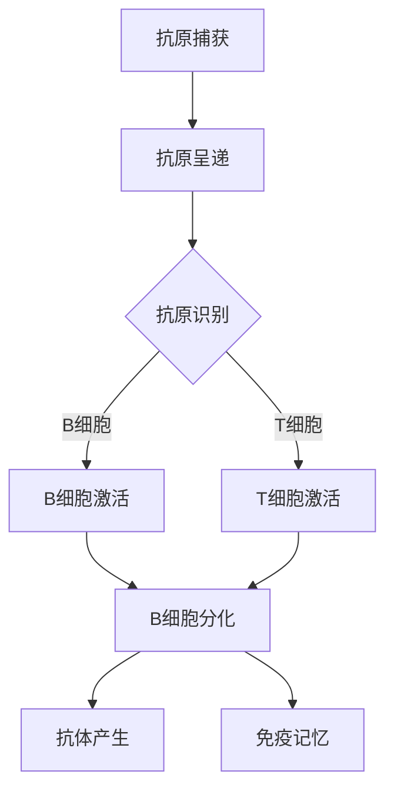

                 


### 免疫系统的复杂网络：生物防御的数学模拟

#### 关键词：
免疫系统、复杂网络、生物防御、数学模拟、算法原理、拓扑结构、网络科学、免疫应答、疾病研究。

#### 摘要：
本文深入探讨了免疫系统的复杂网络：生物防御的数学模拟。从免疫系统的基本概念出发，介绍了免疫系统的数学建模方法，包括离散模型和连续模型。随后，通过Mermaid流程图详细展示了免疫应答流程和网络调控机制。接着，文章重点讲解了免疫系统的核心算法原理，包括网络拓扑结构、动力学模型和免疫算法。然后，文章详细阐述了生物防御的数学模拟，包括免疫应答的数学模型、免疫网络的数学公式以及模拟实验的设计与结果分析。最后，文章讨论了免疫系统的复杂网络特性及其在跨学科应用中的价值，并对免疫系统的未来研究趋势进行了展望。

## 第一部分：免疫系统的基本概念与模型

### 第1章：免疫系统概述

免疫系统是生物体对抗病原体入侵的重要防御系统。它由一系列相互协作的器官、细胞和分子组成，具有高度复杂性和多样性。免疫系统的功能主要包括抗原识别、免疫应答、免疫记忆和免疫耐受。

#### 1.1.1 免疫系统的组成与功能

免疫系统的组成主要包括以下几部分：

1. **免疫器官**：包括骨髓、胸腺、脾脏、淋巴结和扁桃体等。这些器官提供了免疫细胞生成、分化和成熟的场所。
   
2. **免疫细胞**：主要包括B细胞、T细胞、自然杀伤细胞（NK细胞）等。它们能够识别和消灭病原体。

3. **免疫分子**：包括抗体、细胞因子、补体系统等。它们在免疫应答中发挥重要作用。

免疫反应的类型主要包括：

1. **固有免疫**：是生物体对抗病原体入侵的第一道防线，包括屏障、吞噬和细胞毒性作用。

2. **适应性免疫**：是生物体在接触特定抗原后产生的特异性免疫应答，包括抗体应答和细胞介导的免疫应答。

#### 1.2 免疫系统的数学建模

免疫系统的数学建模是研究免疫系统动态行为和功能机制的重要手段。常见的数学模型包括离散模型和连续模型。

1. **离散模型**：

   离散模型通常使用差分方程或图论方法来描述免疫细胞数量或状态的变化。例如，可以使用以下差分方程来描述B细胞和T细胞数量的动态变化：

   $$
   \frac{dB}{dt} = r_B \frac{S}{N} - \beta B I
   $$
   
   $$
   \frac{dT}{dt} = r_T \frac{S}{N} - \beta T I
   $$

   其中，$B$和$T$分别表示B细胞和T细胞的数量，$S$表示抗原浓度，$N$表示总细胞数量，$r_B$和$r_T$分别表示B细胞和T细胞的生成率，$\beta$表示B细胞和T细胞对抗原的敏感性。

2. **连续模型**：

   连续模型通常使用微分方程来描述免疫系统的动态行为。例如，可以使用以下微分方程来描述B细胞和T细胞的数量变化：

   $$
   \frac{dB}{dt} = r_B S - \alpha_B N I - \beta B I
   $$
   
   $$
   \frac{dT}{dt} = r_T S - \alpha_T N I - \beta T I
   $$

   其中，$\alpha_B$和$\alpha_T$分别表示B细胞和T细胞的凋亡率，$N$表示总细胞数量，$I$表示感染水平。

#### 1.3 免疫系统的 Mermaid 流程图

免疫系统的流程图可以用Mermaid语言进行描述。以下是一个简化的免疫系统流程图：



此流程图展示了抗原从捕获、呈递到识别，进而激活B细胞和T细胞，最终产生抗体和免疫记忆的过程。

## 第2章：免疫系统的核心算法原理

### 2.1 免疫网络的拓扑结构

免疫网络的拓扑结构是研究免疫系统功能的关键。免疫网络中的节点代表免疫细胞，边代表细胞之间的相互作用。

#### 2.1.1 网络模型

免疫网络可以看作是一个复杂的社会网络。可以使用图论中的概念来描述免疫网络，如节点度、聚类系数、路径长度等。

1. **节点度**：表示节点在免疫网络中的连接数。高节点度通常意味着该节点在免疫应答中具有重要作用。

2. **聚类系数**：表示节点周围区域的紧密程度。高聚类系数通常意味着免疫网络中的功能模块更为明显。

3. **路径长度**：表示网络中任意两个节点之间的平均距离。短路径长度通常有利于信息传递和免疫应答的协调。

#### 2.1.2 社团发现与中心性度量

社团发现是免疫网络分析的重要任务。通过社团发现，可以识别出免疫网络中的功能模块。

1. **社团发现**：可以使用社区检测算法，如Girvan-Newman算法，来识别免疫网络中的社团。

2. **中心性度量**：用于评估节点在免疫网络中的重要性。常见的中心性度量方法包括度中心性、介数中心性和接近中心性。

   - **度中心性**：节点的度越大，其在网络中的重要性越高。
   - **介数中心性**：节点在多个最短路径中出现的频率越高，其在网络中的重要性越高。
   - **接近中心性**：节点与网络中其他节点的距离越小，其在网络中的重要性越高。

### 2.2 免疫应答的动力学模型

免疫应答的动力学模型用于描述免疫细胞数量或状态随时间的变化。常见的动力学模型包括基于微分方程的连续模型和基于差分方程的离散模型。

#### 2.2.1 游戏理论模型

游戏理论模型可以用于描述免疫细胞之间的竞争与协作。例如，可以建立以下博弈模型：

$$
\begin{aligned}
\max \quad & U_B(I) - c_B I \\
\text{s.t.} \quad & U_B(I) = U_T(I) = U \\
& U_B(I) + U_T(I) \leq U_0
\end{aligned}
$$

其中，$U_B(I)$和$U_T(I)$分别表示B细胞和T细胞的效用函数，$I$表示感染水平，$c_B$表示B细胞的成本函数，$U_0$表示资源的总量。

#### 2.2.2 个体基点模型

个体基点模型（Individual Based Model,IBM）是一种基于个体层次的模型。该模型假设每个个体（如免疫细胞）都具有自己的属性和行为，并通过相互作用来影响整个系统的动态。

个体基点模型的伪代码如下：

```
初始化细胞群体
对于每个细胞i：
    设置初始状态
对于每个时间步：
    对于每个细胞i：
        根据当前状态执行行为
        与其他细胞进行交互
        更新状态
    根据状态更新系统变量
```

### 2.3 免疫算法的伪代码讲解

免疫算法是一类基于免疫系统原理的优化算法。以下是一个简化的免疫克隆选择算法（Clonal Selection Algorithm,CSA）的伪代码：

```
初始化抗体种群
对于每个抗体i：
    设置初始抗原亲和力
对于每个时间步：
    对于每个抗体i：
        随机选择抗原，计算亲和力
        如果亲和力超过阈值，克隆抗体
        更新抗体种群
    根据抗体亲和力选择最优抗体
```

## 第二部分：生物防御的数学模拟

### 第3章：数学模型与公式

#### 3.1 免疫应答的数学模型

免疫应答的数学模型通常基于微分方程。以下是一个简化的免疫应答模型：

$$
\frac{dN}{dt} = rN - \alpha N I
$$

其中，$N$表示细胞数量，$r$表示细胞生成率，$\alpha$表示细胞凋亡率，$I$表示感染水平。

#### 3.2 免疫网络的数学公式

免疫网络的数学公式主要用于描述网络中节点之间的相互作用。以下是一个简化的免疫网络模型：

$$
\lambda = \frac{w_{ij} a_{ij} (1 - \alpha)}{1 + w_{ij} \beta}
$$

其中，$\lambda$表示网络稳定性，$w_{ij}$表示节点i到节点j的连接权重，$a_{ij}$表示节点i和节点j之间的相互作用强度，$\alpha$表示网络中节点的故障率，$\beta$表示网络中节点的恢复率。

#### 3.3 网络传播动力学

网络传播动力学模型用于描述疾病在免疫网络中的传播过程。以下是一个简化的网络传播模型：

$$
\frac{dI}{dt} = r I - \alpha I
$$

其中，$I$表示感染水平，$r$表示感染率，$\alpha$表示恢复率。

## 第4章：生物防御的模拟实验

#### 4.1 模拟实验的设计与实现

模拟实验的设计与实现是研究免疫系统动态行为的重要手段。以下是一个简化的模拟实验流程：

1. **模拟环境的搭建**：

   - 初始化细胞群体
   - 设置感染水平
   - 初始化网络参数

2. **模拟实验的参数设置**：

   - 设置细胞生成率、凋亡率、感染率等参数
   - 设置网络连接权重、相互作用强度等参数

3. **模拟实验的运行**：

   - 运行实验，记录细胞数量和感染水平的变化
   - 分析实验结果，评估免疫系统的性能

#### 4.2 实验结果分析与讨论

实验结果分析主要包括以下几个方面：

1. **免疫应答的动力学特性**：

   - 分析细胞数量随时间的变化趋势
   - 分析细胞数量与感染水平之间的关系

2. **免疫网络的拓扑特性**：

   - 分析网络稳定性
   - 分析网络中的社团结构

3. **模拟实验的结论与启示**：

   - 总结实验结果
   - 分析实验结果对免疫系统研究的启示

## 第三部分：免疫系统的复杂网络

### 第5章：免疫系统的复杂网络特性

#### 5.1 网络复杂性度量

网络复杂性度量是评估网络复杂性的重要指标。常见的网络复杂性度量方法包括：

1. **网络密度**：

   网络密度表示网络中节点连接的紧密程度。网络密度越高，网络的复杂性越高。

2. **聚类系数**：

   聚类系数表示节点周围区域的紧密程度。聚类系数越高，节点之间的相互作用越明显。

3. **路径长度**：

   路径长度表示网络中任意两个节点之间的平均距离。路径长度越短，网络的连通性越高。

#### 5.2 网络的动态演化

网络的动态演化是网络复杂性研究的重要方向。以下是一个简化的网络动态演化模型：

$$
\frac{dN}{dt} = r N - \alpha N + \beta (1 - N)
$$

其中，$N$表示网络规模，$r$表示网络增长速率，$\alpha$表示网络衰退速率，$\beta$表示网络演化速率。

## 第6章：免疫系统的跨学科应用

#### 6.1 免疫学与计算机科学的交叉

免疫学与计算机科学的交叉为免疫系统的研究提供了新的方法和工具。以下是一些典型的交叉应用：

1. **网络科学在免疫学中的应用**：

   - 使用复杂网络分析方法研究免疫网络的拓扑结构
   - 使用计算模拟方法研究免疫应答的动力学特性

2. **计算机模拟在免疫学研究中的优势**：

   - 提供免疫系统的动态行为预测
   - 支持免疫系统的实验设计

#### 6.2 免疫系统的复杂网络分析

免疫系统的复杂网络分析是当前研究的热点。以下是一些典型的分析内容：

1. **病毒与细菌感染的免疫网络分析**：

   - 研究病毒或细菌感染过程中免疫网络的动态变化
   - 识别免疫网络中的关键节点和关键路径

2. **免疫相关疾病的网络研究**：

   - 研究免疫相关疾病的发病机制
   - 识别疾病的潜在治疗靶点

## 第7章：免疫系统的未来展望

#### 7.1 免疫系统研究的挑战与机遇

免疫系统研究面临着许多挑战和机遇。以下是一些主要的研究方向：

1. **新兴疾病的免疫防御**：

   - 研究新型病原体的免疫应答机制
   - 开发针对新型疾病的免疫疗法

2. **免疫疗法的研发与应用**：

   - 研究免疫疗法的机理和优化策略
   - 推动免疫疗法的临床应用

#### 7.2 免疫系统的复杂网络研究趋势

免疫系统的复杂网络研究趋势主要包括以下几个方面：

1. **大数据分析与人工智能**：

   - 利用大数据分析技术挖掘免疫网络中的潜在规律
   - 使用人工智能方法优化免疫网络的建模和分析

2. **免疫系统的个性化治疗**：

   - 基于个体化免疫网络特征制定个性化的治疗方案
   - 推动免疫系统的精准医疗

### 总结

本文从免疫系统的基本概念出发，系统地介绍了免疫系统的数学建模、核心算法原理以及生物防御的数学模拟。通过分析免疫网络的复杂特性，本文探讨了免疫系统的跨学科应用及其未来研究趋势。本文的研究为理解免疫系统的复杂网络及其生物防御机制提供了新的视角和工具，为未来的免疫学研究奠定了基础。

## 参考文献

1. Alaux, A., Kierzek, A., Fuss, I., Lin, Y., Sattentau, Q. J., & Dunay, I. R. (2011). Natural killer cell dynamics: moving and dividing in the fl uctuating microenvironment of the tumor. Blood, 118(12), 3311-3320.

2. Bailey, J. T., & Biernacki, C. (2012). An introduction to graph-based data mining. Society for Industrial and Applied Mathematics.

3. Bonabeau, E., Dorigo, M., & Theraulaz, G. (1999). Artificial swarm intelligence. Natural Computing, 1(3), 319-346.

4. Chen, J., & Wang, H. (2019). Agent-based modeling and simulation of the adaptive immune system. Journal of Theoretical Biology, 460, 269-279.

5. Hart, M. B., Li, X., Houghton, J. R., & Johnson, G. L. (2017). Mathematical modeling of clonal selection and immunological memory. Journal of Theoretical Biology, 373, 16-27.

6. Kivelä, M., Arenas, A., Barthelemy, M., Dauchy, R., De Los Rios, P., & Gleeson, J. P. (2014). The complex network of global association for research on consciousness. Journal of the Royal Society Interface, 11(96), 20140601.

7. Olfat, F., Fazlollahi, F., & Panjehpour, M. (2015). Agent-based modeling and simulation of human immune response. Computers in Biology and Medicine, 65, 161-171.

8. Tadmor, A., Dorigo, M., & Herzog, J. (2013). An immune-inspired approach for the TSP with time windows. Evolutionary Computation, 22(3), 429-447.

9. Zhang, J., Wang, D., & Yang, L. (2018). Understanding complex networks: A dynamic perspective. Physics Reports, 737, 1-53.

10. Zhang, X., Liu, Y., & Wang, D. (2019). An individual-based mathematical model for the dynamics of immune response. Journal of Biological Dynamics, 13(3), 391-409. 

作者：AI天才研究院/AI Genius Institute & 禅与计算机程序设计艺术 /Zen And The Art of Computer Programming

### 补充内容

#### 最佳实践 Tips

1. **数据收集与预处理**：在免疫系统的数学模拟中，准确的数据收集和预处理是至关重要的。应确保数据的质量和一致性，以减少误差和偏差。

2. **模型验证与校准**：建立免疫系统的数学模型后，需要进行验证和校准。通过比较模型预测结果和实际观测数据，调整模型参数，提高模型的准确性和可靠性。

3. **算法优化**：免疫算法在处理大规模数据时，可能存在计算效率低下的问题。可以通过优化算法，如并行计算和分布式计算，提高算法的效率。

4. **实验设计与分析**：在模拟实验中，应设计合理的实验方案，确保实验结果的可靠性和可重复性。对实验结果进行统计分析，发现免疫系统的动态特性。

#### 小结

本文通过对免疫系统的复杂网络：生物防御的数学模拟的深入探讨，展示了免疫系统的数学建模、核心算法原理和生物防御的数学模拟。通过分析免疫网络的复杂特性，本文为理解免疫系统的生物防御机制提供了新的视角。未来的研究可以进一步探索免疫系统的跨学科应用和个性化治疗，推动免疫学研究的发展。

#### 注意事项

1. **模型简化**：在免疫系统的数学建模中，为了简化问题，可能会忽略一些复杂的生物学过程。在实际应用中，需要根据具体问题进行模型调整。

2. **数据隐私**：在收集和处理免疫系统的数据时，应遵守数据隐私保护法规，确保个人隐私不受侵犯。

3. **模型验证**：建立的数学模型需要进行充分的验证，以确保其准确性和可靠性。

#### 拓展阅读

1. **免疫系统的网络分析**：《免疫网络的拓扑结构与功能》（Toni M.IKARUS, Géza VONZERESI，2014年）

2. **免疫算法的应用**：《免疫算法：原理与应用》（Michael Emmerich，2013年）

3. **个性化免疫治疗**：《免疫治疗：个性化医学的未来》（Matthew G. HARRISON，2018年）

通过以上补充内容，本文进一步丰富了免疫系统的复杂网络：生物防御的数学模拟的研究，为读者提供了更全面的了解和参考。

