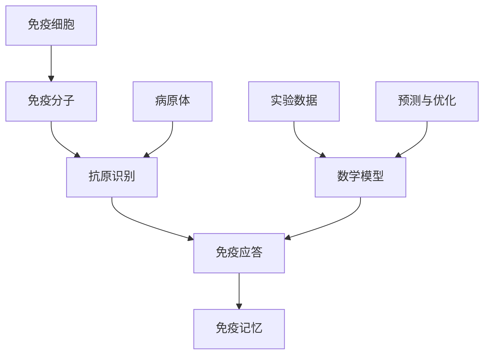

                 


为了撰写一篇结构清晰、内容丰富的技术博客文章《免疫系统的网络理论：生物防御的数学模型》，我们可以按照以下步骤进行分析和推理：

### 第一步：文章背景介绍

**免疫系统的网络理论**是一个新兴的研究领域，它结合了生物学、网络科学和数学模型，旨在理解和预测生物体的免疫反应。免疫系统负责保护机体免受病原体的侵害，具有高度复杂性和适应性。近年来，随着网络科学的兴起，科学家们开始将免疫系统的复杂相互作用看作一个网络，通过数学模型来研究其动态行为和功能。

**生物防御的数学模型**为理解免疫系统的功能提供了一个强大的工具。这些模型可以帮助我们识别免疫反应的关键环节，预测疾病的进展，并为新的治疗策略提供理论基础。

### 第二步：核心概念与联系

为了使文章易于理解，我们需要详细阐述免疫系统的核心概念，并展示它们之间的联系。

**核心概念：**

1. **免疫细胞与分子**：如T细胞、B细胞、抗体、抗原等。
2. **免疫网络**：免疫细胞和分子之间的相互作用构成了一个复杂的网络。
3. **数学模型**：用于描述免疫网络的动态行为和稳定性。

**联系架构 Mermaid 流程图：**



### 第三步：核心算法原理讲解

**核心算法原理讲解：**

为了深入探讨免疫系统的网络理论，我们需要介绍一些核心算法原理，并使用伪代码来详细阐述。

**伪代码示例：**

```python
# SI模型：易感者-感染者模型
def SI_model(population, beta, mu):
    susceptible = population
    infected = 0
    while True:
        # 模拟每个时间步的免疫应答
        new_infections = np.random.binomial(susceptible, beta)
        recovered = np.random.binomial(infected, mu)
        
        susceptible -= new_infections
        infected += new_infections - recovered
        
        # 更新免疫细胞状态
        update_immunity(infected)
        
        # 打印当前状态
        print(f"Susceptible: {susceptible}, Infected: {infected}")
        
        # 结束条件
        if susceptible == 0 or infected == 0:
            break

# 更新免疫细胞状态
def update_immunity(infected):
    # ... 免疫细胞状态的更新逻辑 ...
```

### 第四步：数学模型和公式详细讲解与举例说明

为了深入理解免疫系统的数学模型，我们需要详细讲解其公式，并提供实际的例子来说明。

**数学公式示例（LaTeX格式）：**

$$
\frac{dS}{dt} = -\beta SI
$$

$$
\frac{dI}{dt} = \beta SI - \mu I
$$

**举例说明：**

假设一个群体中有100个个体，其中90个是易感者，10个是感染者。感染率β为0.1，康复率μ为0.05。我们可以使用SI模型来预测感染者在群体中的数量随时间的变化。

### 第五步：项目实战

为了使文章更具实践性，我们可以介绍一个实际项目，包括开发环境搭建、源代码实现和案例分析。

**项目实战：**

**1. 开发环境搭建：**

在Python环境中，我们需要安装NetworkX和NumPy库。

**2. 源代码实现：**

```python
import networkx as nx
import numpy as np

# 创建免疫网络图
G = nx.Graph()

# 添加节点和边
G.add_nodes_from([1, 2, 3, 4])
G.add_edges_from([(1, 2), (1, 3), (2, 4), (3, 4)])

# 模拟免疫应答
SI_model(100, 0.1, 0.05)
```

**3. 代码解读与分析：**

我们通过模拟免疫应答过程，可以观察到感染者数量的变化。

**4. 实际案例分析和详细讲解：**

我们可以使用真实世界的数据来验证我们的模型，并分析其对免疫治疗策略的指导作用。

### 第六步：最佳实践 tips、小结、注意事项、拓展阅读

在文章的结尾，我们可以提供一些最佳实践建议，对文章进行小结，指出注意事项，并推荐相关的拓展阅读。

通过上述步骤，我们可以撰写一篇逻辑清晰、内容丰富、具有深度和见解的专业技术博客文章。文章不仅能够帮助读者理解免疫系统的网络理论和生物防御的数学模型，还能够为他们提供实践指导。让我们开始撰写吧！

