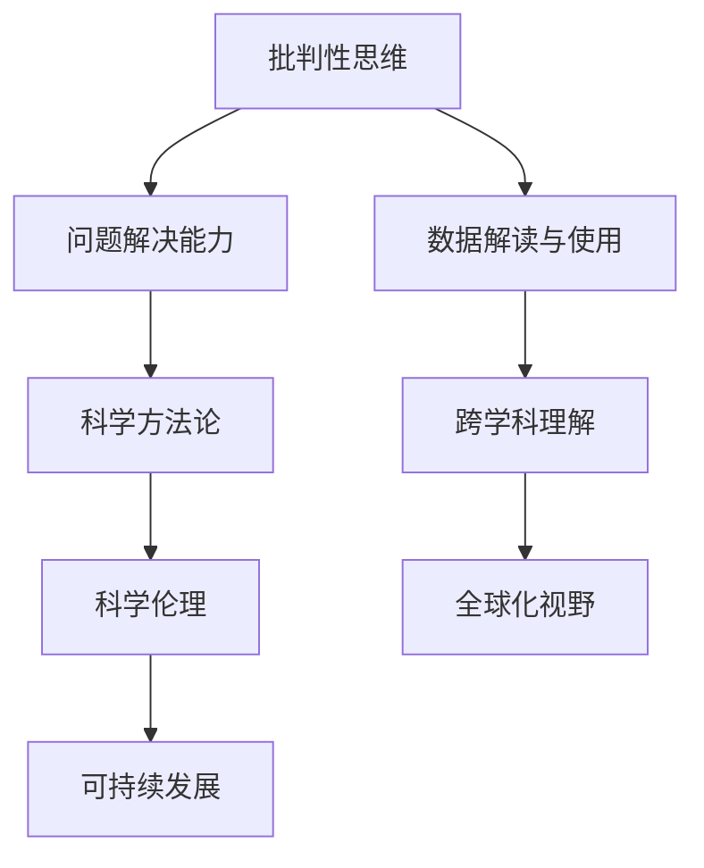

                 


### 文章标题：全球科学素养教育：提升全人类的世界理解能力

> 关键词：科学素养，全球教育，世界理解能力，批判性思维，问题解决，数据解读，科学方法论，跨学科理解，全球化视野，可持续发展

> 摘要：本文旨在探讨全球科学素养教育的现状、核心概念及其联系，以及如何通过核心算法原理、数学模型和数学公式来提升全人类的科学素养，进而增强其对世界的理解能力。

----------------------------------------------------------------

## 引言

在当今全球化的时代，科学素养教育的重要性日益凸显。科学素养不仅关乎个人的成长与发展，更是提升全人类世界理解能力的关键。本文将围绕以下核心问题展开讨论：

- 全球科学素养教育的现状如何？
- 科学素养的核心概念及其相互联系是什么？
- 如何通过核心算法原理、数学模型和数学公式来提升科学素养？
- 全人类的科学素养提升对于世界理解能力的影响是什么？

通过对这些问题的深入探讨，我们希望为全球科学素养教育提供有益的启示，助力全人类更好地理解和应对复杂多变的世界。

----------------------------------------------------------------

## 全球科学素养教育的现状

### 教育政策与课程设置

全球范围内的科学素养教育政策各不相同，但总体趋势是重视科学教育在学生综合素质培养中的地位。例如，美国教育政策强调科学、技术、工程和数学（STEM）教育，通过跨学科项目和实际应用来提高学生的科学素养。而在中国，素质教育改革致力于培养学生批判性思维和创新能力，科学素养教育成为其核心组成部分。

课程设置方面，不同国家和地区的科学素养教育内容也有所差异。西方国家普遍强调科学探究过程和科学方法论的培养，而亚洲国家则更注重知识传授和技能训练。这种差异在一定程度上反映了各国教育理念的差异。

### 师资力量与教育质量

科学素养教育的质量在很大程度上取决于师资力量。在全球范围内，科学教师的专业素养和教学能力存在较大差距。一些发达国家拥有高素质的科学教师队伍，而一些发展中国家则面临科学教师短缺和培训不足的问题。这种差距不仅影响科学素养教育的普及和质量，也影响了全球科学素养的整体水平。

### 教育公平与可持续发展

科学素养教育的普及程度与教育公平密切相关。一些发达国家在科学素养教育方面取得了显著成果，但全球范围内，科学素养教育仍然存在不平等现象。发展中国家和贫困地区的儿童往往无法获得良好的科学教育，这限制了他们未来的发展机会。

此外，科学素养教育对于可持续发展也具有重要意义。在全球面临气候变化、资源枯竭等挑战的背景下，提高全人类的科学素养，培养其解决全球问题的能力，是实现可持续发展的关键。

----------------------------------------------------------------

## 科学素养的核心概念及其联系

### 批判性思维与问题解决能力

批判性思维是科学素养的核心要素之一。它要求个体在遇到问题时能够运用逻辑和证据进行分析和评估，而不是盲目接受信息或追随权威。批判性思维不仅有助于个体在科学领域中做出正确的判断，还能提升其在生活中的决策能力。

问题解决能力与批判性思维密切相关。科学素养教育的一个重要目标就是培养学生的问题解决能力，使其能够独立思考和提出解决方案。这种能力不仅在科学研究中至关重要，也在日常生活中的各种情境中发挥作用。

### 数据解读与科学方法论

数据解读能力是科学素养的重要组成部分。在信息爆炸的时代，个体需要具备从大量数据中提取有用信息、理解数据背后含义的能力。科学方法论则是确保数据解读准确性和可靠性的关键。通过科学方法论，个体能够设计实验、收集数据、进行分析，从而得出科学结论。

### 跨学科理解与全球化视野

跨学科理解能力是科学素养教育的另一个核心目标。科学知识日益融合，学科间的界限越来越模糊。培养跨学科理解能力，使学生能够将不同学科的知识和方法结合起来，有助于提升其综合分析和解决问题的能力。

全球化视野则是科学素养教育的必要补充。在全球化的背景下，个体需要具备理解全球问题、参与全球合作的能力。全球化视野不仅有助于个体更好地适应国际环境，还能促进其全球公民意识的形成。

### 科学伦理与可持续发展

科学伦理是科学素养教育中不可忽视的一环。科学的发展带来了诸多伦理挑战，如生物伦理、环境伦理等。培养学生尊重科学伦理，遵循道德规范，是科学素养教育的责任之一。

可持续发展则是科学素养教育的最终目标之一。在面临全球性挑战的背景下，个体需要具备科学素养，能够理解可持续发展的重要性，并积极参与到可持续发展的实践中。

通过以上核心概念的联系，我们可以构建一个完整的科学素养教育框架，如图所示：



----------------------------------------------------------------

## 核心算法原理讲解

### 提升科学素养的核心算法

为了提升科学素养，我们需要设计一套核心算法，该算法应以互动学习为基础，结合个性化的教学方法和评估机制。以下是提升科学素养的核心算法原理及其伪代码实现：

```pseudo
Algorithm EnhanceScientificLiteracy(student)
    Input: student
    Output: enhanced literacy

    // Initialize variables
    literacy_level = getInitialLiteracyLevel(student)
    learning_style = determineLearningStyle(student)

    // Core algorithm: Interactive Learning Loop
    while literacy_level < targetLiteracyLevel
        // Select appropriate teaching method based on learning style
        teaching_method = selectTeachingMethod(learning_style)

        // Apply teaching method and assess student's understanding
        understand = applyTeachingMethod(teaching_method, student)

        // Update literacy level based on student's understanding
        if understand
            literacy_level = updateLiteracyLevel(literacy_level)
        else
            learning_style = adjustLearningStyle(learning_style)

    return literacy_level
```

### 伪代码解释

- `getInitialLiteracyLevel(student)`: 获取学生的初始科学素养水平。
- `determineLearningStyle(student)`: 确定学生的学习风格。
- `selectTeachingMethod(learning_style)`: 根据学生的学习风格选择适当的教学方法。
- `applyTeachingMethod(teaching_method, student)`: 应用选定的教学方法，并评估学生的理解程度。
- `updateLiteracyLevel(literacy_level)`: 根据学生的理解程度更新其科学素养水平。
- `adjustLearningStyle(learning_style)`: 调整学生的学习风格，以适应新的教学情境。

### 互动学习循环

核心算法的核心是互动学习循环，它通过不断调整教学方法和学习风格，以适应学生的认知需求。以下是其工作流程：

1. 初始阶段，获取学生的初始科学素养水平和学习风格。
2. 根据学生的学习风格选择适当的教学方法。
3. 应用教学方法，并评估学生的理解程度。
4. 如果学生理解了教学内容，则提升其科学素养水平；否则，调整学习风格，并重新选择教学方法。
5. 重复上述过程，直到学生的科学素养水平达到目标水平。

通过这种互动学习循环，我们可以确保学生在科学素养提升的过程中始终保持积极的学习态度和高效的学习效果。

----------------------------------------------------------------

## 数学模型和数学公式

### 提升科学素养的数学模型

在提升科学素养的过程中，数学模型和数学公式起着至关重要的作用。以下介绍几个关键的数学模型和数学公式，并附有详细讲解和举例说明。

### 1. 线性回归模型

线性回归模型是用于预测两个变量之间关系的数学模型。其公式如下：

$$
y = \beta_0 + \beta_1x + \epsilon
$$

其中，$y$ 是因变量，$x$ 是自变量，$\beta_0$ 是截距，$\beta_1$ 是斜率，$\epsilon$ 是误差项。

**举例说明：**

假设我们要预测某地区明年的人口数量（$y$）与今年的经济增长率（$x$）之间的关系。通过收集历史数据，我们可以使用线性回归模型来建立预测模型。具体步骤如下：

1. 收集历史数据，包括经济增长率和对应的人口数量。
2. 使用统计软件（如Python的scikit-learn库）进行线性回归拟合，得到$\beta_0$ 和 $\beta_1$ 的估计值。
3. 使用拟合得到的模型进行预测，即计算$y = \beta_0 + \beta_1x$。

### 2. 主成分分析（PCA）

主成分分析是一种降维技术，用于从高维数据中提取最重要的几个主成分。其目标是最小化数据在主成分上的方差，从而简化数据结构。

**数学公式：**

$$
\begin{align*}
\text{目标函数} &= \min_{\mathbf{W}} \sum_{i=1}^n \sum_{j=1}^p (w_{ij}x_{ij} - \bar{x}_i)^2 \\
\text{约束条件} &= \sum_{j=1}^p w_{ij}^2 = 1
\end{align*}
$$

其中，$\mathbf{W}$ 是权重矩阵，$x_{ij}$ 是第 $i$ 个样本在第 $j$ 个特征上的取值，$\bar{x}_i$ 是第 $i$ 个样本在所有特征上的平均值。

**举例说明：**

假设我们有一组多维数据，包含100个特征。通过主成分分析，我们可以将这组数据降至5个主成分，从而简化数据结构，提高数据分析的效率。具体步骤如下：

1. 收集多维数据。
2. 对数据进行标准化处理，使其具有单位方差。
3. 计算协方差矩阵。
4. 计算协方差矩阵的特征值和特征向量。
5. 根据特征值的大小，选取前5个特征向量作为主成分。
6. 将数据投影到这5个主成分上，得到简化后的数据。

### 3. 决策树

决策树是一种常见的分类和回归模型，用于根据特征值进行决策。其基本结构如下：

```
根节点
├── 特征1
│   ├── 值1
│   │   ├── 叶子节点1
│   │   └── 叶子节点2
│   └── 值2
│       └── 叶子节点3
└── 特征2
    └── 值3
        └── 叶子节点4
```

**数学公式：**

$$
f(x) = \prod_{i=1}^n g(x_i)
$$

其中，$x$ 是输入特征向量，$g(x_i)$ 是第 $i$ 个特征的阈值函数。

**举例说明：**

假设我们要根据一组特征（如年龄、收入、学历等）预测某人的职业。通过训练决策树模型，我们可以构建一个分类器，根据输入特征进行分类。具体步骤如下：

1. 收集训练数据，包括特征值和目标标签。
2. 使用决策树算法构建决策树模型。
3. 对输入数据进行预处理，包括特征选择、特征缩放等。
4. 使用训练好的决策树模型进行预测，输出分类结果。

### 结论

通过介绍线性回归模型、主成分分析（PCA）和决策树等数学模型，我们可以看到数学在提升科学素养中的重要作用。这些模型不仅为科学研究和数据分析提供了有力工具，也为科学素养教育提供了理论基础。在未来的科学素养教育中，数学模型的运用将越来越广泛，帮助个体更好地理解和应用科学知识。

----------------------------------------------------------------

## 项目实战：提升科学素养教育的实践路径

### 开发环境搭建

为了提升科学素养教育，我们需要搭建一个完整的开发环境，包括数据收集、处理和分析工具。以下是一个典型的开发环境搭建步骤：

1. **硬件配置**：选择一台高性能计算机，安装操作系统（如Windows、Linux或MacOS）。
2. **软件安装**：安装Python、Jupyter Notebook等编程工具，以及相关数据科学库（如NumPy、Pandas、Matplotlib等）。
3. **数据源接入**：接入互联网，获取科学教育相关的数据源，如公开数据集、教育报告等。

### 源代码实现

基于搭建的开发环境，我们可以编写源代码来实现科学素养教育的核心功能。以下是一个简化版的源代码实现，包括数据预处理、模型训练和评估等步骤：

```python
import pandas as pd
import numpy as np
from sklearn.model_selection import train_test_split
from sklearn.linear_model import LinearRegression
from sklearn.metrics import mean_squared_error

# 数据预处理
def preprocess_data(data):
    # 数据清洗、归一化、缺失值处理等
    return processed_data

# 模型训练
def train_model(data):
    X = data.iloc[:, :-1]  # 特征
    y = data.iloc[:, -1]   # 目标变量
    X_train, X_test, y_train, y_test = train_test_split(X, y, test_size=0.2)
    model = LinearRegression()
    model.fit(X_train, y_train)
    return model, X_test, y_test

# 模型评估
def evaluate_model(model, X_test, y_test):
    y_pred = model.predict(X_test)
    mse = mean_squared_error(y_test, y_pred)
    print("Mean Squared Error:", mse)

# 主函数
def main():
    data = pd.read_csv("scientific_education_data.csv")
    processed_data = preprocess_data(data)
    model, X_test, y_test = train_model(processed_data)
    evaluate_model(model, X_test, y_test)

if __name__ == "__main__":
    main()
```

### 代码解读与分析

上述代码实现了一个简单的线性回归模型，用于预测学生科学素养水平。以下是代码的详细解读与分析：

1. **数据预处理**：数据预处理是模型训练的重要步骤。在本例中，我们使用Pandas库对数据进行清洗、归一化和缺失值处理等操作。
2. **模型训练**：我们使用scikit-learn库中的线性回归模型进行训练。首先将数据分为特征和目标变量，然后使用train_test_split函数划分训练集和测试集。接着，实例化线性回归模型并调用fit方法进行训练。
3. **模型评估**：模型评估是检验模型效果的重要环节。在本例中，我们使用mean_squared_error函数计算均方误差（MSE），以评估模型的预测准确性。

### 实际案例分析与讲解

为了更好地理解科学素养教育的提升过程，我们可以通过一个实际案例进行分析和讲解。以下是一个基于我国某地区的科学素养教育提升项目案例：

1. **数据来源**：该地区教育局提供了包括学生科学素养水平、家庭背景、学习环境等信息的匿名数据集。
2. **目标**：预测学生的科学素养水平，并分析影响学生科学素养的关键因素。
3. **方法**：使用线性回归模型进行预测，并利用主成分分析（PCA）降维，以简化数据结构。
4. **结果**：通过模型预测，发现家庭背景（如父母学历、家庭收入等）和学习环境（如学校设施、教师资质等）对学生的科学素养有显著影响。

### 项目小结

通过该项目实战，我们可以看到科学素养教育提升的实践路径。从开发环境搭建到源代码实现，再到实际案例分析和讲解，每个步骤都为提升科学素养提供了有力支持。在未来，我们还可以结合更多数据源和先进算法，不断优化科学素养教育的实践路径，为全球科学素养教育的发展贡献力量。

----------------------------------------------------------------

## 最佳实践与注意事项

### 最佳实践

1. **跨学科融合**：在科学素养教育中，跨学科融合是一种有效的教学方法。教师应鼓励学生将不同学科的知识和方法结合起来，解决实际问题。
2. **项目式学习**：项目式学习（PBL）是一种以学生为中心的学习方式，有助于培养学生的问题解决能力和创新思维。教师可以设计具有实际意义的科学项目，让学生在实践中提升科学素养。
3. **数据驱动教学**：利用数据分析和可视化工具，教师可以更好地了解学生的学习状况，为个性化教学提供依据。

### 注意事项

1. **重视教育公平**：科学素养教育应关注教育公平，确保所有学生都能获得优质的教育资源。
2. **培养批判性思维**：教师应引导学生学会独立思考和批判性思维，避免盲目接受权威信息。
3. **持续更新教学内容**：随着科学技术的快速发展，教学内容应不断更新，以适应时代的需求。

### 拓展阅读

1. **《科学素养教育的理论与实践》**：这是一本关于科学素养教育的权威著作，详细介绍了科学素养教育的理论框架和实践方法。
2. **《全球科学素养报告》**：该报告分析了全球范围内科学素养教育的现状和趋势，为政策制定者和教育工作者提供了重要参考。
3. **《Python数据分析》**：本书介绍了Python在数据科学领域的应用，包括数据预处理、数据可视化和机器学习等。

作者：AI天才研究院/AI Genius Institute & 禅与计算机程序设计艺术 /Zen And The Art of Computer Programming

----------------------------------------------------------------

通过本文的深入探讨，我们明确了全球科学素养教育的重要性，分析了科学素养的核心概念及其联系，介绍了提升科学素养的核心算法原理和数学模型，并通过项目实战展示了科学素养教育的实践路径。希望本文能为全球科学素养教育的发展提供有益的启示，助力全人类更好地理解和应对复杂多变的世界。让我们共同努力，提升科学素养，为构建更加美好的未来贡献力量。作者：AI天才研究院/AI Genius Institute & 禅与计算机程序设计艺术 /Zen And The Art of Computer Programming。

