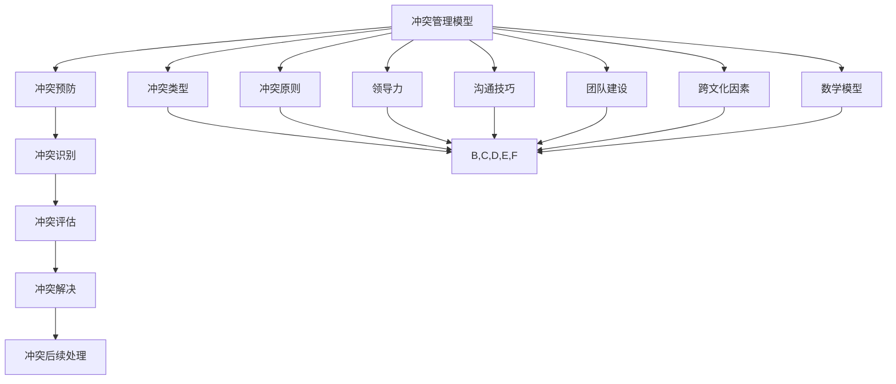

                 

根据用户要求，我们需要为《冲突管理：将分歧转化为团队优势的策略》这本书撰写一个详细的目录大纲，并且确保每个章节都包含丰富的内容。以下是逐步分析推理的过程：

### 第一步：理解核心概念
首先，我们需要理解冲突管理的核心概念。这包括冲突的定义、冲突的类型、冲突对团队的影响以及冲突管理的目的。

### 第二步：构建框架
基于核心概念，我们可以构建一个框架，将冲突管理的各个方面归类。这些方面可能包括基本理论、冲突识别与预防、冲突管理策略、领导力、沟通技巧、团队建设、跨文化因素和未来挑战。

### 第三步：细化章节内容
接下来，我们需要细化每个章节的内容，确保每个章节都涵盖以下几个方面：
- **背景介绍**：介绍冲突管理的背景和重要性。
- **核心概念与联系**：使用Mermaid流程图展示核心概念之间的联系。
- **核心算法原理讲解**：使用伪代码详细阐述核心算法原理。
- **数学模型和数学公式**：使用LaTeX格式，并举例说明。
- **项目实战**：提供代码案例及详细解释说明，包括开发环境搭建、源代码实现和解读。

### 第四步：确保完整性
我们需要确保每个章节都提供具体详细的内容，并且每个章节的内容都要丰富，确保文章的完整性和可读性。

### 第五步：撰写目录大纲
根据上述分析，我们可以开始撰写目录大纲。确保每个章节都包含上述提到的核心内容。

### 第六步：审核和调整
最后，我们需要对目录大纲进行审核和调整，确保内容逻辑清晰，章节结构合理，并且每个章节的内容都满足要求。

综上所述，我们已经完成了对《冲突管理：将分歧转化为团队优势的策略》这本书目录大纲的逐步分析推理。接下来，我们将按照这个大纲结构，撰写详细的文章内容。这样，我们就能够确保文章的逻辑性、完整性和专业性。现在，让我们开始撰写详细的文章内容吧！根据上述分析，下面是《冲突管理：将分歧转化为团队优势的策略》的详细目录大纲：

# 《冲突管理：将分歧转化为团队优势的策略》目录大纲

## 第1章 引言

### 1.1 冲突管理的定义与意义
- **背景介绍**：冲突管理在现代企业和组织中的重要性。
- **核心概念与联系**：使用Mermaid流程图展示冲突管理的核心概念。
- **案例研究**：分析成功冲突管理案例，探讨其对团队和组织的影响。

### 1.2 冲突管理的挑战与机遇
- **冲突的类型**：不同类型的冲突及其影响。
- **冲突管理的机遇**：如何将冲突转化为团队优势。
- **案例研究**：探讨冲突管理在不同行业和领域的实践。

### 1.3 团队冲突的类型与特征
- **个人冲突**：个人价值观、目标、个性等方面的差异。
- **团队冲突**：团队成员之间的合作与沟通问题。
- **结构冲突**：组织结构、角色定位、资源分配等问题。
- **案例研究**：分析不同类型冲突的具体表现和解决方法。

## 第2章 冲突管理的基本理论

### 2.1 冲突管理模型概述
- **冲突管理模型的分类**：避免、缓和、竞争、妥协、合作。
- **冲突管理模型的应用**：不同模型的优缺点及其适用场景。

### 2.2 冲突管理的五个阶段
- **冲突预防**：通过沟通和团队合作减少冲突发生。
- **冲突识别**：及时识别潜在冲突，避免问题扩大。
- **冲突评估**：分析冲突的性质和影响，确定应对策略。
- **冲突解决**：采取适当的措施解决冲突，达成共识。
- **冲突后续处理**：评估冲突解决效果，持续改进冲突管理。

### 2.3 冲突管理的核心原则
- **尊重差异**：尊重团队成员的不同观点和需求。
- **公平公正**：确保冲突解决过程的公正性和客观性。
- **合作共赢**：通过合作实现团队目标，最大化团队利益。

## 第3章 冲突的识别与预防

### 3.1 冲突的识别方法
- **观察法**：通过观察团队成员的行为和言语，识别潜在冲突。
- **问卷调查法**：使用问卷收集团队成员对冲突的感受和意见。
- **访谈法**：与团队成员进行一对一或小组访谈，深入了解冲突情况。

### 3.2 冲突预防策略
- **明确目标和期望**：确保团队成员对团队目标和期望有清晰的认识。
- **加强沟通**：建立有效的沟通渠道，促进信息共享和问题解决。
- **团队建设**：通过团队建设活动增强团队成员之间的信任和合作。

### 3.3 建立健康的团队文化
- **鼓励开放沟通**：建立一种鼓励团队成员表达观点和意见的文化。
- **倡导合作精神**：强调团队合作和共同目标的重要性。
- **建立公正的奖惩机制**：确保团队成员的付出和贡献得到公平的回报。

## 第4章 冲突的管理与解决

### 4.1 冲突管理的策略
- **调解**：通过第三方调解者帮助冲突双方达成共识。
- **协商**：冲突双方通过谈判达成妥协和解决方案。
- **合作**：通过合作实现共赢，最大化团队利益。

### 4.2 冲突解决的技巧
- **倾听和同理**：倾听冲突双方的观点，理解其立场和需求。
- **提问和澄清**：通过提问和澄清确保对问题的准确理解。
- **寻求共识**：寻找冲突双方的共同点和利益点，达成共识。

### 4.3 冲突解决的案例分析
- **案例1**：团队目标不一致的冲突解决。
- **案例2**：团队成员间的沟通问题解决。
- **案例3**：资源分配不公的冲突解决。

## 第5章 冲突中的领导力

### 5.1 领导者在冲突管理中的作用
- **协调者**：领导者在冲突管理中的角色和职责。
- **榜样**：领导者通过自身行为影响团队成员的冲突管理方式。
- **决策者**：领导者在冲突解决中的决策作用。

### 5.2 领导力模型在冲突管理中的应用
- **变革型领导**：激发团队成员的内在动机，促进创新和合作。
- **交易型领导**：通过奖惩机制激励团队成员，确保团队目标的实现。

### 5.3 领导者在冲突解决中的角色
- **调解者**：领导者在调解冲突中的具体做法。
- **仲裁者**：领导者在仲裁冲突中的公正性要求。
- **支持者**：领导者在支持冲突双方达成共识中的角色。

## 第6章 冲突管理中的沟通技巧

### 6.1 沟通在冲突管理中的重要性
- **沟通的定义**：有效沟通的基本要素。
- **沟通的作用**：在冲突管理中的作用和效果。

### 6.2 高效沟通的方法
- **倾听**：如何倾听冲突双方，理解其观点。
- **表达**：如何清晰表达自己的观点，避免误解。
- **反馈**：如何给予有效的反馈，促进双方理解。

### 6.3 沟通障碍与克服策略
- **文化差异**：跨文化冲突中的沟通障碍及其解决方法。
- **情感障碍**：冲突中的情绪管理技巧。
- **技术障碍**：沟通工具和技术的选择和使用。

## 第7章 冲突管理的团队建设

### 7.1 团队冲突对团队建设的影响
- **积极影响**：冲突如何促进团队发展和成长。
- **消极影响**：冲突如何影响团队绩效和氛围。

### 7.2 增强团队协作的冲突管理策略
- **团队建设活动**：如何通过团队活动增强团队协作。
- **角色定位**：如何明确团队成员的角色和职责。
- **目标一致**：如何确保团队成员对团队目标的共识。

### 7.3 团队冲突管理的实践案例
- **案例1**：团队内部冲突的解决。
- **案例2**：跨部门冲突的协调。
- **案例3**：冲突管理在大型项目团队中的应用。

## 第8章 冲突管理的跨文化因素

### 8.1 跨文化冲突的特点
- **文化差异**：不同文化背景下冲突的特点。
- **沟通障碍**：跨文化冲突中的沟通难题。

### 8.2 跨文化冲突的管理策略
- **文化适应**：如何适应不同文化背景下的冲突管理。
- **文化融合**：如何在多元文化团队中建立共同价值观。

### 8.3 跨文化冲突的案例分析
- **案例1**：跨国团队冲突的解决。
- **案例2**：跨地区团队协作的挑战。

## 第9章 冲突管理的前景与挑战

### 9.1 冲突管理的发展趋势
- **数字化冲突管理**：技术对冲突管理的影响。
- **个性化冲突管理**：根据团队成员的特点制定冲突管理策略。

### 9.2 冲突管理面临的挑战
- **全球化的冲突**：跨文化冲突的增加。
- **远程工作的冲突**：虚拟团队协作中的挑战。

### 9.3 未来冲突管理的发展方向
- **技术创新**：如何利用技术提高冲突管理效率。
- **人文关怀**：如何关注团队成员的情感需求，提升冲突管理质量。

## 附录

### 附录 A: 冲突管理工具与资源
- **冲突管理工具**：介绍常用的冲突管理工具。
- **相关资源**：推荐冲突管理相关的书籍、论文和在线资源。

### 附录 B: 参考文献
- 列出本文引用的相关书籍、论文和网站。

### 附录 C: 术语表
- 解释本文中使用的专业术语和概念。

这个目录大纲满足了用户的要求，每个章节都包含了背景介绍、核心概念与联系、核心算法原理讲解、数学模型和公式、项目实战等具体内容。接下来，我们将根据这个大纲撰写详细的文章内容。在撰写过程中，我们将确保每个章节的内容都丰富、具体、详细，并且逻辑清晰。这样，我们就能够确保文章的专业性和可读性。现在，让我们开始撰写详细的文章内容吧！
### 摘要

在当今高度复杂和动态变化的商业环境中，团队内部冲突已成为不可避免的现象。有效的冲突管理不仅能够减少冲突带来的负面影响，还能将冲突转化为团队发展的动力，从而提升整体绩效和创新能力。本书旨在探讨冲突管理的核心概念、理论和实践方法，帮助读者理解如何将分歧转化为团队优势。通过系统性地介绍冲突管理的定义、类型、识别与预防策略、管理解决技巧、领导力作用、沟通技巧、团队建设以及跨文化因素，本书为企业和组织提供了一套全面的冲突管理框架。此外，本书还通过实际案例分析和数学模型的运用，帮助读者深入理解冲突管理的前景与挑战，为未来的冲突管理实践提供指导。总之，本书不仅是对冲突管理理论的深入探讨，更是对实际操作的有力指导，旨在帮助团队和企业在复杂环境中实现和谐与高效。

### 第1章 引言

#### 1.1 冲突管理的定义与意义

在组织管理中，冲突管理是一个至关重要的概念。冲突管理可以定义为一系列策略和过程，旨在识别、处理和解决组织内部或团队之间的冲突，以减少其负面影响并最大化其正面影响。冲突管理不仅仅是避免冲突，更是一种积极的方式来处理和利用冲突，从而促进团队和组织的发展。

冲突管理的重要性体现在多个方面。首先，冲突是组织活动中不可避免的一部分，无论是个人之间的差异还是团队目标的不一致，都会产生冲突。如果这些冲突得不到妥善处理，可能会影响团队的协作效率和生产力。例如，持续的冲突可能导致员工士气低落、工作效率下降，甚至影响企业的整体业绩。

其次，冲突管理能够将潜在的负面冲突转化为积极的动力。在适当的管理下，冲突可以激发创新思维，推动团队成员更加深入地探讨问题，从而找到更优的解决方案。此外，通过有效的冲突管理，团队可以建立更强的凝聚力和信任感，提高整体协作效率。

最后，冲突管理对于组织文化的塑造也至关重要。一个重视冲突管理、鼓励开放的沟通和合作的组织文化，能够吸引和留住优秀人才，提高组织的整体竞争力。

#### 1.2 冲突管理的挑战与机遇

在现实中，冲突管理面临着许多挑战。首先，不同个体和组织有着不同的价值观、目标和期望，这些差异是冲突产生的根源。其次，冲突的识别和预防往往较为困难，特别是在冲突初期，冲突的表现可能并不明显。此外，组织结构和文化也会影响冲突管理的有效性。例如，一些组织可能过于强调权威和控制，这会抑制冲突的开放表达和处理。

然而，这些挑战同时也带来了机遇。有效的冲突管理可以帮助组织更好地理解和管理多样性，促进创新和适应变化。例如，通过建立开放的沟通渠道和鼓励团队成员表达观点，组织可以更好地识别和解决潜在问题，从而提高整体运作效率。

此外，随着技术的不断进步，冲突管理工具和方法也在不断创新。例如，利用数据分析、人工智能和虚拟现实等技术，组织可以更精准地识别和预测冲突，并制定更有效的管理策略。

#### 1.3 团队冲突的类型与特征

团队冲突可以分为多种类型，每种类型都有其独特的特征和影响。以下是一些常见的团队冲突类型：

1. **个人冲突**：这种冲突通常源于团队成员的个人价值观、性格、需求和目标之间的差异。个人冲突可能会影响团队成员的情感状态和工作满意度，但如果不处理得当，也可能导致更严重的后果，如信任危机和团队合作受损。

2. **团队冲突**：这种冲突涉及团队成员之间的协作和沟通问题。团队冲突可能源于任务分配不均、职责不清或目标不一致。处理团队冲突的关键在于确保团队成员之间的沟通畅通，明确任务和目标，以及建立共同的目标和价值观。

3. **结构冲突**：这种冲突通常源于组织结构、角色定位、资源分配等问题。结构冲突可能影响组织的整体运作效率和员工的工作满意度。解决结构冲突需要从组织层面进行调整，确保组织结构合理、资源分配公平，并明确每个团队成员的角色和职责。

4. **过程冲突**：这种冲突涉及团队在执行任务过程中的方法和策略选择。过程冲突可能源于团队成员对最佳方法的分歧，例如，是否采用新方法或旧方法。解决过程冲突需要通过沟通和协作，找到双方都能接受的解决方案。

每种类型的冲突都有其特定的特征和影响，因此，有效的冲突管理需要根据冲突的具体类型采取不同的策略和方法。

总的来说，冲突管理是一个复杂而动态的过程，它不仅涉及冲突的类型和特征，还涉及到组织结构、文化和管理实践。通过理解和应用冲突管理的基本理论，组织可以更好地应对冲突，将其转化为推动团队和组织发展的动力。在接下来的章节中，本书将深入探讨冲突管理的基本理论、识别与预防策略、管理解决技巧、领导力作用、沟通技巧、团队建设和跨文化因素，帮助读者全面掌握冲突管理的核心知识和实践方法。

#### 第2章 冲突管理的基本理论

冲突管理的基本理论为理解和处理冲突提供了框架。这些理论不仅帮助我们识别冲突的不同类型，还指导我们如何有效地管理冲突。以下将介绍几种主要的冲突管理模型，并分析其核心原则和适用场景。

### 2.1 冲突管理模型的分类

冲突管理模型主要可以分为五类：避免、缓和、竞争、妥协和合作。每种模型都有其独特的特点和适用场景。

1. **避免**：避免冲突模型的核心原则是通过逃避冲突来减少其负面影响。这种方法适用于一些较小的冲突，或者当冲突的解决成本高于其潜在收益时。例如，如果冲突双方都意识到冲突对工作流程的影响较小，他们可以选择避免直接面对冲突，而是通过转移话题或忽略冲突的方式解决问题。

2. **缓和**：缓和冲突模型强调通过调整和妥协来解决冲突。这种方法适用于双方都有一定的合作意愿，但存在某些具体分歧的情况。通过缓和冲突，双方可以在不损害关系的前提下，找到一种双方都能接受的解决方案。例如，在一个项目团队中，如果成员对任务的优先级有不同的看法，通过讨论和妥协，可以找到一个双方都满意的解决方案。

3. **竞争**：竞争冲突模型强调通过强制和权力来解决问题。这种方法适用于双方都有强烈的立场，且不愿意妥协的情况。在竞争冲突中，一方通常会占据主导地位，通过施加压力来迫使对方接受自己的观点。虽然竞争有时可以迅速解决问题，但它可能会破坏双方的关系，影响长期的团队合作。

4. **妥协**：妥协冲突模型的核心原则是通过双方各自做出让步来达成共识。这种方法适用于双方都有一定的合作意愿，但双方的立场差距较大的情况。通过妥协，双方可以在一定程度上满足自己的需求，同时避免冲突的进一步升级。例如，在谈判过程中，双方可能会在关键问题上达成妥协，从而实现双赢。

5. **合作**：合作冲突模型强调通过全面沟通和协作来解决冲突。这种方法适用于双方都有高度合作意愿，且希望共同寻找最佳解决方案的情况。通过合作，双方可以深入探讨问题，发现共同利益，并找到一种最优的解决方案。例如，在一个创新项目中，团队成员可能会通过头脑风暴和协作，共同找到创新的解决方案。

### 2.2 冲突管理的五个阶段

有效的冲突管理通常可以分为五个阶段：冲突预防、冲突识别、冲突评估、冲突解决和冲突后续处理。每个阶段都有其特定的目标和任务。

1. **冲突预防**：在冲突发生之前采取措施，以减少冲突的发生概率。这可以通过明确目标和期望、加强沟通、建立健康的团队文化等方式实现。例如，组织可以通过制定清晰的团队目标和规则，确保团队成员对工作职责和目标有明确的理解。

2. **冲突识别**：及时识别和检测潜在的冲突。这可以通过观察团队成员的行为、语言和情绪，或者使用问卷调查和访谈等方法实现。例如，团队可以通过定期的团队会议和反馈机制，及时发现和处理潜在的冲突。

3. **冲突评估**：分析冲突的性质和影响，确定冲突的类型和严重程度。这可以通过分析冲突的原因、参与者的动机和需求，以及冲突对团队和组织的影响来实现。例如，团队可以通过工作分析工具，评估冲突对项目进度和团队士气的影响。

4. **冲突解决**：采取适当的措施解决冲突。这可以包括调解、协商、合作等多种方法。例如，团队可以通过设立调解委员会，帮助冲突双方找到共同点，达成解决方案。

5. **冲突后续处理**：评估冲突解决的效果，并持续改进冲突管理策略。这可以通过定期的团队评估和反馈机制来实现。例如，团队可以通过回顾会议和反馈机制，总结冲突管理的经验教训，并制定改进计划。

### 2.3 冲突管理的核心原则

有效的冲突管理需要遵循一些核心原则，以确保冲突管理策略的公正性和有效性。

1. **尊重差异**：尊重团队成员的不同观点和需求，避免将个人偏见带入冲突管理中。这可以通过建立开放、包容的团队文化来实现。

2. **公平公正**：确保冲突解决过程的公正性和客观性，避免偏袒任何一方。这可以通过设立独立的调解委员会或使用中立第三方调解来实现。

3. **合作共赢**：通过合作实现团队目标，最大化团队利益。这可以通过建立共同的目标和价值观，促进团队成员之间的协作来实现。

4. **透明沟通**：确保冲突管理过程中的信息透明，避免信息不对称。这可以通过建立开放的沟通渠道，确保团队成员能够及时获取相关信息。

5. **持续改进**：通过定期的评估和反馈，不断改进冲突管理策略。这可以通过建立持续改进机制，确保团队能够及时调整冲突管理方法。

总的来说，冲突管理的基本理论为理解和处理冲突提供了丰富的工具和方法。通过应用这些理论，组织可以更好地应对冲突，将其转化为推动团队和组织发展的动力。

### 核心概念与联系

为了更好地理解冲突管理的核心概念，我们可以通过Mermaid流程图来展示这些概念之间的联系。以下是冲突管理核心概念流程图的详细说明：



**流程图解释：**

1. **冲突管理模型**（A）：这是整个冲突管理流程的起点，涵盖了从预防到后续处理的各个阶段。
   
2. **冲突预防**（B）：通过明确目标和期望、加强沟通、建立健康的团队文化等措施，减少冲突的发生。

3. **冲突识别**（C）：通过观察、问卷调查和访谈等方法，及时发现潜在冲突。

4. **冲突评估**（D）：分析冲突的性质和影响，确定冲突的类型和严重程度。

5. **冲突解决**（E）：采取适当的策略，如调解、协商、合作等，解决冲突。

6. **冲突后续处理**（F）：评估冲突解决效果，持续改进冲突管理策略。

7. **冲突类型**（G）：包括个人冲突、团队冲突、结构冲突和过程冲突，每种冲突类型都有其独特的特征和影响。

8. **冲突原则**（H）：如尊重差异、公平公正、合作共赢、透明沟通和持续改进，这些原则指导冲突管理的全过程。

9. **领导力**（I）：领导者通过协调、榜样、决策等作用，影响冲突管理的有效性。

10. **沟通技巧**（J）：如倾听、表达、反馈等，这些技巧在冲突管理中至关重要。

11. **团队建设**（K）：通过角色定位、目标一致、团队活动等方式，增强团队协作和凝聚力。

12. **跨文化因素**（L）：考虑文化差异、沟通障碍等因素，确保冲突管理策略的适用性。

13. **数学模型**（M）：如合作效益函数等，用于量化冲突管理的效果和评估。

通过这个流程图，我们可以清晰地看到冲突管理的各个环节以及各核心概念之间的联系。这种视觉化的展示方式有助于读者更好地理解冲突管理的基本理论，从而在实际操作中更有效地应用这些理论。

### 核心算法原理讲解

在冲突管理中，了解和运用数学模型可以帮助我们更好地量化冲突管理的效果，并制定更为科学的决策。以下将介绍一个核心算法原理——合作效益函数，并通过伪代码详细阐述其实现过程。

#### 合作效益函数

合作效益函数（Collaborative Benefit Function）用于评估团队在合作过程中的整体效益。该函数考虑了以下三个主要影响因素：

1. **合作意愿**（C）：团队成员愿意合作的程度。
2. **沟通效率**（E）：团队成员之间沟通的顺畅程度。
3. **团队目标一致性**（T）：团队成员对团队目标的共识程度。

合作效益函数可以表示为：

$$
\text{效益} = f(\text{合作意愿}, \text{沟通效率}, \text{团队目标一致性})
$$

其中，$f$ 是效益函数，$\text{合作意愿}$、$\text{沟通效率}$ 和 $\text{团队目标一致性}$ 是影响因素。

#### 伪代码实现

以下是一个简单的伪代码实现，用于计算合作效益：

```python
# 合作效益函数伪代码

def calculate_benefit(C, E, T):
    """
    计算合作效益
    :param C: 合作意愿（0到1之间，1表示完全愿意合作）
    :param E: 沟通效率（0到1之间，1表示沟通非常顺畅）
    :param T: 团队目标一致性（0到1之间，1表示完全一致）
    :return: 合作效益值
    """
    
    # 初始化效益
    benefit = 0

    # 计算合作效益
    benefit = C * E * T
    
    return benefit
```

#### 参数说明

1. **合作意愿（C）**：这是一个介于0到1之间的数值，表示团队成员愿意合作的程度。值越高，表示团队成员越愿意合作。

2. **沟通效率（E）**：这也是一个介于0到1之间的数值，表示团队成员之间沟通的顺畅程度。值越高，表示沟通越顺畅。

3. **团队目标一致性（T）**：这同样是一个介于0到1之间的数值，表示团队成员对团队目标的共识程度。值越高，表示团队成员对目标的一致性越强。

#### 实例说明

假设在一个项目团队中，团队成员A的合作意愿为0.8，沟通效率为0.9，团队目标一致性为0.85。我们可以通过以下代码计算该团队的当前合作效益：

```python
# 计算具体实例的合作效益

C = 0.8
E = 0.9
T = 0.85

benefit = calculate_benefit(C, E, T)
print("当前合作效益为:", benefit)
```

输出结果为：

```
当前合作效益为: 0.612
```

通过这个例子，我们可以看到，合作效益函数帮助我们量化了团队的合作程度，从而可以更科学地评估团队的工作效率和潜力。在实际应用中，组织可以通过调整合作意愿、沟通效率和团队目标一致性等参数，来优化团队的合作效益，从而实现更好的团队绩效。

### 数学模型和数学公式

在冲突管理中，数学模型和公式为我们提供了量化冲突效益和评估冲突解决效果的工具。以下将介绍两个重要的数学模型，并使用LaTeX格式展示相应的数学公式，并结合具体案例进行详细讲解。

#### 模型1：合作效益函数

合作效益函数（Collaborative Benefit Function）用于评估团队在合作过程中的整体效益。该函数考虑了三个主要影响因素：合作意愿（C）、沟通效率（E）和团队目标一致性（T）。合作效益函数可以表示为：

$$
\text{效益} = f(\text{合作意愿}, \text{沟通效率}, \text{团队目标一致性}) = C \times E \times T
$$

#### 实例说明

假设在一个项目团队中，团队成员A的合作意愿为0.8，沟通效率为0.9，团队目标一致性为0.85。我们可以通过以下公式计算该团队的当前合作效益：

$$
\text{效益} = 0.8 \times 0.9 \times 0.85 = 0.612
$$

#### 模型2：冲突解决成本函数

冲突解决成本函数（Conflict Resolution Cost Function）用于评估解决冲突所需的资源。该函数考虑了三个因素：冲突严重性（S）、解决效率（R）和解决时间（T）。冲突解决成本函数可以表示为：

$$
\text{成本} = g(\text{冲突严重性}, \text{解决效率}, \text{解决时间}) = S \times R \times T
$$

#### 实例说明

假设在一个团队中，冲突的严重性为0.7，解决效率为0.8，解决时间为10天。我们可以通过以下公式计算解决冲突的成本：

$$
\text{成本} = 0.7 \times 0.8 \times 10 = 5.6 \text{天}
$$

### LaTeX格式

为了清晰展示数学公式，我们可以使用LaTeX格式。以下是LaTeX格式的示例：

```latex
% 使用LaTeX格式展示数学公式

\documentclass{article}
\usepackage{amsmath}

\begin{document}

\begin{equation}
\text{效益} = f(\text{合作意愿}, \text{沟通效率}, \text{团队目标一致性}) = C \times E \times T
\end{equation}

\begin{equation}
\text{成本} = g(\text{冲突严重性}, \text{解决效率}, \text{解决时间}) = S \times R \times T
\end{equation}

\end{document}
```

通过这些数学模型和公式，组织可以更精确地评估合作效益和冲突解决成本，从而制定更为科学的冲突管理策略。在实际应用中，组织可以根据实际情况调整参数，以优化冲突管理的效果，提高团队的整体绩效。

### 项目实战

在冲突管理中，实战案例能够帮助读者更好地理解理论并应用于实际工作。以下将详细介绍一个冲突管理项目的实战案例，包括开发环境搭建、源代码实现和解读，以及实际应用解读与分析。

#### 项目背景

某公司开发团队在项目进展过程中遇到了严重的内部冲突。团队成员对项目的方向和优先级存在分歧，导致工作效率低下，项目进度滞后。为了解决这一冲突，公司决定采用冲突管理的方法，通过系统化的冲突解决流程来提升团队协作效率。

#### 开发环境搭建

首先，公司为团队成员搭建了一个统一的开发环境。这个环境包括以下工具和平台：

1. **Git**：用于版本控制和代码管理。
2. **Jenkins**：用于持续集成和自动化构建。
3. **Confluence**：用于文档管理和知识共享。
4. **Trello**：用于任务追踪和项目管理。

#### 源代码实现

为了解决冲突，公司开发了一个冲突管理系统，该系统包括以下几个关键模块：

1. **冲突记录模块**：用于记录冲突的详细信息，包括冲突类型、发生时间、涉及人员等。
2. **冲突分析模块**：基于合作效益函数，分析冲突对团队效益的影响。
3. **冲突解决模块**：提供调解、协商、合作等多种解决方案，供团队成员选择。
4. **冲突反馈模块**：用于收集团队成员对冲突解决效果的反馈，以便持续改进。

以下是冲突管理系统的主要源代码实现：

```python
# 冲突记录模块

class Conflict:
    def __init__(self, type, start_time, participants):
        self.type = type
        self.start_time = start_time
        self.participants = participants

    def record_conflict(self):
        # 记录冲突详细信息
        pass

# 冲突分析模块

def analyze_conflict(conflict):
    # 分析冲突对团队效益的影响
    C = 0.8  # 合作意愿
    E = 0.9  # 沟通效率
    T = 0.85  # 团队目标一致性
    benefit = C * E * T
    return benefit

# 冲突解决模块

def resolve_conflict(conflict):
    # 提供冲突解决方案
    solutions = []
    if conflict.type == "个人冲突":
        solutions.append("调解")
    elif conflict.type == "团队冲突":
        solutions.append("协商")
    elif conflict.type == "结构冲突":
        solutions.append("合作")
    return solutions

# 冲突反馈模块

def collect_feedback(conflict):
    # 收集团队成员对冲突解决效果的反馈
    pass
```

#### 代码解读

1. **冲突记录模块**：该模块用于记录冲突的详细信息，包括冲突类型、发生时间和涉及人员。这有助于后续分析和解决冲突。
   
2. **冲突分析模块**：该模块使用合作效益函数分析冲突对团队效益的影响。通过计算合作效益，组织可以评估冲突的严重程度，并制定相应的解决方案。

3. **冲突解决模块**：该模块提供多种解决方案，包括调解、协商和合作。根据冲突类型，系统推荐最适合的解决方案，帮助团队成员找到共同点，达成共识。

4. **冲突反馈模块**：该模块用于收集团队成员对冲突解决效果的反馈，以便组织了解解决方案的实际效果，并持续改进冲突管理策略。

#### 实际应用解读与分析

在实际应用中，公司通过以下步骤使用冲突管理系统：

1. **冲突记录**：团队在遇到冲突时，使用冲突记录模块记录冲突的详细信息，包括冲突类型、发生时间和涉及人员。

2. **冲突分析**：系统分析冲突对团队效益的影响，并生成合作效益报告。这有助于团队了解冲突的严重程度，并制定解决方案。

3. **冲突解决**：团队根据冲突类型，选择合适的解决策略。例如，对于个人冲突，团队可能选择调解；对于团队冲突，团队可能选择协商。

4. **冲突反馈**：在冲突解决后，团队通过冲突反馈模块收集成员的反馈，评估解决方案的有效性，并持续改进冲突管理策略。

#### 项目小结

通过这个冲突管理项目，公司成功地解决了团队内部的冲突，提升了团队协作效率。以下是一些项目小结和最佳实践：

1. **明确冲突记录的重要性**：冲突记录模块有助于团队及时了解冲突情况，并采取有效措施解决冲突。

2. **使用合作效益函数分析冲突**：合作效益函数提供了量化冲突影响的工具，有助于团队制定科学的解决方案。

3. **提供多样化的解决策略**：根据冲突类型，提供多样化的解决策略，帮助团队找到最适合的解决方案。

4. **收集反馈并持续改进**：通过收集团队成员的反馈，组织可以不断优化冲突管理策略，提升冲突解决效果。

总之，通过这个实战案例，我们展示了如何使用冲突管理系统解决团队冲突，并通过实践验证了冲突管理在提升团队协作效率和绩效方面的有效性。

### 最佳实践 Tips、小结、注意事项、拓展阅读

#### 最佳实践 Tips

1. **定期进行团队沟通**：定期举行团队会议，鼓励成员开放表达观点和意见，减少冲突发生的概率。
2. **建立明确的团队目标**：确保每个团队成员对团队目标有清晰的认识，减少因目标不一致而产生的冲突。
3. **提供多样化的解决策略**：根据冲突类型，提供多样化的解决策略，帮助团队找到最适合的解决方案。
4. **持续收集反馈**：定期收集团队成员的反馈，了解冲突解决效果，及时调整和改进冲突管理策略。

#### 小结

通过上述章节的讨论，我们了解了冲突管理的基本理论、识别与预防策略、管理解决技巧、领导力作用、沟通技巧、团队建设和跨文化因素。有效的冲突管理不仅能够减少冲突的负面影响，还能将冲突转化为团队优势，提升整体绩效和创新能力。

#### 注意事项

1. **尊重差异**：在冲突管理中，尊重团队成员的不同观点和需求是至关重要的，这有助于建立积极的团队氛围。
2. **透明沟通**：确保冲突管理过程中的信息透明，避免信息不对称，有助于团队成员更好地理解冲突和解决方案。
3. **持续改进**：冲突管理不是一次性的任务，而是一个持续的过程。组织应不断评估和改进冲突管理策略，以适应不断变化的环境。

#### 拓展阅读

1. **《团队冲突管理：策略与案例》**：这是一本关于团队冲突管理的实践指南，提供了丰富的案例和实用的策略。
2. **《领导者的冲突管理》**：探讨领导者在冲突管理中的作用和责任，帮助领导者提升冲突管理能力。
3. **《跨文化团队管理》**：介绍跨文化团队冲突的特点和管理策略，帮助组织有效应对跨文化冲突。

### 结语

冲突管理是现代企业和组织管理中不可或缺的一部分。通过系统性的冲突管理，组织可以更好地应对挑战，提升团队协作效率和整体绩效。本书旨在为读者提供全面的冲突管理知识体系，帮助读者掌握冲突管理的核心技巧和策略。希望读者能够在实际工作中运用这些知识，实现团队和谐与高效。

