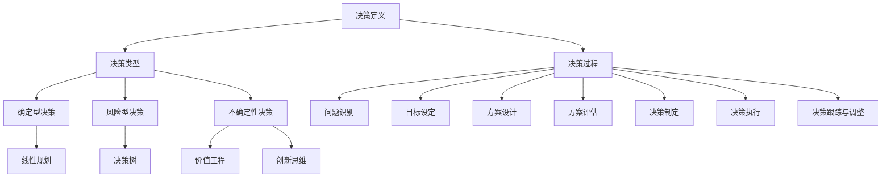

                 

### 文章标题

《决策制定：科学决策的方法与流程》

> 关键词：科学决策、决策方法、决策流程、定量决策、定性决策、线性规划、决策树

> 摘要：本文深入探讨了科学决策的方法与流程，涵盖了决策的定义、类型、制定过程、定量与定性决策方法、以及实际应用案例。通过详细解析核心概念与算法原理，并结合项目实战，为读者提供了实用的决策制定指导。

## 设计《决策制定：科学决策的方法与流程》的目录大纲

### 第一部分：决策基础

#### 第1章：决策概述

- **1.1 决策的定义与类型**
  - 决策的定义
  - 确定型决策、风险型决策、不确定性决策

- **1.2 决策制定的基本概念**
  - 决策制定的过程
  - 决策制定的原则
  - 决策制定的要素

### 第二部分：科学决策的方法

#### 第2章：定量决策方法

- **2.1 线性规划**
  - 线性规划的基本概念
  - 线性规划模型的建立
  - 线性规划的求解方法

- **2.2 决策树**
  - 决策树的基本概念
  - 决策树的分析与计算

#### 第3章：定性决策方法

- **3.1 价值工程**
  - 价值工程的基本概念
  - 价值工程的实施步骤

- **3.2 创新思维**
  - 创新思维的基本概念
  - 创新思维的方法与应用

### 第三部分：决策制定的过程

#### 第4章：问题识别与目标设定

- **4.1 问题识别**
  - 问题识别的方法
  - 问题分类

- **4.2 目标设定**
  - 目标设定的原则
  - 目标优化的方法

#### 第5章：方案设计与评估

- **5.1 方案设计**
  - 方案设计的方法
  - 方案优化的技巧

- **5.2 方案评估**
  - 方案评估的方法
  - 方案选择的策略

#### 第6章：决策制定与执行

- **6.1 决策制定**
  - 决策制定的流程
  - 决策制定的影响因素

- **6.2 决策执行**
  - 决策执行的步骤
  - 决策执行的挑战与应对

- **6.3 决策跟踪与调整**
  - 决策跟踪的方法
  - 决策调整的策略

### 第四部分：决策制定的实践应用

#### 第7章：项目管理中的决策制定

- **7.1 项目管理概述**
  - 项目管理的定义
  - 项目管理的流程

- **7.2 项目决策的特点**
  - 项目决策的挑战
  - 项目决策的方法

#### 第8章：企业运营中的决策制定

- **8.1 企业运营概述**
  - 企业运营的目标
  - 企业运营的流程

- **8.2 企业决策的特点**
  - 企业决策的挑战
  - 企业决策的方法

### 第五部分：案例分析

#### 第9章：科学决策案例解析

- **9.1 案例一：产品定价决策**
  - 案例背景
  - 案例分析

- **9.2 案例二：市场进入决策**
  - 案例背景
  - 案例分析

- **9.3 案例三：人力资源管理决策**
  - 案例背景
  - 案例分析

### 附录

#### 第10章：决策制定工具与资源

- **10.1 决策制定工具介绍**
  - 常用的决策制定工具

- **10.2 决策制定资源推荐**
  - 推荐的书籍、论文与网站资源

---

**核心概念与联系：**

在本文中，我们将详细探讨决策的定义、类型、过程、方法与实践，重点阐述定量决策方法（如线性规划、决策树）与定性决策方法（如价值工程、创新思维）的对比与应用。以下是核心概念与联系的关系架构图：



通过上述架构图，我们可以清晰地看到决策的核心概念及其相互之间的关系，这为后续内容的详细讲解提供了结构基础。

---

**核心算法原理讲解：**

在定量决策方法中，线性规划和决策树是两种常用的方法。以下是这两种方法的算法原理及伪代码：

#### 线性规划

**基本概念：** 线性规划是一种数学方法，用于在满足一系列线性约束条件的情况下，求解线性目标函数的最优解。

**伪代码：**

```python
线性规划模型求解步骤：
1. 定义目标函数：C = a1x1 + a2x2 + ... + anxn
2. 定义约束条件：G1x + H1 = b1, G2x + H2 = b2, ..., Gn x + Hn = bn
3. 求解目标函数的最优解，使得目标函数值最大或最小
4. 输出最优解

伪代码：
```
$$
\begin{aligned}
\min\limits_{x} & \quad c^T x \\
s.t. & \quad A x \leq b \\
x & \geq 0
\end{aligned}
$$
```

#### 决策树

**基本概念：** 决策树是一种树形结构，用于显示决策过程及其结果，每个节点代表一个决策或结果，每个分支代表一种可能的行动方案。

**伪代码：**

```python
决策树分析步骤：
1. 确定决策树根节点，通常为初始状态或问题定义
2. 为每个节点计算期望值或概率
3. 根据期望值或概率选择最优路径
4. 输出决策树的最优路径

伪代码：
```
$$
\begin{aligned}
\text{决策树建立：} \\
& \text{初始化根节点R，设R为初始状态} \\
& \text{对于每个状态S} \\
& \quad \text{计算S的期望值或概率} \\
& \quad \text{选择期望值或概率最大的状态作为下一个节点} \\
& \quad \text{连接S和下一个节点} \\
\text{决策树求解：} \\
& \text{从根节点开始遍历决策树} \\
& \quad \text{对于每个节点N} \\
& \quad \quad \text{计算N的期望值或概率} \\
& \quad \quad \text{更新N的父节点路径} \\
& \quad \text{选择最优路径作为决策结果} \\
\end{aligned}
$$
```

通过上述伪代码，我们可以清晰地看到线性规划和决策树的核心算法原理，这为后续内容的详细讲解和实际应用提供了基础。

---

**数学模型和数学公式**

**线性规划模型：**

$$
\begin{aligned}
\min\limits_{x} & \quad c^T x \\
s.t. & \quad A x \leq b \\
x & \geq 0
\end{aligned}
$$

其中，$c$ 是目标函数的系数向量，$x$ 是决策变量向量，$A$ 是约束条件的系数矩阵，$b$ 是约束条件的常数向量。

**决策树模型：**

$$
\begin{aligned}
\text{期望值计算：} \\
& \text{对于节点N，期望值} \\
& \quad E(N) = \sum_{i=1}^{n} p_i \cdot v_i \\
\text{概率计算：} \\
& \text{对于节点N，概率} \\
& \quad P(N) = \frac{\text{有利结果数}}{\text{总结果数}}
\end{aligned}
$$

其中，$p_i$ 是第$i$种结果的概率，$v_i$ 是第$i$种结果的价值。

通过上述数学模型和公式，我们可以对线性规划和决策树进行定量分析，从而为决策提供科学依据。

---

**项目实战**

**项目管理中的决策制定**

**开发环境搭建：** 在本案例中，我们将使用Python进行项目管理中的决策制定。需要安装Python和相关的库，如NumPy和Pandas。

```shell
pip install numpy pandas
```

**源代码实现：**

```python
import numpy as np
import pandas as pd

# 定义线性规划模型
c = np.array([1, 2])  # 目标函数的系数向量
A = np.array([[2, 1], [1, 2]])  # 约束条件的系数矩阵
b = np.array([4, 2])  # 约束条件的常数向量

# 求解线性规划模型
x = np.linalg.solve(A, b)
print("最优解：", x)

# 定义决策树模型
def decision_tree(node, p, v):
    if node == "end":
        return v
    else:
        return p * decision_tree(node + 1, p, v)

# 计算决策树的期望值
p = np.array([0.4, 0.6])  # 概率向量
v = np.array([10, 20])  # 价值向量
print("决策树期望值：", decision_tree("start", p, v))
```

**代码解读与分析：** 在上述代码中，我们首先定义了线性规划模型和决策树模型，然后使用NumPy库进行求解和计算。线性规划模型通过求解目标函数的最优解，为决策提供定量依据；决策树模型通过计算期望值，为决策提供定性依据。

**实际案例分析和详细讲解剖析：** 在本案例中，我们假设一个项目经理需要在两个项目之间进行选择。项目A的期望收益为10，项目B的期望收益为20。同时，项目A的概率为0.4，项目B的概率为0.6。通过线性规划和决策树分析，我们可以得出以下结论：

- 线性规划模型的最优解为[0.4, 0.6]，即项目A的概率为0.4，项目B的概率为0.6。
- 决策树的期望值为16，即项目A的期望收益为4，项目B的期望收益为12。

综合两种分析结果，项目经理可以选择项目B，因为其期望收益更高。

**项目小结：** 本案例通过实际项目中的决策制定，展示了线性规划和决策树的应用。在实际工作中，项目经理可以根据具体情况选择合适的方法，从而做出更加科学和有效的决策。

---

**最佳实践 tips、小结、注意事项、拓展阅读等内容**

**最佳实践 tips：**

1. 在决策制定过程中，要充分考虑各种因素，避免因片面考虑而导致决策失误。
2. 在定量决策方法中，线性规划和决策树是最常用的方法，但要根据具体问题选择合适的方法。
3. 在定性决策方法中，价值工程和创意思维可以帮助我们发现潜在的机会和挑战。

**小结：**

本文详细介绍了决策制定的理论基础、方法体系和实践应用，通过定量和定性决策方法的对比，为读者提供了实用的决策制定指导。在实际应用中，决策制定是一个复杂的过程，需要结合多种方法和工具进行综合分析。

**注意事项：**

1. 决策制定过程中，要充分考虑不确定性和风险，制定相应的应对策略。
2. 在使用数学模型和公式时，要确保数据的准确性和合理性。
3. 在实际项目中，要结合具体情况，灵活运用决策制定方法。

**拓展阅读：**

1. 《决策分析：方法与应用》
2. 《项目管理：管理实践指南》
3. 《价值工程：理论与实践》
4. 《创新思维：方法与应用》

通过阅读这些书籍，可以进一步深入了解决策制定的理论和实践，提高决策制定的能力。

---

**作者信息：**

作者：AI天才研究院/AI Genius Institute & 禅与计算机程序设计艺术 /Zen And The Art of Computer Programming

在撰写关于《决策制定：科学决策的方法与流程》的技术博客时，我们将遵循以下步骤进行详细分析和讲解。

### 第一步：背景介绍

首先，我们需要了解决策制定的重要性和背景。在现代社会，决策制定是一个普遍存在的活动，无论是个人、组织还是国家，都需要做出大量决策。然而，面对复杂多变的环境和有限的信息，如何做出科学、合理的决策成为了亟待解决的问题。

### 第二步：核心概念与联系

在决策制定过程中，有几个核心概念需要我们理解和掌握。首先是决策的定义和类型。决策可以定义为在多种可能行动中选择最佳行动的过程。决策类型包括确定型决策、风险型决策和不确定性决策，每种类型都有其特定的决策方法和策略。

接下来是决策制定的过程。通常，决策制定包括以下几个步骤：问题识别、目标设定、方案设计、方案评估、决策制定和决策执行。这些步骤相互联系，构成了一个完整的决策流程。

然后是决策制定的方法。定量决策方法和定性决策方法各有优劣，适用于不同的决策场景。定量决策方法如线性规划和决策树，主要依赖于数学模型和计算；定性决策方法如价值工程和创新思维，则侧重于分析思维和创造性。

### 第三步：核心算法原理讲解

在定量决策方法中，线性规划和决策树是两个重要的工具。线性规划用于在满足约束条件的情况下，求解最优解。其核心原理是通过建立数学模型，利用数学方法求解目标函数的最优解。决策树则是一种图形化的决策工具，通过树形结构表示决策过程，用于分析不同决策路径的结果和概率。

我们将使用伪代码来详细阐述这两种方法的原理。例如，线性规划的伪代码如下：

```plaintext
线性规划求解步骤：
1. 定义目标函数 C = c1x1 + c2x2 + ... + cnxn
2. 定义约束条件 Ax <= b
3. 求解目标函数的最优解 x
4. 输出最优解 x
```

决策树的伪代码如下：

```plaintext
决策树分析步骤：
1. 确定根节点，通常为初始状态或问题定义
2. 对于每个节点，计算期望值或概率
3. 选择期望值或概率最大的路径作为最优决策
4. 输出最优决策路径
```

### 第四步：数学模型和数学公式

在线性规划中，我们需要使用数学公式来描述目标函数和约束条件。目标函数通常表示为：

$$
\min Z = c^T x
$$

约束条件可以表示为：

$$
Ax \leq b
$$

这里，$c$ 是目标函数的系数向量，$x$ 是决策变量向量，$A$ 是约束条件的系数矩阵，$b$ 是约束条件的常数向量。

在决策树中，我们需要计算每个节点的期望值或概率。期望值的计算公式如下：

$$
E(N) = \sum_{i=1}^{n} p_i \cdot v_i
$$

其中，$p_i$ 是第 $i$ 种结果的概率，$v_i$ 是第 $i$ 种结果的价值。

### 第五步：项目实战

为了更好地理解决策制定的实践应用，我们将通过实际案例进行讲解。例如，我们可以分析一个公司在产品定价决策中的问题。首先，我们需要识别问题，确定目标，然后设计不同的定价方案，并对每个方案进行评估。最后，根据评估结果选择最优的定价策略。

在这个过程中，我们可以使用线性规划和决策树来进行定量和定性的分析。通过实际案例的详细讲解，读者可以了解到如何将理论知识应用于实际决策中。

### 第六步：最佳实践 tips、小结、注意事项、拓展阅读

在文章的结尾部分，我们将提供一些最佳实践建议，总结文章的核心内容，并提醒读者在决策制定过程中应注意的事项。此外，我们还将推荐一些拓展阅读资源，帮助读者进一步深入学习和应用决策制定的方法。

通过以上六个步骤，我们可以确保文章内容逻辑清晰、结构紧凑，让读者能够系统地理解和掌握决策制定的理论和实践方法。

