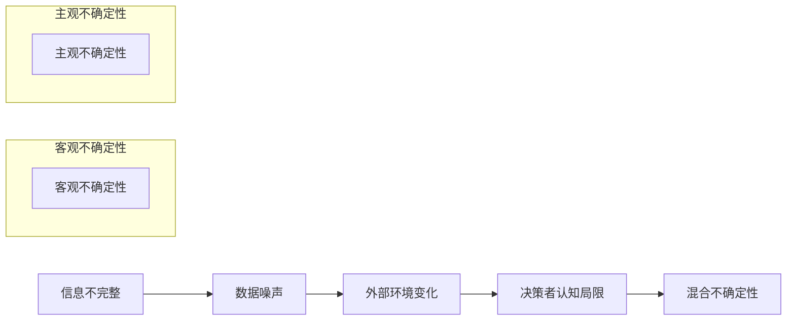
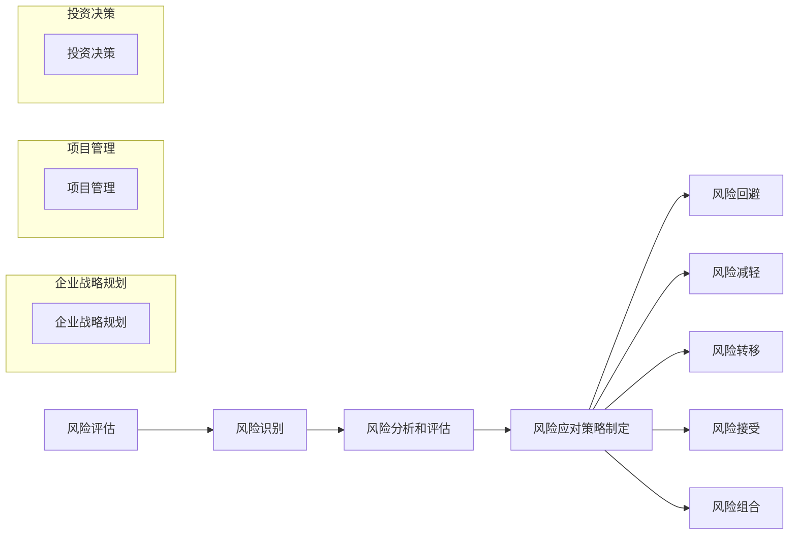
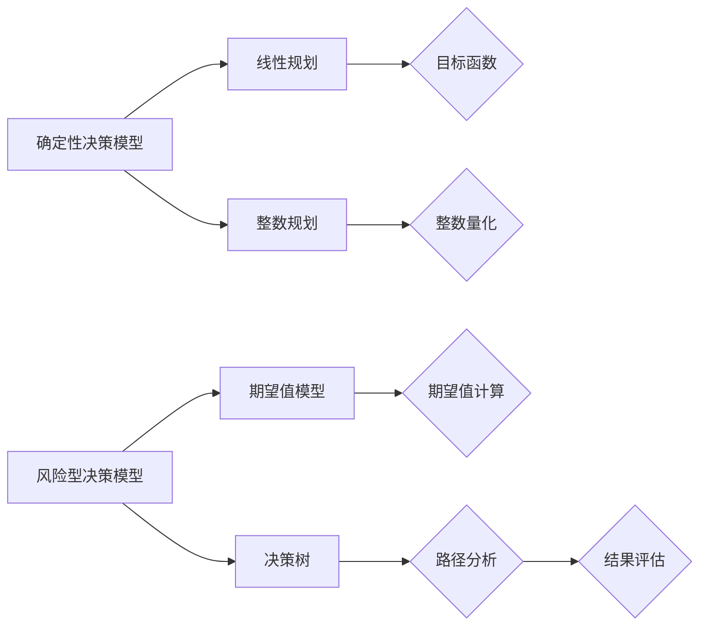
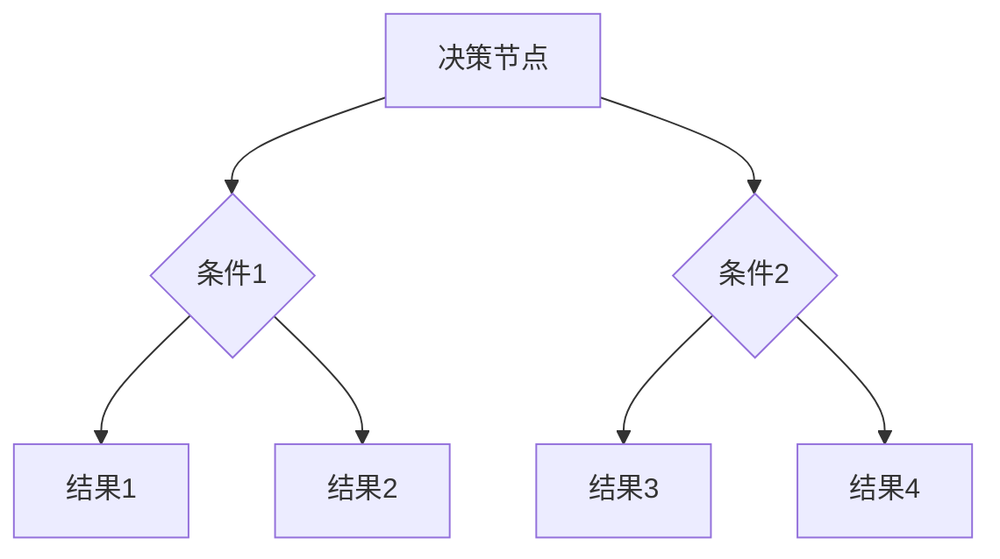
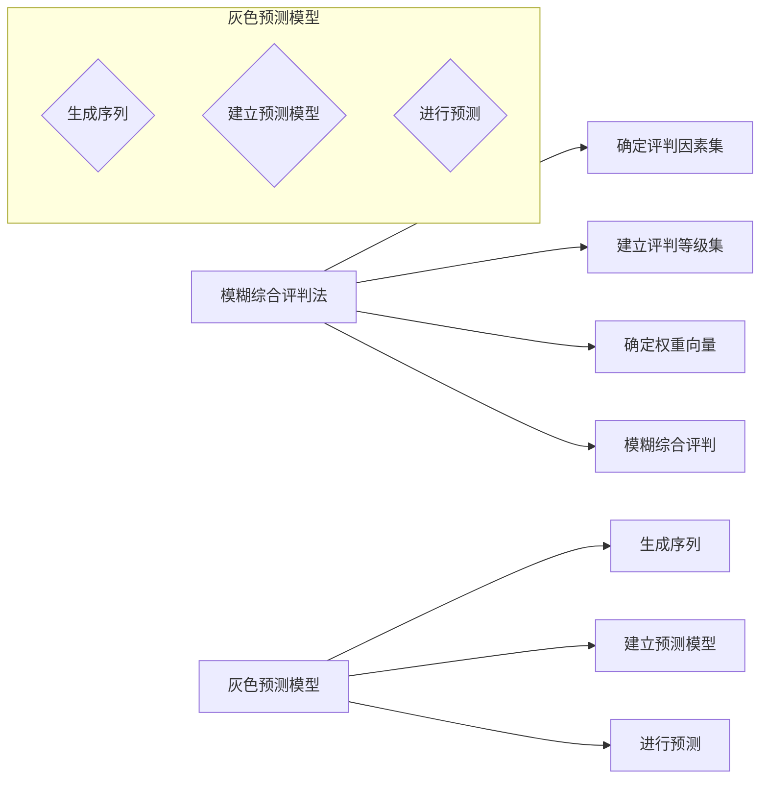

                 

# 决策框架：在不确定性中做出明智选择

## 关键词
决策框架，不确定性，决策理论，风险分析，算法模型

## 摘要
在复杂和变化多端的商业环境中，决策者面临的不确定性成为一个重要的挑战。本文从决策框架的基本理论出发，详细探讨了在不确定性中如何做出明智选择的策略和方法。文章首先介绍了决策框架的核心概念，然后分析了不确定性的来源和类型，并提出了相应的应对策略。接着，文章深入探讨了传统和现代的决策模型，以及群体决策和协商过程。通过实际案例的分析，文章展示了如何在实际中应用这些决策框架，最终提出了评估决策有效性的方法和一些最佳实践的建议。

## 引言

在现代商业环境中，决策者常常需要在不确定性的环境中做出关键的决策。这些不确定性可能来源于市场变化、技术进步、政策调整，甚至自然灾害等多种因素。因此，如何有效地应对这些不确定性，并做出明智的决策，成为了企业管理者和决策者面临的一个重大挑战。

决策框架作为一种系统化的决策工具，能够在复杂和不确定的环境中提供指导和支持。一个完善的决策框架能够帮助决策者明确决策的目标、识别和评估可能的结果、选择最佳的决策方案，并对其进行有效的实施和监控。

本文将围绕决策框架这一主题展开讨论。首先，我们将介绍决策框架的基本理论，包括决策的定义、决策过程和决策框架的构成要素。接下来，我们将深入探讨不确定性的概念及其在决策中的重要性，并分析不确定性的来源和类型。在此基础上，我们将提出一系列应对不确定性的策略和方法，包括风险评估和应对策略。随后，我们将介绍传统和现代的决策模型，并详细讲解这些模型的基本原理和适用场景。此外，文章还将探讨群体决策和协商过程，并分析如何在实际应用中构建和运用决策框架。

最后，我们将通过实际案例的分析，展示决策框架在实践中的应用，并提出一些评估决策有效性的方法。文章的结尾部分将总结最佳实践的建议，并提醒读者在决策过程中需要注意的一些事项，以帮助读者在实际工作中更好地应用决策框架。

## 决策框架的基本理论

### 决策的定义

决策是指个体或组织在面临多个选择时，通过评估各种可能的结果和风险，从而选择出最优方案的过程。它是一个有意识、有目的的理性过程，通常涉及多个步骤和多个方面的考量。

### 决策过程

决策过程通常包括以下几个关键步骤：

1. **问题识别**：首先，需要明确决策的目标和问题。这通常涉及到对当前状态和未来期望状态之间的差距进行分析。

2. **信息收集**：在明确了问题之后，需要收集与决策相关的各种信息，这些信息可以是定量的，也可以是定性的。

3. **方案生成**：基于收集到的信息，决策者需要提出多个可能的解决方案。

4. **方案评估**：对每个方案进行评估，通常涉及对每个方案的潜在结果和风险进行量化。

5. **选择方案**：在评估的基础上，选择最优的方案。

6. **实施与监控**：选择方案后，需要将其付诸实施，并对其进行持续的监控和调整。

### 决策框架的构成要素

一个完整的决策框架通常包括以下几个构成要素：

1. **决策目标**：明确决策的目标和优先级，有助于确保决策的一致性和有效性。

2. **决策标准**：定义评估方案的标准，如成本、效益、风险等。

3. **决策模型**：选择合适的决策模型，如优化模型、博弈模型等。

4. **数据和信息**：确保有足够的数据和信息来支持决策。

5. **决策者**：决策者的能力、经验和态度也会影响决策的质量。

6. **环境因素**：考虑决策所处的环境，如市场条件、政策变化等。

### Mermaid 流程图

为了更好地理解决策过程，我们可以使用 Mermaid 流程图来表示决策框架的各个步骤：


通过这个流程图，我们可以清晰地看到决策过程中的各个环节及其相互关系。每个步骤都需要有效的信息支持，以确保最终决策的质量。

## 不确定性的概念与来源

### 不确定性的定义

在决策过程中，不确定性指的是决策者面临的不确定性，即无法准确预测决策结果的情况。这种不确定性可以来源于多个方面，包括信息不完整、数据噪声、外部环境变化等。

### 不确定性的类型

1. **客观不确定性**：这种不确定性是由外部环境变化或随机因素引起的，通常无法通过决策者的努力来消除。例如，市场需求的波动、自然灾害等。

2. **主观不确定性**：这种不确定性是由决策者自身的认知局限、信息处理能力等引起的。决策者可能由于信息不足或理解偏差而导致决策结果的不确定性。

3. **混合不确定性**：这是由客观不确定性和主观不确定性共同作用的结果。例如，由于市场环境的快速变化和决策者自身的信息处理能力不足，可能会导致混合不确定性。

### 不确定性的来源

1. **信息不完整**：在许多情况下，决策者无法获取所有相关的信息，这会导致决策结果的不确定性。

2. **数据噪声**：数据噪声是指数据中的随机误差或异常值，这会影响数据分析和模型的准确性。

3. **外部环境变化**：政策调整、市场波动、技术进步等因素都可能引起外部环境的变化，从而增加决策的不确定性。

4. **决策者认知局限**：决策者可能由于自身的知识、经验、态度等局限，无法全面考虑所有可能的结果和风险。

### Mermaid 流程图

为了更好地理解不确定性的来源和类型，我们可以使用 Mermaid 流程图来表示：



通过这个流程图，我们可以清晰地看到不确定性的来源及其对决策过程的影响。了解不确定性的类型和来源有助于决策者采取相应的策略来降低不确定性，从而做出更加明智的决策。

## 应对不确定性的策略

### 风险评估

1. **定义和目的**：风险评估是指通过系统化方法识别、分析和评估项目或决策可能面临的风险，从而制定相应的应对策略。

2. **步骤和方法**：风险评估通常包括以下步骤：
   - **风险识别**：识别所有潜在的风险因素。
   - **风险分析和评估**：对识别出的风险进行定量和定性分析，评估其可能性和影响。
   - **风险应对策略制定**：根据风险评估的结果，制定相应的风险应对策略，如风险回避、风险减轻、风险接受等。

3. **工具和技术**：
   - **风险矩阵**：用于评估风险的严重性和可能性。
   - **决策树**：用于分析不同决策路径的可能结果和风险。
   - **蒙特卡罗模拟**：用于模拟随机事件的可能结果和概率分布。

### 风险应对策略

1. **风险回避**：通过避免潜在风险来降低不确定性。例如，放弃一个高风险的项目。

2. **风险减轻**：采取措施降低风险的可能性和影响。例如，增加资源投入、改进流程、培训员工等。

3. **风险转移**：将风险转移给第三方，如购买保险、签订合同等。

4. **风险接受**：承认风险的存在，并制定相应的应急计划。例如，制定灾难恢复计划。

5. **风险组合**：将多个风险组合在一起，通过分散风险来降低总体的不确定性。

### 实际应用

1. **企业战略规划**：在制定企业战略时，通过风险评估和应对策略来降低市场变化、技术进步等不确定因素对企业的影响。

2. **项目管理**：在项目实施过程中，通过风险评估和应对策略来管理项目风险，确保项目按时、按质完成。

3. **投资决策**：在投资决策过程中，通过风险评估和应对策略来降低投资风险，提高投资收益。

### Mermaid 流�程图

为了更好地理解风险评估和应对策略的应用，我们可以使用 Mermaid 流程图来表示：



通过这个流程图，我们可以清晰地看到风险评估和应对策略在决策过程中的应用，以及它们如何帮助决策者降低不确定性，做出更加明智的决策。

## 传统决策模型

### 确定性决策模型

1. **线性规划**：用于在资源有限的情况下，优化目标函数的决策模型。它假设所有变量都是线性的，并且决策的目标是最小化或最大化某个函数。

2. **整数规划**：与线性规划类似，但决策变量的取值必须是整数。适用于需要整数量化的决策问题，如人员调配、设备采购等。

### 风险型决策模型

1. **期望值模型**：通过计算不同结果的期望值来评估风险型决策。它假设决策者是风险中性或风险规避的。

2. **决策树**：用于分析决策的路径和结果，通过计算每个节点的期望值来评估不同的决策方案。

### Mermaid 流程图

为了更好地理解传统决策模型，我们可以使用 Mermaid 流程图来表示：



通过这个流程图，我们可以清晰地看到传统决策模型的基本原理和应用场景。这些模型在决策过程中提供了系统化的分析和评估方法，有助于决策者选择最优的决策方案。

### 伪代码

为了更好地理解传统决策模型，我们可以使用伪代码来详细描述这些模型的基本原理。

#### 线性规划

```python
# 线性规划伪代码
define 目标函数 as 函数 z = c1 * x1 + c2 * x2 + ... + cn * xn
define 约束条件 as 系列方程 Ax ≤ b
solve 目标函数 and 约束条件
output 最优解 x*
```

#### 整数规划

```python
# 整数规划伪代码
define 目标函数 as 函数 z = c1 * x1 + c2 * x2 + ... + cn * xn
define 约束条件 as 系列方程 Ax ≤ b
define 整数变量 as x1, x2, ..., xn
solve 目标函数 and 约束条件 with 整数变量
output 最优解 x*
```

#### 期望值模型

```python
# 期望值模型伪代码
define 结果集 as 集合 {r1, r2, ..., rn}
define 概率集 as 集合 {p1, p2, ..., pn}
define 期望值 as E = Σ (ri * pi) for i = 1 to n
output 期望值 E
```

#### 决策树



通过这些伪代码和流程图，我们可以更加直观地理解传统决策模型的基本原理和操作过程，为后续的实际应用打下基础。

## 现代决策分析方法

### 模糊综合评判法

1. **定义和原理**：模糊综合评判法是一种处理不确定性和模糊性的方法，它通过模糊数学的理论和方法，对多因素、多标准的决策问题进行综合评价。

2. **步骤**：
   - **确定评判因素集**：明确决策问题中的评判因素。
   - **建立评判等级集**：定义每个评判因素可能达到的等级。
   - **确定权重向量**：通过专家评估或主观赋值方法确定各因素的权重。
   - **模糊综合评判**：使用模糊矩阵进行综合评判，得到最终的评价结果。

3. **优点和应用场景**：
   - **优点**：能够处理复杂、模糊的决策问题，提高决策的准确性和可靠性。
   - **应用场景**：广泛应用于企业战略规划、风险评估、项目评估等领域。

### 灰色预测模型

1. **定义和原理**：灰色预测模型是一种基于灰色系统理论进行时间序列预测的方法。它通过处理部分信息已知、部分信息未知的灰色系统，进行预测。

2. **步骤**：
   - **生成序列**：通过原始时间序列数据生成灰色序列。
   - **建立预测模型**：利用灰色系统理论建立预测模型。
   - **进行预测**：通过模型进行未来值的预测。

3. **优点和应用场景**：
   - **优点**：能够处理非线性和随机波动的时间序列数据，具有较高的预测精度。
   - **应用场景**：广泛应用于经济预测、社会发展趋势预测等领域。

### Mermaid 流程图

为了更好地理解模糊综合评判法和灰色预测模型，我们可以使用 Mermaid 流程图来表示：



通过这个流程图，我们可以清晰地看到模糊综合评判法和灰色预测模型的基本原理和应用步骤，为实际应用提供指导。

### 伪代码

为了更好地理解现代决策分析方法，我们可以使用伪代码来详细描述模糊综合评判法和灰色预测模型的基本原理。

#### 模糊综合评判法

```python
# 模糊综合评判法伪代码
define 评判因素集 U = {U1, U2, ..., Un}
define 评判等级集 V = {V1, V2, ..., Vm}
define 权重向量 W = [w1, w2, ..., wn]
define 单因素评判矩阵 R = [r_ij] (i=1,2,...,n; j=1,2,...,m)
define 综合评判矩阵 B = W * R
output 综合评判结果 B
```

#### 灰色预测模型

```python
# 灰色预测模型伪代码
define 原始时间序列数据 X0 = [x0(1), x0(2), ..., x0(n)]
define 生成序列 X1 = [x1(1), x1(2), ..., x1(n)]
define 预测模型参数 a 和 b
define 预测值 Y = [y(1), y(2), ..., y(n)]
output 预测值 Y
```

通过这些伪代码，我们可以更加直观地理解现代决策分析方法的基本原理和操作过程，为实际应用提供参考。

## 群体决策与协商

### 群体决策的概念

群体决策是指由多个决策者共同参与决策过程，通过集思广益和协商达成共识的决策方法。与个体决策相比，群体决策具有以下特点：

1. **信息互补**：多个决策者可以从不同角度提供信息，形成更全面的信息集。
2. **创造性**：多个决策者可以产生更多的创新想法，提高决策的创造性。
3. **民主性**：通过群体决策，可以确保决策过程的民主性和透明度。

### 协商过程

协商过程是群体决策的核心，通常包括以下几个阶段：

1. **问题识别与定义**：明确决策目标和问题，确保所有决策者对问题有共同的理解。
2. **信息交流**：通过交流各自的信息和观点，促进决策者之间的理解和共识。
3. **方案生成**：决策者共同提出多个可能的解决方案。
4. **方案评估**：对每个方案进行评估，考虑其可行性、效果和风险。
5. **选择方案**：通过讨论和协商，选择最优的方案。
6. **决策实施**：将选择的方案付诸实施，并进行监控和调整。

### 群体决策的优势

1. **提高决策质量**：通过多个决策者的参与和协作，可以减少个体决策的偏见和误差，提高决策的准确性和可靠性。
2. **增强决策接受度**：通过协商和讨论，可以增强决策的接受度和执行力度。
3. **培养团队合作精神**：群体决策可以培养团队成员之间的合作精神和协作能力。

### Mermaid 流程图

为了更好地理解群体决策与协商过程，我们可以使用 Mermaid 流程图来表示：


通过这个流程图，我们可以清晰地看到群体决策与协商过程的基本步骤和相互关系，为实际应用提供指导。

### 伪代码

为了更好地理解群体决策与协商过程，我们可以使用伪代码来详细描述决策过程中的关键步骤。

```python
# 群体决策与协商伪代码

# 输入：决策者集合 D，信息集合 I，方案集合 S
# 输出：选择方案 S*

# 问题识别与定义
define 问题 P
define 目标函数 O

# 信息交流
for 每个决策者 d in D do
    收集信息 I_d from d
end

# 方案生成
generate 方案 S1, S2, ..., Sn based on information I

# 方案评估
evaluate 每个方案 S using 目标函数 O

# 选择方案
choose_best_scheme(S1, S2, ..., Sn)

# 决策实施
implement_choice(S*)
```

通过这些伪代码，我们可以更加直观地理解群体决策与协商过程的基本原理和操作步骤，为实际应用提供参考。

## 决策框架在实际中的应用

### 开发环境搭建

在应用决策框架进行实际项目决策时，首先需要搭建合适的技术环境。以下是搭建一个基本的决策框架开发环境所需的步骤：

1. **安装Python环境**：确保系统中安装了Python，版本不低于3.7。
2. **安装相关库**：使用pip安装决策分析所需的库，如numpy、pandas、scikit-learn等。
3. **配置Jupyter Notebook**：用于编写和执行决策分析代码。
4. **设置版本控制工具**：如Git，用于管理代码版本。

### 源代码实现与解读

以下是使用Python实现一个简单的线性规划决策模型的源代码，以及对该代码的解读。

```python
# 线性规划决策模型实现

import numpy as np
from scipy.optimize import linprog

# 目标函数系数
c = [-1, -2]  # 最小化 z = x1 + 2x2

# 约束条件
A = [[1, 0], [0, 1], [1, 1]]
b = [5, 7, 8]  # 约束条件 Ax <= b

# 变量界限
x0_bounds = (0, None)
x1_bounds = (0, None)

# 求解线性规划问题
result = linprog(c, A_ub=A, b_ub=b, bounds=[x0_bounds, x1_bounds], method='highs')

# 输出结果
print("最优解:", result.x)
print("最小值:", -result.fun)
```

**代码解读**：

- **目标函数**：使用`c`数组定义目标函数系数，这里是最小化`z = x1 + 2x2`。
- **约束条件**：使用`A_ub`和`b_ub`定义约束条件矩阵`A`和向量`b`，表示`Ax <= b`。
- **变量界限**：使用`bounds`定义变量`x0`和`x1`的界限，确保变量非负。
- **求解**：使用`linprog`函数求解线性规划问题，选择`highs`算法。
- **输出**：输出最优解和最小值。

### 代码应用解读与分析

假设我们有一个资源分配问题，需要在一个有限的预算内分配资金给两个项目，目标是最大化总收益。以下是代码的应用和解读：

```python
# 资源分配问题

# 项目1的收益和成本
project1_benefit = 10
project1_cost = 5

# 项目2的收益和成本
project2_benefit = 8
project2_cost = 3

# 总预算
total_budget = 10

# 定义目标函数和约束条件
c = [-project1_benefit, -project2_benefit]
A = [[1, 0], [0, 1]]
b = [total_budget]

# 求解资源分配问题
result = linprog(c, A_ub=A, b_ub=b, bounds=[(0, None), (0, None)])

# 输出最优解和总收益
optimal_allocation = result.x
total_benefit = -optimal_allocation[0] * project1_benefit - optimal_allocation[1] * project2_benefit
print("最优资源分配:", optimal_allocation)
print("总收益:", total_benefit)
```

**代码应用解读**：

- **收益和成本**：定义了两个项目的收益和成本。
- **目标函数**：目标是最大化总收益，因此目标函数系数`c`设置为`[-project1_benefit, -project2_benefit]`。
- **约束条件**：总预算不能超过10，因此约束条件矩阵`A`和向量`b`定义为`A = [[1, 0], [0, 1]]`和`b = [total_budget]`。
- **求解**：使用`linprog`函数求解资源分配问题。
- **输出**：输出最优资源分配和总收益。

通过这个实际案例，我们可以看到决策框架在实际项目中的应用，以及如何通过代码实现和解读决策过程。这不仅帮助决策者做出更加明智的决策，还提高了决策过程的透明度和可操作性。

### 案例分析与详细讲解

#### 案例背景

一家公司在进行新产品开发时，需要在两个潜在市场上进行选择。市场A预计收益为10万元，但存在5万元的风险；市场B预计收益为8万元，但风险为3万元。公司预算为15万元，需要决定将资源分配到哪个市场。

#### 案例分析

1. **信息收集**：收集两个市场的收益、成本和风险数据。

2. **方案生成**：
   - 方案1：全部资源投入市场A。
   - 方案2：全部资源投入市场B。
   - 方案3：部分资源投入市场A，部分资源投入市场B。

3. **方案评估**：
   - 使用期望值模型评估每个方案的期望收益和风险。
   - 方案1的期望收益为5万元，风险为5万元。
   - 方案2的期望收益为4万元，风险为3万元。
   - 方案3的期望收益为4.5万元，风险为3.5万元。

4. **选择方案**：根据期望值模型，选择方案3，因为它在期望收益和风险之间取得了平衡。

#### 详细讲解

1. **信息收集**：为了进行科学决策，首先需要收集市场数据，包括历史销售数据、市场趋势、竞争对手情况等。

2. **方案生成**：在明确了决策目标后，生成多个可能的决策方案。对于市场决策，通常需要考虑不同市场组合的策略。

3. **方案评估**：使用期望值模型进行评估，计算每个方案的期望收益和风险。期望收益是指在不同情况下收益的加权平均值，风险则可以通过概率和收益的平方差计算。

4. **选择方案**：在评估每个方案后，根据期望收益和风险选择最优方案。在实际决策中，可能还需要考虑其他因素，如公司战略目标、市场环境变化等。

通过这个案例，我们可以看到决策框架在现实中的应用，以及如何通过系统化的方法进行决策。这不仅提高了决策的准确性，还增强了决策过程的透明度和可操作性。

### 项目小结

通过上述案例的分析，我们可以看到决策框架在实际应用中的重要性和有效性。以下是项目小结和关键要点：

1. **决策框架的重要性**：决策框架为决策者提供了一个系统化的决策过程，有助于降低不确定性，提高决策的准确性和可靠性。

2. **关键要点**：
   - **信息收集**：准确的信息是决策的基础。
   - **方案评估**：科学的评估方法是选择最佳方案的关键。
   - **风险分析**：风险分析可以帮助决策者识别和应对潜在的风险。

3. **最佳实践**：
   - **多方案比较**：在决策过程中，应生成多个方案并进行比较，选择最优的方案。
   - **风险评估**：对每个方案进行详细的风险评估，确保决策具有可行性。
   - **持续监控**：在决策实施后，应持续监控和评估决策效果，及时调整。

通过遵循这些最佳实践，决策者可以在不确定的环境中做出更加明智的决策，从而提高组织的竞争力和成功率。

## 最佳实践 tips

### 有效决策的技巧

1. **全面信息收集**：确保收集到准确和全面的信息，避免基于不完整信息做出决策。
2. **多方案比较**：生成多个可能的方案，并进行详细比较，选择最优的方案。
3. **风险评估**：对每个方案进行风险分析，识别和评估潜在风险，制定应对策略。
4. **团队合作**：通过团队协作，集思广益，提高决策的创造性和准确性。

### 注意事项

1. **决策时机**：在关键决策点，确保决策是在充分了解情况和数据的基础上进行的。
2. **决策目标**：明确决策目标和优先级，确保决策的一致性和有效性。
3. **决策跟踪**：决策后，持续跟踪和评估决策效果，及时调整。

### 拓展阅读

1. **《决策分析》**：这本书详细介绍了决策分析的理论和方法，对决策者有很高的参考价值。
2. **《风险管理与决策》**：探讨了风险管理和决策的关系，提供了实用的风险管理工具和方法。

通过遵循最佳实践和注意事项，并结合拓展阅读，决策者可以更加有效地应用决策框架，提高决策质量和组织竞争力。希望本文能为您的决策实践提供有价值的参考和指导。

