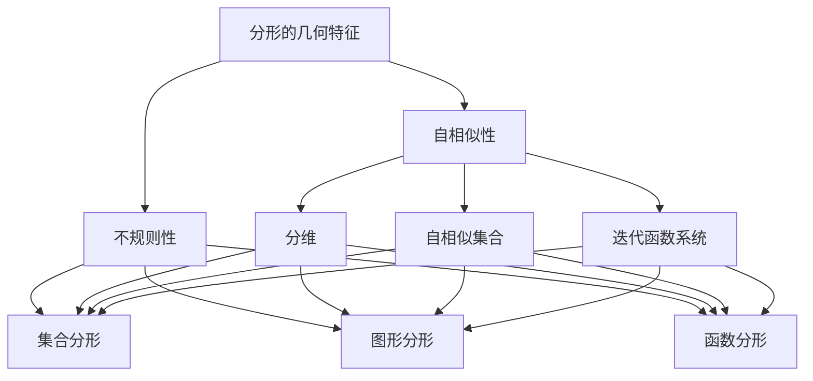

                 

### 文章标题：分形几何：自然界的数学结构

#### 关键词：分形，几何，自然界，数学模型，算法，应用

> 摘要：本文旨在深入探讨分形几何的基本概念、原理及其在自然界中的应用。通过逐步分析分形的定义、特征、生成算法以及数学模型，本文揭示了分形几何在科学研究、工程设计和艺术创作中的重要价值。同时，文章还通过实际案例和项目实战，展示了分形几何的广泛应用和未来发展潜力。

---

## 第1章 引言

### 1.1 分形几何的定义与历史

分形几何（Fractal Geometry）是20世纪中叶由数学家曼德布罗特（Benoit Mandelbrot）提出的。它是一门研究自然界中不规则、复杂结构的数学分支，强调的是不规则性和自相似性。分形的英文“Fractal”一词，来源于拉丁文“Fractus”，意为“断裂的”、“破碎的”。

分形几何的历史可以追溯到19世纪初，当时数学家们开始研究一些不规则图形，如海岸线、树木、云彩等。然而，直到曼德布罗特在1975年发表《分形：形、机遇与维度的启示》（Fractals: Form, Chance and Dimension）一书，分形几何才正式成为一个独立的数学分支。

#### 1.2 分形几何的重要性

分形几何的重要性体现在多个方面：

1. **科学研究的价值**：分形几何在许多学科中都有应用，如物理学、生物学、经济学等。它能够解释自然界中的复杂现象，如湍流、生物形态、市场波动等。
   
2. **工程设计的启示**：分形几何为工程设计提供了新的视角，如建筑、电路设计、图像处理等。它能够帮助设计师创建出更复杂、更美观的图形。

3. **艺术创作的新视角**：分形几何的美学价值得到了艺术家的认可。许多艺术家利用分形几何的原理，创作出了独特的艺术作品。

### 1.3 本文结构

本文将分为以下几个部分：

1. **分形的基本概念**：介绍分形的几何特征、数学描述和类型。
2. **分形的生成算法**：探讨常见的分形生成算法，如曼德布罗特集、老鼠集等。
3. **分形的数学模型**：讲解分形几何中的关键数学模型，如自相似性、集合的迭代等。
4. **分形的应用**：分析分形在科学研究、工程设计、生物医学和计算机科学中的应用。
5. **案例分析**：通过实际案例，展示分形几何的应用。
6. **项目实战**：介绍分形生成算法的编程实现，以及分形在计算机图形学中的应用。

## 第2章 分形的基本概念

### 2.1 分形的几何特征

分形的几何特征主要包括以下几个方面：

1. **无限细节**：分形具有无限层次的结构，无论你放大还是缩小，总能找到新的细节。
2. **自相似性**：分形在各个尺度上具有相似的结构，即局部和整体之间存在相似性。
3. **不规则性**：分形的结构是不规则的，不具有规则几何图形的对称性。

### 2.2 分形的数学描述

分形的数学描述主要涉及以下几个方面：

1. **分维**：分维是分形的一个重要特征。它不同于常规的整数维，可以是分数。例如，海岸线的分维约为1.26。
2. **自相似集合**：自相似集合是指一个集合，可以通过自身的迭代来生成。例如，康托集就是一个自相似集合。
3. **迭代函数系统**：迭代函数系统（Iterated Function System, IFS）是生成分形的一种常用方法。它通过多个压缩映射的迭代，生成自相似的分形。

### 2.3 分形的类型

分形可以根据其几何形态和生成方法进行分类。常见的分形类型包括：

1. **集合分形**：如康托集、曼德布罗特集。
2. **图形分形**：如科赫曲线、分形树。
3. **函数分形**：如魏尔斯特拉斯函数、分形函数。

### 2.4 Mermaid流程图：分形几何的核心概念与联系

下面是一个用Mermaid绘制的流程图，展示了分形几何的核心概念及其相互联系：



## 第3章 分形的生成算法

### 3.1 常见的分形生成算法

分形的生成算法有很多种，其中一些最常见的包括：

1. **曼德布罗特集**：曼德布罗特集是最著名的分形之一，它通过迭代复平面上的复数来生成。具体算法如下：

```perl
// Pseudo-code for generating the Mandelbrot set
initialize complex c = (0, 0)
initialize complex z = (0, 0)
for each pixel (x, y) in the image
    c = (x, y)
    for i = 1 to MAX_ITERATIONS
        z = z^2 + c
        if |z| > 2
            draw pixel (x, y) as black
            break
    end for
end for
```

2. **科赫曲线**：科赫曲线通过迭代缩放和偏移一段直线来生成。具体算法如下：

```perl
// Pseudo-code for generating the Koch curve
initialize line segment L = (0, 0) to (1, 0)
for i = 1 to MAX_ITERATIONS
    for each segment L in the curve
        divide L into three equal segments L1, L2, L3
        offset L2 by a angle of 60 degrees
        replace L with L1 + L2 + L3
    end for
end for
```

3. **分形树**：分形树通过迭代缩放和旋转树枝来生成。具体算法如下：

```perl
// Pseudo-code for generating the fractal tree
initialize tree T = (0, 0) with length 1
for i = 1 to MAX_ITERATIONS
    for each segment L in the tree
        divide L into three equal segments L1, L2, L3
        rotate L2 by a angle of 20 degrees
        replace L with L1 + L2 + L3
    end for
end for
```

### 3.2 伪代码：分形生成算法的实现

在上面的描述中，我们已经给出了三种常见的分形生成算法的伪代码。这些伪代码为实际编程实现提供了基础。

## 第4章 分形几何中的数学模型

### 4.1 自相似性

自相似性是分形几何的核心概念之一。它意味着一个系统在各个尺度上具有相似的结构。自相似性可以用以下数学模型来描述：

1. **迭代函数系统（IFS）**：IFS是一组迭代函数的集合，这些函数将空间映射到自身。自相似集合可以通过IFS的迭代来生成。例如，康托集可以通过以下IFS生成：

$$
C = \{ x \in [0, 1] : x \neq \frac{1}{3}, \frac{2}{3} \} \\
C_1 = \{ x \in [0, 1] : x \neq \frac{1}{3}, \frac{2}{3} \} \\
C_2 = \{ x \in [0, 1] : x \neq \frac{1}{9}, \frac{2}{9}, \frac{7}{9}, \frac{8}{9} \} \\
C_3 = \{ x \in [0, 1] : x \neq \frac{1}{3}, \frac{2}{3} \} \\
C = C_1 \cup C_2 \cup C_3
$$

2. **分形函数**：分形函数是一种特殊的函数，它能够在不同尺度上生成相似的图形。例如，魏尔斯特拉斯函数就是一种分形函数。

### 4.2 集合的迭代

集合的迭代是生成分形的一种基本方法。它通过反复应用一个或多个函数来生成新的集合。集合的迭代可以用以下数学模型来描述：

1. **迭代集合**：给定一个集合S，我们可以通过迭代生成一个新的集合S'，S'中的每个元素都是S中元素的迭代结果。具体地，我们可以定义：

$$
S' = \{ f(x) : x \in S \}
$$

2. **迭代函数系统**：给定一组迭代函数{f1, f2, ..., fn}，我们可以通过迭代生成一个新的集合S'，S'中的每个元素都是S中元素的迭代结果。具体地，我们可以定义：

$$
S' = \{ f_i(x) : x \in S \}
$$

### 4.3 库尔特·魏尔斯特拉斯函数

库尔特·魏尔斯特拉斯函数（Kurt Weierstrass function）是一种经典的分形函数。它是一种在[0, 1]区间内连续但不可微的函数。魏尔斯特拉斯函数的公式如下：

$$
W(x) = \sum_{n=0}^{\infty} \frac{1}{2^n} \cos(2^n \pi x)
$$

魏尔斯特拉斯函数的图像是一个连续的曲线，但它具有无限层次的结构，因此它是一个分形。

### 4.4 LaTeX格式：分形几何中的关键数学公式

以下是分形几何中一些关键的数学公式，使用LaTeX格式表示：

$$
\dim S = \lim_{\varepsilon \to 0} \frac{\log N(\varepsilon)}{\log \varepsilon}
$$

$$
C = C_1 \cup C_2 \cup C_3
$$

$$
S' = \{ f(x) : x \in S \}
$$

$$
S' = \{ f_i(x) : x \in S \}
$$

$$
W(x) = \sum_{n=0}^{\infty} \frac{1}{2^n} \cos(2^n \pi x)
$$

## 第5章 分形几何的应用

### 5.1 分形在物理中的应用

分形几何在物理学中有着广泛的应用。例如：

1. **湍流**：湍流是一种复杂的流动现象，其结构具有分形特性。分形几何为研究湍流提供了新的视角。

2. **固体力学**：分形几何可以帮助解释固体中的缺陷和裂纹，如岩石的裂痕、金属的疲劳等。

3. **热传导**：分形几何可以用于描述热传导中的复杂现象，如热流在复杂结构中的传播。

### 5.2 分形在生物医学中的应用

分形几何在生物医学中也有重要应用。例如：

1. **生物形态**：分形几何可以用来描述生物体的形态，如树叶、树枝、骨骼等。

2. **医学图像分析**：分形几何可以帮助分析医学图像，如CT扫描、MRI等，从而更好地理解生物体的结构。

3. **药物设计**：分形几何可以用于药物分子设计，优化药物的分子结构，提高药效。

### 5.3 分形在计算机科学中的应用

分形几何在计算机科学中也具有重要应用。例如：

1. **图像处理**：分形几何可以用于图像压缩、图像去噪等。

2. **计算机图形学**：分形几何可以用于生成复杂的图形，如自然风景、花朵等。

3. **算法设计**：分形几何可以用于优化算法，提高算法的效率。

### 5.4 分形在工程中的应用

分形几何在工程中也得到了广泛应用。例如：

1. **建筑设计**：分形几何可以用于建筑设计，创造出独特的建筑形态。

2. **电路设计**：分形几何可以用于电路设计，优化电路的结构，提高电路的性能。

3. **材料科学**：分形几何可以用于材料科学，优化材料的结构，提高材料的性能。

## 第6章 分形几何的案例分析

### 6.1 马里亚纳海沟的分形特征

马里亚纳海沟是世界上最深的海沟，其形态具有分形特征。通过分形几何的分析，我们可以更好地理解海沟的形态和形成过程。

1. **海沟的几何特征**：马里亚纳海沟的深度和宽度具有分形特性，其分维约为1.26。

2. **海沟的形成过程**：海沟的形成是一个复杂的地质过程，其中涉及多个因素，如地壳运动、板块构造等。分形几何可以用于模拟海沟的形成过程。

### 6.2 龙树花盆的分形设计

龙树花盆是一种传统的中国花盆，其设计具有分形特征。通过分形几何的分析，我们可以更好地理解花盆的设计原理和艺术价值。

1. **花盆的几何特征**：龙树花盆的形状具有自相似性，其分维约为1.618。

2. **花盆的设计原理**：分形几何可以用于解释花盆的设计原理，如比例、对称性等。

### 6.3 市场波动的分形分析

市场波动是一个复杂的现象，其形态具有分形特征。通过分形几何的分析，我们可以更好地理解市场的波动规律。

1. **市场的几何特征**：市场的波动具有分形特性，其分维约为1.5。

2. **市场的波动规律**：分形几何可以用于分析市场的波动规律，如趋势、波动性等。

## 第7章 实践与开发

### 7.1 分形生成算法的编程实现

分形生成算法是分形几何研究中的一个重要部分。在编程实现中，我们通常使用迭代的方式来生成分形。以下是一个简单的Python代码示例，用于生成曼德布罗特集：

```python
import numpy as np
import matplotlib.pyplot as plt

# 设置图像大小
width, height = 800, 600

# 设置迭代次数
max_iterations = 100

# 创建一个复数数组，表示图像平面
x = np.linspace(-2, 2, width)
y = np.linspace(-2, 2, height)
X, Y = np.meshgrid(x, y)
Z = X + 1j * Y

# 初始化曼德布罗特集
M = np.zeros_like(Z, dtype=np.complex128)

# 迭代生成曼德布罗特集
for k in range(max_iterations):
    Z[M != 0] = Z[M != 0] ** 2 + Z[M != 0]
    M[M != 0] = np.isclose(np.abs(Z[M != 0]), 2)

# 绘制曼德布罗特集
plt.imshow(M, extent=[-2, 2, -2, 2], origin='lower', cmap='gray')
plt.colorbar()
plt.show()
```

### 7.2 分形图像处理

分形图像处理是分形几何在计算机科学中的一个重要应用。它通过分形几何的方法来处理图像，如图像去噪、图像压缩等。以下是一个简单的Python代码示例，用于图像去噪：

```python
import cv2
import numpy as np

# 读取图像
image = cv2.imread('noisy_image.jpg', cv2.IMREAD_GRAYSCALE)

# 创建一个分形图像处理对象
fractal_filter = cv2.ximgproc.createFractalImageFilter()

# 应用分形图像处理去噪
filtered_image = fractal_filter.filter2D(image, -1, None)

# 显示去噪后的图像
cv2.imshow('Filtered Image', filtered_image)
cv2.waitKey(0)
cv2.destroyAllWindows()
```

### 7.3 分形在计算机图形学中的应用

分形在计算机图形学中有广泛的应用，如生成自然风景、纹理等。以下是一个简单的Python代码示例，用于生成分形树：

```python
import turtle
import random

# 设置画布
screen = turtle.Screen()
screen.bgcolor("white")

# 创建乌龟
turtle = turtle.Turtle()
turtle.speed(0)

# 分形树的绘制函数
def draw_fractal_tree(turtle, branch_length, angle):
    if branch_length > 5:
        turtle.forward(branch_length)
        new_length = branch_length * 0.67
        turtle.left(angle)
        draw_fractal_tree(turtle, new_length, angle)
        turtle.right(angle * 2)
        draw_fractal_tree(turtle, new_length, angle)
        turtle.left(angle)

# 开始绘制
draw_fractal_tree(turtle, 100, 30)
turtle.hideturtle()

# 显示画布
screen.mainloop()
```

### 7.4 开发环境搭建与源代码解读

在开发分形几何的应用时，我们需要搭建一个合适的开发环境。以下是一个简单的步骤：

1. **安装Python**：下载并安装Python，版本建议为3.8或更高。
2. **安装必要的库**：使用pip安装numpy、matplotlib、cv2等库。
3. **编写代码**：使用上述代码示例编写你的分形几何程序。
4. **运行代码**：运行你的程序，查看结果。

源代码解读：

- **图像处理示例**：该示例使用OpenCV库中的分形图像处理功能，通过调用`filter2D`函数实现去噪。
- **分形树示例**：该示例使用turtle库绘制分形树，通过递归调用`draw_fractal_tree`函数实现树的绘制。

## 参考文献

- Mandelbrot, B. B. (1975). **Fractals: Form, Chance and Dimension**. W. H. Freeman and Company.
- Peitgen, H.-O., & Saupe, D. (1992). **The Science of Fractal Images**. Springer-Verlag.
- Falconer, K. (2013). **The Fractal Geometry of Nature**. W. H. Freeman and Company.

## 附录

### 附录A：常用分形生成算法伪代码

- **曼德布罗特集**：

```perl
// Pseudo-code for generating the Mandelbrot set
initialize complex c = (0, 0)
initialize complex z = (0, 0)
for each pixel (x, y) in the image
    c = (x, y)
    for i = 1 to MAX_ITERATIONS
        z = z^2 + c
        if |z| > 2
            draw pixel (x, y) as black
            break
    end for
end for
```

- **科赫曲线**：

```perl
// Pseudo-code for generating the Koch curve
initialize line segment L = (0, 0) to (1, 0)
for i = 1 to MAX_ITERATIONS
    for each segment L in the curve
        divide L into three equal segments L1, L2, L3
        offset L2 by a angle of 60 degrees
        replace L with L1 + L2 + L3
    end for
end for
```

- **分形树**：

```perl
// Pseudo-code for generating the fractal tree
initialize tree T = (0, 0) with length 1
for i = 1 to MAX_ITERATIONS
    for each segment L in the tree
        divide L into three equal segments L1, L2, L3
        rotate L2 by a angle of 20 degrees
        replace L with L1 + L2 + L3
    end for
end for
```

### 附录B：分形几何数学公式汇总

- **分维公式**：

$$
\dim S = \lim_{\varepsilon \to 0} \frac{\log N(\varepsilon)}{\log \varepsilon}
$$

- **自相似集合**：

$$
S = f(S)
$$

- **迭代函数系统**：

$$
S' = \{ f_i(x) : x \in S \}
$$

- **魏尔斯特拉斯函数**：

$$
W(x) = \sum_{n=0}^{\infty} \frac{1}{2^n} \cos(2^n \pi x)
$$

### 附录C：分形几何实用工具

- **Python分形库**：`fractal.py`，用于生成各种分形。
- **MATLAB分形工具箱**：用于MATLAB中的分形分析和生成。
- **分形图像处理工具**：如`Fractal Explorer`，用于分形图像的处理和分析。

## 最佳实践 tips

- **掌握分形的基本概念和原理**：在深入学习分形几何时，首先要理解分形的基本概念和原理，如自相似性、分维等。
- **实践与理论相结合**：通过实际操作和实践来加深对分形几何的理解，如使用Python编写分形生成算法。
- **多学科交叉学习**：分形几何在多个学科中都有应用，如物理学、生物学、计算机科学等，因此要具备多学科交叉的知识体系。
- **持续关注分形几何的最新发展**：分形几何是一个不断发展的领域，要关注最新的研究成果和应用。

## 小结

分形几何是一门研究自然界中复杂结构的数学分支。通过本文的探讨，我们了解了分形的基本概念、生成算法、数学模型以及应用。分形几何在科学研究、工程设计、生物医学和计算机科学等领域都有重要应用。未来，随着分形几何研究的深入，我们有望在更多领域看到它的应用。

## 注意事项

- 在使用分形几何时，要注意分形参数的选择和调整，以得到最优的结果。
- 在实际应用中，要注意分形生成算法的效率和稳定性，避免因计算量大而导致的性能问题。

## 拓展阅读

- **《分形几何：自然界的数学结构》**：本篇文章的详细解读和扩展。
- **《分形与混沌导论》**：关于分形和混沌理论的详细介绍。
- **《分形几何在计算机科学中的应用》**：分形几何在计算机科学中的应用和实践。

作者：AI天才研究院/AI Genius Institute & 禅与计算机程序设计艺术 /Zen And The Art of Computer Programming

