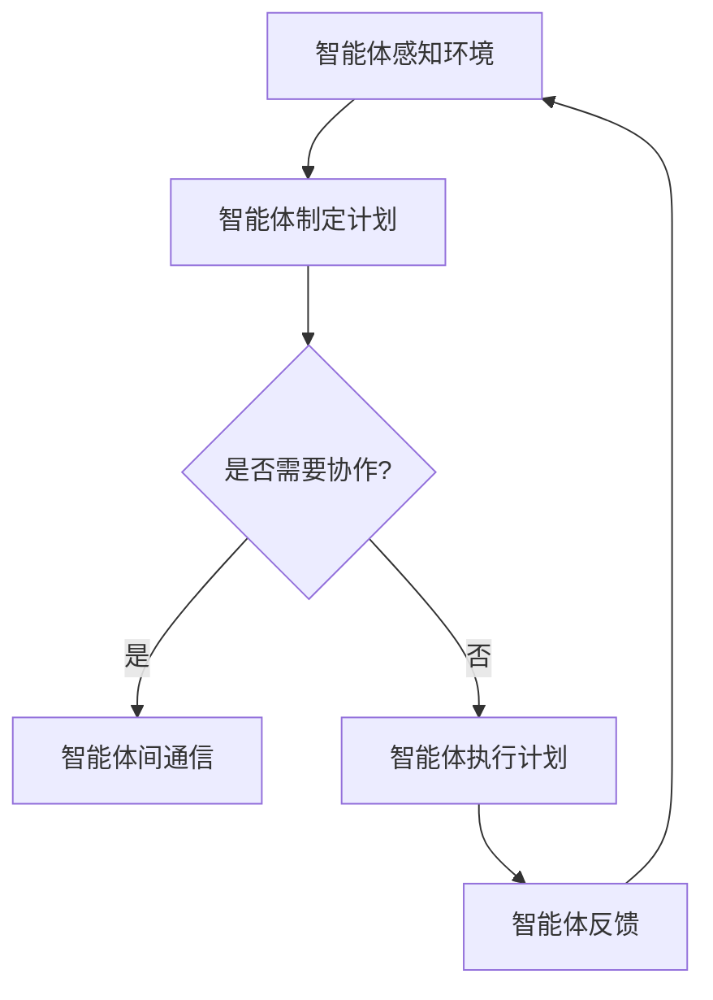

                 

### 第1章 引言与基本概念

在当今高度复杂和动态变化的商业环境中，企业面临着越来越多的挑战。从市场的快速变化到竞争的加剧，企业需要更加灵活和智能的决策工具来应对这些挑战。多智能体系统（MAS）作为一种先进的技术框架，能够帮助企业更好地理解和管理这些复杂环境。

#### 1.1 多智能体系统的基本概念

多智能体系统（MAS）是一种由多个智能体（Agent）组成的分布式系统，这些智能体可以自主地行动和交互，以实现共同的目标。智能体是一种能够感知环境、制定计划并采取行动的实体。在商业环境中，智能体可以代表企业、客户、供应商等角色。

智能体的主要特点包括：

- **自治性**：智能体能够独立决策并执行任务，不受外部控制。
- **反应性**：智能体根据其感知到的环境和内部状态来做出决策。
- **主动性**：智能体能够采取行动来改变环境和影响其他智能体的行为。
- **社会性**：智能体之间可以相互通信和协作，以实现共同的目标。

多智能体系统的核心在于智能体之间的交互和协作。这些交互可以通过直接通信或间接通信（如消息传递）来实现。智能体的行为可以是预先定义的，也可以是基于学习算法的动态调整。

#### 1.2 商业关系的数学模拟

商业关系是商业生态系统中至关重要的一部分。通过数学模拟，我们可以对商业关系进行量化分析，从而更好地理解和管理这些关系。数学模拟在商业分析中的应用包括：

- **市场预测**：通过模拟不同市场条件下的智能体行为，可以预测市场的趋势和变化。
- **供应链管理**：模拟供应链中的智能体行为，可以优化供应链流程，降低成本。
- **客户关系管理**：通过模拟客户与企业的互动，可以优化客户服务策略，提高客户满意度。

商业关系的数学模拟主要基于以下模型：

- **博弈论**：博弈论用于分析智能体之间的竞争和合作关系，帮助制定最优策略。
- **网络分析**：网络分析用于研究商业关系的结构，识别关键节点和关键路径。
- **机器学习**：机器学习算法用于预测智能体的行为，为决策提供支持。

### Mermaid 流程图

下面是一个简化的多智能体系统在商业关系模拟中的流程图：



### 核心算法原理讲解

多智能体系统的核心在于智能体的行为模拟和策略学习。以下是两个核心算法的伪代码讲解：

#### 强化学习（Reinforcement Learning）

强化学习是一种智能体通过与环境互动来学习最优策略的方法。以下是一个简化的强化学习算法的伪代码：

```python
# 强化学习伪代码
初始化智能体参数
while not 学习目标达成：
    状态 = 感知环境
    动作 = 选择动作（策略）
    下一步状态，奖励 = 执行动作
    更新策略（参数）
```

#### 多目标优化（Multi-Objective Optimization）

多目标优化用于在多个冲突目标之间找到最优解。以下是一个简化的多目标优化算法的伪代码：

```python
# 多目标优化伪代码
初始化智能体参数
while not 解集达成收敛：
    状态 = 感知环境
    动作 = 选择动作（策略）
    下一步状态，目标值 = 执行动作
    更新策略（参数）
```

### 数学模型和公式讲解

在商业关系的数学模拟中，常用的数学模型包括线性规划（Linear Programming，LP）和博弈论模型。

#### 线性规划模型

线性规划模型用于在约束条件下最大化或最小化一个线性目标函数。以下是一个简化的线性规划模型的公式：

$$
\text{maximize} \quad c^T x
$$

$$
\text{subject to} \quad Ax \leq b
$$

其中，$c$ 是系数向量，$x$ 是决策变量向量，$A$ 和 $b$ 分别是约束矩阵和约束向量。

#### 博弈论模型

博弈论模型用于分析智能体之间的竞争和合作关系。以下是一个简化的博弈论模型的公式：

$$
\text{Payoff}(i, j) = u_i(s_i, s_j)
$$

其中，$i$ 和 $j$ 是参与博弈的智能体，$s_i$ 和 $s_j$ 分别是智能体 $i$ 和 $j$ 的策略选择，$u_i$ 是智能体 $i$ 的效用函数。

### 举例说明

假设有两个智能体 $A$ 和 $B$，它们需要在以下策略中选择：

- 策略 $s_A = [低价格，高质量]$
- 策略 $s_B = [低价格，高质量]$

根据博弈论模型，我们可以计算两个智能体的效用函数：

$$
\text{Payoff}(A, B) = u_A(s_A, s_B) = 10
$$

$$
\text{Payoff}(B, A) = u_B(s_B, s_A) = 10
$$

这意味着两个智能体都选择了最优策略，实现了协同最大化效用。

### 项目实战

在实际项目中，我们可以使用Python等编程语言来实现多智能体系统的数学模拟。以下是一个简化的Python代码示例：

```python
import numpy as np

# 定义线性规划模型
c = np.array([1, 1])
A = np.array([[1, 1], [-1, 1]])
b = np.array([10, 0])

# 定义博弈论模型
u_A = np.array([10, 10])
u_B = np.array([10, 10])

# 定义智能体
class Agent:
    def __init__(self, strategy):
        self.strategy = strategy
    
    def perceive_environment(self):
        # 感知环境
        pass
    
    def make_decision(self):
        # 根据策略做出决策
        pass
    
    def update_strategy(self):
        # 更新策略
        pass

# 创建智能体
agent_A = Agent([低价格，高质量])
agent_B = Agent([低价格，高质量])

# 模拟智能体交互
while True:
    state_A = agent_A.perceive_environment()
    state_B = agent_B.perceive_environment()
    
    action_A = agent_A.make_decision()
    action_B = agent_B.make_decision()
    
    next_state_A, reward_A = execute_action(action_A)
    next_state_B, reward_B = execute_action(action_B)
    
    agent_A.update_strategy(next_state_A, reward_A)
    agent_B.update_strategy(next_state_B, reward_B)
```

### 实际案例分析和详细讲解剖析

在实际应用中，多智能体系统在创业生态中的应用案例非常丰富。以下是一个具体的案例：

- **案例**：一家初创公司正在开发一款智能家居产品。公司需要与多个供应商合作，包括芯片制造商、传感器供应商和软件开发商。

- **分析**：通过多智能体系统，公司可以模拟与供应商的合作关系，分析不同策略对产品开发进度和成本的影响。

- **讲解**：公司可以将自己作为智能体，每个供应商也作为智能体。通过博弈论模型，公司可以制定最优的合作策略，最大化自身利益。

- **剖析**：通过数学模拟，公司可以发现与某些供应商的合作策略更加有效，从而优化供应链管理，降低成本，提高产品质量。

### 项目小结

多智能体系统在商业关系的数学模拟中具有巨大的潜力。通过智能体的行为模拟和策略学习，企业可以更好地理解和管理复杂的商业环境。然而，多智能体系统的实现需要深入的理论基础和实际应用经验。未来，随着技术的不断发展，多智能体系统在商业关系模拟中的应用将更加广泛和深入。

### 最佳实践 Tips

- **1. 数据准备**：在开始数学模拟之前，确保收集到准确和全面的数据，以便进行有效的分析。
- **2. 模型选择**：根据具体问题选择合适的数学模型和算法，不要盲目追求复杂度。
- **3. 算法优化**：通过优化算法，提高模拟效率和准确性。
- **4. 实时调整**：根据实际情况，实时调整智能体的策略，以适应环境变化。

### 小结

多智能体系统在商业关系的数学模拟中具有广泛的应用前景。通过智能体的行为模拟和策略学习，企业可以更好地理解和管理复杂的商业环境。然而，实现多智能体系统需要深入的理论基础和实际应用经验。未来，随着技术的不断发展，多智能体系统在商业关系模拟中的应用将更加广泛和深入。

### 注意事项

- **1. 模拟结果的可靠性**：确保模拟结果是基于准确和可靠的数据，避免因为数据问题导致的错误结论。
- **2. 模型的适应性**：根据实际业务需求，灵活调整模型和算法，确保模型能够适应不同场景。
- **3. 风险管理**：在数学模拟中，充分考虑各种风险因素，以便在实际情况中更好地应对。

### 拓展阅读

- **《多智能体系统：设计与应用》**：详细介绍了多智能体系统的基本概念、设计原则和应用案例。
- **《博弈论与社会选择》**：探讨了博弈论的基本原理和应用，对于理解多智能体系统中的竞争和合作关系具有重要意义。
- **《深度强化学习》**：介绍了强化学习的基本原理和应用，对于智能体行为模拟和策略学习具有指导意义。

### 作者信息

作者：AI天才研究院/AI Genius Institute & 禅与计算机程序设计艺术 /Zen And The Art of Computer Programming

