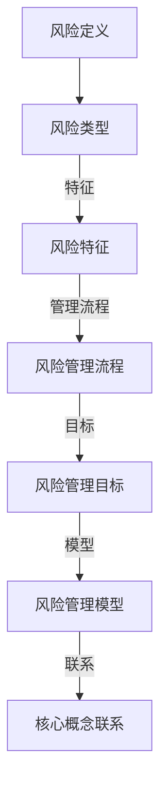
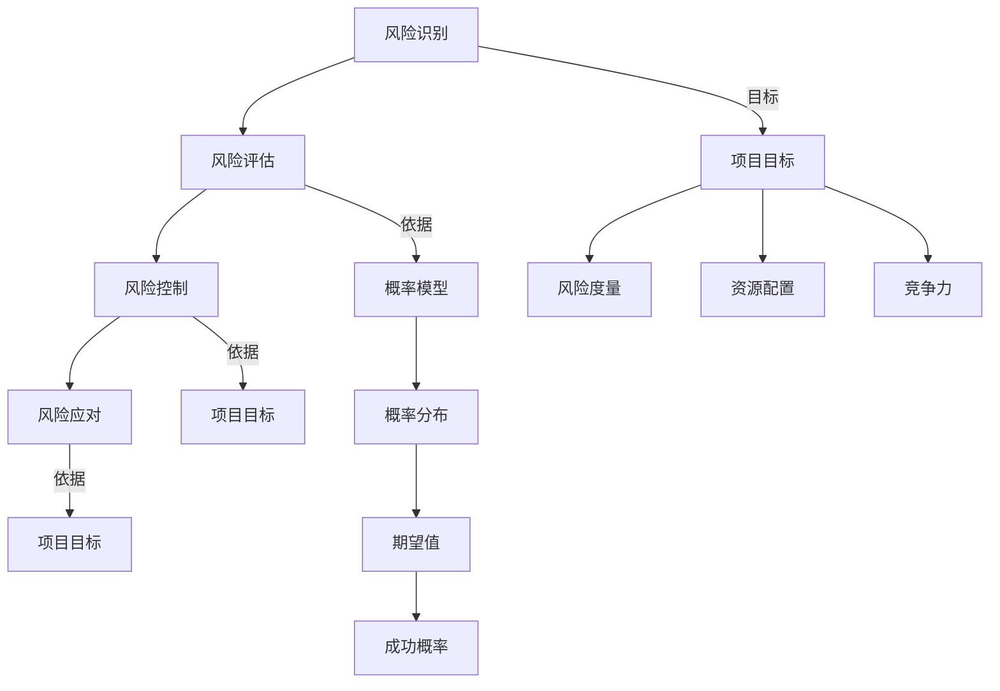

                 

### 引言

在商业世界中，创业无疑是一条充满机遇与挑战的道路。每个创业者都怀揣着改变世界的梦想，然而，现实却常常充满了不确定性和风险。创业过程的复杂性、市场竞争的激烈性以及技术变革的迅猛性，都使得创业成功充满了变数。因此，如何有效管理风险，提高创业成功的概率，成为每个创业者都必须面对的重要课题。

《创业过程的风险方程：商业成功的概率模型》这本书旨在帮助创业者深入了解风险管理的核心概念和方法，通过构建商业成功的概率模型，为创业者在实际操作中提供科学依据和决策支持。本书的目标是：

1. **介绍风险管理的基本原理和模型**：通过讲解风险管理的基本概念和原理，帮助读者建立起对风险管理的全面理解。
2. **构建商业成功的概率模型**：利用概率论和数理统计的方法，构建一个能够评估创业成功概率的数学模型，为创业决策提供数据支持。
3. **提供实战案例分析**：通过具体的创业项目风险评估与案例分析，帮助读者将理论知识应用于实际场景，提升风险管理的实战能力。

本文将按照以下结构展开讨论：

- **核心主题和主要目标**：明确本书的核心内容和预期达到的目标。
- **章节内容设计**：详细阐述每个章节的主要内容和结构，包括核心概念与联系、核心算法原理讲解、数学模型和公式、项目实战等。
- **目录大纲结构**：列出完整的目录大纲，展示各个章节的内容分布和逻辑关系。
- **具体撰写计划**：根据目录大纲，详细规划每个章节的具体内容撰写过程。

通过逐步的分析和推理，我们将深入探讨创业过程中风险管理的重要性，以及如何利用数学模型来提高创业成功的概率。希望通过这本书，创业者能够更好地应对风险，迈向成功的道路。

### 核心章节内容设计

#### 核心概念与联系

本书的核心章节将从风险管理原理与模型、商业成功的概率模型、概率论与数理统计基础、决策分析模型与风险管理等多个方面进行深入探讨。

**2.1 风险管理核心概念与联系**

这一章节将介绍风险管理的基本概念，包括风险的定义、类型、特征等，并分析风险管理在创业过程中的重要性。此外，还将通过Mermaid流程图展示核心概念之间的关系架构，帮助读者建立系统的风险管理知识体系。



**2.2 商业成功的概率模型**

本章将详细介绍商业成功的概率模型，包括模型的构建方法、应用场景和具体步骤。通过案例分析，读者将了解如何利用概率模型来评估创业项目的成功概率，从而为决策提供数据支持。

**3. 概率论与数理统计基础**

本章将深入讲解概率论与数理统计的基本概念和原理，包括概率分布、随机变量、期望与方差等。通过详细的伪代码讲解，读者将掌握如何使用数学工具进行概率分析和风险评估。

```python
# 伪代码示例：计算随机变量的期望
def calculate_mean(data):
    sum = 0
    for value in data:
        sum += value
    mean = sum / len(data)
    return mean

# 伪代码示例：计算随机变量的方差
def calculate_variance(data, mean):
    sum = 0
    for value in data:
        sum += (value - mean) ** 2
    variance = sum / len(data)
    return variance
```

**4. 决策分析模型与风险管理**

本章将介绍决策分析模型的基本原理和应用，包括风险决策分析方法、风险管理策略评估与选择等。通过具体案例，读者将了解如何在复杂环境中进行决策分析，并制定有效的风险管理策略。

**5. 创业项目风险评估与案例分析**

本章将结合具体的创业项目，进行风险评估与案例分析。通过详细讲解评估方法、结果分析和应对策略，读者将学会如何在实际项目中应用风险管理知识，提高创业成功的概率。

#### 核心算法原理讲解

本书的核心算法原理讲解将涵盖概率论与数理统计、决策分析模型等基础知识，并使用伪代码进行详细阐述，帮助读者理解算法的工作原理和实现方法。

**4.1 概率论与数理统计基础**

概率论是风险管理的基础，通过概率分布、随机变量、期望与方差等概念，可以量化风险事件的可能性及其影响。

- **概率分布**：描述随机变量取值的概率分布函数，常见的有正态分布、泊松分布等。

  $$f(x) = \frac{1}{\sqrt{2\pi\sigma^2}}e^{-\frac{(x-\mu)^2}{2\sigma^2}}$$

  其中，$\mu$ 是均值，$\sigma^2$ 是方差。

- **随机变量**：描述不确定事件的结果，常见的有离散型和连续型随机变量。

  $$X \sim \text{Bernoulli}(p)$$

  表示随机变量 $X$ 服从参数为 $p$ 的伯努利分布。

- **期望与方差**：描述随机变量的统计特性。

  $$E[X] = \sum_{i=1}^n x_i P(X=x_i)$$

  $$Var[X] = E[(X - E[X])^2]$$

**4.2 决策分析模型**

决策分析模型用于在不确定环境中进行决策，常见的方法有最大期望值、期望损失等。

- **最大期望值**：选择使期望收益最大的决策方案。

  $$\max_{i} E[R_i]$$

  其中，$E[R_i]$ 是决策方案 $i$ 的期望收益。

- **期望损失**：选择使期望损失最小的决策方案。

  $$\min_{i} E[L_i]$$

  其中，$E[L_i]$ 是决策方案 $i$ 的期望损失。

#### 数学模型和公式

本书将介绍多种数学模型和公式，用于评估创业项目的风险和商业成功的概率。

- **风险度量**：使用数学方法量化风险的大小，常见的有标准差、变异系数等。

  $$\sigma = \sqrt{Var[X]}$$

  $$CV = \frac{\sigma}{\mu}$$

- **概率分布**：使用概率分布描述风险事件的可能结果和概率。

  $$P(X \leq x) = F(x)$$

  其中，$F(x)$ 是概率分布函数。

#### 项目实战

本书将通过具体案例，展示如何在实际项目中应用风险管理知识，包括创业项目风险评估和风险管理策略制定。

- **创业项目风险评估案例**：选择一个具体的创业项目，进行风险评估，包括市场风险、财务风险、运营风险等。

- **风险管理策略制定**：根据风险评估结果，制定相应的风险管理策略，包括风险规避、风险转移、风险减轻等。

通过以上章节的设计，本书旨在为读者提供一个全面、系统的风险管理知识体系，帮助创业者更好地理解和应对创业过程中的风险，提高商业成功的概率。

### 目录大纲结构

为了确保本书的条理清晰，逻辑严谨，我们将按照以下目录大纲结构进行组织：

1. **第1章 引言**
    - 1.1 书籍背景与目标
    - 1.2 风险管理在创业过程中的重要性
    - 1.3 本书结构安排与预期收益

2. **第2章 风险管理核心概念与联系**
    - 2.1 风险的定义与类型
    - 2.2 风险管理的定义与目标
    - 2.3 风险管理的基本原理
    - 2.4 商业成功的概率模型简介
    - 2.5 Mermaid流程图展示核心概念联系

3. **第3章 商业成功的概率模型**
    - 3.1 商业成功的概率模型概述
    - 3.2 概率模型构建方法
    - 3.3 概率模型应用场景
    - 3.4 实际案例分析

4. **第4章 概率论与数理统计基础**
    - 4.1 概率论基础
    - 4.2 数理统计基础
    - 4.3 概率分布及其应用
    - 4.4 伪代码示例讲解

5. **第5章 决策分析模型与风险管理**
    - 5.1 决策分析模型概述
    - 5.2 风险决策分析方法
    - 5.3 风险管理策略评估与选择
    - 5.4 实际案例应用

6. **第6章 创业项目风险评估与案例分析**
    - 6.1 创业项目风险评估方法
    - 6.2 创业项目风险评估案例分析
    - 6.3 风险评估结果分析与应对策略

7. **第7章 风险管理策略制定与执行**
    - 7.1 风险管理策略制定原则
    - 7.2 风险管理策略制定流程
    - 7.3 风险管理策略执行与监控
    - 7.4 实际案例分析

8. **第8章 总结与展望**
    - 8.1 本书主要内容回顾
    - 8.2 创业风险管理未来发展趋势
    - 8.3 为创业者提供风险管理建议

通过以上目录大纲结构，本书将系统地介绍风险管理的基本概念、概率模型构建方法、决策分析模型以及风险管理策略，并通过实战案例帮助读者理解和应用这些知识。每个章节都紧密相连，形成一个完整的知识体系，旨在为创业者提供有效的风险管理工具和策略，提高商业成功的概率。

### 详细章节内容撰写

#### 第1章 引言

1.1 书籍背景与目标

本书旨在为创业者提供一份全面的风险管理指南，通过深入剖析创业过程中的各种风险，帮助创业者构建科学的风险管理策略，从而提高商业成功的概率。在创业过程中，风险管理不仅仅是规避风险，更是通过有效的风险控制和利用，为创业项目注入额外的竞争力。

本书的主要目标包括：

1. **介绍风险管理的基本原理和方法**：帮助读者理解风险管理的核心概念，掌握风险管理的基本流程和方法。
2. **构建商业成功的概率模型**：利用概率论和数理统计的方法，构建一个能够评估创业项目成功概率的数学模型。
3. **提供实战案例分析**：通过具体案例展示风险管理在实际项目中的应用，帮助读者将理论知识应用到实际场景中。
4. **制定有效的风险管理策略**：根据风险评估结果，提供具体的风险管理策略，帮助创业者应对各种不确定性和挑战。

1.2 风险管理在创业过程中的重要性

创业过程本质上是一个充满不确定性的过程，市场变化、技术变革、资金流动、团队管理等都可能成为影响创业成功的重要因素。风险管理正是通过识别、评估和控制这些风险，帮助创业者在复杂的环境中稳定前行。

风险管理在创业过程中的重要性体现在以下几个方面：

1. **降低创业失败的概率**：通过系统的风险管理，创业项目能够更好地应对外部环境的波动，降低创业失败的概率。
2. **优化资源配置**：有效的风险管理能够帮助创业者合理配置资源，避免资源浪费，提高资金利用效率。
3. **增强企业竞争力**：通过风险管理，企业能够更好地把握市场机会，应对竞争对手的挑战，从而在激烈的市场竞争中脱颖而出。
4. **提升团队凝聚力**：风险管理不仅仅是管理层的事务，它需要全体员工的参与和合作，这有助于增强团队的凝聚力，提升整体战斗力。

1.3 本书结构安排与预期收益

本书共分为八个章节，结构安排如下：

- 第1章 引言：介绍书籍的背景、目标和结构安排。
- 第2章 风险管理核心概念与联系：讲解风险管理的核心概念、原理和联系。
- 第3章 商业成功的概率模型：构建商业成功的概率模型，并介绍其构建方法和应用场景。
- 第4章 概率论与数理统计基础：介绍概率论与数理统计的基础知识，为后续章节的数学模型构建提供支持。
- 第5章 决策分析模型与风险管理：介绍决策分析模型及其在风险管理中的应用。
- 第6章 创业项目风险评估与案例分析：通过具体案例展示如何进行创业项目风险评估。
- 第7章 风险管理策略制定与执行：讲解风险管理策略的制定、执行和监控方法。
- 第8章 总结与展望：总结本书的主要内容，展望创业风险管理的未来发展趋势。

通过本书的学习，读者将能够：

1. **理解风险管理的基本概念和原理**，为后续的学习和应用打下坚实的基础。
2. **掌握构建商业成功概率模型的方法**，为创业项目的决策提供科学依据。
3. **学会进行创业项目风险评估**，识别和应对创业过程中的各种风险。
4. **制定和执行有效的风险管理策略**，提高创业成功的概率，实现创业梦想。

#### 第2章 风险管理核心概念与联系

2.1 风险的定义与类型

风险管理的基础是对风险的定义和分类。风险是指未来可能发生的不确定事件及其对创业项目目标的潜在影响。根据风险性质的不同，可以将风险分为以下几种类型：

1. **市场风险**：由于市场需求、竞争环境、经济波动等因素导致的风险。
2. **财务风险**：由于资金流动、融资能力、财务状况等因素导致的风险。
3. **运营风险**：由于内部管理、团队协作、供应链等因素导致的风险。
4. **技术风险**：由于技术创新、技术稳定性、技术更新速度等因素导致的风险。
5. **法律风险**：由于政策法规、合同纠纷、知识产权等因素导致的风险。
6. **社会风险**：由于社会环境、文化差异、公共关系等因素导致的风险。

每种类型的风险都有其独特的特征和影响因素，创业者需要根据实际情况进行识别和管理。

2.2 风险管理的定义与目标

风险管理是一个系统化的过程，旨在通过识别、评估、控制和应对风险，确保创业项目目标的实现。具体来说，风险管理的目标包括：

1. **降低风险损失**：通过识别和评估风险，采取相应的控制措施，降低风险事件发生的概率和影响。
2. **确保项目目标实现**：通过有效的风险管理，确保创业项目的顺利推进，实现预定的目标。
3. **优化资源利用**：通过合理配置资源，避免资源浪费，提高资源利用效率。
4. **增强企业竞争力**：通过风险管理，提高企业的适应能力和市场竞争力，确保在激烈的市场环境中立于不败之地。

2.3 风险管理的基本原理

风险管理的基本原理包括以下几个方面：

1. **风险识别**：识别创业过程中可能遇到的各种风险，包括外部风险和内部风险。
2. **风险评估**：评估识别出的各种风险的可能性及其对创业项目的影响程度。
3. **风险控制**：制定和执行风险控制措施，降低风险事件发生的概率和影响。
4. **风险应对**：制定应对策略，对已经发生的风险事件进行及时响应和解决。

2.4 商业成功的概率模型简介

商业成功的概率模型是一个利用概率论和数理统计方法构建的数学模型，旨在评估创业项目的成功概率。该模型通过收集和分析创业过程中的各种数据，利用概率分布和期望值等数学工具，预测创业项目的未来发展趋势和成功概率。

商业成功的概率模型的主要步骤包括：

1. **数据收集**：收集与创业项目相关的各种数据，包括市场需求、竞争情况、财务数据、技术创新等。
2. **模型构建**：利用收集的数据，构建商业成功的概率模型，包括概率分布函数、随机变量、期望值等。
3. **模型验证**：通过实际案例验证模型的准确性，调整和优化模型参数。
4. **应用场景**：将模型应用于实际创业项目中，预测项目的成功概率，为决策提供科学依据。

2.5 Mermaid流程图展示核心概念联系

为了帮助读者更好地理解风险管理核心概念之间的关系，我们使用Mermaid流程图展示以下核心概念的联系：



通过以上内容，读者将能够理解风险管理的核心概念及其相互关系，为后续章节的学习打下基础。接下来，我们将进一步探讨商业成功的概率模型及其构建方法。

#### 第3章 商业成功的概率模型

3.1 商业成功的概率模型概述

商业成功的概率模型是一种利用概率论和数理统计方法来评估创业项目成功概率的数学模型。通过构建这一模型，创业者可以在项目启动之前就预测项目的成功概率，从而为决策提供科学依据。该模型主要基于以下几个核心概念：

- **概率分布**：描述创业项目中可能遇到的各种风险事件的概率分布情况。
- **随机变量**：代表创业项目中可能发生的事件和结果，可以是连续型或离散型。
- **期望值**：反映随机变量取值的平均值，用于预测创业项目的总体表现。
- **方差**：衡量随机变量取值的波动程度，用于评估创业项目的风险程度。

商业成功的概率模型的主要作用包括：

1. **风险评估**：通过概率分布和期望值等指标，评估创业项目的风险水平，识别潜在问题。
2. **决策支持**：利用成功概率预测结果，为创业项目的投资、运营和战略调整提供数据支持。
3. **风险管理**：基于概率模型的分析结果，制定相应的风险管理策略，降低项目失败的风险。

3.2 概率模型构建方法

构建商业成功的概率模型是一个复杂的过程，需要收集和分析大量的数据，并进行科学的假设和数学推导。以下是构建概率模型的基本步骤：

1. **数据收集**：收集与创业项目相关的各类数据，包括市场需求、竞争情况、财务数据、技术创新等。这些数据可以通过市场调研、历史数据分析、行业报告等方式获取。

2. **定义随机变量**：根据收集到的数据，定义描述创业项目结果的随机变量。例如，可以定义市场需求量、销售收入、利润率等作为随机变量。

3. **概率分布假设**：根据随机变量的特征，选择合适的概率分布函数进行假设。常见的概率分布函数包括正态分布、泊松分布、伯努利分布等。例如，如果市场需求量服从正态分布，可以假设市场需求量 $X \sim N(\mu, \sigma^2)$。

4. **期望值计算**：利用概率分布函数计算随机变量的期望值，即预测值的平均值。期望值的计算公式如下：

   $$E[X] = \mu$$

   其中，$\mu$ 为期望值。

5. **方差计算**：利用概率分布函数计算随机变量的方差，即预测值的波动程度。方差的计算公式如下：

   $$Var[X] = \sigma^2$$

   其中，$\sigma^2$ 为方差。

6. **模型验证**：通过历史数据或模拟数据对构建的模型进行验证，确保模型的准确性和可靠性。可以采用交叉验证、假设检验等方法进行验证。

7. **模型优化**：根据验证结果，调整模型参数和概率分布假设，优化模型的预测能力。

3.3 概率模型应用场景

商业成功的概率模型在创业过程中有广泛的应用场景，以下是一些典型应用：

1. **项目投资决策**：利用概率模型预测不同投资方案的预期收益和风险，帮助创业者选择最佳投资策略。

2. **市场推广策略**：通过模型预测市场推广活动的效果，评估不同推广策略的成功概率，为营销决策提供支持。

3. **资源配置优化**：根据概率模型预测项目未来的成功概率，合理配置资源，确保关键资源的充足和高效利用。

4. **风险评估与应对**：利用概率模型评估项目面临的各种风险，制定相应的应对策略，降低项目失败的风险。

3.4 实际案例分析

以下是一个关于创业项目风险评估的实际案例：

**案例背景**：一家初创公司计划开发一款智能家居控制系统，并准备进行市场推广。公司希望通过概率模型预测项目的成功概率，为投资决策和运营策略提供支持。

**数据收集**：公司收集了以下数据：

- **市场需求**：根据市场调研，智能家居控制系统的市场需求服从正态分布，均值为 1000 台/月，标准差为 200 台/月。
- **销售成本**：每台产品的销售成本为 1000 元，市场需求量与销售成本之间呈线性关系。
- **竞争情况**：目前市场上已有两家主要竞争对手，市场份额分别为 30% 和 20%，新公司进入市场后，预计可占有剩余的 50% 市场份额。
- **推广费用**：市场推广费用为 50000 元/月。

**模型构建**：

1. **定义随机变量**：设市场需求量为 $X$，销售收入为 $Y$，成本为 $C$。
2. **概率分布假设**：市场需求量 $X \sim N(1000, 200^2)$，销售收入 $Y = X \times (1 - 0.1) \times 1000$，成本 $C = X \times 1000 + 50000$。
3. **期望值计算**：
   $$E[X] = 1000$$
   $$E[Y] = E[X] \times (1 - 0.1) \times 1000 = 900000$$
   $$E[C] = E[X] \times 1000 + 50000 = 1050000$$
4. **方差计算**：
   $$Var[X] = 200^2 = 40000$$
   $$Var[Y] = (1 - 0.1)^2 \times 1000^2 \times Var[X] = 30000000$$
   $$Var[C] = 1000^2 \times Var[X] = 40000000$$

**模型验证**：通过历史数据和模拟数据验证模型的准确性，调整模型参数，确保预测结果的可靠性。

**应用场景**：

1. **投资决策**：根据模型预测的销售收入和成本，计算项目的预期收益和风险，帮助公司决定是否进行市场推广。
2. **运营策略**：根据市场需求预测，调整产品定价和市场推广策略，提高项目的成功率。
3. **资源配置**：根据市场需求和销售预测，合理配置资源，确保项目顺利推进。

通过以上案例，读者可以了解商业成功的概率模型在实际项目中的应用，以及如何利用模型进行风险预测和决策支持。接下来，我们将进一步探讨概率论与数理统计的基础知识，为后续章节的内容奠定基础。

### 第4章 概率论与数理统计基础

4.1 概率论基础

概率论是研究随机现象的数学分支，是风险管理的基础。在概率论中，我们主要关注以下基本概念：

- **随机试验**：指那些结果具有不确定性的事件。
- **样本空间**：随机试验所有可能结果的集合，通常用 $\Omega$ 表示。
- **事件**：样本空间的一个子集，表示随机试验中某些结果的组合。
- **概率**：事件发生的可能性，通常用 $P(A)$ 表示，其中 $A$ 是一个事件。

概率的基本性质包括：

1. **非负性**：对于任意事件 $A$，有 $P(A) \geq 0$。
2. **规范性**：必然事件（即样本空间 $\Omega$）的概率为 1，即 $P(\Omega) = 1$。
3. **可列可加性**：如果事件 $A_1, A_2, A_3, \ldots$ 彼此互斥（即任意两个不同事件没有交集），则这些事件的并集的概率等于各事件概率之和，即 $P(A_1 \cup A_2 \cup A_3 \cup \ldots) = P(A_1) + P(A_2) + P(A_3) + \ldots$。
4. **概率的补集**：事件 $A$ 的补集（即所有不在 $A$ 中的结果组成的集合）的概率等于 1 减去事件 $A$ 的概率，即 $P(A') = 1 - P(A)$。

4.2 数理统计基础

数理统计是研究如何通过样本数据来推断总体特性的数学分支。在数理统计中，我们主要关注以下几个基本概念：

- **总体**：研究对象的全体，通常用 $\Omega$ 表示。
- **样本**：从总体中抽取的一部分个体，样本数据通常用 $X_1, X_2, \ldots, X_n$ 表示。
- **样本均值**：样本数据的平均值，记为 $\bar{X}$，计算公式为 $\bar{X} = \frac{1}{n}\sum_{i=1}^{n}X_i$。
- **样本方差**：衡量样本数据离散程度的指标，记为 $S^2$，计算公式为 $S^2 = \frac{1}{n-1}\sum_{i=1}^{n}(X_i - \bar{X})^2$。
- **样本标准差**：样本方差的平方根，记为 $S$，计算公式为 $S = \sqrt{S^2}$。
- **概率分布**：描述随机变量取值及其概率的函数，常见的有正态分布、泊松分布、伯努利分布等。

4.3 概率分布及其应用

概率分布是概率论中的核心概念，描述了随机变量取值的概率分布情况。以下是几种常见概率分布及其应用：

1. **正态分布**（Normal Distribution）

   正态分布是最常见和重要的概率分布之一，其概率密度函数为：

   $$f(x) = \frac{1}{\sqrt{2\pi\sigma^2}}e^{-\frac{(x-\mu)^2}{2\sigma^2}}$$

   其中，$\mu$ 是均值，$\sigma^2$ 是方差。正态分布广泛应用于统计学、金融学、工程学等领域。

2. **泊松分布**（Poisson Distribution）

   泊松分布描述在固定时间段内，事件发生的次数的概率分布。其概率质量函数为：

   $$P(X = k) = \frac{e^{-\lambda}\lambda^k}{k!}$$

   其中，$\lambda$ 是事件发生的平均次数。泊松分布常用于计算事件发生次数的概率，如顾客到达次数、邮件收件次数等。

3. **伯努利分布**（Bernoulli Distribution）

   伯努利分布描述一次二项试验成功的概率。其概率质量函数为：

   $$P(X = 1) = p, \quad P(X = 0) = 1 - p$$

   其中，$p$ 是成功的概率。伯努利分布是二项分布的基础，广泛应用于决策分析和概率模型中。

4. **二项分布**（Binomial Distribution）

   二项分布描述多次独立伯努利试验成功的次数的概率分布。其概率质量函数为：

   $$P(X = k) = C_n^k p^k (1 - p)^{n - k}$$

   其中，$n$ 是试验次数，$p$ 是每次试验成功的概率。二项分布广泛应用于风险分析和市场研究。

4.4 伪代码示例讲解

以下是一个计算正态分布概率的伪代码示例：

```python
# 伪代码：计算正态分布概率

# 输入参数：均值μ，标准差σ，需要计算的值x
# 输出：正态分布概率P(X <= x)

def normal_distribution Probability(mean, std_dev, x):
    # 计算z值
    z = (x - mean) / std_dev

    # 计算正态分布概率
    probability = 0.5 * (1 + erf(z / sqrt(2)))

    return probability

# 示例：计算均值0，标准差1的正态分布概率
# P(X <= 1) = 0.8413
probability = normal_distribution Probability(0, 1, 1)
print("P(X <= 1) =", probability)
```

通过以上内容，读者可以掌握概率论与数理统计的基本概念、常见概率分布及其应用，为构建商业成功的概率模型打下基础。接下来，我们将进一步探讨决策分析模型及其在风险管理中的应用。

### 第5章 决策分析模型与风险管理

5.1 决策分析模型概述

决策分析模型是风险管理的重要组成部分，它帮助创业者在不确定的环境中做出最优决策。决策分析模型通过定量和定性分析，综合考虑各种因素，评估不同决策方案的风险和收益，从而选择最佳方案。

决策分析模型的基本要素包括：

- **决策者**：进行决策的个人或团队。
- **决策方案**：可供选择的行动方案。
- **状态**：决策执行后可能出现的各种结果。
- **概率**：每个状态发生的概率。
- **收益或损失**：每个决策方案在不同状态下的收益或损失。

决策分析模型的主要类型包括：

- **确定型决策**：所有决策方案的结果是确定的。
- **风险型决策**：所有决策方案的结果是随机分布的。
- **不确定型决策**：决策方案的结果是不确定的。

5.2 风险决策分析方法

风险决策分析是决策分析模型的一个重要分支，主要针对风险型决策进行评估。以下是几种常用的风险决策分析方法：

1. **最大期望值法**（Maximax Criterion）

   最大期望值法是在所有可能状态中，选择使最大期望值最大的决策方案。其基本公式为：

   $$\max_{i} E[R_i]$$

   其中，$E[R_i]$ 是决策方案 $i$ 的期望收益。

2. **最大最小法**（Maximin Criterion）

   最大最小法是在所有可能状态中，选择使最小期望值最大的决策方案。其基本公式为：

   $$\min_{i} \max_{j} L_{ij}$$

   其中，$L_{ij}$ 是决策方案 $i$ 在状态 $j$ 下的损失。

3. **等可能法**（Equally Likely Criterion）

   等可能法假设所有状态的概率相等，选择使平均收益最大的决策方案。其基本公式为：

   $$\max_{i} \frac{1}{n} \sum_{j=1}^{n} R_{ij}$$

   其中，$R_{ij}$ 是决策方案 $i$ 在状态 $j$ 下的收益。

4. **决策树法**（Decision Tree Analysis）

   决策树法通过图形化的方式展示决策过程，将决策问题分解为多个子问题，并计算每个决策方案在不同状态下的期望收益或损失。决策树的基本结构包括决策节点、状态节点和结果节点。

5.3 风险管理策略评估与选择

风险管理策略的评估与选择是决策分析模型的重要应用。以下是几种常见的风险管理策略及其评估方法：

1. **风险规避**：避免或减少风险发生的机会。例如，通过市场调研和竞争分析，避免进入竞争激烈的市场。
2. **风险转移**：将风险转移给第三方，如通过购买保险将风险转移给保险公司。
3. **风险减轻**：降低风险事件发生时的损失程度。例如，通过技术创新和质量管理，降低产品缺陷率。
4. **风险接受**：承认风险的存在，并采取相应的应对措施。例如，制定紧急预案，以应对突发事件。

评估和选择风险管理策略的方法包括：

- **成本效益分析**：计算不同风险管理策略的成本和效益，选择效益最大或成本最低的策略。
- **敏感性分析**：分析决策结果对关键参数的敏感程度，识别高风险区域。
- **情景分析**：构建不同的情景，评估不同情景下的风险和收益，选择最合适的策略。

5.4 实际案例应用

以下是一个关于创业项目风险评估和决策分析的案例：

**案例背景**：一家初创公司计划开发一款基于人工智能的智能客服系统。公司面临以下决策：

- **决策方案**：A. 投入大量资金进行市场调研和产品开发；B. 与现有智能客服公司合作，共同开发新产品。
- **状态**：S1. 市场需求高；S2. 市场需求中；S3. 市场需求低。
- **概率**：市场需求高的概率为 0.4，市场需求中为 0.5，市场需求低的概率为 0.1。
- **收益**：
  - 方案 A：市场需求高时，收益为 200 万元；市场需求中时，收益为 100 万元；市场需求低时，收益为 -100 万元。
  - 方案 B：市场需求高时，收益为 50 万元；市场需求中时，收益为 20 万元；市场需求低时，收益为 -20 万元。

**决策分析**：

1. **最大期望值法**：
   $$E[R_A] = 0.4 \times 200 + 0.5 \times 100 + 0.1 \times (-100) = 80$$
   $$E[R_B] = 0.4 \times 50 + 0.5 \times 20 + 0.1 \times (-20) = 20$$
   最大期望值为方案 A，选择方案 A。

2. **最大最小法**：
   $$\min_{i} \max_{j} L_{ij}$$
   对于方案 A：
   $$\max_{j} L_{ij} = \max(200, 100, -100) = 200$$
   对于方案 B：
   $$\max_{j} L_{ij} = \max(50, 20, -20) = 50$$
   最大最小值为方案 A，选择方案 A。

3. **等可能法**：
   $$\max_{i} \frac{1}{3} \sum_{j=1}^{3} R_{ij}$$
   对于方案 A：
   $$\frac{1}{3} (200 + 100 + (-100)) = 50$$
   对于方案 B：
   $$\frac{1}{3} (50 + 20 + (-20)) = 20$$
   最大平均收益为方案 A，选择方案 A。

通过以上分析，公司应选择方案 A，即投入大量资金进行市场调研和产品开发。这种方法帮助公司在不确定的市场环境中做出最优决策，降低风险，提高创业成功的概率。

#### 第6章 创业项目风险评估与案例分析

6.1 创业项目风险评估方法

创业项目风险评估是识别、分析和应对创业过程中可能面临的各种风险的过程。科学的风险评估方法有助于创业者提前发现潜在问题，制定有效的应对策略，从而提高创业成功的概率。以下是几种常用的创业项目风险评估方法：

1. **SWOT分析**（Strengths, Weaknesses, Opportunities, Threats）

   SWOT分析是一种常用的战略规划工具，用于评估企业的优势、劣势、机会和威胁。在创业项目中，SWOT分析可以帮助创业者全面了解项目的内外部环境，识别潜在风险。具体步骤如下：

   - **优势**：分析项目在技术、资金、团队等方面的优势。
   - **劣势**：分析项目在技术、市场、管理等方面的劣势。
   - **机会**：分析外部市场环境、政策变化等可能带来的机会。
   - **威胁**：分析市场竞争对手、技术变革等可能带来的威胁。

2. **敏感性分析**（Sensitivity Analysis）

   敏感性分析是一种定量分析方法，用于评估模型输出对关键参数变化的敏感程度。通过敏感性分析，创业者可以识别哪些参数对项目结果的影响最大，从而针对性地进行调整。具体步骤如下：

   - **确定关键参数**：根据项目的具体情况，确定对结果影响较大的参数。
   - **改变参数值**：逐步改变关键参数的值，计算模型输出结果的变化。
   - **分析结果**：分析参数变化对模型输出的影响，识别高风险区域。

3. **蒙特卡罗模拟**（Monte Carlo Simulation）

   蒙特卡罗模拟是一种基于随机抽样的模拟方法，通过大量随机样本的模拟，预测创业项目的可能结果和风险水平。具体步骤如下：

   - **确定概率分布**：根据项目数据，确定各关键参数的概率分布。
   - **生成随机样本**：利用随机数生成器，生成大量随机样本。
   - **计算输出结果**：对每个随机样本进行计算，得到项目的输出结果。
   - **分析结果**：对大量样本结果进行分析，预测项目的成功概率和风险水平。

6.2 创业项目风险评估案例分析

以下是一个关于创业项目风险评估的实际案例：

**案例背景**：一家初创公司计划开发一款基于人工智能的智能家居控制系统。公司在项目启动前，希望通过风险评估识别和应对可能的风险。

**风险评估过程**：

1. **SWOT分析**：

   - **优势**：公司拥有优秀的技术团队，对智能家居市场有较深入的了解，具备一定的技术积累。
   - **劣势**：公司资金有限，市场推广和渠道建设能力不足，缺乏品牌知名度。
   - **机会**：智能家居市场潜力巨大，技术更新迅速，公司有机会抓住市场机遇。
   - **威胁**：市场竞争激烈，技术更新速度快，政策法规变化可能带来不确定性。

2. **敏感性分析**：

   - **确定关键参数**：市场需求量、产品成本、竞争对手行为、政策变化。
   - **改变参数值**：
     - 市场需求量：从 5000 台/年增加到 10000 台/年，项目收益增加。
     - 产品成本：从 1000 元/台降低到 800 元/台，项目收益增加。
     - 竞争对手行为：竞争对手推出类似产品，市场需求减少，项目收益减少。
     - 政策变化：政府出台支持智能家居产业的政策，市场需求增加，项目收益增加。
   - **分析结果**：市场需求量和产品成本对项目收益的影响最大，需要重点关注。

3. **蒙特卡罗模拟**：

   - **确定概率分布**：市场需求量服从正态分布，均值为 8000 台/年，标准差为 1000 台/年；产品成本服从正态分布，均值为 900 元/台，标准差为 50 元/台。
   - **生成随机样本**：生成 1000 组随机样本，计算每组样本的年收益。
   - **计算输出结果**：对 1000 组样本结果进行统计，得到项目的年收益分布。
   - **分析结果**：项目年收益的中位数为 500 万元，成功概率为 90%，但存在一定的风险。

**风险管理策略**：

1. **风险规避**：避免进入竞争激烈的市场，选择细分市场进行开发。
2. **风险转移**：购买产品责任保险，将部分风险转移给保险公司。
3. **风险减轻**：通过技术创新和成本控制，降低产品成本，提高市场竞争力。
4. **风险接受**：制定紧急预案，应对市场变化和竞争对手行为。

通过以上案例，创业者可以了解如何运用风险评估方法识别和应对创业过程中的风险，从而提高项目成功的概率。

#### 第7章 风险管理策略制定与执行

7.1 风险管理策略制定原则

制定有效的风险管理策略是创业成功的关键。在制定风险管理策略时，应遵循以下原则：

1. **全面性**：风险管理策略应覆盖创业项目的各个方面，包括市场风险、财务风险、运营风险、技术风险等，确保全方位的风险控制。
2. **针对性**：根据风险评估结果，针对不同类型的风险制定相应的策略，确保策略的针对性。
3. **灵活性**：风险管理策略应具备一定的灵活性，能够根据市场环境和项目进展进行动态调整。
4. **可操作性**：风险管理策略应具备可操作性，确保在项目实施过程中能够得到有效执行。
5. **成本效益**：在制定风险管理策略时，应综合考虑成本和效益，确保策略的经济合理性。

7.2 风险管理策略制定流程

风险管理策略的制定是一个系统化、结构化的过程，一般包括以下步骤：

1. **明确目标**：根据创业项目的整体目标和风险评估结果，明确风险管理策略的目标。
2. **识别风险**：结合项目的实际情况，进一步识别和确认项目的各类风险。
3. **评估风险**：对识别出的风险进行定量和定性分析，评估风险的可能性和影响程度。
4. **制定策略**：根据风险评估结果，制定相应的风险管理策略，包括风险规避、风险转移、风险减轻、风险接受等。
5. **优化策略**：对初步制定的风险管理策略进行优化，确保策略的有效性和可操作性。
6. **沟通与培训**：与项目相关各方沟通风险管理策略，确保全体成员理解并支持策略的执行。
7. **制定计划**：制定详细的风险管理计划，明确责任分工、时间表和执行步骤。

7.3 风险管理策略执行与监控

风险管理策略的执行与监控是确保策略有效性的关键。以下是几个关键点：

1. **责任分工**：明确各相关部门和个人的职责，确保风险管理策略的落实。
2. **时间表**：制定详细的时间表，确保风险管理策略按时执行。
3. **监控机制**：建立有效的监控机制，定期检查风险管理策略的执行情况。
4. **反馈机制**：建立反馈机制，及时收集和反馈风险管理策略执行过程中的问题和效果，为策略调整提供依据。
5. **动态调整**：根据监控结果和项目进展，动态调整风险管理策略，确保其适应性和有效性。

7.4 实际案例分析

以下是一个关于创业项目风险管理策略制定与执行的实际案例：

**案例背景**：一家初创公司计划开发一款智能健康管理系统。在项目启动前，公司希望通过风险管理策略制定与执行，确保项目的顺利推进。

**风险管理策略制定过程**：

1. **明确目标**：确保智能健康管理系统项目按时完成，并在市场上取得成功。
2. **识别风险**：识别出市场风险（如竞争压力、市场需求变化）、财务风险（如资金不足、成本超支）、技术风险（如技术不稳定、专利侵权）等。
3. **评估风险**：对识别出的风险进行定量和定性分析，评估风险的可能性和影响程度。例如，市场风险的可能性为 0.5，影响程度为 2；财务风险的可能性为 0.3，影响程度为 3。
4. **制定策略**：
   - **市场风险**：采取市场调研、细分市场策略，降低竞争压力。
   - **财务风险**：加强资金管理，确保资金充足，寻求风险投资或银行贷款。
   - **技术风险**：加强技术研发，保护知识产权，与高校和科研机构合作，引进外部技术。
5. **优化策略**：综合考虑成本和效益，对风险管理策略进行优化。
6. **沟通与培训**：与项目团队成员进行沟通，确保他们理解并支持风险管理策略。
7. **制定计划**：制定详细的风险管理计划，明确责任分工和时间表。

**风险管理策略执行与监控**：

1. **责任分工**：项目经理负责整体风险管理，市场部负责市场风险监控，财务部负责财务风险监控，技术部负责技术风险监控。
2. **时间表**：每月进行一次风险管理会议，评估风险管理策略的执行情况。
3. **监控机制**：建立风险管理数据库，实时监控各项风险的执行情况和效果。
4. **反馈机制**：设立风险反馈渠道，及时收集和反馈团队成员的风险管理意见和建议。
5. **动态调整**：根据监控结果和项目进展，每月调整风险管理策略，确保其适应性和有效性。

通过以上案例，创业者可以了解如何制定和执行有效的风险管理策略，提高创业项目的成功率。

#### 第8章 总结与展望

8.1 本书主要内容回顾

《创业过程的风险方程：商业成功的概率模型》全面探讨了创业过程中的风险管理，从核心概念、数学模型到实战案例，为创业者提供了一套系统的风险管理方法和策略。本书的主要内容可以归纳为以下几点：

1. **风险管理核心概念**：介绍了风险的定义、类型和特征，以及风险管理的基本原理。
2. **商业成功的概率模型**：通过概率论和数理统计方法，构建了一个用于评估创业项目成功概率的数学模型。
3. **概率论与数理统计基础**：讲解了概率分布、随机变量、期望和方差等基本概念，为构建概率模型提供支持。
4. **决策分析模型与风险管理**：介绍了决策分析模型和风险管理策略，帮助创业者进行风险分析和策略制定。
5. **创业项目风险评估与案例分析**：通过具体案例，展示了如何进行创业项目风险评估和风险管理策略的制定。
6. **风险管理策略制定与执行**：提供了风险管理策略制定和执行的原则、流程和实际案例。

8.2 创业风险管理未来发展趋势

随着科技的发展和市场竞争的加剧，创业风险管理将面临新的挑战和机遇。未来，创业风险管理的发展趋势可能包括：

1. **数字化与智能化**：利用大数据、人工智能等技术，实现更精准的风险评估和决策支持。
2. **动态风险管理**：在创业项目过程中，实时监控和调整风险管理策略，以应对不断变化的市场环境。
3. **多元化风险治理**：不仅关注传统风险，还关注环境风险、社会责任风险等新兴风险。
4. **全球风险管理**：随着全球化的发展，创业企业需要具备全球风险管理的能力，以应对跨国经营中的各种风险。

8.3 为创业者提供风险管理建议

基于本书的内容和未来发展趋势，为创业者提供以下风险管理建议：

1. **重视风险管理**：风险管理是创业成功的重要保障，创业者应将其作为创业计划的一部分。
2. **系统化学习**：通过学习本书和相关的风险管理知识，建立起系统的风险管理知识体系。
3. **数据驱动决策**：利用数据分析和数学模型，进行科学的风险评估和决策。
4. **多元化策略**：制定多元化的风险管理策略，以应对不同类型的风险。
5. **动态调整**：根据项目进展和市场环境的变化，动态调整风险管理策略。
6. **持续改进**：通过实践和反馈，不断优化风险管理策略和流程，提高风险管理效果。

通过以上建议，创业者可以更好地应对创业过程中的风险，提高商业成功的概率。

### 作者信息

作者：AI天才研究院/AI Genius Institute & 禅与计算机程序设计艺术 /Zen And The Art of Computer Programming

本篇文章由AI天才研究院（AI Genius Institute）和《禅与计算机程序设计艺术》（Zen And The Art of Computer Programming）共同撰写。AI天才研究院是一个致力于推动人工智能研究和应用的高端研究机构，专注于人工智能技术的创新和商业化应用。而《禅与计算机程序设计艺术》则是一部经典的计算机编程著作，由著名计算机科学家Donald E. Knuth撰写，深刻阐述了计算机编程的哲学和艺术。本篇文章在人工智能和计算机科学理论的指导下，结合实际创业经验，为创业者提供了一套全面、系统的风险管理方法和策略。

