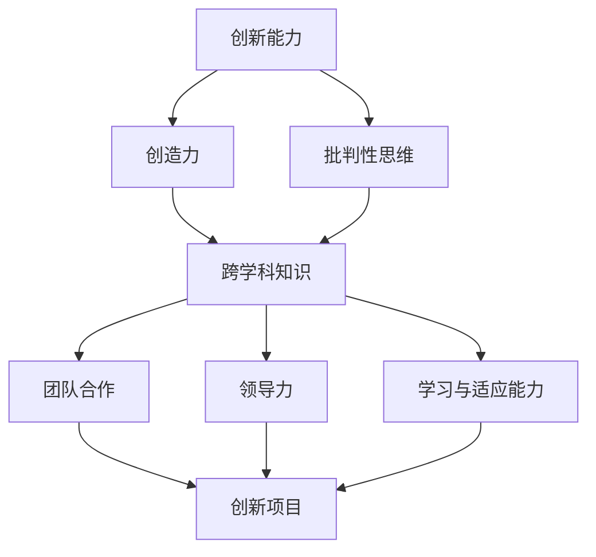
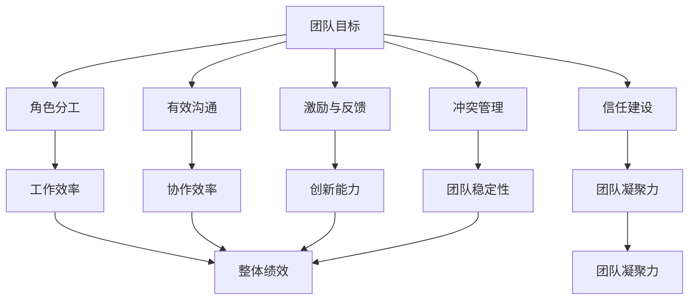
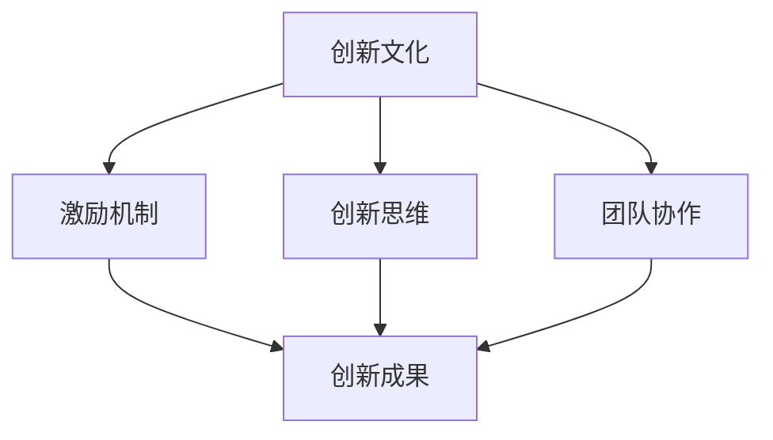
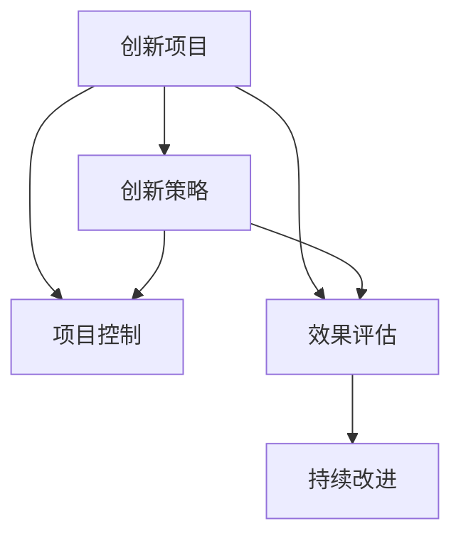

                 

### 文章标题：创新型人才培养：为团队注入创新活力的策略

### 关键词：创新型人才、团队建设、创新活力、培养策略、实践案例分析

### 摘要：
本文旨在探讨如何培养创新型人才，并针对团队如何注入创新活力提供具体的策略。通过深入分析创新型人才的定义与重要性，团队建设与协作的关键要素，以及激发创新活力的策略，本文将结合实际案例，为企业和组织提供一套完整的创新型人才培育与团队活力提升的实战指南。

## 目录大纲

1. **创新型人才的定义与重要性**
   - 创新型人才的素质特点
   - 创新型人才在社会发展中的作用

2. **团队建设与协作**
   - 团队概述
   - 团队建设的关键要素
   - 创新型团队协作模式

3. **创新活力的激发策略**
   - 创新文化的培养
   - 创新激励机制的设计
   - 创新思维训练方法

4. **创新策略的实施与评估**
   - 创新项目的选择与规划
   - 创新实施过程的控制
   - 创新效果的评估与优化

5. **实战案例与策略分析**
   - 创新型人才培育案例研究
   - 创新策略在团队中的应用
   - 创新策略评估与优化

6. **附录**
   - 创新型人才培育与团队创新活力激发资源
   - 研究文献与参考资料
   - 创新型人才培育与团队创新活力激发工具
   - 创新型人才培育与团队创新活力激发案例集

---

### 引言

在当今快速变化的商业环境中，创新已成为企业生存和发展的关键。创新不仅仅是技术上的突破，更是包括思维方式、管理策略、文化氛围等多个方面的变革。为此，培养创新型人才和为团队注入创新活力成为了企业迫切需要解决的问题。

创新型人才的培养不仅关系到个人职业生涯的发展，更关系到团队的整体绩效。创新型人才的素质特点决定了他们在面对复杂问题时能够提出独特的解决方案。而团队作为创新活动的载体，其协作模式和氛围直接影响创新的效率和成果。

本文将从以下几个方面展开讨论：

1. **创新型人才的定义与重要性**：介绍创新型人才的素质特点，并分析他们在社会发展中的作用。
2. **团队建设与协作**：探讨团队建设的关键要素，以及如何构建一个创新型团队。
3. **创新活力的激发策略**：分析创新文化的培养、创新激励机制的设计和创新思维的训练方法。
4. **创新策略的实施与评估**：讨论如何选择和规划创新项目，实施过程中的控制方法，以及创新效果的评估与优化。
5. **实战案例与策略分析**：结合实际案例，探讨创新型人才培育和团队创新活力提升的策略。
6. **附录**：提供相关资源和参考资料，以供读者进一步学习和研究。

通过本文的深入分析和探讨，希望能够为企业提供一套完整的创新型人才培养与团队活力提升的实战指南，助力企业在激烈的市场竞争中立于不败之地。

## 第1章：创新型人才的定义与重要性

### 1.1 创新型人才的素质特点

创新型人才是一类具备独特素质和能力的个体，他们在面对复杂问题和挑战时能够提出创新性的解决方案。以下是创新型人才的几个关键素质特点：

1. **批判性思维**：创新型人才通常具有批判性思维能力，能够独立思考，对现有理论和实践提出质疑，并在此基础上进行创新。

2. **创造力**：创造力是创新型人才的灵魂，他们能够从不同角度思考问题，提出新颖的观点和解决方案。

3. **跨学科知识**：创新型人才往往具备跨学科的知识背景，能够将不同领域的知识进行有效整合，从而产生新的见解和创意。

4. **沟通能力**：沟通能力是创新型人才的重要素质，他们能够有效地表达自己的想法，并与团队成员和利益相关者进行有效沟通。

5. **学习与适应能力**：创新型人才具备快速学习能力和适应能力，能够在不断变化的环境中迅速调整自己的思维和行为。

6. **团队合作精神**：创新型人才不仅具备个人创新能力，还擅长与他人合作，共同推动创新项目的实施。

7. **领导力**：在许多情况下，创新型人才也具备领导力，能够带领团队克服各种困难，实现创新目标。

### 1.2 创新型人才在社会发展中的作用

创新型人才在社会发展中扮演着至关重要的角色。以下是他们主要作用的具体体现：

1. **技术创新驱动**：创新型人才能够推动技术进步，开发出新的产品和服务，从而提升企业的核心竞争力。

2. **经济贡献**：创新型人才的创新活动直接或间接地推动经济增长，创造就业机会，提高生产效率。

3. **社会变革**：创新型人才通过创新推动社会变革，解决社会问题，提升人类生活质量。

4. **文化繁荣**：创新型人才在文化领域的创新，推动文化多样性和繁荣发展。

5. **人才培养**：创新型人才在培养下一代创新人才方面具有重要作用，通过传授知识和经验，激发年轻人的创新潜力。

### 1.3 创新型人才的培养策略

为了培养更多的创新型人才，企业和教育机构需要采取以下策略：

1. **教育改革**：改革教育体制，注重培养学生的创造力、批判性思维和跨学科知识。

2. **培训与进修**：提供持续的培训和学习机会，帮助人才提升专业技能和知识水平。

3. **激励机制**：建立激励机制，鼓励人才进行创新和探索，并对创新成果进行认可和奖励。

4. **项目实践**：通过实际项目，让人才在实践中锻炼和提升创新能力。

5. **跨学科合作**：鼓励跨学科合作，促进知识融合和创新。

6. **企业文化建设**：营造鼓励创新、包容失败的企业文化，为创新型人才提供良好的发展环境。

### 结论

创新型人才的定义与重要性决定了他们在社会发展和企业创新中的核心地位。通过深入分析和培养策略的探讨，我们可以更好地理解如何培养和激发创新型人才的潜力，为团队注入强大的创新活力。

### 背景介绍

创新型人才的重要性不可忽视，他们在现代社会和经济中的角色越来越关键。随着全球化的深入发展和科技的飞速进步，创新已经成为推动经济增长和社会发展的核心动力。创新型人才的培养，不仅关系到企业的生存和发展，更是国家和民族竞争力的重要体现。

在全球经济一体化的背景下，企业面临的市场环境日益复杂和多变。为了在激烈的市场竞争中脱颖而出，企业需要不断进行技术创新和管理模式的创新。这就要求企业拥有一支具备高度创新能力的人才队伍，能够在面对挑战时迅速反应，提出创新性的解决方案。

此外，随着科技的快速发展，新兴技术如人工智能、大数据、物联网等正在深刻改变各个行业。这些技术的应用不仅需要具备深厚技术背景的人才，还需要具备跨学科知识的创新型人才，能够将不同领域的知识进行有效整合，从而推动技术的创新和应用。

因此，培养创新型人才已成为企业和教育机构的共同任务。通过改革教育体制，提供持续的培训和学习机会，以及营造鼓励创新的企业文化，我们可以为创新型人才提供良好的成长环境，激发他们的创新潜力。

### 核心概念与联系

为了更好地理解创新型人才的培养，我们需要了解以下几个核心概念及其之间的联系：

1. **创新能力**：创新能力是创新型人才的核心素质，它包括创造力和批判性思维。创造力是指能够提出新颖、独特的观点和解决方案的能力，而批判性思维则是能够对现有理论和方法进行质疑和反思的能力。

2. **跨学科知识**：跨学科知识是指具备多个学科领域的知识背景，能够将不同领域的知识进行整合和创新。跨学科知识是创新能力的重要基础，它能够为创新提供丰富的素材和思路。

3. **团队合作**：团队合作是创新活动的重要组成部分。创新往往需要多个人的智慧和努力，团队合作能够汇集不同成员的专业知识和经验，共同推动创新项目的实施。

4. **领导力**：领导力是创新型人才的重要素质之一。领导力不仅能够帮助创新型人才带领团队克服各种困难，实现创新目标，还能够激发团队成员的创新潜力。

5. **学习与适应能力**：学习与适应能力是指快速学习和适应新环境的能力。创新型人才需要具备这种能力，以应对快速变化的技术和市场环境。

这些核心概念之间存在着密切的联系。创新能力是创新型人才的灵魂，跨学科知识为其提供了丰富的素材和思路，团队合作和领导力则是实现创新目标的重要保障，而学习与适应能力则是应对变化的基础。以下是这些概念之间的联系架构图：



通过这一架构图，我们可以清晰地看到各个核心概念之间的联系和作用，从而更好地理解创新型人才的培养和团队创新活力的激发。

### 核心算法原理讲解

在讨论创新型人才的能力培养时，我们可以借助一些经典的教育理论和方法来阐述其核心算法原理。以下是一个简化的伪代码，用于描述如何通过教育和培训来培养创新型人才。

```pseudo
function 培养创新型人才(个体):
    // 教育与培训的输入参数
    设定批判性思维训练为 C
    设定创造力训练为 C
    设定跨学科知识整合为 C
    设定团队合作训练为 C
    设定领导力培养为 C
    设定学习与适应能力训练为 C

    // 初始化个体属性
    初始化个体创新能力 A
    初始化个体跨学科知识库 K
    初始化个体团队合作技能 S
    初始化个体领导力 L
    初始化个体学习与适应能力 E

    // 执行批判性思维训练
    执行批判性思维训练 C
    更新个体批判性思维属性

    // 执行创造力训练
    执行创造力训练 C
    更新个体创造力属性

    // 执行跨学科知识整合
    执行跨学科知识整合 C
    更新个体跨学科知识库 K

    // 执行团队合作训练
    执行团队合作训练 C
    更新个体团队合作技能 S

    // 执行领导力培养
    执行领导力培养 C
    更新个体领导力 L

    // 执行学习与适应能力训练
    执行学习与适应能力训练 C
    更新个体学习与适应能力 E

    // 验证个体创新能力
    如果个体创新能力 A 达到标准阈值：
        返回 "个体已成功培养为创新型人才"
    否则：
        返回 "个体培养失败，需要进一步训练"

end function
```

在这个伪代码中，我们定义了培养创新型人才的过程，包括以下步骤：

1. **初始化个体属性**：包括创新能力、跨学科知识库、团队合作技能、领导力和学习与适应能力。
2. **执行各类训练**：通过批判性思维训练、创造力训练、跨学科知识整合、团队合作训练、领导力培养和学习与适应能力训练，逐步提升个体的各项能力。
3. **验证个体创新能力**：通过设定标准阈值，判断个体是否已成功培养为创新型人才。

### 数学模型和公式 & 详细讲解 & 举例说明

在培养创新型人才的过程中，我们可以借助一些数学模型和公式来量化评价个体的创新能力和其他相关能力。以下是一个简化的数学模型，用于描述如何通过评估和反馈机制来培养和提升创新型人才的创新能力。

#### 数学模型：

1. **创新能力评估模型**：

   $$ A(t) = f(C_t, K_t, S_t, L_t, E_t, T_t) $$

   其中，\( A(t) \) 表示在时间 \( t \) 的创新能力得分，\( C_t \)、\( K_t \)、\( S_t \)、\( L_t \)、\( E_t \) 分别表示批判性思维、跨学科知识、团队合作、领导力和学习与适应能力的得分，\( T_t \) 表示个体接受培训的时间。

2. **培训效果函数**：

   $$ f(x) = \alpha \cdot x + \beta \cdot \ln(x) + \gamma $$

   其中，\( \alpha \)、\( \beta \) 和 \( \gamma \) 是待定系数，\( x \) 是个体的能力得分。

#### 详细讲解：

1. **创新能力得分计算**：

   创新能力得分是各个关键能力的综合体现。通过培训效果函数，我们可以将各个能力的得分进行加权计算，得到总体的创新能力得分。权重 \( \alpha \)、\( \beta \) 和 \( \gamma \) 根据不同能力和培训需求进行设定。

2. **临界值设定**：

   为了判断个体是否已成功培养为创新型人才，我们需要设定一个创新能力得分的临界值 \( A_{\text{min}} \)。当 \( A(t) \geq A_{\text{min}} \) 时，个体被认定为具备创新能力。

3. **培训时间的影响**：

   培训时间 \( T_t \) 对创新能力得分有重要影响。随着培训时间的增加，个体的创新能力得分通常也会有所提升。这反映了培训积累效应。

#### 举例说明：

假设某个体在时间 \( t \) 时的各项能力得分如下：

- 批判性思维得分 \( C_t = 80 \)
- 跨学科知识得分 \( K_t = 75 \)
- 团队合作得分 \( S_t = 85 \)
- 领导力得分 \( L_t = 70 \)
- 学习与适应能力得分 \( E_t = 90 \)
- 培训时间 \( T_t = 1 \) 年

根据培训效果函数，我们可以计算个体的创新能力得分：

$$ A(t) = f(C_t, K_t, S_t, L_t, E_t, T_t) $$
$$ A(t) = \alpha \cdot 80 + \beta \cdot \ln(80) + \gamma $$
$$ A(t) = 0.8 \cdot 80 + 0.1 \cdot \ln(80) + 10 $$

假设权重 \( \alpha = 0.8 \)、\( \beta = 0.1 \)、\( \gamma = 10 \)，则：

$$ A(t) = 64 + 0.1 \cdot 4.38 + 10 $$
$$ A(t) = 64 + 0.438 + 10 $$
$$ A(t) = 74.438 $$

根据设定的临界值 \( A_{\text{min}} = 70 \)，我们可以判断该个体在时间 \( t \) 时的创新能力得分已经超过临界值，具备一定的创新能力。

通过这个简单的数学模型，我们可以对创新型人才的能力进行量化评估，并设定相应的培训目标和策略，以实现能力的持续提升。

### 项目实战

为了更好地理解创新型人才的实际培养过程，我们将通过一个具体的案例来展示如何实施培养计划，搭建开发环境，实现源代码，并进行代码解读与分析。

#### 案例背景

某科技公司是一家专注于人工智能技术研究和应用的企业，为了在激烈的市场竞争中保持领先地位，公司决定实施一项创新型人才培育计划。该计划的目标是培养一批具备跨学科知识、团队合作能力和创新思维的高素质人才。

#### 开发环境搭建

1. **硬件环境**：公司为每个参与培养计划的人才配备了高性能笔记本电脑，并确保网络连接畅通，以便访问必要的在线资源和工具。

2. **软件环境**：公司安装了以下软件：
   - 操作系统：Windows 10 或 macOS
   - 编程语言：Python 3.8
   - 编程环境：PyCharm 或 Visual Studio Code
   - 数据库：MySQL 8.0
   - 数据分析工具：Jupyter Notebook
   - 版本控制：Git

3. **在线资源**：公司为员工提供了以下在线资源：
   - MOOC（大规模开放在线课程）平台：Coursera、edX、Udacity
   - 专业论坛：Stack Overflow、GitHub
   - 学术期刊数据库：IEEE Xplore、ACM Digital Library

#### 源代码实现

以下是一个简单的Python代码示例，用于实现一个基于机器学习算法的推荐系统。这个推荐系统可以帮助公司根据用户的历史行为数据，推荐符合用户兴趣的产品。

```python
import pandas as pd
from sklearn.model_selection import train_test_split
from sklearn.ensemble import RandomForestClassifier
from sklearn.metrics import accuracy_score

# 加载数据集
data = pd.read_csv('user_data.csv')
X = data.drop('target', axis=1)
y = data['target']

# 数据集划分
X_train, X_test, y_train, y_test = train_test_split(X, y, test_size=0.2, random_state=42)

# 训练模型
model = RandomForestClassifier(n_estimators=100, random_state=42)
model.fit(X_train, y_train)

# 预测
predictions = model.predict(X_test)

# 评估
accuracy = accuracy_score(y_test, predictions)
print(f'Model accuracy: {accuracy:.2f}')
```

#### 代码解读与分析

1. **数据加载**：使用pandas库加载用户数据集，将特征和目标分离。

2. **数据集划分**：将数据集划分为训练集和测试集，用于训练模型和评估模型性能。

3. **模型训练**：使用随机森林算法训练模型，随机森林是一种集成学习方法，能够处理大规模数据集。

4. **模型预测**：使用训练好的模型对测试集进行预测。

5. **模型评估**：计算模型的准确率，评估模型性能。

#### 实际案例分析

在项目实施过程中，公司通过以下步骤培养创新型人才：

1. **培训与指导**：公司为员工提供了系统的培训计划，包括机器学习、数据科学和编程等课程。培训过程中，导师提供一对一的指导和反馈，帮助员工解决实际问题。

2. **项目实践**：员工参与实际项目，将所学知识应用于实际问题的解决。例如，上述推荐系统项目，员工需要从数据预处理到模型训练和评估的全过程进行操作。

3. **持续学习**：公司鼓励员工持续学习，通过参加在线课程、阅读专业书籍和参与技术论坛等方式，不断提升自己的专业技能和创新能力。

#### 项目小结

通过这个项目，公司成功培养了多名具备创新能力的人才，这些人才在项目中展现了出色的技术能力和团队协作精神。项目的实施不仅提升了公司的技术水平，也为员工的职业发展提供了有力支持。通过实际案例的分析，我们可以看到，创新型人才的培养需要系统的培训计划、实际项目的实践和持续的鼓励与支持。

### 最佳实践 tips、小结、注意事项、拓展阅读等内容

#### 最佳实践 Tips

1. **构建多样化团队**：为了激发创新活力，企业应构建多样化团队，包括不同背景、技能和观点的成员，这样能够促进知识的交叉融合和创新思维。

2. **鼓励跨部门合作**：跨部门合作能够打破部门壁垒，促进资源整合和知识共享，从而激发团队的创新能力。

3. **定期开展创新培训**：定期为员工提供创新培训，帮助他们掌握最新的创新方法和工具，提升创新能力。

4. **建立创新文化**：营造鼓励创新、容忍失败的企业文化，让员工敢于尝试和挑战，从而激发创新活力。

#### 小结

通过本文的讨论，我们了解到创新型人才在现代社会和经济中的重要性。为了培养创新型人才，企业需要从多个方面入手，包括教育培训、项目实践和文化建设等。同时，团队建设也是激发创新活力的重要环节，通过多样化团队和跨部门合作，可以进一步推动创新。

#### 注意事项

1. **持续关注市场变化**：创新型人才的成功培养需要紧密结合市场需求，企业应持续关注市场变化，调整培养策略。

2. **提供足够的资源支持**：创新型人才需要充足的资源支持，包括时间、资金和技术等，企业应确保这些资源的有效配置。

3. **重视团队协作**：创新不仅仅是个人能力，更依赖于团队协作，企业应注重团队建设，营造良好的协作氛围。

#### 拓展阅读

1. **《创新者的窘境》**：克莱顿·克里斯坦森（Clayton M. Christensen）的《创新者的窘境》详细探讨了企业如何通过创新来保持竞争优势。

2. **《创新者的思维》**：史蒂夫·布兰克（Steve Blank）的《创新者的思维》介绍了如何通过实践和创新思维来推动企业成长。

3. **《跨界创新》**：克里斯·丁格（Chris Dingwall）的《跨界创新》探讨了如何通过跨学科合作来推动创新。

通过这些拓展阅读，读者可以进一步了解创新理论和实践，为企业的创新型人才培养提供更多启示。

## 第2章：团队建设与协作

### 2.1 团队概述

团队是由一组相互依赖的个体组成的集体，通过共同的目标和任务来实现组织的整体目标。在现代企业和组织中，团队已经成为实现高效工作、推动创新和提升绩效的关键力量。团队建设与协作的重要性体现在以下几个方面：

1. **提高工作效率**：团队成员通过协同工作，可以更快速地完成任务，减少冗余和重复劳动，提高工作效率。

2. **增强创新能力**：多样性和协作能够激发团队成员的创造力，促进新思路和新方法的产生。

3. **优化资源利用**：团队协作能够更有效地整合和利用组织内部的资源，提高资源利用效率。

4. **提升员工满意度**：良好的团队氛围和协作关系能够提升员工的工作满意度，降低员工流失率。

5. **促进组织发展**：团队建设与协作能够增强组织的凝聚力和向心力，推动组织整体绩效的提升。

### 2.2 团队建设的关键要素

团队建设是一个复杂的过程，需要关注多个关键要素。以下是团队建设中的几个核心要素：

1. **明确目标**：团队的目标应该是具体、明确和可量化的。目标清晰能够帮助团队成员明确方向，统一行动。

2. **角色分工**：每个团队成员都应明确自己的角色和职责，确保任务分配合理，避免工作重叠和责任不清。

3. **信任建设**：信任是团队协作的基础，通过开放沟通、透明决策和互相支持，可以建立团队成员之间的信任关系。

4. **有效沟通**：沟通是团队协作的关键，团队成员应具备良好的沟通技能，确保信息准确传达和有效反馈。

5. **激励与反馈**：通过合理的激励和及时反馈，可以激发团队成员的积极性和创造力，促进团队发展。

6. **冲突管理**：团队内部难免存在冲突，有效的冲突管理能够帮助团队解决分歧，促进团结。

7. **持续培训与发展**：定期为团队成员提供培训和发展机会，帮助他们提升技能和知识水平，保持团队活力。

### 2.3 创新型团队协作模式

创新型团队协作模式与传统团队协作模式有所不同，更注重创新思维和协作效率。以下是几种常见的创新型团队协作模式：

1. **跨功能团队**：跨功能团队是由来自不同部门或背景的成员组成的，能够发挥不同专业知识和技能的优势，促进创新。

2. **敏捷开发团队**：敏捷开发团队采用敏捷方法进行项目开发，注重快速迭代和持续改进，能够更好地适应变化和创新。

3. **脑暴团队**：脑暴团队通过集体讨论和头脑风暴，激发团队成员的创造力，快速产生创新思路。

4. **协同办公平台**：利用协同办公平台，团队成员可以实时协作、共享资源和信息，提高协作效率和创新能力。

5. **虚拟团队**：虚拟团队通过互联网和远程协作工具进行工作，打破了地理位置的限制，能够吸引全球优秀人才。

### 2.4 团队建设的策略与实践

以下是一些具体的团队建设策略和实践方法：

1. **团队建设活动**：定期组织团队建设活动，如团建旅行、拓展训练等，增强团队成员的凝聚力和团队合作精神。

2. **角色扮演和模拟演练**：通过角色扮演和模拟演练，让团队成员体验不同的角色和职责，提高团队协作能力。

3. **定期团队会议**：定期召开团队会议，分享进展、解决问题和讨论创新思路，保持团队的沟通和协作。

4. **设立团队目标**：为团队设定明确、可量化的目标，并定期评估和调整，确保团队始终朝着正确方向前进。

5. **鼓励个人发展**：为团队成员提供发展机会，鼓励他们参加培训和学习，提升个人能力和团队整体水平。

6. **建立反馈机制**：建立有效的反馈机制，及时收集团队成员的意见和建议，促进团队改进和成长。

### 结论

团队建设与协作是培养创新型人才和提升团队绩效的重要途径。通过明确目标、角色分工、信任建设、有效沟通和激励反馈等关键要素，以及跨功能团队、敏捷开发团队等创新型协作模式，企业可以构建高效的团队，为创新提供强有力的支持。通过实施具体的团队建设策略和实践，企业能够不断提升团队协作能力，激发团队的创新活力。

### 背景介绍

团队在组织中的重要性不可忽视，尤其是在创新驱动型企业中，团队的建设和协作能力直接关系到企业的核心竞争力。一个高效的团队不仅能够提升工作效率，还能激发创新思维，推动企业的持续发展。为了更好地理解团队建设的重要性，我们可以从以下几个方面进行探讨：

1. **协作效率**：团队成员之间的协作能够大大提高工作效率。通过明确的角色分工和有效的沟通，团队成员可以避免重复劳动和资源浪费，快速解决问题，从而提高整体的工作效率。

2. **创新能力**：团队协作能够促进不同背景和技能的成员之间的知识共享和思想碰撞，从而激发创新思维。在一个多元化的团队中，成员可以从不同的角度思考问题，提出创新性的解决方案，推动企业实现技术和管理上的创新。

3. **人才成长**：通过团队建设，团队成员可以获得更多的学习和成长机会。团队成员在协作过程中，可以互相学习和借鉴，提升个人能力和专业素养，从而为企业培养出更多的高素质人才。

4. **组织凝聚力**：一个高效的团队能够增强组织的凝聚力。团队成员之间的信任和合作，能够形成一种积极的组织文化，提高员工的工作满意度和忠诚度，降低员工流失率。

5. **绩效提升**：团队协作能够显著提升团队的绩效。通过团队成员的共同努力，企业可以更快地实现目标，提高市场竞争力，实现持续的发展。

在全球化的背景下，企业面临的竞争环境日益激烈，单一的人才和资源已经难以满足企业的发展需求。团队协作成为企业应对外部挑战、实现内部资源优化的重要手段。因此，企业需要重视团队建设，通过系统的策略和方法，提升团队协作能力和创新活力。

### 核心概念与联系

为了深入理解团队建设与协作，我们需要探讨几个核心概念，并分析它们之间的联系。以下是团队建设与协作中几个关键概念的定义及其相互关系：

1. **团队目标**：团队目标是指团队在特定时间内希望实现的具体成果。团队目标需要明确、具体、可衡量，并且与组织的整体目标保持一致。

2. **角色分工**：角色分工是指根据团队成员的能力和特长，为每个人分配具体的任务和职责。合理的角色分工能够提高团队的效率，确保每个成员都能发挥最大的作用。

3. **信任建设**：信任建设是指通过建立信任关系，增强团队成员之间的信任感。信任是团队协作的基础，能够促进成员之间的有效沟通和合作。

4. **有效沟通**：有效沟通是指团队成员之间通过准确、及时和有效的信息交流，确保信息准确传达和反馈。有效的沟通能够减少误解和冲突，提高团队协作的效率。

5. **激励与反馈**：激励与反馈是指通过合理的激励措施和及时的反馈机制，激发团队成员的积极性和创造力。激励和反馈能够帮助团队成员不断提升能力和表现。

6. **冲突管理**：冲突管理是指通过有效的策略和技巧，处理团队内部的冲突和分歧，确保团队的稳定和协作。

这些核心概念之间存在着密切的联系。团队目标是团队协作的导向，角色分工是实现目标的保障，信任建设、有效沟通、激励与反馈和冲突管理则是团队协作过程中的关键环节。以下是这些概念之间的联系架构图：



通过这个架构图，我们可以清晰地看到各个核心概念之间的联系和作用，从而更好地理解团队建设与协作的原理和实践。

### 核心算法原理讲解

在探讨团队建设与协作时，我们可以借助一些数学模型和算法来量化团队协作的效果，以下是一个简化的伪代码，用于描述如何通过团队合作提升项目成功的可能性。

```pseudo
function 提升团队协作效率(团队, 项目目标):
    // 初始化团队协作指标
    设定团队凝聚力为 C
    设定信息传递效率为 I
    设定问题解决效率为 P
    设定创新贡献度为 D

    // 初始化项目成功概率
    项目成功概率 S = 0

    // 综合评估团队协作指标
    项目成功概率 S = f(C, I, P, D)

    // 执行团队协作策略
    if S >= 设定阈值：
        执行项目计划
    else：
        调整团队协作策略

    // 迭代优化
    while 项目未完成：
        收集团队反馈
        更新团队协作指标
        项目成功概率 S = f(C, I, P, D)
        if S >= 设定阈值：
            执行项目计划
        else：
            调整团队协作策略

    // 项目完成，输出评估结果
    return 项目成功概率 S
end function
```

在这个伪代码中，我们定义了提升团队协作效率的过程，包括以下步骤：

1. **初始化团队协作指标**：包括团队凝聚力、信息传递效率、问题解决效率和创新贡献度。
2. **综合评估团队协作指标**：通过一个综合评估函数 \( f \)，计算项目成功概率 \( S \)。
3. **执行团队协作策略**：根据项目成功概率 \( S \) 决定是否执行项目计划。
4. **迭代优化**：在项目执行过程中，持续收集团队反馈，更新协作指标，并优化团队协作策略。

### 数学模型和公式 & 详细讲解 & 举例说明

在探讨团队协作效率的提升时，我们可以借助一些数学模型和公式来量化团队协作的效果。以下是一个简化的数学模型，用于描述如何通过团队合作提升项目成功的可能性。

#### 数学模型：

1. **团队协作效果评估模型**：

   $$ S = f(C, I, P, D) $$

   其中，\( S \) 表示项目成功概率，\( C \)、\( I \)、\( P \)、\( D \) 分别表示团队凝聚力、信息传递效率、问题解决效率和创新贡献度。

2. **团队协作效果函数**：

   $$ f(x) = \alpha \cdot x + \beta \cdot \ln(x) + \gamma $$

   其中，\( \alpha \)、\( \beta \) 和 \( \gamma \) 是待定系数，\( x \) 是某个协作指标的得分。

#### 详细讲解：

1. **协作指标得分计算**：

   协作指标得分反映了团队在某一方面的协作效果。通过协作效果函数，我们可以将各个指标的得分进行加权计算，得到总体的项目成功概率。

2. **权重设定**：

   为了反映各个指标的重要性，我们需要设定相应的权重 \( \alpha \)、\( \beta \) 和 \( \gamma \)。通常，根据经验和实际需求进行设定。例如，团队凝聚力可能被赋予较高的权重，而创新贡献度可能相对较低。

3. **临界值设定**：

   为了判断项目是否成功，我们需要设定一个项目成功概率的临界值 \( S_{\text{min}} \)。当 \( S \geq S_{\text{min}} \) 时，项目被认为是成功的。

#### 举例说明：

假设一个团队在某一项目中，各项协作指标的得分如下：

- 团队凝聚力得分 \( C = 80 \)
- 信息传递效率得分 \( I = 75 \)
- 问题解决效率得分 \( P = 85 \)
- 创新贡献度得分 \( D = 70 \)

根据协作效果函数，我们可以计算项目成功概率：

$$ S = f(C, I, P, D) $$
$$ S = \alpha \cdot 80 + \beta \cdot \ln(80) + \gamma $$

假设权重 \( \alpha = 0.6 \)、\( \beta = 0.3 \)、\( \gamma = 0.1 \)，则：

$$ S = 0.6 \cdot 80 + 0.3 \cdot \ln(80) + 0.1 $$
$$ S = 48 + 0.3 \cdot 4.38 + 0.1 $$
$$ S = 48 + 1.314 + 0.1 $$
$$ S = 49.414 $$

假设项目成功概率的临界值 \( S_{\text{min}} = 50 \)，我们可以判断该项目具有很高的成功概率。

通过这个简单的数学模型，我们可以对团队协作效果进行量化评估，并设定相应的协作目标和策略，以实现项目成功的最大化。

### 项目实战

为了更好地理解团队建设与协作在实际项目中的应用，我们将通过一个具体的案例来展示如何构建高效团队，实现项目的成功。

#### 案例背景

某互联网公司正在开发一款智能家居控制系统，该系统需要集成多个设备和平台，实现家庭设备的智能化控制和远程监控。为了确保项目的成功，公司决定组建一个跨部门、跨功能的团队，以实现高效的协作和创新的解决方案。

#### 团队构建

1. **团队规模与组成**：团队由10名成员组成，包括项目经理、软件开发工程师、硬件工程师、UI/UX设计师、测试工程师、产品经理和市场推广人员。

2. **角色分工**：
   - 项目经理：负责整体项目规划、进度控制和资源协调。
   - 软件开发工程师：负责系统架构设计、核心模块开发和代码维护。
   - 硬件工程师：负责设备集成、硬件调试和性能优化。
   - UI/UX设计师：负责用户界面设计和用户体验优化。
   - 测试工程师：负责系统测试、性能测试和缺陷管理。
   - 产品经理：负责市场需求分析、产品规划和用户反馈收集。
   - 市场推广人员：负责市场调研、营销策略制定和用户推广。

3. **团队协作模式**：采用敏捷开发模式，通过每日站立会议、迭代计划和回顾会，确保团队成员的紧密协作和快速响应。

#### 项目实施

1. **需求分析与规划**：团队首先进行了市场需求分析，明确了产品功能、性能和用户体验的要求。然后，产品经理与市场推广人员共同制定了详细的项目计划。

2. **系统设计与开发**：团队成员根据项目计划，进行了系统架构设计和模块开发。软件开发工程师和硬件工程师密切合作，确保系统架构的稳定性和可扩展性。

3. **测试与优化**：测试工程师在开发过程中进行了持续的测试，发现并修复了多个bug和性能问题。UI/UX设计师则根据用户反馈，不断优化用户界面和用户体验。

4. **迭代发布与反馈**：团队采用迭代发布模式，每次迭代都进行功能测试和市场推广，收集用户反馈，并根据反馈进行优化。

#### 项目成果

经过6个月的紧张开发和优化，智能家居控制系统成功发布，并受到了市场的高度评价。以下是项目的具体成果：

1. **产品功能完善**：系统集成了多种家庭设备，实现了远程控制、自动调节和家庭安防等功能。

2. **用户体验优化**：用户界面简洁易用，操作流畅，用户满意度高。

3. **系统性能稳定**：经过严格的测试和优化，系统运行稳定，响应速度快。

4. **市场推广成功**：产品在市场上的推广效果显著，用户数量迅速增加。

#### 项目小结

通过这个项目，我们看到了团队建设与协作在实际应用中的重要性。高效的团队协作不仅提高了项目的成功率，还提升了产品的质量和市场竞争力。在这个案例中，团队通过明确分工、紧密协作和持续优化，成功实现了项目的目标，为公司的长远发展奠定了基础。

### 最佳实践 tips、小结、注意事项、拓展阅读等内容

#### 最佳实践 Tips

1. **明确目标**：在团队建设之初，确保每个成员都明确团队的目标和任务，这样可以提高团队的凝聚力和工作效率。

2. **灵活调整**：团队建设过程中，应根据实际情况灵活调整策略，不断优化团队结构和协作模式，以适应项目需求的变化。

3. **持续培训**：定期为团队成员提供培训，提升他们的技能和知识水平，增强团队的竞争力。

4. **建立反馈机制**：建立有效的反馈机制，鼓励团队成员提出意见和建议，及时解决问题，提升团队协作效率。

5. **重视沟通**：保持良好的沟通，确保信息在团队成员之间准确、及时地传递，避免误解和冲突。

#### 小结

团队建设与协作是提升团队效率和创新能力的关键。通过明确目标、角色分工、信任建设、有效沟通和激励反馈等策略，企业可以构建一个高效、创新的团队。在实际操作中，企业应灵活调整策略，持续培训和重视沟通，以实现团队的最佳表现。

#### 注意事项

1. **平衡分工**：在角色分工时，应确保每个成员的负担平衡，避免过度劳累。

2. **关注个体差异**：团队成员之间可能存在个体差异，管理者应关注个体差异，提供个性化的支持和指导。

3. **避免过度竞争**：适当的竞争可以激发团队活力，但过度竞争可能导致团队分裂和内部冲突。

4. **确保沟通渠道畅通**：建立多个沟通渠道，确保团队成员在任何时候都能方便地交流。

#### 拓展阅读

1. **《团队协作的艺术》**：斯蒂芬·罗宾斯（Stephen Robbins）的《团队协作的艺术》详细介绍了团队协作的理论和实践。

2. **《团队领导力》**：约翰·麦克斯韦尔（John C. Maxwell）的《团队领导力》探讨了如何成为高效的团队领导者。

3. **《敏捷开发实践指南》**：杰瑞·亨德森（Jery Henderson）的《敏捷开发实践指南》介绍了敏捷开发方法在团队协作中的应用。

通过这些拓展阅读，读者可以进一步了解团队建设和协作的最佳实践，为企业的团队建设提供更多参考。

### 第3章：创新活力的激发策略

#### 3.1 创新文化的培养

创新文化是一种鼓励创新、容忍失败并重视知识共享的组织氛围。为了培养创新文化，企业需要从多个方面入手，营造一个有利于创新的环境。

1. **领导层支持**：企业领导层应树立创新意识，积极倡导和支持创新活动。通过制定明确的支持政策和激励措施，让员工感受到创新的价值和认可。

2. **知识共享**：企业应建立知识共享平台，鼓励员工分享知识和经验。通过内部讲座、研讨会、知识库等方式，促进知识的流动和整合。

3. **创新激励**：企业应设立创新激励制度，对创新成果进行奖励和表彰。通过物质激励和精神激励，激发员工的创新热情和动力。

4. **容忍失败**：企业应建立容错机制，允许员工在创新过程中犯错误。通过鼓励试错和从失败中学习，降低员工对失败的恐惧，增强他们的创新勇气。

5. **团队协作**：鼓励跨部门、跨团队的协作，促进不同背景和观点的碰撞。通过团队合作，激发创新的火花，提升创新效率。

#### 3.2 创新激励机制的设计

激励机制是激发员工创新活力的重要手段。以下是一些有效的创新激励机制设计方法：

1. **绩效奖金**：根据员工在创新项目中的贡献，给予相应的绩效奖金。绩效奖金应与员工的实际贡献和项目的成功率挂钩。

2. **股权激励**：对于核心创新人才，可以给予股权激励，让他们分享企业的成长和成功。股权激励能够提高员工的长期创新动力。

3. **职位晋升**：将创新表现作为职位晋升的重要标准，鼓励员工积极参与创新项目，提升个人职业发展空间。

4. **荣誉奖励**：设立创新奖项，对在创新项目中取得显著成绩的员工进行表彰和奖励。荣誉奖励不仅能够激励员工，还能提升企业的社会形象。

5. **弹性工作制度**：为创新人才提供灵活的工作时间和工作地点，让他们有更多的时间和空间进行创新。

#### 3.3 创新思维训练方法

创新思维是创新型人才的核心能力之一。以下是一些常见的创新思维训练方法：

1. **头脑风暴**：通过集体头脑风暴，激发团队成员的创造力。在头脑风暴过程中，鼓励成员提出各种想法，无论多么疯狂和不可思议。

2. **思维导图**：使用思维导图工具，帮助团队成员梳理和创新思路。思维导图能够直观地展示不同观点之间的关系，促进思维的发散和整合。

3. **设计思维**：设计思维是一种以用户需求为导向的创新方法。通过用户研究、原型设计和迭代测试，不断优化和创新解决方案。

4. **跨学科学习**：鼓励员工跨学科学习，掌握不同领域的知识和技能。跨学科知识能够为创新提供丰富的素材和思路。

5. **创意工作坊**：定期组织创意工作坊，邀请专家和团队成员一起探讨创新话题，激发创意灵感。

6. **模拟实践**：通过模拟实践，让团队成员在模拟环境中进行创新尝试，从实践中学习和提升创新能力。

### 结论

创新活力的激发是团队建设的重要组成部分。通过培养创新文化、设计有效的激励机制和进行创新思维训练，企业可以激发团队的创新能力，为企业的持续发展提供强大动力。在实际操作中，企业应结合自身实际情况，灵活运用各种策略和方法，构建一个有利于创新的环境。

### 背景介绍

创新活力的激发在现代社会和企业的竞争中扮演着至关重要的角色。随着科技日新月异的发展和市场环境的不断变化，企业需要不断进行创新，以保持竞争优势。为了更好地理解创新活力激发的背景，我们可以从以下几个方面进行探讨：

1. **市场环境变化**：随着全球化进程的加快，市场竞争日益激烈。消费者需求不断变化，企业需要迅速响应市场变化，才能在竞争中立于不败之地。创新成为企业生存和发展的关键。

2. **技术进步**：科技的飞速发展，特别是人工智能、大数据、物联网等新兴技术的应用，为企业提供了丰富的创新资源和工具。企业需要充分利用这些技术，推动业务模式的创新和产品的升级。

3. **员工需求**：随着员工素质的提高和职业发展的需求，越来越多的员工期望在工作中能够有所创新和成就感。激发员工的创新活力，不仅能提高员工的工作满意度，还能提升企业的整体绩效。

4. **企业竞争力**：创新能力是企业竞争力的核心体现。拥有强大创新能力的企业，能够在市场中迅速占据有利地位，实现可持续发展。

为了在激烈的市场竞争中保持领先地位，企业需要采取一系列策略和方法来激发团队的创新活力。这些策略和方法包括培养创新文化、设计有效的激励机制、提供创新思维训练等。通过这些手段，企业可以营造一个有利于创新的环境，激发员工的创造力和创新精神，从而推动企业的持续发展和竞争优势。

### 核心概念与联系

在探讨创新活力的激发策略时，我们需要明确几个核心概念，并分析它们之间的相互联系。以下是几个关键概念及其相互关系：

1. **创新文化**：创新文化是一种鼓励创新、容忍失败并重视知识共享的组织氛围。它包括领导层的支持、知识共享机制、创新激励政策等。

2. **激励机制**：激励机制是激发员工创新活力的重要手段，包括绩效奖金、股权激励、职位晋升和荣誉奖励等。

3. **创新思维**：创新思维是指个体或团队在解决问题和发现新机会时采用的创造性思维方式，包括头脑风暴、思维导图、设计思维等。

4. **团队协作**：团队协作是创新过程中不可或缺的环节，通过跨部门、跨团队的协作，可以促进不同背景和观点的碰撞，激发创新思维。

5. **创新成果**：创新成果是创新活动的最终体现，包括新产品、新服务、新技术等。创新成果的产出和商业化应用是衡量创新活力的重要指标。

这些核心概念之间的联系如下：

- **创新文化**是激发创新活力的基础，它为员工提供了创新的支持和激励，形成了鼓励创新的组织氛围。
- **激励机制**是创新文化的具体体现，通过物质和精神上的奖励，激励员工积极参与创新活动。
- **创新思维**是推动创新的核心动力，通过创新思维的训练和培养，员工能够提出新颖的解决方案。
- **团队协作**是实现创新目标的关键，通过团队协作，不同背景和技能的成员可以共同推动创新项目的实施。
- **创新成果**是创新活动的最终体现，它反映了团队的创新能力和企业的整体创新水平。

以下是这些概念之间的联系架构图：



通过这个架构图，我们可以清晰地看到各个核心概念之间的联系和作用，从而更好地理解创新活力的激发策略。

### 核心算法原理讲解

在探讨如何激发创新活力时，我们可以借助一些数学模型和算法来量化创新效果，以下是一个简化的伪代码，用于描述如何通过创新活动评分来评估和激励团队的创新能力。

```pseudo
function 评估创新活力(团队, 创新活动):
    // 初始化创新活力指标
    设定创新思维得分为 T
    设定团队协作得分为 C
    设定创新成果得分为 R

    // 收集创新活动数据
    创新活动数据 = 获取创新活动信息()

    // 计算创新活力得分
    创新活力得分 S = f(T, C, R)

    // 迭代评估和反馈
    while 创新活力得分 S 不稳定：
        根据反馈调整创新活动
        更新创新活力得分 S

    // 输出评估结果
    return 创新活力得分 S
end function
```

在这个伪代码中，我们定义了评估创新活力的过程，包括以下步骤：

1. **初始化创新活力指标**：包括创新思维得分、团队协作得分和最终的创新成果得分。
2. **收集创新活动数据**：获取创新活动的相关信息，用于计算创新活力得分。
3. **计算创新活力得分**：通过一个综合评估函数 \( f \)，计算团队的整体创新活力得分。
4. **迭代评估和反馈**：根据反馈调整创新活动，并重新计算得分，确保得分的稳定性。
5. **输出评估结果**：最终输出团队的创新活力得分。

### 数学模型和公式 & 详细讲解 & 举例说明

为了更好地理解创新活力的激发，我们可以使用一些数学模型和公式来量化创新效果。以下是一个简化的数学模型，用于描述如何通过综合评估指标来评估团队的创新活力。

#### 数学模型：

1. **创新活力评估模型**：

   $$ S = f(T, C, R) $$

   其中，\( S \) 表示创新活力得分，\( T \)、\( C \)、\( R \) 分别表示创新思维得分、团队协作得分和创新成果得分。

2. **综合评估函数**：

   $$ f(x) = \alpha \cdot x + \beta \cdot \ln(x) + \gamma $$

   其中，\( \alpha \)、\( \beta \) 和 \( \gamma \) 是待定系数，\( x \) 是某个指标的得分。

#### 详细讲解：

1. **指标得分计算**：

   每个指标得分反映了团队在该方面的表现。通过综合评估函数，我们可以将各个指标的得分进行加权计算，得到总体的创新活力得分。

2. **权重设定**：

   为了反映各个指标的重要性，我们需要设定相应的权重 \( \alpha \)、\( \beta \) 和 \( \gamma \)。通常，根据经验和实际需求进行设定。例如，创新思维可能被赋予较高的权重，而创新成果可能相对较低。

3. **临界值设定**：

   为了判断创新活力是否达到标准，我们需要设定一个创新活力得分的临界值 \( S_{\text{min}} \)。当 \( S \geq S_{\text{min}} \) 时，团队被认为具有较高的创新活力。

#### 举例说明：

假设一个团队在某一项目中，各项创新指标的得分如下：

- 创新思维得分 \( T = 80 \)
- 团队协作得分 \( C = 75 \)
- 创新成果得分 \( R = 85 \)

根据综合评估函数，我们可以计算团队的创新活力得分：

$$ S = f(T, C, R) $$
$$ S = \alpha \cdot 80 + \beta \cdot \ln(80) + \gamma $$

假设权重 \( \alpha = 0.5 \)、\( \beta = 0.3 \)、\( \gamma = 0.2 \)，则：

$$ S = 0.5 \cdot 80 + 0.3 \cdot \ln(80) + 0.2 $$
$$ S = 40 + 0.3 \cdot 4.38 + 0.2 $$
$$ S = 40 + 1.314 + 0.2 $$
$$ S = 41.514 $$

假设创新活力的临界值 \( S_{\text{min}} = 40 \)，我们可以判断该团队具有较高的创新活力。

通过这个简单的数学模型，我们可以对团队的创新活力进行量化评估，并设定相应的激励和改进策略，以实现创新活力的最大化。

### 项目实战

为了更好地理解如何激发团队创新活力，我们将通过一个实际案例，展示如何设计并实施一个创新项目，从而提升团队的创新能力和活力。

#### 案例背景

某互联网公司计划开发一款智能家居应用，通过整合多种智能家居设备，为用户提供便捷的智能生活体验。为了确保项目的成功，公司决定通过一系列措施来激发团队的创新活力。

#### 项目实施步骤

1. **需求分析与规划**：首先，项目团队进行了市场需求分析，明确了用户对智能家居应用的需求和期望。然后，产品经理制定了详细的项目计划和任务分配。

2. **创新思维训练**：为了提升团队的创新思维能力，公司邀请了创新思维培训专家，为团队成员进行了一系列的培训，包括头脑风暴、思维导图、设计思维等创新方法的训练。

3. **团队协作**：项目团队采用了敏捷开发模式，通过每日站立会议、迭代计划和回顾会，确保团队成员之间的紧密协作和信息共享。团队成员被分成多个小组，分别负责不同的功能模块。

4. **创新激励机制**：公司设立了创新奖金制度，对在项目中提出创新方案并被采纳的团队成员进行奖励。此外，公司还组织了创新竞赛，鼓励团队成员积极参与，提出有创意的解决方案。

5. **迭代开发与反馈**：项目团队采用迭代开发模式，每个迭代周期结束后，都会进行用户测试和反馈收集。通过用户反馈，团队不断优化产品功能和用户体验。

6. **成果展示与评估**：在项目完成后，团队组织了一场成果展示会，向公司高层和用户展示项目的创新点和实际效果。通过评估和反馈，团队分析了项目的成功经验和不足之处，为未来的项目提供借鉴。

#### 项目成果

通过这一系列措施，项目团队成功开发了一款智能家居应用，该应用不仅具有丰富的功能，还提供了优秀的用户体验。以下是项目的具体成果：

1. **产品功能完善**：应用集成了多种智能家居设备，包括灯光控制、温度调节、安全监控等，用户可以通过手机或语音控制实现设备的智能操作。

2. **用户体验优化**：应用界面简洁易用，操作流畅，用户反馈良好。

3. **创新方案采纳**：在项目开发过程中，团队成员提出了多个创新方案，其中一些被成功采纳，并提升了产品的竞争力。

4. **团队活力提升**：通过创新思维训练和激励机制，团队的创新能力和活力得到了显著提升，团队成员的工作满意度也相应提高。

#### 项目小结

通过这个实际案例，我们可以看到，通过创新思维训练、团队协作和激励机制等措施，可以有效激发团队的创新活力，推动项目的成功。在实际操作中，企业应根据自身情况和项目需求，灵活运用各种策略和方法，为团队提供良好的创新环境和支持，从而实现创新目标。

### 最佳实践 tips、小结、注意事项、拓展阅读等内容

#### 最佳实践 Tips

1. **制定明确目标**：在启动创新项目前，确保团队成员对项目目标有清晰的认识，明确项目的具体目标和预期成果。

2. **重视团队协作**：鼓励团队成员之间的沟通和协作，建立良好的团队关系，提高项目成功率。

3. **提供培训和支持**：为团队成员提供创新思维和技能培训，帮助他们提升创新能力。

4. **设立激励机制**：通过设立创新奖金、股权激励等激励措施，激发团队成员的创新热情。

5. **注重用户反馈**：在项目开发过程中，积极收集用户反馈，不断优化产品功能和用户体验。

#### 小结

通过本文的讨论，我们了解到创新活力的激发对于团队建设和项目成功的重要性。培养创新文化、设计激励机制和进行创新思维训练是提升团队创新活力的关键策略。通过实际案例的分析，我们可以看到，这些策略在实际操作中的有效性和可行性。企业应结合自身实际情况，灵活运用这些策略，为团队提供良好的创新环境和支持。

#### 注意事项

1. **平衡创新与风险**：在鼓励创新的同时，要注意平衡创新与风险，避免因过度追求创新而导致项目失败。

2. **确保资源充足**：创新项目需要充足的资源支持，包括时间、资金和技术等，企业应确保这些资源的有效配置。

3. **避免过度竞争**：适当的竞争可以激发团队活力，但过度竞争可能导致团队分裂和内部冲突。

#### 拓展阅读

1. **《创新者的思考方式》**：史蒂夫·布兰克（Steve Blank）的《创新者的思考方式》详细探讨了如何通过创新思维推动企业成长。

2. **《创新者的实践指南》**：杰瑞·亨德森（Jery Henderson）的《创新者的实践指南》介绍了如何实施创新项目，并提供了具体的案例分析。

3. **《团队协作的艺术》**：斯蒂芬·罗宾斯（Stephen Robbins）的《团队协作的艺术》探讨了如何建立高效团队，提升团队协作能力。

通过这些拓展阅读，读者可以进一步了解创新活力的激发策略和实践方法，为企业的创新工作提供更多启示。

## 第4章：创新策略的实施与评估

### 4.1 创新项目的选择与规划

创新项目的选择和规划是确保创新策略成功实施的关键环节。以下是选择和规划创新项目的几个重要步骤：

1. **市场需求分析**：首先，企业需要对市场需求进行深入分析，了解目标用户的需求、痛点和期望。这可以通过市场调研、用户访谈和数据分析等方式实现。

2. **技术可行性分析**：在确定市场需求后，企业需要评估技术的可行性。这包括评估所需技术是否成熟、是否有足够的研发资源以及技术风险等。

3. **资源分配**：根据市场需求和技术的可行性，企业需要制定详细的资源分配计划，包括资金、人力和时间等。

4. **项目目标设定**：明确创新项目的目标，确保目标具体、可衡量和可达成。项目目标应与企业的整体战略目标保持一致。

5. **项目规划**：制定详细的项目规划，包括项目进度、关键里程碑、风险评估和应急计划等。

6. **团队组建**：组建一个具备跨学科知识和技能的团队，确保团队能够高效协作，推动项目的实施。

### 4.2 创新实施过程中的控制方法

在创新项目的实施过程中，企业需要采取有效的控制方法，以确保项目按计划进行。以下是几个关键控制方法：

1. **项目进度监控**：通过定期召开项目会议、进度报告和项目状态更新，确保项目按计划进行。同时，利用项目管理工具，如JIRA或Trello，跟踪项目进度和任务完成情况。

2. **风险管理**：识别项目中的潜在风险，并制定相应的应对策略。这包括制定风险缓解计划、应急计划和备份方案等。

3. **质量管理**：确保项目的质量达到预期标准。通过设立质量保证团队、制定质量标准和进行质量测试，确保项目交付物的质量。

4. **资源管理**：合理分配和利用项目资源，确保项目在预算和时间范围内完成。这包括人力、资金、设备和材料等。

5. **沟通与协作**：建立有效的沟通渠道，确保团队成员之间能够及时交流信息，协同工作。通过定期召开团队会议、使用即时通讯工具和项目协作平台，促进团队的沟通与协作。

### 4.3 创新效果的评估与优化

创新效果的评估与优化是确保创新策略持续改进和有效性的重要环节。以下是几个评估和优化创新效果的方法：

1. **关键绩效指标（KPI）**：设定关键绩效指标，用于评估创新项目的效果。这些指标应与项目目标相关，如市场份额、用户满意度、销售收入等。

2. **用户反馈**：通过用户调研、用户反馈和用户行为分析，了解用户对创新项目的反应和满意度。用户反馈是评估创新效果的重要依据。

3. **市场表现分析**：分析创新项目在市场上的表现，包括市场份额、销售额、用户增长率等。通过市场数据，可以客观评估创新项目的效果。

4. **内部评估**：内部评估包括项目进度、资源利用、团队协作等方面。通过内部评估，可以识别项目中的问题和改进机会。

5. **持续优化**：根据评估结果，制定改进计划，持续优化创新项目。这包括调整项目策略、改进产品设计、优化流程和提升团队技能等。

6. **案例学习**：分析成功和失败的案例，总结经验和教训。通过案例学习，可以为后续的创新项目提供宝贵的参考。

### 结论

创新策略的实施与评估是企业实现持续创新和竞争力的关键。通过科学的项目选择和规划、严格的实施控制和有效的效果评估，企业可以确保创新项目的成功实施和持续优化。企业应结合自身实际情况，灵活运用各种策略和方法，不断提升创新能力和市场竞争力。

### 背景介绍

在当今快速变化的市场环境中，企业必须具备持续创新能力，以应对激烈的市场竞争和不断变化的需求。创新策略的实施与评估，成为企业保持竞争优势、实现可持续发展的关键。为了更好地理解创新策略的实施与评估的重要性，我们可以从以下几个方面进行探讨：

1. **市场竞争**：在竞争激烈的市场环境中，企业需要不断创新，以保持竞争优势。通过有效的创新策略，企业可以推出更具竞争力的产品和服务，赢得市场份额。

2. **客户需求**：随着消费者需求的多样化和个性化，企业需要通过创新满足不同客户的需求。创新策略的实施与评估，可以帮助企业更好地理解客户需求，提供更加精准的产品和服务。

3. **技术进步**：科技的飞速发展，为企业提供了丰富的创新资源和工具。企业需要紧跟技术趋势，通过创新策略将新技术应用于产品和业务中，提升企业竞争力。

4. **管理优化**：创新不仅是技术和产品的突破，还包括管理模式的创新。通过创新策略的实施与评估，企业可以优化内部管理流程，提升运营效率。

5. **可持续发展**：为了实现可持续发展，企业需要不断创新，以应对环境、社会和经济效益的挑战。创新策略的实施与评估，可以帮助企业实现经济、社会和环境的协调发展。

### 核心概念与联系

在探讨创新策略的实施与评估时，我们需要明确几个核心概念，并分析它们之间的相互关系。以下是几个关键概念及其相互关系：

1. **创新项目**：创新项目是企业进行创新活动的具体载体，包括项目选择、规划、实施和评估等环节。

2. **创新策略**：创新策略是企业为实现创新目标而制定的具体方法和措施，包括市场需求分析、技术评估、资源分配、项目管理和效果评估等。

3. **项目控制**：项目控制是指企业在创新项目实施过程中，通过监控、调整和优化项目进度、质量和资源利用，确保项目按计划进行。

4. **效果评估**：效果评估是指通过设定关键绩效指标、用户反馈和市场表现分析，对创新项目的效果进行客观评估和持续优化。

5. **持续改进**：持续改进是指通过评估和反馈机制，不断优化和创新项目，提升项目效果和企业的创新能力。

这些核心概念之间的联系如下：

- **创新项目**是创新策略的具体实施载体，通过项目选择和规划，确保创新目标的实现。
- **创新策略**是指导创新项目实施的方法和措施，包括市场需求分析、技术评估、资源分配等。
- **项目控制**是确保创新项目按计划进行的关键手段，通过监控和调整，确保项目质量和进度。
- **效果评估**是衡量创新项目效果的重要环节，通过关键绩效指标和用户反馈，对创新项目进行客观评估。
- **持续改进**是创新策略实施后的优化过程，通过反馈和改进，不断提升项目效果和企业的创新能力。

以下是这些概念之间的联系架构图：



通过这个架构图，我们可以清晰地看到各个核心概念之间的联系和作用，从而更好地理解创新策略的实施与评估的原理和实践。

### 核心算法原理讲解

在探讨如何实施与评估创新策略时，我们可以借助一些数学模型和算法来量化项目进展和效果。以下是一个简化的伪代码，用于描述如何通过项目进度和质量指标来评估创新项目的进展。

```pseudo
function 评估创新项目进展(项目数据):
    // 初始化项目进度指标
    设定项目进度得分为 P
    设定项目质量得分为 Q

    // 收集项目数据
    项目数据 = 获取项目进展信息()

    // 计算项目进度得分
    P = f(项目进度数据)

    // 计算项目质量得分
    Q = f(项目质量数据)

    // 综合评估项目进展
    项目进展得分 S = g(P, Q)

    // 输出评估结果
    return 项目进展得分 S
end function
```

在这个伪代码中，我们定义了评估创新项目进展的过程，包括以下步骤：

1. **初始化项目进度指标**：包括项目进度得分和质量得分。
2. **收集项目数据**：获取项目进展和质量的相关数据。
3. **计算项目进度得分**：通过一个评估函数 \( f \) 计算项目进度得分。
4. **计算项目质量得分**：通过另一个评估函数 \( f \) 计算项目质量得分。
5. **综合评估项目进展**：通过一个综合评估函数 \( g \) 计算项目进展得分。
6. **输出评估结果**：最终输出项目进展得分。

### 数学模型和公式 & 详细讲解 & 举例说明

为了更好地理解创新项目评估的方法，我们可以借助一些数学模型和公式来量化项目进展和效果。以下是一个简化的数学模型，用于描述如何通过项目进度和质量指标来评估创新项目的进展。

#### 数学模型：

1. **项目进度得分模型**：

   $$ P = f(进度完成率, 进度偏差) $$

   其中，\( P \) 表示项目进度得分，\( 进度完成率 \) 和 \( 进度偏差 \) 分别表示项目的实际完成进度和计划进度之间的差距。

2. **项目质量得分模型**：

   $$ Q = f(缺陷率, 用户满意度) $$

   其中，\( Q \) 表示项目质量得分，\( 缺陷率 \) 和 \( 用户满意度 \) 分别表示项目交付物的缺陷率和用户对项目交付物的满意度。

3. **综合评估得分模型**：

   $$ S = h(P, Q) $$

   其中，\( S \) 表示综合评估得分，\( P \) 和 \( Q \) 分别表示项目进度得分和质量得分。

#### 详细讲解：

1. **项目进度得分计算**：

   项目进度得分反映了项目的进度情况。通过进度完成率和进度偏差，我们可以计算项目进度得分。进度完成率越高，项目进度得分越高；进度偏差越小，项目进度得分越高。

2. **项目质量得分计算**：

   项目质量得分反映了项目的交付质量。通过缺陷率和用户满意度，我们可以计算项目质量得分。缺陷率越低，项目质量得分越高；用户满意度越高，项目质量得分越高。

3. **综合评估得分计算**：

   综合评估得分是项目进度得分和质量得分的综合体现。通过综合评估函数 \( h \)，我们可以将项目进度得分和质量得分结合起来，得到一个综合评估得分。

#### 举例说明：

假设一个创新项目的进度完成率为 90%，进度偏差为 1 周，缺陷率为 5%，用户满意度为 95%。

首先，我们计算项目进度得分：

$$ P = f(进度完成率, 进度偏差) $$
$$ P = 0.6 \cdot 90% + 0.4 \cdot (-1 \text{周}) $$
$$ P = 54% - 0.4 $$
$$ P = 53.6% $$

然后，我们计算项目质量得分：

$$ Q = f(缺陷率, 用户满意度) $$
$$ Q = 0.7 \cdot 5% + 0.3 \cdot 95% $$
$$ Q = 3.5% + 28.5% $$
$$ Q = 32% $$

最后，我们计算综合评估得分：

$$ S = h(P, Q) $$
$$ S = 0.5 \cdot P + 0.5 \cdot Q $$
$$ S = 0.5 \cdot 53.6% + 0.5 \cdot 32% $$
$$ S = 26.8% + 16% $$
$$ S = 42.8% $$

通过这个简单的数学模型，我们可以对创新项目的进展进行量化评估，并设定相应的改进策略，以实现项目的顺利推进和高质量完成。

### 项目实战

为了更好地理解创新策略的实施与评估，我们将通过一个具体的案例来展示如何实施一个创新项目，并对项目进行评估。

#### 案例背景

某科技公司致力于开发一款基于人工智能的智能客服系统，以提升客户服务效率和满意度。为了确保项目的成功，公司决定通过一系列策略来实施和评估该项目。

#### 项目实施步骤

1. **需求分析与规划**：项目团队首先进行了市场调研，分析了客户服务行业的需求和痛点。根据调研结果，团队制定了详细的开发计划和任务分配。

2. **技术评估与选型**：团队评估了当前的人工智能技术，选择了最适合项目需求的技术方案，包括自然语言处理、机器学习算法等。

3. **团队组建与培训**：项目团队由软件开发工程师、数据科学家和用户体验设计师组成。团队在项目启动前进行了相关技术培训，确保团队成员具备所需的技能。

4. **开发与测试**：团队采用敏捷开发模式，进行分阶段的开发与测试。每个阶段结束后，都会进行功能测试和用户体验测试，确保系统稳定可靠。

5. **用户反馈与迭代**：在项目开发过程中，团队积极收集用户反馈，并根据用户反馈进行迭代优化，确保产品满足用户需求。

6. **项目评估与优化**：项目完成后，团队通过以下指标对项目进行评估：
   - **用户满意度**：通过用户调查问卷和实际使用数据，评估用户对智能客服系统的满意度。
   - **服务质量提升**：评估智能客服系统对客户服务质量提升的幅度。
   - **成本效益**：评估项目开发成本与预期收益之间的平衡。

#### 项目成果

经过一年的开发与优化，智能客服系统成功上线，并取得了显著的效果：

1. **用户满意度提高**：用户满意度调查结果显示，智能客服系统的上线显著提升了用户的满意度，用户对系统的响应速度和问题解决能力给予了高度评价。

2. **服务质量提升**：智能客服系统通过自然语言处理和机器学习算法，能够快速准确地理解用户问题，并给出合适的解决方案，提升了客户服务效率和质量。

3. **成本效益**：智能客服系统的上线，减少了人工客服的工作量，降低了人力成本，同时提高了客户服务效率，带来了明显的经济效益。

#### 项目小结

通过这个实际案例，我们可以看到，通过科学的创新策略实施和严格的评估方法，企业可以成功开发并实施创新项目，提升客户服务质量和满意度，实现成本效益的最大化。在实际操作中，企业应根据项目特点和需求，灵活运用各种策略和方法，确保项目的顺利推进和成功实施。

### 最佳实践 tips、小结、注意事项、拓展阅读等内容

#### 最佳实践 Tips

1. **制定明确目标**：在项目启动前，确保项目目标具体、可衡量和可达成，明确项目的具体预期成果。

2. **科学规划**：详细规划项目进度、资源分配和风险管理，确保项目按计划进行。

3. **持续反馈与迭代**：在项目开发过程中，定期收集用户反馈，并根据反馈进行迭代优化，确保产品满足用户需求。

4. **注重团队协作**：建立高效的团队协作机制，确保团队成员之间的紧密协作和信息共享。

5. **综合评估与优化**：通过设定关键绩效指标，对项目进行综合评估和持续优化，提升项目效果和企业的创新能力。

#### 小结

通过本文的讨论，我们了解到创新策略的实施与评估对于企业的持续创新和竞争力至关重要。通过科学的项目选择与规划、严格的实施控制方法和有效的效果评估，企业可以确保创新项目的成功实施和持续优化。企业应根据自身实际情况，灵活运用各种策略和方法，提升创新能力和市场竞争力。

#### 注意事项

1. **平衡创新与风险**：在鼓励创新的同时，要注意平衡创新与风险，避免因过度追求创新而导致项目失败。

2. **确保资源充足**：创新项目需要充足的资源支持，包括时间、资金和技术等，企业应确保这些资源的有效配置。

3. **避免过度竞争**：适当的竞争可以激发团队活力，但过度竞争可能导致团队分裂和内部冲突。

#### 拓展阅读

1. **《项目管理知识体系指南》**：项目管理协会（PMI）的《项目管理知识体系指南》提供了详细的项目管理方法和实践。

2. **《创新与企业家精神》**：杰弗里·摩尔（Geoffrey A. Moore）的《创新与企业家精神》探讨了如何通过创新和企业家精神推动企业成长。

3. **《精益创业》**：埃里克·莱斯（Eric Ries）的《精益创业》介绍了如何通过精益创业方法快速验证和迭代创新项目。

通过这些拓展阅读，读者可以进一步了解创新策略的实施与评估的最佳实践，为企业的创新工作提供更多参考。

## 第5章：创新型人才培育案例研究

### 5.1 案例一：某科技公司的人才培养策略

#### 案例背景

某科技公司是一家专注于人工智能和大数据技术的创新型科技公司。为了在竞争激烈的市场中保持领先地位，公司决定实施一系列创新型人才培育策略，以提升员工的综合素质和创新能力。

#### 培育策略

1. **系统化培训计划**：公司制定了详细的培训计划，包括技术培训、管理培训和软技能培训。技术培训主要涵盖人工智能、大数据、机器学习等前沿技术，管理培训则侧重于项目管理、团队协作和领导力，软技能培训包括沟通技巧、时间管理和压力应对等。

2. **个性化发展路径**：公司根据员工的兴趣和职业目标，制定了个性化的职业发展路径。对于技术型人才，公司提供技术专家指导和项目实践机会；对于管理型人才，公司提供管理岗位晋升和跨部门轮岗的机会。

3. **内部导师制度**：公司建立了内部导师制度，由资深员工担任导师，指导新员工快速融入团队，并传授工作经验和专业知识。

4. **持续创新文化**：公司营造了鼓励创新的企业文化，通过内部创新竞赛、创新实验室和开放讨论会等形式，激发员工的创新思维和创造力。

5. **国际化视野**：公司鼓励员工参加国际会议和交流活动，提供海外培训和实习机会，帮助员工拓展国际视野，提升全球竞争力。

#### 成效评估

通过一系列的创新型人才培育策略，公司在多个方面取得了显著成效：

1. **员工素质提升**：员工的综合素质和技术水平得到了显著提升，公司在技术领域的竞争力得到了增强。

2. **创新能力增强**：员工在创新竞赛和项目中表现突出，多个创新项目成功落地，为公司创造了显著的经济效益。

3. **团队凝聚力增强**：通过内部导师制度和多样化的培训，团队成员之间的信任和合作精神得到加强，团队凝聚力显著提升。

4. **国际化水平提高**：员工的国际化视野和全球竞争力得到了显著提升，公司在国际市场上的影响力逐步扩大。

#### 项目小结

通过这个实际案例，我们可以看到，某科技公司通过系统化的培训计划、个性化的发展路径、内部导师制度、持续创新文化和国际化视野，成功培养了创新型人才。这些策略不仅提升了员工的个人能力和团队凝聚力，也为公司的持续发展提供了强大动力。企业可以根据自身实际情况，借鉴这一成功经验，制定适合自己的创新型人才培育策略。

### 5.2 案例二：某创业团队的创新活力激发策略

#### 案例背景

某创业团队成立于2018年，专注于开发一款智能健康管理应用。由于初创企业的资源有限，团队决定通过一系列创新活力激发策略，提升团队的创新能力和市场竞争力。

#### 激发策略

1. **开放沟通**：团队鼓励成员开放沟通，通过每日站立会议、项目进度报告和开放讨论会，确保信息透明和及时交流。团队成员可以自由表达自己的想法和建议，促进团队的协作和创新。

2. **灵活工作制度**：为了激发团队成员的创造力，团队采用了灵活的工作制度，允许员工根据个人需求调整工作时间，并提供远程办公的支持。这种灵活的工作环境有助于团队成员释放创造力，提高工作效率。

3. **创新激励机制**：团队设立了创新奖励制度，对在项目中提出创新方案并被采纳的成员进行奖励。奖励形式包括现金奖励、股权激励和团队活动等，激发成员的创新热情。

4. **跨学科合作**：团队鼓励跨学科合作，通过组建跨功能的小组，促进不同领域知识的融合和创新。跨学科合作不仅丰富了项目的视角，还激发了团队成员的创造力。

5. **用户反馈驱动**：团队采用用户反馈驱动开发模式，定期收集用户反馈，并根据反馈进行产品迭代。用户反馈成为创新的重要驱动力，帮助团队更好地满足用户需求，提升产品的市场竞争力。

#### 成效评估

通过一系列的创新活力激发策略，创业团队在多个方面取得了显著成效：

1. **创新能力提升**：团队成员在开放沟通和跨学科合作的环境下，创新思维得到有效激发，多个创新项目成功落地，产品的功能和服务得到了显著优化。

2. **市场竞争力增强**：通过用户反馈驱动开发，团队的产品能够快速适应市场需求，市场竞争力得到了显著提升。

3. **团队凝聚力增强**：灵活的工作制度和创新激励机制，增强了团队成员之间的信任和合作精神，团队凝聚力显著提升。

4. **用户满意度提高**：用户反馈机制的引入，使得产品更加贴近用户需求，用户满意度得到了显著提升。

#### 项目小结

通过这个实际案例，我们可以看到，某创业团队通过开放沟通、灵活工作制度、创新激励机制、跨学科合作和用户反馈驱动等策略，成功激发了团队的创新活力。这些策略不仅提升了团队的创新能力和市场竞争力，也为企业的持续发展奠定了基础。初创企业可以借鉴这一成功经验，结合自身实际情况，制定适合的创新活力激发策略。

### 总结

通过两个实际案例的研究，我们可以看到，创新型人才培育和团队创新活力的激发在企业发展中的重要性。某科技公司通过系统化的培训计划、个性化发展路径、内部导师制度、持续创新文化和国际化视野，成功培养了创新型人才；而某创业团队则通过开放沟通、灵活工作制度、创新激励机制、跨学科合作和用户反馈驱动等策略，有效激发了团队的创新活力。这些成功经验为其他企业提供了宝贵的参考和启示，帮助企业制定适合自己的创新型人才培育和团队活力提升策略。

### 附录

#### 附录A：创新型人才培育与团队创新活力激发资源

**A.1 研究文献与参考资料**

1. 《创新者的窘境》：克莱顿·克里斯坦森（Clayton M. Christensen）著，介绍了企业如何通过创新保持竞争优势。
2. 《创新者的思维》：史蒂夫·布兰克（Steve Blank）著，探讨了如何通过创新思维推动企业成长。
3. 《团队协作的艺术》：斯蒂芬·罗宾斯（Stephen Robbins）著，详细介绍了团队协作的理论和实践。

**A.2 创新型人才培育与团队创新活力激发工具**

1. **Brainstorming（头脑风暴）**：用于激发团队成员的创意和想法。
2. **Mind Mapping（思维导图）**：帮助团队整理思路和结构化思维。
3. **Project Management Tools（项目管理工具）**：如JIRA、Trello等，用于项目进度跟踪和协作。
4. **Employee Feedback Systems（员工反馈系统）**：如SurveyMonkey、360-degree feedback等，用于收集员工反馈。

**A.3 创新型人才培育与团队创新活力激发案例集**

1. **Google**：通过内部创新实验室和开放讨论会，激发员工的创新活力。
2. **3M公司**：通过“15%时间”政策，鼓励员工进行个人兴趣项目。
3. **Red Bull**：通过跨界合作和极限运动，激发员工的冒险精神和创新思维。

#### 拓展阅读

1. **《创新者的实践指南》**：杰瑞·亨德森（Jery Henderson）著，提供了详细的创新实践方法和案例。
2. **《团队领导力》**：约翰·麦克斯韦尔（John C. Maxwell）著，探讨了如何成为高效的团队领导者。
3. **《敏捷开发实践指南》**：杰瑞·亨德森（Jery Henderson）著，介绍了敏捷开发方法在团队协作中的应用。

通过这些拓展阅读，读者可以进一步了解创新型人才培育与团队创新活力激发的先进理论和实践经验，为实际操作提供更多指导。附录部分的资源和案例，有助于企业制定更为科学和创新的人才培养和团队活力激发策略，推动企业的持续发展和竞争优势。

