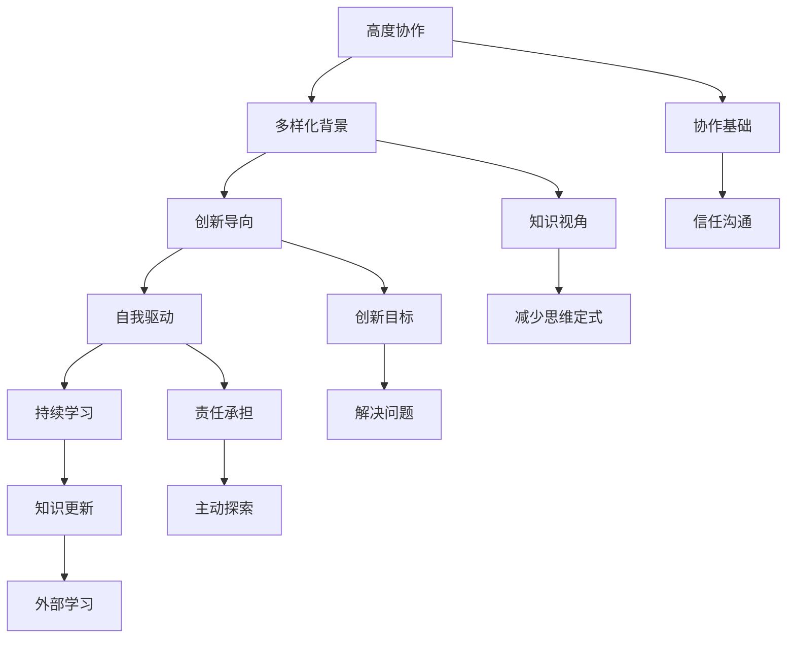

                 

### 创新型团队的背景介绍

在当今快速变化和高度竞争的商业环境中，创新型团队的重要性日益凸显。随着技术的不断进步和市场的快速演变，企业必须具备快速适应和创新的能力，才能在激烈的市场竞争中立于不败之地。创新型团队正是为了满足这一需求而诞生的，它们通过集体的智慧和创造力，推动企业在技术、产品、服务等方面实现突破。

创新型团队的起源可以追溯到20世纪末，当时许多企业开始意识到传统管理模式和单一专家领导的局限性。为了应对复杂多变的市场环境，企业开始探索一种更加灵活、开放和创新的管理模式，以激发员工的潜力和创造力。在这种背景下，创新型团队的概念应运而生。

创新型团队与传统团队最大的区别在于其核心使命和运作方式。传统团队往往注重任务的完成和效率，而创新型团队则更注重激发创意和解决复杂问题。创新型团队的成员通常具备多样化的背景和技能，他们相互协作，共同探索新的解决方案。这种多元化的组合能够带来更多的视角和思维方式，有助于突破传统的思维定式，实现创新。

随着全球化的深入和互联网技术的发展，企业面临的挑战和机遇日益增多。创新型团队在这个过程中扮演着至关重要的角色。他们能够快速响应市场变化，抓住机遇，实现企业的持续增长。例如，在软件开发领域，创新型团队通过敏捷开发方法，不断迭代和优化产品，以满足用户的需求；在科技公司，他们通过技术创新，推出新的产品和服务，引领市场潮流。

总的来说，创新型团队的背景是企业应对快速变化和竞争压力的必然产物。他们通过激发团队的创造力和协作精神，帮助企业实现持续的创新和发展。

### 核心概念与联系：创新型团队的定义与特点

要深入探讨创新型团队，我们首先需要明确其核心概念和特点。创新型团队的定义可以从多个角度进行阐述，但核心要素可以归纳为：高度协作、多样化背景、创新导向、自我驱动和持续学习。

#### 高度协作

高度协作是创新型团队最显著的特点之一。创新型团队通过协作实现目标，而不是依赖个体英雄。协作不仅包括团队成员之间的互动，还包括与外部利益相关者的合作。这种协作的基础是信任和开放沟通，成员之间愿意分享知识和资源，共同面对挑战。为了实现高效协作，创新型团队通常会采用敏捷开发方法，如Scrum和看板（Kanban），这些方法强调迭代和反馈，有助于快速响应变化并保持团队的动力。

#### 多样化背景

创新型团队的成员通常来自不同的专业领域和背景，这种多样性为团队带来了丰富的知识和视角。例如，一个创新型团队可能会包括软件工程师、产品经理、设计师、市场专家等不同角色。这种多元化的组合使得团队能够从多个角度分析问题，提出创新的解决方案。多样化背景的另一个优点是它能够减少思维定式，鼓励团队成员尝试新的方法和思路。

#### 创新导向

创新导向是创新型团队的核心使命。与传统团队不同，创新型团队不仅仅追求效率，更注重创造新的价值。他们不断探索新的技术和方法，寻找创新的突破口。为了实现这一目标，团队通常会设置明确的创新目标和关键绩效指标（KPI），并采用各种创新工具和方法，如头脑风暴、设计思考和思维导图，来激发团队的创造力。

#### 自我驱动

自我驱动是创新型团队的另一个重要特点。团队成员通常具有强烈的内在动机，愿意主动承担更多的责任和挑战。自我驱动的团队成员不仅能够独立完成任务，还能主动寻求解决问题的方法，并对团队的成功负责。这种自我驱动的精神有助于团队在面对复杂和不确定性的情况下保持高效和灵活。

#### 持续学习

持续学习是创新型团队的重要特征。在快速变化的技术和市场环境中，团队必须不断更新知识和技能，以保持竞争力。创新型团队通过定期的培训、讨论和知识分享，促进团队成员之间的学习。此外，团队还会鼓励成员参与外部研讨会和培训，从更广泛的视野中获取灵感。

#### 关系架构 Mermaid 流程图

为了更好地理解这些核心概念之间的关系，我们可以使用Mermaid流程图进行展示。以下是创新型团队核心概念的Mermaid流程图：



在这个流程图中，每个节点都代表了创新型团队的一个核心概念，箭头表示这些概念之间的相互关系。例如，高度协作和多样化背景之间的关系（A和B），以及它们如何共同促进创新导向（C）和自我驱动（D）。持续学习（E）则贯穿于整个团队运作的过程中，为团队的持续发展提供动力。

通过明确和创新型团队的核心概念和特点，我们可以更好地理解其运作机制和优势。这些概念不仅为团队提供了明确的指导方向，也为企业在构建和管理创新型团队时提供了重要的参考。

#### 核心算法原理讲解：创新型团队的运作模式

要深入理解创新型团队的运作模式，我们需要从算法原理的角度进行分析。创新型团队的运作模式可以视为一种分布式问题解决算法，其核心在于通过协作和多样化背景实现高效的创新。

**算法原理**

1. **初始化**：团队初始化时，成员被分配不同的任务和角色，每个成员根据其专业背景和技能参与团队活动。

2. **任务分配与协作**：团队将任务分解为多个子任务，并分配给适当的成员。每个成员负责其子任务的执行，同时与其他成员保持密切的沟通和协作。这一阶段的核心在于充分利用团队成员的多样性和专业知识。

3. **迭代与反馈**：团队在执行任务的过程中，通过定期的迭代和反馈机制，不断优化和改进解决方案。每次迭代结束后，团队成员会分享各自的工作进展和遇到的问题，并通过讨论和头脑风暴寻找改进方案。

4. **综合与整合**：在多个子任务完成之后，团队将各个子任务的结果进行整合，形成一个完整的解决方案。这一阶段需要团队成员之间的高度协作，以确保解决方案的完整性和一致性。

5. **评估与优化**：最后，团队对整个解决方案进行评估和优化，确保其满足预期的目标和标准。如果发现问题，团队将返回前几个步骤，进行进一步的改进。

**伪代码示例**

以下是一个简化的伪代码示例，用于说明创新型团队的运作模式：

```python
# 初始化团队
initialize_team()

# 分配任务
for member in team_members:
    assign_task_to(member)

# 开始迭代过程
while not_all_tasks_completed():
    for member in team_members:
        execute_task(member)
        collect_feedback(member)
    
    # 集成和整合
    integrate_subtasks()

# 评估和优化
evaluate_solution()
if not_solution_satisfactory():
    return_to_iterate()
else:
    terminate_team()

# 输出最终结果
output_solution()
```

在这个伪代码中，我们首先初始化团队，然后分配任务，并进入迭代过程。每次迭代结束后，团队会收集反馈并进行整合。最后，团队对整个解决方案进行评估和优化，以确保其满足预期目标。

**数学模型和公式**

为了量化创新型团队的效果，我们可以引入一些数学模型和公式。以下是一些常见的数学模型：

1. **协作效率（Efficiency）**：

   $$ Efficiency = \frac{Task_Completion}{Total_Task_Time} $$

   其中，Task_Completion表示完成任务的数量，Total_Task_Time表示完成任务所花费的总时间。协作效率越高，团队的工作效率越好。

2. **创新指数（Innovation_Index）**：

   $$ Innovation_Index = \frac{New_Ideas}{Total_Ideas} $$

   其中，New_Ideas表示新想法的数量，Total_Ideas表示总的想法数量。创新指数反映了团队的创新能力和创造新价值的潜力。

3. **团队绩效（Team_Performance）**：

   $$ Team_Performance = Efficiency \times Innovation_Index $$

   团队绩效是协作效率和创新能力乘积的结果，它综合反映了团队的工作效果和创新能力。

**举例说明**

假设一个创新型团队在一个月内完成了10个任务，每个任务平均花费了5天时间。此外，团队在这一个月内产生了50个新想法，其中20个是全新的。根据上述公式，我们可以计算出：

1. 协作效率：

   $$ Efficiency = \frac{10}{5 \times 30} = \frac{2}{3} $$

2. 创新指数：

   $$ Innovation_Index = \frac{20}{50} = 0.4 $$

3. 团队绩效：

   $$ Team_Performance = \frac{2}{3} \times 0.4 = \frac{4}{15} $$

通过这些数据，我们可以评估这个团队在一个月内的协作效率和创新能力，并根据结果进行相应的调整和优化。

综上所述，创新型团队的运作模式可以通过算法原理、伪代码示例、数学模型和公式进行详细阐述。这种模式不仅有助于理解创新型团队的工作机制，也为企业在管理和激励创新型团队时提供了重要的参考。

#### 团队创新的目标与挑战

创新型团队的目标不仅在于推动创新，更在于实现可持续的发展。团队创新的目标可以概括为以下三个方面：

1. **提升竞争力**：通过不断创新，团队能够推出具有竞争力的产品和服务，从而在激烈的市场竞争中脱颖而出。创新的目标是找到新的市场机会，开拓新的业务领域。

2. **实现突破性进展**：创新型团队追求的是突破性进展，而非渐进式的改进。这种突破性进展可能包括新技术、新产品、新商业模式等，它能够为团队和企业带来重大的变革和提升。

3. **持续改进**：创新不仅是一个目标，也是一个持续的过程。创新型团队通过不断的创新和改进，保持企业的活力和竞争力。

在实现这些目标的过程中，创新型团队面临着一系列的挑战：

1. **资源限制**：创新需要大量的资源投入，包括人力、资金、技术和时间。然而，企业在资源有限的情况下，如何合理配置和利用资源，是一个巨大的挑战。

2. **文化阻力**：传统的组织文化可能对创新形成阻力。例如，一些企业可能过于强调稳定性和效率，忽视了创新的必要性。改变这种文化，建立支持创新的企业文化，是团队面临的挑战之一。

3. **沟通障碍**：创新往往涉及多个部门和专业领域的协作。沟通障碍可能导致团队之间的隔阂和误解，从而影响创新的效率和效果。

4. **风险和失败**：创新本身是一个高风险的过程，失败和创新是并存的。团队需要建立能够接受失败和从失败中学习的企业文化，以降低创新的风险。

为了应对这些挑战，创新型团队需要采取一系列的策略和措施：

1. **资源优化配置**：团队可以通过合理的资源规划和分配，最大限度地利用有限的资源。例如，采用敏捷开发方法，以快速迭代和灵活响应市场变化。

2. **建立支持创新的企业文化**：企业需要从顶层设计开始，建立支持创新的文化。这包括鼓励员工提出创意、容忍失败、奖励成功等。

3. **强化沟通机制**：团队可以通过定期的会议、知识分享活动和跨部门合作，强化团队之间的沟通。此外，采用先进的协作工具，如敏捷管理工具和沟通平台，也有助于提高沟通效率。

4. **风险管理**：团队需要建立完善的风险管理机制，包括识别风险、评估风险和制定应对策略。通过科学的决策和风险管理，降低创新过程中的不确定性和失败风险。

通过这些策略和措施，创新型团队可以更好地应对挑战，实现其创新目标，从而在激烈的市场竞争中保持持续的优势。

#### 激发创意的思维方式

创意思维是创新型团队的核心能力之一，它不仅决定了团队的创新能力，也直接影响团队的整体绩效。为了激发创意，团队需要掌握一系列的思维方式和方法。以下是一些常用的创意思维方式和工具：

1. **头脑风暴**：头脑风暴是一种广泛应用的创意思维方法，通过集思广益，迅速产生大量的创意。在头脑风暴过程中，团队成员可以自由发表意见，不受任何限制，从而激发创新的火花。具体步骤如下：

   - **明确目标**：在头脑风暴前，明确需要解决的问题或需要达成的目标。
   - **无限制发言**：鼓励团队成员自由发言，提出各种可能的创意和解决方案。
   - **记录创意**：将所有创意记录下来，不论创意是否合理或可行。
   - **分类和筛选**：将记录的创意进行分类和筛选，找出最具潜力的创意。

2. **思维导图**：思维导图是一种图形化的思维工具，它通过分支和节点的方式，将创意和思路可视化。思维导图可以帮助团队成员梳理思路，发现潜在的联系和关系，从而激发更多的创意。创建思维导图的步骤如下：

   - **确定中心主题**：在思维导图中央确定一个中心主题，通常是需要解决的问题或创意的主题。
   - **分支和节点**：围绕中心主题，创建分支和节点，每个分支和节点代表一个相关的创意或子问题。
   - **添加细节**：为每个节点添加相关的细节和子节点，使其更加丰富和具体。
   - **优化和调整**：根据实际情况，不断优化和调整思维导图，使其更加符合团队的需求。

3. **设计思考**：设计思考是一种以人为本的创意思维方法，它强调从用户的角度出发，通过迭代和反馈，逐步完善创意和解决方案。设计思考的过程包括以下几个阶段：

   - **理解用户需求**：通过用户调研、访谈和观察，深入理解用户的需求和痛点。
   - **创意生成**：基于用户需求，提出各种可能的解决方案，并通过头脑风暴和思维导图等工具，生成创意。
   - **原型制作**：将创意转化为可操作的模型或原型，进行初步测试和验证。
   - **反馈和改进**：通过用户测试和反馈，不断改进原型，优化解决方案。

4. **类比思维**：类比思维是一种通过将新问题与已知问题进行类比，寻找解决方案的创意思维方法。这种方法可以帮助团队成员从不同的视角看待问题，发现潜在的创新点。类比思维的步骤如下：

   - **识别问题**：明确需要解决的问题或需要创新的领域。
   - **寻找类似问题**：通过查阅资料、与同行交流等方式，寻找与当前问题类似的已知问题。
   - **分析解决方案**：分析类似问题的解决方案，提取有用的经验和启示。
   - **应用类比**：将类似问题的解决方案应用到当前问题中，生成新的创意和解决方案。

通过上述创意思维方式和工具，创新型团队可以有效地激发创意，提高创新能力。然而，创意思维并不是一蹴而就的，它需要团队成员的持续学习和实践。团队可以通过定期的创意思维培训和实践，不断提高创意思维能力，从而在激烈的竞争中保持优势。

#### 案例分析：成功团队的创意思维实践

为了更好地理解创意思维在创新型团队中的应用，我们可以通过一些成功团队的案例进行分析。这些案例展示了如何通过创意思维工具和方法，激发团队成员的创造力，并最终实现创新目标。

**案例一：谷歌的创意文化**

谷歌以其创新的文化和卓越的创意思维实践而闻名。谷歌的“20%时间”政策是一个典型的创意激励措施，允许员工将20%的工作时间用于个人感兴趣的项目。这一政策不仅激发了员工的工作热情，还催生了许多创新产品，如Gmail和Google News。

- **创意思维工具**：谷歌广泛采用头脑风暴和思维导图来激发创意。在头脑风暴环节，员工可以自由发表意见，不受任何限制。随后，团队使用思维导图将各种创意和思路可视化，并从中筛选出最具潜力的项目。

- **实践效果**：通过这些创意思维工具，谷歌成功地推出了多个创新产品，不仅提升了公司的市场竞争力，还成为行业内创新文化的典范。

**案例二：苹果的iPod创新**

苹果公司在iPod和iTunes的成功中也展示了强大的创意思维实践。苹果的设计团队通过设计思考和用户研究，深入理解用户的音乐需求和体验痛点。

- **创意思维工具**：苹果团队采用了设计思考方法，从用户的角度出发，提出各种可能的解决方案。通过原型制作和用户测试，团队不断优化设计，最终推出了一款革命性的产品——iPod。

- **实践效果**：iPod的成功不仅改变了音乐产业的格局，还奠定了苹果公司在消费者电子产品市场中的领导地位。这一案例表明，通过深入的用户研究和设计思考，团队可以开发出深受用户喜爱的创新产品。

**案例三：特斯拉的电动车创新**

特斯拉在电动汽车领域的创新也是创意思维实践的成功典范。特斯拉的团队通过类比思维和设计思考，不断突破传统汽车设计的限制，推出了一系列创新的电动汽车产品。

- **创意思维工具**：特斯拉团队采用了类比思维，将汽车设计与电子设备设计进行类比，从而开发出更加智能化和用户体验友好的电动汽车。同时，团队还通过设计思考和用户测试，不断改进产品设计和用户体验。

- **实践效果**：特斯拉的成功不仅改变了人们对电动汽车的看法，还推动了整个电动汽车行业的发展。特斯拉的创新产品在性能、续航和用户体验方面都达到了新的高度。

通过这些案例，我们可以看到创意思维工具和方法在成功团队中的应用和实践效果。无论是谷歌的“20%时间”政策，还是苹果的设计思考，亦或是特斯拉的类比思维，这些成功团队的实践都展示了如何通过创意思维激发团队的创造力，并实现创新目标。这些案例不仅为其他团队提供了宝贵的经验，也为企业构建创新型团队提供了重要的启示。

### 组织文化对团队创新的影响

组织文化在创新型团队的发展中起着至关重要的作用。组织文化不仅影响团队成员的思维方式和行为模式，还直接影响团队的创新能力。一个支持创新的组织文化能够激发员工的创造力，提高团队的协作效率，从而推动企业的持续发展。下面，我们将探讨组织文化对团队创新的具体影响，以及如何塑造支持创新的组织文化。

#### 组织文化对团队创新的具体影响

1. **鼓励尝试与失败**：一个支持创新的组织文化通常鼓励团队成员勇于尝试新想法，并接受失败的教训。这种文化认为，失败是成功的前提，通过不断尝试和失败，团队可以积累宝贵的经验和知识。例如，谷歌的“不完美文化”鼓励员工敢于尝试，即使失败也能得到认可和支持。

2. **鼓励开放沟通**：开放沟通是创新文化的重要组成部分。在一个支持创新的组织中，团队成员可以自由地表达自己的想法和观点，无论这些想法是否成熟或可行。这种开放沟通的环境有助于激发创意，促进团队成员之间的合作和协作。

3. **建立共同的愿景**：一个支持创新的组织文化能够为团队建立明确的愿景和目标。共同的愿景不仅能够凝聚团队成员，还能激发他们的工作热情和创造力。例如，特斯拉的愿景是加速世界向可持续能源的转变，这一愿景激励了无数员工为公司的目标努力奋斗。

4. **尊重多样性**：多样性是创新的重要源泉。一个支持创新的组织文化不仅尊重团队成员的多样性，还鼓励不同背景和观点的碰撞和融合。这种多样性能够带来更多的视角和思维方式，有助于团队在面对复杂问题时提出创新的解决方案。

5. **提供资源支持**：创新需要资源和资金的投入。一个支持创新的组织文化能够为团队提供必要的资源支持，包括资金、技术和人员等。这种资源支持有助于团队实现其创新目标，提高团队的创新能力。

#### 如何塑造支持创新的组织文化

1. **领导者的示范作用**：领导者在塑造组织文化中起着关键的作用。领导者需要通过自己的言行示范，鼓励创新和开放沟通，尊重多样性，并为团队成员提供支持和资源。领导者的行为和态度会对团队成员产生深远的影响，从而塑造整个组织文化。

2. **建立创新激励机制**：组织可以通过建立创新激励机制，如奖励创新成果、设立创新奖项等，来鼓励团队成员积极参与创新活动。这种激励机制不仅能够激发员工的创造力，还能提高团队的整体创新能力。

3. **提供培训和学习机会**：组织可以定期为团队成员提供创新培训和学习机会，帮助他们掌握最新的创新工具和方法。这些培训和学习机会不仅能够提高团队成员的创新能力，还能促进团队成员之间的交流和合作。

4. **建立开放沟通机制**：组织需要建立开放沟通的机制，如定期召开创新会议、设立意见箱等，鼓励团队成员自由表达自己的想法和意见。这种开放沟通的环境有助于团队成员之间的交流和协作，从而激发创意。

5. **鼓励员工参与决策**：组织可以鼓励员工参与决策过程，让他们感受到自己的意见和贡献被重视。这种参与感不仅能够提高员工的积极性和责任感，还能激发他们的创新思维。

6. **营造积极的工作环境**：组织需要营造一个积极的工作环境，如提供良好的工作条件、鼓励团队合作、提供职业发展机会等。这种工作环境能够提高员工的工作满意度和忠诚度，从而促进团队的稳定和创新。

通过以上措施，组织可以逐步塑造支持创新的组织文化，激发团队的创造力，推动企业的持续发展。

### 构建高效的团队协作机制

高效团队协作是实现创新的关键，而构建一个高效的团队协作机制是实现这一目标的基础。以下是一些关键的团队协作原则、工具和技术，以及它们在实际中的应用和优势。

#### 团队协作的基本原则

1. **明确目标**：团队协作的首要原则是明确目标。一个清晰、具体的目标能够指导团队成员的行动方向，确保每个人的努力都朝着同一个方向。例如，在敏捷开发中，每个迭代周期都会设定一个具体的用户故事或目标，使团队成员保持专注。

2. **有效沟通**：沟通是团队协作的核心。有效的沟通不仅包括信息的传递，还包括情感的交流和反馈的获取。团队成员需要建立开放的沟通渠道，确保信息透明和及时。例如，使用即时通讯工具和定期的团队会议可以帮助团队保持沟通的有效性。

3. **合理分工**：合理分工是确保团队高效运作的基础。团队成员应该根据自己的专业技能和兴趣，承担相应的职责。通过明确的角色分工，可以减少工作中的冲突和重复劳动，提高工作效率。例如，在Scrum中，每个角色（产品负责人、Scrum Master、开发团队）都有明确的职责和任务。

4. **协同合作**：协同合作强调团队成员之间的互相支持和协作。在复杂项目中，单一角色往往无法独立完成任务，需要团队成员共同协作。通过协同合作，团队可以整合不同角色的优势，共同解决问题。例如，设计、开发和测试团队之间的紧密协作，可以确保产品的质量和交付效率。

#### 团队协作工具与技术

1. **敏捷开发方法**：敏捷开发方法（如Scrum和Kanban）是一种以人为核心、迭代和增量开发的团队协作方法。敏捷开发强调灵活性、响应变化和持续交付价值。通过短期迭代（Sprint）和定期的回顾会议，团队可以快速响应需求变化，并持续改进过程。

   - **Scrum**：Scrum通过设定产品待办列表（Product Backlog）、迭代计划（Sprint Planning）和每日站会（Daily Stand-up）等机制，确保团队成员明确任务和进度，提高协作效率。
   - **Kanban**：Kanban使用看板板（Kanban Board）来可视化工作流程，通过限制在流程中工作的任务数量（WIP限制），减少工作积压，提高流程效率。

2. **协作工具**：现代协作工具极大地提升了团队的协作效率。以下是一些常用的协作工具：

   - **项目管理工具**：如JIRA、Trello和Asana，可以帮助团队管理任务、跟踪进度和分配资源。
   - **沟通工具**：如Slack、Microsoft Teams和Zoom，支持实时沟通和视频会议，促进团队成员之间的互动和协作。
   - **文档协作工具**：如Google Docs、Notion和Confluence，使团队成员可以实时编辑和共享文档，提高信息传递的效率。

3. **知识共享平台**：知识共享平台（如Wiki和知识库）可以帮助团队积累和分享知识，确保新成员快速了解团队的工作流程和最佳实践。

#### 实际应用与优势

在实际应用中，团队协作工具和方法需要根据团队的具体情况灵活调整。以下是一些实际案例和应用优势：

1. **案例分析**：在一家软件公司中，团队采用Scrum方法进行项目开发。通过定期的迭代和回顾会议，团队能够快速响应客户需求，提高产品的市场竞争力。同时，使用Trello进行任务管理，使每个成员的工作透明化，减少了沟通成本和误解。

2. **协作优势**：通过敏捷开发方法和协作工具，团队可以实现以下优势：

   - **提高工作效率**：明确的目标和合理的分工使团队成员能够专注于自己的任务，减少了重复工作和资源浪费。
   - **增强团队凝聚力**：开放的沟通渠道和协同合作机制增强了团队成员之间的信任和凝聚力。
   - **快速响应变化**：敏捷开发方法使团队能够快速响应市场需求和变化，保持产品的竞争力。
   - **持续改进**：通过定期的回顾和反馈，团队可以不断优化工作流程和协作机制，提高整体效率。

总之，构建高效的团队协作机制是创新型团队成功的关键。通过明确目标、有效沟通、合理分工和协同合作，以及利用现代协作工具和方法，团队可以大幅提升协作效率，实现创新目标。

### 创新的激励机制

在构建创新型团队时，激励机制是关键的一环。有效的激励机制能够激发团队成员的积极性和创造力，从而推动团队实现创新目标。以下将详细探讨创新激励的理论基础，并介绍几种常见的创新激励机制。

#### 创新激励的理论基础

1. **动机理论**：动机理论是理解创新激励的重要基础。根据动机理论，人们的行为是由内在动机和外在动机共同驱动的。内在动机是指个体因自身兴趣、好奇心和自我实现的需要而进行的活动，如追求知识、成就感等。而外在动机则是指个体因外部奖励或惩罚而进行的活动，如金钱、荣誉等。在创新过程中，激发内在动机尤为重要，因为内在动机往往能够带来更加持久和深刻的创新行为。

2. **期望理论**：期望理论认为，个体的行为是由期望和效价共同决定的。期望是指个体对目标实现可能性的估计，而效价则是指个体对目标价值的评价。根据期望理论，只有当个体认为通过努力可以实现目标，并且这个目标对他们有重要价值时，他们才会付出努力。因此，创新激励机制需要结合期望和效价，确保团队成员明确目标的价值和实现目标的路径。

#### 常见的创新激励机制

1. **薪酬激励**：薪酬激励是最常见的创新激励机制之一。通过提供具有竞争力的薪资和奖金，企业可以激发团队成员的创新热情。例如，谷歌的“20%时间”政策允许员工将一定比例的工作时间用于个人项目，这种政策不仅提高了员工的薪酬水平，还激励了员工追求创新。

2. **荣誉激励**：荣誉激励是通过授予荣誉称号、表彰和奖励来激励团队成员。荣誉激励不仅能够提高团队成员的自尊心和自豪感，还能增强团队的凝聚力。例如，一些企业会设立“创新奖”、“最佳创意奖”等，以表彰在创新方面表现突出的团队成员。

3. **发展激励**：发展激励是指通过提供职业发展机会、培训和晋升等手段来激励团队成员。这种激励方式不仅能够提高团队成员的职业素养和技能水平，还能增强他们对企业的忠诚度和归属感。例如，企业可以提供内部培训、外部研讨会和项目机会，帮助团队成员不断提升自身能力。

4. **工作环境激励**：良好的工作环境是创新的重要基础。通过提供舒适的工作空间、先进的办公设备和良好的工作氛围，企业可以激发团队成员的创造力。例如，一些企业会设立创意工作室、休息区和娱乐设施，以营造一个有利于创新的氛围。

#### 实例分析

1. **案例一：谷歌的股权激励**：谷歌通过股权激励来激励员工，使员工能够分享公司的成功。员工持有的股权不仅能够带来直接的经济回报，还能增强他们的主人翁意识和责任感。这种激励机制不仅提高了员工的创新热情，还增强了团队的整体凝聚力。

2. **案例二：特斯拉的绩效奖励**：特斯拉通过绩效奖励来激励员工。员工根据其工作绩效和创新贡献获得相应的奖金和奖励。特斯拉的绩效奖励制度不仅考虑了员工的工作成果，还考虑了创新的影响力和可持续性。这种激励机制有助于鼓励员工追求卓越和创新。

3. **案例三：微软的“创新月”**：微软每年都会举办“创新月”活动，鼓励员工提出创新想法和解决方案。在创新月中，员工可以暂时放下日常工作，专注于创新项目。这种活动不仅激发了员工的创造力，还促进了团队之间的交流和合作。

综上所述，创新激励机制在构建创新型团队中起着至关重要的作用。通过合理的薪酬激励、荣誉激励、发展激励和工作环境激励，企业可以有效地激发团队成员的创造力，推动团队实现创新目标。这些激励机制不仅能够提高团队的绩效和竞争力，还能增强团队的凝聚力和员工的满意度。

### 创新的资源支持

创新离不开资源支持，而资源优化配置是确保创新高效开展的关键。以下将讨论如何获取和创新资源、优化资源配置的方法，并介绍资源共享和资源整合的重要性。

#### 获取和创新资源的方法

1. **内部资源**：内部资源包括企业自身的人力、财务、技术和信息等。企业可以通过以下方法获取内部资源：

   - **人才引进与培养**：企业可以通过招聘优秀的专业人才，增强团队的技术能力和创新潜力。同时，通过内部培训和发展计划，不断提升现有员工的专业技能和创新能力。
   - **资金投入**：企业应确保有足够的资金支持创新项目，包括研发资金、市场推广资金等。合理的资金配置可以保证创新项目的顺利进行。
   - **技术积累**：企业应注重技术的积累和研发，通过内部技术团队的创新和改进，不断提高技术水平和创新能力。

2. **外部资源**：外部资源包括合作机构、投资机构、客户资源、行业协会等。企业可以通过以下方法获取外部资源：

   - **合作与联盟**：企业可以通过建立战略联盟或合作项目，与其他企业、高校、研究机构等共同进行创新研发，共享资源和知识。
   - **投资与融资**：企业可以通过吸引风险投资、政府补贴等外部资金支持，为创新项目提供充足的资金保障。
   - **市场调研与客户反馈**：通过市场调研和客户反馈，企业可以获取市场需求和趋势信息，为创新提供方向和依据。

#### 优化资源配置的方法

1. **需求分析**：企业应通过深入的需求分析，明确创新项目的具体需求，包括人力、资金、技术和时间等。根据需求分析结果，合理配置资源，确保资源投入的高效性和针对性。

2. **优先级排序**：企业应建立科学的优先级排序机制，对创新项目进行优先级排序。优先支持那些具有较高商业价值、技术难度适中、市场需求明确的项目。

3. **资源共享**：企业可以通过内部资源共享，提高资源利用率。例如，通过建立共享实验室、共享数据中心等，实现资源的集中管理和高效利用。

4. **项目评估**：企业应定期对创新项目进行评估，根据项目进展和资源利用情况，及时调整资源配置策略，确保资源投入的有效性和合理性。

#### 共享和资源整合的重要性

1. **共享的重要性**：资源共享能够提高资源利用率，减少重复投资和资源浪费。通过共享，企业可以集中优势资源，共同攻克技术难题，提高创新效率。此外，资源共享还有助于促进团队之间的协作和知识交流，激发创新灵感。

2. **资源整合的重要性**：资源整合是指将不同来源的资源进行有效组合和利用，以实现资源的最大化效益。通过资源整合，企业可以优化资源配置，提高资源利用率，从而支持更广泛、更深入的创新活动。资源整合不仅能够提高企业的创新能力，还能增强企业的市场竞争力。

总之，创新的资源支持是企业实现持续创新的重要保障。通过合理获取和创新资源、优化资源配置，以及加强资源共享和资源整合，企业可以不断提高创新能力，推动企业的持续发展。

### 创新成果的转化与应用

创新成果的转化和应用是创新型团队工作的最终目标。这一过程不仅需要将创新的思维和产品转化为实际的应用，还需要确保这些成果在市场和企业内部得到有效的推广和应用。以下将探讨创新成果的评估与筛选、转化路径以及推广策略，并通过实际案例进行详细分析。

#### 创新成果的评估与筛选

创新成果的评估和筛选是确保创新价值得到最大化利用的重要步骤。以下是一些关键评估和筛选标准：

1. **市场潜力**：创新成果的市场潜力是评估其价值的首要标准。一个有市场潜力的创新成果能够吸引更多的客户和用户，从而为企业带来可观的经济回报。

2. **技术可行性**：技术可行性评估是确保创新成果可以实际实现的关键。这包括技术实现的难度、所需的时间和技术资源等。

3. **经济效益**：经济效益评估是判断创新成果对企业盈利能力的评估。这包括创新成果的直接经济效益和间接经济效益，如节省成本、增加收入等。

4. **用户反馈**：用户反馈是评估创新成果成功与否的重要指标。通过用户测试和反馈，可以了解用户对创新成果的接受程度和使用体验，从而进一步优化和改进产品。

5. **法律和伦理标准**：创新成果需要符合相关的法律法规和伦理标准，以确保其合法性和社会认可度。

#### 转化路径

创新成果的转化路径可以分为以下几个阶段：

1. **原型开发**：在评估和筛选阶段确定创新成果后，首先进行原型开发。原型开发旨在验证创新思路的可行性，并通过迭代优化，逐步完善产品。

2. **试点测试**：原型开发完成后，进行试点测试。试点测试可以在有限的范围内，对创新成果进行实地测试和用户反馈，以进一步验证其市场潜力和技术可行性。

3. **小规模生产**：在试点测试成功后，进行小规模生产。这一阶段旨在进一步验证产品的稳定性和性能，并为大规模生产做准备。

4. **市场推广**：创新成果经过小规模生产后，进入市场推广阶段。通过市场推广，将创新成果推向更大的市场，吸引更多的用户和客户。

#### 推广策略

创新成果的推广需要结合市场和企业特点，制定有效的推广策略。以下是一些常见的推广策略：

1. **品牌宣传**：通过品牌宣传提升创新成果的市场知名度和美誉度。这包括广告、社交媒体营销、公共关系等。

2. **用户教育**：通过用户教育，提高用户对创新成果的理解和接受度。这可以通过用户手册、在线培训、演示视频等方式进行。

3. **合作伙伴**：与行业合作伙伴建立合作关系，共同推广创新成果。通过合作伙伴的渠道和资源，可以扩大市场覆盖范围。

4. **用户体验**：提供优质的用户体验，通过用户反馈不断优化产品，提高用户满意度。

5. **数据分析**：通过数据分析，了解用户行为和市场趋势，不断调整推广策略，以实现最大化市场效果。

#### 实际案例分析

1. **案例一：特斯拉的电动车辆创新**：

   特斯拉在电动车辆领域的创新成果通过以下路径进行转化和应用：

   - **原型开发**：特斯拉通过多年的研发，成功开发了多个电动车辆原型，并在实验室和道路测试中不断优化。
   - **试点测试**：特斯拉在选定市场进行了试点测试，通过用户反馈不断改进产品性能和用户体验。
   - **小规模生产**：在试点测试成功后，特斯拉开始进行小规模生产，逐步扩大生产规模。
   - **市场推广**：特斯拉通过品牌宣传和用户教育，成功将创新成果推向全球市场，吸引了大量用户和客户。

2. **案例二：谷歌的Gmail邮件服务**：

   谷歌的Gmail邮件服务通过以下路径进行推广：

   - **原型开发**：谷歌团队开发了多个邮件服务原型，通过内部测试和用户反馈，不断改进用户体验。
   - **试点测试**：Gmail在内部员工和有限用户中进行试点测试，收集用户反馈，进一步优化功能。
   - **小规模生产**：在用户反馈积极的情况下，Gmail逐渐向更大范围的用户开放。
   - **市场推广**：通过谷歌的品牌影响力和用户教育，Gmail迅速占领市场，成为全球领先的邮件服务。

通过上述案例分析，我们可以看到，创新成果的转化和应用是一个系统性的过程，需要从评估筛选、转化路径到推广策略的各个环节进行精心设计和执行。只有通过科学的评估和有效的推广，创新成果才能真正转化为实际的价值，为企业带来可持续的竞争优势。

### 成功案例分析

在创新型团队的实践中，有许多企业通过成功的创新案例取得了显著的成绩。以下我们将探讨谷歌、苹果和特斯拉这三个知名公司的成功案例，分析它们的创新策略和实践方法。

#### 谷歌的“20%时间”政策

谷歌以其独特的“20%时间”政策著称，这一政策允许员工将20%的工作时间用于个人项目。这一创新的激励机制不仅激发了员工的创造力，还催生了多个成功的产品，如Gmail、Google News和AdSense。以下是谷歌成功案例的解析：

- **创新策略**：谷歌通过鼓励员工自由探索和尝试，创造了宽松的创新环境。员工可以在不影响主要工作的前提下，专注于自己感兴趣的项目，这使得他们能够发挥最大潜力。
- **实践方法**：谷歌采用敏捷开发方法，通过快速迭代和持续反馈，不断完善产品。同时，谷歌鼓励跨部门的合作，确保创意能够迅速转化为实际的产品。

#### 苹果的iPod革命

苹果的iPod和iTunes的成功改变了音乐产业的格局，成为创新产品设计的典范。以下是苹果成功案例的解析：

- **创新策略**：苹果通过用户研究和设计思考，深入理解用户的需求和痛点。他们采用了简洁的设计和直观的用户界面，为用户提供了卓越的体验。
- **实践方法**：苹果建立了严格的设计流程，从概念验证到产品发布，每个阶段都经过细致的规划和严格的测试。此外，苹果注重与供应商和合作伙伴的合作，确保产品的质量和创新性。

#### 特斯拉的电动汽车革命

特斯拉在电动汽车领域的创新引领了全球市场，推动了可持续能源的发展。以下是特斯拉成功案例的解析：

- **创新策略**：特斯拉通过类比思维和设计思考，不断突破传统汽车设计的限制。他们不仅关注车辆的性能和续航，还注重用户体验和智能化。
- **实践方法**：特斯拉采用精益生产和敏捷开发方法，确保产品的高质量和快速迭代。此外，特斯拉建立了强大的研发团队，持续推动技术进步和产品创新。

#### 创新实践总结

通过上述成功案例，我们可以总结出以下创新实践的关键要点：

1. **鼓励自由探索**：企业应鼓励员工自由探索和提出新想法，创造宽松的创新环境。
2. **用户导向**：深入了解用户需求，将用户反馈纳入创新过程，确保产品满足用户期望。
3. **跨部门合作**：促进跨部门合作，整合不同领域的资源和知识，提高创新能力。
4. **敏捷开发**：采用敏捷开发方法，通过快速迭代和反馈，不断优化产品。
5. **持续学习**：持续学习和技术积累，确保团队能够不断适应市场变化和技术发展。

总之，谷歌、苹果和特斯拉的成功案例展示了创新型团队在不同领域的卓越表现。通过科学创新策略和实践方法，这些公司不仅推动了自身的持续发展，也为其他企业提供了宝贵的经验和启示。

### 附录A：创新型团队建设工具与方法

在构建创新型团队的过程中，掌握一系列实用的工具和方法是至关重要的。以下将介绍几种常用的工具，包括创意思维工具、团队协作工具和激励机制设计，以及具体的实施方法和注意事项。

#### 创意思维工具

1. **思维导图**：

   - **适用场景**：用于梳理思路、可视化创意和任务分解。
   - **实施方法**：在中心节点写下核心问题或主题，然后从中心节点向外延伸出各个分支，每个分支代表一个创意或子任务。通过不断地添加细节和子节点，形成一个完整的思维导图。
   - **注意事项**：思维导图应保持简洁和清晰，避免过于复杂。

2. **头脑风暴**：

   - **适用场景**：用于快速产生创意和解决方案。
   - **实施方法**：在规定的时间内，自由地提出所有可能的想法，不受限制地思考和讨论。每个人都可以提出自己的想法，不论是否成熟或可行。
   - **注意事项**：头脑风暴时应确保所有人都能自由发言，避免批评和否定，鼓励多元化的观点。

#### 团队协作工具

1. **敏捷开发工具**：

   - **适用场景**：用于项目管理和迭代开发。
   - **实施方法**：常见的敏捷开发工具有Scrum和Kanban。Scrum通过设定迭代周期（Sprint）和定期的回顾会议，确保团队按计划推进。Kanban通过可视化工作流程和限制WIP（工作在进程中的任务数量），提高团队的工作效率。
   - **注意事项**：确保团队成员对敏捷开发方法有清晰的理解，并持续优化过程。

2. **项目管理工具**：

   - **适用场景**：用于任务管理、进度跟踪和资源分配。
   - **实施方法**：常用的项目管理工具有JIRA、Trello和Asana。这些工具可以帮助团队清晰地了解任务状态、分配任务和跟踪进度。
   - **注意事项**：确保任务分配合理，及时更新任务状态，避免任务积压和延误。

#### 激励机制设计

1. **薪酬激励**：

   - **适用场景**：用于激励员工的绩效和创新贡献。
   - **实施方法**：设立具有竞争力的薪资结构和奖金制度。例如，可以设置季度奖、年度奖等，以奖励在绩效和创新方面表现突出的员工。
   - **注意事项**：确保薪酬激励制度公平、透明，并能够真正激励员工。

2. **荣誉激励**：

   - **适用场景**：用于提升员工的荣誉感和归属感。
   - **实施方法**：设立创新奖、最佳创意奖等荣誉称号，通过公开表彰和奖励，提升员工的自豪感和工作积极性。
   - **注意事项**：荣誉激励应真实反映员工的贡献，避免形式主义。

通过这些工具和方法的合理应用，企业可以有效地激发团队的创造力，提高团队协作效率，推动企业的持续创新和发展。

### 总结与未来展望

本文系统地探讨了创新型团队的核心概念、思维方式、组织文化、协作机制、激励机制以及资源支持等内容。通过深入分析，我们明确了创新型团队在当前商业环境中的重要地位，并阐述了如何通过科学的管理和实践，构建一个高效、创新、协作的团队。

首先，创新型团队的定义与特点揭示了其高度协作、多样化背景、创新导向、自我驱动和持续学习的核心理念。接下来，我们详细介绍了头脑风暴、思维导图、设计思考和类比思维等创意思维方式，并通过具体案例展示了这些思维方式的实际应用效果。

组织文化和团队协作机制是创新型团队成功的关键要素。通过建立支持创新的组织文化，如鼓励尝试与失败、开放沟通和尊重多样性，企业可以激发团队的创造力。高效的团队协作机制，如敏捷开发方法和项目管理工具，有助于提高团队的工作效率和创新能力。

激励机制和资源支持同样是推动团队创新的重要手段。合理的薪酬激励、荣誉激励和发展激励可以激发员工的积极性，而优化资源配置和建立资源共享机制则有助于确保创新资源的充分利用。

展望未来，随着技术的不断进步和市场竞争的加剧，创新型团队将在企业的发展中扮演更加重要的角色。企业应持续关注创新型团队建设，通过不断优化和创新，提升团队的整体竞争力。同时，企业还需要关注新兴技术和市场趋势，灵活调整创新策略，以保持领先地位。

总之，创新型团队建设是一个系统性的工程，需要从理念、方法、文化、机制等多个方面进行全面规划和实施。通过持续的努力和不断的改进，企业可以构建一支高效、创新、协作的团队，实现企业的长期可持续发展。未来，我们期待看到更多企业通过创新型团队建设，在激烈的市场竞争中脱颖而出，实现跨越式发展。

### 作者信息

作者：AI天才研究院/AI Genius Institute & 禅与计算机程序设计艺术 /Zen And The Art of Computer Programming

在这本《创新型团队打造：激发创意的环境营造》中，我们深入探讨了如何构建和激发创新型团队，以应对快速变化的市场和技术挑战。通过系统性的分析和实际案例，我们提供了实用的工具和方法，帮助企业实现团队的持续创新和发展。希望这本书能够为读者在团队建设和管理方面提供有价值的参考和启示。

