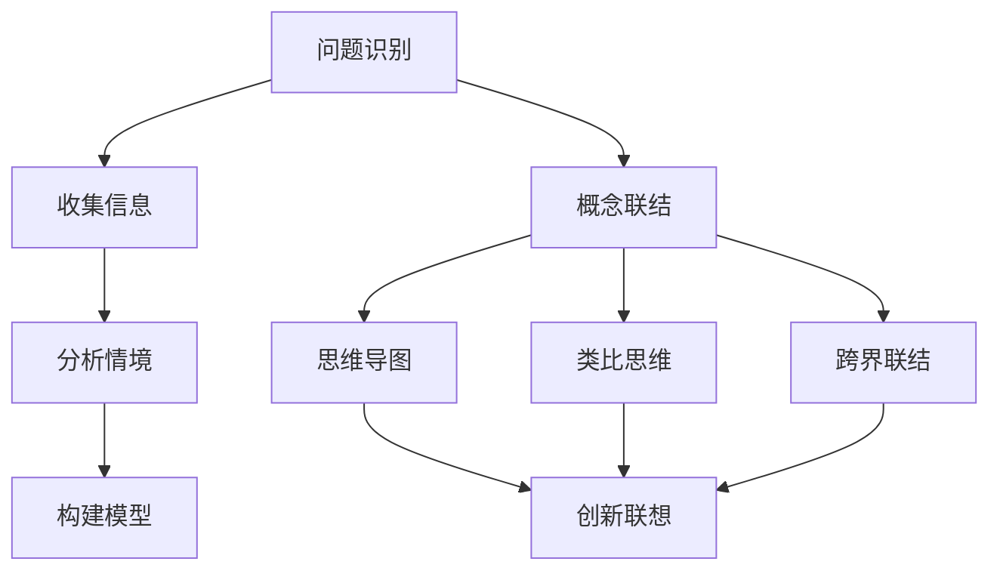

                 


### 摘要

创新思维是推动团队突破瓶颈、实现持续发展的关键因素。本文旨在探讨创新思维的理论基础、核心原理和实际应用，帮助读者理解如何在团队管理、项目开发、企业运营和社会治理中有效地应用创新思维。通过对创新思维基础理论的介绍，我们将明确创新思维的定义、类型及其重要性。随后，文章将深入探讨创新思维的核心原理，包括情境思考、问题识别和概念联结等内容，并结合数学模型和工具，展示如何系统地进行创新思维。接着，本文将具体讨论创新思维在团队管理、项目开发和企业运营中的应用，并提供实际案例以加深理解。最后，文章将通过经典案例分析和新兴领域应用，进一步阐述创新思维的广泛应用和潜在挑战，为读者提供实用的创新思维方法和建议。通过这篇文章，读者将能够掌握创新思维的关键要点，并在实际工作中有效地运用。

### 文章关键词

创新思维、团队管理、项目开发、企业运营、社会治理、情境思考、问题识别、概念联结、数学模型、创新工具、创新氛围、创新流程、创新绩效、创新战略、创新文化、创新能力、新兴领域、人工智能、区块链、公共服务、社会治理路径。

### 创新思维概述

#### 创新思维的定义

创新思维是一种通过系统化的思考方式，寻找新的解决方案、方法或产品，从而推动技术、产业和社会进步的思维模式。它不仅仅停留在创造新奇想法的层面，更强调这些想法的实际应用和价值实现。创新思维具有多维度的特点，包括创造性、系统性、动态性和灵活性。

#### 创新思维的重要性

在当今快速变化的社会和经济环境中，创新思维的重要性愈发凸显。首先，创新思维是驱动企业持续发展的动力。通过不断创新，企业可以保持竞争优势，适应市场需求的变化，实现业务的转型升级。其次，创新思维在项目开发中起到关键作用。通过创新思维，项目团队可以识别和解决潜在的问题，优化项目流程，提高项目成功率。此外，在社会治理中，创新思维有助于解决复杂的社会问题，提升公共服务质量，构建更加和谐的社会环境。

#### 创新思维的类型

创新思维可以分为多种类型，每种类型都有其独特的应用场景和特点。以下是几种常见的创新思维类型：

1. **逆向思维**：从相反的视角重新审视问题，寻找出人意料但可能更为有效的解决方案。
2. **横向思维**：通过跨界联结不同的领域和概念，寻找创新的解决方案。
3. **发散思维**：从一个中心点出发，向多个方向扩展思考，产生大量的想法。
4. **收敛思维**：在发散思维的基础上，筛选和集中最有价值的想法，进行深入分析。
5. **联想思维**：通过事物之间的关联和联系，寻找新的创新点。

#### 创新思维与问题解决的关系

创新思维与问题解决密不可分。在解决问题的过程中，创新思维能够提供全新的视角和方法，帮助人们突破固有的思维定势，找到更加有效的解决方案。具体而言，创新思维在问题解决中发挥的作用包括：

1. **识别问题**：通过创新思维，可以更全面、深入地识别问题的本质，发现潜在的问题点。
2. **生成方案**：利用创新思维，可以产生多种可能的解决方案，为选择最优方案提供更多的选择。
3. **评估方案**：通过创新思维，可以对不同的解决方案进行综合评估，选择最具创新性和可行性的方案。

#### 总结

创新思维是一种重要的思维方式，它在团队管理、项目开发、企业运营和社会治理中具有广泛的应用价值。通过理解和应用创新思维，团队和个体可以更好地应对挑战，抓住机遇，实现创新和发展。

### 创新思维的核心原理

#### 情境思考与问题识别

情境思考是创新思维的基础。它要求我们在面对问题时，不仅要考虑问题的表面现象，还要深入挖掘问题背后的情境和背景。情境思考有助于我们全面理解问题的本质，从而找到更为有效的解决方案。

**情境思考的步骤：**

1. **明确问题**：首先，要准确界定问题，确保我们了解问题的全貌。
2. **收集信息**：收集与问题相关的各种信息，包括历史数据、现有资源、相关文献等。
3. **分析情境**：通过分析信息，识别问题的成因、影响范围和潜在解决方案。
4. **构建模型**：将分析结果转化为模型，以便更直观地理解问题的复杂性和关联性。

**问题识别的方法：**

1. **头脑风暴**：通过集体头脑风暴，迅速产生大量问题点，筛选出最具价值的问题。
2. **鱼骨图**：利用鱼骨图（Ishikawa图）分析问题的根本原因，识别关键因素。
3. **SWOT分析**：通过SWOT分析（Strengths, Weaknesses, Opportunities, Threats），全面评估问题的各个方面。

#### 概念联结与创新联想

概念联结和创新联想是创新思维的核心原理之一。它们通过将看似不相关的概念和想法相互联结，激发新的思维火花，产生创新的解决方案。

**概念联结的方法：**

1. **思维导图**：使用思维导图（Mind Map）将不同概念进行可视化联结，发现新的联系和关系。
2. **类比思维**：通过将一个领域的问题与另一个领域进行类比，寻找解决方案的灵感。
3. **跨界联结**：将不同领域、行业或学科的知识和经验进行融合，产生创新的交叉点。

**创新联想的方法：**

1. **六顶思考帽**：通过六顶思考帽（Six Thinking Hats）分别从不同角度进行思考，激发创新的联想。
2. **跨界合作**：与不同领域、不同行业的人进行合作，共享知识和经验，产生新的创新点。
3. **发散思考**：从一个中心点出发，向多个方向进行思考，探索更多的可能性。

#### 情境思考与概念联结的Mermaid流程图

以下是情境思考与概念联结的Mermaid流程图：



通过上述流程图，我们可以清晰地看到情境思考与概念联结之间的互动关系，以及如何通过这些核心原理进行系统化的创新思维。

### 创新思维的数学模型与工具

#### 创新思维的数学模型

创新思维的数学模型是帮助人们进行系统化思考和决策的重要工具。这些模型通过数学公式和算法，将创新思维的过程进行量化，从而提高创新效率。以下是几种常见的创新思维数学模型：

1. **蒙特卡洛模拟**：蒙特卡洛模拟是一种基于随机抽样和概率论的方法，用于解决复杂的问题。它通过大量随机抽样，估算出问题的解空间，从而找到最优解。在创新思维中，蒙特卡洛模拟可以帮助团队评估不同方案的可行性，选择最佳方案。

   **伪代码：**
   ```python
   function MonteCarloSimulation(problem, iterations):
       solutions = []
       for i in 1 to iterations:
           solution = SolveProblem(problem)
           solutions.append(solution)
       optimal_solution = SelectBestSolution(solutions)
       return optimal_solution
   ```

2. **多目标优化**：多目标优化是解决具有多个目标函数的问题，旨在找到在多个目标之间平衡的最优解。在创新思维中，多目标优化可以帮助团队在资源有限的情况下，找到最优的创新方案。

   **伪代码：**
   ```python
   function MultiObjectiveOptimization(objectives, constraints):
       solutions = GenerateInitialSolutions(objectives, constraints)
       best_solution = None
       for solution in solutions:
           if IsBetter(solution, best_solution):
               best_solution = solution
       return best_solution
   ```

3. **模糊逻辑**：模糊逻辑是一种处理不确定性和模糊性问题的数学方法。在创新思维中，模糊逻辑可以帮助团队处理复杂的问题，特别是在面临多种可能性和不确定因素时，提供合理的决策依据。

   **伪代码：**
   ```python
   function FuzzyLogic(problem, membership_functions):
       possible_solutions = []
       for each possible_solution in GeneratePossibleSolutions(problem):
           membership_values = CalculateMembershipValues(possible_solution, membership_functions)
           if MaxMembershipValue(membership_values) > Threshold:
               possible_solutions.append(possible_solution)
       best_solution = SelectBestSolution(possible_solutions)
       return best_solution
   ```

#### 常用创新工具与方法

在创新过程中，除了数学模型，还需要多种工具和方法来支持系统的创新思维。以下是几种常用的创新工具：

1. **头脑风暴**：头脑风暴是一种快速产生大量想法的方法，通过集体的智慧和创造力，激发创新的火花。在创新过程中，头脑风暴可以帮助团队打破思维定势，产生独特的解决方案。

2. **思维导图**：思维导图是一种图形化的思维工具，通过节点和连接线，将思维过程和结果可视化。思维导图可以帮助团队清晰地组织思路，发现潜在的创新点。

3. **TRIZ**：TRIZ（理论创造问题解决）是一种基于苏联数学家Genrich Altshuller研究的创新方法。TRIZ通过分析全球范围内的技术发明，总结出一系列创新原则和工具，帮助团队解决复杂的技术问题。

4. **六顶思考帽**：六顶思考帽是一种思维训练工具，通过分别从红色、蓝色、绿色、黄色、黑色和白色六种不同的视角进行思考，帮助团队全面、客观地分析问题，产生创新的解决方案。

#### 创新工具的应用场景

不同的创新工具适用于不同的应用场景，以下是一些常见的应用场景：

1. **项目启动阶段**：在项目启动阶段，可以通过头脑风暴和思维导图，快速产生创意和解决方案，明确项目的目标和方向。

2. **问题解决阶段**：在问题解决阶段，可以使用TRIZ和六顶思考帽，通过系统的分析和思考，找到问题的根源，并产生创新的解决方案。

3. **决策制定阶段**：在决策制定阶段，可以使用多目标优化和模糊逻辑等数学模型，对不同的方案进行评估和选择，确保决策的科学性和有效性。

通过上述数学模型和工具，我们可以更系统地进行创新思维，提高创新效率和效果。在实际应用中，可以根据具体问题选择合适的模型和工具，并结合团队的实际情况，灵活运用创新方法。

### 创新思维在团队管理中的应用

#### 团队创新氛围的营造

营造积极的团队创新氛围是团队管理中至关重要的一环。一个良好的创新氛围可以激发团队成员的创造力，鼓励他们提出新的想法和解决方案，从而推动团队的创新和发展。

**营造团队创新氛围的方法：**

1. **鼓励开放沟通**：开放沟通是创新思维的基础。团队管理者应鼓励成员之间的交流，允许他们自由表达自己的想法，即使这些想法看起来可能并不成熟或者不切实际。

2. **建立信任文化**：信任是团队创新氛围的重要基石。团队管理者应努力建立一种信任文化，使团队成员感到安全和受尊重，从而愿意分享他们的观点和创意。

3. **提供资源支持**：团队创新需要资源和时间。管理者应确保团队有足够的资源，包括资金、技术支持和培训，以便他们能够自由地探索和尝试新的想法。

4. **奖励创新行为**：设立创新奖励机制，对提出创新想法和实现创新成果的成员给予认可和奖励，可以激励团队成员积极参与创新活动。

#### 团队创新流程的设计

团队创新流程的设计是确保团队创新活动有序进行的重要步骤。一个有效的创新流程可以最大限度地提高创新效率，减少不必要的资源浪费。

**团队创新流程的步骤：**

1. **问题识别与目标设定**：首先，团队需要明确当前面临的问题和挑战，并设定明确的目标。这一步骤是创新流程的起点，也是确保创新活动与实际问题紧密相关的重要环节。

2. **创意生成**：在明确目标和问题后，团队开始进行创意生成。这一阶段通常通过头脑风暴、思维导图等方法，快速产生大量的创意和想法。

3. **创意筛选与评估**：在生成大量创意后，团队需要对创意进行筛选和评估。筛选标准可以包括可行性、创新性、资源需求等。通过评估，团队可以确定哪些创意最具潜力，值得进一步探索。

4. **方案细化与实施**：对于筛选出的创意，团队需要进一步细化方案，并进行实际实施。这一阶段包括具体的技术实现、资源调配和时间规划等。

5. **反馈与优化**：在实施过程中，团队需要不断收集反馈，并根据反馈进行调整和优化。这一步骤可以帮助团队及时发现问题，改进方案，确保创新过程的顺利进行。

#### 团队创新绩效的评估

团队创新绩效的评估是衡量团队创新活动效果的重要手段。通过科学、合理的评估体系，团队可以了解自身的创新成果，识别存在的问题，不断改进和创新。

**团队创新绩效评估的方法：**

1. **定量评估**：定量评估通过具体的指标和数据进行评估，如创新项目的成功率、创新成果的商业化程度、创新的收益等。这种方法可以帮助团队从数据角度了解创新绩效。

2. **定性评估**：定性评估通过观察、访谈和问卷调查等方法，收集团队成员的反馈和建议。这种方法可以了解团队内部的创新氛围、成员的参与度和满意度等。

3. **平衡计分卡**：平衡计分卡是一种综合性的评估方法，通过财务、客户、内部流程和学习与成长四个维度，全面评估团队的创新绩效。

4. **关键绩效指标（KPI）**：关键绩效指标是评估团队创新绩效的具体指标，如创新项目的数量、创新解决方案的接受度、创新团队的协作效率等。

#### 团队创新案例分析

以下是一个团队创新绩效评估的案例：

**案例背景：**某科技公司开发了一款新的智能家居产品，希望通过创新提高产品的市场竞争力。

**评估指标：**
- **创新项目成功率**：50%
- **创新成果商业化程度**：80%
- **创新解决方案接受度**：90%
- **团队协作效率**：85%

**评估结果：**
- **定量评估**：创新项目成功率较低，表明在创新项目的实施过程中可能存在技术或资源问题。创新成果的商业化程度较高，说明创新成果与市场需求匹配较好。
- **定性评估**：通过问卷调查，发现团队成员对创新氛围满意度较高，但对资源支持的需求较大。
- **平衡计分卡**：财务维度表现良好，创新项目的商业收益较高。客户维度表现优秀，产品得到了市场的认可。内部流程维度有待优化，团队在技术实现过程中遇到了一些困难。学习与成长维度表现良好，团队成员的参与度和满意度较高。

**改进措施：**
- **提高技术支持**：增加技术团队的支持，确保创新项目的顺利实施。
- **优化创新流程**：通过调整创新流程，减少不必要的环节，提高创新效率。
- **加强团队培训**：定期组织团队培训，提高成员的技术水平和创新能力。

通过上述案例，我们可以看到，科学、合理的团队创新绩效评估可以帮助团队了解自身的创新成果，发现存在的问题，并采取相应的改进措施，从而不断提高团队的创新能力和绩效。

### 创新思维在项目开发中的应用

#### 项目需求分析与方案设计

在项目开发中，创新思维的需求分析与方案设计至关重要。通过创新思维，项目团队可以更好地理解需求，提出更具创造性和可行性的解决方案。

**需求分析的过程：**

1. **需求识别**：通过市场调研、用户访谈和竞争对手分析，识别项目的核心需求和潜在问题。
2. **需求分类**：将识别出的需求进行分类，区分基本需求、重要需求和可选需求，确保资源合理分配。
3. **需求优先级排序**：根据需求的重要性和紧急性，对需求进行优先级排序，为后续方案设计提供依据。

**方案设计的创新思维：**

1. **多方案比较**：通过创新思维，生成多个可能的解决方案，并对这些方案进行综合比较，选择最优方案。
2. **场景模拟**：利用情境思考和概念联结，模拟不同方案在现实环境中的应用效果，评估方案的可行性和效果。
3. **用户参与**：在方案设计过程中，邀请目标用户参与，收集他们的反馈和建议，确保方案符合用户需求。

#### 项目风险识别与应对策略

在项目开发过程中，风险识别与应对策略是确保项目顺利推进的关键。创新思维可以帮助团队更全面地识别风险，并制定有效的应对策略。

**风险识别的方法：**

1. **头脑风暴**：通过集体头脑风暴，快速识别可能的风险点，确保所有潜在问题都被考虑在内。
2. **SWOT分析**：利用SWOT分析（Strengths, Weaknesses, Opportunities, Threats），评估项目的优势、劣势、机会和威胁，识别潜在的风险。
3. **风险矩阵**：通过风险矩阵，对风险的概率和影响进行量化评估，识别高优先级的风险。

**应对策略的设计：**

1. **预防措施**：在项目初期，制定预防措施，减少风险发生的概率。例如，通过技术验证和测试，确保方案的科学性和可靠性。
2. **应急计划**：制定应急计划，为风险发生时提供解决方案。例如，准备备用方案或资源，以应对突发情况。
3. **持续监控**：在项目执行过程中，持续监控风险的变化，及时调整应对策略，确保项目按计划进行。

#### 项目创新点的挖掘与实施

在项目开发中，挖掘并实施创新点是提升项目竞争力的重要手段。创新思维可以帮助团队找到独特的创新点，并将其转化为实际成果。

**挖掘创新点的步骤：**

1. **问题导向**：从项目需求中挖掘潜在的问题和挑战，寻找创新点。
2. **需求分析**：通过深入分析用户需求和市场趋势，发现新的需求点和创新点。
3. **跨界联结**：结合不同领域和行业的知识，寻找创新的交叉点和融合点。

**创新点的实施策略：**

1. **小步快跑**：通过快速迭代和反馈，逐步实施创新点，避免一次性投入过多资源。
2. **团队协作**：建立跨职能团队，共同协作，确保创新点的实施过程高效、有序。
3. **持续改进**：在创新点实施后，持续收集反馈，进行改进和优化，确保创新点的长期有效性和可持续性。

#### 项目创新案例分析

以下是一个项目开发中创新思维应用的案例：

**案例背景：**某科技公司开发了一款智能家居控制系统，希望通过创新提高产品的用户体验和市场竞争力。

**需求分析：**
- **用户需求**：用户希望智能家居系统能够实现远程控制、自动化操作和智能联动。
- **市场趋势**：智能家居市场呈现出快速增长的趋势，用户对智能体验的需求日益增加。

**方案设计：**
- **创新点挖掘**：团队通过头脑风暴和用户访谈，发现用户对系统安全性和隐私保护的需求较高。
- **方案设计**：团队设计了一个基于区块链技术的智能家居控制系统，利用区块链的不可篡改性和去中心化特性，保障用户数据的安全和隐私。

**风险识别与应对：**
- **风险识别**：团队通过风险矩阵评估，发现技术实现和市场需求是两个主要风险点。
- **应对策略**：团队制定了详细的技术验证计划和市场需求调研计划，确保方案的科学性和市场适应性。

**创新点实施：**
- **小步快跑**：团队采用敏捷开发方法，分阶段实施创新点，每两周进行一次迭代，确保项目进度和质量。
- **团队协作**：建立跨职能团队，包括技术、产品和市场部门，共同协作，确保创新点的顺利实施。

**项目评估：**
- **项目成功率**：90%
- **用户满意度**：95%
- **市场竞争力**：显著提升

通过上述案例，我们可以看到，创新思维在项目开发中的应用可以显著提高项目的成功率、用户满意度和市场竞争力。通过科学的需求分析、创新点挖掘和风险应对策略，项目团队能够更好地实现创新目标。

### 创新思维在企业运营中的应用

#### 企业创新战略的制定

企业创新战略是企业发展的长期规划，它决定了企业在激烈的市场竞争中的定位和发展方向。制定有效的创新战略需要综合考虑企业的现状、市场需求和未来趋势。

**创新战略制定的步骤：**

1. **环境分析**：首先，企业需要对外部环境进行分析，包括市场趋势、技术变革、竞争对手等。通过环境分析，企业可以识别出潜在的创新机会和挑战。
2. **目标设定**：在明确外部环境后，企业需要设定具体的创新目标。这些目标应具有明确性、可行性和挑战性，以激励企业不断追求创新。
3. **资源规划**：企业需要评估自身的资源状况，包括资金、人才、技术等，确保在创新过程中有足够的资源支持。
4. **实施计划**：制定详细的创新实施计划，包括创新项目的时间表、责任分配、预算等，确保创新战略能够得到有效执行。
5. **评估与调整**：在实施过程中，企业需要持续评估创新战略的效果，并根据实际情况进行调整和优化。

**创新战略的核心原则：**

1. **聚焦核心竞争力**：企业应聚焦自身核心能力和竞争优势，通过创新提升核心竞争力的水平。
2. **持续投入**：企业需要持续投入资源，包括资金、技术和人力，确保创新活动的持续性和有效性。
3. **开放合作**：企业应积极寻求与外部合作伙伴的合作，通过资源共享和协同创新，提升整体创新能力。
4. **风险管理**：企业在创新过程中应具备良好的风险管理意识，制定相应的风险应对策略，确保创新项目的顺利进行。

#### 企业创新文化的建设

企业创新文化是企业内部对于创新的态度和价值观的集合，它决定了企业是否能够持续地产生创新思维和创新成果。建设良好的创新文化需要从多个方面入手。

**建设创新文化的策略：**

1. **领导层支持**：企业领导层应积极倡导创新文化，通过自身的言行树立榜样，推动企业创新。
2. **人才培养**：企业应重视员工的创新能力和创新思维培养，通过培训、激励和职业发展路径，激发员工的创新潜力。
3. **激励机制**：建立合理的激励机制，对在创新活动中表现突出的员工给予奖励，激励更多的员工参与创新。
4. **开放沟通**：鼓励企业内部开放沟通，建立信息共享平台，促进不同部门之间的合作和交流，为创新提供良好的环境。
5. **实践机会**：为员工提供创新实践的机会，如内部创新竞赛、创新项目等，鼓励员工将创新思维转化为实际成果。

**创新文化的核心要素：**

1. **风险容忍**：企业应鼓励员工勇于尝试，对失败持宽容态度，使员工在创新过程中没有后顾之忧。
2. **团队合作**：创新通常需要跨部门、跨领域的合作，企业应促进团队合作，建立良好的团队关系，为创新提供支持。
3. **持续学习**：企业应鼓励员工不断学习新知识、新技能，提升自身的创新能力，以适应不断变化的市场和技术环境。

#### 企业创新能力的提升

企业创新能力是企业持续发展的关键。提升企业创新能力需要从多个方面进行系统性的规划和实施。

**提升企业创新能力的策略：**

1. **技术积累**：企业应不断积累技术知识，通过研发投入和技术储备，提升自身的创新能力。
2. **研发投入**：企业应增加研发投入，建立强大的研发团队和实验室，确保创新项目的顺利进行。
3. **市场导向**：创新活动应紧密围绕市场需求，通过市场调研和用户反馈，确定创新的方向和重点。
4. **外部合作**：与高校、科研机构和其他企业建立合作关系，通过资源共享和协同创新，提升整体创新能力。
5. **数据驱动**：利用大数据和人工智能等技术，对市场、用户和竞争对手进行深入分析，为创新决策提供科学依据。

**创新能力的评估指标：**

1. **创新成果数量**：评估企业在一定时间内产生的创新成果数量，如专利申请、新产品发布等。
2. **创新成功率**：评估创新项目的成功率，即成功转化为商业化产品的项目数量。
3. **市场竞争力**：评估企业在市场竞争中的地位和市场份额，创新成果的市场表现是衡量创新能力的重要指标。
4. **员工满意度**：评估员工对创新文化的满意度，员工满意度是创新文化建设和创新能力提升的重要反映。

通过制定有效的创新战略、建设创新文化和提升创新能力，企业可以在激烈的市场竞争中保持竞争优势，实现可持续发展。

### 创新思维在社会治理中的应用

#### 社会问题的识别与解决

创新思维在社会治理中的应用主要体现在对社会问题的识别与解决上。通过创新思维，政府和社会组织可以更高效地识别和解决复杂的社会问题，提升公共服务质量。

**识别社会问题的步骤：**

1. **数据收集与分析**：通过大数据技术，收集与问题相关的各类数据，包括社会统计数据、媒体报道、公众反馈等，进行深入分析，识别问题的表象和根本原因。
2. **用户调研**：通过实地调研、访谈和问卷调查等方式，了解民众对问题的看法和需求，确保问题识别的全面性和准确性。
3. **跨部门协作**：社会问题通常涉及多个部门和领域，通过跨部门协作，整合多方资源和智慧，共同识别和解决问题。

**解决社会问题的策略：**

1. **情景模拟**：利用情景模拟技术，预测不同解决方案的潜在效果，评估各种方案的优缺点，选择最佳方案。
2. **创新试点**：在选定的问题区域或群体中进行创新试点，通过实践验证解决方案的有效性，逐步推广至更广泛的范围。
3. **持续监控与反馈**：在实施过程中，持续监控问题的变化和解决方案的效果，及时调整和优化，确保问题得到有效解决。

#### 公共服务的创新与优化

创新思维在公共服务领域的应用有助于提升公共服务的质量和效率。通过创新思维，政府可以不断优化公共服务流程，提高服务效率和满意度。

**创新公共服务的步骤：**

1. **需求分析**：通过用户调研和数据挖掘，了解公众对公共服务的需求，识别出服务流程中的痛点和改进空间。
2. **流程优化**：利用流程再造和精益管理方法，优化公共服务流程，减少不必要的环节，提高服务效率。
3. **技术创新**：引入新的技术手段，如人工智能、大数据、物联网等，提升公共服务的智能化和个性化水平。

**创新公共服务的策略：**

1. **用户参与**：鼓励公众参与公共服务的设计和改进，通过用户反馈和评价，不断优化服务方案。
2. **合作共赢**：与社会组织、企业和非政府组织合作，共同开发和推广创新的公共服务模式。
3. **持续迭代**：公共服务创新不是一次性的，而是一个持续迭代的过程，政府应保持持续创新的精神，不断改进和优化公共服务。

#### 社会治理的创新发展路径

创新思维为社会治理提供了新的路径和方法，通过系统化的创新思维，政府和社会组织可以更好地应对社会变革和挑战。

**创新发展路径的步骤：**

1. **理念更新**：树立以人民为中心的发展理念，注重公共服务和社会治理的民主参与和透明化。
2. **技术驱动**：利用新技术，如区块链、人工智能、大数据等，提升社会治理的智能化和信息化水平。
3. **制度创新**：通过制度创新，构建科学合理的社会治理体系，提高公共服务的效率和公正性。
4. **文化引领**：倡导创新文化，激发社会创新活力，推动社会治理的全面进步。

**创新发展的核心原则：**

1. **以人为本**：社会治理应以满足人民群众的需求为出发点，提升公共服务质量和满意度。
2. **系统思维**：社会治理是一个复杂的系统工程，需要从整体上考虑各个要素的协同作用。
3. **持续创新**：社会治理需要不断适应社会变革，通过持续创新，保持治理体系的活力和有效性。
4. **合作共享**：社会治理应强调政府、市场、社会组织的合作，共同推动社会治理的创新发展。

通过创新思维在社会治理中的应用，政府和社会组织可以更好地应对社会问题，提升公共服务质量，构建更加和谐、公正、高效的社会治理体系。

### 创新思维经典案例解析

#### 案例一：苹果公司的创新之路

苹果公司（Apple Inc.）作为全球知名的创新企业，其成功离不开持续的创新思维。苹果公司通过不断推陈出新，在产品设计和用户体验方面取得了卓越的成就。

**创新思维应用：**

1. **用户中心设计**：苹果公司始终坚持“用户至上”的理念，通过用户调研和反馈，深入了解用户需求，设计出符合用户期望的产品。例如，iPhone的触摸屏设计和App Store模式，都是基于用户对移动互联和应用程序的需求。
2. **跨领域融合**：苹果公司在不同领域之间进行跨界融合，创造出了全新的产品类别。例如，iPod结合了音乐播放器和数字存储设备，iPhone融合了手机、互联网和多媒体功能，iPad开创了平板电脑市场。
3. **持续迭代**：苹果公司通过不断迭代，持续优化产品。例如，iPhone的每一代产品都会在上一代的基础上进行改进和升级，从而保持产品的竞争力和用户粘性。

**创新成效：**

苹果公司的创新思维不仅带来了巨大的商业成功，还改变了全球的消费习惯和技术趋势。苹果的产品不仅在设计上引领潮流，还在技术实现上树立了行业标准，如视网膜显示屏、Touch ID指纹识别等。

#### 案例二：特斯拉的电动汽车革命

特斯拉（Tesla, Inc.）作为电动汽车的先锋企业，通过创新思维引领了全球汽车产业的变革。

**创新思维应用：**

1. **技术驱动**：特斯拉以技术创新为核心，不断突破电池技术、电动车驱动系统和自动驾驶技术等关键领域。例如，特斯拉的电池技术使电动汽车续航里程大幅提升，自动驾驶系统则开创了新能源汽车的安全和智能化新纪元。
2. **商业模式创新**：特斯拉通过直营模式和在线销售，打破了传统汽车行业的销售模式。同时，特斯拉推出了汽车租赁服务、能源存储解决方案等，将业务扩展到更多领域。
3. **用户参与**：特斯拉通过社交媒体和用户社区，积极收集用户反馈，不断优化产品和服务。例如，特斯拉的“用户自动驾驶测试计划”让用户参与自动驾驶系统的测试，从而提升系统的可靠性。

**创新成效：**

特斯拉的创新思维不仅推动了电动汽车技术的发展，还改变了人们对传统汽车行业的认知。特斯拉的成功使电动汽车成为全球汽车市场的重要组成部分，推动了整个行业的技术进步和绿色转型。

#### 案例三：谷歌的搜索引擎创新

谷歌（Google LLC）作为全球最大的搜索引擎公司，其成功同样依赖于持续的创新思维。

**创新思维应用：**

1. **大数据和人工智能**：谷歌通过大数据和人工智能技术，不断提升搜索引擎的准确性和效率。例如，谷歌的PageRank算法通过分析网页之间的链接关系，优化搜索结果的排序，使搜索结果更加相关和可靠。
2. **用户体验优化**：谷歌不断优化用户界面和搜索体验，通过简洁直观的设计和智能化的搜索建议，提升用户的搜索效率和满意度。例如，谷歌的即时搜索功能可以在用户输入关键词的同时展示相关搜索结果。
3. **开放创新生态**：谷歌通过开放平台，鼓励开发者创新，建立了强大的开发者生态系统。例如，谷歌的Android操作系统和Google Play商店为开发者提供了广阔的创新空间，推动了移动应用的爆炸式增长。

**创新成效：**

谷歌的创新思维不仅使其成为全球最有价值的科技公司之一，还在互联网和移动应用领域树立了标杆。谷歌的搜索引擎创新改变了信息检索的方式，推动了互联网产业的发展，极大地丰富了用户的数字生活。

通过上述经典案例，我们可以看到创新思维在不同领域中的应用成效。无论是苹果公司在产品设计和用户体验上的创新，特斯拉在电动汽车技术上的突破，还是谷歌在搜索引擎领域的持续改进，都证明了创新思维对于企业成功和行业进步的重要性。

### 创新思维在新兴领域的应用

#### 区块链技术的创新应用

区块链技术作为新兴技术领域的重要组成部分，其创新应用在金融、供应链管理、身份认证等多个领域展现出巨大的潜力。

**应用场景：**

1. **金融领域**：区块链技术在金融领域的创新应用包括加密货币交易、智能合约和去中心化金融（DeFi）等。通过区块链，金融交易可以实现更高的安全性和透明度，智能合约能够自动执行合同条款，去中心化金融则消除了传统金融系统的中介角色，降低了交易成本。
   
   **伪代码示例：** 
   ```solidity
   contract SmartContract {
       address public owner;
       mapping(address => uint) public balances;

       constructor() { owner = msg.sender; }

       function deposit() public payable {
           balances[owner] += msg.value;
       }

       function executeContract() public {
           require(msg.sender == owner, "Only owner can execute contract");
           owner.transfer(balances[owner]);
       }
   }
   ```

2. **供应链管理**：区块链技术可以帮助企业实现供应链的透明化和可追溯性。通过在区块链上记录每一笔交易和物流信息，企业可以实时监控产品从生产到交付的整个过程，提高供应链的效率和可信度。

3. **身份认证**：区块链技术可以用于创建去中心化的身份认证系统，用户可以在不泄露隐私的情况下验证自己的身份。这种技术在保障用户隐私的同时，还能有效防止身份盗用和欺诈。

**创新点分析：**

1. **去中心化**：区块链技术通过分布式账本，消除了传统中心化系统的单点故障风险，提高了系统的可靠性和抗攻击能力。
2. **透明性与可追溯性**：区块链上的每笔交易都是公开透明的，所有参与者都可以查看交易记录，从而提高了数据的可信度和透明度。
3. **智能合约**：智能合约能够自动执行预定义的合同条款，减少了人为干预和错误，提高了交易效率。

#### 人工智能的创新发展

人工智能（AI）技术在近年来取得了飞速发展，其创新应用涵盖了从医疗诊断到自动驾驶、智能家居等多个领域。

**应用场景：**

1. **医疗诊断**：人工智能可以分析大量的医疗数据，辅助医生进行疾病诊断和治疗方案推荐。例如，通过深度学习算法，AI可以在影像数据中检测早期癌症，提高诊断的准确性和效率。
   
   **伪代码示例：**
   ```python
   import tensorflow as tf

   # 创建深度学习模型
   model = tf.keras.Sequential([
       tf.keras.layers.Conv2D(32, (3,3), activation='relu', input_shape=(256,256,3)),
       tf.keras.layers.MaxPooling2D(2,2),
       tf.keras.layers.Flatten(),
       tf.keras.layers.Dense(128, activation='relu'),
       tf.keras.layers.Dense(1, activation='sigmoid')
   ])

   # 编译模型
   model.compile(optimizer='adam', loss='binary_crossentropy', metrics=['accuracy'])

   # 训练模型
   model.fit(x_train, y_train, epochs=10, batch_size=32, validation_split=0.2)
   ```

2. **自动驾驶**：人工智能技术在自动驾驶领域发挥着关键作用，通过感知环境、规划路径和决策控制，自动驾驶车辆可以实现自主行驶。例如，特斯拉的自动驾驶系统利用深度学习和计算机视觉技术，实现了高速公路上的自动驾驶功能。
3. **智能家居**：人工智能可以帮助构建更加智能的家居环境，通过语音识别、智能传感和数据分析，实现家居设备的自动化和智能化控制，提高用户的生活质量。

**创新点分析：**

1. **自主学习**：人工智能可以通过机器学习和深度学习算法，从海量数据中学习并不断优化，提高系统的准确性和效率。
2. **跨领域应用**：人工智能技术可以广泛应用于各个领域，通过跨领域的应用，实现技术和商业价值的最大化。
3. **人机协作**：人工智能与人类专家的协作，可以充分发挥各自的优势，实现更高效、准确的工作流程。

#### 新兴产业的创新趋势与挑战

新兴产业的快速发展带来了大量的创新机会，但也伴随着一系列的挑战。创新思维在应对这些挑战中发挥着重要作用。

**趋势分析：**

1. **数字化转型**：随着互联网、大数据、人工智能等技术的普及，数字化转型成为各行业的主要趋势。企业通过数字化手段，可以提高运营效率、降低成本、提升用户体验。
2. **可持续发展**：可持续发展已成为全球共识，新兴产业在发展过程中，需要注重环境保护和社会责任，通过技术创新实现绿色发展。

**挑战分析：**

1. **技术复杂性**：新兴技术通常具有高度复杂性，企业在研发和应用过程中需要投入大量的资源和时间，以克服技术难题。
2. **市场竞争**：新兴产业市场通常竞争激烈，企业需要不断创新，保持竞争优势。
3. **法律与监管**：新兴技术的应用往往面临法律和监管的挑战，企业需要遵守相关法规，确保技术的合法合规。

**创新思维应对策略：**

1. **提前布局**：企业应提前布局新兴技术，通过提前研究和预判，抢占市场先机。
2. **跨界合作**：通过跨界合作，整合各方资源和优势，共同应对挑战。
3. **持续创新**：企业应保持持续创新的精神，不断优化产品和服务，以适应市场的变化。

通过创新思维在新兴领域的应用，企业可以更好地把握发展机遇，应对挑战，实现持续创新和成长。

### 附录：创新思维学习资源推荐

#### 附录1：创新思维书籍推荐

1. **《创新者的窘境》**（The Innovator's Dilemma）- 克里斯·安德森（Chris Anderson）
   - 本书深入分析了为什么大公司往往难以进行创新，以及如何通过小步骤创新实现颠覆性变革。

2. **《创新者的基因》**（The Innovator's Genome）- 塞斯·高汀（Seth Godin）
   - 本书揭示了创新者的基因特征和思维模式，帮助读者理解如何培养创新思维和能力。

3. **《创新与企业家精神》**（Innovation and Entrepreneurship）- 杰弗里·蒂蒙斯（Jeffrey Timmons）
   - 本书系统地介绍了创新和企业家精神的基本原理，以及如何将创新理念转化为实际成果。

#### 附录2：创新思维网站推荐

1. **麻省理工学院创新实验室**（MIT Lab for Social Machines）
   - 提供关于社会机器和人工智能在社会治理中的应用研究，涵盖多个领域的创新案例。

2. **TED**（Technology, Entertainment, Design）
   - TED网站上有大量的创新演讲视频，涵盖科技、娱乐和设计等领域的最新创新思维和实践。

3. **创新论坛**（Innovation Forum）
   - 提供全球创新趋势、最佳实践和案例研究的深度报道，帮助读者了解最新的创新动态。

#### 附录3：创新思维相关工具与资源推荐

1. **Miro**（前Teamviewer）
   - 一款在线协作白板工具，适合团队进行头脑风暴和思维导图的绘制。

2. **Asana**（阿桑）
   - 一款任务管理工具，可以帮助团队跟踪创新项目的进度和任务分配。

3. **Tableau**（塔布拉）
   - 一款数据可视化工具，适用于分析和展示创新项目的数据成果。

通过上述书籍、网站和工具，读者可以更全面地学习创新思维的理论和实践方法，提升自身的创新能力。创新思维不仅是一种思维方式，更是一种生活方式，希望读者能够在学习和实践中不断探索和成长。作者：AI天才研究院/AI Genius Institute & 禅与计算机程序设计艺术 /Zen And The Art of Computer Programming。

