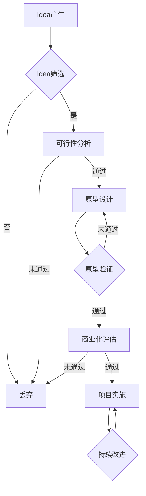

                 

### 文章标题

### 《创新管理体系：从Idea到Implementation的全流程》

> 关键词：创新管理、创新体系、Idea、Implementation、全流程

> 摘要：本文深入探讨了创新管理体系的全流程，从Idea的产生、管理、验证到Implementation，详细介绍了创新管理的核心概念、关键要素、团队建设及过程管理，并分析了创新管理的实践挑战与未来趋势。文章旨在为企业和组织提供系统化的创新管理框架和实用工具，助力提升创新能力和竞争力。

## 第一部分：创新管理基础

### 第1章：创新的本质与类型

#### 1.1 创新的定义与意义

创新，是指通过新的想法、方法、产品或服务，实现旧有系统的改进或创造全新的系统。创新的定义多种多样，但普遍认为创新是创造价值的过程，可以带来经济、社会和环境等多方面的效益。创新的意义在于推动社会进步、经济增长和个人成长，是企业和国家发展的关键驱动力。

首先，创新能够推动社会进步。历史表明，每一次重大的科技进步和社会变革，都离不开创新的推动。例如，工业革命时期的蒸汽机、电力和计算机，都是创新的结果，极大地改变了人类的生产和生活方式。

其次，创新是经济增长的引擎。创新能够提高生产效率、降低成本、开拓新市场，从而推动企业增长和国家经济的繁荣。例如，苹果公司的iPhone不仅改变了手机市场的格局，还带动了全球相关产业链的发展。

最后，创新有助于个人成长。创新能够激发个人的创造力和问题解决能力，提高个人的认知水平和技能，有助于实现个人的职业发展和生活品质的提升。

#### 1.2 创新的类型

创新可以按照不同的维度进行分类，常见的分类方法包括按技术含量、创新程度和领域等。

- **按技术含量分类**：

  - **技术创新**：涉及技术原理、工艺流程和产品设计的创新。例如，计算机技术和互联网技术的创新，推动了信息技术产业的快速发展。

  - **管理创新**：涉及管理理念、组织结构和运营方式的创新。例如，丰田公司的精益生产方式，极大地提升了生产效率和产品质量。

  - **商业模式创新**：涉及产品或服务的提供方式、市场定位和盈利模式的创新。例如，Uber和Airbnb的共享经济模式，颠覆了传统的出行和住宿市场。

- **按创新程度分类**：

  - **革命性创新**：带来重大变革和全新解决方案的创新。例如，互联网和智能手机的发明，彻底改变了人们的生活和工作方式。

  - **改良性创新**：对现有产品或服务进行细微改进或优化。例如，苹果公司对iPhone的不断更新，提升了用户体验和性能。

  - **模式创新**：改变传统的商业模式或服务模式，形成新的市场格局。例如，亚马逊的电商平台模式，改变了传统零售业的运营模式。

- **按领域分类**：

  - **科技领域**：涉及信息技术、生物技术、新材料技术等前沿科技的创新。

  - **产业领域**：涉及制造业、服务业、农业等传统产业领域的创新。

  - **社会领域**：涉及教育、医疗、环保等社会领域的创新。

### 总结

创新的本质在于创造新价值，可以按照技术含量、创新程度和领域等不同维度进行分类。理解创新的定义和类型，有助于我们更好地把握创新的本质和特点，从而在实践中更好地推动创新。

## 第二部分：从Idea到Implementation

### 第2章：创新管理体系的构建

#### 2.1 创新管理体系的定义与目标

创新管理体系是指一套系统化的方法和工具，用于指导和管理创新活动的全过程，从Idea的产生、筛选、验证到最终的商业化实施。创新管理体系的目标包括提高创新效率、降低创新风险、提升创新能力等。

首先，创新管理体系的目标是提高创新效率。通过系统化的方法和工具，企业可以更快速地识别、评估和实施创新项目，从而缩短产品或服务的开发周期，提高市场竞争力。

其次，创新管理体系的目标是降低创新风险。创新活动通常伴随着较高的不确定性，创新管理体系可以帮助企业识别潜在风险，制定相应的风险管理策略，从而降低创新失败的风险。

最后，创新管理体系的目标是提升创新能力。通过建立创新文化、优化创新流程、配置创新资源等，企业可以培养和激发员工的创新潜力，形成持续的创新动力。

#### 2.2 创新管理的关键要素

要构建有效的创新管理体系，需要关注以下几个关键要素：

- **创新战略**：创新战略是企业创新活动的指导思想，包括创新的目标、方向、重点和创新资源的管理等。创新战略需要与企业整体战略相匹配，确保创新活动与企业的长期发展目标一致。

- **创新文化**：创新文化是企业创新氛围的体现，包括企业的价值观、信念和行为规范。创新文化需要鼓励员工敢于尝试、勇于失败，形成积极向上的创新氛围。

- **创新流程**：创新流程是创新活动的实施路径，包括Idea的产生、筛选、验证、实施等环节。创新流程需要科学合理，确保每个环节都能有效地推进创新项目的进展。

- **创新资源**：创新资源包括资金、人力、技术和信息等。创新资源需要合理配置，确保创新项目有充足的资源支持。

### 总结

创新管理体系是提高创新效率、降低创新风险、提升创新能力的重要手段。要构建有效的创新管理体系，需要关注创新战略、创新文化、创新流程和创新资源等关键要素。

### 第3章：创新团队建设与管理

#### 3.1 创新团队的构建

创新团队是实施创新项目的重要力量。一个有效的创新团队需要具备以下特点：

- **多样性**：创新团队应该包括不同背景、经验和技能的成员，这样可以带来多样化的视角和思路，促进创新。

- **协作性**：创新团队成员需要具备良好的协作能力，能够共同解决问题、分享资源和成果。

- **创造力**：创新团队成员需要具备较强的创造力，能够不断产生新的想法和解决方案。

- **学习能力**：创新团队成员需要具备快速学习和适应新知识、新技术的能力。

构建创新团队的步骤如下：

1. **明确目标**：首先需要明确创新团队的目标，包括创新项目的内容、预期成果和创新时间等。

2. **选择成员**：根据创新团队的目标和需求，选择具备相应技能和经验的成员。

3. **组建团队**：将选定的成员组织起来，明确各自的职责和角色，建立有效的沟通和协作机制。

4. **培养和激励**：提供培训和激励机制，激发团队成员的创新潜力，提高团队的整体创新能力。

#### 3.2 创新团队的领导力

创新团队的领导力对于团队的创新效果至关重要。创新团队领导力需要具备以下特点：

- **愿景引领**：创新团队领导力需要具备明确的创新愿景，能够引领团队朝着共同的目标前进。

- **激励激励**：创新团队领导力需要能够激发团队成员的潜力，提供积极的激励和支持。

- **沟通协作**：创新团队领导力需要具备良好的沟通和协作能力，能够协调团队内外部的资源和关系。

- **风险管理**：创新团队领导力需要具备较强的风险管理能力，能够识别和应对创新过程中的各种风险。

#### 3.3 创新团队的激励与评估

为了激发创新团队的活力和创造力，企业需要建立有效的激励机制和评估体系。

- **激励机制**：企业可以通过奖金、晋升、培训等方式，激励团队成员积极参与创新项目。同时，需要建立透明、公正的奖励机制，确保激励措施能够真正激发团队成员的积极性。

- **评估体系**：企业需要建立科学、全面的评估体系，对创新团队的项目进行定期评估。评估体系应该包括项目进度、创新成果、团队协作等多个维度，确保评估结果能够客观反映团队的绩效。

### 总结

创新团队是实施创新项目的重要力量，需要具备多样性、协作性、创造力和学习能力等特点。创新团队的领导力对于团队的创新效果至关重要。建立有效的激励机制和评估体系，能够激发创新团队的活力和创造力。

### 第4章：创新过程管理

#### 4.1 创新过程模型

创新过程模型是对创新活动全过程的理论描述，有助于企业理解和实施创新管理。常见的创新过程模型包括：

1. **线性模型**：线性模型将创新过程划分为明确、顺序的几个阶段，如Idea产生、Idea筛选、验证、实施等。线性模型的优点是简单易懂，但可能忽视了创新过程中的并行性和反馈机制。

2. **螺旋模型**：螺旋模型将创新过程看作是多次迭代和优化的过程，每个迭代周期包括Idea产生、评估、实施、反馈等环节。螺旋模型的优点是能够更好地适应创新过程中的不确定性和复杂性。

3. **瀑布模型**：瀑布模型将创新过程划分为明确、顺序的几个阶段，但每个阶段之间存在反馈机制。瀑布模型的优点是结构清晰，但可能忽视了创新过程中的并行性和灵活性。

4. **敏捷模型**：敏捷模型将创新过程看作是多个短周期（Sprint）的迭代，每个迭代周期包括需求分析、设计、开发、测试等环节。敏捷模型的优点是能够快速响应市场变化，提高创新效率。

#### 4.2 创意生成与管理

创意生成是创新过程的重要环节，是企业创新能力的体现。创意生成的技巧包括：

1. **头脑风暴**：头脑风暴是一种激发创意的方法，通过集体讨论，快速产生大量创意。

2. **思维导图**：思维导图是一种将创意和信息进行可视化表示的方法，有助于梳理和激发创意。

3. **SWOT分析**：SWOT分析是一种评估创意优势和劣势的方法，有助于筛选出有潜力的创意。

创意管理的关键在于对创意进行有效的筛选、分类、存储和管理，确保创意能够得到充分利用。创意管理的方法包括：

1. **创意库**：建立创意库，对创意进行分类、存储和管理，便于检索和应用。

2. **创意评审**：定期对创意进行评审，评估创意的可行性、价值和潜力，筛选出优秀创意。

3. **创意转化**：将创意转化为具体的创新项目，制定实施计划和资源分配，确保创意能够得到有效实施。

#### 4.3 原型设计与验证

原型设计是创新过程的重要环节，通过构建原型，可以验证创意的可行性和有效性。原型设计的方法包括：

1. **低保真原型**：低保真原型是一种简单的、基于纸笔或低技术手段的原型，可以快速构建和迭代，适用于初步验证创意。

2. **高保真原型**：高保真原型是一种接近最终产品外观和功能的原型，可以更准确地模拟用户交互和使用体验，适用于详细验证和优化。

原型验证的步骤包括：

1. **定义验证目标**：明确原型验证的目标，如功能验证、用户体验验证等。

2. **设计验证场景**：根据验证目标，设计相应的验证场景，如用户任务场景、功能测试场景等。

3. **执行验证测试**：在验证场景中执行测试，收集用户反馈和性能数据。

4. **分析验证结果**：对验证结果进行分析，识别原型中的问题和改进点。

#### 4.4 商业化评估与决策

商业化评估是创新过程的关键环节，通过评估创新项目的商业可行性，为企业提供决策依据。商业化评估的指标包括：

1. **市场需求**：评估创新项目是否符合市场需求，是否有足够的用户基础和增长潜力。

2. **技术可行性**：评估创新项目的技术可行性，如技术难点、研发周期等。

3. **商业价值**：评估创新项目的商业价值，如预期收入、利润率等。

4. **竞争分析**：评估创新项目在市场上的竞争地位，如竞争对手的优势和劣势等。

商业化决策的流程包括：

1. **收集信息**：收集与商业化评估相关的信息，如市场需求报告、技术分析报告、财务预测等。

2. **评估分析**：根据收集到的信息，对创新项目进行评估分析，确定项目的商业可行性。

3. **制定决策**：根据评估分析结果，制定商业化决策，如立项、调整项目计划等。

4. **跟踪监控**：在项目实施过程中，持续跟踪和监控项目的进展和风险，及时调整决策。

### 总结

创新过程管理是确保创新活动顺利进行的关键环节。通过创新过程模型，可以更好地理解创新活动的全过程；通过创意生成与管理，可以激发和利用创意；通过原型设计与验证，可以验证创意的可行性和有效性；通过商业化评估与决策，可以为创新项目提供科学的决策依据。创新过程管理的目标是确保创新项目能够高效、顺利地实施，为企业带来可持续的创新成果。

### 第5章：Idea的产生与管理

#### 5.1 Idea的来源

Idea的产生是创新过程的第一步，也是至关重要的一步。一个成功的创新管理体系必须能够有效地捕捉和利用各种来源的Idea。以下是常见的Idea来源：

1. **内部员工**：员工是创新的重要驱动力，他们最了解企业的运作和客户需求。鼓励员工提出创新建议，可以通过定期的创新会议、建议箱或者线上平台等方式实现。

2. **外部客户**：客户是产品或服务的最终使用者，他们的需求和反馈往往是创新的源泉。通过市场调研、用户反馈、客户访谈等方式，可以获取到有价值的Idea。

3. **竞争对手**：竞争对手的产品和服务可以提供创新的灵感。通过分析竞争对手的优势和劣势，可以找到改进和创新的机会。

4. **合作伙伴**：与供应商、合作伙伴或其他利益相关者合作，可以获取新的视角和想法。这种跨行业的合作往往能够带来意想不到的创新成果。

5. **用户社区**：在线社区和社交媒体平台上的用户互动可以产生大量的Idea。用户分享的使用体验、建议和反馈，可以为产品或服务提供改进的方向。

6. **开源社区**：开源社区汇集了大量的技术专家和开发者，他们的贡献和创意可以为企业的创新提供宝贵的资源。

#### 5.2 Idea筛选与评估

产生大量的Idea只是第一步，接下来需要对Idea进行筛选和评估，以确保将最有价值、最具可行性的Idea转化为实际的创新项目。以下是Idea筛选和评估的步骤：

1. **确定筛选标准**：根据企业的战略目标、资源状况和市场需求，明确筛选Idea的标准。常见的筛选标准包括：
   - **市场潜力**：Idea是否有足够的市场需求？
   - **技术可行性**：实现Idea所需的技术是否成熟？
   - **资源需求**：Idea的实施是否需要大量的资金、人力和技术支持？
   - **风险水平**：Idea可能面临的风险和不确定性如何？

2. **初步评估**：对Idea进行初步评估，筛选出那些明显不符合企业战略和资源限制的Idea。这一步可以通过简单的评估工具或方法完成，如SWOT分析、PEST分析等。

3. **详细评估**：对初步筛选出的Idea进行详细评估，包括技术评估、市场评估和商业评估。技术评估要考虑所需技术的成熟度和开发难度；市场评估要分析目标市场的规模、增长潜力和竞争对手；商业评估要考虑项目的投资回报率、利润率和可持续性。

4. **优先级排序**：根据评估结果，对Idea进行优先级排序，确定哪些Idea应该优先考虑实施。优先级排序可以基于市场潜力、技术成熟度、资源需求等因素。

5. **立项决策**：根据优先级排序的结果，对有潜力的Idea进行立项决策。立项决策要考虑Idea的可行性、企业资源和企业战略等因素。

#### 5.3 Idea保护与知识产权

在Idea产生和筛选的过程中，保护知识产权是非常重要的。知识产权包括专利、商标、版权等，是企业和个人创新成果的重要资产。以下是保护Idea和知识产权的方法：

1. **专利申请**：对于具有技术含量的Idea，可以申请专利保护。专利申请可以阻止他人未经许可使用或销售相同的技术。

2. **商标注册**：对于具有商业价值的Idea，如产品名称、品牌标识等，可以申请商标注册。商标注册可以保护企业的品牌形象和商业利益。

3. **版权保护**：对于文学、艺术作品等，可以通过版权保护来防止未经许可的使用和传播。

4. **保密协议**：在Idea开发和商业化的过程中，与员工、合作伙伴等签订保密协议，确保Idea不会泄露。

5. **商业秘密保护**：对于企业的商业秘密，如经营策略、客户信息等，需要采取严格的保密措施，防止泄露和滥用。

### 总结

Idea的产生和管理是创新管理体系的重要环节。通过多种渠道收集Idea，并对其进行有效的筛选和评估，可以确保将最有价值的Idea转化为创新项目。同时，保护Idea和知识产权，是保障企业和个人创新成果的重要措施。有效的Idea管理和知识产权保护，有助于激发创新活力，提升企业的核心竞争力。

### 第6章：Idea的验证与可行性分析

#### 6.1 技术可行性分析

Idea的技术可行性分析是确保创新项目能够在现有技术条件下实现的重要步骤。技术可行性分析主要包括以下几个方面：

1. **现有技术评估**：对Idea所需的关键技术进行评估，了解其成熟度和可靠性。例如，如果Idea涉及新的材料技术，需要评估该材料是否已经经过充分测试，是否具备商业应用潜力。

2. **技术风险识别**：识别Idea实施过程中可能面临的技术风险，如技术难度高、研发周期长等。技术风险识别有助于制定相应的风险管理策略。

3. **研发计划**：根据技术评估结果，制定详细的研发计划，包括研发目标、时间表、里程碑等。研发计划需要确保技术实现的可操作性和可行性。

4. **资源调配**：分析实施Idea所需的技术资源，包括资金、设备和人力资源等。资源调配需要确保在研发过程中有足够的资源支持。

5. **技术验证**：通过实验、模拟或其他验证方法，对技术方案进行验证，确保其能够在实际应用中稳定运行。

#### 6.2 商业可行性分析

商业可行性分析是评估Idea在商业上的可行性和潜在价值的重要步骤。商业可行性分析主要包括以下几个方面：

1. **市场调研**：进行详细的市场调研，了解目标市场的需求、竞争态势、市场规模和发展趋势。市场调研需要收集用户需求、竞争对手信息、市场增长率等关键数据。

2. **需求分析**：分析目标客户的需求，确定产品或服务是否能够满足市场需求。需求分析需要考虑目标客户群体的特征、购买习惯和偏好。

3. **商业模式设计**：根据市场调研和需求分析的结果，设计合理的商业模式。商业模式设计需要考虑盈利模式、成本结构和市场定位。

4. **财务评估**：进行财务评估，包括成本分析、收入预测、现金流分析和盈利预测等。财务评估需要确保项目在经济上具有可行性。

5. **风险评估**：识别商业实施过程中可能面临的风险，如市场风险、技术风险、运营风险等。风险评估需要制定相应的风险应对策略。

#### 6.3 法律与社会可行性分析

Idea的法律和社会可行性分析是确保创新项目在法律和社会规范范围内实施的重要步骤。法律和社会可行性分析主要包括以下几个方面：

1. **法律法规审查**：审查Idea涉及的法律法规，包括专利法、商标法、反垄断法、劳动法等。法律法规审查需要确保Idea的实施不违反相关法律法规。

2. **社会责任评估**：评估Idea对社会的影响，包括对环境、消费者权益、社会道德等方面的影响。社会责任评估需要确保Idea的实施符合社会责任和伦理标准。

3. **社会接受度调查**：调查目标客户和社会公众对Idea的接受度，了解其对Idea的态度和反馈。社会接受度调查需要考虑社会文化、价值观和公众舆论等因素。

4. **合规性检查**：检查Idea的实施是否符合行业标准和规范，如食品安全标准、环境保护标准等。合规性检查需要确保Idea的实施符合相关行业规范。

5. **公共关系管理**：制定公共关系管理策略，确保Idea的实施过程中能够积极应对公众关注和社会舆论。公共关系管理需要建立良好的社会形象和品牌声誉。

### 总结

Idea的验证与可行性分析是确保创新项目成功的关键步骤。技术可行性分析评估了Idea在技术层面的可行性，商业可行性分析评估了Idea在商业上的潜在价值，法律与社会可行性分析确保了Idea在法律和社会规范范围内实施。通过全面的分析和评估，可以确保创新项目具备充分的可行性，降低风险，提高成功率。有效的验证与可行性分析，是创新管理体系的重要组成部分，为创新项目的顺利实施提供了坚实保障。

### 第7章：Idea的实现与迭代

#### 7.1 创意转化为原型

将Idea转化为可执行的原型是创新过程中至关重要的一步。原型是验证Idea可行性、收集用户反馈、测试功能的重要工具。以下是创意转化为原型的过程：

1. **需求分析**：在原型设计之前，首先需要明确创意的需求。这包括用户需求、功能需求、性能需求等。需求分析的结果将指导原型的设计和开发。

2. **概念设计**：基于需求分析的结果，进行概念设计。概念设计包括确定产品或服务的核心功能、界面布局和交互设计。概念设计可以通过草图、线框图或高保真原型等方式进行。

3. **开发原型**：根据概念设计，开始开发原型。原型开发可以使用多种工具，如Figma、Sketch、Adobe XD等。开发过程中，需要确保原型能够模拟实际操作，以便进行功能测试。

4. **用户测试**：开发完原型后，进行用户测试。用户测试可以通过实际用户参与，收集他们的反馈和意见。用户测试的结果可以帮助发现原型中的问题和不足，为进一步改进提供依据。

5. **迭代优化**：根据用户测试的结果，对原型进行迭代优化。迭代优化包括调整功能、界面和交互设计等。通过多次迭代，逐步完善原型，使其更加符合用户需求。

#### 7.2 原型测试与优化

原型测试与优化是确保原型功能完善、用户体验良好、技术实现可行的重要环节。以下是原型测试与优化的步骤：

1. **功能测试**：对原型的功能进行详细测试，确保所有功能都能正常运行。功能测试包括正向测试、反向测试、边界测试等，以覆盖各种可能的操作场景。

2. **性能测试**：对原型的性能进行测试，包括响应时间、负载能力、稳定性等。性能测试可以确保原型在预期的使用环境中能够稳定运行。

3. **用户体验测试**：对原型的用户体验进行测试，包括界面布局、交互设计、易用性等。用户体验测试可以通过实际用户操作，评估原型的易用性和用户满意度。

4. **反馈收集**：在测试过程中，收集用户反馈和建议。用户反馈是优化原型的重要依据，可以帮助发现原型中的问题和不足。

5. **迭代优化**：根据测试结果和用户反馈，对原型进行迭代优化。迭代优化包括调整功能、界面、交互设计等，以提升原型的质量和用户体验。

#### 7.3 产品化与市场推广

将原型转化为最终产品并进行市场推广是创新过程的最后一步。以下是产品化与市场推广的步骤：

1. **产品化**：基于原型的测试结果，进行产品化开发。产品化包括详细设计、开发、测试和部署等环节。产品化需要确保产品能够满足市场需求、技术要求和质量标准。

2. **质量控制**：在产品化过程中，需要进行严格的质量控制，确保产品的功能、性能和用户体验符合预期。质量控制包括代码审查、单元测试、集成测试等。

3. **市场调研**：在产品发布前，进行市场调研，了解目标市场的需求、竞争对手情况和市场趋势。市场调研可以指导产品的定价策略、推广计划和营销策略。

4. **推广计划**：制定详细的推广计划，包括营销渠道、推广活动、促销策略等。推广计划需要确保产品能够迅速进入市场，并赢得用户的认可。

5. **市场反馈**：产品发布后，收集用户反馈和市场反馈。市场反馈是产品改进和营销策略调整的重要依据，可以帮助企业不断优化产品和服务。

6. **持续改进**：根据市场反馈，对产品进行持续改进。持续改进包括功能优化、性能提升、用户体验改进等，以提升产品的市场竞争力。

### 总结

Idea的实现与迭代是创新过程中至关重要的一环。通过将Idea转化为原型、进行原型测试与优化，最终实现产品化并推向市场，企业可以确保创新项目具备实际可行性，并满足用户需求。产品化与市场推广不仅要求技术实现上的高质量，还需要营销策略上的精准定位，以及持续的市场反馈与产品优化。有效的Idea实现与迭代，是提升企业创新能力、实现可持续发展的关键。

### 第8章：创新管理的案例分析

#### 8.1 成功案例分析

创新管理在许多企业中都取得了显著的成果，以下是一些成功的案例：

1. **苹果公司**：苹果公司以其革命性的产品和卓越的用户体验而闻名。苹果公司的成功离不开其创新管理体系，包括持续的技术创新、用户体验优化和产品设计的精细化管理。例如，iPhone的推出不仅改变了手机市场，还带动了整个移动互联网的发展。

2. **谷歌公司**：谷歌公司以其强大的技术创新能力和开放的内部创新文化而著称。谷歌的“20%时间”政策允许员工用20%的工作时间进行个人项目，这一政策催生了包括Gmail、Google News等在内的一系列创新产品。

3. **特斯拉公司**：特斯拉公司通过在电动汽车和能源存储领域的创新，颠覆了传统汽车行业。特斯拉的创新管理体系注重技术前瞻性和产品商业化，其产品如Model S、Model 3等在性能和用户体验上都达到了行业领先水平。

#### 8.2 失败案例分析

创新管理也面临着挑战和失败的风险，以下是一些失败案例：

1. **诺基亚**：诺基亚曾是世界领先的手机制造商，但在面对智能手机市场的变革时，未能及时调整其创新策略。诺基亚在硬件设计和技术创新方面的缓慢，导致其市场份额被苹果和安卓手机制造商迅速蚕食。

2. **柯达**：柯达曾是摄影行业的领导者，但未能成功转型为数字摄影时代。柯达的失败与其不愿意放弃传统的胶片业务、对技术创新的忽视以及对市场变化的反应迟缓有关。

3. **黑莓**：黑莓曾在智能手机市场占据主导地位，但随着iPhone和安卓手机的出现，黑莓未能及时推出具有竞争力的新产品。黑莓的创新管理体系过于封闭，缺乏对市场变化的敏感性和快速响应能力。

#### 8.3 案例总结与启示

通过分析成功和失败的案例，可以得出以下启示：

1. **持续创新是关键**：成功的企业如苹果、谷歌和特斯拉，都具备持续的创新能力和开放的创新文化。企业需要不断推动技术创新和产品改进，以适应市场变化。

2. **适应市场变化**：诺基亚、柯达和黑莓的失败表明，企业需要敏锐地捕捉市场变化，及时调整战略和创新方向。

3. **团队建设与管理**：有效的创新团队建设和管理是创新成功的关键。成功企业都重视团队多样性、协作和领导力，而失败企业则在这方面存在不足。

4. **风险管理**：创新过程中，企业需要识别和管理各种风险，确保创新项目的可行性。诺基亚和柯达的失败部分原因在于未能有效管理技术风险和市场风险。

5. **持续反馈和改进**：成功的企业都注重从用户和市场获取反馈，不断改进产品和服务。这种持续反馈和改进的机制有助于提升产品竞争力和用户体验。

### 总结

成功和失败的案例都为我们提供了宝贵的经验和启示。通过持续创新、适应市场变化、有效团队建设和管理、风险管理以及持续反馈和改进，企业可以构建有效的创新管理体系，提高创新能力和市场竞争力。案例分析和启示有助于我们更好地理解和应用创新管理实践。

### 第9章：创新管理的挑战与未来趋势

#### 9.1 创新管理面临的挑战

尽管创新管理在企业发展中扮演着关键角色，但在实际操作中，企业仍然面临诸多挑战：

1. **资源分配不均**：创新项目往往需要大量资金、人力和技术支持，但在资源有限的情况下，如何合理分配资源成为一大挑战。资源不足可能导致创新项目无法顺利推进，影响整体创新效果。

2. **组织文化障碍**：创新需要开放、包容和激励的组织文化。然而，许多企业存在保守、官僚的文化，这种文化可能抑制员工的创新动力，阻碍创新活动的开展。

3. **快速变化的市场环境**：市场环境的变化速度越来越快，企业需要具备快速适应和响应变化的能力。然而，许多企业在面对市场变化时，反应迟缓，无法及时调整战略和创新方向。

4. **技术创新难度**：随着科技的发展，技术创新的难度也在增加。企业需要投入大量时间和资源进行研发，而且技术创新失败的风险也较高，这对企业的创新能力和风险管理提出了更高的要求。

5. **人才短缺**：创新需要高素质的人才，包括技术专家、产品经理和市场营销专家等。然而，全球范围内高素质人才短缺，特别是对于一些前沿科技领域，人才短缺成为制约创新的重要因素。

#### 9.2 创新管理的未来趋势

随着全球化和技术变革的加速，创新管理的未来趋势也在不断演变：

1. **数字化创新**：数字化转型已经成为企业创新的重要方向。利用大数据、人工智能和云计算等新技术，企业可以更高效地收集和分析数据，实现精细化管理和智能化决策，从而推动创新。

2. **开放式创新**：开放式创新通过跨行业、跨组织的合作，共享资源和知识，提升创新效率。企业可以通过与大学、研究机构、合作伙伴和客户等建立合作关系，实现资源的最大化利用。

3. **可持续创新**：随着环境问题和可持续发展的重要性日益凸显，企业需要将可持续发展理念融入创新过程。通过绿色技术、循环经济等创新，实现经济、社会和环境的综合效益。

4. **敏捷创新**：敏捷创新强调快速迭代和灵活响应，通过敏捷开发方法，企业可以在短时间内快速推出产品原型，进行市场验证和迭代优化。这种创新模式有助于缩短产品上市时间，提高市场竞争力。

5. **人本创新**：以人为本的创新强调员工的参与和创造力。企业需要建立激励员工创新的机制，提供良好的工作环境和成长机会，激发员工的创新潜力。

#### 9.3 创新管理的可持续发展

为了实现创新管理的可持续发展，企业需要采取以下策略：

1. **建立创新文化**：企业需要建立鼓励创新的文化氛围，倡导创新思维，容忍失败，形成积极向上的创新氛围。

2. **优化创新流程**：企业需要优化创新流程，建立科学合理的创新管理机制，确保创新活动能够高效、有序地进行。

3. **配置创新资源**：企业需要合理配置创新资源，包括资金、人力和技术等，确保创新项目有充足的资源支持。

4. **培养创新人才**：企业需要重视创新人才的培养和引进，建立人才激励机制，提高员工的创新能力和综合素质。

5. **持续学习和改进**：企业需要持续学习和吸收新的创新理念和方法，不断改进和创新管理实践，以适应不断变化的市场和技术环境。

### 总结

创新管理面临资源分配、组织文化、市场环境、技术创新和人才短缺等挑战，但同时也展现出数字化创新、开放式创新、可持续创新、敏捷创新和人本创新的未来趋势。通过建立创新文化、优化创新流程、配置创新资源、培养创新人才和持续学习和改进，企业可以实现创新管理的可持续发展，提升创新能力和市场竞争力。

### 第10章：创新管理工具与方法

#### 10.1 创新工具与技术

在创新管理过程中，使用合适的工具和技术可以提高效率、减少风险，并确保创新过程的顺利进行。以下是一些常用的创新工具和技术：

1. **头脑风暴**：头脑风暴是一种通过集体讨论快速产生大量创意的方法。通过头脑风暴，团队成员可以自由地提出想法，并互相激发创意。这种方法通常在创意生成阶段使用。

2. **思维导图**：思维导图是一种将创意和信息进行可视化表示的方法。通过绘制思维导图，团队成员可以更清晰地理解和组织创意，有助于发现潜在的联系和关系。

3. **用户故事地图**：用户故事地图是一种用于产品开发和设计的方法，它通过绘制用户故事来展示用户与产品或服务的交互过程。这种方法有助于确保产品设计和开发过程与用户需求保持一致。

4. **快速原型**：快速原型是一种通过快速构建和测试原型来验证创意的方法。快速原型可以帮助团队在早期阶段发现和解决问题，从而减少后续开发中的风险。

5. **敏捷开发**：敏捷开发是一种灵活、迭代的软件开发方法。通过敏捷开发，团队可以快速响应变化，持续交付有价值的软件，并保持与用户的紧密互动。

#### 10.2 创新方法与应用

创新方法是指在实际创新过程中采用的具体方法和策略，以下是一些常见的创新方法及其应用：

1. **设计思维**：设计思维是一种以用户为中心的创新方法，强调通过深入了解用户需求和痛点，设计出满足用户需求的产品或服务。设计思维广泛应用于产品开发、服务设计和用户体验优化。

2. **跨界合作**：跨界合作是通过跨行业、跨组织的合作，共享资源和知识，实现创新。这种方法有助于突破传统思维局限，发现新的解决方案。

3. **开放式创新**：开放式创新通过外部合作和知识共享，获取外部创意和资源，实现创新。开放式创新可以借助外部合作伙伴的专业知识和用户群体，加快创新速度。

4. **精益创业**：精益创业是一种通过快速迭代和验证来验证商业模式的创新方法。通过精益创业，团队可以快速验证市场假设，降低创业风险。

5. **用户参与**：用户参与是一种通过用户反馈和参与来优化产品或服务的方法。通过用户参与，团队可以更好地理解用户需求，提高产品或服务的市场适应性。

#### 10.3 创新工具与方法的优化

为了确保创新工具和方法的有效应用，企业需要不断优化和创新。以下是一些优化策略：

1. **流程优化**：优化创新流程，确保每个环节都高效、有序地进行。通过流程优化，可以减少不必要的环节和等待时间，提高创新效率。

2. **工具集成**：将不同的创新工具和方法进行集成，实现信息共享和协同工作。例如，将头脑风暴工具、思维导图工具和项目管理工具集成，以便于团队成员之间的沟通和协作。

3. **数据驱动**：通过数据分析，评估创新工具和方法的有效性。通过数据驱动，企业可以了解哪些工具和方法对创新最有帮助，从而进行针对性的优化。

4. **持续改进**：建立持续改进机制，鼓励团队成员提出改进建议，并持续优化创新工具和方法。通过持续改进，企业可以不断适应新的市场和技术环境。

5. **培训与支持**：为团队成员提供必要的培训和支持，确保他们能够熟练掌握和创新工具和方法。通过培训与支持，可以提高团队的创新能力和协作水平。

### 总结

创新管理工具与方法的优化是提升创新能力和效率的关键。通过使用合适的创新工具和技术、采用有效的创新方法，企业可以更高效地开展创新活动，降低风险，提高市场竞争力。不断优化和创新工具与方法，是企业在激烈的市场竞争中保持领先地位的重要策略。

### 附录

#### 附录A：创新管理相关资源

为了帮助读者进一步了解和创新管理相关内容，以下是一些推荐资源：

1. **书籍推荐**：

   - 《创新者的窘境》：作者克莱顿·克里斯滕森，阐述了创新与组织变革的关系。
   - 《创新者的基因》：作者史蒂芬·柯维，探讨了创新者的思维模式和行为习惯。
   - 《创新者的方法论》：作者李笑来，提供了实用的创新方法和工具。

2. **网站推荐**：

   - HBR.org：哈佛商业评论官方网站，提供关于创新管理的高质量文章和案例。
   - FastCompany.com：快速公司官方网站，涵盖创新、创业和商业趋势的最新资讯。
   - MIT Sloan Management Review：麻省理工学院斯隆管理评论官方网站，提供创新管理的深度分析和研究。

3. **课程推荐**：

   - “创新与创业管理”：在Coursera等在线教育平台上，可以找到关于创新管理的课程，涵盖创新策略、设计思维和商业模式设计等内容。
   - “创新管理实践”：在中国大学MOOC等平台上，可以找到国内知名高校开设的创新管理课程，包括理论讲解和实践案例。

通过阅读这些书籍、访问这些网站和参加这些课程，读者可以深入了解创新管理的理论和实践，提升自己的创新能力。

### 附录B：创新管理流程图

以下是一个简化的创新管理流程图，使用Mermaid语法绘制：

该流程图涵盖了从Idea产生到项目实施的整个过程，包括Idea筛选、可行性分析、原型设计、原型验证、商业化评估和项目实施等关键步骤。通过不断迭代和优化，企业可以确保创新项目的高效推进和成功实施。

