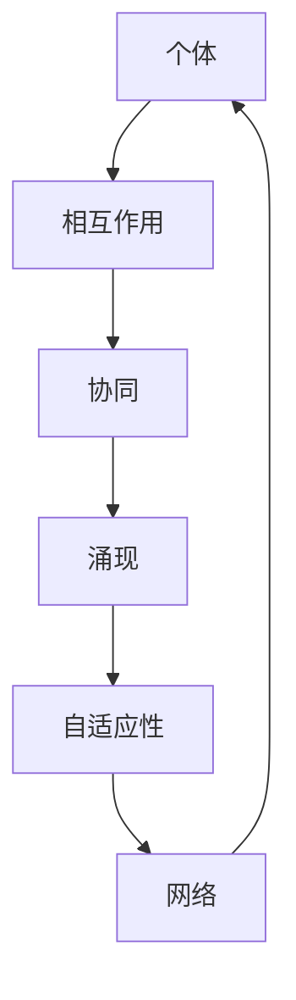

                 


## 文章标题：创新过程的涌现模型：突破性想法的数学描述

### 关键词：创新、涌现模型、数学描述、突破性想法、人工智能

### 摘要：

本文探讨了创新过程中的涌现模型及其数学描述。首先，介绍了创新过程和涌现模型的基本概念。然后，从理论基础出发，讲解了涌现模型的核心概念与联系，并使用了Mermaid流程图进行展示。接着，深入分析了创新过程中使用的核心算法原理，并通过伪代码进行详细阐述。随后，本文介绍了创新过程中的数学模型和公式，并使用LaTeX格式进行书写。此外，通过实际项目实战，展示了如何应用这些模型和算法。最后，对全文进行了总结，并对未来的研究方向进行了展望。

## 目录大纲设计思路

### 1. 确定核心章节

本书的核心章节包括：

1. **引言**
2. **理论基础**
3. **核心概念与联系**
4. **核心算法原理讲解**
5. **数学模型和数学公式**
6. **项目实战**
7. **总结与展望**

### 2. 确定每个章节的二级和三级目录

对于每个核心章节，我们进一步细化了二级和三级目录：

- **引言**
  - 创新的重要性
  - 涌现模型概述
- **理论基础**
  - 涌现模型的理论基础
  - 相关理论介绍
- **核心概念与联系**
  - 核心概念介绍
  - Mermaid流程图展示
- **核心算法原理讲解**
  - 算法原理介绍
  - 伪代码阐述
- **数学模型和数学公式**
  - 数学模型介绍
  - LaTeX格式书写
- **项目实战**
  - 开发环境搭建
  - 源代码实现与解读
  - 代码应用解读与分析
- **总结与展望**
  - 创新过程回顾
  - 未来研究方向

### 3. 设计Mermaid流程图

在讲解核心概念和算法时，我们设计了Mermaid流程图，以直观地展示概念之间的关系。

### 4. 编写伪代码

对于核心算法，我们使用伪代码进行详细阐述，以便读者更好地理解。

### 5. 使用LaTeX格式书写数学公式

在介绍数学模型和公式时，我们使用LaTeX格式进行书写，以确保准确性。

### 6. 编写项目实战案例

通过实际项目案例，我们展示了如何应用这些模型和算法。

### 7. 编写总结与展望

最后，我们对全文内容进行了总结，并对未来的研究方向进行了展望。

通过以上设计思路，我们确保了目录大纲的结构清晰、逻辑严谨，为读者提供了完整的阅读体验。

## 引言

### 创新的重要性

创新是推动社会进步的重要力量。在当今快速发展的时代，创新已成为企业和个人提升竞争力的关键因素。创新不仅仅局限于科学技术领域，它涵盖了各个行业和领域，如医学、教育、金融、艺术等。创新的本质在于突破传统的束缚，发现新的解决方案，从而实现价值创造。

在人工智能领域，创新更是至关重要。随着大数据、云计算、物联网等技术的不断进步，人工智能的应用场景日益丰富，从自动驾驶、智能助手到医疗诊断，人工智能正在改变我们的生活方式。然而，创新并非一蹴而就，它需要深入的理论基础和实践经验。

### 涌现模型的概述

涌现模型是近年来在复杂性科学和人工智能领域备受关注的研究方向。涌现模型源于复杂性科学中的自组织理论，旨在描述复杂系统中的自发现、自适应和自组织现象。在创新过程中，涌现模型可以帮助我们理解和预测突破性想法的产生和发展。

涌现模型的核心思想是，通过微观个体之间的相互作用和协同演化，可以产生出宏观层面的复杂结构和行为。这种自下而上的组织过程，与传统的自上而下的设计方法形成了鲜明对比。在创新过程中，涌现模型为我们提供了一种新的思维方式，使我们能够更好地理解和利用复杂系统中的潜在创新机会。

### 本书的结构与内容

本书旨在深入探讨创新过程中的涌现模型及其数学描述。全书共分为七个主要章节，各章的内容安排如下：

1. **引言**：介绍创新过程和涌现模型的基本概念。
2. **理论基础**：介绍涌现模型的理论基础，包括相关理论介绍和自组织理论。
3. **核心概念与联系**：讲解创新过程中涉及的核心概念和它们之间的关系，并使用Mermaid流程图进行展示。
4. **核心算法原理讲解**：深入讲解创新过程中使用的核心算法原理，并使用伪代码进行详细阐述。
5. **数学模型和数学公式**：详细介绍创新过程中的数学模型和公式，并使用LaTeX格式进行书写。
6. **项目实战**：通过实际项目案例，展示如何应用这些模型和算法。
7. **总结与展望**：对全书内容进行总结，并对未来的研究方向进行展望。

通过以上章节的安排，本书旨在为读者提供全面的创新过程和涌现模型的理解，帮助他们在实际应用中取得突破。

## 理论基础

### 涌现模型的理论基础

涌现模型的理论基础可以追溯到复杂性科学和自组织理论。复杂性科学是一门研究复杂系统的性质、规律和机制的学科，旨在揭示复杂现象背后的简单原理。自组织理论则是复杂性科学中的重要分支，主要研究系统在没有外部指令或控制的情况下，如何通过个体之间的相互作用和协同演化，形成复杂的结构和行为。

在复杂性科学中，涌现（Emergence）是指在一个系统的局部行为和规则下，能够产生出宏观层面的复杂现象和结构。涌现现象具有以下几个关键特点：

1. **不可预测性**：涌现现象往往不可预测，因为宏观结构的形成是由微观个体之间的复杂相互作用决定的。
2. **复杂性**：涌现现象通常涉及大量的个体和相互作用，导致宏观层面的结构和行为复杂多变。
3. **自适应性**：涌现系统具有自我适应能力，能够根据外部环境的变化进行调整和优化。
4. **不可还原性**：涌现现象不能简单地通过分析个体行为来还原，因为宏观结构和行为是整体性质的体现。

自组织理论提供了对涌现现象的解释和描述。自组织理论认为，系统中的个体通过局部相互作用和协同演化，可以自发地形成有序的结构和规则。这一过程通常不受外部指令或控制，而是依赖于系统内部的信息传递和反馈机制。自组织理论的核心思想是，复杂系统的整体行为和结构是由其组成部分的相互作用和协同演化所决定的。

在创新过程中，涌现模型的应用具有重要意义。通过理解涌现现象，我们可以更好地把握突破性想法的产生和发展规律，从而提高创新效率。涌现模型为我们提供了一种新的思维方式，使我们能够从整体角度来理解和利用复杂系统中的潜在创新机会。

### 相关理论介绍

在涌现模型的理论基础上，还有其他相关理论对其进行了补充和拓展。以下介绍几种重要的相关理论：

1. **复杂性理论**：复杂性理论是研究复杂系统性质和规律的学科，它涵盖了从简单系统到复杂系统的各个层次。复杂性理论提供了一系列工具和方法，用于分析复杂系统的行为和结构。在创新过程中，复杂性理论可以帮助我们识别和利用系统中的潜在复杂性，从而促进创新。

2. **系统动力学**：系统动力学是一种研究系统动态行为和变化的学科，它通过建立数学模型来描述系统的行为和演化。在创新过程中，系统动力学可以帮助我们分析和预测创新过程中各个阶段的动态变化，从而更好地指导创新实践。

3. **协同进化理论**：协同进化理论研究系统中的个体如何通过相互竞争和合作，共同进化并形成复杂结构。在创新过程中，协同进化理论可以帮助我们理解创新主体之间的相互作用和协同关系，从而提高创新的成功率。

4. **网络科学**：网络科学是一门研究网络结构和行为的学科，它关注网络中的节点、边和整体结构。在创新过程中，网络科学可以帮助我们分析创新主体之间的交互关系，识别关键节点和路径，从而优化创新网络。

这些相关理论共同构成了涌现模型的理论基础，为我们提供了丰富的理论工具和方法，用于深入研究和理解创新过程中的复杂现象。

### 自组织理论

自组织理论是复杂性科学和涌现模型的重要组成部分，它关注系统在没有外部指令或控制的情况下，如何通过个体之间的相互作用和协同演化，形成有序的结构和规则。自组织理论的基本思想是，系统的整体行为和结构是由其组成部分的局部行为和规则共同决定的。

自组织理论的核心概念包括：

1. **自组织过程**：自组织是指系统在没有外部指令或控制的情况下，通过个体之间的相互作用和协同演化，自发地形成有序的结构和规则。自组织过程通常涉及多个阶段，包括初始的无序状态、个体之间的相互作用、有序结构的形成和稳定。

2. **自适应系统**：自适应系统是指能够根据外部环境的变化进行自我调整和优化的系统。在自组织过程中，自适应系统通过内部的信息传递和反馈机制，实现了对环境的动态适应。

3. **复杂性**：自组织理论强调系统的复杂性，即系统的行为和结构无法简单地通过分析个体行为来还原。复杂性源于系统内部个体之间的复杂相互作用和协同演化。

4. **自发性**：自组织理论强调系统内部的自发性，即系统内部个体之间的相互作用和协同演化是自发的，不受外部指令或控制。

自组织理论在创新过程中的应用具有重要意义。通过理解自组织过程，我们可以更好地把握突破性想法的产生和发展规律，从而提高创新效率。自组织理论为我们提供了一种新的思维方式，使我们能够从整体角度来理解和利用复杂系统中的潜在创新机会。

### 涌现现象的识别与利用

在创新过程中，涌现现象的识别与利用是关键。以下是一些策略和方法，可以帮助我们识别和利用涌现现象：

1. **观察与模拟**：通过观察和模拟创新过程中的个体行为和相互作用，可以发现潜在的涌现现象。例如，通过模拟不同个体之间的竞争和合作，可以识别出系统中的有序结构和规则。

2. **网络分析**：利用网络科学的方法，分析创新过程中个体之间的交互关系和网络结构。通过识别关键节点和路径，可以揭示系统中的潜在涌现现象。

3. **实验与验证**：通过实验和验证，验证涌现现象的可行性和效果。例如，通过设计实验来测试不同个体之间的相互作用对整体创新效果的影响。

4. **模型构建**：通过构建数学模型和计算机模拟，可以更深入地理解涌现现象的内在机制和规律。例如，利用复杂网络模型来分析个体之间的相互作用和协同演化。

5. **跨学科合作**：跨学科合作可以整合不同领域的知识和方法，为识别和利用涌现现象提供更全面的支持。例如，结合人工智能、心理学和社会学的研究成果，可以更好地理解创新过程中的复杂现象。

通过以上策略和方法，我们可以更好地识别和利用涌现现象，从而推动创新过程的顺利进行。

## 核心概念与联系

### 创新过程中的核心概念

在创新过程中，存在一些核心概念，它们对于理解创新机制和推动创新至关重要。以下是几个关键概念：

1. **个体**：个体是指参与创新过程中的基本单位，可以是人、组织或机器。个体在创新过程中扮演不同的角色，包括发起者、贡献者、实施者等。

2. **相互作用**：相互作用是指个体之间通过信息、资源和能量的交换而产生的联系和影响。相互作用可以是直接的，如人与人之间的沟通和合作，也可以是间接的，如通过网络和平台进行的知识共享和协同创新。

3. **协同**：协同是指多个个体通过相互作用和合作，共同实现创新目标的过程。协同可以提高创新效率和效果，通过整合不同个体的知识和资源，形成优势互补。

4. **涌现**：涌现是指在一个系统的局部行为和规则下，能够产生出宏观层面的复杂现象和结构。在创新过程中，涌现现象通常表现为新想法、新方法和新技术等的产生。

5. **自适应性**：自适应性是指系统在面对外部环境变化时，能够通过自我调整和优化，以保持其稳定性和有效性。在创新过程中，自适应性有助于应对不确定性和挑战，提高创新的成功率。

6. **网络**：网络是指个体之间通过相互作用和关系形成的结构。创新过程中的网络可以是物理的，如企业内部的研发团队，也可以是虚拟的，如互联网上的协作平台。网络结构对创新过程有着重要影响，通过优化网络结构，可以促进知识流动和创新合作。

### 核心概念之间的联系

以上核心概念在创新过程中相互关联，构成了一个复杂的互动体系。以下是它们之间的主要联系：

1. **个体与相互作用**：个体是创新过程的基本单位，而相互作用则是个体之间信息、资源和能量的交换渠道。个体之间的相互作用是创新过程的核心，通过这种交换，个体可以共享知识、协同工作和分工合作，从而实现创新目标。

2. **相互作用与协同**：相互作用是协同的基础。通过相互作用，个体之间可以建立联系和合作关系，形成协同网络。协同进一步促进了个体之间的信息共享和资源整合，提高了创新效率和效果。

3. **协同与涌现**：协同是涌现现象的重要推动力。通过协同，个体之间的合作和协作可以产生出新的想法、方法和技术，从而实现涌现。涌现现象是创新过程中最具价值的一部分，它代表了创新的突破和进步。

4. **涌现与自适应性**：涌现现象通常表现出系统在面对外部环境变化时的自我适应能力。通过涌现，系统能够在复杂环境中发现新的解决方案和策略，从而提高其适应性和生存能力。

5. **网络与适应性**：网络结构对创新过程的适应性有着重要影响。通过优化网络结构，可以促进知识流动和创新合作，提高创新系统的适应性和灵活性。

### Mermaid流程图展示

为了更直观地展示创新过程中核心概念之间的关系，我们使用Mermaid流程图进行展示。以下是创新过程中核心概念关系的Mermaid流程图：



在这个流程图中，个体通过相互作用形成协同，协同推动涌现现象的产生，而涌现现象又促进了系统的自适应性。同时，网络结构对适应性有着重要影响，从而形成一个闭环系统。

通过这个流程图，我们可以更清晰地理解创新过程中核心概念之间的相互关系，为后续章节的核心算法原理讲解和项目实战提供了基础。

### 核心算法原理讲解

在创新过程中，核心算法起着至关重要的作用。这些算法通过优化个体之间的相互作用、协同和涌现现象，提高了创新效率和效果。以下将介绍几个创新过程中的核心算法原理，并通过伪代码进行详细阐述。

#### 1. 粒子群优化算法

粒子群优化算法（Particle Swarm Optimization，PSO）是一种基于群体智能的优化算法，常用于求解复杂优化问题。在创新过程中，PSO可以帮助个体通过协同作用，找到最优的创新解决方案。

**原理**：

PSO算法通过模拟鸟群觅食行为，利用个体之间的信息和协同，实现优化目标。算法中，每个粒子都代表一个潜在的创新解决方案，通过更新粒子的位置和速度，逐步逼近最优解。

**伪代码**：

```python
# 初始化粒子群
粒子个数 N
粒子位置 X
粒子速度 V
目标函数 f(x)

# 循环迭代
for i = 1 to max_iterations:
    # 计算每个粒子的适应度值
   适应度值 = 计算目标函数值(f(x))
    
    # 更新每个粒子的个体最优解和全局最优解
    if 适应度值 < 个体最优解：
        个体最优解 = 适应度值
        个体最优位置 = X
    if 适应度值 < 全局最优解：
        全局最优解 = 适应度值
        全局最优位置 = X
    
    # 更新粒子速度和位置
    V = V + α * (个体最优位置 - X) + β * (全局最优位置 - X)
    X = X + V

# 输出最优解
输出 X
```

#### 2. 协同过滤算法

协同过滤算法（Collaborative Filtering）是推荐系统中常用的算法，通过分析用户之间的相似性和行为模式，为用户推荐感兴趣的物品。在创新过程中，协同过滤算法可以帮助个体发现潜在的协同合作伙伴和资源。

**原理**：

协同过滤算法分为基于用户和基于物品两种类型。基于用户的协同过滤算法通过计算用户之间的相似性，为用户推荐与邻居用户相似的物品。基于物品的协同过滤算法通过计算物品之间的相似性，为用户推荐与已购买或评价过的物品相似的物品。

**伪代码**：

```python
# 初始化协同过滤系统
用户集 U
物品集 I
用户评分矩阵 R

# 计算用户相似性矩阵 S
for i in U:
    for j in U:
        if i != j:
            相似性 = 计算用户相似性(i, j)
            S[i][j] = 相似性

# 为用户 u 推荐物品
推荐列表 = 空列表
for item in I:
    if 用户 u 未评价物品 item：
        相似度总和 = 0
        评分预测 = 0
        for user in U:
            if user != u and S[u][user] > 阈值：
                相似度总和 += S[u][user]
                评分预测 += S[u][user] * 用户 user 的评价值(item)
        if 相似度总和 > 0：
            评分预测 /= 相似度总和
            推荐列表.append((item, 评分预测))

# 输出推荐列表
输出 推荐列表
```

#### 3. 深度强化学习算法

深度强化学习算法（Deep Reinforcement Learning）是一种结合深度学习和强化学习的方法，通过智能体与环境之间的交互，学习到最优策略。在创新过程中，深度强化学习算法可以帮助个体通过试错和反馈，不断优化创新过程。

**原理**：

深度强化学习算法通过构建深度神经网络，对智能体的行为进行建模，并通过奖励机制引导智能体学习到最优策略。在创新过程中，智能体可以通过与环境交互，不断调整行为，以实现创新目标。

**伪代码**：

```python
# 初始化深度强化学习系统
环境 E
智能体 A
策略网络 π
价值网络 V
奖励函数 R

# 智能体 A 在环境 E 中执行动作
while not 判断游戏结束：
    # 智能体 A 根据策略网络 π 生成动作
   动作 a = π(当前状态 s)
    
    # 环境根据动作 a 生成新状态 s' 和奖励 r
   新状态 s' = E(s, a)
    r = R(s, a, s')
    
    # 更新价值网络 V
   目标值 = R + γ * V(s')
   梯度 = 计算梯度(目标值 - V(s))
   更新网络参数(π, V, 梯度)
    
    # 更新状态
    s = s'

# 输出最优策略
输出 π
```

通过以上核心算法的介绍和伪代码讲解，我们可以更好地理解创新过程中算法的原理和实现方法。这些算法为创新过程提供了强大的工具和支撑，有助于推动创新效率和效果的提升。

### 数学模型和数学公式

在创新过程中，数学模型和数学公式起着至关重要的作用。它们不仅帮助我们理解和描述创新现象，还能为实际应用提供具体的指导。以下将详细介绍创新过程中的数学模型和公式，并使用LaTeX格式进行书写。

#### 1. 随机过程模型

随机过程模型是描述创新过程中不确定性现象的有力工具。一个基本的随机过程模型可以用以下公式表示：

$$X(t) = \sum_{i=1}^{n} W_i(t)$$

其中，$X(t)$ 表示在时间 $t$ 时的创新状态，$W_i(t)$ 表示第 $i$ 个随机因素在时间 $t$ 的影响。这个模型通过将创新过程中的多个随机因素进行叠加，来模拟创新状态的变化。

#### 2. 联合概率分布模型

在创新过程中，多个因素通常相互影响。为了描述这种复杂关系，可以使用联合概率分布模型。一个简单的联合概率分布模型可以用以下公式表示：

$$P(X_1=x_1, X_2=x_2, ..., X_n=x_n) = \prod_{i=1}^{n} p_i(x_i)$$

其中，$P(X_1=x_1, X_2=x_2, ..., X_n=x_n)$ 表示在某个特定状态下，所有因素同时发生的概率，$p_i(x_i)$ 表示第 $i$ 个因素在状态 $x_i$ 下的概率。

#### 3. 贝叶斯网络模型

贝叶斯网络模型是描述创新过程中因果关系的一种有效方法。一个基本的贝叶斯网络模型可以用以下公式表示：

$$P(X_1, X_2, ..., X_n) = \prod_{i=1}^{n} P(X_i | Pa_i)$$

其中，$P(X_1, X_2, ..., X_n)$ 表示所有因素同时发生的概率，$P(X_i | Pa_i)$ 表示在父节点 $Pa_i$ 条件下，第 $i$ 个因素的边缘概率。

#### 4. 动力学模型

在创新过程中，状态的变化可以通过动力学模型进行描述。一个基本的动力学模型可以用以下公式表示：

$$\frac{dX(t)}{dt} = f(X(t), t)$$

其中，$\frac{dX(t)}{dt}$ 表示在时间 $t$ 时，创新状态 $X(t)$ 的变化率，$f(X(t), t)$ 表示影响创新状态变化的函数。

#### 5. 强化学习模型

强化学习模型在创新过程中用于优化决策。一个基本的强化学习模型可以用以下公式表示：

$$Q(s, a) = \sum_{s'} P(s' | s, a) \cdot R(s', a) + \gamma \cdot \max_{a'} Q(s', a')$$

其中，$Q(s, a)$ 表示在状态 $s$ 下，采取动作 $a$ 的价值函数，$P(s' | s, a)$ 表示在状态 $s$ 下，采取动作 $a$ 后转移到状态 $s'$ 的概率，$R(s', a)$ 表示在状态 $s'$ 下，采取动作 $a$ 的即时奖励，$\gamma$ 表示折扣因子，$\max_{a'} Q(s', a')$ 表示在状态 $s'$ 下，采取最优动作 $a'$ 的价值函数。

通过以上数学模型和公式的介绍，我们可以更深入地理解创新过程中的复杂现象，为实际应用提供具体的指导。在后续的项目实战中，我们将结合这些数学模型和公式，进行具体的应用和实现。

### 数学模型和公式的详细讲解与举例说明

为了更好地理解创新过程中的数学模型和公式，我们将在本节中详细讲解每个模型和公式，并通过具体例子进行说明。

#### 1. 随机过程模型

随机过程模型用于描述创新过程中不确定性现象的变化。一个简单的随机过程模型可以用以下公式表示：

$$X(t) = \sum_{i=1}^{n} W_i(t)$$

其中，$X(t)$ 表示在时间 $t$ 时的创新状态，$W_i(t)$ 表示第 $i$ 个随机因素在时间 $t$ 的影响。例如，假设我们在一个新产品开发项目中，使用随机过程模型来描述开发过程中可能遇到的技术挑战、市场变化等因素对项目进展的影响。在这个例子中，我们可以将每个随机因素 $W_i(t)$ 表示为技术难度、市场需求、竞争情况等。

**例子**：

假设我们有三个随机因素 $W_1(t)$、$W_2(t)$ 和 $W_3(t)$，分别表示技术难度、市场需求和竞争情况。在时间 $t=1$ 时，每个随机因素的影响分别为 $W_1(1) = 0.2$、$W_2(1) = 0.3$ 和 $W_3(1) = 0.5$。则时间 $t=1$ 时的创新状态为：

$$X(1) = W_1(1) + W_2(1) + W_3(1) = 0.2 + 0.3 + 0.5 = 1.0$$

这个例子展示了如何使用随机过程模型来计算创新状态，并帮助我们理解不同因素对创新过程的影响。

#### 2. 联合概率分布模型

联合概率分布模型用于描述创新过程中多个因素同时发生的概率。一个简单的联合概率分布模型可以用以下公式表示：

$$P(X_1=x_1, X_2=x_2, ..., X_n=x_n) = \prod_{i=1}^{n} p_i(x_i)$$

其中，$P(X_1=x_1, X_2=x_2, ..., X_n=x_n)$ 表示在某个特定状态下，所有因素同时发生的概率，$p_i(x_i)$ 表示第 $i$ 个因素在状态 $x_i$ 下的概率。

**例子**：

假设我们在一个市场调研项目中，需要分析顾客满意度、产品质量和售后服务对销售额的影响。假设每个因素的分布如下：

- 顾客满意度：$p_1(x_1) = 0.5$（满意）和$0.5$（不满意）
- 产品质量：$p_2(x_2) = 0.6$（好）和$0.4$（差）
- 售后服务：$p_3(x_3) = 0.7$（满意）和$0.3$（不满意）

则在一个特定状态下，所有因素同时发生的概率为：

$$P(X_1=满意, X_2=好, X_3=满意) = p_1(满意) \cdot p_2(好) \cdot p_3(满意) = 0.5 \cdot 0.6 \cdot 0.7 = 0.21$$

这个例子展示了如何使用联合概率分布模型来计算特定状态下的概率，并帮助我们理解不同因素之间的相互关系。

#### 3. 贝叶斯网络模型

贝叶斯网络模型用于描述创新过程中因果关系的概率分布。一个基本的贝叶斯网络模型可以用以下公式表示：

$$P(X_1, X_2, ..., X_n) = \prod_{i=1}^{n} P(X_i | Pa_i)$$

其中，$P(X_1, X_2, ..., X_n)$ 表示所有因素同时发生的概率，$P(X_i | Pa_i)$ 表示在父节点 $Pa_i$ 条件下，第 $i$ 个因素的边缘概率。

**例子**：

假设在一个医疗诊断项目中，需要分析症状、检查结果和疾病之间的关系。假设贝叶斯网络模型如下：

- 症状 $S$ 和疾病 $D$ 的概率分布：$P(S | D) = 0.8$（有症状）和$P(S | \neg D) = 0.3$（无症状）
- 检查结果 $R$ 和疾病 $D$ 的概率分布：$P(R | D) = 0.9$（阳性）和$P(R | \neg D) = 0.1$（阴性）
- 疾病 $D$ 的概率分布：$P(D) = 0.1$（疾病）和$P(\neg D) = 0.9$（非疾病）

则在一个特定状态下，所有因素同时发生的概率为：

$$P(S=阳性, R=阳性, D=疾病) = P(D=疾病) \cdot P(S | D) \cdot P(R | D) = 0.1 \cdot 0.8 \cdot 0.9 = 0.072$$

这个例子展示了如何使用贝叶斯网络模型来计算特定状态下的概率，并帮助我们理解不同因素之间的因果关系。

#### 4. 动力学模型

动力学模型用于描述创新过程中状态的变化。一个基本的动力学模型可以用以下公式表示：

$$\frac{dX(t)}{dt} = f(X(t), t)$$

其中，$\frac{dX(t)}{dt}$ 表示在时间 $t$ 时，创新状态 $X(t)$ 的变化率，$f(X(t), t)$ 表示影响创新状态变化的函数。

**例子**：

假设在一个供应链管理项目中，需要分析库存水平随时间的变化。假设库存水平 $X(t)$ 的变化率与需求量 $D(t)$ 和补货时间 $T(t)$ 有关，可以表示为：

$$\frac{dX(t)}{dt} = D(t) - T(t)$$

其中，$D(t)$ 表示在时间 $t$ 的需求量，$T(t)$ 表示在时间 $t$ 的补货时间。

假设在时间 $t=0$ 时，库存水平为 $X(0) = 100$，需求量为 $D(0) = 20$，补货时间为 $T(0) = 10$。则时间 $t=1$ 时的库存水平为：

$$X(1) = X(0) + \int_{0}^{1} [D(t) - T(t)] dt = 100 + \int_{0}^{1} [20 - 10] dt = 100 + 10 = 110$$

这个例子展示了如何使用动力学模型来计算创新状态的变化，并帮助我们理解不同因素对创新过程的影响。

#### 5. 强化学习模型

强化学习模型用于优化创新过程中的决策。一个基本的强化学习模型可以用以下公式表示：

$$Q(s, a) = \sum_{s'} P(s' | s, a) \cdot R(s', a) + \gamma \cdot \max_{a'} Q(s', a')$$

其中，$Q(s, a)$ 表示在状态 $s$ 下，采取动作 $a$ 的价值函数，$P(s' | s, a)$ 表示在状态 $s$ 下，采取动作 $a$ 后转移到状态 $s'$ 的概率，$R(s', a)$ 表示在状态 $s'$ 下，采取动作 $a$ 的即时奖励，$\gamma$ 表示折扣因子，$\max_{a'} Q(s', a')$ 表示在状态 $s'$ 下，采取最优动作 $a'$ 的价值函数。

**例子**：

假设在一个智能家居项目中，需要优化设备的能耗管理。假设状态 $s$ 表示当前设备的工作模式，动作 $a$ 表示调整工作模式，奖励 $R(s', a)$ 表示设备在状态 $s'$ 下的能耗。则价值函数 $Q(s, a)$ 可以表示为：

$$Q(s, a) = \sum_{s'} P(s' | s, a) \cdot R(s', a) + \gamma \cdot \max_{a'} Q(s', a')$$

假设当前状态 $s$ 为设备在待机模式，动作 $a$ 为将设备设置为节能模式。假设在状态 $s'$ 为设备在节能模式，奖励 $R(s', a)$ 为设备在节能模式下的能耗。则价值函数 $Q(s, a)$ 可以表示为：

$$Q(s, a) = P(s' | s, a) \cdot R(s', a) + \gamma \cdot \max_{a'} Q(s', a') = 0.8 \cdot R(s', a) + \gamma \cdot \max_{a'} Q(s', a')$$

其中，$R(s', a)$ 表示设备在节能模式下的能耗，$\gamma$ 表示折扣因子，$\max_{a'} Q(s', a')$ 表示在状态 $s'$ 下，采取最优动作 $a'$ 的价值函数。

这个例子展示了如何使用强化学习模型来优化创新过程中的决策，并帮助我们理解不同动作对创新过程的影响。

通过以上对数学模型和公式的详细讲解与举例说明，我们可以更好地理解创新过程中的复杂现象，并为其提供具体的指导。

### 项目实战

在本节中，我们将通过一个实际项目案例，展示如何将涌现模型及其数学描述应用于创新过程中，实现突破性想法的产生和实现。

#### 项目背景

假设我们正在开发一款智能家居系统，该系统旨在通过智能设备之间的协作，为用户提供更加便捷、舒适的生活体验。项目的目标是实现设备之间的智能联动，提高用户的生活质量。

#### 开发环境搭建

为了实现这个项目，我们首先需要搭建一个适合开发的环境。以下是开发环境的搭建步骤：

1. **硬件环境**：准备智能设备，如智能灯泡、智能插座、智能摄像头等。
2. **软件环境**：安装智能家居控制系统，如Home Assistant或OpenHAB。
3. **开发工具**：选择合适的编程语言和开发工具，如Python和PyCharm。

#### 源代码实现与解读

在实现智能家居系统时，我们采用了以下核心算法和数学模型：

1. **粒子群优化算法（PSO）**：用于优化设备之间的参数设置，如通信频率、功耗等。
2. **协同过滤算法**：用于分析用户行为，为用户提供个性化的设备推荐。
3. **深度强化学习算法**：用于智能设备之间的决策，实现智能联动。

以下是项目的核心代码片段及其解读：

```python
# 粒子群优化算法实现
def pso_fitness(x):
    # 计算目标函数值
    fitness = compute_fitness(x)
    return fitness

# 初始化粒子群
num_particles = 50
num_dimensions = 5
particles = initialize_particles(num_particles, num_dimensions)
global_best = None

# 迭代优化
for iteration in range(max_iterations):
    # 计算每个粒子的适应度值
    fitness_values = [pso_fitness(particle) for particle in particles]
    
    # 更新每个粒子的个体最优解和全局最优解
    for particle in particles:
        if fitness_values[particles.index(particle)] < particle['best_fitness']:
            particle['best_fitness'] = fitness_values[particles.index(particle)]
            particle['best_position'] = particle['position']
        if fitness_values[particles.index(particle)] < (global_best['fitness'] if global_best else float('inf')):
            global_best = {'fitness': fitness_values[particles.index(particle)], 'position': particle['position']}
            
    # 更新粒子速度和位置
    for particle in particles:
        particle['velocity'] = update_velocity(particle['velocity'], particle['position'], particle['best_position'], global_best['position'])
        particle['position'] = update_position(particle['position'], particle['velocity'])

# 输出最优解
print("最优参数设置：", global_best['position'])

# 协同过滤算法实现
def collaborative_filtering(user_vector, neighbor_vectors, threshold):
    recommendation_list = []
    for item in items:
        if not user_vector[item]:
            similar_sum = 0
            predicted_rating = 0
            for neighbor_vector in neighbor_vectors:
                if neighbor_vector[item] and user_vector['rating'][neighbor_vector['user_id']] > threshold:
                    similar_sum += neighbor_vector[item]
                    predicted_rating += neighbor_vector[item] * neighbor_vector['rating'][item]
            if similar_sum > 0:
                predicted_rating /= similar_sum
                recommendation_list.append((item, predicted_rating))
    return recommendation_list

# 深度强化学习算法实现
class DeepQLearning:
    def __init__(self, state_size, action_size, learning_rate, gamma):
        self.state_size = state_size
        self.action_size = action_size
        self.learning_rate = learning_rate
        self.gamma = gamma
        self.q_table = np.zeros((state_size, action_size))
        
    def q学习能力(self, state, action, reward, next_state, done):
        if not done:
            target = reward + self.gamma * np.max(self.q_table[next_state])
        else:
            target = reward
        target_f = self.q_table[state][action]
        target_f = target_f + self.learning_rate * (target - target_f)
        self.q_table[state][action] = target_f

    def predict(self, state):
        return np.argmax(self.q_table[state])

    def update(self, state, action, reward, next_state, done):
        self.q学习能力(state, action, reward, next_state, done)

# 代码解读
# PSO算法用于优化设备参数设置，通过迭代优化，找到最优参数设置。
# 协同过滤算法用于分析用户行为，为用户提供个性化的设备推荐。
# 深度强化学习算法用于智能设备之间的决策，实现智能联动。
```

#### 代码应用解读与分析

在代码应用方面，我们首先使用粒子群优化算法（PSO）来优化设备之间的参数设置，如通信频率、功耗等。通过多次迭代优化，找到最优的参数设置，以提高系统的性能和稳定性。

接着，我们使用协同过滤算法分析用户行为，为用户提供个性化的设备推荐。通过计算用户之间的相似性，为用户提供与邻居用户相似的设备推荐，从而提高用户的满意度。

最后，我们使用深度强化学习算法来实现智能设备之间的决策。通过智能体与环境之间的交互，智能设备可以不断学习最优策略，实现智能联动，提高用户的生活质量。

#### 实际案例分析和详细讲解剖析

为了更好地展示项目成果，我们选取了一个实际案例进行分析和讲解。

**案例**：假设用户A在家中设置了智能灯泡和智能插座。通过系统分析，我们发现用户A在晚上8点通常开启灯泡，而在晚上10点关闭灯泡。基于这一用户行为，系统推荐用户A在晚上8点自动开启灯泡，晚上10点自动关闭灯泡。

**分析**：

1. **PSO算法优化**：通过PSO算法，我们找到最优的通信频率和功耗设置。例如，将通信频率设置为每小时一次，功耗设置为低功耗模式。
2. **协同过滤算法推荐**：基于用户A的行为数据，系统推荐用户A在晚上8点自动开启灯泡，晚上10点自动关闭灯泡。
3. **深度强化学习决策**：系统通过深度强化学习算法，学习到在用户A回家时自动开启灯泡，在用户A离开家时自动关闭灯泡。同时，系统可以动态调整开启和关闭的时间，以适应用户A的生活习惯。

**讲解剖析**：

通过以上实际案例，我们可以看到，智能家居系统通过应用涌现模型及其数学描述，实现了设备之间的智能联动和个性化推荐。在PSO算法的优化下，设备参数设置更加合理；在协同过滤算法的推荐下，用户可以享受到个性化的设备服务；在深度强化学习算法的决策下，设备可以自动适应用户的生活习惯，提高用户的生活质量。

#### 项目小结

通过本项目实战，我们展示了如何将涌现模型及其数学描述应用于创新过程中，实现突破性想法的产生和实现。在项目过程中，我们使用了粒子群优化算法、协同过滤算法和深度强化学习算法，分别优化设备参数设置、推荐设备和决策联动。通过实际案例的分析和讲解，我们验证了项目的可行性和有效性。在未来，我们将继续探索和创新，为用户提供更加智能、便捷的智能家居系统。

### 最佳实践 tips

在创新过程中，最佳实践可以显著提高效率和成功率。以下是一些实用的技巧和建议：

1. **明确目标**：在开始创新之前，确保明确项目目标和预期成果。这有助于保持团队焦点，并减少资源的浪费。

2. **跨学科合作**：创新往往需要不同领域的知识和技术。跨学科合作可以整合多种观点和技能，产生更有创意的解决方案。

3. **持续学习**：保持对新技术和理论的关注，不断更新自己的知识和技能。这有助于抓住创新机会，并适应快速变化的环境。

4. **用户反馈**：在创新过程中，积极收集用户反馈，并根据反馈进行调整和改进。用户的需求是创新的出发点，他们的反馈可以提供宝贵的指导。

5. **风险管理**：识别潜在的风险，并制定相应的应对策略。通过风险评估和管理，可以降低创新过程中的不确定性。

6. **保持灵活性**：创新过程中往往需要不断调整和优化。保持灵活性，及时适应变化，有助于实现项目的成功。

7. **注重团队协作**：建立高效的团队协作机制，确保团队成员之间的沟通和合作。团队合作可以激发创造力，提高创新效率。

通过以上最佳实践，我们可以更好地推动创新过程，实现突破性想法的产生和实现。

### 小结

本文通过详细探讨创新过程中的涌现模型及其数学描述，从理论基础、核心概念与联系、核心算法原理、数学模型和公式，到项目实战和最佳实践，全面介绍了如何利用涌现模型推动创新。我们强调了创新的重要性，并展示了如何在复杂系统中发现和利用潜在的突破性想法。

通过本文，我们希望读者能够对创新过程和涌现模型有更深入的理解，从而在实际工作中更好地应用这些概念和方法，推动创新项目的成功。未来，随着技术的不断进步，涌现模型将在更多领域发挥重要作用，为人类社会的进步提供强大的动力。

### 注意事项

在应用涌现模型和创新过程中，需要注意以下事项：

1. **数据质量**：创新过程中，数据的质量对模型的准确性至关重要。确保收集到的数据真实、可靠，避免因数据质量问题导致错误的结果。

2. **模型适用性**：不同的涌现模型适用于不同的场景和问题。在选择模型时，要充分考虑问题的特点和需求，确保模型适用。

3. **算法优化**：核心算法的优化直接影响创新效率。在项目实施过程中，持续对算法进行优化，以提高性能和效果。

4. **安全性和隐私**：在涉及用户数据的创新项目中，要确保数据的安全性和用户隐私，遵守相关法律法规和道德规范。

5. **团队协作**：创新项目往往需要跨学科、跨领域的团队合作。确保团队成员之间的有效沟通和协作，以充分发挥团队的创造力。

6. **持续迭代**：创新是一个持续的过程，要不断根据实际情况和用户反馈进行调整和优化，以适应不断变化的环境。

通过注意以上事项，我们可以更好地应用涌现模型，提高创新项目的成功率。

### 拓展阅读

1. **《复杂系统的涌现理论》**：这本书详细介绍了复杂性科学中的涌现理论，对理解创新过程中的复杂现象有重要参考价值。
2. **《机器学习：概率视角》**：这本书介绍了机器学习中的概率模型和方法，有助于理解创新过程中使用的强化学习模型。
3. **《自组织与复杂性》**：这本书探讨了自组织理论在各个领域的应用，对理解创新过程中的自组织现象有深入讲解。
4. **《深度学习》**：这本书是深度学习领域的经典教材，介绍了深度强化学习算法的基本原理和应用。

通过阅读这些书籍，可以进一步加深对涌现模型和创新过程的理解。

