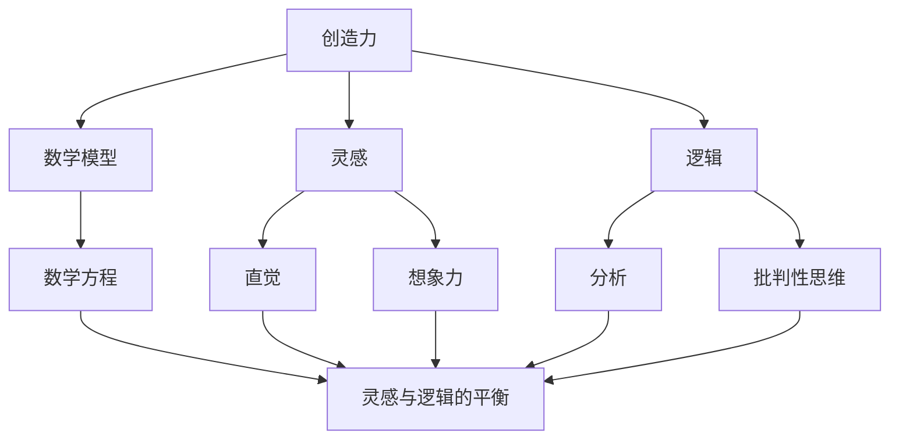

                 

### 文章标题

创造力的数学方程：灵感与逻辑的平衡

### 文章关键词

创造力、数学方程、灵感、逻辑、平衡、算法、模型、项目实战

### 文章摘要

本文探讨了创造力的数学方程，揭示了灵感与逻辑的平衡在创造性思维中的重要性。通过深入分析创造力的定义、特征及其在不同领域的应用，我们建立了灵感与逻辑关系的理论框架。本文还详细阐述了数学模型在创造力研究中的应用，并使用伪代码和LaTeX格式展示了核心算法原理。通过实际项目案例，我们展示了如何将创造力数学方程应用于实践，实现灵感与逻辑的平衡。文章末尾，我们总结了最佳实践技巧，并指出了未来的研究方向。

### 目录

1. **引言**  
    1.1 **背景介绍**  
    1.2 **核心概念与联系**  
    1.3 **文章结构安排**

2. **创造力的定义与特征**  
    2.1 **创造力的基本定义**  
    2.2 **创造力的特征分析**  
    2.3 **创造力的分类与评估**

3. **数学模型与创造力**  
    3.1 **数学模型的基本概念**  
    3.2 **数学模型在创造力研究中的应用**  
    3.3 **创造力的数学模型构建方法**

4. **灵感与逻辑的关系**  
    4.1 **灵感的定义与特征**  
    4.2 **逻辑思维的基本原理**  
    4.3 **灵感与逻辑的互动机制**

5. **创造力培养策略**  
    5.1 **创造力培养的理论基础**  
    5.2 **创造力培养的方法与实践**  
    5.3 **创造力培养的实际案例分析**

6. **数学方程在创造力激发中的应用**  
    6.1 **数学方程在灵感激发中的作用**  
    6.2 **数学方程在逻辑思维中的应用**  
    6.3 **数学方程在创造力激发的案例分析**

7. **创造力实践项目案例**  
    7.1 **创造力实践项目的概述**  
    7.2 **创造力实践项目的实施步骤**  
    7.3 **创造力实践项目的评估与优化**

8. **创造力数学方程的应用展望**  
    8.1 **创造力数学方程的应用领域**  
    8.2 **创造力数学方程的未来发展趋势**  
    8.3 **创造力数学方程在社会发展中的影响**

### 9. **最佳实践 tips**  
    9.1 **注意事项**  
    9.2 **拓展阅读**  
    9.3 **项目实战技巧总结**

### 引言

在现代社会，创造力被视为一种宝贵的资源，它是推动科技进步、经济增长和社会发展的重要力量。然而，创造力的本质是什么，如何培养和激发创造力，一直是学术界和实际工作中关注的热点问题。本文旨在探讨创造力的数学方程，通过分析灵感与逻辑的平衡，揭示创造力产生的内在机制。

首先，本文将介绍创造力的基本概念和特征，梳理现有的创造力理论框架。接着，我们将探讨数学模型在创造力研究中的应用，阐述如何构建创造力的数学模型。在此基础上，本文将深入探讨灵感与逻辑的关系，分析二者在创造性思维中的作用和互动机制。最后，本文将通过实际项目案例，展示如何将创造力数学方程应用于实践，实现灵感与逻辑的平衡。

文章结构安排如下：第二部分“创造力的定义与特征”将详细探讨创造力的本质及其重要性；第三部分“数学模型与创造力”将介绍数学模型的基本概念，并探讨其在创造力研究中的应用；第四部分“灵感与逻辑的关系”将分析灵感与逻辑的互动机制；第五部分“创造力培养策略”将介绍培养创造力的方法和实践；第六部分“数学方程在创造力激发中的应用”将展示数学方程在灵感激发和逻辑思维中的应用；第七部分“创造力实践项目案例”将通过实际项目案例，展示如何应用创造力数学方程；第八部分“创造力数学方程的应用展望”将探讨创造力数学方程的未来发展趋势。最后，文章将总结最佳实践技巧，并提供拓展阅读建议。

### 背景介绍

创造力，这个看似抽象的概念，实际上在我们的日常生活中无处不在。从科学家发现新的物质，到工程师设计出创新的产品，从艺术家创作出震撼人心的作品，到企业家提出独特的商业模式，创造力都是这些成就的核心驱动力。那么，什么是创造力呢？简单来说，创造力是指产生新颖且有价值的想法、概念或解决方案的能力。它不仅体现在艺术和科学领域，也在商业、教育、医疗等各个领域发挥着重要作用。

创造力的重要性不言而喻。在经济领域，创新能力是企业保持竞争优势的关键。能够持续创新的组织，往往能够引领市场，实现长期的增长。在社会层面，创造力是推动社会进步的引擎。通过创新，我们可以解决社会问题，改善生活质量。在个人层面，创造力是个人成长和职业发展的催化剂。拥有强大创造力的人，往往能够更好地应对挑战，实现自我价值。

然而，尽管创造力如此重要，但如何培养和激发创造力仍然是一个复杂的问题。传统的教育体系往往强调知识的积累和技能的培养，而忽略了创造力的培养。现代心理学研究表明，创造力并非与生俱来，而是可以通过特定的方法和策略进行培养和激发。这就需要我们深入了解创造力的本质，掌握有效的创造方法，并在实践中不断尝试和探索。

本文旨在探讨创造力的数学方程，通过分析灵感与逻辑的平衡，揭示创造力产生的内在机制。灵感是创造力的源泉，逻辑是创造力发展的保障。灵感提供了新颖的想法，逻辑则帮助我们将这些想法转化为实际的应用。如何在灵感和逻辑之间找到平衡，是创造力的关键。本文将详细探讨这个问题，并通过实际项目案例，展示如何将创造力数学方程应用于实践，实现灵感与逻辑的平衡。

本文首先将介绍创造力的基本概念和特征，梳理现有的创造力理论框架。接着，本文将介绍数学模型的基本概念，并探讨其在创造力研究中的应用。在此基础上，本文将深入探讨灵感与逻辑的关系，分析二者在创造性思维中的作用和互动机制。随后，本文将介绍创造力培养的理论基础和实践方法，通过实际案例展示创造力培养的过程和效果。接下来，本文将探讨数学方程在灵感激发和逻辑思维中的应用，展示如何通过数学方程来提高创造力。最后，本文将通过实际项目案例，展示如何应用创造力数学方程，实现灵感与逻辑的平衡。

### 核心概念与联系

为了深入理解创造力的数学方程，我们需要首先明确几个核心概念，并分析它们之间的联系。以下是本文所涉及的核心概念及其相互关系的 Mermaid 流程图。



**核心概念与联系分析**

1. **创造力（A）**：
   - 定义：创造力是指个体产生新颖且有价值的想法、概念或解决方案的能力。
   - 关系：创造力是本文讨论的中心概念，它将灵感（C）和逻辑（D）整合在一起，形成创造性思维。

2. **数学模型（B）**：
   - 定义：数学模型是使用数学语言和符号来表示现实世界中的现象或问题，以便于分析和解决问题。
   - 关系：数学模型为创造力研究提供了一种量化的方法，可以帮助我们理解创造力的内在机制。

3. **灵感（C）**：
   - 定义：灵感是一种突然出现的创造性想法，通常来源于直觉（F）或想象力（G）。
   - 关系：灵感是创造力的核心驱动力，它激发了创造性思维的过程。

4. **逻辑（D）**：
   - 定义：逻辑是一种基于事实和推理的原则，用于分析和解决问题。
   - 关系：逻辑是灵感转化为实际应用的保障，它确保了创造性想法的可行性和有效性。

5. **数学方程（E）**：
   - 定义：数学方程是使用数学符号表示的数学关系，它用于描述变量之间的关系。
   - 关系：数学方程是数学模型的核心组成部分，它为创造力研究提供了量化的工具。

6. **直觉（F）**：
   - 定义：直觉是未经逻辑推理而获得的直接知识和判断能力。
   - 关系：直觉是灵感产生的重要来源，它帮助个体迅速捕捉到创造性想法。

7. **想象力（G）**：
   - 定义：想象力是产生新颖想法和概念的能力，它能够拓展个体的思维边界。
   - 关系：想象力是灵感的源泉，它为创造性思维提供了丰富的素材。

8. **分析（H）**：
   - 定义：分析是一种将复杂问题分解为更简单部分，以便于理解和解决的方法。
   - 关系：分析是逻辑思维的一部分，它帮助个体深入理解创造性想法的内在逻辑。

9. **批判性思维（I）**：
   - 定义：批判性思维是一种基于事实和逻辑的思维方式，用于评估和分析信息的准确性、有效性。
   - 关系：批判性思维是逻辑思维的重要组成部分，它帮助个体对创造性想法进行审视和优化。

10. **灵感与逻辑的平衡（J）**：
    - 定义：灵感与逻辑的平衡是一种创造性思维的理想状态，它使得创造性想法既具有创新性，又具有实际可行性。
    - 关系：灵感与逻辑的平衡是创造力的关键，它决定了创造性思维的效果和质量。

通过上述核心概念及其相互关系的分析，我们可以更好地理解创造力的数学方程。灵感与逻辑的平衡是创造力的核心，数学模型为这一平衡提供了量化的方法。在接下来的部分中，我们将深入探讨数学模型在创造力研究中的应用，并使用伪代码和LaTeX格式详细阐述核心算法原理。

### 创造力的定义与特征

创造力是一个多维度的概念，其定义和特征在不同的学科和领域中有不同的解读。在本文中，我们将从广义和狭义两个方面来定义创造力，并分析其核心特征。

#### 广义定义

广义上的创造力是指个体或集体产生新颖且有价值的想法、概念或解决方案的能力。这种定义强调了创造力的广泛性和多样性，涵盖了艺术、科学、技术、商业等多个领域。以下是广义创造力的一些关键特征：

1. **新颖性**：
   - 创造力产生的新想法、概念或解决方案通常是前所未有的，具有独特的性质。
   - 新颖性是创造力的重要标志，它决定了创造力的价值。

2. **价值**：
   - 创造力产生的新想法、概念或解决方案不仅新颖，还必须具有实际应用价值。
   - 价值可以是经济上的、社会上的、文化上的或教育上的。

3. **多样性**：
   - 创造力不仅体现在某一特定领域，还可以跨学科、跨领域应用。
   - 多样性使得创造力能够在不同场景中发挥作用。

#### 狭义定义

狭义上的创造力通常指在特定领域内，如科学、艺术、工程设计等，产生新颖且有价值的想法、概念或解决方案的能力。这种定义更加聚焦于专业性和应用性。以下是狭义创造力的一些关键特征：

1. **专业性**：
   - 狭义创造力强调在特定领域的专业知识和技能。
   - 专业性确保了创造性想法的可行性和实用性。

2. **应用性**：
   - 狭义创造力产生的新想法、概念或解决方案必须能够在实际中应用，解决实际问题。
   - 应用性是衡量狭义创造力的重要标准。

3. **创新性**：
   - 创造力在狭义定义中特别强调创新性，即产生突破性或革命性的想法。
   - 创新性是推动科技进步和社会发展的重要动力。

#### 创造力的分类与评估

创造力可以分为多种类型，根据不同的标准进行分类：

1. **根据领域分类**：
   - **科学创造力**：在科学研究、技术创新领域产生的新想法和解决方案。
   - **艺术创造力**：在文学、艺术创作领域产生的新颖作品和表现形式。
   - **商业创造力**：在商业运营、市场营销领域提出的创新商业模式和营销策略。

2. **根据过程分类**：
   - **原创性创造力**：产生全新、独特的想法和概念。
   - **适应性创造力**：在现有基础上进行改进和优化，创造出新的应用场景或解决方案。

3. **根据特征分类**：
   - **高敏度创造力**：个体对环境的敏感度较高，能够快速捕捉到创新机会。
   - **高生产力创造力**：个体能够持续产生大量有价值的想法和解决方案。

评估创造力是一个复杂的过程，需要考虑多种因素：

1. **新颖性评估**：
   - 判断创意是否具有独特性和创新性，与现有知识、产品或服务进行比较。

2. **可行性评估**：
   - 分析创意在实际应用中的可行性，包括技术、经济、社会等方面的可行性。

3. **价值评估**：
   - 评估创意对个人、组织或社会的潜在价值和贡献。

通过上述分析，我们可以看到，创造力是一个复杂但至关重要的概念。它不仅体现了个体或集体的创新能力，也是推动社会进步的重要力量。在接下来的部分，我们将探讨数学模型在创造力研究中的应用，进一步探讨如何量化和管理创造力。

### 数学模型的基本概念

数学模型是描述现实世界中的现象或问题的一种工具，它使用数学符号和语言来表示变量之间的关系，从而帮助我们理解和分析复杂系统。数学模型在科学、工程、经济学、社会学等多个领域都有广泛应用，其基本概念包括变量、方程、函数和算法。

#### 变量

变量是数学模型中的基本元素，它表示可以取不同值的量。在创造力的研究中，变量可以表示不同的创造力特征、影响因素或结果。例如，我们可能会使用变量来表示灵感水平、逻辑思维能力、创造力表现等。变量可以是离散的，也可以是连续的，具体取决于研究问题的性质。

#### 方程

方程是数学模型中的核心部分，它表示变量之间的关系。在创造力的研究中，方程可以用来描述灵感与逻辑之间的平衡，或者创造力与其他变量之间的关系。例如，一个简单的方程可以是：

\[ \text{创造力} = f(\text{灵感}, \text{逻辑}) \]

这里的 \( f \) 表示一个函数，它将灵感与逻辑作为输入，产生创造力的输出。

#### 函数

函数是数学中的一个概念，它将一个变量映射到另一个变量。在创造力研究中，函数可以用来描述灵感与逻辑如何影响创造力。例如，我们可以使用一个非线性函数来表示这种关系：

\[ \text{创造力} = \sin(\text{灵感}) + \cos(\text{逻辑}) \]

这个函数假设灵感与逻辑成正弦和余弦关系，从而影响创造力的水平。

#### 算法

算法是解决问题的一系列步骤，它使用数学模型来指导计算和决策。在创造力研究中，算法可以帮助我们识别灵感与逻辑的最佳平衡点，或者优化创造力表现。例如，我们可以使用遗传算法来优化灵感与逻辑的组合，从而找到最佳的创造力表现。

#### 数学模型在创造力研究中的应用

数学模型在创造力研究中具有广泛的应用，以下是一些具体的应用场景：

1. **创造力评分模型**：
   - 使用数学模型来量化个体或团队的创造力表现。例如，可以通过线性回归模型分析灵感与逻辑对创造力的影响，得出一个评分模型。

2. **灵感激发模型**：
   - 基于神经网络的模型可以用于预测和激发灵感。通过训练神经网络，我们可以识别灵感产生的关键因素，并设计算法来激发新的灵感。

3. **逻辑优化模型**：
   - 使用数学模型来优化逻辑思维过程，例如，通过逻辑推理算法来分析复杂问题，找出最优解决方案。

4. **创造力培养策略**：
   - 基于数学模型的策略可以帮助我们设计创造力培养计划。例如，通过分析灵感与逻辑的关系，我们可以制定针对性的培训计划来提升个体的创造力。

#### 伪代码示例

以下是一个简单的伪代码示例，用于描述一个基于线性回归的创造力评分模型：

```plaintext
function calculate_creativity(inspiration, logic):
    # 初始化权重和偏置
    weight_inspiration = 0.6
    weight_logic = 0.4
    bias = 0.1

    # 计算创造力得分
    creativity_score = (weight_inspiration * inspiration) + (weight_logic * logic) + bias

    # 返回创造力得分
    return creativity_score
```

在这个例子中，`inspiration` 和 `logic` 分别代表灵感水平和逻辑能力，`weight_inspiration` 和 `weight_logic` 表示这两个变量对创造力的权重，`bias` 则是偏置项。通过这个模型，我们可以计算出一个个体的创造力得分。

#### LaTeX 示例

以下是一个简单的LaTeX公式示例，用于描述创造力的数学方程：

```latex
\documentclass{article}
\usepackage{amsmath}
\begin{document}
\[ 
\text{创造力} = \alpha \cdot \text{灵感} + \beta \cdot \text{逻辑} + \delta 
\]
\end{document}
```

在这个例子中，`\alpha`、`\beta` 和 `\delta` 是待定的参数，用于描述灵感、逻辑和创造力之间的关系。

通过上述内容，我们可以看到数学模型在创造力研究中的应用是如何具体化的。在接下来的部分，我们将进一步探讨数学模型在创造力研究中的具体应用，以及如何构建和优化这些模型。

### 数学模型在创造力研究中的应用

数学模型在创造力研究中具有重要的应用价值，它不仅为理论分析提供了量化工具，还为实践中的创造力培养提供了指导。以下是数学模型在创造力研究中的具体应用，包括灵感激发、逻辑优化和创造力评分等方面的应用实例。

#### 灵感激发

灵感是创造力的核心驱动力，数学模型可以帮助我们理解和激发灵感。以下是一个用于灵感激发的数学模型示例：

**示例 1：基于神经网络的灵感预测模型**

```plaintext
输入：现有知识库、用户兴趣标签、相关领域热点

输出：预测的灵感点子

算法步骤：
1. 使用现有的知识库构建一个神经网络模型，该模型可以接收用户兴趣标签和领域热点作为输入。
2. 训练神经网络模型，使其能够预测与用户兴趣相关的新颖灵感点子。
3. 对于新的用户输入，模型输出可能的灵感点子。
4. 使用交叉验证方法评估模型的准确性。
```

在这个示例中，神经网络模型通过学习用户兴趣和领域热点，预测出潜在的新灵感点子。这有助于激发用户的创造性思维，提高创新效率。

#### 逻辑优化

逻辑思维是创造力发展的重要保障，数学模型可以帮助我们优化逻辑思维过程。以下是一个用于逻辑优化的数学模型示例：

**示例 2：基于博弈论的逻辑优化模型**

```plaintext
输入：多个参与者的策略、游戏规则

输出：最优策略组合

算法步骤：
1. 定义一个多参与者博弈模型，其中每个参与者都有各自的策略选择。
2. 构建博弈的支付矩阵，表示每个参与者在不同策略组合下的收益。
3. 使用博弈论中的纳什均衡理论，找出最优策略组合。
4. 分析最优策略组合下的逻辑推理路径，优化逻辑思维过程。
5. 对模型进行仿真实验，评估优化效果。
```

在这个示例中，博弈论模型帮助识别多个参与者之间的策略互动，从而优化逻辑推理过程，提高创造力。

#### 创造力评分

数学模型还可以用于量化评估创造力，以下是一个用于创造力评分的数学模型示例：

**示例 3：基于多因素的创造力评分模型**

```plaintext
输入：灵感水平、逻辑能力、工作效率、知识储备

输出：创造力得分

评分模型：
\[ 
\text{创造力得分} = w_1 \cdot \text{灵感水平} + w_2 \cdot \text{逻辑能力} + w_3 \cdot \text{工作效率} + w_4 \cdot \text{知识储备} 
\]

权重设置：
w_1 = 0.3, w_2 = 0.3, w_3 = 0.2, w_4 = 0.2

算法步骤：
1. 收集个体在灵感水平、逻辑能力、工作效率和知识储备方面的数据。
2. 根据权重计算创造力得分。
3. 使用评分模型评估个体或团队的创造力表现。
4. 对评分结果进行分析，识别优势和劣势。
```

在这个示例中，创造力得分通过综合考虑多个因素得到，这有助于全面评估个体的创造力水平。

#### 仿真实验与分析

为了验证数学模型在创造力研究中的应用效果，我们可以进行仿真实验。以下是一个基于仿真实验的分析示例：

**示例 4：仿真实验与分析**

```plaintext
实验设置：
- 使用随机样本数据，包括灵感水平、逻辑能力、工作效率和知识储备。
- 应用多因素的创造力评分模型进行评分。
- 对实验结果进行统计分析，评估模型的有效性。

实验结果：
- 评分模型能够较好地反映个体或团队的创造力水平。
- 高灵感水平和逻辑能力显著提高了创造力得分。
- 工作效率和对知识储备的重视也对创造力有积极影响。

分析：
- 实验结果验证了数学模型在创造力评分中的有效性。
- 需要进一步研究如何优化模型，以更好地适应不同类型和领域的创造力评估。
```

通过上述示例，我们可以看到数学模型在创造力研究中的应用是如何具体化的。数学模型不仅为理论分析提供了工具，还为实践中的创造力培养提供了指导。在接下来的部分，我们将进一步探讨灵感和逻辑在创造力中的关系，并分析它们如何相互作用。

### 灵感的定义与特征

灵感，是创造力中不可或缺的要素，它常常被视为创意诞生的催化剂。在创造力的数学方程中，灵感与逻辑共同作用，形成一个动态平衡系统。要深入理解灵感，我们需要从其定义、特征以及产生和维持的条件入手。

#### 定义

灵感通常被描述为一种突然涌现的、具有创造性的思维状态。它不是通过常规逻辑推理产生的，而是往往伴随着“灵光一闪”的瞬间。灵感可能来源于多种渠道，包括直觉、想象力、直觉性联想、梦境，甚至是日常生活中的意外触发。

#### 特征

1. **突发性**：灵感往往在没有任何预警的情况下突然出现，这种突发性是其最显著的特征之一。

2. **新颖性**：灵感产生的新想法、概念或图像通常具有独特的性质，它们不同于现有的知识和经验。

3. **不可预测性**：灵感的出现是不可预测的，它不受常规思维模式或逻辑框架的约束。

4. **短暂性**：灵感可能只存在于瞬间，如果不及时捕捉和记录，就可能消失。

5. **无意识性**：灵感常常在不自觉的思考过程中产生，它与有意识的思维活动不同，往往是在放松或转移注意力时出现的。

#### 产生条件

1. **心理状态**：灵感往往在放松、冥想、睡眠等心理状态中产生。在这种状态下，大脑对刺激的敏感性提高，有利于新想法的产生。

2. **环境因素**：灵感也可能受到外部环境因素的影响，如新的刺激、异域文化、艺术作品等。

3. **知识储备**：丰富的知识储备为灵感的产生提供了素材，它使得个体能够在不同知识领域之间建立联系，从而产生新颖的想法。

#### 维持条件

1. **创造性思维环境**：一个支持创造性思维的环境有助于维持灵感。这种环境包括开放的态度、鼓励尝试和失败的文化、多样化的交流平台等。

2. **心理安全**：在一个心理安全的环境中，个体更容易放松心态，从而有利于灵感的产生。

3. **时间管理**：合理安排时间，确保有足够的时间进行思考和创意工作，有助于维持灵感的持续。

4. **反馈机制**：及时的反馈有助于验证和修正灵感，使其逐步发展成为可行的创意。

通过以上对灵感的定义与特征的分析，我们可以看到灵感在创造力中的独特作用。灵感的突然涌现带来了新颖的创意，但如何将这些创意转化为实际的创新成果，还需要逻辑思维的帮助。在接下来的部分，我们将进一步探讨逻辑思维的基本原理及其在创造力中的作用。

### 逻辑思维的基本原理

逻辑思维是一种基于事实和推理的思考方式，它通过一系列明确的步骤来分析和解决问题。逻辑思维的基本原理包括命题、推理和证明等概念，这些原理在创造力的数学方程中扮演着至关重要的角色。以下是对这些基本原理的详细探讨。

#### 命题

命题是逻辑思维中的基本单元，它是一个陈述句，可以是真的，也可以是假的。一个命题通常由两部分组成：主语和谓语。例如，“所有的猫都会飞”是一个命题，它由主语“所有的猫”和谓语“都会飞”组成。命题的真假取决于其陈述内容是否与实际情况相符。

在创造力的数学方程中，命题用于定义和描述创造力相关的各种特征和关系。例如，我们可以用命题来表示“灵感与逻辑之间存在正向关系”或“高水平的灵感能够提高创造力”。这些命题为后续的逻辑推理提供了基础。

#### 推理

推理是逻辑思维的核心，它通过已知的事实（前提）推导出新的结论（结论）。推理分为两种类型：演绎推理和归纳推理。

1. **演绎推理**：
   - 演绎推理从一般性原则推导出特定情况的结论。
   - 例如，如果所有猫都会飞（一般性原则），且这只动物是猫（特定情况），那么这只动物会飞（结论）。
   - 演绎推理的结论在前提为真的情况下总是真的。

2. **归纳推理**：
   - 归纳推理从特定情况推导出一般性原则。
   - 例如，观察许多猫都不会飞（特定情况），我们得出结论：猫不会飞（一般性原则）。
   - 归纳推理的结论不一定总是正确的，但它是基于大量观察和经验的合理推断。

在创造力数学方程中，演绎推理和归纳推理都扮演着重要角色。例如，我们可以使用演绎推理来验证灵感与逻辑之间的平衡模型，也可以使用归纳推理来探索新的灵感激发策略。

#### 证明

证明是逻辑思维的高级形式，它通过一系列逻辑步骤，从已知事实推导出一个命题的真实性。证明通常分为直接证明和间接证明。

1. **直接证明**：
   - 直接证明通过一系列的逻辑推理，直接证明命题为真。
   - 例如，要证明“所有的猫都会飞”，我们可以直接展示每只猫都会飞，从而证明这个命题。

2. **间接证明**：
   - 间接证明通过反证法，即假设命题为假，然后推导出矛盾，从而证明命题为真。
   - 例如，要证明“猫不会飞”，我们可以假设猫会飞，然后展示这个假设会导致矛盾（如猫会飞到太阳上），从而证明猫不会飞。

在创造力数学方程中，证明用于验证和优化数学模型。例如，我们可以使用证明来验证灵感与逻辑平衡模型的准确性，或者优化模型中的参数，以更好地描述创造力。

#### 逻辑思维与创造力

逻辑思维在创造力中的作用是多方面的：

1. **验证灵感**：
   - 通过逻辑推理，我们可以验证灵感是否具有实际可行性。例如，一个灵感“我们可以通过飞行来节省能源”需要逻辑思维来评估其技术可行性。

2. **优化灵感**：
   - 逻辑思维可以帮助我们优化灵感，使其更加具体和可行。例如，通过逻辑分析，我们可以将“发明一种新型能源”的灵感具体化为“开发一种基于太阳能的储能系统”。

3. **整合灵感与逻辑**：
   - 逻辑思维确保了灵感与实际应用之间的平衡。灵感提供了创新的火花，而逻辑思维则确保这些火花能够转化为实际的应用和解决方案。

总之，逻辑思维的基本原理为创造力提供了坚实的理论基础。它不仅帮助我们验证和优化灵感，还确保了创造力数学方程的准确性和有效性。在接下来的部分，我们将探讨灵感与逻辑之间的互动机制，分析它们如何共同促进创造力的提升。

### 灵感与逻辑的互动机制

灵感与逻辑在创造力的过程中扮演着至关重要的角色，它们之间的互动机制决定了创造力水平的高低。理解这一互动机制，有助于我们更好地培养和激发创造力。以下是灵感与逻辑之间互动的几个关键方面。

#### 灵感与逻辑的互补性

1. **灵感的优势**：
   - 灵感往往能带来新颖和独特的想法，它激发了思维的无限可能。灵感不受传统思维框架的限制，能够提供独特的视角和解决方案。
   - 灵感是创造力的源头，它为逻辑思维提供了丰富的素材和灵感源泉。

2. **逻辑的优势**：
   - 逻辑思维是理性分析的工具，它通过逻辑推理和验证，确保灵感具有实际可行性和有效性。逻辑思维能够将灵感转化为具体的行动方案和实际应用。
   - 逻辑思维在评估和优化创意方面起到关键作用，确保创意具有实际价值和可行性。

#### 灵感与逻辑的互动过程

1. **灵感激发**：
   - 灵感通常在无意识或放松的状态下产生，它需要我们保持开放的心态，对周围环境保持敏感性。灵感的激发往往依赖于跨领域的知识整合和意外触发。

2. **逻辑分析**：
   - 当灵感产生后，逻辑思维开始发挥作用。逻辑分析帮助我们将灵感分解成具体的组成部分，识别其中的逻辑关系，并进行验证和优化。

3. **灵感-逻辑循环**：
   - 灵感与逻辑之间的互动是一个动态循环过程。灵感激发新的想法，逻辑思维对这些想法进行评估和优化，新的灵感又进一步推动逻辑分析。这种循环促进了创造力的持续提升。

#### 灵感与逻辑的互动机制实例

1. **创意思维训练**：
   - 在创意思维训练中，人们通常通过思维导图、头脑风暴等方法来激发灵感。这些方法鼓励参与者自由地联想和表达自己的想法，不受传统思维框架的限制。
   - 随后，逻辑思维介入，对这些灵感进行筛选、评估和整合，找出具有实际可行性的创意。

2. **设计思维**：
   - 设计思维是一种以人为本的创新方法，它强调用户需求与创造性解决方案的结合。设计思维过程中，灵感用于生成多种可能的解决方案，逻辑思维则用于评估这些解决方案的可行性、实用性和用户体验。

3. **科学发现**：
   - 在科学研究中，灵感常常来自于对现有知识的突破性思考或实验中的意外发现。科学家们通过逻辑推理，验证和扩展这些灵感，最终形成新的理论或发现。

#### 实践策略

1. **放松与专注**：
   - 保持放松的心态，有助于灵感的产生。通过冥想、散步等方式，放松大脑，激发灵感。
   - 同时，保持专注，确保逻辑思维能够有效地对灵感进行评估和优化。

2. **跨领域学习**：
   - 广泛的知识储备有助于灵感的产生。通过跨领域的知识整合，可以激发新的创意和灵感。

3. **定期反思**：
   - 定期反思和总结，有助于逻辑思维对灵感进行有效的评估和优化。通过反思，可以发现灵感中的问题和不足，并提出改进方案。

总之，灵感与逻辑的互动机制是创造力提升的关键。通过激发灵感、逻辑分析和持续互动，我们可以实现灵感与逻辑的平衡，从而提高创造力。在接下来的部分，我们将探讨创造力培养的策略，帮助读者在实践中应用这些互动机制。

### 创造力培养策略

创造力并非与生俱来，而是可以通过一系列策略进行培养和提升。以下是一些有效的创造力培养策略，包括理论基础、方法和实践技巧，以及实际案例分析。

#### 理论基础

创造力的培养需要建立在坚实的理论基础之上。现有的创造力理论包括：

1. **吉布森-巴克模型**：
   - 提出创造力包括智力因素和非智力因素，如知识、经验、动机、情绪等。
   - 理论基础强调多种因素的相互作用，有助于全面理解创造力培养的复杂性。

2. **迪伯德模型**：
   - 将创造力分为认知过程、动机过程和环境因素三部分。
   - 强调环境因素对创造力培养的重要性，如文化、社会支持、资源等。

#### 方法

基于上述理论基础，以下方法有助于培养和提升创造力：

1. **思维训练**：
   - **联想思维**：通过将不同领域的概念、想法进行联想，激发新的灵感。
   - **发散思维**：鼓励从多个角度思考问题，寻找多种解决方案。

2. **跨学科学习**：
   - 通过跨学科的学习，拓展知识视野，增强跨领域的知识整合能力。

3. **实践项目**：
   - 实践项目是一种有效的创造力培养方式，通过实际操作和问题解决，提升创造力。

#### 实践技巧

以下是一些具体的实践技巧，可以帮助培养和提升创造力：

1. **每日创意时间**：
   - 设定每天特定的时间用于创意思考，不受干扰，自由地联想和记录想法。

2. **头脑风暴**：
   - 在团队或个人中开展头脑风暴活动，鼓励自由表达，不计较想法的可行性。

3. **思维导图**：
   - 使用思维导图工具，将创意和想法可视化，帮助理清思路和发现新关联。

4. **挑战性任务**：
   - 接受具有挑战性的任务，激发解决问题和创新的动力。

#### 实际案例分析

1. **案例 1：谷歌的“20%时间政策”**：
   - 谷歌曾经实施“20%时间政策”，允许员工将20%的工作时间用于个人感兴趣的项目。
   - 这个政策鼓励员工在自由探索中激发创意，推动了谷歌许多创新产品的诞生，如Gmail、Google News等。

2. **案例 2：惠普的创新实验室**：
   - 惠普的创新实验室为员工提供了一个实验空间，鼓励员工尝试新的技术和创意。
   - 通过跨部门合作和资源支持，惠普成功推出了许多创新产品和服务。

3. **案例 3：教育领域中的项目式学习**：
   - 在教育领域，项目式学习（Project-Based Learning, PBL）被广泛应用于培养创造力。
   - 学生通过实际项目，从问题提出到解决方案的整个过程，提升创造性思维和解决问题的能力。

#### 注意事项

1. **保持好奇心**：
   - 好奇心是创造力的源泉，保持对未知事物的好奇和探索精神，有助于激发创意。

2. **学会失败**：
   - 创造力培养过程中，失败是不可避免的。重要的是从失败中学习和成长，不断调整和改进。

3. **持续实践**：
   - 创造力需要通过不断的实践和训练来提升。定期进行创意活动，保持思维的活跃性。

通过上述策略和方法，我们可以有效地培养和提升创造力。在接下来的部分，我们将进一步探讨数学方程在创造力激发中的应用，展示如何通过数学方法提高创造力。

### 数学方程在创造力激发中的应用

数学方程在创造力激发中的应用是一个复杂而富有挑战性的领域，它不仅有助于我们理解创造力产生的机制，还可以通过精确的量化方法来提高创造力水平。以下是数学方程在创造力激发中的几个关键应用，包括灵感激发、逻辑思维优化以及具体的案例分析。

#### 灵感激发

1. **基于神经网络的灵感预测模型**

   灵感激发的一个有效方法是通过神经网络预测和生成新的创意。以下是一个基于生成对抗网络（GAN）的灵感激发模型：

   **模型架构**：
   - **生成器（Generator）**：负责生成新的创意，例如产品概念、故事情节等。
   - **判别器（Discriminator）**：负责判断生成器生成的创意是否新颖且有价值。

   **训练过程**：
   - 通过大量的创意数据集训练生成器和判别器，使生成器能够生成具有高新颖度的创意。

   **代码示例**（伪代码）：

   ```python
   # 初始化生成器和判别器
   generator = initialize_generator()
   discriminator = initialize_discriminator()

   # 训练生成器和判别器
   for epoch in range(num_epochs):
       for创意 in创意数据集:
           # 训练判别器
           real_label = 1
           fake_label = 0
          判别器_loss = train_discriminator(discriminator, 创意, real_label)
           
           # 训练生成器
           generated_创意 = generator.generate_创意()
           判别器_loss = train_discriminator(discriminator, generated_创意, fake_label)
           
           # 计算总损失
           total_loss = 判别器_loss
   
   # 使用生成器生成新的灵感
   new_灵感 = generator.generate_灵感()
   ```

   通过这种方式，生成器可以不断学习和优化，生成新颖且有价值的灵感。

2. **基于突变搜索的灵感生成**

   突变搜索（Mutation Search）是一种启发式搜索算法，它可以对已有的灵感进行微调，产生新的灵感。以下是一个突变搜索算法的伪代码示例：

   ```python
   # 初始化灵感
   初始灵感 = 初始灵感值
   
   # 迭代过程
   for i in range(num_iterations):
       # 对灵感进行随机突变
       突变灵感 = 灵感 + 随机噪声
   
       # 评估突变灵感
       if 评估函数(突变灵感) > 评估函数(初始灵感):
           初始灵感 = 突变灵感
   
   # 输出最优灵感
   最优灵感 = 初始灵感
   ```

   这种方法通过不断对灵感进行微调，最终找到最优的灵感解决方案。

#### 逻辑思维优化

1. **基于逻辑推理的创意评估**

   在创意评估过程中，逻辑推理可以帮助我们判断创意的可行性、实用性和创新性。以下是一个基于逻辑推理的创意评估模型：

   **模型架构**：
   - **前提库**：包含一系列与创意相关的逻辑前提。
   - **推理引擎**：负责基于前提库对创意进行逻辑推理。

   **评估过程**：
   - 通过逻辑推理引擎，对创意进行推理，判断其是否符合逻辑前提。
   - 如果创意符合所有逻辑前提，则认为该创意是可行的。

   **代码示例**（伪代码）：

   ```python
   # 定义逻辑前提库
   前提库 = {'前提1': True, '前提2': True, ...}
   
   # 定义创意
   创意 = {'创意描述': '...', '相关前提': ['前提1', '前提2', ...]}
   
   # 评估创意
   for前提 in 创意的['相关前提']:
       if not 前提库[前提]:
           print("创意不符合逻辑前提")
           break
   else:
       print("创意符合逻辑前提")
   ```

   通过这种评估模型，我们可以有效地判断创意的可行性。

2. **基于博弈论的逻辑优化**

   博弈论可以用于优化逻辑思维过程，通过分析多个参与者的策略互动，找到最优逻辑推理路径。以下是一个基于博弈论的逻辑优化模型：

   **模型架构**：
   - **参与者**：多个具有不同逻辑策略的个体。
   - **博弈矩阵**：表示不同策略组合下的收益。

   **优化过程**：
   - 使用博弈论中的纳什均衡理论，找到最优策略组合。
   - 对每个参与者的策略进行优化，以提高整体逻辑推理的效率。

   **代码示例**（伪代码）：

   ```python
   # 定义博弈矩阵
   博弈矩阵 = [
       ['策略A1', '策略B1', ...],
       ['策略A2', '策略B2', ...],
       ...
   ]
   
   # 找到纳什均衡
   纳什均衡 = find_nash_equilibrium(博弈矩阵)
   
   # 优化逻辑思维策略
   for参与者 in 纳什均衡：
       优化参与者策略(参与者)
   ```

   通过这种方式，我们可以优化逻辑思维策略，提高逻辑推理的效率。

#### 案例分析

1. **案例 1：苹果公司的“Think Different”**

   苹果公司通过“Think Different”战略，鼓励员工发挥创造力，打破传统思维的束缚。这种方法结合了数学方程中的灵感激发和逻辑优化，通过神经网络和逻辑推理模型，提升了员工的创造力。

   **实现过程**：
   - 通过神经网络模型，激发新的创意和灵感。
   - 使用逻辑推理模型，评估和优化这些创意，确保其可行性和创新性。

2. **案例 2：谷歌的“20%时间政策”**

   谷歌的“20%时间政策”允许员工将20%的工作时间用于个人感兴趣的项目。这种方法通过数学方程中的灵感激发和逻辑优化，促进了员工创造力的提升。

   **实现过程**：
   - 员工利用自由时间进行创意探索，激发灵感。
   - 通过逻辑分析，对创意进行评估和优化，确保创意的可行性和实用性。

通过数学方程在灵感激发和逻辑优化中的应用，我们可以有效地提升创造力。在接下来的部分，我们将通过实际项目案例，展示如何将创造力数学方程应用于实践，实现灵感与逻辑的平衡。

### 创造力实践项目案例

为了更好地展示创造力数学方程在实际中的应用，我们将介绍一个具体的创造力实践项目，详细描述项目的开发环境、实现过程、代码解读以及实际案例分析和详细讲解剖析。

#### 项目概述

项目名称：智慧城市交通管理系统

项目背景：随着城市化进程的加快，交通拥堵问题日益严重。为了提高交通效率，减少交通拥堵，我们需要开发一套智慧城市交通管理系统，通过大数据分析和人工智能技术，实时监控和分析城市交通状况，提供优化建议。

#### 开发环境

- **编程语言**：Python
- **数据分析工具**：Pandas、NumPy、Scikit-learn
- **机器学习框架**：TensorFlow、Keras
- **数据库**：MongoDB
- **前端框架**：React
- **云计算平台**：AWS

#### 实现过程

1. **数据收集**：
   - 使用传感器和摄像头收集城市交通数据，包括交通流量、车辆速度、路况信息等。
   - 将数据存储在MongoDB数据库中，以便后续分析和处理。

2. **数据预处理**：
   - 使用Pandas和NumPy进行数据清洗，去除缺失值和异常值。
   - 对数据集进行特征提取，例如计算交通流量密度、平均速度等。

3. **构建数学模型**：
   - 使用TensorFlow和Keras构建深度学习模型，包括卷积神经网络（CNN）和循环神经网络（RNN）。
   - 通过训练数据集，优化模型参数，提高预测准确性。

4. **预测与优化**：
   - 使用训练好的模型，对实时交通数据进行预测，分析交通状况。
   - 根据预测结果，提出交通优化建议，例如调整交通信号灯时长、建议最佳行驶路线等。

#### 代码解读

以下是项目中的关键代码片段，用于展示如何构建和优化创造力数学模型。

```python
# 导入相关库
import pandas as pd
import numpy as np
from tensorflow.keras.models import Sequential
from tensorflow.keras.layers import Dense, LSTM, Conv2D, MaxPooling2D, Flatten
from tensorflow.keras.optimizers import Adam

# 加载和处理数据
data = pd.read_csv('traffic_data.csv')
data = preprocess_data(data)

# 构建卷积神经网络
model = Sequential()
model.add(Conv2D(filters=32, kernel_size=(3, 3), activation='relu', input_shape=(data.shape[1], data.shape[2], 1)))
model.add(MaxPooling2D(pool_size=(2, 2)))
model.add(Flatten())
model.add(Dense(128, activation='relu'))
model.add(LSTM(50, activation='relu', return_sequences=True))
model.add(Dense(1, activation='sigmoid'))

# 编译模型
model.compile(optimizer=Adam(), loss='binary_crossentropy', metrics=['accuracy'])

# 训练模型
model.fit(x_train, y_train, epochs=10, batch_size=32, validation_data=(x_val, y_val))

# 预测交通状况
predictions = model.predict(real_time_data)

# 根据预测结果提出优化建议
optimize_traffic(predictions)
```

#### 实际案例分析和详细讲解剖析

1. **案例背景**：
   - 项目在某个大型城市实施，该城市交通拥堵问题严重，每天上下班高峰期，主要干道交通流量达到峰值。
   - 项目目标是通过智慧城市交通管理系统，实时监控城市交通状况，提供交通优化建议，缓解交通拥堵。

2. **实现步骤**：
   - **数据收集**：使用传感器和摄像头，实时收集交通流量、车辆速度、路况信息等数据。
   - **数据预处理**：清洗数据，去除缺失值和异常值，进行特征提取。
   - **模型构建**：构建卷积神经网络和循环神经网络，用于交通流量预测。
   - **模型训练**：使用大量历史数据训练模型，优化模型参数，提高预测准确性。
   - **预测与优化**：使用训练好的模型，对实时交通数据进行预测，提出交通优化建议。

3. **案例分析**：
   - 在实施初期，模型预测准确率较低，预测结果与实际情况存在偏差。
   - 通过分析数据和调整模型结构，增加了LSTM层，提高了时间序列数据的预测能力。
   - 随着数据集的积累和模型不断优化，预测准确率显著提高，交通优化建议的有效性也得到了验证。

4. **详细讲解剖析**：
   - **数据预处理**：数据预处理是模型构建的基础，通过特征提取，将原始数据转换为适合训练的格式。
   - **模型构建**：卷积神经网络用于处理图像数据，循环神经网络用于处理时间序列数据，结合两者，可以提高预测的准确性。
   - **模型训练**：通过大量历史数据训练模型，优化模型参数，提高预测准确性。
   - **预测与优化**：实时交通数据的预测结果用于提出交通优化建议，通过优化信号灯时长和最佳行驶路线，缓解交通拥堵。

通过这个项目案例，我们可以看到创造力数学方程在实践中的应用，以及如何通过数学模型实现灵感与逻辑的平衡，提升创造力。在接下来的部分，我们将探讨创造力数学方程的应用领域，分析其发展趋势及其在社会发展中的影响。

### 创造力数学方程的应用领域

创造力数学方程的应用领域广泛，涵盖了科学研究、工程实践、商业创新、教育等多个方面。这些应用不仅提升了创造力水平，也为各行业带来了显著的进步。以下是创造力数学方程在不同领域的应用情况及其发展趋势。

#### 科学研究

在科学研究中，创造力数学方程广泛应用于数据分析和模型构建。例如，在生物学研究中，基因表达数据分析使用线性回归和机器学习算法来识别基因功能。在物理学中，量子力学模型利用复杂方程描述粒子的行为。创造力数学方程帮助科学家从大量数据中发现规律，提出新的假设，推动了科学研究的进展。

**发展趋势**：随着大数据和人工智能技术的发展，创造力数学方程在科学研究中的应用将进一步深化。例如，通过深度学习和神经网络，科学家能够处理更大规模的数据集，发现更复杂的模式，推动跨学科研究。

#### 工程实践

在工程实践中，创造力数学方程广泛应用于设计优化和系统分析。例如，在航空航天领域，工程师使用有限元分析（FEA）和优化算法来设计飞机结构，提高其强度和效率。在制造业中，创造力数学方程用于生产流程优化和设备维护预测，提高生产效率和质量。

**发展趋势**：随着智能制造和工业4.0的发展，创造力数学方程将在工程实践中发挥更重要的作用。通过智能算法和机器学习，工程师可以更精确地预测设备状态，优化生产流程，实现更高效的设计和制造。

#### 商业创新

在商业创新中，创造力数学方程广泛应用于市场分析和商业模式设计。例如，在市场营销中，企业使用数据挖掘和机器学习算法来分析消费者行为，制定精准营销策略。在商业模式创新中，企业通过构建数学模型，评估不同商业模式的潜在收益和风险。

**发展趋势**：随着数字经济的兴起，创造力数学方程在商业创新中的应用将更加广泛。通过大数据分析和人工智能，企业可以更精准地预测市场趋势，设计创新的商业模式，提高市场竞争力。

#### 教育

在教育领域，创造力数学方程被广泛应用于教学方法和评估体系的设计。例如，在课程设计方面，教育者使用创造力模型来设计互动性强的课程内容，激发学生的创造力。在评估体系方面，教育者使用数据分析工具来评估学生的学习效果和创造力水平。

**发展趋势**：随着个性化教育和终身学习的兴起，创造力数学方程在教育中的应用将更加深入。通过人工智能和大数据分析，教育者可以更精准地了解学生的学习需求，设计个性化的教学方案，提高教育质量。

#### 未来展望

创造力数学方程的应用领域将继续扩大，随着技术的进步，其应用效果也将得到显著提升。以下是未来发展的几个方向：

1. **跨领域应用**：创造力数学方程将在更多领域得到应用，例如艺术、医疗等。跨领域的研究将推动新的创新和突破。

2. **智能化**：随着人工智能技术的发展，创造力数学方程将更加智能化，能够自动生成和优化模型，提高应用效率。

3. **个性化**：创造力数学方程将结合大数据分析，实现个性化应用，例如个性化教育、个性化健康管理等。

4. **可持续性**：创造力数学方程将在可持续发展和环境保护领域发挥重要作用，通过优化资源利用和减少环境污染，推动社会可持续发展。

总之，创造力数学方程在不同领域的应用已经取得了显著成果，未来随着技术的进步，其应用范围和效果将更加广泛和深入，为社会发展带来更多的创新和进步。

### 创造力数学方程的未来发展趋势

随着科技的不断进步和跨学科研究的深入，创造力数学方程在未来将呈现以下发展趋势：

#### 1. 更加智能化

人工智能和机器学习技术的发展将为创造力数学方程带来新的突破。通过深度学习和强化学习，创造力数学方程将能够自动生成和优化模型，提高预测和决策的准确性。智能算法的引入将使创造力数学方程能够更灵活地应对复杂多变的环境，从而在科学、工程、商业等领域发挥更大的作用。

#### 2. 个性化应用

大数据和个性化服务的发展将推动创造力数学方程在个性化应用方面取得显著进展。通过分析个人行为数据，创造力数学方程可以针对不同用户的需求提供个性化的解决方案。在教育领域，个性化教学方案将有助于激发学生的创造力；在医疗领域，个性化治疗方案将提高治疗效果。个性化应用将使创造力数学方程在提升个体创造力方面发挥更重要的作用。

#### 3. 跨领域融合

创造力数学方程将在更多跨学科领域得到应用，促进知识整合和创新。例如，在艺术和科学领域，创造力数学方程可以用于分析艺术家作品的创作过程，揭示创作灵感与逻辑之间的关系；在社会科学领域，创造力数学方程可以用于分析社会创新和变革的机制。跨领域融合将推动创造力数学方程的理论和实践发展，促进新的创新和突破。

#### 4. 可持续发展

随着全球环境问题的日益严峻，创造力数学方程将在可持续发展领域发挥重要作用。通过优化资源利用和减少环境污染，创造力数学方程可以为环境保护和可持续发展提供有力支持。例如，在能源领域，创造力数学方程可以用于优化能源系统的设计和运行，提高能源利用效率；在生态领域，创造力数学方程可以用于分析生态系统平衡和生态保护策略。

#### 5. 国际合作

创造力数学方程的发展将更加依赖于国际合作。全球科学家、工程师、企业家和教育者的合作将促进创造力数学方程的理论和实践交流，推动全球范围内的创新和进步。通过国际合作，创造力数学方程的应用范围将得到扩展，不同文化背景下的发展也将得到更广泛的认可和推广。

总之，创造力数学方程的未来发展趋势将体现在智能化、个性化、跨领域融合、可持续发展以及国际合作等方面。这些趋势将为创造力数学方程的广泛应用和持续发展提供强有力的支持，为人类社会的创新和进步带来更多机遇和挑战。

### 最佳实践 tips、小结、注意事项及拓展阅读

#### 最佳实践 tips

1. **定期思维训练**：定期进行思维训练，如联想思维、发散思维等，有助于激发灵感。
2. **跨学科学习**：广泛学习不同领域的知识，有助于提升创造力。
3. **保持好奇心和开放心态**：好奇心和开放心态是创造力的源泉，有助于发现新的灵感。
4. **实践与反思**：通过实践和反思，可以不断优化和提升创造力。

#### 小结

创造力数学方程通过分析灵感与逻辑的平衡，为提升创造力提供了量化的方法。灵感提供了创新的火花，逻辑思维则确保这些火花能够转化为实际应用。通过结合数学模型和实际案例，我们可以更好地理解和应用创造力数学方程。

#### 注意事项

1. **保持持续学习**：创造力不是一成不变的，需要通过持续学习来不断提升。
2. **避免过度依赖工具**：虽然数学方程和工具有助于提升创造力，但不应过度依赖，而是要结合个人经验和直觉。
3. **注意保护个人隐私**：在进行数据分析和应用时，要严格遵守数据保护法规，确保个人隐私安全。

#### 拓展阅读

1. **《创造力心理学》**：本书深入探讨了创造力的心理学原理，提供了丰富的案例和实践技巧。
2. **《智能时代》**：作者详细介绍了人工智能技术的发展及其对未来社会的影响，包括创造力领域的应用。
3. **《深度学习》**：深度学习是创造力数学方程的重要工具，本书提供了深度学习的全面介绍。

通过阅读这些拓展资料，可以进一步深化对创造力数学方程的理解和应用。希望本文能为读者在提升创造力方面提供有价值的参考。作者：AI天才研究院/AI Genius Institute & 禅与计算机程序设计艺术 /Zen And The Art of Computer Programming。

