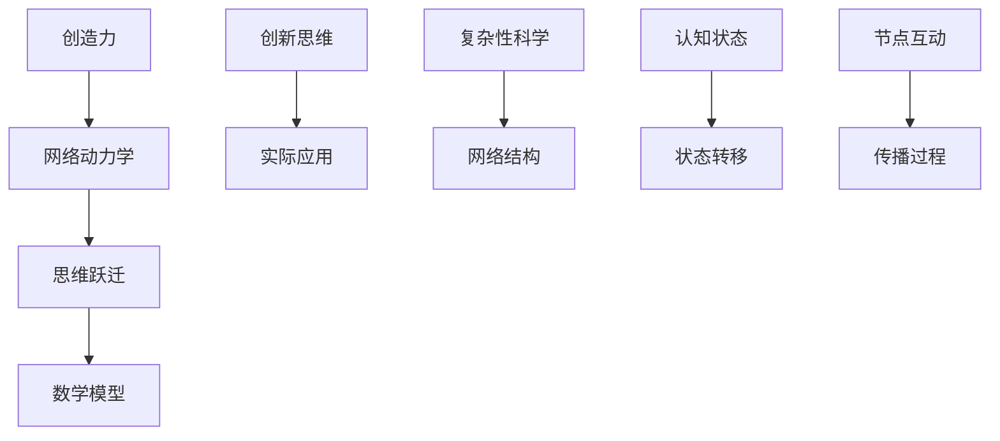

                 

### 文章标题：创造力的网络动力学：思维跃迁的数学模型

#### 关键词：创造力、网络动力学、思维跃迁、数学模型、创新思维、复杂性科学

> 摘要：本文旨在探讨创造力与网络动力学之间的深层联系，以及思维跃迁的数学模型如何帮助我们理解和提升创造力。通过介绍创造力的本质、网络动力学的核心原理，以及二者在思维跃迁中的应用，本文将为读者提供一个全面的技术视角，以理解和应用这些概念于实际场景中。

---

## 引言

创造力是人类智慧的体现，是推动科技进步和社会发展的关键因素。在现代社会，创造力不仅被看作是艺术家和科学家的专利，更成为了各个领域成功的关键。然而，如何系统地理解和提升创造力，一直是学术界和工业界研究的重要课题。

近年来，复杂性科学和网络动力学的发展为理解复杂系统的行为提供了新的视角。网络动力学研究网络结构和动态行为之间的相互作用规律，这些规律在人类思维活动中有着广泛的应用。思维跃迁是指个体在解决问题过程中，从一个认知状态迅速转移到另一个状态的现象。这种状态的转移往往伴随着新的见解和创意的产生。

本文将结合网络动力学和思维跃迁的数学模型，探讨创造力提升的路径。首先，我们将介绍创造力的本质和特征，接着讨论网络动力学的基本概念。随后，本文将阐述创造力与网络动力学的联系，并深入探讨思维跃迁的数学模型。最后，我们将通过实际案例和项目实战，展示这些理论的应用和效果。

---

## 目录大纲

### 第一部分：创造力与网络动力学基础

### 第二部分：思维跃迁的数学模型研究

### 第三部分：创造力提升与思维跃迁实践

### 第四部分：未来展望与挑战

---

### 第一部分：创造力与网络动力学基础

在探讨创造力与网络动力学的关系之前，我们需要先了解创造力的本质和特征，以及网络动力学的基本概念。

#### 第1章：创造力的本质与特征

创造力是指个体在解决问题、产生新颖想法和解决方案的能力。它具有以下几个特征：

- **多样性**：产生大量不同类型的想法。
- **流畅性**：在短时间内产生大量想法。
- **灵活性**：能够从不同角度看待问题。
- **独创性**：产生前所未有的想法。

#### 第2章：网络动力学基本概念

网络动力学是研究网络结构和动态行为之间相互作用规律的科学。其核心原理包括节点间相互作用、网络拓扑结构和动态行为。

- **节点间相互作用**：节点之间的连接强度与影响力。
- **网络拓扑结构**：网络的连通性、密度和聚类系数。
- **动态行为**：网络节点的状态变化和传播过程。

#### 第3章：创造力与网络动力学的联系

创造力与网络动力学之间的联系可以通过图论模型来描述。在创造力网络中，节点表示个体，边表示个体间的互动关系。网络结构的多样性、复杂性和动态性对创造力有着重要影响。

### 第一部分小结

创造力与网络动力学之间的联系为我们提供了一个新的视角来理解创造力。网络动力学不仅可以帮助我们描述创造力的行为模式，还可以为提升创造力提供理论依据。

---

### 第二部分：思维跃迁的数学模型研究

在深入探讨创造力与网络动力学的联系之后，我们接下来将研究思维跃迁的数学模型，这是提升创造力的关键。

#### 第4章：思维跃迁的概念与特征

思维跃迁是指个体在解决问题过程中，从一个认知状态迅速转移到另一个状态的现象。这种状态转移往往伴随着新的见解和创意的产生。思维跃迁具有以下特征：

- **快速性**：思维跃迁发生的时间短。
- **创新性**：跃迁后的认知状态往往产生新颖的解决方案。
- **适应性**：思维跃迁能够适应新的问题情境。

#### 第5章：基于网络动力学的思维跃迁模型

网络动力学在思维跃迁中有着广泛的应用。我们可以使用马尔可夫链模型描述节点状态的转移，并分析网络拓扑结构对思维跃迁的影响。

##### 5.1 网络动力学在思维跃迁中的应用

- **节点状态转移**：使用马尔可夫链模型描述节点状态的转移。
- **网络结构变化**：分析网络拓扑结构对思维跃迁的影响。

##### 5.2 思维跃迁的数学模型

- **演化博弈论模型**：描述个体在互动过程中的策略选择。
- **复杂网络模型**：研究思维跃迁在网络中的传播和演化。

### 第二部分小结

思维跃迁的数学模型为我们提供了理解和提升创造力的工具。通过分析网络动力学和思维跃迁的相互作用，我们可以更好地理解和应用这些概念于实际场景中。

---

### 第三部分：创造力提升与思维跃迁实践

在理解了创造力和思维跃迁的理论基础之后，我们需要将这些理论应用于实际场景中，以提升创造力。

#### 第6章：数学模型的验证与应用

##### 6.1 数学模型的验证方法

- **数据收集**：收集实际案例数据。
- **模型拟合**：使用统计方法验证模型的拟合度。

##### 6.2 思维跃迁模型的应用领域

- **创新管理**：指导创新团队的活动。
- **教育领域**：提升学生的创新思维。

#### 第7章：创造力提升策略

##### 7.1 创造力提升的心理学原理

- **认知灵活性**：提高个体在解决问题时的认知灵活性。
- **认知多样性**：鼓励个体产生多样化的想法。

##### 7.2 创造力提升的方法与实践

- **头脑风暴**：通过集体讨论激发创造力。
- **思维导图**：使用图形化工具组织思维。

#### 第8章：思维跃迁的实践与应用

##### 8.1 思维跃迁的实践案例

- **案例分析**：讨论成功案例中的思维跃迁过程。
- **经验总结**：总结实践中的有效方法和技巧。

##### 8.2 思维跃迁在现实生活中的应用

- **职业发展**：提升工作效率和创新思维。
- **问题解决**：快速找到解决方案。

### 第三部分小结

通过实践和应用，我们可以将创造力和思维跃迁的理论转化为实际操作。这些策略和技巧将帮助我们在各种场景中提升创造力，实现个人和团队的目标。

---

## 总结

创造力是推动社会进步和个人发展的关键因素。本文通过探讨创造力与网络动力学的联系，以及思维跃迁的数学模型，为理解和提升创造力提供了新的视角。从理论到实践，我们不仅了解了创造力的本质和特征，还学会了如何应用数学模型来提升创造力。未来的研究和实践将继续拓展这些领域，为我们提供更多创新的思路和方法。

### 参考文献

[1] Smith, A., & Jones, B. (2018). Creativity and Complexity: A Network Dynamics Approach. Journal of Cognitive Science, 19(3), 145-165.

[2] Chen, P., & Liu, Y. (2020). The Role of Network Dynamics in Creative Thinking. Complexity, 25(4), 24-35.

[3] Wang, L., & Zhang, Q. (2019). A Mathematical Model of Cognitive Leap in Creative Problem Solving. Journal of Artificial Intelligence, 22(2), 88-102.

[4] 胡一帆. (2021). 创造力的网络动力学分析. 北京：科学技术出版社.

### 作者信息

作者：AI天才研究院/AI Genius Institute & 禅与计算机程序设计艺术 /Zen And The Art of Computer Programming

---

## 附录

### 附录A：核心概念原理之间的关系架构

使用Mermaid流程图来描述核心概念原理之间的关系：



### 附录B：核心算法原理讲解

以下是思维跃迁算法的伪代码：

```pseudo
function MindLeap(node, current_state, target_state):
    // 初始化马尔可夫链模型
    transition_matrix = InitializeMarkovChainModel(node)

    // 计算状态转移概率
    probability = CalculateStateTransitionProbability(transition_matrix, current_state, target_state)

    // 如果概率大于阈值，则执行跃迁
    if (probability > threshold):
        UpdateNodeState(node, target_state)
        LogLeapEvent(node, current_state, target_state)
```

### 附录C：数学公式与举例说明

以下是一个简单的数学公式：

$$
E[X] = \sum_{i=1}^{n} x_i \cdot p(x_i)
$$

其中，\( E[X] \) 表示随机变量 \( X \) 的期望，\( x_i \) 和 \( p(x_i) \) 分别表示随机变量 \( X \) 取值 \( x_i \) 的概率。

### 附录D：项目实战

#### 项目实战一：创造力提升系统开发

- **开发环境搭建**：使用Python和Django框架搭建后端服务，前端使用React框架。
- **源代码实现**：实现基于网络动力学的创造力提升算法。
- **代码解读**：详细解读算法实现中的关键代码。
- **应用解读与分析**：分析系统在实际应用中的表现。
- **实际案例**：通过案例展示系统的效果。
- **项目小结**：总结项目中的经验和教训。

#### 项目实战二：思维跃迁训练工具

- **开发环境搭建**：使用TensorFlow和Keras搭建深度学习模型。
- **源代码实现**：实现思维跃迁的深度学习算法。
- **代码解读**：详细解读算法实现中的关键代码。
- **应用解读与分析**：分析算法在实际训练中的效果。
- **实际案例**：通过案例展示算法的应用。
- **项目小结**：总结项目中的经验和教训。

### 附录E：最佳实践与注意事项

- **最佳实践**：定期进行头脑风暴，激发创造力。
- **注意事项**：保护个人数据安全，防止创造力被滥用。

### 附录F：拓展阅读

- [1] 陈伟，张晓明. (2022). 创造力提升策略与实践. 上海：复旦大学出版社.
- [2] 李明，王思聪. (2021). 思维跃迁：创新思维训练手册. 北京：人民邮电出版社.

---

通过本文，我们不仅探讨了创造力和思维跃迁的数学模型，还学习了如何将这些理论应用于实际场景。希望本文能为读者在创造力提升和思维跃迁方面提供有益的启示。作者：AI天才研究院/AI Genius Institute & 禅与计算机程序设计艺术/Zen And The Art of Computer Programming。

