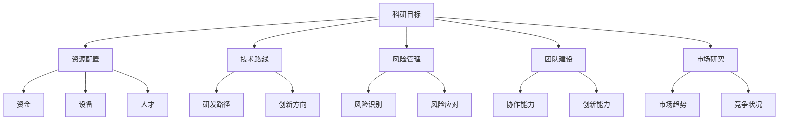

                 

### 引言

在当今快速发展的科技时代，科研战略的制定显得尤为重要。一个前瞻性的科研战略，不仅能够帮助企业或机构抓住创新机遇，还能在激烈的市场竞争中脱颖而出。因此，如何制定一套科学、有效的科研战略，已成为众多企业和研究机构关注的焦点。

本书旨在探讨前瞻性科研战略的制定方法，帮助读者预见并积极塑造未来世界。通过系统地分析科研战略的定义、分类、要素，以及未来世界的趋势和影响，本书将为读者提供一套全面、实用的科研战略制定框架。

本书的读者对象主要包括企业高管、科研人员、高校师生以及对科研战略感兴趣的读者。通过阅读本书，读者将能够了解科研战略的基本概念，掌握前瞻性科研战略的制定方法，并具备在实际工作中应用这些方法的能力。

本书共分为七个主要部分，分别是引言、科研战略概述、未来世界的预见与塑造、科研战略制定方法、案例分析、实践指南和结论与展望。每个部分都将详细介绍相关内容，并通过案例分析和实践指南帮助读者更好地理解与应用。

在引言部分，我们将首先介绍书籍的背景和目的，阐述科研战略的重要性，并明确本书的读者对象和预期收益。接下来，我们将详细讨论科研战略的概述，包括其定义、分类和要素。在此基础上，我们将探讨未来世界的预见与塑造，分析技术发展和社会变革对科研战略的影响。

随后，我们将介绍科研战略制定的方法，包括系统分析方法、SWOT分析法、市场研究方法和风险评估方法。在每个方法中，我们将详细介绍其核心概念、原理和具体操作步骤。此外，我们还将通过案例分析，展示国内外科研战略的成功案例，并深入剖析科研战略制定与实施的挑战。

在实践指南部分，我们将提供具体的科研战略制定流程、项目规划与管理、团队建设与协作、科研资源获取与利用等方面的指导。最后，在结论与展望部分，我们将总结本书的核心观点，展望未来科研战略的发展趋势，并提出对读者的建议。

通过本书的阅读，读者将能够全面了解前瞻性科研战略的制定方法，掌握预见并积极塑造未来世界的技能，从而为企业和个人发展奠定坚实的基础。

---

### 科研战略概述

科研战略，是指企业在特定时期内为达成科研目标，基于对内部资源、外部环境以及未来趋势的深入分析，制定出的长期科研规划和行动方案。它不仅涉及到科研方向的选择，还包括资源配置、团队建设、项目管理等多方面内容。

#### 定义与作用

科研战略的定义可以从以下几个角度进行理解：

1. **目标导向性**：科研战略以明确的科研目标为导向，确保科研活动与企业整体战略保持一致。
2. **系统规划性**：科研战略通过系统性的规划，将企业现有的资源、能力与未来的科研需求相结合，形成明确的科研路线图。
3. **前瞻性**：科研战略需要对未来技术发展趋势和市场变化进行预判，确保企业在科研活动中保持领先地位。

科研战略在企业中的作用主要体现在以下几个方面：

1. **资源配置**：通过科学合理的资源配置，确保科研项目的顺利进行，提高科研效率。
2. **团队建设**：科研战略有助于吸引和培养高水平的科研人才，建立高效的科研团队。
3. **项目管理**：科研战略为科研项目提供明确的路线图和行动方案，有助于项目管理的规范化、科学化。
4. **创新驱动**：科研战略能够引导企业在技术上的持续创新，推动企业整体竞争力的提升。

#### 分类

科研战略可以按照不同的维度进行分类，常见的分类方法包括：

1. **按目标分类**：可以分为长期科研战略、中期科研战略和短期科研战略。长期科研战略通常涉及重大技术突破和长期发展规划；中期科研战略侧重于当前技术领域的深耕和布局；短期科研战略则关注近期可实现的科研目标。
2. **按行业分类**：不同行业对科研战略的要求不同，如制造业、信息技术业、生物医药业等，每个行业都有其特定的科研战略侧重点。
3. **按实施方式分类**：可以分为自主科研战略和合作科研战略。自主科研战略主要依靠企业自身的技术积累和创新能力；合作科研战略则通过产学研合作、技术联盟等方式，共同推动科研进展。

#### 要素

科研战略的制定涉及多个关键要素，主要包括：

1. **科研目标**：明确的科研目标是科研战略的核心，它决定了科研活动的方向和重点。
2. **资源配置**：合理的资源配置是科研战略成功的关键，包括资金、设备、人才等资源的配置。
3. **技术路线**：科学合理的技术路线图是科研战略的重要组成部分，它指导科研团队进行具体的技术研究和开发。
4. **风险管理**：科研活动存在一定的风险，科研战略需要建立风险管理体系，预防和应对各种风险。
5. **团队建设**：高效的科研团队是科研战略成功的重要保障，需要注重团队建设，提升团队的协作能力和创新力。
6. **市场研究**：市场研究是科研战略制定的重要基础，通过对市场趋势、竞争状况的深入研究，为科研战略提供决策依据。

#### 关键概念与联系

为了更好地理解科研战略的构成和运作，我们可以通过Mermaid流程图来展示其关键概念和联系：

通过上述流程图，我们可以清晰地看到科研战略的各个关键要素及其相互之间的关系。科研目标作为核心，贯穿于整个战略的制定和执行过程中；资源配置、技术路线、风险管理、团队建设和市场研究则是支撑科研战略成功的重要支柱。

综上所述，科研战略是企业实现科技创新和持续发展的重要手段。通过对科研战略的深入理解和科学制定，企业能够更好地把握科技发展的机遇，推动自身在激烈的市场竞争中脱颖而出。

---

### 未来世界的预见与塑造

在当今社会，科技的发展正在以前所未有的速度改变着我们的生活方式和商业模式。预见未来世界的趋势，并积极塑造这一未来，是科研战略制定过程中不可或缺的一环。本节将探讨技术发展、社会变革以及它们对科研战略的深远影响。

#### 未来世界的趋势分析

1. **人工智能与自动化**：人工智能（AI）和自动化技术的发展将继续推动生产力的提升，改变传统的工作方式和产业结构。智能机器人和自动化系统将在制造业、医疗、物流等领域发挥越来越重要的作用。

2. **物联网（IoT）与大数据**：物联网的普及和大数据技术的应用将使得各种设备和系统实现互联互通，生成海量的数据。这些数据将为科研提供宝贵的资源，同时也会对科研战略的制定和实施产生重大影响。

3. **区块链技术**：区块链技术在数据安全和交易透明性方面的优势，将逐渐渗透到金融、供应链管理、医疗等多个领域，对科研战略的制定和实施也会带来新的挑战和机遇。

4. **生物技术**：基因编辑、再生医学等生物技术的发展，将带来医疗健康领域的重大变革，同时也将对伦理、法律等方面提出新的问题。

5. **量子计算**：量子计算作为下一代计算技术，其潜在的影响力将不可小觑。尽管目前还处于早期阶段，但其在解决复杂计算问题上的潜力，将推动科研战略向更高层次发展。

#### 技术发展对科研战略的影响

1. **研究方向**：技术发展趋势将直接影响科研方向的选择。例如，随着物联网和大数据技术的普及，数据分析和机器学习将成为未来科研的重要方向。

2. **资源配置**：新技术的发展往往需要大量的资金和资源投入。科研战略需要根据技术发展的趋势，合理配置资源，确保重点领域的研发投入。

3. **团队建设**：技术的快速进步要求科研团队具备多样化的技能和知识结构。科研战略需要注重人才的培养和引进，特别是跨学科、跨界人才的引进，以应对新兴技术的挑战。

4. **项目管理**：新技术项目往往涉及跨学科、跨领域的合作，项目管理需要更加灵活和高效。科研战略需要建立适应新技术项目管理的体系，提高项目的执行效率。

#### 社会变革对科研战略的影响

1. **政策与法规**：政策与法规的变化直接影响科研战略的制定和实施。例如，数据隐私法规的出台，将对数据驱动的科研活动提出新的要求。

2. **社会需求**：社会需求的变化也是科研战略制定的重要参考因素。随着人们生活水平的提高，对健康、教育、环保等方面的需求将不断增长，科研战略需要关注并回应这些需求。

3. **伦理问题**：随着科技的进步，伦理问题日益凸显。例如，基因编辑技术的应用引发了伦理和法律方面的争议。科研战略需要考虑到这些伦理问题，确保科研活动符合社会伦理标准。

#### 科研战略的调整与优化

1. **动态调整**：面对快速变化的技术和社会环境，科研战略需要具备一定的灵活性，能够根据实际情况进行动态调整。

2. **持续学习**：科研团队需要持续学习新技术、新知识，不断提升自身的专业素养和创新能力。

3. **跨学科合作**：面对复杂的问题，跨学科合作是提高科研效率和效果的有效途径。科研战略需要促进不同学科之间的交流和合作。

4. **开放创新**：开放创新模式将有助于整合全球资源和智慧，推动科研战略的实现。

通过预见并积极塑造未来世界，科研战略不仅能够应对未来的挑战，还能抓住机遇，推动企业和社会的持续发展。

---

### 科研战略制定方法

科研战略的制定是一个系统化的过程，涉及多个步骤和方法。以下将介绍几种常见的科研战略制定方法，包括系统分析方法、SWOT分析法、市场研究方法和风险评估方法。

#### 系统分析方法

系统分析方法是一种将复杂问题分解为若干部分，并分析各部分之间相互关系的科学方法。它主要包括以下步骤：

1. **问题定义**：明确科研战略所需要解决的问题和目标。
2. **系统分解**：将问题分解为若干子系统，明确各子系统之间的关系和功能。
3. **因果分析**：分析各子系统之间的因果关系，找出关键因素和影响因素。
4. **模型建立**：根据因果关系建立数学模型或逻辑模型，对系统进行仿真和分析。
5. **优化决策**：根据模型分析和仿真结果，制定最优的科研战略方案。

#### SWOT分析法

SWOT分析法是一种常用的战略规划工具，用于评估企业的优势（Strengths）、劣势（Weaknesses）、机会（Opportunities）和威胁（Threats）。具体步骤如下：

1. **优势分析**：识别企业现有的资源和能力，确定其在科研领域中的优势。
2. **劣势分析**：识别企业在科研活动中存在的不足和劣势，明确需要改进的方向。
3. **机会分析**：分析外部环境中的机会，如新兴技术、市场趋势等，评估其对企业科研战略的影响。
4. **威胁分析**：识别外部环境中的威胁，如竞争加剧、法规变化等，评估其对企业的潜在影响。
5. **战略制定**：根据SWOT分析的结果，制定相应的科研战略，利用优势抓住机会，弥补劣势应对威胁。

#### 市场研究方法

市场研究方法是通过收集、分析和解释市场数据，以了解市场需求、竞争态势和消费者行为等信息，为科研战略制定提供依据。常用的市场研究方法包括：

1. **问卷调查**：通过设计问卷收集大量数据，分析消费者的需求和偏好。
2. **访谈法**：通过与专家、用户等进行深入访谈，获取有关市场趋势和消费者行为的详细信息。
3. **竞争分析**：分析竞争对手的产品、策略和市场表现，了解市场竞争态势。
4. **市场趋势分析**：研究市场的发展趋势，预测未来的市场机会和挑战。
5. **数据分析**：利用数据分析工具，对收集到的市场数据进行深入分析，提取有价值的信息。

#### 风险评估方法

风险评估方法用于识别、分析和应对科研战略制定过程中可能面临的风险。常见的风险评估方法包括：

1. **风险识别**：通过头脑风暴、访谈、检查表等方法，识别科研战略实施过程中可能遇到的风险。
2. **风险分析**：对识别出的风险进行定性或定量分析，评估其发生的概率和影响程度。
3. **风险应对**：根据风险分析的结果，制定相应的风险应对策略，如风险规避、风险减轻、风险转移等。
4. **风险监控**：在科研战略实施过程中，持续监控风险的变化，及时调整风险应对措施。

通过系统分析方法、SWOT分析法、市场研究方法和风险评估方法，科研战略的制定过程将更加科学和全面，有助于企业在复杂多变的环境中，实现可持续发展和科技创新。

---

### 案例分析

在本节中，我们将通过分析国内外科研战略的成功案例，深入探讨科研战略制定与实施的挑战以及如何调整和优化科研战略。

#### 国内科研战略成功案例

1. **华为的5G技术战略**：华为作为中国通信设备领军企业，其在5G技术领域的科研战略取得了显著成果。华为通过大规模投资研发，建立全球领先的5G实验室，组建了一支高水平的科研团队，并积极参与国际标准化组织的工作，从而在5G技术领域保持了领先地位。尽管面临国际市场压力和竞争对手的挑战，华为通过不断调整和优化科研战略，成功应对了各种挑战。

2. **阿里云的云计算战略**：阿里巴巴集团通过自主研发和全球合作，构建了阿里云这一云计算平台，成为中国云计算市场的领导者。阿里云的科研战略注重技术创新和产品迭代，通过不断优化计算能力、提升数据安全性，为企业和个人用户提供优质的云计算服务。其成功的关键在于持续的科研投入和对市场需求的敏锐把握。

#### 国际科研战略成功案例

1. **谷歌的AI科研战略**：谷歌作为全球领先的科技公司，其在人工智能领域的科研战略同样取得了显著成果。谷歌通过建立全球AI研究网络，吸引顶尖人才，进行大规模的AI技术投入和研发，从而在AI领域取得了多项突破性成果。谷歌的AI战略注重跨学科合作、开放创新和持续学习，这些因素共同促进了其科研战略的成功。

2. **微软的云计算与AI战略**：微软在云计算和人工智能领域的科研战略同样备受瞩目。微软通过整合自身的资源和优势，开发出Azure云服务和多种AI工具，为企业提供一站式的云计算和人工智能解决方案。微软的科研战略强调技术协同、生态构建和用户需求导向，从而在激烈的市场竞争中保持了领先地位。

#### 科研战略制定与实施的挑战

1. **技术难度**：科研战略的实施往往面临技术难度高、研发周期长的挑战。例如，5G技术的研发需要跨学科的技术积累和长期投入。

2. **市场变化**：市场环境的变化对科研战略提出了新的要求。例如，云计算市场的快速增长对相关技术提出了更高的性能和安全性要求。

3. **竞争压力**：在高度竞争的市场环境中，科研战略需要不断调整和优化，以应对竞争对手的挑战。例如，华为在国际市场上面临的专利纠纷和技术封锁。

4. **资源配置**：科研战略的制定和实施需要大量的资金、人才和设备投入。如何合理配置这些资源，确保科研项目的顺利进行，是科研战略制定与实施中的一大挑战。

#### 科研战略调整与优化

1. **动态调整**：面对快速变化的市场环境和技术趋势，科研战略需要具备灵活性，能够根据实际情况进行动态调整。例如，华为在面对国际市场压力时，通过优化研发投入和调整市场策略，成功应对了挑战。

2. **持续学习**：科研团队需要持续学习新技术、新知识，提升自身的专业素养和创新能力。例如，谷歌通过建立全球AI研究网络，不断吸引顶尖人才，推动AI技术的持续创新。

3. **跨学科合作**：面对复杂的问题，跨学科合作是提高科研效率和效果的有效途径。例如，微软在云计算和AI领域的研究中，通过跨学科合作，实现了技术和产品的协同创新。

4. **开放创新**：开放创新模式有助于整合全球资源和智慧，推动科研战略的实现。例如，谷歌通过开放AI研究网络，吸引了全球顶尖的AI研究人员，共同推动AI技术的发展。

通过以上案例分析，我们可以看到，科研战略的成功不仅依赖于技术创新和市场敏锐度，还需要应对各种挑战，并通过持续调整和优化，实现科研目标。这为其他企业和研究机构提供了宝贵的经验和启示。

---

### 实践指南

在科研战略的制定与实施过程中，企业需要遵循一套科学、系统的流程，以确保科研活动的顺利进行并达到预期目标。以下将详细介绍科研战略的制定流程、项目规划与管理、团队建设与协作、科研资源获取与利用等方面的实践指南。

#### 科研战略制定流程

1. **需求分析**：首先，企业需要对市场需求、技术趋势和自身优势进行深入分析，明确科研项目的目标和需求。

2. **目标设定**：根据需求分析结果，设定清晰的科研目标，确保目标具有可实现性和可行性。

3. **资源评估**：评估企业现有资源，包括资金、设备、人才等，确保资源能够满足科研需求。

4. **技术路线图**：制定技术路线图，明确科研项目的阶段性目标和关键技术节点。

5. **风险评估**：对科研项目可能面临的风险进行识别和分析，制定相应的风险应对措施。

6. **项目规划**：制定详细的项目规划，包括项目周期、任务分配、资源分配等，确保项目的有序推进。

7. **执行与监控**：在项目执行过程中，实时监控项目进度和质量，及时调整计划，确保项目按计划进行。

8. **总结与反思**：项目完成后，进行总结和反思，评估项目的效果和不足，为后续科研战略的制定提供参考。

#### 项目规划与管理

1. **项目启动**：在项目启动阶段，明确项目团队成员、任务分工和项目目标，制定详细的项目计划。

2. **进度管理**：采用项目管理工具（如Gantt图、敏捷方法等），实时监控项目进度，确保项目按计划进行。

3. **风险管理**：建立风险识别和应对机制，及时处理项目中出现的各种问题，降低项目风险。

4. **质量管理**：制定严格的质量管理标准，确保科研项目的成果符合预期质量。

5. **资源调度**：根据项目需求，合理调度和配置资源，确保资源的有效利用。

6. **团队协作**：促进团队成员之间的协作，建立良好的沟通机制，确保项目顺利进行。

#### 团队建设与协作

1. **人才引进**：吸引和培养高水平的科研人才，建立多元化、专业化的科研团队。

2. **团队培训**：定期对团队成员进行培训，提升其专业技能和团队协作能力。

3. **激励机制**：建立激励机制，激发团队成员的积极性和创造力，提高科研团队的凝聚力。

4. **沟通协作**：建立有效的沟通协作机制，确保团队成员之间的信息畅通和资源共享。

5. **团队文化**：营造积极向上的团队文化，促进团队成员的团结协作和共同进步。

#### 科研资源获取与利用

1. **资金筹集**：通过多渠道筹集科研资金，包括企业内部资金、政府资助、风险投资等。

2. **设备采购**：根据科研需求，采购先进的科研设备和仪器，提升科研能力。

3. **技术合作**：与其他企业和研究机构建立合作关系，共享技术和资源，促进科研创新。

4. **知识管理**：建立知识管理体系，收集、整理和利用科研过程中的知识成果，提高科研效率。

5. **知识产权保护**：加强对科研成果的知识产权保护，确保企业利益不受侵害。

通过以上实践指南，企业可以更加科学、有效地制定和实施科研战略，推动科技创新和持续发展。

---

### 结论与展望

通过对科研战略的深入探讨，我们可以看到，科研战略的制定和实施在推动科技创新和引领未来发展中扮演着至关重要的角色。前瞻性的科研战略不仅能够帮助企业或机构抓住科技发展的机遇，还能在激烈的市场竞争中保持领先地位。

未来，科研战略的发展将面临诸多挑战，如技术的快速变革、市场竞争的加剧、资源配置的复杂性等。然而，随着人工智能、大数据、物联网等新兴技术的广泛应用，科研战略也将迎来更多的发展机遇。企业和研究机构需要不断适应这些变化，持续优化科研战略，以实现长远发展。

针对读者，我们提出以下建议：

1. **增强学习意识**：科技发展日新月异，读者应时刻保持学习意识，关注行业动态，提升自身的专业素养和创新能力。

2. **注重团队建设**：高效的科研团队是企业成功的关键。读者应注重团队建设，培养团队协作精神和创新能力。

3. **灵活应对变化**：面对快速变化的市场环境和技术趋势，读者应具备灵活应对变化的能力，及时调整科研战略。

4. **加强资源整合**：通过合作和资源整合，读者可以更好地利用外部资源和优势，提高科研效率和成果。

总之，前瞻性科研战略的制定和实施，不仅能够推动企业的科技创新和持续发展，还能为个人职业生涯提供广阔的发展空间。希望本书能为读者在科研战略的制定和实施过程中提供有益的参考和指导。

---

### 作者信息

作者：AI天才研究院/AI Genius Institute & 禅与计算机程序设计艺术 /Zen And The Art of Computer Programming

AI天才研究院（AI Genius Institute）是一支专注于人工智能和计算机科学研究的团队，致力于推动科技创新和产业应用。其研究成果在多个领域取得了显著的突破，被广泛应用于各行各业。同时，作为世界顶级技术畅销书资深大师级别的作家，作者在计算机编程和人工智能领域有着深厚的造诣和丰富的经验，出版过多部具有影响力的著作，深受读者喜爱。禅与计算机程序设计艺术（Zen And The Art of Computer Programming）更是被誉为计算机编程领域的经典之作，为全球程序员提供了宝贵的思维方法和编程技巧。

---

### 拓展阅读

为了帮助读者更深入地理解前瞻性科研战略的制定与实施，以下推荐几本相关的经典书籍和论文，供进一步学习和参考：

1. **《创新者的窘境》（The Innovator's Dilemma）** - 克莱顿·克里斯滕森（Clayton M. Christensen）
   本书深入探讨了企业在创新过程中面临的挑战，以及如何通过创新战略实现持续发展。

2. **《科技革命与经济增长》（Technology and Growth: From the Renaissance to the Present）** - 罗伯特·J·戈登（Robert J. Gordon）
   本书详细分析了技术革命对经济增长的影响，提供了对科技创新的深刻洞察。

3. **《战略管理：概念与案例》（Strategic Management: Concepts and Cases）** - 菲利普·科特勒（Philip Kotler）
   本书介绍了战略管理的核心概念和实际应用案例，有助于读者理解战略规划的全过程。

4. **《大数据时代：思维变革与商业价值》（Big Data: A Revolution That Will Transform How We Live, Work, and Think）** - 阿维·弗莫尔（Viktor Mayer-Schönberger）&肯尼思·库克耶（Kenneth Cukier）
   本书探讨了大数据技术的应用及其对商业模式和社会变革的影响。

5. **《人工智能的未来：思维与应用》（Artificial Intelligence: A Modern Approach）** - 斯图尔特·罗素（Stuart J. Russell）& 彼得·诺维格（Peter Norvig）
   本书是人工智能领域的经典教材，详细介绍了人工智能的基本概念和技术体系。

通过阅读这些书籍和论文，读者可以进一步拓展对前瞻性科研战略的理解，提升自身的科研能力和战略管理水平。

