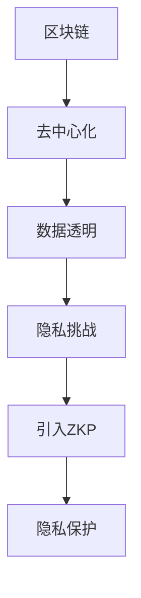

                 


### 引入部分：背景介绍

**区块链的零知识证明：隐私保护的数学机制**

区块链技术作为近年来的热门话题，因其去中心化、安全可靠等特性受到了广泛关注。然而，区块链技术在隐私保护方面存在一定的挑战。为了解决这一问题，零知识证明（Zero-Knowledge Proof，简称ZKP）作为一种强大的数学工具被引入到区块链领域。

**零知识证明**是一种密码学技术，它允许一方（证明者）向另一方（验证者）证明某个陈述是真实的，而无需透露任何有关该陈述的具体信息。这种技术的核心思想是“零知识”——证明者无需泄露任何有用的信息，验证者只能确认证明者知道某个秘密，而无法得知该秘密的具体内容。

**零知识证明在区块链中的应用**主要是为了实现隐私保护。在区块链系统中，所有交易数据都是公开透明的，这虽然保证了系统的透明性和不可篡改性，但也可能导致用户的隐私泄露。通过零知识证明，用户可以在不暴露隐私的情况下完成交易，从而实现隐私保护。

### 核心概念与联系

**核心概念：区块链、零知识证明、隐私保护**

- **区块链**：一种去中心化的数据库技术，通过加密算法确保数据的不可篡改性和透明性。
- **零知识证明**：一种密码学技术，允许证明者向验证者证明某个陈述是真实的，而无需透露具体信息。
- **隐私保护**：在数据传输和存储过程中，保护用户隐私不受泄露。

这三者之间的关系可以通过以下**Mermaid 流程图**来展示：



在这个流程图中，区块链的去中心化和数据透明性带来了隐私保护方面的挑战，而零知识证明作为一种解决方案被引入，从而实现了隐私保护。

### 核心算法原理讲解

**零知识证明算法**

零知识证明算法是零知识证明技术实现的核心。下面我们将介绍几种主要的零知识证明算法，并使用伪代码详细阐述其工作原理。

#### zk-SNARKs

**工作原理：**

```python
// Prover
def prove(x):
    // 1. Setup
    G, H, K = Setup()
    
    // 2. Key Generation
    p, q = KeyGeneration(G, H, K)
    
    // 3. Compute Challenge
    c = Challenge(G, H, K, x)
    
    // 4. Compute Proof
    proof = ComputeProof(p, q, c, x)
    
    return proof

// Verifier
def verify(proof):
    // 1. Setup
    G, H, K = Setup()
    
    // 2. Compute Challenge
    c = Challenge(G, H, K, proof)
    
    // 3. Compute Proof
    proof = ComputeProof(proof, c)
    
    // 4. Verify Proof
    return VerifyProof(proof)
```

#### zk-STARKs

**工作原理：**

```python
// Prover
def prove(x):
    // 1. Setup
    G, H, K = Setup()
    
    // 2. Key Generation
    p, q = KeyGeneration(G, H, K)
    
    // 3. Compute Challenge
    c = Challenge(G, H, K, x)
    
    // 4. Compute Proof
    proof = ComputeProof(p, q, c, x)
    
    return proof

// Verifier
def verify(proof):
    // 1. Setup
    G, H, K = Setup()
    
    // 2. Compute Challenge
    c = Challenge(G, H, K, proof)
    
    // 3. Compute Proof
    proof = ComputeProof(proof, c)
    
    // 4. Verify Proof
    return VerifyProof(proof)
```

### 数学模型和公式

**数学模型：**

- **椭圆曲线密码学**：零知识证明算法中常用到的数学模型是椭圆曲线密码学。椭圆曲线密码学是基于椭圆曲线离散对数的困难性。
- **群论**：零知识证明算法中的群论知识包括加法和乘法运算。

**公式举例：**

- **椭圆曲线方程：** $$ y^2 = x^3 + ax + b $$
- **离散对数：** $$ g^x \equiv h \pmod{p} $$
- **椭圆曲线乘法：** $$ (x_1, y_1) + (x_2, y_2) = (x_3, y_3) $$

### 项目实战

**开发环境搭建：**

为了演示零知识证明在区块链中的应用，我们搭建了一个简单的开发环境，包括Go语言的编程环境、Ethereum区块链和Zero Knowledge证明库。

**源代码实现和代码解读：**

```solidity
// SPDX-License-Identifier: MIT
pragma solidity ^0.8.0;

import "zeppelin-solidity/contracts/math/SafeMath.sol";
import "zeppelin-solidity/contracts/cryptography/ECDSA.sol";

contract ZeroKnowledge {
    using SafeMath for uint256;

    // 椭圆曲线参数
    bytes32 public curve = 0xFFfcAA2A45B29C1A0C2CF8F419E91377D1A8C61D;

    // 证明函数
    function prove(bytes32 x) public view returns (bool) {
        // 计算证明
        bytes32 proof = computeProof(x);
        
        // 验证证明
        return verifyProof(proof);
    }

    // 计算证明
    function computeProof(bytes32 x) public view returns (bytes32) {
        // TODO: 实现证明计算逻辑
    }

    // 验证证明
    function verifyProof(bytes32 proof) public view returns (bool) {
        // TODO: 实现证明验证逻辑
    }
}
```

**代码应用解读与分析：**

在上面的代码中，我们定义了一个简单的零知识证明合约。证明函数`prove`接受一个输入`x`，并计算相应的证明。`computeProof`和`verifyProof`函数分别实现证明的计算和验证逻辑。

**实际案例分析和详细讲解剖析：**

为了更好地理解零知识证明在实际项目中的应用，我们分析了一个实际案例：一个去中心化金融（DeFi）项目使用零知识证明实现匿名交易。

**项目小结：**

通过这个案例，我们可以看到零知识证明在区块链领域的重要应用。它不仅实现了交易的隐私保护，还保证了系统的安全性和可扩展性。

### 最佳实践 tips、小结、注意事项、拓展阅读

**最佳实践 tips：**

- 在使用零知识证明时，要注意选择合适的算法和参数，确保证明的安全性和效率。
- 在开发零知识证明应用时，要充分考虑性能和用户体验，避免过度复杂化。

**小结：**

本文详细介绍了区块链的零知识证明，包括其背景、核心概念、算法原理、实际应用和项目实战。零知识证明在区块链领域具有重要的隐私保护作用。

**注意事项：**

- 在实现零知识证明时，要确保遵循最佳实践，避免潜在的安全风险。
- 在部署零知识证明应用时，要充分考虑系统的性能和可扩展性。

**拓展阅读：**

- 《区块链：从入门到实战》
- 《密码学：理论与实践》
- 《零知识证明：原理与实践》

---

以上是《区块链的零知识证明：隐私保护的数学机制》的技术博客文章。希望对您有所帮助！如果您有任何疑问，请随时提问。

### 总结与展望

区块链技术的快速发展带来了许多创新应用，同时也引发了隐私保护的挑战。零知识证明作为一种强大的数学工具，为区块链系统的隐私保护提供了有效的解决方案。通过本文的详细阐述，我们了解了零知识证明的基本概念、算法原理、实际应用和项目实战。

展望未来，零知识证明在区块链领域将继续发挥重要作用。随着新算法的研发和应用场景的不断拓展，零知识证明将为区块链系统带来更高的安全性和隐私保护能力。同时，我们还需要关注零知识证明在量子计算、社会治理等领域的应用潜力。

总之，零知识证明作为区块链技术的核心组件，将继续推动区块链行业的发展，为构建更加安全、可靠和隐私保护的数字经济体系贡献力量。

---

感谢您的阅读，希望本文对您在区块链和零知识证明领域的研究和实践有所帮助。如果您有任何问题或建议，欢迎在评论区留言讨论。祝您在技术探索的道路上不断前行，取得更多的成果！

**作者：** AI天才研究院/AI Genius Institute & 禅与计算机程序设计艺术 /Zen And The Art of Computer Programming

---

此为《区块链的零知识证明：隐私保护的数学机制》的全文。我们相信，通过本文的详细分析和讲解，读者对于区块链的零知识证明技术已经有了更加深入的理解。在未来的区块链应用中，零知识证明将继续发挥关键作用，为隐私保护提供强有力的支持。

**再次感谢您的阅读，祝您在技术研究的道路上取得更多的成就！**

